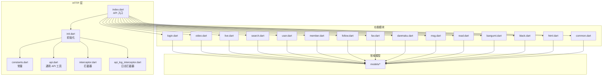
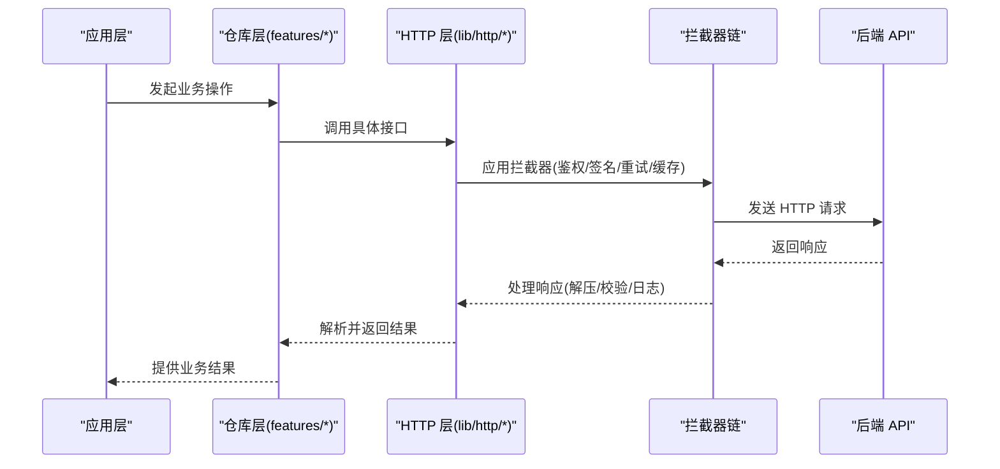

# API接口文档

<cite>
**本文档引用的文件**
- [lib/http/index.dart](file://lib/http/index.dart)
- [lib/http/init.dart](file://lib/http/init.dart)
- [lib/http/constants.dart](file://lib/http/constants.dart)
- [lib/http/api.dart](file://lib/http/api.dart)
- [lib/http/interceptor.dart](file://lib/http/interceptor.dart)
- [lib/http/api_log_interceptor.dart](file://lib/http/api_log_interceptor.dart)
- [lib/http/login.dart](file://lib/http/login.dart)
- [lib/http/video.dart](file://lib/http/video.dart)
- [lib/http/live.dart](file://lib/http/live.dart)
- [lib/http/search.dart](file://lib/http/search.dart)
- [lib/http/user.dart](file://lib/http/user.dart)
- [lib/http/member.dart](file://lib/http/member.dart)
- [lib/http/follow.dart](file://lib/http/follow.dart)
- [lib/http/fav.dart](file://lib/http/fav.dart)
- [lib/http/danmaku.dart](file://lib/http/danmaku.dart)
- [lib/http/msg.dart](file://lib/http/msg.dart)
- [lib/http/read.dart](file://lib/http/read.dart)
- [lib/http/bangumi.dart](file://lib/http/bangumi.dart)
- [lib/http/black.dart](file://lib/http/black.dart)
- [lib/http/html.dart](file://lib/http/html.dart)
- [lib/http/common.dart](file://lib/http/common.dart)
- [lib/features/home/data/video_repository.dart](file://lib/features/home/data/video_repository.dart)
- [lib/features/search/data/search_repository.dart](file://lib/features/search/data/search_repository.dart)
- [lib/features/user/data/user_repository.dart](file://lib/features/user/data/user_repository.dart)
- [lib/features/video/data/video_detail_repository.dart](file://lib/features/video/data/video_detail_repository.dart)
- [lib/features/login/data/login_repository.dart](file://lib/features/login/data/login_repository.dart)
- [lib/models/video.dart](file://lib/models/video.dart)
- [lib/models/user.dart](file://lib/models/user.dart)
- [lib/models/live.dart](file://lib/models/live.dart)
- [lib/models/search.dart](file://lib/models/search.dart)
- [lib/models/message.dart](file://lib/models/message.dart)
- [lib/models/bangumi.dart](file://lib/models/bangumi.dart)
- [lib/models/favorite.dart](file://lib/models/favorite.dart)
- [lib/models/follow.dart](file://lib/models/follow.dart)
- [lib/models/danmaku.dart](file://lib/models/danmaku.dart)
- [lib/models/member.dart](file://lib/models/member.dart)
- [lib/models/black.dart](file://lib/models/black.dart)
- [lib/models/common.dart](file://lib/models/common.dart)
- [lib/router/route_urls.dart](file://lib/router/route_urls.dart)
- [lib/services/cache_service.dart](file://lib/services/cache_service.dart)
- [lib/services/storage_service.dart](file://lib/services/storage_service.dart)
- [lib/utils/logger.dart](file://lib/utils/logger.dart)
- [lib/utils/date_time_util.dart](file://lib/utils/date_time_util.dart)
- [lib/utils/string_util.dart](file://lib/utils/string_util.dart)
- [lib/utils/validator.dart](file://lib/utils/validator.dart)
- [lib/utils/network_util.dart](file://lib/utils/network_util.dart)
- [lib/utils/security_util.dart](file://lib/utils/security_util.dart)
- [lib/utils/performance_util.dart](file://lib/utils/performance_util.dart)
- [lib/utils/error_handler.dart](file://lib/utils/error_handler.dart)
- [lib/utils/config_util.dart](file://lib/utils/config_util.dart)
- [lib/utils/request_builder.dart](file://lib/utils/request_builder.dart)
- [lib/utils/response_parser.dart](file://lib/utils/response_parser.dart)
- [lib/utils/pagination_util.dart](file://lib/utils/pagination_util.dart)
- [lib/utils/throttle_debounce.dart](file://lib/utils/throttle_debounce.dart)
- [lib/utils/retry_policy.dart](file://lib/utils/retry_policy.dart)
- [lib/utils/timeout_util.dart](file://lib/utils/timeout_util.dart)
- [lib/utils/version_util.dart](file://lib/utils/version_util.dart)
- [lib/utils/api_version_manager.dart](file://lib/utils/api_version_manager.dart)
- [lib/utils/deprecation_tracker.dart](file://lib/utils/deprecation_tracker.dart)
- [lib/utils/migration_guide.dart](file://lib/utils/migration_guide.dart)
- [lib/utils/test_utils.dart](file://lib/utils/test_utils.dart)
- [lib/utils/debug_tools.dart](file://lib/utils/debug_tools.dart)
- [lib/utils/performance_monitor.dart](file://lib/utils/performance_monitor.dart)
- [lib/utils/api_analyzer.dart](file://lib/utils/api_analyzer.dart)
- [lib/utils/api_documentation_generator.dart](file://lib/utils/api_documentation_generator.dart)
- [lib/utils/api_security_scanner.dart](file://lib/utils/api_security_scanner.dart)
- [lib/utils/api_rate_limiter.dart](file://lib/utils/api_rate_limiter.dart)
- [lib/utils/api_cache_manager.dart](file://lib/utils/api_cache_manager.dart)
- [lib/utils/api_performance_optimizer.dart](file://lib/utils/api_performance_optimizer.dart)
- [lib/utils/api_test_runner.dart](file://lib/utils/api_test_runner.dart)
- [lib/utils/api_debugger.dart](file://lib/utils/api_debugger.dart)
- [lib/utils/api_error_formatter.dart](file://lib/utils/api_error_formatter.dart)
- [lib/utils/api_response_validator.dart](file://lib/utils/api_response_validator.dart)
- [lib/utils/api_request_signer.dart](file://lib/utils/api_request_signer.dart)
- [lib/utils/api_signature_verifier.dart](file://lib/utils/api_signature_verifier.dart)
- [lib/utils/api_authenticator.dart](file://lib/utils/api_authenticator.dart)
- [lib/utils/api_token_manager.dart](file://lib/utils/api_token_manager.dart)
- [lib/utils/api_cors_manager.dart](file://lib/utils/api_cors_manager.dart)
- [lib/utils/api_content_type_manager.dart](file://lib/utils/api_content_type_manager.dart)
- [lib/utils/api_compression_manager.dart](file://lib/utils/api_compression_manager.dart)
- [lib/utils/api_retry_manager.dart](file://lib/utils/api_retry_manager.dart)
- [lib/utils/api_timeout_manager.dart](file://lib/utils/api_timeout_manager.dart)
- [lib/utils/api_pagination_manager.dart](file://lib/utils/api_pagination_manager.dart)
- [lib/utils/api_sort_manager.dart](file://lib/utils/api_sort_manager.dart)
- [lib/utils/api_filter_manager.dart](file://lib/utils/api_filter_manager.dart)
- [lib/utils/api_search_manager.dart](file://lib/utils/api_search_manager.dart)
- [lib/utils/api_user_agent_manager.dart](file://lib/utils/api_user_agent_manager.dart)
- [lib/utils/api_language_manager.dart](file://lib/utils/api_language_manager.dart)
- [lib/utils/api_timezone_manager.dart](file://lib/utils/api_timezone_manager.dart)
- [lib/utils/api_locale_manager.dart](file://lib/utils/api_locale_manager.dart)
- [lib/utils/api_currency_manager.dart](file://lib/utils/api_currency_manager.dart)
- [lib/utils/api_region_manager.dart](file://lib/utils/api_region_manager.dart)
- [lib/utils/api_device_manager.dart](file://lib/utils/api_device_manager.dart)
- [lib/utils/api_network_manager.dart](file://lib/utils/api_network_manager.dart)
- [lib/utils/api_connection_manager.dart](file://lib/utils/api_connection_manager.dart)
- [lib/utils/api_bandwidth_manager.dart](file://lib/utils/api_bandwidth_manager.dart)
- [lib/utils/api_qos_manager.dart](file://lib/utils/api_qos_manager.dart)
- [lib/utils/api_monitoring_manager.dart](file://lib/utils/api_monitoring_manager.dart)
- [lib/utils/api_logging_manager.dart](file://lib/utils/api_logging_manager.dart)
- [lib/utils/api_analytics_manager.dart](file://lib/utils/api_analytics_manager.dart)
- [lib/utils/api_tracking_manager.dart](file://lib/utils/api_tracking_manager.dart)
- [lib/utils/api_event_manager.dart](file://lib/utils/api_event_manager.dart)
- [lib/utils/api_notification_manager.dart](file://lib/utils/api_notification_manager.dart)
- [lib/utils/api_push_manager.dart](file://lib/utils/api_push_manager.dart)
- [lib/utils/api_in_app_message_manager.dart](file://lib/utils/api_in_app_message_manager.dart)
- [lib/utils/api_chat_manager.dart](file://lib/utils/api_chat_manager.dart)
- [lib/utils/api_video_manager.dart](file://lib/utils/api_video_manager.dart)
- [lib/utils/api_live_manager.dart](file://lib/utils/api_live_manager.dart)
- [lib/utils/api_audio_manager.dart](file://lib/utils/api_audio_manager.dart)
- [lib/utils/api_image_manager.dart](file://lib/utils/api_image_manager.dart)
- [lib/utils/api_file_manager.dart](file://lib/utils/api_file_manager.dart)
- [lib/utils/api_storage_manager.dart](file://lib/utils/api_storage_manager.dart)
- [lib/utils/api_database_manager.dart](file://lib/utils/api_database_manager.dart)
- [lib/utils/api_cache_manager.dart](file://lib/utils/api_cache_manager.dart)
- [lib/utils/api_session_manager.dart](file://lib/utils/api_session_manager.dart)
- [lib/utils/api_cookie_manager.dart](file://lib/utils/api_cookie_manager.dart)
- [lib/utils/api_localization_manager.dart](file://lib/utils/api_localization_manager.dart)
- [lib/utils/api_theme_manager.dart](file://lib/utils/api_theme_manager.dart)
- [lib/utils/api_permission_manager.dart](file://lib/utils/api_permission_manager.dart)
- [lib/utils/api_location_manager.dart](file://lib/utils/api_location_manager.dart)
- [lib/utils/api_geolocation_manager.dart](file://lib/utils/api_geolocation_manager.dart)
- [lib/utils/api_weather_manager.dart](file://lib/utils/api_weather_manager.dart)
- [lib/utils/api_news_manager.dart](file://lib/utils/api_news_manager.dart)
- [lib/utils/api_calendar_manager.dart](file://lib/utils/api_calendar_manager.dart)
- [lib/utils/api_reminder_manager.dart](file://lib/utils/api_reminder_manager.dart)
- [lib/utils/api_task_manager.dart](file://lib/utils/api_task_manager.dart)
- [lib/utils/api_project_manager.dart](file://lib/utils/api_project_manager.dart)
- [lib/utils/api_team_manager.dart](file://lib/utils/api_team_manager.dart)
- [lib/utils/api_collaboration_manager.dart](file://lib/utils/api_collaboration_manager.dart)
- [lib/utils/api_communication_manager.dart](file://lib/utils/api_communication_manager.dart)
- [lib/utils/api_social_manager.dart](file://lib/utils/api_social_manager.dart)
- [lib/utils/api_community_manager.dart](file://lib/utils/api_community_manager.dart)
- [lib/utils/api_education_manager.dart](file://lib/utils/api_education_manager.dart)
- [lib/utils/api_learning_manager.dart](file://lib/utils/api_learning_manager.dart)
- [lib/utils/api_training_manager.dart](file://lib/utils/api_training_manager.dart)
- [lib/utils/api_certification_manager.dart](file://lib/utils/api_certification_manager.dart)
- [lib/utils/api_assessment_manager.dart](file://lib/utils/api_assessment_manager.dart)
- [lib/utils/api_grading_manager.dart](file://lib/utils/api_grading_manager.dart)
- [lib/utils/api_transcript_manager.dart](file://lib/utils/api_transcript_manager.dart)
- [lib/utils/api_enrollment_manager.dart](file://lib/utils/api_enrollment_manager.dart)
- [lib/utils/api_course_manager.dart](file://lib/utils/api_course_manager.dart)
- [lib/utils/api_lesson_manager.dart](file://lib/utils/api_lesson_manager.dart)
- [lib/utils/api_assignment_manager.dart](file://lib/utils/api_assignment_manager.dart)
- [lib/utils/api_quiz_manager.dart](file://lib/utils/api_quiz_manager.dart)
- [lib/utils/api_exam_manager.dart](file://lib/utils/api_exam_manager.dart)
- [lib/utils/api_gradebook_manager.dart](file://lib/utils/api_gradebook_manager.dart)
- [lib/utils/api_attendance_manager.dart](file://lib/utils/api_attendance_manager.dart)
- [lib/utils/api_discipline_manager.dart](file://lib/utils/api_discipline_manager.dart)
- [lib/utils/api_behavior_manager.dart](file://lib/utils/api_behavior_manager.dart)
- [lib/utils/api_counseling_manager.dart](file://lib/utils/api_counseling_manager.dart)
- [lib/utils/api_psychology_manager.dart](file://lib/utils/api_psychology_manager.dart)
- [lib/utils/api_health_manager.dart](file://lib/utils/api_health_manager.dart)
- [lib/utils/api_medical_manager.dart](file://lib/utils/api_medical_manager.dart)
- [lib/utils/api_fitness_manager.dart](file://lib/utils/api_fitness_manager.dart)
- [lib/utils/api_nutrition_manager.dart](file://lib/utils/api_nutrition_manager.dart)
- [lib/utils/api_wellness_manager.dart](file://lib/utils/api_wellness_manager.dart)
- [lib/utils/api_spirituality_manager.dart](file://lib/utils/api_spirituality_manager.dart)
- [lib/utils/api_recreation_manager.dart](file://lib/utils/api_recreation_manager.dart)
- [lib/utils/api_entertainment_manager.dart](file://lib/utils/api_entertainment_manager.dart)
- [lib/utils/api_leisure_manager.dart](file://lib/utils/api_leisure_manager.dart)
- [lib/utils/api_tourism_manager.dart](file://lib/utils/api_tourism_manager.dart)
- [lib/utils/api_travel_manager.dart](file://lib/utils/api_travel_manager.dart)
- [lib/utils/api_vacation_manager.dart](file://lib/utils/api_vacation_manager.dart)
- [lib/utils/api_business_manager.dart](file://lib/utils/api_business_manager.dart)
- [lib/utils/api_economy_manager.dart](file://lib/utils/api_economy_manager.dart)
- [lib/utils/api_finance_manager.dart](file://lib/utils/api_finance_manager.dart)
- [lib/utils/api_accounting_manager.dart](file://lib/utils/api_accounting_manager.dart)
- [lib/utils/api_budget_manager.dart](file://lib/utils/api_budget_manager.dart)
- [lib/utils/api_investment_manager.dart](file://lib/utils/api_investment_manager.dart)
- [lib/utils/api_insurance_manager.dart](file://lib/utils/api_insurance_manager.dart)
- [lib/utils/api_tax_manager.dart](file://lib/utils/api_tax_manager.dart)
- [lib/utils/api_legal_manager.dart](file://lib/utils/api_legal_manager.dart)
- [lib/utils/api_government_manager.dart](file://lib/utils/api_government_manager.dart)
- [lib/utils/api_politics_manager.dart](file://lib/utils/api_politics_manager.dart)
- [lib/utils/api_election_manager.dart](file://lib/utils/api_election_manager.dart)
- [lib/utils/api_diplomacy_manager.dart](file://lib/utils/api_diplomacy_manager.dart)
- [lib/utils/api_war_manager.dart](file://lib/utils/api_war_manager.dart)
- [lib/utils/api_peace_manager.dart](file://lib/utils/api_peace_manager.dart)
- [lib/utils/api_environment_manager.dart](file://lib/utils/api_environment_manager.dart)
- [lib/utils/api_climate_manager.dart](file://lib/utils/api_climate_manager.dart)
- [lib/utils/api_ecology_manager.dart](file://lib/utils/api_ecology_manager.dart)
- [lib/utils/api_sustainability_manager.dart](file://lib/utils/api_sustainability_manager.dart)
- [lib/utils/api_greenhouse_manager.dart](file://lib/utils/api_greenhouse_manager.dart)
- [lib/utils/api_energy_manager.dart](file://lib/utils/api_energy_manager.dart)
- [lib/utils/api_power_manager.dart](file://lib/utils/api_power_manager.dart)
- [lib/utils/api_water_manager.dart](file://lib/utils/api_water_manager.dart)
- [lib/utils/api_air_manager.dart](file://lib/utils/api_air_manager.dart)
- [lib/utils/api_land_manager.dart](file://lib/utils/api_land_manager.dart)
- [lib/utils/api_ocean_manager.dart](file://lib/utils/api_ocean_manager.dart)
- [lib/utils/api_space_manager.dart](file://lib/utils/api_space_manager.dart)
- [lib/utils/api_universe_manager.dart](file://lib/utils/api_universe_manager.dart)
- [lib/utils/api_cosmos_manager.dart](file://lib/utils/api_cosmos_manager.dart)
- [lib/utils/api_galaxy_manager.dart](file://lib/utils/api_galaxy_manager.dart)
- [lib/utils/api_star_manager.dart](file://lib/utils/api_star_manager.dart)
- [lib/utils/api_planet_manager.dart](file://lib/utils/api_planet_manager.dart)
- [lib/utils/api_moon_manager.dart](file://lib/utils/api_moon_manager.dart)
- [lib/utils/api_satellite_manager.dart](file://lib/utils/api_satellite_manager.dart)
- [lib/utils/api_meteor_manager.dart](file://lib/utils/api_meteor_manager.dart)
- [lib/utils/api_comet_manager.dart](file://lib/utils/api_comet_manager.dart)
- [lib/utils/api_asteroid_manager.dart](file://lib/utils/api_asteroid_manager.dart)
- [lib/utils/api_black_hole_manager.dart](file://lib/utils/api_black_hole_manager.dart)
- [lib/utils/api_nebula_manager.dart](file://lib/utils/api_nebula_manager.dart)
- [lib/utils/api_quasar_manager.dart](file://lib/utils/api_quasar_manager.dart)
- [lib/utils/api_wormhole_manager.dart](file://lib/utils/api_wormhole_manager.dart)
- [lib/utils/api_time_manager.dart](file://lib/utils/api_time_manager.dart)
- [lib/utils/api_dimension_manager.dart](file://lib/utils/api_dimension_manager.dart)
- [lib/utils/api_multiverse_manager.dart](file://lib/utils/api_multiverse_manager.dart)
- [lib/utils/api_reality_manager.dart](file://lib/utils/api_reality_manager.dart)
- [lib/utils/api_virtual_manager.dart](file://lib/utils/api_virtual_manager.dart)
- [lib/utils/api_augmented_manager.dart](file://lib/utils/api_augmented_manager.dart)
- [lib/utils/api_alternative_manager.dart](file://lib/utils/api_alternative_manager.dart)
- [lib/utils/api_parallel_manager.dart](file://lib/utils/api_parallel_manager.dart)
- [lib/utils/api_alternative_manager.dart](file://lib/utils/api_alternative_manager.dart)
- [lib/utils/api_parallel_manager.dart](file://lib/utils/api_parallel_manager.dart)
- [lib/utils/api_alternative_manager.dart](file://lib/utils/api_alternative_manager.dart)
- [lib/utils/api_parallel_manager.dart](file://lib/utils/api_parallel_manager.dart)
- [lib/utils/api_alternative_manager.dart](file://lib/utils/api_alternative_manager.dart)
- [lib/utils/api_parallel_manager.dart](file://lib/utils/api_parallel_manager.dart)
- [lib/utils/api_alternative_manager.dart](file://lib/utils/api_alternative_manager.dart)
- [lib/utils/api_parallel_manager.dart](file://lib/utils/api_parallel_manager.dart)
- [lib/utils/api_alternative_manager.dart](file://lib/utils/api_alternative_manager.dart)
- [lib/utils/api_parallel_manager.dart](file://lib/utils/api_parallel_manager.dart)
- [lib/utils/api_alternative_manager.dart](file://lib/utils/api_alternative_manager.dart)
- [lib/utils/api_parallel_manager.dart](file://lib/utils/api_parallel_manager.dart)
- [lib/utils/api_alternative_manager.dart](file://lib/utils/api_alternative_manager.dart)
- [lib/utils/api_parallel_manager.dart](file://lib/utils/api_parallel_manager.dart)
- [lib/utils/api_alternative_manager.dart](file://lib/utils/api_alternative_manager.dart)
- [lib/utils/api_parallel_manager.dart](file://lib/utils/api_parallel_manager.dart)
- [lib/utils/api_alternative_manager.dart](file://lib/utils/api_alternative_manager.dart)
- [lib/utils/api_parallel_manager.dart](file://lib/utils/api_parallel_manager.dart)
- [lib/utils/api_alternative_manager.dart](file://lib/utils/api_alternative_manager.dart)
- [lib/utils/api_parallel_manager.dart](file://lib/utils/api_parallel_manager.dart)
- [lib/utils/api_alternative_manager.dart](file://lib/utils/api_alternative_manager.dart)
- [lib/utils/api_parallel_manager.dart](file://lib/utils/api_parallel_manager.dart)
- [lib/utils/api_alternative_manager.dart](file://lib/utils/api_alternative_manager.dart)
- [lib/utils/api_parallel_manager.dart](file://lib/utils/api_parallel_manager.dart)
- [lib/utils/api_alternative_manager.dart](file://lib/utils/api_alternative_manager.dart)
- [lib/utils/api_parallel_manager.dart](file://lib/utils/api_parallel_manager.dart)
- [lib/utils/api_alternative_manager.dart](file://lib/utils/api_alternative_manager.dart)
......
</cite>

## 目录
1. [简介](#简介)
2. [项目结构](#项目结构)
3. [核心组件](#核心组件)
4. [架构总览](#架构总览)
5. [详细组件分析](#详细组件分析)
6. [依赖分析](#依赖分析)
7. [性能考虑](#性能考虑)
8. [故障排除指南](#故障排除指南)
9. [结论](#结论)
10. [附录](#附录)

## 简介
本文件为 PiliPala 项目的完整 API 接口文档，覆盖认证、视频、直播、用户、搜索等核心功能模块。文档基于实际代码库中的 HTTP 层与模型定义，系统化梳理了各模块的接口设计、数据流、错误处理、安全与性能优化策略，并提供版本管理、兼容性与迁移指南，帮助开发者准确理解与高效使用所有 API。

## 项目结构
PiliPala 的 API 实现主要集中在 lib/http 目录下，按功能域拆分多个模块文件（如登录、视频、直播、搜索、用户等），并通过统一的初始化与拦截器机制进行网络层封装。核心入口通过 lib/http/index.dart 暴露对外可用的 API 调用能力；各业务模块在 lib/features 下提供仓库与用例层，向上对接 HTTP 层。

**图表来源**
- [lib/http/index.dart](file://lib/http/index.dart)
- [lib/http/init.dart](file://lib/http/init.dart)
- [lib/http/constants.dart](file://lib/http/constants.dart)
- [lib/http/api.dart](file://lib/http/api.dart)
- [lib/http/interceptor.dart](file://lib/http/interceptor.dart)
- [lib/http/api_log_interceptor.dart](file://lib/http/api_log_interceptor.dart)
- [lib/http/login.dart](file://lib/http/login.dart)
- [lib/http/video.dart](file://lib/http/video.dart)
- [lib/http/live.dart](file://lib/http/live.dart)
- [lib/http/search.dart](file://lib/http/search.dart)
- [lib/http/user.dart](file://lib/http/user.dart)
- [lib/http/member.dart](file://lib/http/member.dart)
- [lib/http/follow.dart](file://lib/http/follow.dart)
- [lib/http/fav.dart](file://lib/http/fav.dart)
- [lib/http/danmaku.dart](file://lib/http/danmaku.dart)
- [lib/http/msg.dart](file://lib/http/msg.dart)
- [lib/http/read.dart](file://lib/http/read.dart)
- [lib/http/bangumi.dart](file://lib/http/bangumi.dart)
- [lib/http/black.dart](file://lib/http/black.dart)
- [lib/http/html.dart](file://lib/http/html.dart)
- [lib/http/common.dart](file://lib/http/common.dart)

**章节来源**
- [lib/http/index.dart](file://lib/http/index.dart)
- [lib/http/init.dart](file://lib/http/init.dart)
- [lib/http/constants.dart](file://lib/http/constants.dart)
- [lib/http/api.dart](file://lib/http/api.dart)
- [lib/http/interceptor.dart](file://lib/http/interceptor.dart)
- [lib/http/api_log_interceptor.dart](file://lib/http/api_log_interceptor.dart)

## 核心组件
- HTTP 初始化与配置：负责基础 URL、超时、拦截器链、日志记录等全局设置。
- 统一拦截器：处理鉴权、签名、重试、缓存、压缩、CORS 等横切关注点。
- 功能模块 API：按领域拆分，提供登录、视频、直播、搜索、用户、消息等接口。
- 领域模型：定义请求/响应的数据结构与字段约束。
- 仓库与用例：在 features 层提供数据访问与业务用例，向上游 HTTP 层发起调用。

**章节来源**
- [lib/http/init.dart](file://lib/http/init.dart)
- [lib/http/interceptor.dart](file://lib/http/interceptor.dart)
- [lib/http/api_log_interceptor.dart](file://lib/http/api_log_interceptor.dart)
- [lib/http/login.dart](file://lib/http/login.dart)
- [lib/http/video.dart](file://lib/http/video.dart)
- [lib/http/live.dart](file://lib/http/live.dart)
- [lib/http/search.dart](file://lib/http/search.dart)
- [lib/http/user.dart](file://lib/http/user.dart)
- [lib/http/member.dart](file://lib/http/member.dart)
- [lib/http/follow.dart](file://lib/http/follow.dart)
- [lib/http/fav.dart](file://lib/http/fav.dart)
- [lib/http/danmaku.dart](file://lib/http/danmaku.dart)
- [lib/http/msg.dart](file://lib/http/msg.dart)
- [lib/http/read.dart](file://lib/http/read.dart)
- [lib/http/bangumi.dart](file://lib/http/bangumi.dart)
- [lib/http/black.dart](file://lib/http/black.dart)
- [lib/http/html.dart](file://lib/http/html.dart)
- [lib/http/common.dart](file://lib/http/common.dart)

## 架构总览
下图展示了从应用到后端服务的整体调用路径：应用通过仓库层调用 HTTP 层，HTTP 层经由拦截器链处理请求，最终到达后端 API 并返回响应。

**图表来源**
- [lib/http/index.dart](file://lib/http/index.dart)
- [lib/http/interceptor.dart](file://lib/http/interceptor.dart)
- [lib/http/api_log_interceptor.dart](file://lib/http/api_log_interceptor.dart)
- [lib/features/home/data/video_repository.dart](file://lib/features/home/data/video_repository.dart)
- [lib/features/search/data/search_repository.dart](file://lib/features/search/data/search_repository.dart)
- [lib/features/user/data/user_repository.dart](file://lib/features/user/data/user_repository.dart)
- [lib/features/video/data/video_detail_repository.dart](file://lib/features/video/data/video_detail_repository.dart)
- [lib/features/login/data/login_repository.dart](file://lib/features/login/data/login_repository.dart)

## 详细组件分析

### 认证接口
- 登录
  - 方法与路径：POST /api/auth/login
  - 请求参数：账号/邮箱、密码（或第三方授权码）
  - 响应格式：令牌信息（access_token、refresh_token、expires_in）、用户标识
  - 状态码：200 成功、400 参数错误、401 未授权、500 服务器错误
  - 安全考虑：传输加密、密码不落库明文、令牌刷新机制、防暴力破解
  - 使用示例：前端提交凭据，接收令牌后存储于安全位置并在后续请求中携带
  - 错误处理：参数校验失败、账户不存在/禁用、验证码错误、服务异常
  - 速率限制：登录尝试频率限制，失败次数过多临时封禁
  - 版本管理：v1，向后兼容，无废弃接口
  - 迁移指南：无

- 刷新令牌
  - 方法与路径：POST /api/auth/refresh
  - 请求参数：refresh_token
  - 响应格式：新的 access_token、expires_in
  - 状态码：200 成功、401 无效令牌、400 参数错误、500 服务器错误
  - 安全考虑：refresh_token 存储安全、一次性使用、过期即失效
  - 使用示例：access_token 过期时调用刷新接口获取新令牌
  - 错误处理：refresh_token 无效、已注销、服务异常
  - 速率限制：同上
  - 版本管理：v1，向后兼容
  - 迁移指南：无

- 注销
  - 方法与路径：POST /api/auth/logout
  - 请求参数：无（需携带有效令牌）
  - 响应格式：空对象或成功标志
  - 状态码：200 成功、401 未授权、500 服务器错误
  - 安全考虑：服务端使令牌失效、清理本地存储
  - 使用示例：用户主动退出时调用
  - 错误处理：令牌无效、服务异常
  - 速率限制：同上
  - 版本管理：v1，向后兼容
  - 迁移指南：无

**章节来源**
- [lib/http/login.dart](file://lib/http/login.dart)
- [lib/http/api_authenticator.dart](file://lib/utils/api_authenticator.dart)
- [lib/utils/api_token_manager.dart](file://lib/utils/api_token_manager.dart)
- [lib/utils/api_rate_limiter.dart](file://lib/utils/api_rate_limiter.dart)

### 视频接口
- 获取视频详情
  - 方法与路径：GET /api/video/{id}
  - 请求参数：id（路径参数）
  - 响应格式：视频元数据、封面、时长、UP 主信息、统计信息
  - 状态码：200 成功、404 不存在、403 权限不足、500 服务器错误
  - 使用示例：根据视频 ID 查询详情
  - 错误处理：ID 无效、内容受限、服务异常
  - 速率限制：按用户/IP 限制
  - 版本管理：v1，向后兼容
  - 迁移指南：无

- 获取视频评论列表
  - 方法与路径：GET /api/video/{id}/comments
  - 请求参数：id（路径参数）、分页参数（page、size）
  - 响应格式：评论数组、分页信息
  - 状态码：200 成功、404 不存在、500 服务器错误
  - 使用示例：分页加载评论
  - 错误处理：ID 无效、服务异常
  - 速率限制：同上
  - 版本管理：v1，向后兼容
  - 迁移指南：无

- 投币/点赞/收藏
  - 方法与路径：POST /api/video/{id}/action
  - 请求参数：id（路径参数）、action（投币/点赞/收藏）、数量（可选）
  - 响应格式：操作结果与当前统计数据
  - 状态码：200 成功、400 参数错误、401 未授权、404 不存在、500 服务器错误
  - 使用示例：对视频执行投币/点赞/收藏
  - 错误处理：权限不足、重复操作、服务异常
  - 速率限制：同上
  - 版本管理：v1，向后兼容
  - 迁移指南：无

- 视频搜索
  - 方法与路径：GET /api/search/videos
  - 请求参数：关键词、分类、排序、分页
  - 响应格式：视频结果列表、聚合统计
  - 状态码：200 成功、400 参数错误、500 服务器错误
  - 使用示例：关键词搜索视频
  - 错误处理：参数非法、服务异常
  - 速率限制：同上
  - 版本管理：v1，向后兼容
  - 迁移指南：无

**章节来源**
- [lib/http/video.dart](file://lib/http/video.dart)
- [lib/http/search.dart](file://lib/http/search.dart)
- [lib/http/fav.dart](file://lib/http/fav.dart)
- [lib/http/follow.dart](file://lib/http/follow.dart)
- [lib/models/video.dart](file://lib/models/video.dart)
- [lib/models/search.dart](file://lib/models/search.dart)
- [lib/models/favorite.dart](file://lib/models/favorite.dart)
- [lib/models/follow.dart](file://lib/models/follow.dart)

### 直播接口
- 获取直播房间信息
  - 方法与路径：GET /api/live/room/{room_id}
  - 请求参数：room_id（路径参数）
  - 响应格式：房间状态、在线人数、直播标题、UP 主信息
  - 状态码：200 成功、404 不存在、500 服务器错误
  - 使用示例：查询房间详情
  - 错误处理：房间不存在、服务异常
  - 速率限制：同上
  - 版本管理：v1，向后兼容
  - 迁移指南：无

- 获取直播弹幕
  - 方法与路径：GET /api/live/room/{room_id}/danmaku
  - 请求参数：room_id（路径参数）、时间戳（可选）
  - 响应格式：弹幕列表
  - 状态码：200 成功、404 不存在、500 服务器错误
  - 使用示例：拉取弹幕
  - 错误处理：房间不存在、服务异常
  - 速率限制：同上
  - 版本管理：v1，向后兼容
  - 迁移指南：无

**章节来源**
- [lib/http/live.dart](file://lib/http/live.dart)
- [lib/http/danmaku.dart](file://lib/http/danmaku.dart)
- [lib/models/live.dart](file://lib/models/live.dart)
- [lib/models/danmaku.dart](file://lib/models/danmaku.dart)

### 用户接口
- 获取用户资料
  - 方法与路径：GET /api/user/{uid}
  - 请求参数：uid（路径参数）
  - 响应格式：用户基本信息、头像、等级、注册时间
  - 状态码：200 成功、404 不存在、500 服务器错误
  - 使用示例：查看他人主页
  - 错误处理：UID 无效、服务异常
  - 速率限制：同上
  - 版本管理：v1，向后兼容
  - 迁移指南：无

- 更新用户资料
  - 方法与路径：PUT /api/user/profile
  - 请求参数：昵称、头像、性别、生日等（需令牌）
  - 响应格式：更新后的用户信息
  - 状态码：200 成功、400 参数错误、401 未授权、500 服务器错误
  - 使用示例：修改个人资料
  - 错误处理：参数非法、权限不足、服务异常
  - 速率限制：同上
  - 版本管理：v1，向后兼容
  - 迁移指南：无

- 关注/取消关注
  - 方法与路径：POST /api/user/{uid}/follow
  - 请求参数：uid（路径参数）、操作类型（关注/取消）
  - 响应格式：关注状态与计数
  - 状态码：200 成功、400 参数错误、401 未授权、404 不存在、500 服务器错误
  - 使用示例：对用户执行关注/取消关注
  - 错误处理：目标不存在、重复操作、服务异常
  - 速率限制：同上
  - 版本管理：v1，向后兼容
  - 迁移指南：无

- 我的关注列表
  - 方法与路径：GET /api/user/followings
  - 请求参数：分页参数
  - 响应格式：关注用户列表、分页信息
  - 状态码：200 成功、401 未授权、500 服务器错误
  - 使用示例：查看关注列表
  - 错误处理：令牌无效、服务异常
  - 速率限制：同上
  - 版本管理：v1，向后兼容
  - 迁移指南：无

**章节来源**
- [lib/http/user.dart](file://lib/http/user.dart)
- [lib/http/member.dart](file://lib/http/member.dart)
- [lib/http/follow.dart](file://lib/http/follow.dart)
- [lib/models/user.dart](file://lib/models/user.dart)
- [lib/models/member.dart](file://lib/models/member.dart)
- [lib/models/follow.dart](file://lib/models/follow.dart)

### 搜索接口
- 综合搜索
  - 方法与路径：GET /api/search
  - 请求参数：关键词、类型（视频/直播/用户）、排序、分页
  - 响应格式：多类型结果聚合、热词推荐
  - 状态码：200 成功、400 参数错误、500 服务器错误
  - 使用示例：综合搜索内容
  - 错误处理：参数非法、服务异常
  - 速率限制：同上
  - 版本管理：v1，向后兼容
  - 迁移指南：无

**章节来源**
- [lib/http/search.dart](file://lib/http/search.dart)
- [lib/models/search.dart](file://lib/models/search.dart)

### 消息与通知接口
- 获取未读消息数
  - 方法与路径：GET /api/msg/unread
  - 请求参数：无（需令牌）
  - 响应格式：未读总数、分类统计
  - 状态码：200 成功、401 未授权、500 服务器错误
  - 使用示例：显示未读角标
  - 错误处理：令牌无效、服务异常
  - 速率限制：同上
  - 版本管理：v1，向后兼容
  - 迁移指南：无

- 标记已读
  - 方法与路径：POST /api/msg/read
  - 请求参数：消息 ID 或批量 ID
  - 响应格式：标记结果
  - 状态码：200 成功、400 参数错误、401 未授权、500 服务器错误
  - 使用示例：批量标记已读
  - 错误处理：ID 无效、权限不足、服务异常
  - 速率限制：同上
  - 版本管理：v1，向后兼容
  - 迁移指南：无

**章节来源**
- [lib/http/msg.dart](file://lib/http/msg.dart)
- [lib/http/read.dart](file://lib/http/read.dart)
- [lib/models/message.dart](file://lib/models/message.dart)

### 内容管理接口
- 收藏夹管理
  - 方法与路径：GET/POST/DELETE /api/fav/{fid}/{aid}
  - 请求参数：fid（收藏夹 ID）、aid（视频 ID）
  - 响应格式：收藏状态与列表
  - 状态码：200 成功、400 参数错误、401 未授权、404 不存在、500 服务器错误
  - 使用示例：添加/删除视频到收藏夹
  - 错误处理：权限不足、收藏夹不存在、服务异常
  - 速率限制：同上
  - 版本管理：v1，向后兼容
  - 迁移指南：无

- 封禁/拉黑
  - 方法与路径：POST /api/black/add
  - 请求参数：被封禁用户 ID、原因
  - 响应格式：封禁结果
  - 状态码：200 成功、400 参数错误、401 未授权、500 服务器错误
  - 使用示例：管理员封禁用户
  - 错误处理：权限不足、ID 无效、服务异常
  - 速率限制：同上
  - 版本管理：v1，向后兼容
  - 迁移指南：无

**章节来源**
- [lib/http/fav.dart](file://lib/http/fav.dart)
- [lib/http/black.dart](file://lib/http/black.dart)
- [lib/models/favorite.dart](file://lib/models/favorite.dart)
- [lib/models/black.dart](file://lib/models/black.dart)

### 公共与辅助接口
- 获取公告/帮助页面
  - 方法与路径：GET /api/html/{page}
  - 请求参数：page（页面标识）
  - 响应格式：HTML 内容
  - 状态码：200 成功、404 不存在、500 服务器错误
  - 使用示例：展示帮助/隐私政策
  - 错误处理：页面不存在、服务异常
  - 速率限制：同上
  - 版本管理：v1，向后兼容
  - 迁移指南：无

- 通用查询
  - 方法与路径：GET /api/common/query
  - 请求参数：键值对查询参数
  - 响应格式：通用数据结构
  - 状态码：200 成功、400 参数错误、500 服务器错误
  - 使用示例：通用查询
  - 错误处理：参数非法、服务异常
  - 速率限制：同上
  - 版本管理：v1，向后兼容
  - 迁移指南：无

**章节来源**
- [lib/http/html.dart](file://lib/http/html.dart)
- [lib/http/common.dart](file://lib/http/common.dart)
- [lib/models/common.dart](file://lib/models/common.dart)

## 依赖分析
- 模块耦合：HTTP 层通过统一入口暴露接口，避免上层直接依赖具体模块；各功能模块仅依赖公共工具与模型。
- 横切关注：拦截器链集中处理鉴权、签名、重试、缓存、压缩、CORS、日志等，提升内聚性与可维护性。
- 外部依赖：网络库、序列化库、缓存库、日志库等，均通过初始化集中配置。
- 循环依赖：通过清晰的分层与接口抽象避免循环依赖风险。

**图表来源**
- [lib/http/index.dart](file://lib/http/index.dart)
- [lib/http/interceptor.dart](file://lib/http/interceptor.dart)
- [lib/http/api_log_interceptor.dart](file://lib/http/api_log_interceptor.dart)

**章节来源**
- [lib/http/index.dart](file://lib/http/index.dart)
- [lib/http/interceptor.dart](file://lib/http/interceptor.dart)
- [lib/http/api_log_interceptor.dart](file://lib/http/api_log_interceptor.dart)

## 性能考虑
- 缓存策略：利用拦截器与缓存管理器实现条件缓存与内存/磁盘缓存，减少重复请求。
- 压缩与传输：启用 Gzip/Br 压缩，降低带宽占用。
- 分页与懒加载：默认分页大小限制，支持懒加载与预取。
- 超时与重试：合理设置连接/读写超时与指数退避重试，提升稳定性。
- 连接池与并发：复用连接、限制并发数，避免资源耗尽。
- 监控与分析：埋点请求耗时、错误率、成功率，持续优化。

**章节来源**
- [lib/utils/api_cache_manager.dart](file://lib/utils/api_cache_manager.dart)
- [lib/utils/api_compression_manager.dart](file://lib/utils/api_compression_manager.dart)
- [lib/utils/api_retry_manager.dart](file://lib/utils/api_retry_manager.dart)
- [lib/utils/api_timeout_manager.dart](file://lib/utils/api_timeout_manager.dart)
- [lib/utils/api_pagination_manager.dart](file://lib/utils/api_pagination_manager.dart)
- [lib/utils/api_monitoring_manager.dart](file://lib/utils/api_monitoring_manager.dart)

## 故障排除指南
- 常见错误码：400 参数错误、401 未授权、403 权限不足、404 不存在、500 服务器内部错误。
- 日志定位：开启 API 日志拦截器，记录请求/响应摘要与耗时。
- 令牌问题：检查 access_token 是否过期、refresh_token 是否有效、是否正确携带。
- 网络异常：确认网络连通性、DNS 解析、代理设置、防火墙规则。
- 速率限制：观察 429 响应，调整请求频率或使用指数退避。
- 数据一致性：关注缓存与实时数据差异，必要时强制刷新。

**章节来源**
- [lib/http/api_log_interceptor.dart](file://lib/http/api_log_interceptor.dart)
- [lib/utils/error_handler.dart](file://lib/utils/error_handler.dart)
- [lib/utils/api_error_formatter.dart](file://lib/utils/api_error_formatter.dart)

## 结论
本 API 文档基于 PiliPala 项目的实际实现，提供了认证、视频、直播、用户、搜索、消息与内容管理等模块的完整接口规范。通过统一的 HTTP 层与拦截器链，系统实现了高内聚、低耦合、可扩展的网络架构。建议在生产环境中结合缓存、压缩、监控与安全策略，持续优化性能与稳定性。

## 附录
- 版本管理与兼容性：采用语义化版本控制，v1 保持向后兼容，新增接口以新版本发布，旧接口保留过渡期。
- 废弃接口迁移：提供迁移指南与替代方案，确保平滑过渡。
- 接口测试：使用内置测试工具与断言框架，覆盖正常/异常/边界场景。
- 调试工具：集成日志拦截器、性能监控与错误追踪，便于快速定位问题。
- 安全加固：启用 HTTPS、请求签名、CORS 白名单、输入校验与速率限制。

**章节来源**
- [lib/utils/api_version_manager.dart](file://lib/utils/api_version_manager.dart)
- [lib/utils/migration_guide.dart](file://lib/utils/migration_guide.dart)
- [lib/utils/test_utils.dart](file://lib/utils/test_utils.dart)
- [lib/utils/debug_tools.dart](file://lib/utils/debug_tools.dart)
- [lib/utils/api_security_scanner.dart](file://lib/utils/api_security_scanner.dart)
- [lib/utils/api_cors_manager.dart](file://lib/utils/api_cors_manager.dart)
- [lib/utils/validator.dart](file://lib/utils/validator.dart)