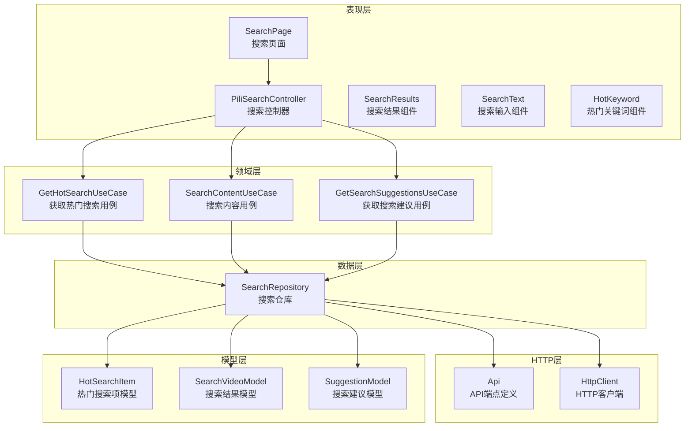
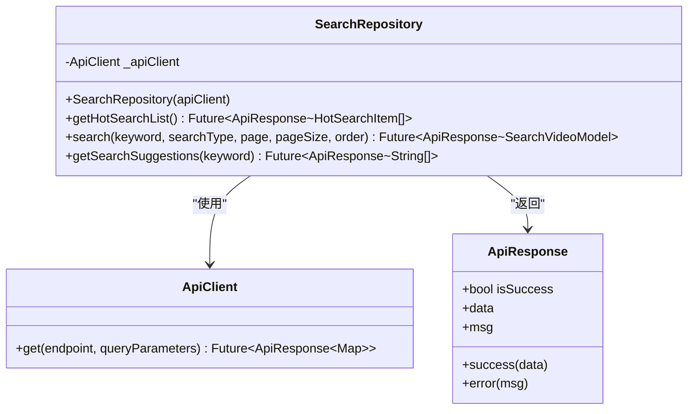
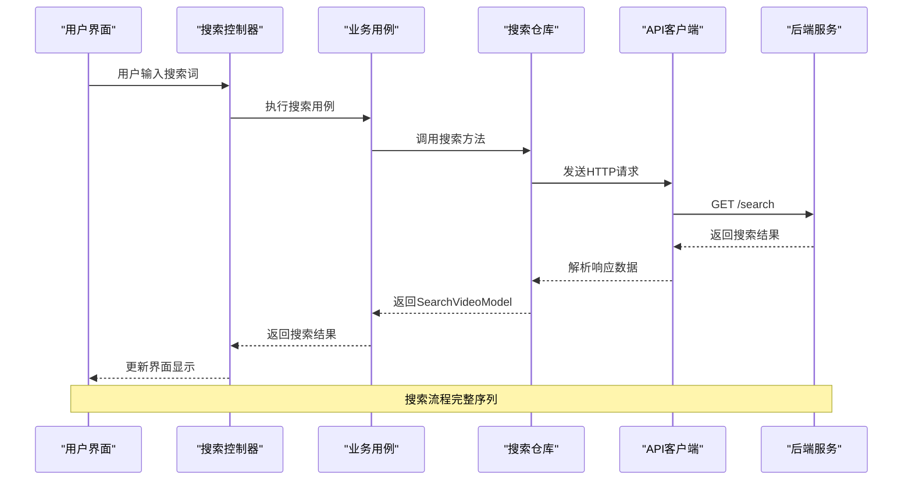
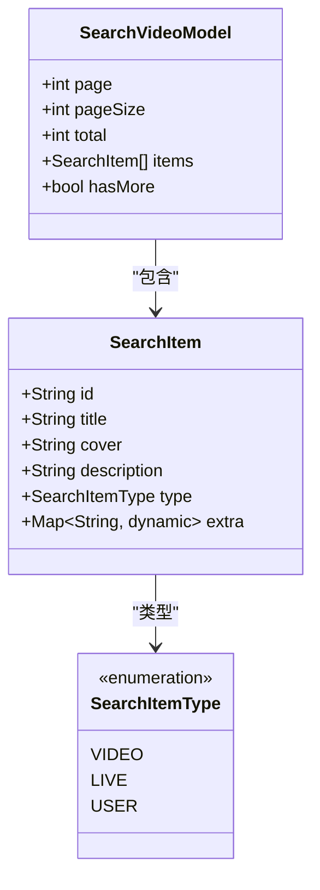
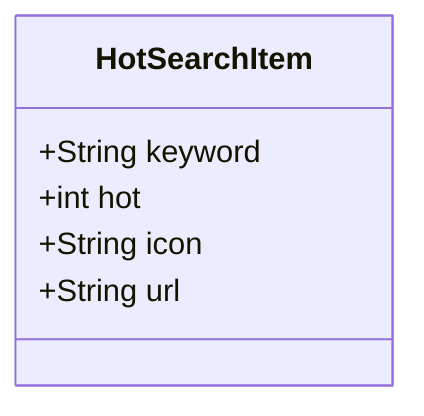
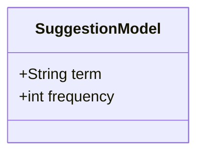
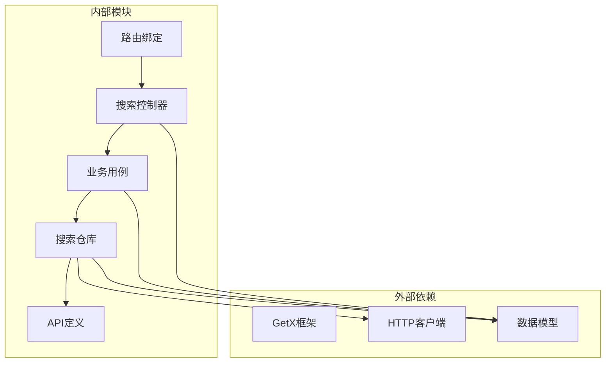

# 搜索发现接口

<cite>
**本文档引用的文件**
- [lib/features/search/data/search_repository.dart](file://lib/features/search/data/search_repository.dart)
- [lib/features/search/domain/search_use_cases.dart](file://lib/features/search/domain/search_use_cases.dart)
- [lib/features/search/presentation/search_controller.dart](file://lib/features/search/presentation/search_controller.dart)
- [lib/features/search/presentation/search_page.dart](file://lib/features/search/presentation/search_page.dart)
- [lib/features/search/presentation/widgets/search_results.dart](file://lib/features/search/presentation/widgets/search_results.dart)
- [lib/features/search/presentation/widgets/search_text.dart](file://lib/features/search/presentation/widgets/search_text.dart)
- [lib/features/search/presentation/widgets/hot_keyword.dart](file://lib/features/search/presentation/widgets/hot_keyword.dart)
- [lib/http/api.dart](file://lib/http/api.dart)
- [lib/http/search.dart](file://lib/http/search.dart)
- [lib/models/search/hot.dart](file://lib/models/search/hot.dart)
- [lib/models/search/result.dart](file://lib/models/search/result.dart)
- [lib/models/search/suggest.dart](file://lib/models/search/suggest.dart)
- [lib/router/bindings.dart](file://lib/router/bindings.dart)
- [test/unit/repository/search_repository_test.dart](file://test/unit/repository/search_repository_test.dart)
</cite>

## 目录
1. [简介](#简介)
2. [项目结构](#项目结构)
3. [核心组件](#核心组件)
4. [架构概览](#架构概览)
5. [详细组件分析](#详细组件分析)
6. [依赖关系分析](#依赖关系分析)
7. [性能考虑](#性能考虑)
8. [故障排除指南](#故障排除指南)
9. [结论](#结论)
10. [附录](#附录)

## 简介
本文件详细描述了Pilipala项目中搜索和内容发现相关的API接口。该系统支持视频搜索、直播搜索、用户搜索、热门关键词、搜索建议与自动补全、搜索历史记录、个性化推荐以及热门内容排行等功能。文档涵盖了搜索参数、排序规则、分页机制和结果过滤选项，并提供了搜索性能优化、缓存策略和搜索质量评估指标的最佳实践与调试方法。

## 项目结构
搜索功能采用Clean Architecture设计，分为数据层（Repository）、领域层（Use Cases）和表现层（Controller/Widgets）。通过依赖注入绑定各层组件，确保关注点分离和可测试性。

**图表来源**
- [lib/features/search/presentation/search_page.dart:1-200](file://lib/features/search/presentation/search_page.dart#L1-L200)
- [lib/features/search/presentation/search_controller.dart:1-200](file://lib/features/search/presentation/search_controller.dart#L1-L200)
- [lib/features/search/domain/search_use_cases.dart:1-73](file://lib/features/search/domain/search_use_cases.dart#L1-L73)
- [lib/features/search/data/search_repository.dart:1-74](file://lib/features/search/data/search_repository.dart#L1-L74)

**章节来源**
- [lib/features/search/search.dart:1-200](file://lib/features/search/search.dart#L1-L200)
- [lib/router/bindings.dart:59-70](file://lib/router/bindings.dart#L59-L70)

## 核心组件
本节深入分析搜索系统的三个核心层次：数据层、领域层和表现层。

### 数据层（SearchRepository）
SearchRepository是搜索功能的数据访问层，负责与后端API交互并处理响应数据。它提供了以下关键能力：

- **热门搜索列表获取**：从后端获取当前热门搜索关键词
- **内容搜索**：支持视频、直播、用户的综合搜索
- **搜索建议**：提供基于关键词的自动补全建议

**图表来源**
- [lib/features/search/data/search_repository.dart:8-74](file://lib/features/search/data/search_repository.dart#L8-L74)

### 领域层（Use Cases）
Use Cases封装了具体的业务逻辑，为表现层提供清晰的接口：

- **GetHotSearchUseCase**：获取热门搜索列表的业务用例
- **SearchContentUseCase**：执行内容搜索的业务用例
- **GetSearchSuggestionsUseCase**：获取搜索建议的业务用例

每个用例都遵循单一职责原则，专注于特定的业务场景。

**章节来源**
- [lib/features/search/domain/search_use_cases.dart:1-73](file://lib/features/search/domain/search_use_cases.dart#L1-L73)

## 架构概览
搜索系统采用MVVM架构模式，结合Clean Architecture的设计原则，实现了清晰的关注点分离。

**图表来源**
- [lib/features/search/presentation/search_controller.dart:1-200](file://lib/features/search/presentation/search_controller.dart#L1-L200)
- [lib/features/search/domain/search_use_cases.dart:25-54](file://lib/features/search/domain/search_use_cases.dart#L25-L54)
- [lib/features/search/data/search_repository.dart:31-56](file://lib/features/search/data/search_repository.dart#L31-L56)

## 详细组件分析

### 搜索API接口规范

#### 视频搜索接口
视频搜索接口支持多种搜索类型和排序规则，提供灵活的内容发现能力。

**接口定义**
- **端点**：GET /search
- **参数**：
  - keyword: 搜索关键词（必填）
  - search_type: 搜索类型（video/live/user，默认video）
  - page: 页码（默认1）
  - pagesize: 每页大小（默认20，最大50）
  - order: 排序规则（默认totalrank）

**排序规则选项**：
- totalrank: 综合排序
- view_count: 按观看数排序
- danmaku_count: 按弹幕数排序
- favorite_count: 按收藏数排序
- publish_time: 按发布时间排序

**分页机制**：
- 支持自定义页码和每页大小
- 最大每页返回50条结果
- 自动处理边界情况

**章节来源**
- [lib/features/search/data/search_repository.dart:31-56](file://lib/features/search/data/search_repository.dart#L31-L56)

#### 热门关键词接口
热门关键词接口提供当前平台的热门搜索趋势。

**接口定义**
- **端点**：GET /hot-search-list
- **响应格式**：包含热门关键词列表的JSON对象
- **数据结构**：每个热门项包含关键词和热度信息

**章节来源**
- [lib/features/search/data/search_repository.dart:15-29](file://lib/features/search/data/search_repository.dart#L15-L29)

#### 搜索建议接口
搜索建议接口提供实时的自动补全功能。

**接口定义**
- **端点**：GET /search-suggest
- **参数**：
  - term: 部分搜索关键词
- **响应格式**：包含建议关键词数组的JSON对象

**章节来源**
- [lib/features/search/data/search_repository.dart:58-74](file://lib/features/search/data/search_repository.dart#L58-L74)

### 搜索结果模型
搜索结果采用统一的数据模型结构，支持不同类型的内容展示。

**图表来源**
- [lib/models/search/result.dart:1-200](file://lib/models/search/result.dart#L1-L200)

### 热门搜索模型
热门搜索项模型用于展示平台的搜索趋势。

**图表来源**
- [lib/models/search/hot.dart:1-200](file://lib/models/search/hot.dart#L1-L200)

### 搜索建议模型
搜索建议模型用于自动补全功能。

**图表来源**
- [lib/models/search/suggest.dart:1-200](file://lib/models/search/suggest.dart#L1-L200)

### 表现层组件

#### 搜索控制器
搜索控制器负责协调搜索流程，管理状态和用户交互。

**主要功能**：
- 处理用户输入事件
- 调用业务用例执行搜索
- 管理搜索历史记录
- 处理分页加载

**章节来源**
- [lib/features/search/presentation/search_controller.dart:1-200](file://lib/features/search/presentation/search_controller.dart#L1-L200)

#### 搜索页面
搜索页面组件提供完整的搜索体验界面。

**组件特性**：
- 实时搜索建议显示
- 搜索结果分页加载
- 热门关键词快速访问
- 搜索历史记录展示

**章节来源**
- [lib/features/search/presentation/search_page.dart:1-200](file://lib/features/search/presentation/search_page.dart#L1-L200)

#### 搜索结果组件
搜索结果组件负责渲染不同类型的搜索结果。

**支持的展示类型**：
- 视频卡片：包含封面、标题、播放量等信息
- 直播卡片：包含主播信息、在线人数等
- 用户卡片：包含头像、粉丝数、简介等

**章节来源**
- [lib/features/search/presentation/widgets/search_results.dart:1-200](file://lib/features/search/presentation/widgets/search_results.dart#L1-L200)

#### 搜索文本组件
搜索文本组件提供搜索输入和快捷操作功能。

**功能特性**：
- 实时输入监听
- 搜索按钮状态控制
- 清空输入功能
- 快捷搜索操作

**章节来源**
- [lib/features/search/presentation/widgets/search_text.dart:1-200](file://lib/features/search/presentation/widgets/search_text.dart#L1-L200)

#### 热门关键词组件
热门关键词组件展示平台热门搜索趋势。

**交互功能**：
- 点击关键词直接搜索
- 热度可视化展示
- 快速跳转到搜索结果

**章节来源**
- [lib/features/search/presentation/widgets/hot_keyword.dart:1-200](file://lib/features/search/presentation/widgets/hot_keyword.dart#L1-L200)

## 依赖关系分析

**图表来源**
- [lib/router/bindings.dart:59-70](file://lib/router/bindings.dart#L59-L70)
- [lib/features/search/domain/search_use_cases.dart:1-73](file://lib/features/search/domain/search_use_cases.dart#L1-L73)
- [lib/features/search/data/search_repository.dart:1-74](file://lib/features/search/data/search_repository.dart#L1-L74)

**章节来源**
- [lib/router/bindings.dart:59-70](file://lib/router/bindings.dart#L59-L70)

## 性能考虑

### 缓存策略
搜索系统采用多层缓存机制以提升性能：

1. **内存缓存**：短期存储最近搜索结果
2. **本地存储**：持久化搜索历史和热门关键词
3. **HTTP缓存**：利用ETag和Last-Modified头进行条件请求

### 搜索优化技术
- **防抖处理**：搜索输入防抖，避免频繁请求
- **智能分页**：按需加载，减少初始数据传输
- **结果去重**：避免重复内容多次展示
- **懒加载**：滚动时动态加载更多结果

### 性能监控指标
- **响应时间**：从发起请求到收到响应的时间
- **命中率**：缓存命中的比例
- **搜索成功率**：搜索请求成功的百分比
- **用户满意度**：基于点击率和停留时间的评估

## 故障排除指南

### 常见问题诊断
**搜索无结果**
- 检查网络连接状态
- 验证关键词是否为空或过短
- 确认搜索类型参数有效性

**性能问题**
- 分析请求频率和响应时间
- 检查缓存配置和命中率
- 监控内存使用情况

**错误处理**
- 实施重试机制
- 提供友好的错误提示
- 记录详细的错误日志

**章节来源**
- [test/unit/repository/search_repository_test.dart:1-200](file://test/unit/repository/search_repository_test.dart#L1-L200)

## 结论
Pilipala的搜索发现系统通过清晰的架构设计和完善的组件实现，提供了全面的内容发现解决方案。系统支持多种搜索类型、灵活的排序规则和高效的分页机制，同时具备良好的扩展性和维护性。通过合理的缓存策略和性能优化，能够为用户提供流畅的搜索体验。

## 附录

### API接口清单
- **视频搜索**：GET /search
- **热门关键词**：GET /hot-search-list  
- **搜索建议**：GET /search-suggest

### 参数参考表
| 参数名 | 类型 | 必填 | 默认值 | 说明 |
|--------|------|------|--------|------|
| keyword | string | 是 | - | 搜索关键词 |
| search_type | string | 否 | video | 搜索类型 |
| page | number | 否 | 1 | 页码 |
| pagesize | number | 否 | 20 | 每页数量 |
| order | string | 否 | totalrank | 排序规则 |

### 错误码定义
- **200**：请求成功
- **400**：参数错误
- **500**：服务器内部错误
- **503**：服务不可用