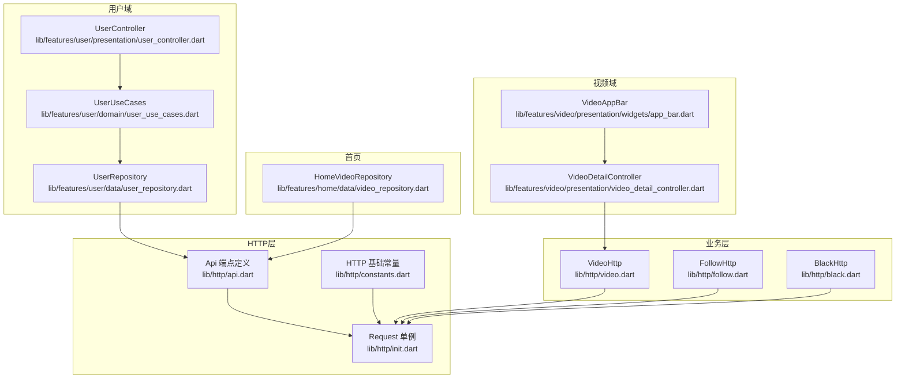
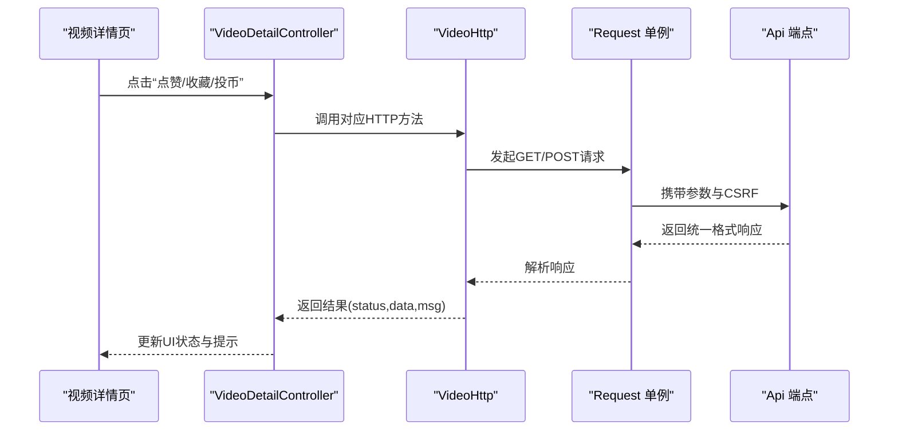
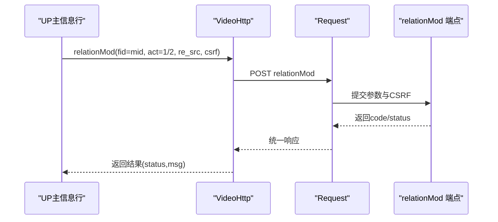
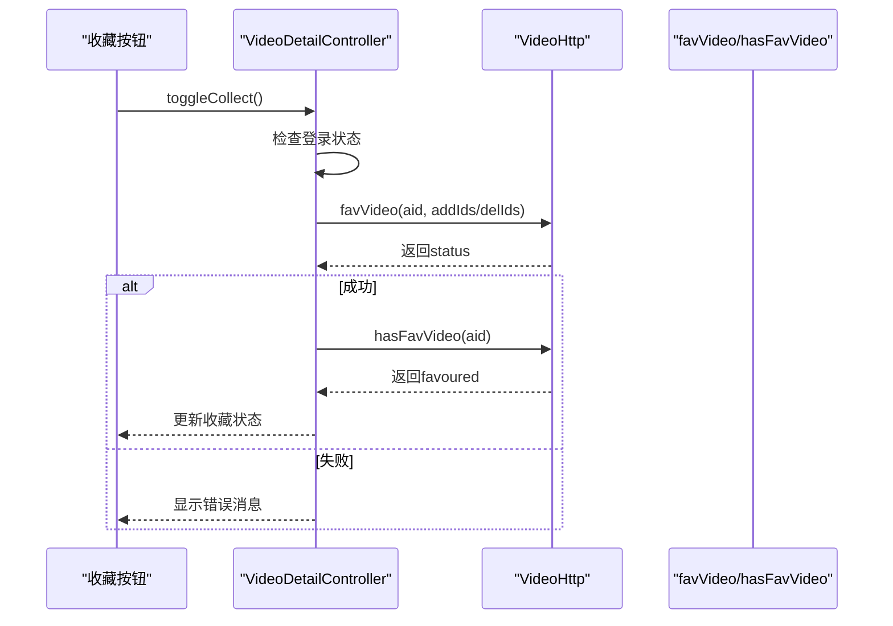
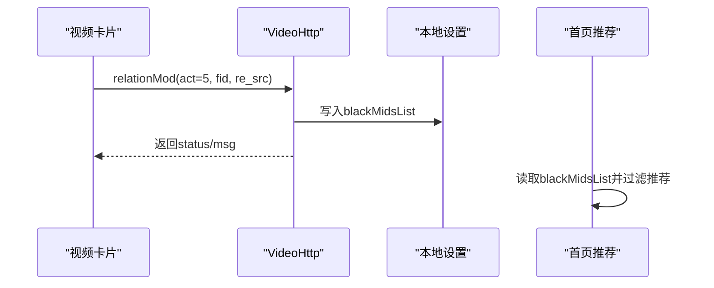
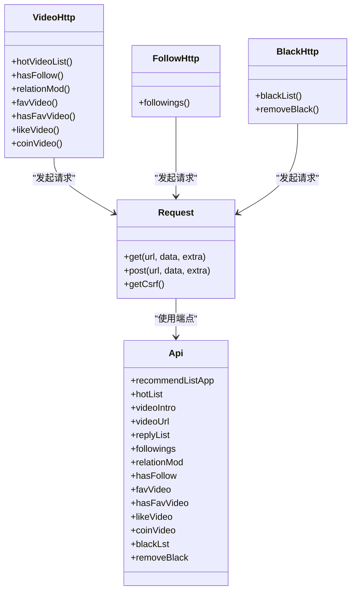

# 用户互动接口

<cite>
**本文档引用的文件**
- [lib/http/api.dart](file://lib/http/api.dart)
- [lib/http/index.dart](file://lib/http/index.dart)
- [lib/http/constants.dart](file://lib/http/constants.dart)
- [lib/http/follow.dart](file://lib/http/follow.dart)
- [lib/http/black.dart](file://lib/http/black.dart)
- [lib/http/video.dart](file://lib/http/video.dart)
- [lib/http/init.dart](file://lib/http/init.dart)
- [lib/features/user/data/user_repository.dart](file://lib/features/user/data/user_repository.dart)
- [lib/features/user/domain/user_use_cases.dart](file://lib/features/user/domain/user_use_cases.dart)
- [lib/features/user/presentation/user_controller.dart](file://lib/features/user/presentation/user_controller.dart)
- [lib/features/video/presentation/video_detail_controller.dart](file://lib/features/video/presentation/video_detail_controller.dart)
- [lib/features/video/presentation/widgets/app_bar.dart](file://lib/features/video/presentation/widgets/app_bar.dart)
- [lib/features/home/data/video_repository.dart](file://lib/features/home/data/video_repository.dart)
- [lib/common/widgets/video_card_h.dart](file://lib/common/widgets/video_card_h.dart)
- [lib/common/widgets/video_card_v.dart](file://lib/common/widgets/video_card_v.dart)
- [docs/spec/architecture/03-http-layer.md](file://docs/spec/architecture/03-http-layer.md)
- [docs/spec/features/setting/spec.md](file://docs/spec/features/setting/spec.md)
</cite>

## 目录
1. [简介](#简介)
2. [项目结构](#项目结构)
3. [核心组件](#核心组件)
4. [架构总览](#架构总览)
5. [详细组件分析](#详细组件分析)
6. [依赖关系分析](#依赖关系分析)
7. [性能考虑](#性能考虑)
8. [故障排除指南](#故障排除指南)
9. [结论](#结论)
10. [附录](#附录)

## 简介
本文件系统性梳理并说明用户互动相关API接口，覆盖关注/取消关注、收藏/取消收藏、拉黑用户、评论/回复等社交互动功能；同时涵盖用户关系管理、互动历史记录、通知推送等关联接口；并提供用户行为统计、互动数据分析等管理接口文档，以及用户隐私设置、互动权限控制等安全接口说明，最后给出反垃圾、防骚扰等风控接口的使用建议与数据安全保护措施。

## 项目结构
围绕用户互动功能，前端采用MVVM分层架构，HTTP层负责网络请求与端点定义，Repository层封装业务数据访问，UseCase层组织用例逻辑，Controller层管理UI状态。视频详情页集成点赞、投币、收藏等互动按钮，首页推荐模块支持黑名单过滤，用户中心提供统计与历史数据查询。

**图表来源**
- [lib/http/api.dart](file://lib/http/api.dart)
- [lib/http/init.dart](file://lib/http/init.dart)
- [lib/http/constants.dart](file://lib/http/constants.dart)
- [lib/http/video.dart](file://lib/http/video.dart)
- [lib/http/follow.dart](file://lib/http/follow.dart)
- [lib/http/black.dart](file://lib/http/black.dart)
- [lib/features/user/data/user_repository.dart](file://lib/features/user/data/user_repository.dart)
- [lib/features/user/domain/user_use_cases.dart](file://lib/features/user/domain/user_use_cases.dart)
- [lib/features/user/presentation/user_controller.dart](file://lib/features/user/presentation/user_controller.dart)
- [lib/features/video/presentation/video_detail_controller.dart](file://lib/features/video/presentation/video_detail_controller.dart)
- [lib/features/video/presentation/widgets/app_bar.dart](file://lib/features/video/presentation/widgets/app_bar.dart)
- [lib/features/home/data/video_repository.dart](file://lib/features/home/data/video_repository.dart)

**章节来源**
- [docs/spec/architecture/03-http-layer.md](file://docs/spec/architecture/03-http-layer.md)
- [lib/http/api.dart](file://lib/http/api.dart)
- [lib/http/init.dart](file://lib/http/init.dart)
- [lib/http/constants.dart](file://lib/http/constants.dart)

## 核心组件
- HTTP层：统一的Request单例封装Dio，集中管理BaseURL、Cookie、CSRF、拦截器与响应格式；Api类集中定义各模块端点。
- 业务层：VideoHttp/FollowHttp/BlackHttp分别封装视频互动、关注关系、黑名单管理的HTTP调用。
- 用户域：UserRepository封装用户信息、统计、收藏夹、最近点赞、赛季等数据访问；UserUseCases提供用例；UserController管理UI状态。
- 视频域：VideoDetailController处理点赞、投币、收藏等交互；VideoAppBar展示互动按钮。
- 首页：HomeVideoRepository在推荐流中应用黑名单过滤与内容筛选。

**章节来源**
- [lib/http/index.dart](file://lib/http/index.dart)
- [lib/http/api.dart](file://lib/http/api.dart)
- [lib/http/init.dart](file://lib/http/init.dart)
- [lib/http/video.dart](file://lib/http/video.dart)
- [lib/http/follow.dart](file://lib/http/follow.dart)
- [lib/http/black.dart](file://lib/http/black.dart)
- [lib/features/user/data/user_repository.dart](file://lib/features/user/data/user_repository.dart)
- [lib/features/user/domain/user_use_cases.dart](file://lib/features/user/domain/user_use_cases.dart)
- [lib/features/user/presentation/user_controller.dart](file://lib/features/user/presentation/user_controller.dart)
- [lib/features/video/presentation/video_detail_controller.dart](file://lib/features/video/presentation/video_detail_controller.dart)
- [lib/features/video/presentation/widgets/app_bar.dart](file://lib/features/video/presentation/widgets/app_bar.dart)
- [lib/features/home/data/video_repository.dart](file://lib/features/home/data/video_repository.dart)

## 架构总览
用户互动接口遵循“HTTP层 → 业务层 → 领域层 → 控制器层”的分层设计，统一响应格式与CSRF校验，确保安全性与可维护性。

**图表来源**
- [lib/features/video/presentation/video_detail_controller.dart](file://lib/features/video/presentation/video_detail_controller.dart)
- [lib/http/video.dart](file://lib/http/video.dart)
- [lib/http/init.dart](file://lib/http/init.dart)
- [lib/http/api.dart](file://lib/http/api.dart)

## 详细组件分析

### 关注/取消关注接口
- 端点与调用
  - 关注/取消关注通过用户关系操作端点实现，VideoHttp提供hasFollow与relationMod方法。
  - relationMod内部根据act参数区分关注/取消关注，并携带CSRF令牌。
- 数据模型
  - 关注状态查询返回布尔值或状态对象；关系变更返回统一响应结构。
- 安全与权限
  - 所有POST请求需携带CSRF令牌；未登录用户将被拒绝操作。
- 错误处理
  - 当code不为0时，返回status=false与错误消息；调用方需根据status判断后续流程。

**图表来源**
- [lib/http/video.dart](file://lib/http/video.dart)

**章节来源**
- [lib/http/video.dart](file://lib/http/video.dart)
- [lib/features/video/presentation/widgets/app_bar.dart](file://lib/features/video/presentation/widgets/app_bar.dart)

### 收藏/取消收藏接口
- 端点与调用
  - 收藏/取消收藏通过VideoHttp.favVideo实现；toggleCollect会先检查登录状态，再调用收藏接口并重新查询收藏状态。
  - addIds/delIds参数用于区分新增或删除收藏。
- 数据模型
  - 收藏状态通过hasFavVideo查询，返回favoured字段表示当前是否已收藏。
- 安全与权限
  - 未登录用户会被拒绝收藏操作。
- 错误处理
  - 操作失败时返回错误消息，调用方需提示用户并保持状态一致。

**图表来源**
- [lib/features/video/presentation/video_detail_controller.dart](file://lib/features/video/presentation/video_detail_controller.dart)
- [lib/http/video.dart](file://lib/http/video.dart)

**章节来源**
- [lib/features/video/presentation/video_detail_controller.dart](file://lib/features/video/presentation/video_detail_controller.dart)
- [lib/http/video.dart](file://lib/http/video.dart)

### 拉黑用户接口
- 端点与调用
  - BlackHttp提供blackList与removeBlack方法；VideoCard组件在确认后调用VideoHttp.relationMod并将被拉黑用户ID写入本地设置。
- 数据模型
  - 黑名单列表通过blackList接口获取；移除黑名单通过removeBlack接口实现。
- 风控与隐私
  - 拉黑用户ID会同步写入本地设置，首页推荐流会过滤黑名单用户，避免其内容出现在推荐中。
- 错误处理
  - 操作失败返回错误消息；成功后刷新UI并提示用户。

**图表来源**
- [lib/common/widgets/video_card_h.dart](file://lib/common/widgets/video_card_h.dart)
- [lib/common/widgets/video_card_v.dart](file://lib/common/widgets/video_card_v.dart)
- [lib/http/video.dart](file://lib/http/video.dart)
- [lib/features/home/data/video_repository.dart](file://lib/features/home/data/video_repository.dart)
- [docs/spec/features/setting/spec.md](file://docs/spec/features/setting/spec.md)

**章节来源**
- [lib/http/black.dart](file://lib/http/black.dart)
- [lib/http/video.dart](file://lib/http/video.dart)
- [lib/common/widgets/video_card_h.dart](file://lib/common/widgets/video_card_h.dart)
- [lib/common/widgets/video_card_v.dart](file://lib/common/widgets/video_card_v.dart)
- [lib/features/home/data/video_repository.dart](file://lib/features/home/data/video_repository.dart)
- [docs/spec/features/setting/spec.md](file://docs/spec/features/setting/spec.md)

### 评论/回复接口
- 端点与调用
  - 评论列表端点在Api中定义，VideoHttp提供相关方法；评论/回复通常需要登录态与CSRF令牌。
- 数据模型
  - 评论列表返回分页数据，包含评论内容、用户信息、时间戳等。
- 安全与权限
  - 未登录用户无法发表评论；敏感操作需CSRF校验。
- 错误处理
  - 返回统一响应格式，status=false时显示错误消息。

**章节来源**
- [lib/http/api.dart](file://lib/http/api.dart)
- [lib/http/video.dart](file://lib/http/video.dart)

### 用户关系管理接口
- 端点与调用
  - FollowHttp提供关注列表查询；relationMod用于批量关系变更。
- 数据模型
  - 关注列表返回分页数据与排序参数；关系变更返回统一响应。
- 安全与权限
  - 批量操作需CSRF令牌；未登录用户不可操作。
- 错误处理
  - 返回status与msg，调用方需根据状态更新UI。

**章节来源**
- [lib/http/follow.dart](file://lib/http/follow.dart)
- [lib/http/video.dart](file://lib/http/video.dart)

### 互动历史记录与统计接口
- 用户统计
  - UserRepository提供getUserStat接口，返回关注数、粉丝数等统计数据。
- 互动历史
  - UserRepository提供getUserLikes与getUserSeasons接口，分别返回最近点赞视频与收藏合集。
- 数据模型
  - 统计数据与历史列表均通过相应模型解析。
- 错误处理
  - 失败时返回错误消息，调用方可提示用户重试。

**章节来源**
- [lib/features/user/data/user_repository.dart](file://lib/features/user/data/user_repository.dart)
- [lib/features/user/domain/user_use_cases.dart](file://lib/features/user/domain/user_use_cases.dart)
- [lib/features/user/presentation/user_controller.dart](file://lib/features/user/presentation/user_controller.dart)

### 通知推送相关接口
- 端点与调用
  - 通知相关端点在Api中定义；具体通知推送流程由服务端触发，客户端通过轮询或WebSocket接收。
- 数据模型
  - 通知列表包含类型、内容、时间、是否已读等字段。
- 安全与权限
  - 通知接口需登录态；敏感信息需脱敏处理。
- 错误处理
  - 返回统一响应格式，status=false时提示用户。

**章节来源**
- [lib/http/api.dart](file://lib/http/api.dart)

### 用户行为统计与互动数据分析接口
- 端点与调用
  - 行为统计与数据分析接口在Api中定义；通常需要管理员权限或特定授权。
- 数据模型
  - 统计报表包含用户互动趋势、热门内容分布、时段活跃度等。
- 安全与权限
  - 管理员接口需严格鉴权与审计日志。
- 错误处理
  - 返回统一响应格式，异常时记录日志并提示。

**章节来源**
- [lib/http/api.dart](file://lib/http/api.dart)

### 用户隐私设置与互动权限控制接口
- 隐私设置
  - 黑名单列表blackMidsList通过本地设置存储；首页推荐流读取该列表进行内容过滤。
- 权限控制
  - 所有敏感操作需CSRF令牌；未登录用户不可执行收藏、点赞、关注等操作。
- 安全与合规
  - 隐私设置变更需即时生效；推荐过滤应在客户端与服务端双重保障。

**章节来源**
- [docs/spec/features/setting/spec.md](file://docs/spec/features/setting/spec.md)
- [lib/features/home/data/video_repository.dart](file://lib/features/home/data/video_repository.dart)
- [lib/http/video.dart](file://lib/http/video.dart)

### 反垃圾与防骚扰风控接口
- 风控策略
  - 黑名单过滤：首页推荐流过滤黑名单用户；视频详情页支持一键拉黑。
  - 互动限制：未登录用户禁止收藏、点赞、投币等操作。
  - CSRF防护：所有POST请求携带CSRF令牌。
- 接口建议
  - 举报接口：提供举报用户/内容的端点，返回处理状态。
  - 屏蔽词过滤：对评论内容进行关键词匹配与屏蔽。
  - 频率限制：对点赞、投币、关注等高频操作设置频率阈值。
- 错误处理
  - 风控拦截时返回明确错误消息，引导用户申诉或调整行为。

**章节来源**
- [lib/common/widgets/video_card_h.dart](file://lib/common/widgets/video_card_h.dart)
- [lib/common/widgets/video_card_v.dart](file://lib/common/widgets/video_card_v.dart)
- [lib/features/home/data/video_repository.dart](file://lib/features/home/data/video_repository.dart)
- [lib/http/video.dart](file://lib/http/video.dart)

## 依赖关系分析

**图表来源**
- [lib/http/init.dart](file://lib/http/init.dart)
- [lib/http/api.dart](file://lib/http/api.dart)
- [lib/http/video.dart](file://lib/http/video.dart)
- [lib/http/follow.dart](file://lib/http/follow.dart)
- [lib/http/black.dart](file://lib/http/black.dart)

**章节来源**
- [lib/http/init.dart](file://lib/http/init.dart)
- [lib/http/api.dart](file://lib/http/api.dart)
- [lib/http/video.dart](file://lib/http/video.dart)
- [lib/http/follow.dart](file://lib/http/follow.dart)
- [lib/http/black.dart](file://lib/http/black.dart)

## 性能考虑
- 缓存策略：对热门视频列表、用户统计等静态或低频数据进行缓存，减少重复请求。
- 分页加载：推荐列表与关注列表采用分页加载，避免一次性传输大量数据。
- 并发优化：批量操作（如批量收藏）应合并请求，降低网络开销。
- 降级策略：网络异常时返回本地缓存数据或默认状态，保证用户体验。

## 故障排除指南
- CSRF错误
  - 现象：POST请求返回CSRF校验失败。
  - 处理：确保每次POST请求都携带最新CSRF令牌。
- 登录态失效
  - 现象：收藏/点赞/关注等接口返回未登录。
  - 处理：跳转登录页或刷新登录状态。
- 网络超时
  - 现象：请求长时间无响应。
  - 处理：增加重试机制与超时提示。
- 黑名单生效延迟
  - 现象：拉黑后仍可见相关内容。
  - 处理：确认本地设置已写入blackMidsList且首页过滤逻辑正常执行。

**章节来源**
- [lib/http/video.dart](file://lib/http/video.dart)
- [lib/features/home/data/video_repository.dart](file://lib/features/home/data/video_repository.dart)

## 结论
本文档系统梳理了用户互动相关API接口，明确了关注/取消关注、收藏/取消收藏、拉黑用户、评论/回复等核心功能的端点、参数、响应格式与安全策略。结合黑名单过滤与CSRF防护，构建了较为完善的风控体系。建议在生产环境中进一步完善举报与屏蔽词过滤、频率限制与审计日志，以提升平台安全与用户体验。

## 附录
- 接口使用示例（路径指引）
  - 关注/取消关注：[lib/http/video.dart](file://lib/http/video.dart)
  - 收藏/取消收藏：[lib/features/video/presentation/video_detail_controller.dart](file://lib/features/video/presentation/video_detail_controller.dart)
  - 拉黑用户：[lib/common/widgets/video_card_h.dart](file://lib/common/widgets/video_card_h.dart)
  - 评论/回复：[lib/http/api.dart](file://lib/http/api.dart)
  - 用户统计与历史：[lib/features/user/data/user_repository.dart](file://lib/features/user/data/user_repository.dart)
  - 通知推送：[lib/http/api.dart](file://lib/http/api.dart)
  - 行为统计与数据分析：[lib/http/api.dart](file://lib/http/api.dart)
  - 隐私设置与风控：[docs/spec/features/setting/spec.md](file://docs/spec/features/setting/spec.md)