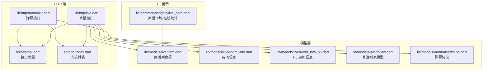
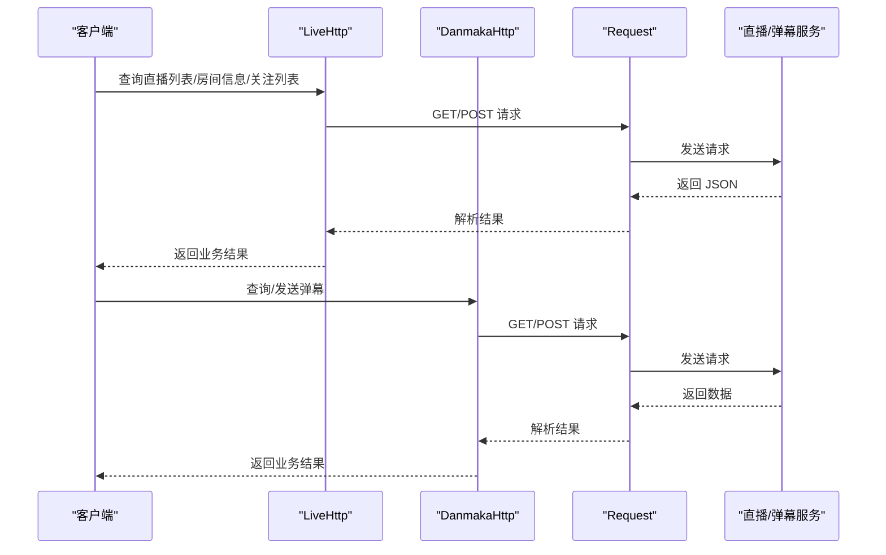
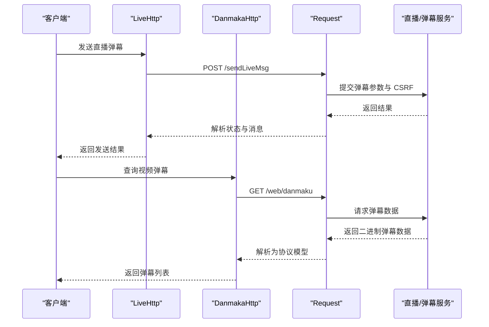
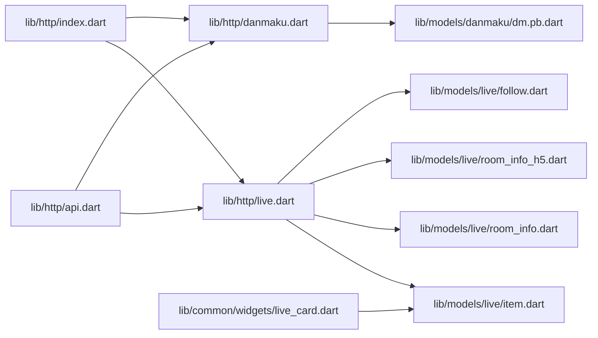

# 直播接口

<cite>
**本文引用的文件**
- [lib/http/live.dart](file://lib/http/live.dart)
- [lib/http/danmaku.dart](file://lib/http/danmaku.dart)
- [lib/http/api.dart](file://lib/http/api.dart)
- [lib/http/index.dart](file://lib/http/index.dart)
- [lib/models/live/item.dart](file://lib/models/live/item.dart)
- [lib/models/live/room_info.dart](file://lib/models/live/room_info.dart)
- [lib/models/live/room_info_h5.dart](file://lib/models/live/room_info_h5.dart)
- [lib/models/live/follow.dart](file://lib/models/live/follow.dart)
- [lib/models/danmaku/dm.pb.dart](file://lib/models/danmaku/dm.pb.dart)
- [lib/common/widgets/live_card.dart](file://lib/common/widgets/live_card.dart)
</cite>

## 目录
1. [简介](#简介)
2. [项目结构](#项目结构)
3. [核心组件](#核心组件)
4. [架构总览](#架构总览)
5. [详细组件分析](#详细组件分析)
6. [依赖关系分析](#依赖关系分析)
7. [性能考量](#性能考量)
8. [故障排查指南](#故障排查指南)
9. [结论](#结论)
10. [附录](#附录)

## 简介
本文件面向直播相关 API 的使用与集成，覆盖直播房间管理、直播状态查询、弹幕发送与接收、直播统计、关注列表、房间入口记录等能力。文档基于仓库中的 HTTP 层与模型层实现进行梳理，提供接口定义、数据模型、调用流程与实时通信机制说明，并给出安全与质量保障建议及最佳实践。

## 项目结构
直播相关能力主要分布在以下模块：
- HTTP 层：封装直播、弹幕、通用请求等接口调用
- 模型层：定义直播房间、列表项、弹幕协议等数据结构
- UI 组件：直播卡片、在线人数统计等展示组件

图表来源
- [lib/http/live.dart:1-162](file://lib/http/live.dart#L1-L162)
- [lib/http/danmaku.dart:1-91](file://lib/http/danmaku.dart#L1-L91)
- [lib/http/api.dart](file://lib/http/api.dart)
- [lib/http/index.dart](file://lib/http/index.dart)
- [lib/models/live/item.dart](file://lib/models/live/item.dart)
- [lib/models/live/room_info.dart](file://lib/models/live/room_info.dart)
- [lib/models/live/room_info_h5.dart](file://lib/models/live/room_info_h5.dart)
- [lib/models/live/follow.dart](file://lib/models/live/follow.dart)
- [lib/models/danmaku/dm.pb.dart:1690-1750](file://lib/models/danmaku/dm.pb.dart#L1690-L1750)
- [lib/common/widgets/live_card.dart:1-119](file://lib/common/widgets/live_card.dart#L1-L119)

章节来源
- [lib/http/live.dart:1-162](file://lib/http/live.dart#L1-L162)
- [lib/http/danmaku.dart:1-91](file://lib/http/danmaku.dart#L1-L91)
- [lib/http/api.dart](file://lib/http/api.dart)
- [lib/http/index.dart](file://lib/http/index.dart)
- [lib/models/live/item.dart](file://lib/models/live/item.dart)
- [lib/models/live/room_info.dart](file://lib/models/live/room_info.dart)
- [lib/models/live/room_info_h5.dart](file://lib/models/live/room_info_h5.dart)
- [lib/models/live/follow.dart](file://lib/models/live/follow.dart)
- [lib/models/danmaku/dm.pb.dart:1690-1750](file://lib/models/danmaku/dm.pb.dart#L1690-L1750)
- [lib/common/widgets/live_card.dart:1-119](file://lib/common/widgets/live_card.dart#L1-L119)

## 核心组件
- 直播 HTTP 接口：提供直播列表、房间信息、弹幕信息、发送弹幕、关注直播列表、房间入口记录等方法
- 弹幕 HTTP 接口：提供视频弹幕查询与发送
- 请求封装：统一 GET/POST 请求、CSRF 注入、响应解析
- 数据模型：直播房间、列表项、H5 房间、关注列表、弹幕协议
- UI 组件：直播卡片、在线人数统计展示

章节来源
- [lib/http/live.dart:1-162](file://lib/http/live.dart#L1-L162)
- [lib/http/danmaku.dart:1-91](file://lib/http/danmaku.dart#L1-L91)
- [lib/http/index.dart](file://lib/http/index.dart)
- [lib/models/live/item.dart](file://lib/models/live/item.dart)
- [lib/models/live/room_info.dart](file://lib/models/live/room_info.dart)
- [lib/models/live/room_info_h5.dart](file://lib/models/live/room_info_h5.dart)
- [lib/models/live/follow.dart](file://lib/models/live/follow.dart)
- [lib/models/danmaku/dm.pb.dart:1690-1750](file://lib/models/danmaku/dm.pb.dart#L1690-L1750)
- [lib/common/widgets/live_card.dart:1-119](file://lib/common/widgets/live_card.dart#L1-L119)

## 架构总览
直播接口采用“HTTP 层 + 模型层 + UI 展示”的分层设计：
- HTTP 层负责与服务端交互，封装请求与响应
- 模型层负责数据结构定义与序列化
- UI 展示层通过模型渲染直播卡片与统计数据

图表来源
- [lib/http/live.dart:10-28](file://lib/http/live.dart#L10-L28)
- [lib/http/live.dart:30-51](file://lib/http/live.dart#L30-L51)
- [lib/http/live.dart:126-147](file://lib/http/live.dart#L126-L147)
- [lib/http/danmaku.dart:7-22](file://lib/http/danmaku.dart#L7-L22)
- [lib/http/danmaku.dart:43-91](file://lib/http/danmaku.dart#L43-L91)
- [lib/http/index.dart](file://lib/http/index.dart)

## 详细组件分析

### 直播房间管理
- 直播列表
  - 方法：查询直播列表
  - 参数：页码、每页数量、排序方式等
  - 返回：状态、数据列表（映射为模型）
  - 关键路径：[lib/http/live.dart:10-28](file://lib/http/live.dart#L10-L28)
- 房间信息（Web/H5）
  - 方法：查询房间信息（含清晰度、格式、编解码等参数）
  - 方法：查询 H5 房间信息
  - 返回：状态、房间信息模型
  - 关键路径：
    - [lib/http/live.dart:30-51](file://lib/http/live.dart#L30-L51)
    - [lib/http/live.dart:53-69](file://lib/http/live.dart#L53-L69)
- 房间入口记录
  - 方法：记录房间访问
  - 关键路径：[lib/http/live.dart:149-162](file://lib/http/live.dart#L149-L162)

章节来源
- [lib/http/live.dart:10-28](file://lib/http/live.dart#L10-L28)
- [lib/http/live.dart:30-51](file://lib/http/live.dart#L30-L51)
- [lib/http/live.dart:53-69](file://lib/http/live.dart#L53-L69)
- [lib/http/live.dart:149-162](file://lib/http/live.dart#L149-L162)

### 直播状态查询与统计
- 在线人数展示
  - 组件：直播卡片中的在线人数统计
  - 数据来源：直播列表项中的在线人数字段
  - 关键路径：
    - [lib/common/widgets/live_card.dart:55-75](file://lib/common/widgets/live_card.dart#L55-L75)
    - [lib/common/widgets/live_card.dart:116-161](file://lib/common/widgets/live_card.dart#L116-L161)
    - [lib/models/live/item.dart](file://lib/models/live/item.dart)

章节来源
- [lib/common/widgets/live_card.dart:55-75](file://lib/common/widgets/live_card.dart#L55-L75)
- [lib/common/widgets/live_card.dart:116-161](file://lib/common/widgets/live_card.dart#L116-L161)
- [lib/models/live/item.dart](file://lib/models/live/item.dart)

### 弹幕发送与接收
- 弹幕信息
  - 方法：查询弹幕信息（用于建立弹幕连接或获取配置）
  - 关键路径：[lib/http/live.dart:71-88](file://lib/http/live.dart#L71-L88)
- 发送弹幕（直播）
  - 方法：发送直播弹幕（包含颜色、模式、字体、时间戳、CSRF 等）
  - 关键路径：[lib/http/live.dart:90-124](file://lib/http/live.dart#L90-L124)
- 视频弹幕查询与发送
  - 方法：查询视频弹幕（二进制协议缓冲区）
  - 方法：发送视频弹幕（含多种参数校验与 CSRF）
  - 关键路径：
    - [lib/http/danmaku.dart:7-22](file://lib/http/danmaku.dart#L7-L22)
    - [lib/http/danmaku.dart:43-91](file://lib/http/danmaku.dart#L43-L91)
- 弹幕协议模型
  - 使用 Protocol Buffers 定义弹幕元素、段落回复、播放器配置等
  - 关键路径：
    - [lib/models/danmaku/dm.pb.dart:1690-1750](file://lib/models/danmaku/dm.pb.dart#L1690-L1750)
    - [lib/models/danmaku/dm.pb.dart:4187-4225](file://lib/models/danmaku/dm.pb.dart#L4187-L4225)
    - [lib/models/danmaku/dm.pb.dart:6094-6143](file://lib/models/danmaku/dm.pb.dart#L6094-L6143)

图表来源
- [lib/http/live.dart:90-124](file://lib/http/live.dart#L90-L124)
- [lib/http/danmaku.dart:7-22](file://lib/http/danmaku.dart#L7-L22)
- [lib/http/index.dart](file://lib/http/index.dart)

章节来源
- [lib/http/live.dart:71-88](file://lib/http/live.dart#L71-L88)
- [lib/http/live.dart:90-124](file://lib/http/live.dart#L90-L124)
- [lib/http/danmaku.dart:7-22](file://lib/http/danmaku.dart#L7-L22)
- [lib/http/danmaku.dart:43-91](file://lib/http/danmaku.dart#L43-L91)
- [lib/models/danmaku/dm.pb.dart:1690-1750](file://lib/models/danmaku/dm.pb.dart#L1690-L1750)
- [lib/models/danmaku/dm.pb.dart:4187-4225](file://lib/models/danmaku/dm.pb.dart#L4187-L4225)
- [lib/models/danmaku/dm.pb.dart:6094-6143](file://lib/models/danmaku/dm.pb.dart#L6094-L6143)

### 直播互动功能
- 关注直播
  - 方法：查询正在直播的关注列表
  - 返回：状态、关注列表模型
  - 关键路径：[lib/http/live.dart:126-147](file://lib/http/live.dart#L126-L147)
- 房间入口记录
  - 方法：记录房间访问
  - 关键路径：[lib/http/live.dart:149-162](file://lib/http/live.dart#L149-L162)

章节来源
- [lib/http/live.dart:126-147](file://lib/http/live.dart#L126-L147)
- [lib/http/live.dart:149-162](file://lib/http/live.dart#L149-L162)
- [lib/models/live/follow.dart](file://lib/models/live/follow.dart)

### 实时通信机制
- 弹幕信息查询
  - 通过“弹幕信息”接口获取连接参数或配置，用于后续建立弹幕通道
  - 关键路径：[lib/http/live.dart:71-88](file://lib/http/live.dart#L71-L88)
- 弹幕协议
  - 使用 Protocol Buffers 定义弹幕元素与播放器配置，便于高效传输与解析
  - 关键路径：
    - [lib/models/danmaku/dm.pb.dart:1690-1750](file://lib/models/danmaku/dm.pb.dart#L1690-L1750)
    - [lib/models/danmaku/dm.pb.dart:4187-4225](file://lib/models/danmaku/dm.pb.dart#L4187-L4225)

章节来源
- [lib/http/live.dart:71-88](file://lib/http/live.dart#L71-L88)
- [lib/models/danmaku/dm.pb.dart:1690-1750](file://lib/models/danmaku/dm.pb.dart#L1690-L1750)
- [lib/models/danmaku/dm.pb.dart:4187-4225](file://lib/models/danmaku/dm.pb.dart#L4187-L4225)

### 直播推流、拉流与状态监控
- 房间信息接口返回清晰度、格式、编解码等参数，可用于选择合适的拉流策略与质量
- 关键路径：
  - [lib/http/live.dart:30-51](file://lib/http/live.dart#L30-L51)
  - [lib/models/live/room_info.dart](file://lib/models/live/room_info.dart)
  - [lib/models/live/room_info_h5.dart](file://lib/models/live/room_info_h5.dart)

章节来源
- [lib/http/live.dart:30-51](file://lib/http/live.dart#L30-L51)
- [lib/models/live/room_info.dart](file://lib/models/live/room_info.dart)
- [lib/models/live/room_info_h5.dart](file://lib/models/live/room_info_h5.dart)

### 礼物打赏与点赞
- 当前仓库未发现直接的礼物打赏与点赞接口实现
- 建议参考关注列表与房间入口记录接口进行扩展对接

章节来源
- [lib/http/live.dart:126-147](file://lib/http/live.dart#L126-L147)
- [lib/http/live.dart:149-162](file://lib/http/live.dart#L149-L162)

## 依赖关系分析
- 直播接口依赖 HTTP 常量与请求封装
- 弹幕接口依赖弹幕协议模型与请求封装
- UI 展示依赖直播列表模型

图表来源
- [lib/http/api.dart](file://lib/http/api.dart)
- [lib/http/index.dart](file://lib/http/index.dart)
- [lib/http/live.dart:1-162](file://lib/http/live.dart#L1-L162)
- [lib/http/danmaku.dart:1-91](file://lib/http/danmaku.dart#L1-L91)
- [lib/models/live/item.dart](file://lib/models/live/item.dart)
- [lib/models/live/room_info.dart](file://lib/models/live/room_info.dart)
- [lib/models/live/room_info_h5.dart](file://lib/models/live/room_info_h5.dart)
- [lib/models/live/follow.dart](file://lib/models/live/follow.dart)
- [lib/models/danmaku/dm.pb.dart:1690-1750](file://lib/models/danmaku/dm.pb.dart#L1690-L1750)
- [lib/common/widgets/live_card.dart:1-119](file://lib/common/widgets/live_card.dart#L1-L119)

章节来源
- [lib/http/api.dart](file://lib/http/api.dart)
- [lib/http/index.dart](file://lib/http/index.dart)
- [lib/http/live.dart:1-162](file://lib/http/live.dart#L1-L162)
- [lib/http/danmaku.dart:1-91](file://lib/http/danmaku.dart#L1-L91)
- [lib/models/live/item.dart](file://lib/models/live/item.dart)
- [lib/models/live/room_info.dart](file://lib/models/live/room_info.dart)
- [lib/models/live/room_info_h5.dart](file://lib/models/live/room_info_h5.dart)
- [lib/models/live/follow.dart](file://lib/models/live/follow.dart)
- [lib/models/danmaku/dm.pb.dart:1690-1750](file://lib/models/danmaku/dm.pb.dart#L1690-L1750)
- [lib/common/widgets/live_card.dart:1-119](file://lib/common/widgets/live_card.dart#L1-L119)

## 性能考量
- 请求合并与缓存
  - 对直播列表与房间信息可采用本地缓存与分页加载，减少重复请求
- 弹幕解析优化
  - 弹幕数据以二进制形式返回，建议在解析时避免频繁分配，复用解析器实例
- 网络重试与超时
  - 对高延迟网络环境增加重试与超时控制，提升稳定性
- UI 渲染优化
  - 直播卡片按需渲染，避免不必要的重建

## 故障排查指南
- 弹幕发送失败
  - 检查 CSRF 注入是否成功
  - 校验弹幕长度与参数完整性
  - 参考路径：
    - [lib/http/live.dart:90-124](file://lib/http/live.dart#L90-L124)
    - [lib/http/danmaku.dart:43-91](file://lib/http/danmaku.dart#L43-L91)
- 房间信息为空
  - 确认房间 ID 与平台参数正确
  - 参考路径：
    - [lib/http/live.dart:30-51](file://lib/http/live.dart#L30-L51)
    - [lib/http/live.dart:53-69](file://lib/http/live.dart#L53-L69)
- 关注列表异常
  - 检查分页参数与平台标识
  - 参考路径：[lib/http/live.dart:126-147](file://lib/http/live.dart#L126-L147)

章节来源
- [lib/http/live.dart:90-124](file://lib/http/live.dart#L90-L124)
- [lib/http/danmaku.dart:43-91](file://lib/http/danmaku.dart#L43-L91)
- [lib/http/live.dart:30-51](file://lib/http/live.dart#L30-L51)
- [lib/http/live.dart:53-69](file://lib/http/live.dart#L53-L69)
- [lib/http/live.dart:126-147](file://lib/http/live.dart#L126-L147)

## 结论
本仓库提供了直播房间管理、状态查询、弹幕交互与关注列表等核心能力的 HTTP 接口实现。结合弹幕协议模型与 UI 组件，可快速构建直播功能。建议在生产环境中完善礼物打赏、点赞等互动接口，并加强安全与质量保障措施。

## 附录
- 接口调用示例（步骤说明）
  - 查询直播列表
    - 步骤：调用直播列表接口，传入页码与每页数量
    - 参考路径：[lib/http/live.dart:10-28](file://lib/http/live.dart#L10-L28)
  - 查询房间信息
    - 步骤：调用房间信息接口，传入房间 ID 与清晰度参数
    - 参考路径：
      - [lib/http/live.dart:30-51](file://lib/http/live.dart#L30-L51)
      - [lib/http/live.dart:53-69](file://lib/http/live.dart#L53-L69)
  - 发送直播弹幕
    - 步骤：准备弹幕参数（颜色、模式、字体、时间戳、CSRF），调用发送接口
    - 参考路径：[lib/http/live.dart:90-124](file://lib/http/live.dart#L90-L124)
  - 查询视频弹幕
    - 步骤：调用弹幕查询接口，解析二进制数据为协议模型
    - 参考路径：
      - [lib/http/danmaku.dart:7-22](file://lib/http/danmaku.dart#L7-L22)
      - [lib/models/danmaku/dm.pb.dart:1690-1750](file://lib/models/danmaku/dm.pb.dart#L1690-L1750)
  - 记录房间入口
    - 步骤：调用房间入口记录接口，传入房间 ID 与平台
    - 参考路径：[lib/http/live.dart:149-162](file://lib/http/live.dart#L149-L162)

- 实时通信最佳实践
  - 使用“弹幕信息”接口获取连接参数
  - 采用二进制协议解析弹幕，降低解析成本
  - 对弹幕发送进行频率限制与内容过滤
  - 参考路径：
    - [lib/http/live.dart:71-88](file://lib/http/live.dart#L71-L88)
    - [lib/http/danmaku.dart:7-22](file://lib/http/danmaku.dart#L7-L22)
    - [lib/models/danmaku/dm.pb.dart:4187-4225](file://lib/models/danmaku/dm.pb.dart#L4187-L4225)