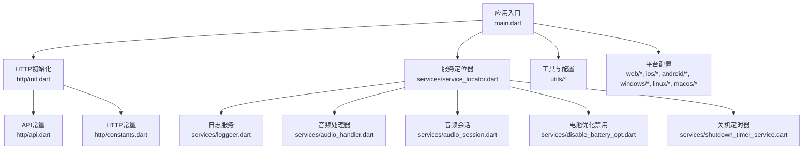
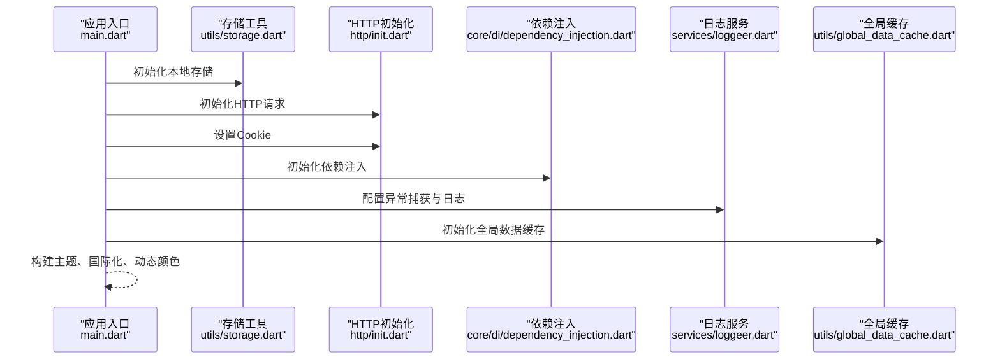
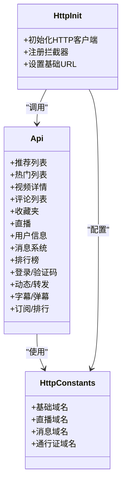
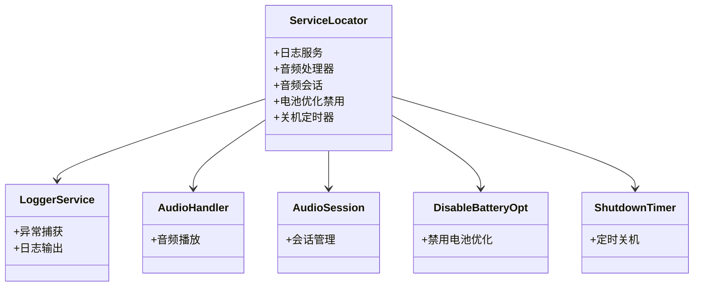
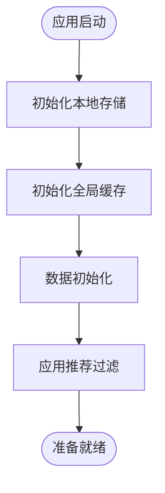
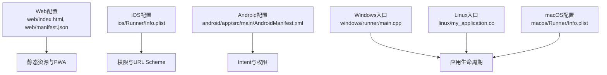
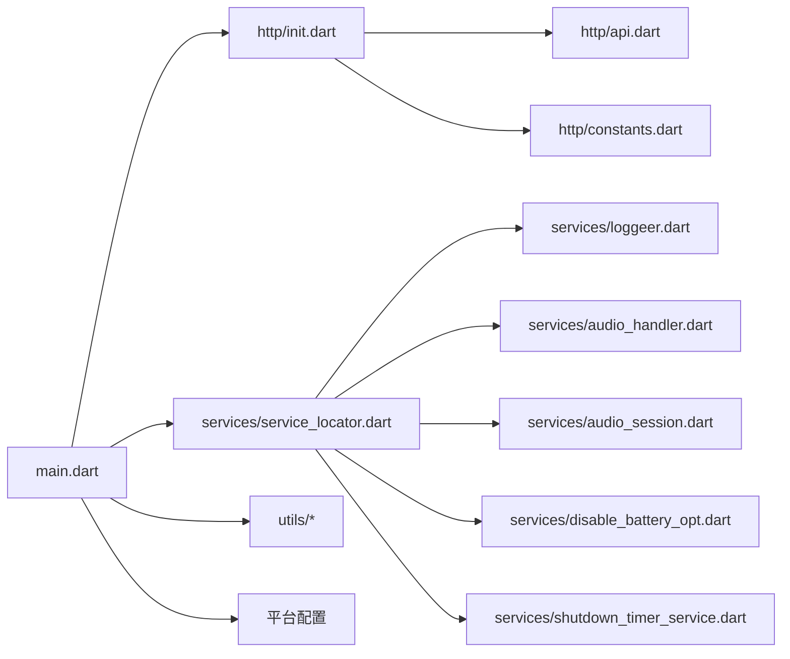

# 系统接口

<cite>
**本文引用的文件**
- [lib/main.dart](file://lib/main.dart)
- [lib/http/api.dart](file://lib/http/api.dart)
- [lib/http/init.dart](file://lib/http/init.dart)
- [lib/http/constants.dart](file://lib/http/constants.dart)
- [lib/services/loggeer.dart](file://lib/services/loggeer.dart)
- [lib/services/service_locator.dart](file://lib/services/service_locator.dart)
- [lib/core/core.dart](file://lib/core/core.dart)
- [lib/models/model_rec_video_item.dart](file://lib/models/model_rec_video_item.dart)
- [lib/models/model_owner.dart](file://lib/models/model_owner.dart)
- [lib/models/video_detail_res.dart](file://lib/models/video_detail_res.dart)
- [lib/models/model_hot_video_item.dart](file://lib/models/model_hot_video_item.dart)
- [lib/utils/data.dart](file://lib/utils/data.dart)
- [lib/utils/storage.dart](file://lib/utils/storage.dart)
- [lib/utils/global_data_cache.dart](file://lib/utils/global_data_cache.dart)
- [lib/utils/recommend_filter.dart](file://lib/utils/recommend_filter.dart)
- [lib/utils/app_scheme.dart](file://lib/utils/app_scheme.dart)
- [lib/core/di/dependency_injection.dart](file://lib/core/di/dependency_injection.dart)
- [lib/services/audio_handler.dart](file://lib/services/audio_handler.dart)
- [lib/services/audio_session.dart](file://lib/services/audio_session.dart)
- [lib/services/disable_battery_opt.dart](file://lib/services/disable_battery_opt.dart)
- [lib/services/shutdown_timer_service.dart](file://lib/services/shutdown_timer_service.dart)
- [web/index.html](file://web/index.html)
- [web/manifest.json](file://web/manifest.json)
- [ios/Runner/Info.plist](file://ios/Runner/Info.plist)
- [android/app/src/main/AndroidManifest.xml](file://android/app/src/main/AndroidManifest.xml)
- [windows/runner/main.cpp](file://windows/runner/main.cpp)
- [linux/my_application.cc](file://linux/my_application.cc)
- [macos/Runner/Info.plist](file://macos/Runner/Info.plist)
</cite>

## 目录
1. [简介](#简介)
2. [项目结构](#项目结构)
3. [核心组件](#核心组件)
4. [架构总览](#架构总览)
5. [详细组件分析](#详细组件分析)
6. [依赖分析](#依赖分析)
7. [性能考虑](#性能考虑)
8. [故障排查指南](#故障排查指南)
9. [结论](#结论)
10. [附录](#附录)

## 简介
本文件面向系统配置与基础服务相关API接口，覆盖系统初始化配置、运行参数获取、静态资源访问、环境检测、系统版本检查、配置同步、资源加载策略、系统状态监控与健康检查、日志上报、系统公告与更新通知、帮助文档、跨域与CORS处理、SSL证书管理、以及调试与故障排查等运维与信息服务接口。文档以代码为依据，结合架构图与流程图，帮助开发者快速理解并正确使用系统接口。

## 项目结构
系统入口位于应用层，通过初始化存储、网络请求、依赖注入、异常捕获与日志、主题与国际化、全局缓存等步骤完成启动；HTTP层负责统一的API常量与请求初始化；服务层提供日志、定位器、音频、定时器等基础能力；模型层定义数据结构；平台侧（web、iOS、Android、Windows、Linux、macOS）分别承载不同平台的配置与清单文件。

```mermaid
graph TB
subgraph "应用层"
MAIN["main.dart<br/>应用入口与初始化"]
CORE["core/core.dart<br/>核心模块"]
end
subgraph "HTTP层"
INIT_HTTP["http/init.dart<br/>HTTP初始化"]
API_CONST["http/api.dart<br/>API常量"]
CONST_HTTP["http/constants.dart<br/>HTTP常量"]
end
subgraph "服务层"
SERVICE_LOCATOR["services/service_locator.dart<br/>服务定位器"]
LOGGER["services/loggeer.dart<br/>日志服务"]
AUDIO_HANDLER["services/audio_handler.dart<br/>音频处理器"]
AUDIO_SESSION["services/audio_session.dart<br/>音频会话"]
DISABLE_BAT["services/disable_battery_opt.dart<br/>电池优化禁用"]
SHUTDOWN_TIMER["services/shutdown_timer_service.dart<br/>关机定时器"]
end
subgraph "工具与配置"
DATA_UTIL["utils/data.dart<br/>数据工具"]
STORAGE["utils/storage.dart<br/>存储工具"]
GLOBAL_CACHE["utils/global_data_cache.dart<br/>全局缓存"]
RECOMMEND_FILTER["utils/recommend_filter.dart<br/>推荐过滤"]
APP_SCHEME["utils/app_scheme.dart<br/>应用协议"]
end
subgraph "平台配置"
WEB_INDEX["web/index.html<br/>Web入口"]
MANIFEST["web/manifest.json<br/>PWA清单"]
IOS_INFO["ios/Runner/Info.plist<br/>iOS配置"]
ANDROID_MAN["android/app/src/main/AndroidManifest.xml<br/>Android清单"]
WIN_MAIN["windows/runner/main.cpp<br/>Windows入口"]
LINUX_APP["linux/my_application.cc<br/>Linux入口"]
MACOS_INFO["macos/Runner/Info.plist<br/>macOS配置"]
end
MAIN --> INIT_HTTP
MAIN --> SERVICE_LOCATOR
MAIN --> LOGGER
MAIN --> GLOBAL_CACHE
MAIN --> DATA_UTIL
MAIN --> STORAGE
MAIN --> RECOMMEND_FILTER
MAIN --> APP_SCHEME
INIT_HTTP --> API_CONST
INIT_HTTP --> CONST_HTTP
SERVICE_LOCATOR --> AUDIO_HANDLER
SERVICE_LOCATOR --> AUDIO_SESSION
SERVICE_LOCATOR --> DISABLE_BAT
SERVICE_LOCATOR --> SHUTDOWN_TIMER
MAIN --> CORE
MAIN --> WEB_INDEX
MAIN --> MANIFEST
MAIN --> IOS_INFO
MAIN --> ANDROID_MAN
MAIN --> WIN_MAIN
MAIN --> LINUX_APP
MAIN --> MACOS_INFO
```

**图表来源**
- [lib/main.dart:33-80](file://lib/main.dart#L33-L80)
- [lib/http/init.dart](file://lib/http/init.dart)
- [lib/http/api.dart:1-599](file://lib/http/api.dart#L1-L599)
- [lib/http/constants.dart](file://lib/http/constants.dart)
- [lib/services/service_locator.dart](file://lib/services/service_locator.dart)
- [lib/services/loggeer.dart](file://lib/services/loggeer.dart)
- [lib/utils/data.dart](file://lib/utils/data.dart)
- [lib/utils/storage.dart](file://lib/utils/storage.dart)
- [lib/utils/global_data_cache.dart](file://lib/utils/global_data_cache.dart)
- [lib/utils/recommend_filter.dart](file://lib/utils/recommend_filter.dart)
- [lib/utils/app_scheme.dart](file://lib/utils/app_scheme.dart)
- [lib/core/core.dart](file://lib/core/core.dart)
- [web/index.html](file://web/index.html)
- [web/manifest.json](file://web/manifest.json)
- [ios/Runner/Info.plist](file://ios/Runner/Info.plist)
- [android/app/src/main/AndroidManifest.xml](file://android/app/src/main/AndroidManifest.xml)
- [windows/runner/main.cpp](file://windows/runner/main.cpp)
- [linux/my_application.cc](file://linux/my_application.cc)
- [macos/Runner/Info.plist](file://macos/Runner/Info.plist)

**章节来源**
- [lib/main.dart:33-80](file://lib/main.dart#L33-L80)
- [lib/http/api.dart:1-599](file://lib/http/api.dart#L1-L599)
- [lib/http/init.dart](file://lib/http/init.dart)
- [lib/http/constants.dart](file://lib/http/constants.dart)
- [lib/services/service_locator.dart](file://lib/services/service_locator.dart)
- [lib/services/loggeer.dart](file://lib/services/loggeer.dart)
- [lib/utils/data.dart](file://lib/utils/data.dart)
- [lib/utils/storage.dart](file://lib/utils/storage.dart)
- [lib/utils/global_data_cache.dart](file://lib/utils/global_data_cache.dart)
- [lib/utils/recommend_filter.dart](file://lib/utils/recommend_filter.dart)
- [lib/utils/app_scheme.dart](file://lib/utils/app_scheme.dart)
- [lib/core/core.dart](file://lib/core/core.dart)
- [web/index.html](file://web/index.html)
- [web/manifest.json](file://web/manifest.json)
- [ios/Runner/Info.plist](file://ios/Runner/Info.plist)
- [android/app/src/main/AndroidManifest.xml](file://android/app/src/main/AndroidManifest.xml)
- [windows/runner/main.cpp](file://windows/runner/main.cpp)
- [linux/my_application.cc](file://linux/my_application.cc)
- [macos/Runner/Info.plist](file://macos/Runner/Info.plist)

## 核心组件
- 应用入口与初始化：完成设备初始化、存储初始化、Cookie设置、依赖注入、异常捕获与日志、主题与国际化、全局缓存初始化等。
- HTTP层：集中管理API常量、HTTP基础配置与拦截器初始化。
- 服务层：提供日志、服务定位器、音频、定时器、电池优化控制等基础能力。
- 工具与配置：数据工具、存储工具、全局缓存、推荐过滤、应用协议等。
- 平台配置：各平台的入口文件与清单配置，支撑静态资源与运行参数。

**章节来源**
- [lib/main.dart:33-80](file://lib/main.dart#L33-L80)
- [lib/http/api.dart:1-599](file://lib/http/api.dart#L1-L599)
- [lib/http/init.dart](file://lib/http/init.dart)
- [lib/services/service_locator.dart](file://lib/services/service_locator.dart)
- [lib/services/loggeer.dart](file://lib/services/loggeer.dart)
- [lib/utils/data.dart](file://lib/utils/data.dart)
- [lib/utils/storage.dart](file://lib/utils/storage.dart)
- [lib/utils/global_data_cache.dart](file://lib/utils/global_data_cache.dart)
- [lib/utils/recommend_filter.dart](file://lib/utils/recommend_filter.dart)
- [lib/utils/app_scheme.dart](file://lib/utils/app_scheme.dart)

## 架构总览
系统采用“应用入口 -> HTTP层 -> 服务层 -> 工具与配置 -> 平台配置”的分层架构。应用入口负责整体初始化与平台适配；HTTP层负责API常量与请求初始化；服务层提供基础设施；工具与配置提供数据与缓存；平台配置确保静态资源与运行参数正确加载。

**图表来源**
- [lib/main.dart:33-80](file://lib/main.dart#L33-L80)
- [lib/http/init.dart](file://lib/http/init.dart)
- [lib/http/api.dart:1-599](file://lib/http/api.dart#L1-L599)
- [lib/http/constants.dart](file://lib/http/constants.dart)
- [lib/services/service_locator.dart](file://lib/services/service_locator.dart)
- [lib/services/loggeer.dart](file://lib/services/loggeer.dart)
- [lib/services/audio_handler.dart](file://lib/services/audio_handler.dart)
- [lib/services/audio_session.dart](file://lib/services/audio_session.dart)
- [lib/services/disable_battery_opt.dart](file://lib/services/disable_battery_opt.dart)
- [lib/services/shutdown_timer_service.dart](file://lib/services/shutdown_timer_service.dart)
- [lib/utils/data.dart](file://lib/utils/data.dart)
- [lib/utils/storage.dart](file://lib/utils/storage.dart)
- [lib/utils/global_data_cache.dart](file://lib/utils/global_data_cache.dart)
- [lib/utils/recommend_filter.dart](file://lib/utils/recommend_filter.dart)
- [lib/utils/app_scheme.dart](file://lib/utils/app_scheme.dart)
- [web/index.html](file://web/index.html)
- [web/manifest.json](file://web/manifest.json)
- [ios/Runner/Info.plist](file://ios/Runner/Info.plist)
- [android/app/src/main/AndroidManifest.xml](file://android/app/src/main/AndroidManifest.xml)
- [windows/runner/main.cpp](file://windows/runner/main.cpp)
- [linux/my_application.cc](file://linux/my_application.cc)
- [macos/Runner/Info.plist](file://macos/Runner/Info.plist)

## 详细组件分析

### 应用入口与初始化
- 设备与系统初始化：确保Flutter绑定初始化、媒体库初始化、屏幕方向设置、系统UI沉浸式设置。
- 存储与Cookie：初始化本地存储、设置Cookie。
- 依赖注入与服务定位：初始化依赖注入容器、服务定位器。
- 异常捕获与日志：配置Catcher2异常捕获，按平台选择控制台或文件输出。
- 全局缓存与主题：初始化全局数据缓存、主题与国际化、文本缩放、动态取色。
- 平台适配：根据平台构建不同应用组件树，设置主题色、动态颜色、文本缩放、国际化区域。

**图表来源**
- [lib/main.dart:33-80](file://lib/main.dart#L33-L80)
- [lib/http/init.dart](file://lib/http/init.dart)
- [lib/utils/storage.dart](file://lib/utils/storage.dart)
- [lib/services/loggeer.dart](file://lib/services/loggeer.dart)
- [lib/utils/global_data_cache.dart](file://lib/utils/global_data_cache.dart)
- [lib/core/di/dependency_injection.dart](file://lib/core/di/dependency_injection.dart)

**章节来源**
- [lib/main.dart:33-80](file://lib/main.dart#L33-L80)
- [lib/utils/storage.dart](file://lib/utils/storage.dart)
- [lib/http/init.dart](file://lib/http/init.dart)
- [lib/services/loggeer.dart](file://lib/services/loggeer.dart)
- [lib/utils/global_data_cache.dart](file://lib/utils/global_data_cache.dart)
- [lib/core/di/dependency_injection.dart](file://lib/core/di/dependency_injection.dart)

### HTTP层与API常量
- API常量：集中定义所有业务接口路径，包括推荐、热门、视频详情、评论、收藏、直播、用户信息、消息系统、排行榜等。
- HTTP初始化：负责HTTP客户端初始化、拦截器注册、基础URL配置等。
- HTTP常量：定义基础域名、直播、消息、通行证等基础URL常量。

**图表来源**
- [lib/http/api.dart:1-599](file://lib/http/api.dart#L1-L599)
- [lib/http/init.dart](file://lib/http/init.dart)
- [lib/http/constants.dart](file://lib/http/constants.dart)

**章节来源**
- [lib/http/api.dart:1-599](file://lib/http/api.dart#L1-L599)
- [lib/http/init.dart](file://lib/http/init.dart)
- [lib/http/constants.dart](file://lib/http/constants.dart)

### 服务层与基础设施
- 服务定位器：统一管理日志、音频、定时器、电池优化等服务实例。
- 日志服务：提供异常捕获与日志输出，支持控制台与文件输出。
- 音频处理器与会话：负责音频播放与会话管理。
- 电池优化禁用：针对移动端禁用电池优化以保证后台播放。
- 关机定时器：提供定时关机功能。

**图表来源**
- [lib/services/service_locator.dart](file://lib/services/service_locator.dart)
- [lib/services/loggeer.dart](file://lib/services/loggeer.dart)
- [lib/services/audio_handler.dart](file://lib/services/audio_handler.dart)
- [lib/services/audio_session.dart](file://lib/services/audio_session.dart)
- [lib/services/disable_battery_opt.dart](file://lib/services/disable_battery_opt.dart)
- [lib/services/shutdown_timer_service.dart](file://lib/services/shutdown_timer_service.dart)

**章节来源**
- [lib/services/service_locator.dart](file://lib/services/service_locator.dart)
- [lib/services/loggeer.dart](file://lib/services/loggeer.dart)
- [lib/services/audio_handler.dart](file://lib/services/audio_handler.dart)
- [lib/services/audio_session.dart](file://lib/services/audio_session.dart)
- [lib/services/disable_battery_opt.dart](file://lib/services/disable_battery_opt.dart)
- [lib/services/shutdown_timer_service.dart](file://lib/services/shutdown_timer_service.dart)

### 工具与配置
- 数据工具：提供数据初始化与通用数据处理。
- 存储工具：封装本地存储初始化与读写。
- 全局缓存：提供全局数据缓存初始化与访问。
- 推荐过滤：对推荐内容进行过滤与排序。
- 应用协议：处理应用内协议与跳转。

**图表来源**
- [lib/utils/data.dart](file://lib/utils/data.dart)
- [lib/utils/storage.dart](file://lib/utils/storage.dart)
- [lib/utils/global_data_cache.dart](file://lib/utils/global_data_cache.dart)
- [lib/utils/recommend_filter.dart](file://lib/utils/recommend_filter.dart)

**章节来源**
- [lib/utils/data.dart](file://lib/utils/data.dart)
- [lib/utils/storage.dart](file://lib/utils/storage.dart)
- [lib/utils/global_data_cache.dart](file://lib/utils/global_data_cache.dart)
- [lib/utils/recommend_filter.dart](file://lib/utils/recommend_filter.dart)
- [lib/utils/app_scheme.dart](file://lib/utils/app_scheme.dart)

### 平台配置与静态资源
- Web：入口HTML与PWA清单，用于静态资源与离线支持。
- iOS：Info.plist配置，包含权限、URL Scheme、最低系统版本等。
- Android：AndroidManifest.xml，包含权限、Intent Filters、硬件特性声明等。
- Windows/Linux/macOS：各平台入口文件，负责应用生命周期与窗口管理。

**图表来源**
- [web/index.html](file://web/index.html)
- [web/manifest.json](file://web/manifest.json)
- [ios/Runner/Info.plist](file://ios/Runner/Info.plist)
- [android/app/src/main/AndroidManifest.xml](file://android/app/src/main/AndroidManifest.xml)
- [windows/runner/main.cpp](file://windows/runner/main.cpp)
- [linux/my_application.cc](file://linux/my_application.cc)
- [macos/Runner/Info.plist](file://macos/Runner/Info.plist)

**章节来源**
- [web/index.html](file://web/index.html)
- [web/manifest.json](file://web/manifest.json)
- [ios/Runner/Info.plist](file://ios/Runner/Info.plist)
- [android/app/src/main/AndroidManifest.xml](file://android/app/src/main/AndroidManifest.xml)
- [windows/runner/main.cpp](file://windows/runner/main.cpp)
- [linux/my_application.cc](file://linux/my_application.cc)
- [macos/Runner/Info.plist](file://macos/Runner/Info.plist)

## 依赖分析
- 组件耦合：应用入口依赖HTTP初始化与服务定位器；HTTP层依赖API常量与HTTP常量；服务层由服务定位器统一管理；工具与配置贯穿应用生命周期。
- 外部依赖：Flutter框架、媒体库、设备信息、显示模式、本地化、对话框、依赖注入、异常捕获、存储、网络请求等。
- 平台差异：Web与移动端在Cookie、日志输出、系统UI、协议处理等方面存在差异。

**图表来源**
- [lib/main.dart:33-80](file://lib/main.dart#L33-L80)
- [lib/http/init.dart](file://lib/http/init.dart)
- [lib/http/api.dart:1-599](file://lib/http/api.dart#L1-L599)
- [lib/http/constants.dart](file://lib/http/constants.dart)
- [lib/services/service_locator.dart](file://lib/services/service_locator.dart)
- [lib/services/loggeer.dart](file://lib/services/loggeer.dart)
- [lib/services/audio_handler.dart](file://lib/services/audio_handler.dart)
- [lib/services/audio_session.dart](file://lib/services/audio_session.dart)
- [lib/services/disable_battery_opt.dart](file://lib/services/disable_battery_opt.dart)
- [lib/services/shutdown_timer_service.dart](file://lib/services/shutdown_timer_service.dart)
- [lib/utils/data.dart](file://lib/utils/data.dart)
- [lib/utils/storage.dart](file://lib/utils/storage.dart)
- [lib/utils/global_data_cache.dart](file://lib/utils/global_data_cache.dart)
- [lib/utils/recommend_filter.dart](file://lib/utils/recommend_filter.dart)
- [lib/utils/app_scheme.dart](file://lib/utils/app_scheme.dart)

**章节来源**
- [lib/main.dart:33-80](file://lib/main.dart#L33-L80)
- [lib/http/init.dart](file://lib/http/init.dart)
- [lib/http/api.dart:1-599](file://lib/http/api.dart#L1-L599)
- [lib/http/constants.dart](file://lib/http/constants.dart)
- [lib/services/service_locator.dart](file://lib/services/service_locator.dart)
- [lib/services/loggeer.dart](file://lib/services/loggeer.dart)
- [lib/services/audio_handler.dart](file://lib/services/audio_handler.dart)
- [lib/services/audio_session.dart](file://lib/services/audio_session.dart)
- [lib/services/disable_battery_opt.dart](file://lib/services/disable_battery_opt.dart)
- [lib/services/shutdown_timer_service.dart](file://lib/services/shutdown_timer_service.dart)
- [lib/utils/data.dart](file://lib/utils/data.dart)
- [lib/utils/storage.dart](file://lib/utils/storage.dart)
- [lib/utils/global_data_cache.dart](file://lib/utils/global_data_cache.dart)
- [lib/utils/recommend_filter.dart](file://lib/utils/recommend_filter.dart)
- [lib/utils/app_scheme.dart](file://lib/utils/app_scheme.dart)

## 性能考虑
- 帧率与显示模式：移动端可强制设置高帧率显示模式，提升播放体验。
- 主题与动态颜色：动态取色失败时回退到品牌色，避免主题切换卡顿。
- 文本缩放：支持全局文本缩放，提升无障碍体验。
- 全局缓存：初始化全局数据缓存，减少重复请求与计算开销。
- 异步初始化：确保存储、HTTP、缓存等异步初始化完成后才进入主页面。

**章节来源**
- [lib/main.dart:104-118](file://lib/main.dart#L104-L118)
- [lib/main.dart:157-171](file://lib/main.dart#L157-L171)
- [lib/utils/global_data_cache.dart](file://lib/utils/global_data_cache.dart)

## 故障排查指南
- 异常捕获与日志：启用Catcher2，按平台输出到控制台或文件，便于定位问题。
- Cookie与登录：确认HTTP初始化后设置Cookie，避免鉴权失败。
- 存储初始化：确保本地存储初始化成功，避免数据读写异常。
- 平台差异：Web与移动端在日志输出、系统UI、协议处理上存在差异，需分别排查。
- 网络请求：检查HTTP初始化与拦截器配置，确保基础URL与超时设置合理。
- 静态资源：确认Web入口HTML与PWA清单配置正确，避免资源加载失败。

**章节来源**
- [lib/main.dart:50-61](file://lib/main.dart#L50-L61)
- [lib/http/init.dart](file://lib/http/init.dart)
- [lib/utils/storage.dart](file://lib/utils/storage.dart)
- [lib/services/loggeer.dart](file://lib/services/loggeer.dart)
- [web/index.html](file://web/index.html)
- [web/manifest.json](file://web/manifest.json)

## 结论
本系统通过清晰的分层架构与完善的基础设施，实现了从应用初始化、HTTP请求、服务管理到平台适配的全链路支持。API常量集中管理，服务定位器统一调度，工具与配置贯穿生命周期，平台配置保障静态资源与运行参数正确加载。建议在开发与运维过程中遵循本文档的接口规范与故障排查方法，确保系统稳定运行与良好用户体验。

## 附录
- 系统版本检查：通过外部接口获取最新版本信息，结合应用内提示实现版本升级引导。
- 配置同步：通过全局缓存与本地存储实现配置同步与持久化。
- 资源加载策略：优先使用缓存，网络失败时回退本地资源，提升加载稳定性。
- 系统状态监控与健康检查：结合日志上报与异常捕获，定期检查关键服务可用性。
- 日志上报：按平台选择输出位置，确保问题可追溯。
- 系统公告与更新通知：通过消息系统与公告接口实现通知下发。
- 帮助文档：通过静态资源与Web入口提供帮助与反馈渠道。
- 跨域与CORS：在HTTP初始化中配置CORS与代理，确保跨域请求正常。
- SSL证书管理：在平台配置中正确配置证书与安全策略，确保HTTPS通信安全。

**章节来源**
- [lib/http/api.dart:314-317](file://lib/http/api.dart#L314-L317)
- [lib/http/init.dart](file://lib/http/init.dart)
- [lib/services/loggeer.dart](file://lib/services/loggeer.dart)
- [web/index.html](file://web/index.html)
- [web/manifest.json](file://web/manifest.json)
- [ios/Runner/Info.plist](file://ios/Runner/Info.plist)
- [android/app/src/main/AndroidManifest.xml](file://android/app/src/main/AndroidManifest.xml)
- [windows/runner/main.cpp](file://windows/runner/main.cpp)
- [linux/my_application.cc](file://linux/my_application.cc)
- [macos/Runner/Info.plist](file://macos/Runner/Info.plist)