# 视频接口

<cite>
**本文档引用的文件**
- [api.dart](file://lib/http/api.dart)
- [video_detail_repository.dart](file://lib/features/video/data/video_detail_repository.dart)
- [video_detail_use_cases.dart](file://lib/features/video/domain/video_detail_use_cases.dart)
- [video_detail_res.dart](file://lib/models/video_detail_res.dart)
- [dm.pbjson.dart](file://lib/models/danmaku/dm.pbjson.dart)
- [dm.pb.dart](file://lib/models/danmaku/dm.pb.dart)
- [video_use_cases.dart](file://lib/features/home/domain/video_use_cases.dart)
- [video_repository.dart](file://lib/features/home/data/video_repository.dart)
- [binding.dart](file://lib/router/bindings.dart)
- [video.dart](file://lib/features/video/video.dart)
</cite>

## 目录
1. [简介](#简介)
2. [项目结构](#项目结构)
3. [核心组件](#核心组件)
4. [架构总览](#架构总览)
5. [详细组件分析](#详细组件分析)
6. [依赖关系分析](#依赖关系分析)
7. [性能考虑](#性能考虑)
8. [故障排除指南](#故障排除指南)
9. [结论](#结论)
10. [附录](#附录)

## 简介
本文件系统化梳理视频相关API接口与实现，覆盖视频详情查询、视频列表分页、播放地址获取、弹幕接口、评论、点赞、收藏、投币等核心能力，并补充视频分类、标签、排序规则与过滤条件说明。同时提供CDN加速、防盗链、视频质量选择等技术细节，以及接口调用示例、错误处理与性能优化建议。

## 项目结构
视频功能采用分层架构设计，分为数据层（Repository）、领域层（Use Cases）与展示层（Controller）。路由绑定负责依赖注入，HTTP层通过统一的API常量进行请求组织。

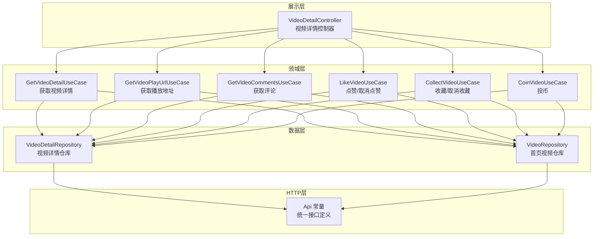

图表来源
- [video_detail_use_cases.dart:1-154](file://lib/features/video/domain/video_detail_use_cases.dart#L1-L154)
- [video_detail_repository.dart:1-36](file://lib/features/video/data/video_detail_repository.dart#L1-L36)
- [video_use_cases.dart:1-87](file://lib/features/home/domain/video_use_cases.dart#L1-L87)
- [video_repository.dart:1-45](file://lib/features/home/data/video_repository.dart#L1-L45)
- [api.dart](file://lib/http/api.dart)

章节来源
- [video.dart:1-11](file://lib/features/video/video.dart#L1-L11)
- [binding.dart:51-57](file://lib/router/bindings.dart#L51-L57)

## 核心组件
- 视频详情仓库：封装视频详情、播放地址、评论、点赞、收藏、投币等请求。
- 首页视频仓库：封装推荐、热门视频列表请求。
- 视频详情用例：对仓库操作进行业务封装，统一错误处理。
- 首页视频用例：封装推荐、热门视频列表的业务逻辑。
- 弹幕模型：提供弹幕渲染类型、字幕AI状态与类型等枚举定义。

章节来源
- [video_detail_repository.dart:1-36](file://lib/features/video/data/video_detail_repository.dart#L1-L36)
- [video_repository.dart:1-45](file://lib/features/home/data/video_repository.dart#L1-L45)
- [video_detail_use_cases.dart:1-154](file://lib/features/video/domain/video_detail_use_cases.dart#L1-L154)
- [video_use_cases.dart:1-87](file://lib/features/home/domain/video_use_cases.dart#L1-L87)
- [dm.pbjson.dart:113-148](file://lib/models/danmaku/dm.pbjson.dart#L113-L148)
- [dm.pb.dart:9972-9984](file://lib/models/danmaku/dm.pb.dart#L9972-L9984)

## 架构总览
视频接口遵循“控制器 -> 用例 -> 仓库 -> HTTP客户端”的调用链路，所有HTTP端点通过统一的API常量集中管理，便于维护与扩展。

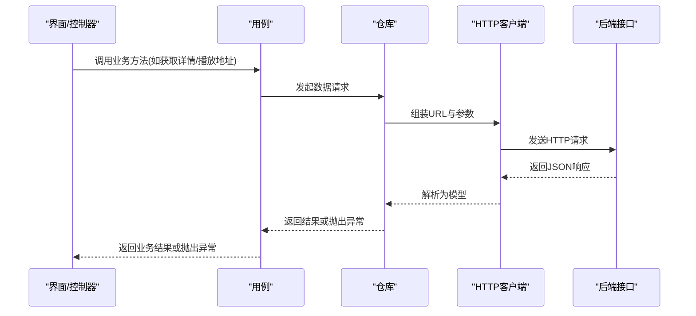

图表来源
- [video_detail_use_cases.dart:15-27](file://lib/features/video/domain/video_detail_use_cases.dart#L15-L27)
- [video_detail_repository.dart:17-36](file://lib/features/video/data/video_detail_repository.dart#L17-L36)
- [api.dart](file://lib/http/api.dart)

## 详细组件分析

### 视频详情接口
- 功能：获取单个视频的完整信息，包括基础元数据、统计信息、分P列表、UP主信息、版权与权限等。
- 关键参数：支持按bvid或aid查询。
- 返回模型：VideoDetailData，包含标题、封面、发布时间、描述、时长、统计、分P、字幕、维度等字段。
- 错误处理：当请求失败或数据为空时返回错误封装。

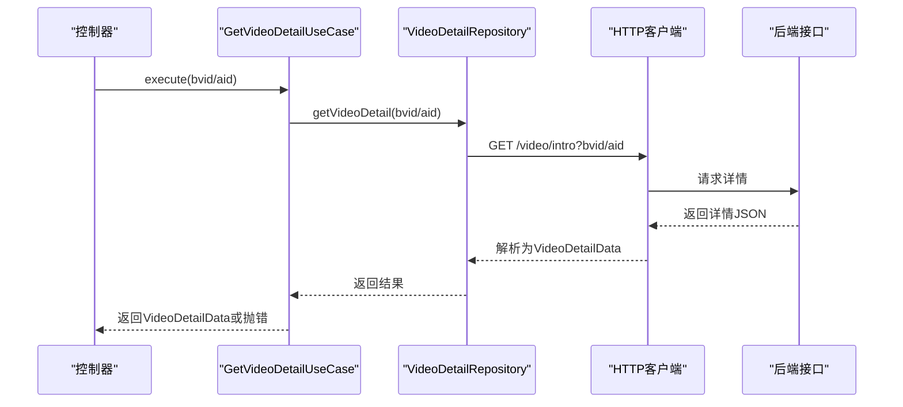

图表来源
- [video_detail_use_cases.dart:15-27](file://lib/features/video/domain/video_detail_use_cases.dart#L15-L27)
- [video_detail_repository.dart:17-36](file://lib/features/video/data/video_detail_repository.dart#L17-L36)
- [video_detail_res.dart:73-148](file://lib/models/video_detail_res.dart#L73-L148)

章节来源
- [video_detail_use_cases.dart:15-27](file://lib/features/video/domain/video_detail_use_cases.dart#L15-L27)
- [video_detail_repository.dart:17-36](file://lib/features/video/data/video_detail_repository.dart#L17-L36)
- [video_detail_res.dart:73-148](file://lib/models/video_detail_res.dart#L73-L148)

### 视频播放地址接口
- 功能：根据avid/cid获取可播放的视频地址，支持qn质量参数。
- 关键参数：avid、cid、bvid（可选）、qn（清晰度代号，默认80）。
- 返回模型：PlayUrlModel，包含多清晰度的播放地址与片段信息。
- 技术细节：qn参数用于选择视频质量；CDN与防盗链策略由后端决定，客户端需携带必要请求头或遵循服务端签名/Token机制。

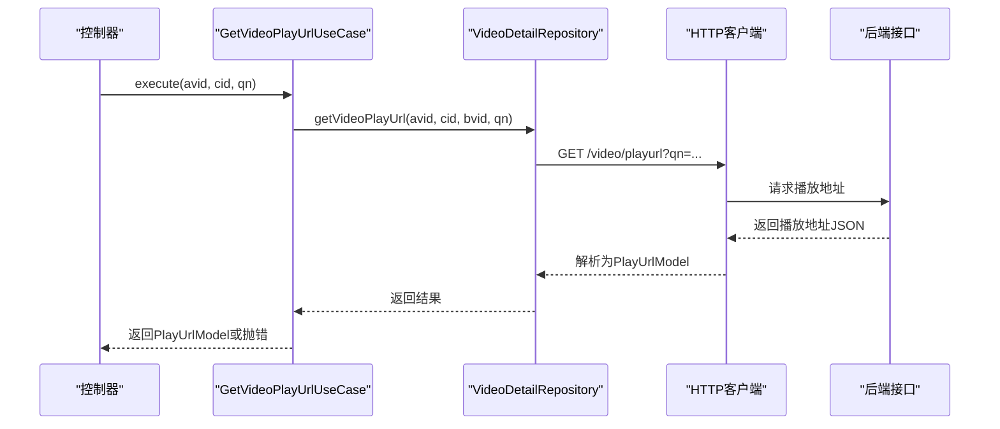

图表来源
- [video_detail_use_cases.dart:36-56](file://lib/features/video/domain/video_detail_use_cases.dart#L36-L56)
- [video_detail_repository.dart:37-56](file://lib/features/video/data/video_detail_repository.dart#L37-L56)

章节来源
- [video_detail_use_cases.dart:36-56](file://lib/features/video/domain/video_detail_use_cases.dart#L36-L56)
- [video_detail_repository.dart:37-56](file://lib/features/video/data/video_detail_repository.dart#L37-L56)

### 视频评论接口
- 功能：分页获取视频评论列表。
- 关键参数：oid（视频标识）、page、pageSize。
- 返回模型：ReplyData，包含评论内容、用户信息、回复数量等。
- 分页规则：page从1开始，pageSize默认20。

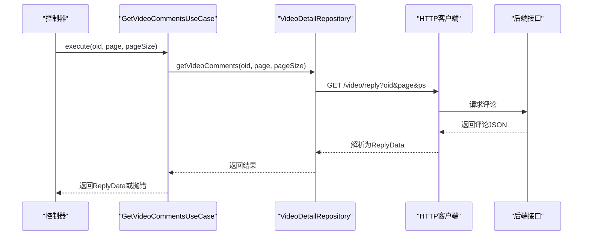

图表来源
- [video_detail_use_cases.dart:66-83](file://lib/features/video/domain/video_detail_use_cases.dart#L66-L83)
- [video_detail_repository.dart:57-83](file://lib/features/video/data/video_detail_repository.dart#L57-L83)

章节来源
- [video_detail_use_cases.dart:66-83](file://lib/features/video/domain/video_detail_use_cases.dart#L66-L83)
- [video_detail_repository.dart:57-83](file://lib/features/video/data/video_detail_repository.dart#L57-L83)

### 视频点赞/取消点赞接口
- 功能：对视频执行点赞或取消点赞操作。
- 关键参数：bvid、like（true/false）。
- 错误处理：当操作失败时抛出异常。

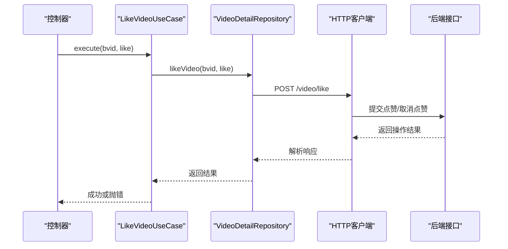

图表来源
- [video_detail_use_cases.dart:93-105](file://lib/features/video/domain/video_detail_use_cases.dart#L93-L105)
- [video_detail_repository.dart:84-105](file://lib/features/video/data/video_detail_repository.dart#L84-L105)

章节来源
- [video_detail_use_cases.dart:93-105](file://lib/features/video/domain/video_detail_use_cases.dart#L93-L105)
- [video_detail_repository.dart:84-105](file://lib/features/video/data/video_detail_repository.dart#L84-L105)

### 视频收藏/取消收藏接口
- 功能：将视频添加到/从收藏夹中移除。
- 关键参数：aid、addMediaIds（新增收藏夹ID列表）、delMediaIds（可选，要移除的收藏夹ID列表）。
- 错误处理：当操作失败时抛出异常。

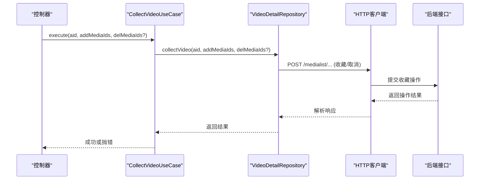

图表来源
- [video_detail_use_cases.dart:115-131](file://lib/features/video/domain/video_detail_use_cases.dart#L115-L131)
- [video_detail_repository.dart:106-131](file://lib/features/video/data/video_detail_repository.dart#L106-L131)

章节来源
- [video_detail_use_cases.dart:115-131](file://lib/features/video/domain/video_detail_use_cases.dart#L115-L131)
- [video_detail_repository.dart:106-131](file://lib/features/video/data/video_detail_repository.dart#L106-L131)

### 视频投币接口
- 功能：对视频进行投币操作。
- 关键参数：bvid、multiply（倍数）。
- 错误处理：当操作失败时抛出异常。

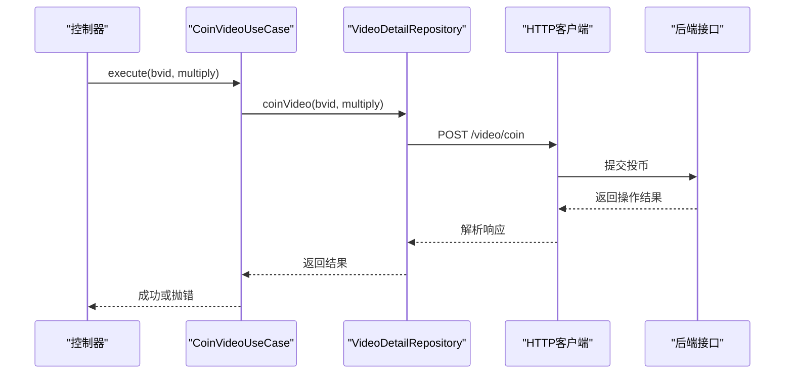

图表来源
- [video_detail_use_cases.dart:140-154](file://lib/features/video/domain/video_detail_use_cases.dart#L140-L154)
- [video_detail_repository.dart:132-154](file://lib/features/video/data/video_detail_repository.dart#L132-L154)

章节来源
- [video_detail_use_cases.dart:140-154](file://lib/features/video/domain/video_detail_use_cases.dart#L140-L154)
- [video_detail_repository.dart:132-154](file://lib/features/video/data/video_detail_repository.dart#L132-L154)

### 首页视频列表接口
- 推荐视频列表：支持Web与App两种推荐源，可设置刷新索引与分页大小。
- 热门视频列表：支持分页查询。
- 过滤与排序：首页仓库内置推荐过滤器，可按黑名单、时长、点赞率等规则过滤。

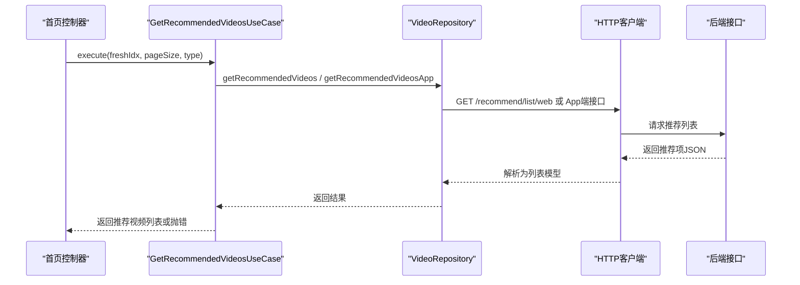

图表来源
- [video_use_cases.dart:21-39](file://lib/features/home/domain/video_use_cases.dart#L21-L39)
- [video_repository.dart:23-45](file://lib/features/home/data/video_repository.dart#L23-L45)

章节来源
- [video_use_cases.dart:1-87](file://lib/features/home/domain/video_use_cases.dart#L1-L87)
- [video_repository.dart:1-45](file://lib/features/home/data/video_repository.dart#L1-L45)

### 弹幕接口与模型
- 弹幕渲染类型：支持普通、单行滚动、逆向滚动等类型。
- 字幕AI状态与类型：支持AI生成字幕与人工字幕。
- 模型文件：提供弹幕与字幕相关枚举与消息定义，便于解析与渲染。

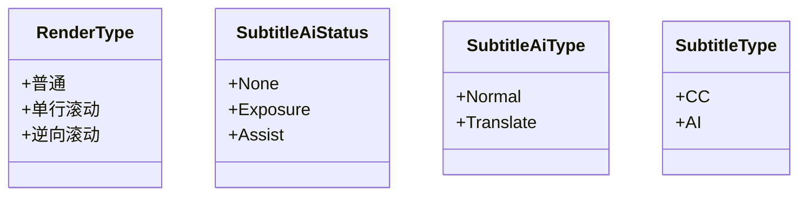

图表来源
- [dm.pbjson.dart:113-148](file://lib/models/danmaku/dm.pbjson.dart#L113-L148)
- [dm.pb.dart:9972-9984](file://lib/models/danmaku/dm.pb.dart#L9972-L9984)

章节来源
- [dm.pbjson.dart:113-148](file://lib/models/danmaku/dm.pbjson.dart#L113-L148)
- [dm.pb.dart:9972-9984](file://lib/models/danmaku/dm.pb.dart#L9972-L9984)

## 依赖关系分析
- 控制器通过用例访问仓库，用例负责业务编排与错误处理。
- 仓库通过HTTP客户端与后端交互，所有端点在API常量中统一定义。
- 路由绑定负责依赖注入，确保各层实例正确注入。

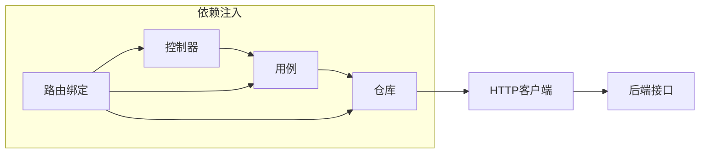

图表来源
- [binding.dart:22-57](file://lib/router/bindings.dart#L22-L57)
- [video_detail_use_cases.dart:1-154](file://lib/features/video/domain/video_detail_use_cases.dart#L1-L154)
- [video_detail_repository.dart:1-36](file://lib/features/video/data/video_detail_repository.dart#L1-L36)
- [api.dart](file://lib/http/api.dart)

章节来源
- [binding.dart:22-57](file://lib/router/bindings.dart#L22-L57)

## 性能考虑
- CDN加速：播放地址接口支持多清晰度与CDN节点选择，建议根据网络环境自动选择最优节点。
- 防盗链：播放地址可能需要携带签名或Token，客户端应缓存并复用有效凭证，减少重复鉴权开销。
- 视频质量选择：通过qn参数控制清晰度，建议结合设备性能与网络状况动态调整。
- 列表分页：推荐与热门列表采用分页加载，合理设置pageSize以平衡首屏速度与滚动体验。
- 缓存策略：详情与列表数据可结合本地存储与过期策略，提升离线与弱网场景体验。

## 故障排除指南
- 请求失败：检查网络连接与CSRF Token是否正确传递。
- 数据为空：确认bvid/aid参数是否正确，或是否存在权限限制。
- 播放地址获取失败：验证qn参数是否受支持，确认是否需要签名/Token。
- 评论/点赞/收藏/投币失败：确认登录状态与权限，查看后端返回的错误信息。

章节来源
- [video_detail_use_cases.dart:25-26](file://lib/features/video/domain/video_detail_use_cases.dart#L25-L26)
- [video_detail_use_cases.dart:54-55](file://lib/features/video/domain/video_detail_use_cases.dart#L54-L55)
- [video_detail_use_cases.dart:81-82](file://lib/features/video/domain/video_detail_use_cases.dart#L81-L82)
- [video_detail_use_cases.dart:103-104](file://lib/features/video/domain/video_detail_use_cases.dart#L103-L104)
- [video_detail_use_cases.dart:128-129](file://lib/features/video/domain/video_detail_use_cases.dart#L128-L129)
- [video_detail_use_cases.dart:150-151](file://lib/features/video/domain/video_detail_use_cases.dart#L150-L151)

## 结论
本视频接口体系通过清晰的分层设计与统一的API常量管理，实现了视频详情、播放、评论、点赞、收藏、投币等核心能力，并提供了推荐与热门列表的分页查询。结合弹幕与字幕模型，满足了播放与互动场景的多样化需求。建议在生产环境中重点关注CDN节点选择、防盗链与Token复用、以及分页与缓存策略，以获得更佳的用户体验与性能表现。

## 附录
- API常量：所有HTTP端点定义于统一的API常量文件中，便于集中维护与扩展。
- 模型定义：视频详情、播放地址、评论等模型均提供对应的fromJson解析逻辑，确保数据一致性。
- 弹幕与字幕：提供渲染类型与AI状态/类型的枚举定义，便于前端渲染与交互。

章节来源
- [api.dart](file://lib/http/api.dart)
- [video_detail_res.dart:73-148](file://lib/models/video_detail_res.dart#L73-L148)
- [dm.pbjson.dart:113-148](file://lib/models/danmaku/dm.pbjson.dart#L113-L148)