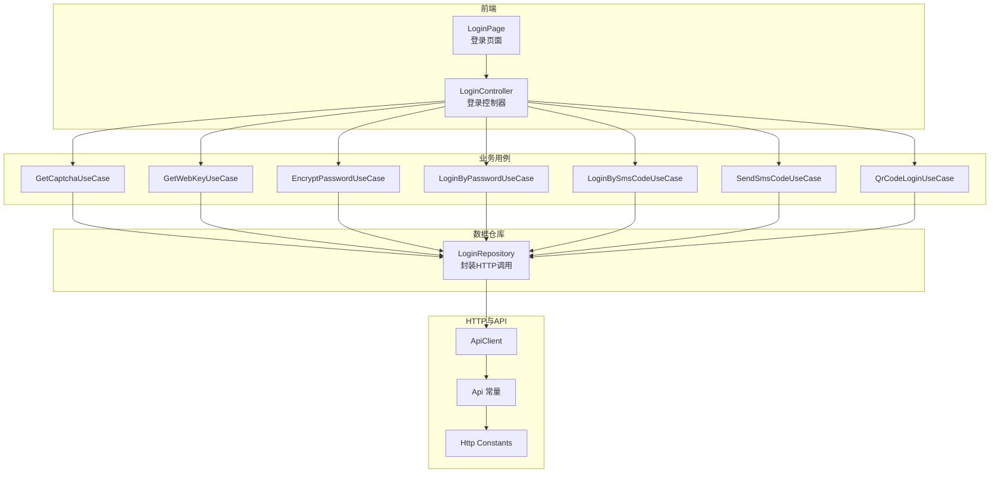
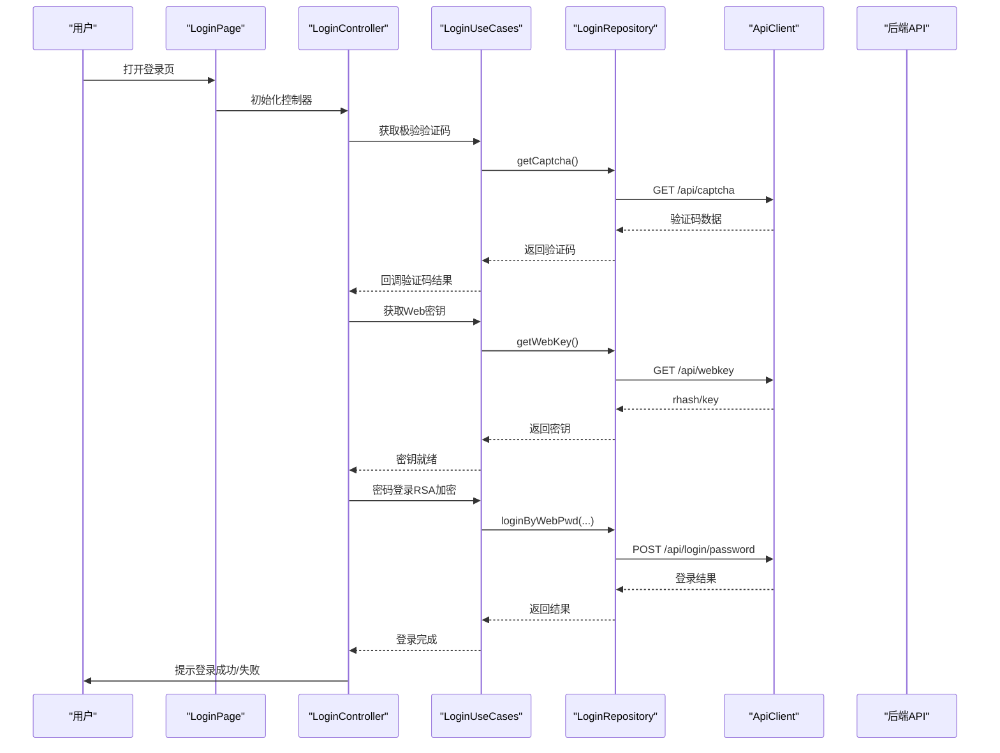
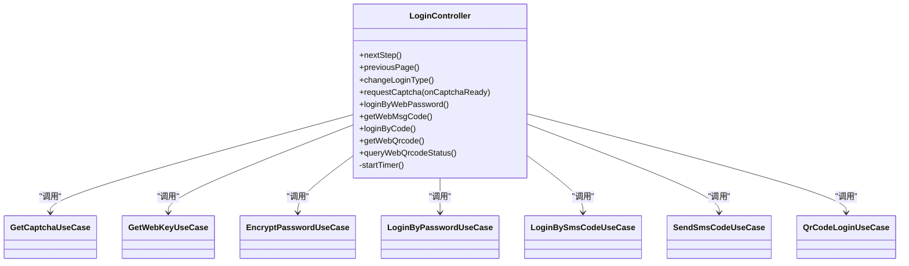
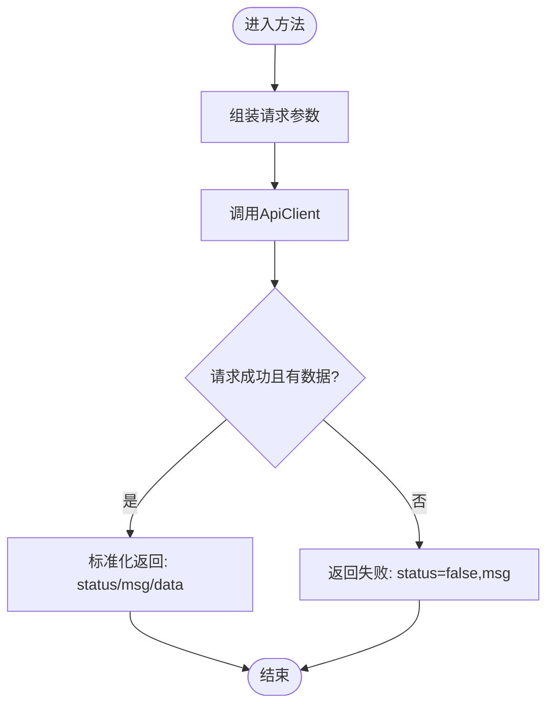
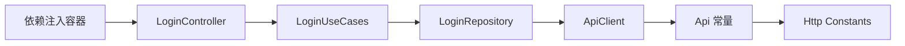

# 认证接口

<cite>
**本文引用的文件**
- [lib/features/login/data/login_repository.dart](file://lib/features/login/data/login_repository.dart)
- [lib/features/login/domain/login_use_cases.dart](file://lib/features/login/domain/login_use_cases.dart)
- [lib/features/login/presentation/login_controller.dart](file://lib/features/login/presentation/login_controller.dart)
- [lib/features/login/presentation/login_page.dart](file://lib/features/login/presentation/login_page.dart)
- [lib/http/login.dart](file://lib/http/login.dart)
- [lib/http/api.dart](file://lib/http/api.dart)
- [lib/http/constants.dart](file://lib/http/constants.dart)
- [lib/core/network/api_client.dart](file://lib/core/network/api_client.dart)
- [lib/core/di/dependency_injection.dart](file://lib/core/di/dependency_injection.dart)
- [lib/utils/login.dart](file://lib/utils/login.dart)
</cite>

## 目录
1. [简介](#简介)
2. [项目结构](#项目结构)
3. [核心组件](#核心组件)
4. [架构总览](#架构总览)
5. [详细组件分析](#详细组件分析)
6. [依赖关系分析](#依赖关系分析)
7. [性能考量](#性能考量)
8. [故障排查指南](#故障排查指南)
9. [结论](#结论)
10. [附录](#附录)

## 简介
本文件面向后端与前端开发者，系统化梳理认证相关API接口与前端实现，覆盖以下能力：
- 用户登录：账号密码登录（含极验验证码）、短信验证码登录、二维码登录
- 注册与重置：通过短信验证码发送接口触发注册或重置流程
- 退出登录：统一的登出入口与会话失效处理
- JWT/会话管理：登录成功后的会话建立与后续鉴权
- 权限验证：基于会话/令牌的权限校验机制
- 安全与风控：极验验证码、短信发送频率限制、RSA加密传输等

为便于不同技术背景读者理解，文档采用“概念—架构—实现—排错”的分层方式组织。

## 项目结构
认证相关代码主要分布在以下模块：
- 前端页面与控制器：负责交互、表单校验、倒计时、极验验证码调用与登录流程编排
- 业务用例：封装登录、发短信验证码、获取Web密钥、二维码登录等业务动作
- 数据仓库：封装HTTP调用、参数组装、返回值标准化
- HTTP层与API常量：定义后端接口地址、请求参数与响应结构
- 会话与工具：登录确认、会话持久化、BUVID生成等

图表来源
- [lib/features/login/presentation/login_page.dart:1-441](file://lib/features/login/presentation/login_page.dart#L1-L441)
- [lib/features/login/presentation/login_controller.dart:1-306](file://lib/features/login/presentation/login_controller.dart#L1-L306)
- [lib/features/login/domain/login_use_cases.dart:1-104](file://lib/features/login/domain/login_use_cases.dart#L1-L104)
- [lib/features/login/data/login_repository.dart:1-190](file://lib/features/login/data/login_repository.dart#L1-L190)
- [lib/http/api.dart](file://lib/http/api.dart)
- [lib/core/network/api_client.dart](file://lib/core/network/api_client.dart)
- [lib/http/constants.dart](file://lib/http/constants.dart)

章节来源
- [lib/features/login/presentation/login_page.dart:1-441](file://lib/features/login/presentation/login_page.dart#L1-L441)
- [lib/features/login/presentation/login_controller.dart:1-306](file://lib/features/login/presentation/login_controller.dart#L1-L306)
- [lib/features/login/domain/login_use_cases.dart:1-104](file://lib/features/login/domain/login_use_cases.dart#L1-L104)
- [lib/features/login/data/login_repository.dart:1-190](file://lib/features/login/data/login_repository.dart#L1-L190)
- [lib/http/api.dart](file://lib/http/api.dart)
- [lib/core/network/api_client.dart](file://lib/core/network/api_client.dart)
- [lib/http/constants.dart](file://lib/http/constants.dart)

## 核心组件
- 登录控制器：负责页面导航、表单校验、倒计时、极验验证码回调、登录流程编排与结果提示
- 登录用例：封装具体业务动作（获取验证码、获取Web密钥、密码加密、短信验证码登录、密码登录、二维码登录）
- 登录仓库：封装HTTP请求、参数组装、返回值标准化
- HTTP层与API常量：定义后端接口地址、请求参数与响应结构
- 会话工具：登录确认、会话持久化、BUVID生成

章节来源
- [lib/features/login/presentation/login_controller.dart:1-306](file://lib/features/login/presentation/login_controller.dart#L1-L306)
- [lib/features/login/domain/login_use_cases.dart:1-104](file://lib/features/login/domain/login_use_cases.dart#L1-L104)
- [lib/features/login/data/login_repository.dart:1-190](file://lib/features/login/data/login_repository.dart#L1-L190)
- [lib/http/login.dart:1-281](file://lib/http/login.dart#L1-L281)
- [lib/utils/login.dart](file://lib/utils/login.dart)

## 架构总览
认证流程在前端由控制器驱动，通过用例调用仓库，仓库再通过HTTP客户端访问后端API；登录成功后由会话工具进行确认与持久化。

图表来源
- [lib/features/login/presentation/login_page.dart:1-441](file://lib/features/login/presentation/login_page.dart#L1-L441)
- [lib/features/login/presentation/login_controller.dart:1-306](file://lib/features/login/presentation/login_controller.dart#L1-L306)
- [lib/features/login/domain/login_use_cases.dart:1-104](file://lib/features/login/domain/login_use_cases.dart#L1-L104)
- [lib/features/login/data/login_repository.dart:1-190](file://lib/features/login/data/login_repository.dart#L1-L190)
- [lib/core/network/api_client.dart](file://lib/core/network/api_client.dart)
- [lib/http/api.dart](file://lib/http/api.dart)

## 详细组件分析

### 组件A：登录控制器（LoginController）
职责
- 页面导航与表单切换
- 极验验证码集成与回调
- 登录类型切换（密码/验证码）
- 短信验证码倒计时
- 二维码登录轮询与有效期倒计时
- 登录结果处理与提示

关键行为
- requestCaptcha：拉取验证码并启动极验插件，回调中注入validate/seccode/challenge
- loginByWebPassword：获取Web密钥、RSA加密密码、提交登录请求
- getWebMsgCode：发送短信验证码并开启倒计时
- loginByCode：使用验证码登录
- getWebQrcode：获取二维码并轮询登录状态

图表来源
- [lib/features/login/presentation/login_controller.dart:1-306](file://lib/features/login/presentation/login_controller.dart#L1-L306)
- [lib/features/login/domain/login_use_cases.dart:1-104](file://lib/features/login/domain/login_use_cases.dart#L1-L104)

章节来源
- [lib/features/login/presentation/login_controller.dart:1-306](file://lib/features/login/presentation/login_controller.dart#L1-L306)
- [lib/features/login/presentation/login_page.dart:1-441](file://lib/features/login/presentation/login_page.dart#L1-L441)

### 组件B：登录用例（LoginUseCases）
职责
- 封装具体业务动作，屏蔽仓库细节
- 参数校验与组装
- 结果标准化

关键用例
- GetCaptchaUseCase：获取极验验证码
- GetWebKeyUseCase：获取rhash与公钥
- EncryptPasswordUseCase：RSA加密密码
- LoginByPasswordUseCase：密码登录
- LoginBySmsCodeUseCase：短信验证码登录
- SendSmsCodeUseCase：发送短信验证码
- QrCodeLoginUseCase：获取二维码与轮询状态

```mermaid
classDiagram
class GetCaptchaUseCase {
+execute() Map
}
class GetWebKeyUseCase {
+execute() Map
}
class EncryptPasswordUseCase {
+execute(rhash, password, publicKeyPem) String
}
class LoginByPasswordUseCase {
+execute(username, password, token, challenge, validate, seccode) Map
}
class LoginBySmsCodeUseCase {
+execute(cid, tel, code, captchaKey) Map
}
class SendSmsCodeUseCase {
+execute(cid, tel, token, challenge, validate, seccode) Map
}
class QrCodeLoginUseCase {
+getQrCode() Map
+checkStatus(qrcodeKey) Map
}
```

图表来源
- [lib/features/login/domain/login_use_cases.dart:1-104](file://lib/features/login/domain/login_use_cases.dart#L1-L104)

章节来源
- [lib/features/login/domain/login_use_cases.dart:1-104](file://lib/features/login/domain/login_use_cases.dart#L1-L104)

### 组件C：登录仓库（LoginRepository）
职责
- 统一封装HTTP请求
- 参数组装与FormData构造
- 返回值标准化（status/msg/data/code）

关键方法
- getCaptcha：GET /api/captcha
- getWebKey：GET /api/webkey
- loginByWebPwd：POST /api/login/password
- loginByWebSmsCode：POST /api/login/sms
- sendWebSmsCode：POST /api/sms/send
- getQrCode：GET /api/qrcode
- checkQrCodeStatus：GET /api/qrcode/status
- encryptPassword：RSA加密

图表来源
- [lib/features/login/data/login_repository.dart:1-190](file://lib/features/login/data/login_repository.dart#L1-L190)

章节来源
- [lib/features/login/data/login_repository.dart:1-190](file://lib/features/login/data/login_repository.dart#L1-L190)

### 组件D：HTTP层与API常量
职责
- 定义后端接口地址
- 统一请求与响应结构
- 提供RSA加密与BUVID生成等工具

关键点
- Api常量：包含验证码、短信、密码登录、二维码等接口地址
- Request/ApiClient：封装HTTP请求与拦截器
- LoginHttp：历史版本的HTTP封装（部分方法保留）
- Http Constants：基础URL、UA等常量

章节来源
- [lib/http/api.dart](file://lib/http/api.dart)
- [lib/http/login.dart:1-281](file://lib/http/login.dart#L1-L281)
- [lib/http/constants.dart](file://lib/http/constants.dart)
- [lib/core/network/api_client.dart](file://lib/core/network/api_client.dart)

## 依赖关系分析
- 控制器依赖用例
- 用例依赖仓库
- 仓库依赖HTTP客户端与API常量
- 依赖注入在DI容器中集中注册

图表来源
- [lib/core/di/dependency_injection.dart:60-89](file://lib/core/di/dependency_injection.dart#L60-L89)
- [lib/features/login/presentation/login_controller.dart:1-306](file://lib/features/login/presentation/login_controller.dart#L1-L306)
- [lib/features/login/domain/login_use_cases.dart:1-104](file://lib/features/login/domain/login_use_cases.dart#L1-L104)
- [lib/features/login/data/login_repository.dart:1-190](file://lib/features/login/data/login_repository.dart#L1-L190)
- [lib/http/api.dart](file://lib/http/api.dart)
- [lib/http/constants.dart](file://lib/http/constants.dart)
- [lib/core/network/api_client.dart](file://lib/core/network/api_client.dart)

章节来源
- [lib/core/di/dependency_injection.dart:60-89](file://lib/core/di/dependency_injection.dart#L60-L89)

## 性能考量
- 请求合并与去抖：验证码发送与登录请求可结合UI状态避免重复提交
- 倒计时优化：短信验证码倒计时使用一次性定时器，结束后自动释放
- 加密前置：密码加密在本地完成，减少网络往返
- 二维码轮询：按需轮询，超时自动刷新二维码
- 缓存策略：验证码与密钥可短期缓存，降低重复请求

## 故障排查指南
常见问题与定位步骤
- 验证码失败
  - 检查极验初始化参数（gt、challenge、success）是否正确
  - 确认回调中validate/seccode/challenge是否注入
- 获取密钥失败
  - 检查GET /api/webkey返回的rhash与key是否为空
- 密码登录失败
  - 确认RSA加密后的密码是否正确拼接rhash
  - 检查POST /api/login/password返回的状态码与message
- 发送短信验证码失败
  - 检查参数token/challenge/validate/seccode是否完整
  - 确认captcha_key是否成功保存
- 验证码登录失败
  - 检查验证码长度与格式
  - 确认captcha_key与手机号匹配
- 二维码登录未生效
  - 检查二维码有效期倒计时与轮询逻辑
  - 确认轮询接口返回的code为0

章节来源
- [lib/features/login/presentation/login_controller.dart:143-181](file://lib/features/login/presentation/login_controller.dart#L143-L181)
- [lib/features/login/data/login_repository.dart:18-30](file://lib/features/login/data/login_repository.dart#L18-L30)
- [lib/features/login/data/login_repository.dart:32-46](file://lib/features/login/data/login_repository.dart#L32-L46)
- [lib/features/login/data/login_repository.dart:48-89](file://lib/features/login/data/login_repository.dart#L48-L89)
- [lib/features/login/data/login_repository.dart:120-149](file://lib/features/login/data/login_repository.dart#L120-L149)
- [lib/features/login/data/login_repository.dart:91-118](file://lib/features/login/data/login_repository.dart#L91-L118)
- [lib/features/login/data/login_repository.dart:151-180](file://lib/features/login/data/login_repository.dart#L151-L180)

## 结论
该认证体系以“控制器-用例-仓库-HTTP”分层设计，实现了验证码、短信验证码、密码与二维码等多种登录方式，并通过RSA加密与极验验证码提升安全性。建议在生产环境中进一步完善：
- 引入统一的错误码与国际化提示
- 增加登录失败次数限制与滑块轨迹风控
- 对敏感操作增加二次验证
- 完善登出与会话失效通知

## 附录

### 接口清单与规范

- 获取验证码
  - 方法与路径：GET /api/captcha
  - 请求参数：无
  - 成功响应字段：status=true, data={challenge, gt, ...}
  - 失败响应字段：status=false, msg=错误信息
  - 状态码：200（业务状态码由data.status决定）

- 获取Web密钥（rhash与公钥）
  - 方法与路径：GET /api/webkey
  - 查询参数：disable_rcmd, local_id
  - 成功响应字段：status=true, data={hash, key}
  - 失败响应字段：status=false, msg=错误信息

- 密码登录（RSA加密）
  - 方法与路径：POST /api/login/password
  - 表单字段：username, password(加密), keep, token, challenge, validate, seccode, source, go_url
  - 成功响应字段：status=true, data={...}
  - 失败响应字段：status=false, code=1时可能返回url跳转，msg=错误信息

- 短信验证码登录
  - 方法与路径：POST /api/login/sms
  - 表单字段：cid, tel, code, source, keep, captcha_key, go_url
  - 成功响应字段：status=true, data={...}
  - 失败响应字段：status=false, msg=错误信息

- 发送短信验证码
  - 方法与路径：POST /api/sms/send
  - 表单字段：cid, tel, source, token, challenge, validate, seccode
  - 成功响应字段：status=true, data={captcha_key, ...}
  - 失败响应字段：status=false, msg=错误信息

- 获取二维码
  - 方法与路径：GET /api/qrcode
  - 请求参数：无
  - 成功响应字段：status=true, data={qrcode_key, url, ...}
  - 失败响应字段：status=false, msg=错误信息

- 轮询二维码登录状态
  - 方法与路径：GET /api/qrcode/status
  - 查询参数：qrcode_key
  - 成功响应字段：status=true, data={code=0, ...}
  - 失败响应字段：status=false, msg=错误信息

章节来源
- [lib/features/login/data/login_repository.dart:17-30](file://lib/features/login/data/login_repository.dart#L17-L30)
- [lib/features/login/data/login_repository.dart:32-46](file://lib/features/login/data/login_repository.dart#L32-L46)
- [lib/features/login/data/login_repository.dart:48-89](file://lib/features/login/data/login_repository.dart#L48-L89)
- [lib/features/login/data/login_repository.dart:91-118](file://lib/features/login/data/login_repository.dart#L91-L118)
- [lib/features/login/data/login_repository.dart:120-149](file://lib/features/login/data/login_repository.dart#L120-L149)
- [lib/features/login/data/login_repository.dart:151-180](file://lib/features/login/data/login_repository.dart#L151-L180)

### 请求与响应示例（路径参考）
- 获取验证码
  - 请求：GET /api/captcha
  - 响应：{"status":true,"data":{"challenge":"...","gt":"..."}}
- 获取Web密钥
  - 请求：GET /api/webkey?disable_rcmd=0&local_id=...
  - 响应：{"status":true,"data":{"hash":"...","key":"..."}}
- 密码登录
  - 请求：POST /api/login/password（表单字段同上）
  - 成功响应：{"status":true,"data":{"status":0,...}}
  - 失败响应：{"status":false,"code":1,"data":{"url":"..."},"msg":"..."}
- 短信验证码登录
  - 请求：POST /api/login/sms（表单字段同上）
  - 成功响应：{"status":true,"data":{"..."}}
- 发送短信验证码
  - 请求：POST /api/sms/send（表单字段同上）
  - 成功响应：{"status":true,"data":{"captcha_key":"..."}}
- 获取二维码
  - 请求：GET /api/qrcode
  - 成功响应：{"status":true,"data":{"qrcode_key":"...","url":"..."}}
- 轮询二维码状态
  - 请求：GET /api/qrcode/status?qrcode_key=...
  - 成功响应：{"status":true,"data":{"code":0,...}}

章节来源
- [lib/features/login/data/login_repository.dart:18-30](file://lib/features/login/data/login_repository.dart#L18-L30)
- [lib/features/login/data/login_repository.dart:32-46](file://lib/features/login/data/login_repository.dart#L32-L46)
- [lib/features/login/data/login_repository.dart:48-89](file://lib/features/login/data/login_repository.dart#L48-L89)
- [lib/features/login/data/login_repository.dart:91-118](file://lib/features/login/data/login_repository.dart#L91-L118)
- [lib/features/login/data/login_repository.dart:120-149](file://lib/features/login/data/login_repository.dart#L120-L149)
- [lib/features/login/data/login_repository.dart:151-180](file://lib/features/login/data/login_repository.dart#L151-L180)

### JWT/会话管理与权限验证
- 登录成功后，系统通过会话工具进行确认与持久化
- 后续请求建议携带会话标识（如Cookie/JWT），由后端进行权限校验
- 建议对敏感接口增加角色/权限位校验

章节来源
- [lib/features/login/presentation/login_controller.dart:205-221](file://lib/features/login/presentation/login_controller.dart#L205-L221)
- [lib/utils/login.dart](file://lib/utils/login.dart)

### 安全考虑与最佳实践
- 极验验证码：所有登录请求均需通过极验校验，防止自动化攻击
- RSA加密：密码在客户端侧使用公钥加密，降低明文泄露风险
- 频率限制：短信验证码发送需限制频率，避免滥用
- 会话安全：登录成功后及时更新会话，设置合理的过期时间与刷新策略
- 二维码时效：二维码有效期短，轮询超时自动刷新
- 错误提示：对用户展示友好提示，避免泄露过多内部错误信息

章节来源
- [lib/features/login/presentation/login_controller.dart:262-273](file://lib/features/login/presentation/login_controller.dart#L262-L273)
- [lib/features/login/data/login_repository.dart:166-180](file://lib/features/login/data/login_repository.dart#L166-L180)