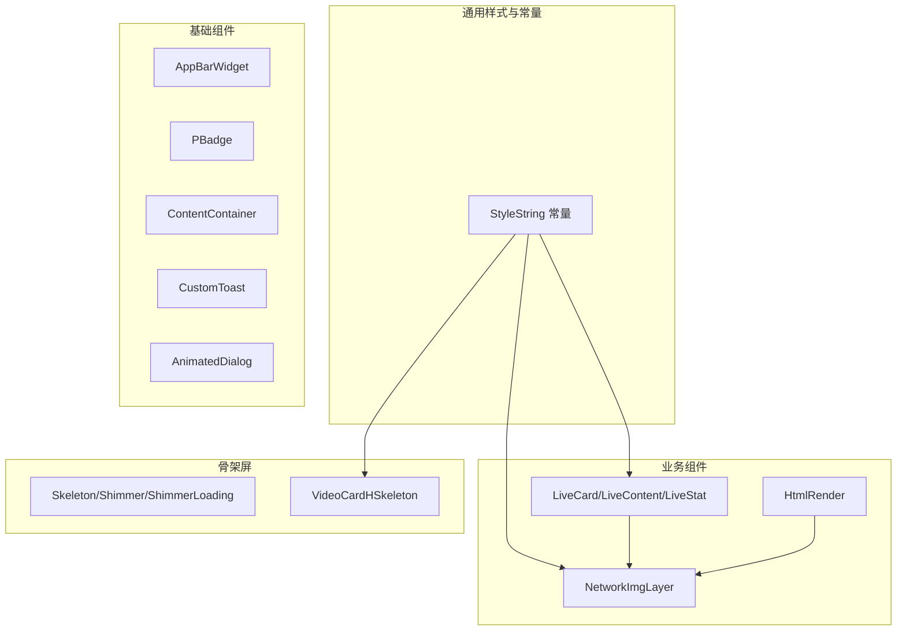
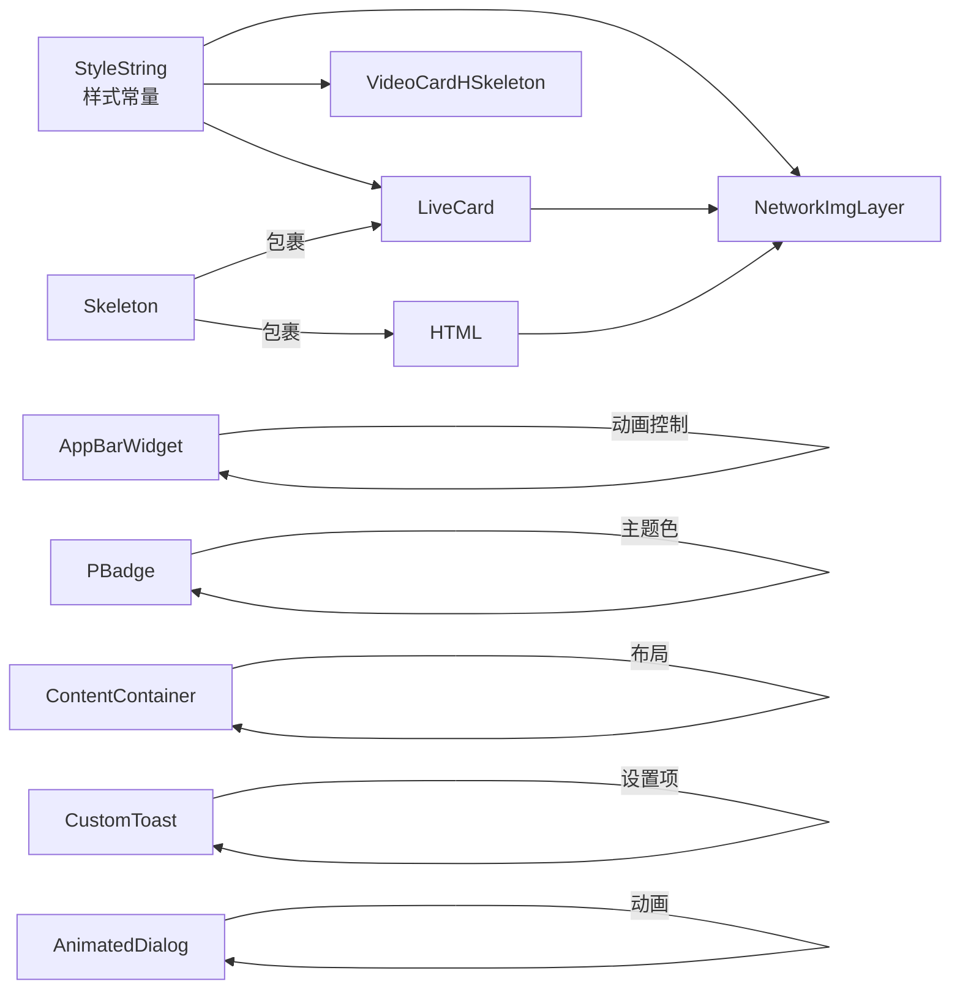
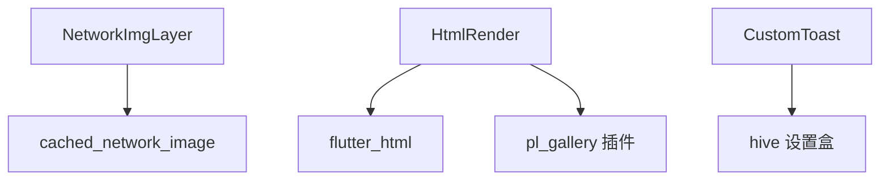

# UI组件库

<cite>
**本文引用的文件**
- [lib/common/widgets/appbar.dart](file://lib/common/widgets/appbar.dart)
- [lib/common/widgets/badge.dart](file://lib/common/widgets/badge.dart)
- [lib/common/widgets/live_card.dart](file://lib/common/widgets/live_card.dart)
- [lib/common/widgets/network_img_layer.dart](file://lib/common/widgets/network_img_layer.dart)
- [lib/common/widgets/content_container.dart](file://lib/common/widgets/content_container.dart)
- [lib/common/widgets/custom_toast.dart](file://lib/common/widgets/custom_toast.dart)
- [lib/common/widgets/animated_dialog.dart](file://lib/common/widgets/animated_dialog.dart)
- [lib/common/widgets/html_render.dart](file://lib/common/widgets/html_render.dart)
- [lib/common/skeleton/skeleton.dart](file://lib/common/skeleton/skeleton.dart)
- [lib/common/skeleton/video_card_h.dart](file://lib/common/skeleton/video_card_h.dart)
- [lib/common/constants.dart](file://lib/common/constants.dart)
</cite>

## 目录
1. [简介](#简介)
2. [项目结构](#项目结构)
3. [核心组件](#核心组件)
4. [架构总览](#架构总览)
5. [详细组件分析](#详细组件分析)
6. [依赖关系分析](#依赖关系分析)
7. [性能考量](#性能考量)
8. [故障排查指南](#故障排查指南)
9. [结论](#结论)
10. [附录](#附录)

## 简介
本文件系统化梳理 PiliPala 项目的 UI 组件库，覆盖基础组件、业务组件与骨架屏组件，并对动画、状态管理、可访问性与跨平台兼容性给出实践建议。文档以“所见即所得”的方式描述组件的外观、行为与交互，提供属性配置、事件处理、插槽与自定义选项说明，并给出组合模式与集成指导。

## 项目结构
UI 组件主要位于 lib/common/widgets 与 lib/common/skeleton 目录中，配合通用样式常量与工具类实现一致的视觉与交互体验。

图表来源
- [lib/common/widgets/appbar.dart:1-33](file://lib/common/widgets/appbar.dart#L1-L33)
- [lib/common/widgets/badge.dart:1-89](file://lib/common/widgets/badge.dart#L1-L89)
- [lib/common/widgets/live_card.dart:1-162](file://lib/common/widgets/live_card.dart#L1-L162)
- [lib/common/widgets/network_img_layer.dart:1-128](file://lib/common/widgets/network_img_layer.dart#L1-L128)
- [lib/common/widgets/content_container.dart:1-48](file://lib/common/widgets/content_container.dart#L1-L48)
- [lib/common/widgets/custom_toast.dart:1-37](file://lib/common/widgets/custom_toast.dart#L1-L37)
- [lib/common/widgets/animated_dialog.dart:1-60](file://lib/common/widgets/animated_dialog.dart#L1-L60)
- [lib/common/widgets/html_render.dart:1-145](file://lib/common/widgets/html_render.dart#L1-L145)
- [lib/common/skeleton/skeleton.dart:1-192](file://lib/common/skeleton/skeleton.dart#L1-L192)
- [lib/common/skeleton/video_card_h.dart:1-95](file://lib/common/skeleton/video_card_h.dart#L1-L95)
- [lib/common/constants.dart:1-21](file://lib/common/constants.dart#L1-L21)

章节来源
- [lib/common/widgets/appbar.dart:1-33](file://lib/common/widgets/appbar.dart#L1-L33)
- [lib/common/widgets/badge.dart:1-89](file://lib/common/widgets/badge.dart#L1-L89)
- [lib/common/widgets/live_card.dart:1-162](file://lib/common/widgets/live_card.dart#L1-L162)
- [lib/common/widgets/network_img_layer.dart:1-128](file://lib/common/widgets/network_img_layer.dart#L1-L128)
- [lib/common/widgets/content_container.dart:1-48](file://lib/common/widgets/content_container.dart#L1-L48)
- [lib/common/widgets/custom_toast.dart:1-37](file://lib/common/widgets/custom_toast.dart#L1-L37)
- [lib/common/widgets/animated_dialog.dart:1-60](file://lib/common/widgets/animated_dialog.dart#L1-L60)
- [lib/common/widgets/html_render.dart:1-145](file://lib/common/widgets/html_render.dart#L1-L145)
- [lib/common/skeleton/skeleton.dart:1-192](file://lib/common/skeleton/skeleton.dart#L1-L192)
- [lib/common/skeleton/video_card_h.dart:1-95](file://lib/common/skeleton/video_card_h.dart#L1-L95)
- [lib/common/constants.dart:1-21](file://lib/common/constants.dart#L1-L21)

## 核心组件
本节概述各组件的职责、外观与交互要点，便于快速定位与选用。

- AppBarWidget：基于动画控制器的滑入滑出 AppBar 容器，用于页面头部的显隐控制与过渡。
- PBadge：徽标组件，支持多类型（主色、灰度、彩色、描边）、多尺寸与定位堆叠策略。
- LiveCard/LiveContent/LiveStat：直播卡片组合，含封面图、标题、主播名与在线人数遮罩层。
- NetworkImgLayer：网络图片加载与缓存封装，支持占位、错误回退、圆角裁剪与质量参数。
- ContentContainer：内容容器，支持滚动/禁滚、底部附加区域与自适应高度布局。
- CustomToast：自定义提示气泡，透明度由设置项控制。
- AnimatedDialog：带背景遮罩与缩放/淡入动画的对话框容器。
- HtmlRender：HTML 内容渲染，支持代码高亮与图片点击放大浏览。
- Skeleton/Shimmer/ShimmerLoading：骨架屏与闪烁动画，按需包裹真实子组件。
- VideoCardHSkeleton：横向视频卡片骨架屏模板。

章节来源
- [lib/common/widgets/appbar.dart:1-33](file://lib/common/widgets/appbar.dart#L1-L33)
- [lib/common/widgets/badge.dart:1-89](file://lib/common/widgets/badge.dart#L1-L89)
- [lib/common/widgets/live_card.dart:1-162](file://lib/common/widgets/live_card.dart#L1-L162)
- [lib/common/widgets/network_img_layer.dart:1-128](file://lib/common/widgets/network_img_layer.dart#L1-L128)
- [lib/common/widgets/content_container.dart:1-48](file://lib/common/widgets/content_container.dart#L1-L48)
- [lib/common/widgets/custom_toast.dart:1-37](file://lib/common/widgets/custom_toast.dart#L1-L37)
- [lib/common/widgets/animated_dialog.dart:1-60](file://lib/common/widgets/animated_dialog.dart#L1-L60)
- [lib/common/widgets/html_render.dart:1-145](file://lib/common/widgets/html_render.dart#L1-L145)
- [lib/common/skeleton/skeleton.dart:1-192](file://lib/common/skeleton/skeleton.dart#L1-L192)
- [lib/common/skeleton/video_card_h.dart:1-95](file://lib/common/skeleton/video_card_h.dart#L1-L95)
- [lib/common/constants.dart:1-21](file://lib/common/constants.dart#L1-L21)

## 架构总览
下图展示组件间的关系与数据流向，突出业务组件对基础组件与样式常量的复用。

图表来源
- [lib/common/widgets/live_card.dart:1-162](file://lib/common/widgets/live_card.dart#L1-L162)
- [lib/common/widgets/network_img_layer.dart:1-128](file://lib/common/widgets/network_img_layer.dart#L1-L128)
- [lib/common/widgets/appbar.dart:1-33](file://lib/common/widgets/appbar.dart#L1-L33)
- [lib/common/widgets/badge.dart:1-89](file://lib/common/widgets/badge.dart#L1-L89)
- [lib/common/widgets/content_container.dart:1-48](file://lib/common/widgets/content_container.dart#L1-L48)
- [lib/common/widgets/custom_toast.dart:1-37](file://lib/common/widgets/custom_toast.dart#L1-L37)
- [lib/common/widgets/animated_dialog.dart:1-60](file://lib/common/widgets/animated_dialog.dart#L1-L60)
- [lib/common/skeleton/skeleton.dart:1-192](file://lib/common/skeleton/skeleton.dart#L1-L192)
- [lib/common/skeleton/video_card_h.dart:1-95](file://lib/common/skeleton/video_card_h.dart#L1-L95)
- [lib/common/constants.dart:1-21](file://lib/common/constants.dart#L1-L21)

## 详细组件分析

### AppBarWidget（页面头部容器）
- 视觉外观：作为 AppBar 的外层容器，内部通过 SlideTransition 实现上下滑动过渡。
- 行为特征：根据 visible 状态与 AnimationController 控制显示/隐藏；使用曲线动画增强体验。
- 用户交互：不直接处理点击，但可承载任意可交互子组件。
- 属性配置
  - child：实现 PreferredSizeWidget 的子组件（如 AppBar）。
  - controller：AnimationController，驱动滑动动画。
  - visible：布尔值，true 时向上滑出，false 时向下滑入。
- 事件处理：无直接事件；通过 child 承载交互。
- 插槽与自定义：可替换 child 以适配不同头部布局。
- 使用示例路径
  - [示例调用位置:19-31](file://lib/common/widgets/appbar.dart#L19-L31)

章节来源
- [lib/common/widgets/appbar.dart:1-33](file://lib/common/widgets/appbar.dart#L1-L33)

### PBadge（徽标）
- 视觉外观：圆角矩形背景，支持填充色、描边与前景色；文本大小与内边距随尺寸变化。
- 行为特征：根据 type 切换主题色系；根据 size 调整内边距与字号；支持定位堆叠或内边距堆叠。
- 用户交互：本身为静态展示组件，不处理点击。
- 属性配置
  - text：徽标文本。
  - top/right/bottom/left：定位偏移（仅在 position 模式生效）。
  - type：主题类型（主色/灰色/彩色/描边）。
  - size：尺寸（medium/small）。
  - stack：堆叠策略（position/inner）。
  - fs：字体大小。
- 事件处理：无。
- 插槽与自定义：可通过 type/size/stack 自定义风格与位置。
- 使用示例路径
  - [示例调用位置:27-87](file://lib/common/widgets/badge.dart#L27-L87)

章节来源
- [lib/common/widgets/badge.dart:1-89](file://lib/common/widgets/badge.dart#L1-L89)

### LiveCard/LiveContent/LiveStat（直播卡片）
- 视觉外观：封面图占满宽高比区域，底部渐变遮罩显示在线人数；标题最多两行，主播名单行省略。
- 行为特征：封面图支持 Hero 动画；遮罩层透明度与动画时长固定；整体采用 InkWell 包裹以支持点击。
- 用户交互：点击进入详情页（当前占位）；封面图支持 Hero 过渡。
- 属性配置
  - liveItem：直播数据对象（包含房间号、封面、标题、主播名、在线数等）。
- 事件处理：点击事件为空实现，可在上层传入具体回调。
- 插槽与自定义：LiveContent/LiveStat 可独立复用，便于拆分与扩展。
- 使用示例路径
  - [卡片构建:16-74](file://lib/common/widgets/live_card.dart#L16-L74)
  - [内容区:77-114](file://lib/common/widgets/live_card.dart#L77-L114)
  - [统计遮罩:116-161](file://lib/common/widgets/live_card.dart#L116-L161)

章节来源
- [lib/common/widgets/live_card.dart:1-162](file://lib/common/widgets/live_card.dart#L1-L162)

### NetworkImgLayer（网络图片层）
- 视觉外观：按指定宽高绘制，支持圆角裁剪；默认占位图与加载/错误回退。
- 行为特征：自动拼接图片质量参数与格式；根据宽高比选择内存缓存尺寸；支持 Avatar/Emote/普通图三种圆角策略。
- 用户交互：本身为静态展示组件。
- 属性配置
  - src：图片地址。
  - width/height：目标尺寸。
  - type：图片类型（avatar/emote/bg）。
  - fadeOutDuration/fadeInDuration：淡出/淡入时长。
  - quality：图片质量百分比。
  - origAspectRatio：原始宽高比（用于特殊场景）。
- 事件处理：无。
- 插槽与自定义：placeholder 可替换为自定义占位组件。
- 使用示例路径
  - [占位与错误回退:99-126](file://lib/common/widgets/network_img_layer.dart#L99-L126)
  - [缓存与质量参数:34-96](file://lib/common/widgets/network_img_layer.dart#L34-L96)

章节来源
- [lib/common/widgets/network_img_layer.dart:1-128](file://lib/common/widgets/network_img_layer.dart#L1-L128)

### ContentContainer（内容容器）
- 视觉外观：自适应高度布局，内容区与底部区域分栏显示。
- 行为特征：根据父级约束最小/最大高度；可选择是否允许滚动；底部区域固定在最下方。
- 用户交互：无直接交互。
- 属性配置
  - contentWidget：内容区子组件。
  - bottomWidget：底部附加组件。
  - isScrollable：是否启用滚动。
  - childClipBehavior：滚动裁剪策略。
- 事件处理：无。
- 插槽与自定义：通过 contentWidget/bottomWidget 注入任意子组件。
- 使用示例路径
  - [布局实现:17-46](file://lib/common/widgets/content_container.dart#L17-L46)

章节来源
- [lib/common/widgets/content_container.dart:1-48](file://lib/common/widgets/content_container.dart#L1-L48)

### CustomToast（自定义提示）
- 视觉外观：圆角矩形气泡，文字颜色与背景色来自主题；底部留白适配安全区。
- 行为特征：透明度由设置项控制；居底显示。
- 用户交互：本身不可交互。
- 属性配置
  - msg：提示文本。
- 事件处理：无。
- 插槽与自定义：可替换为更复杂的 Toast 组件（如带图标/按钮）。
- 使用示例路径
  - [透明度与样式:12-35](file://lib/common/widgets/custom_toast.dart#L12-L35)

章节来源
- [lib/common/widgets/custom_toast.dart:1-37](file://lib/common/widgets/custom_toast.dart#L1-L37)

### AnimatedDialog（动画对话框）
- 视觉外观：全屏黑色半透明背景，中心缩放+淡入动画弹出子组件。
- 行为特征：入场动画完成后保持；点击背景触发关闭回调。
- 用户交互：点击背景关闭；支持传入关闭函数。
- 属性配置
  - child：对话框内容。
  - closeFn：点击背景时的回调。
- 事件处理：点击背景触发 closeFn。
- 插槽与自定义：可注入任意内容组件。
- 使用示例路径
  - [动画与点击处理:40-58](file://lib/common/widgets/animated_dialog.dart#L40-L58)

章节来源
- [lib/common/widgets/animated_dialog.dart:1-60](file://lib/common/widgets/animated_dialog.dart#L1-L60)

### HtmlRender（HTML 渲染）
- 视觉外观：支持段落、列表、链接、代码块与图片渲染。
- 行为特征：代码块高亮；图片点击进入全屏画廊；自动 HTTPS 与去参处理。
- 用户交互：点击图片打开画廊；链接点击占位处理。
- 属性配置
  - htmlContent：HTML 字符串。
  - imgCount/imgList：图片计数与列表，用于画廊索引。
- 事件处理：onLinkTap 占位；图片点击触发画廊路由。
- 插槽与自定义：通过扩展器添加更多标签支持。
- 使用示例路径
  - [图片点击与画廊:63-103](file://lib/common/widgets/html_render.dart#L63-L103)
  - [代码高亮扩展:26-40](file://lib/common/widgets/html_render.dart#L26-L40)

章节来源
- [lib/common/widgets/html_render.dart:1-145](file://lib/common/widgets/html_render.dart#L1-L145)

### Skeleton/Shimmer/ShimmerLoading（骨架屏）
- 视觉外观：基于 ShaderMask 的闪烁渐变覆盖真实子组件，营造加载态。
- 行为特征：全局动画控制器驱动渐变滑动；按需包裹任意子树。
- 用户交互：本身不可交互。
- 属性配置
  - Skeleton.child：真实子组件。
  - Shimmer.linearGradient：渐变配置。
  - ShimmerLoading.isLoading：是否处于加载态。
- 事件处理：无。
- 插槽与自定义：可替换 child 或调整渐变参数。
- 使用示例路径
  - [闪烁动画控制器:58-104](file://lib/common/skeleton/skeleton.dart#L58-L104)
  - [ShaderMask 应用:161-191](file://lib/common/skeleton/skeleton.dart#L161-L191)

章节来源
- [lib/common/skeleton/skeleton.dart:1-192](file://lib/common/skeleton/skeleton.dart#L1-L192)

### VideoCardHSkeleton（横向视频卡片骨架屏）
- 视觉外观：横向布局，左侧封面占位，右侧多行文本占位。
- 行为特征：基于 StyleString 计算尺寸与间距；与真实卡片结构一致。
- 用户交互：无。
- 属性配置：无。
- 事件处理：无。
- 插槽与自定义：可替换为竖向骨架屏或其他布局模板。
- 使用示例路径
  - [横向骨架屏:5-94](file://lib/common/skeleton/video_card_h.dart#L5-L94)

章节来源
- [lib/common/skeleton/video_card_h.dart:1-95](file://lib/common/skeleton/video_card_h.dart#L1-L95)

### 样式常量（StyleString）
- 视觉外观：统一的圆角、间距与宽高比。
- 行为特征：被多个组件共享，保证视觉一致性。
- 属性配置：cardSpace、safeSpace、mdRadius、imgRadius、aspectRatio。
- 事件处理：无。
- 插槽与自定义：可扩展更多常量以适配新布局。
- 使用示例路径
  - [常量定义:3-9](file://lib/common/constants.dart#L3-L9)

章节来源
- [lib/common/constants.dart:1-21](file://lib/common/constants.dart#L1-L21)

## 依赖关系分析
- 组件耦合
  - LiveCard 依赖 NetworkImgLayer 与 StyleString。
  - HtmlRender 依赖 NetworkImgLayer 与画廊插件。
  - Skeleton 与 VideoCardHSkeleton 依赖 StyleString。
- 外部依赖
  - cached_network_image：图片缓存与占位。
  - flutter_html：HTML 解析与扩展。
  - hive：本地设置读取（toast 透明度）。
- 循环依赖：未发现循环导入。

图表来源
- [lib/common/widgets/network_img_layer.dart:1-128](file://lib/common/widgets/network_img_layer.dart#L1-L128)
- [lib/common/widgets/html_render.dart:1-145](file://lib/common/widgets/html_render.dart#L1-L145)
- [lib/common/widgets/custom_toast.dart:1-37](file://lib/common/widgets/custom_toast.dart#L1-L37)

章节来源
- [lib/common/widgets/network_img_layer.dart:1-128](file://lib/common/widgets/network_img_layer.dart#L1-L128)
- [lib/common/widgets/html_render.dart:1-145](file://lib/common/widgets/html_render.dart#L1-L145)
- [lib/common/widgets/custom_toast.dart:1-37](file://lib/common/widgets/custom_toast.dart#L1-L37)

## 性能考量
- 图片加载
  - 使用缓存与内存尺寸预估减少重绘与解码开销。
  - 合理设置质量参数与 BoxFit，避免超大纹理。
- 动画
  - 避免在高频刷新中创建新的 AnimationController；可复用或延迟释放。
  - 将复杂 ShaderMask 限制在必要区域，减少 GPU 压力。
- 布局
  - 使用 LayoutBuilder 与 AspectRatio 配合，避免过度嵌套导致的测量成本上升。
- 骨架屏
  - 在 Skeleton 中仅包裹真实子树，避免重复遮罩。

## 故障排查指南
- 图片不显示
  - 检查 src 是否为空或协议不正确；确认缓存与质量参数拼接逻辑。
  - 参考：[占位与错误回退:99-126](file://lib/common/widgets/network_img_layer.dart#L99-L126)
- 代码块高亮失败
  - 确认语言标识与代码内容传递；检查 highlightExistingText 返回值。
  - 参考：[代码高亮扩展:26-40](file://lib/common/widgets/html_render.dart#L26-L40)
- Toast 透明度过高
  - 检查设置盒中的默认透明度键值；确保读取成功。
  - 参考：[透明度读取:14-15](file://lib/common/widgets/custom_toast.dart#L14-L15)
- 对话框无法关闭
  - 确认 closeFn 是否传入且未被覆盖；检查点击区域与背景色透明度。
  - 参考：[点击关闭:44-46](file://lib/common/widgets/animated_dialog.dart#L44-L46)

章节来源
- [lib/common/widgets/network_img_layer.dart:99-126](file://lib/common/widgets/network_img_layer.dart#L99-L126)
- [lib/common/widgets/html_render.dart:26-40](file://lib/common/widgets/html_render.dart#L26-L40)
- [lib/common/widgets/custom_toast.dart:14-15](file://lib/common/widgets/custom_toast.dart#L14-L15)
- [lib/common/widgets/animated_dialog.dart:44-46](file://lib/common/widgets/animated_dialog.dart#L44-L46)

## 结论
该组件库以“样式常量统一 + 基础组件 + 业务组件 + 骨架屏”为主线，形成清晰的层次与复用关系。通过动画与可配置属性提升交互体验，结合缓存与占位策略优化性能。建议在后续迭代中补充无障碍与跨浏览器兼容性测试，并完善组件文档与示例工程。

## 附录
- 组合模式与集成建议
  - 将 Skeleton 包裹在真实内容外层，等待数据就绪后切换。
  - 使用 ContentContainer 组织页面主体与底部操作区。
  - 在 AppBarWidget 中承载导航与搜索入口，实现统一头部。
- 响应式设计指南
  - 使用 LayoutBuilder 与 AspectRatio 适配不同屏幕比例。
  - 避免固定像素，优先使用比例与主题尺寸。
- 无障碍访问合规性
  - 为可交互组件提供明确的焦点顺序与语义标签。
  - 确保对比度满足 WCAG 基准，避免纯色闪烁。
- 跨浏览器兼容性
  - 关注 HTML 渲染差异，必要时降级为纯文本或图片。
  - 对动画与滤镜进行特性检测与回退。