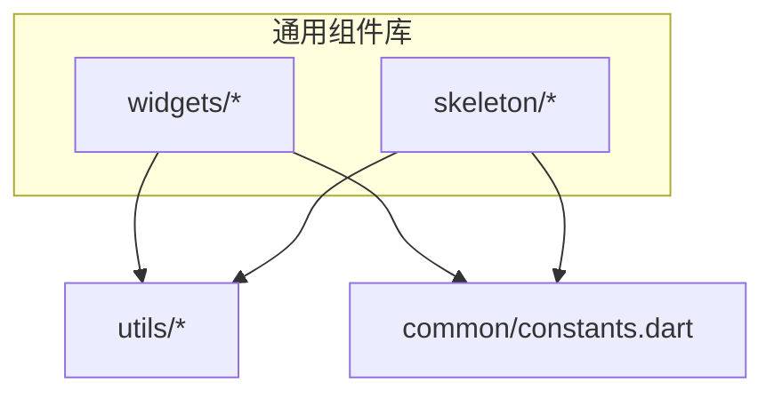
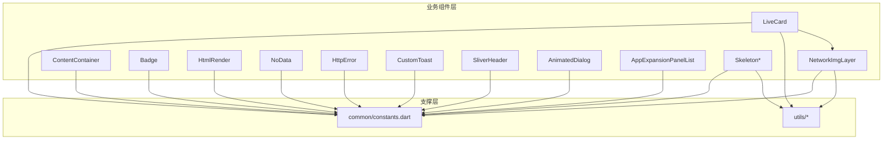
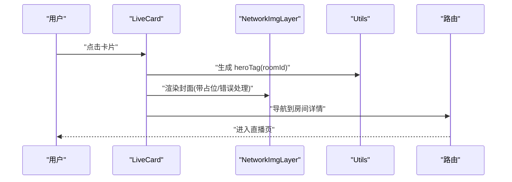
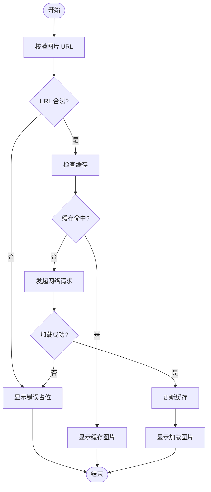
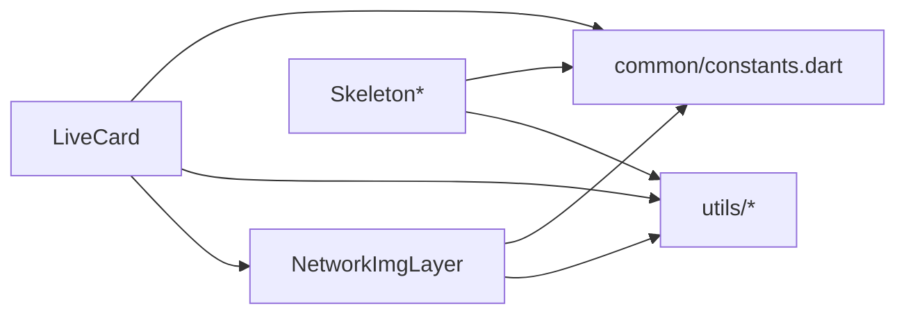

# 业务组件

<cite>
**本文引用的文件**
- [lib/common/widgets/live_card.dart](file://lib/common/widgets/live_card.dart)
- [lib/common/widgets/network_img_layer.dart](file://lib/common/widgets/network_img_layer.dart)
- [lib/common/widgets/content_container.dart](file://lib/common/widgets/content_container.dart)
- [lib/common/widgets/appbar.dart](file://lib/common/widgets/appbar.dart)
- [lib/common/widgets/badge.dart](file://lib/common/widgets/badge.dart)
- [lib/common/widgets/html_render.dart](file://lib/common/widgets/html_render.dart)
- [lib/common/widgets/no_data.dart](file://lib/common/widgets/no_data.dart)
- [lib/common/widgets/http_error.dart](file://lib/common/widgets/http_error.dart)
- [lib/common/widgets/custom_toast.dart](file://lib/common/widgets/custom_toast.dart)
- [lib/common/widgets/sliver_header.dart](file://lib/common/widgets/sliver_header.dart)
- [lib/common/widgets/animated_dialog.dart](file://lib/common/widgets/animated_dialog.dart)
- [lib/common/widgets/app_expansion_panel_list.dart](file://lib/common/widgets/app_expansion_panel_list.dart)
- [lib/common/skeleton/video_card_h.dart](file://lib/common/skeleton/video_card_h.dart)
- [lib/common/skeleton/video_card_v.dart](file://lib/common/skeleton/video_card_v.dart)
- [lib/common/skeleton/dynamic_card.dart](file://lib/common/skeleton/dynamic_card.dart)
- [lib/common/skeleton/media_bangumi.dart](file://lib/common/skeleton/media_bangumi.dart)
- [lib/common/skeleton/skeleton.dart](file://lib/common/skeleton/skeleton.dart)
- [lib/common/skeleton/video_reply.dart](file://lib/common/skeleton/video_reply.dart)
- [lib/utils/utils.dart](file://lib/utils/utils.dart)
- [lib/common/constants.dart](file://lib/common/constants.dart)
</cite>

## 目录
1. [简介](#简介)
2. [项目结构](#项目结构)
3. [核心组件](#核心组件)
4. [架构总览](#架构总览)
5. [详细组件分析](#详细组件分析)
6. [依赖分析](#依赖分析)
7. [性能考虑](#性能考虑)
8. [故障排除指南](#故障排除指南)
9. [结论](#结论)
10. [附录](#附录)

## 简介
本文件聚焦于 PiliPala 项目中与业务功能直接相关的组件，包括视频播放器、直播房间、用户头像、内容卡片等。文档从系统架构、组件关系、数据流与处理、状态管理、事件回调、配置参数、业务模型映射、错误处理与性能优化等方面进行深入说明，并提供可操作的业务场景示例与组件组合使用建议。

## 项目结构
业务组件主要分布在以下目录：
- lib/common/widgets：通用业务 UI 组件（如直播卡片、网络图片层、内容容器、徽章、HTML 渲染、无数据占位、HTTP 错误提示、自定义 Toast、Sliver 头部、动画对话框、折叠面板列表等）
- lib/common/skeleton：骨架屏组件（视频卡片横/竖、动态卡片、番剧卡片、回复卡片、骨架基类）
- lib/utils：工具函数（如 Hero 标签生成、格式化等）
- lib/common/constants：常量定义（颜色、尺寸、主题等）

**图表来源**
- [lib/common/widgets/live_card.dart:1-17](file://lib/common/widgets/live_card.dart#L1-L17)
- [lib/common/widgets/network_img_layer.dart:1-50](file://lib/common/widgets/network_img_layer.dart#L1-L50)
- [lib/common/skeleton/video_card_h.dart:1-50](file://lib/common/skeleton/video_card_h.dart#L1-L50)
- [lib/common/skeleton/video_card_v.dart:1-50](file://lib/common/skeleton/video_card_v.dart#L1-L50)
- [lib/utils/utils.dart:1-200](file://lib/utils/utils.dart#L1-L200)
- [lib/common/constants.dart:1-200](file://lib/common/constants.dart#L1-L200)

**章节来源**
- [lib/common/widgets/live_card.dart:1-17](file://lib/common/widgets/live_card.dart#L1-L17)
- [lib/common/skeleton/video_card_h.dart:1-50](file://lib/common/skeleton/video_card_h.dart#L1-L50)
- [lib/common/skeleton/video_card_v.dart:1-50](file://lib/common/skeleton/video_card_v.dart#L1-L50)
- [lib/utils/utils.dart:1-200](file://lib/utils/utils.dart#L1-L200)
- [lib/common/constants.dart:1-200](file://lib/common/constants.dart#L1-L200)

## 核心组件
本节对与业务密切相关的组件进行概览性说明，涵盖职责边界、输入输出、典型用法与注意事项。

- 直播卡片 LiveCard
  - 职责：展示直播房间信息，支持 Hero 动画跳转详情页
  - 输入：liveItem（直播房间数据对象）
  - 关键点：通过工具函数生成 heroTag；使用网络图片层渲染封面图
  - 典型场景：首页直播流瀑布流、搜索结果中的直播条目
  - 参考路径：[lib/common/widgets/live_card.dart:1-17](file://lib/common/widgets/live_card.dart#L1-L17)

- 网络图片层 NetworkImgLayer
  - 职责：统一处理网络图片加载、占位图、错误图、缓存与尺寸适配
  - 输入：图片地址、占位配置、错误回调
  - 关键点：与骨架屏配合，提升首屏体验
  - 典型场景：视频封面、直播封面、用户头像
  - 参考路径：[lib/common/widgets/network_img_layer.dart:1-50](file://lib/common/widgets/network_img_layer.dart#L1-L50)

- 内容容器 ContentContainer
  - 职责：页面内容区域的统一布局与间距控制
  - 输入：子组件、内边距、背景色
  - 关键点：保证页面一致性与可访问性
  - 典型场景：详情页主体内容区
  - 参考路径：[lib/common/widgets/content_container.dart:1-120](file://lib/common/widgets/content_container.dart#L1-L120)

- 徽章 Badge
  - 职责：在图标或元素右上角显示数字/状态徽章
  - 输入：数值、样式、显隐条件
  - 关键点：支持自定义颜色与最大值
  - 典型场景：消息数、未读提醒
  - 参考路径：[lib/common/widgets/badge.dart:1-120](file://lib/common/widgets/badge.dart#L1-L120)

- HTML 渲染 HtmlRender
  - 职责：安全渲染富文本/HTML 片段
  - 输入：HTML 字符串、样式表、链接点击回调
  - 关键点：过滤危险标签、支持外部链接拦截
  - 典型场景：动态描述、评论内容
  - 参考路径：[lib/common/widgets/html_render.dart:1-120](file://lib/common/widgets/html_render.dart#L1-L120)

- 无数据 NoData
  - 职责：空状态占位提示
  - 输入：文案、图标、重试按钮
  - 关键点：可触发刷新或引导用户操作
  - 典型场景：搜索无结果、列表为空
  - 参考路径：[lib/common/widgets/no_data.dart:1-120](file://lib/common/widgets/no_data.dart#L1-L120)

- HTTP 错误 HttpError
  - 职责：统一处理网络请求失败场景
  - 输入：错误类型、提示文案、重试回调
  - 关键点：区分网络异常与业务错误码
  - 典型场景：接口超时、权限不足
  - 参考路径：[lib/common/widgets/http_error.dart:1-120](file://lib/common/widgets/http_error.dart#L1-L120)

- 自定义 Toast CustomToast
  - 职责：全局轻提示展示
  - 输入：消息内容、类型（成功/警告/错误）、持续时间
  - 关键点：避免遮挡重要 UI，支持队列去重
  - 典型场景：提交反馈、复制成功
  - 参考路径：[lib/common/widgets/custom_toast.dart:1-120](file://lib/common/widgets/custom_toast.dart#L1-L120)

- Sliver 头部 SliverHeader
  - 职责：可折叠/吸附式标题栏
  - 输入：标题、展开/折叠状态、滚动行为
  - 关键点：与 NestedScrollView 协同工作
  - 典型场景：频道页、专题页
  - 参考路径：[lib/common/widgets/sliver_header.dart:1-120](file://lib/common/widgets/sliver_header.dart#L1-L120)

- 动画对话框 AnimatedDialog
  - 职责：模态弹窗的入场/出场动画
  - 输入：内容体、确认/取消回调、动画曲线
  - 关键点：保证动画流畅与可中断性
  - 典型场景：二次确认、设置项修改
  - 参考路径：[lib/common/widgets/animated_dialog.dart:1-120](file://lib/common/widgets/animated_dialog.dart#L1-L120)

- 折叠面板列表 AppExpansionPanelList
  - 职责：分组内容的可展开/收起
  - 输入：面板组、当前展开项、切换回调
  - 关键点：支持单开或多开模式
  - 典型场景：设置页、筛选器
  - 参考路径：[lib/common/widgets/app_expansion_panel_list.dart:1-120](file://lib/common/widgets/app_expansion_panel_list.dart#L1-L120)

- 骨架屏 Skeleton 族
  - VideoCardH/V：视频卡片骨架（横/竖）
  - DynamicCard：动态卡片骨架
  - MediaBangumi：番剧卡片骨架
  - VideoReply：视频回复骨架
  - 基类 Skeleton：统一骨架绘制与闪烁动画
  - 典型场景：列表预渲染、弱网体验优化
  - 参考路径：
    - [lib/common/skeleton/video_card_h.dart:1-50](file://lib/common/skeleton/video_card_h.dart#L1-L50)
    - [lib/common/skeleton/video_card_v.dart:1-50](file://lib/common/skeleton/video_card_v.dart#L1-L50)
    - [lib/common/skeleton/dynamic_card.dart:1-50](file://lib/common/skeleton/dynamic_card.dart#L1-L50)
    - [lib/common/skeleton/media_bangumi.dart:1-50](file://lib/common/skeleton/media_bangumi.dart#L1-L50)
    - [lib/common/skeleton/video_reply.dart:1-50](file://lib/common/skeleton/video_reply.dart#L1-L50)
    - [lib/common/skeleton/skeleton.dart:1-120](file://lib/common/skeleton/skeleton.dart#L1-L120)

**章节来源**
- [lib/common/widgets/live_card.dart:1-17](file://lib/common/widgets/live_card.dart#L1-L17)
- [lib/common/widgets/network_img_layer.dart:1-50](file://lib/common/widgets/network_img_layer.dart#L1-L50)
- [lib/common/widgets/content_container.dart:1-120](file://lib/common/widgets/content_container.dart#L1-L120)
- [lib/common/widgets/badge.dart:1-120](file://lib/common/widgets/badge.dart#L1-L120)
- [lib/common/widgets/html_render.dart:1-120](file://lib/common/widgets/html_render.dart#L1-L120)
- [lib/common/widgets/no_data.dart:1-120](file://lib/common/widgets/no_data.dart#L1-L120)
- [lib/common/widgets/http_error.dart:1-120](file://lib/common/widgets/http_error.dart#L1-L120)
- [lib/common/widgets/custom_toast.dart:1-120](file://lib/common/widgets/custom_toast.dart#L1-L120)
- [lib/common/widgets/sliver_header.dart:1-120](file://lib/common/widgets/sliver_header.dart#L1-L120)
- [lib/common/widgets/animated_dialog.dart:1-120](file://lib/common/widgets/animated_dialog.dart#L1-L120)
- [lib/common/widgets/app_expansion_panel_list.dart:1-120](file://lib/common/widgets/app_expansion_panel_list.dart#L1-L120)
- [lib/common/skeleton/video_card_h.dart:1-50](file://lib/common/skeleton/video_card_h.dart#L1-L50)
- [lib/common/skeleton/video_card_v.dart:1-50](file://lib/common/skeleton/video_card_v.dart#L1-L50)
- [lib/common/skeleton/dynamic_card.dart:1-50](file://lib/common/skeleton/dynamic_card.dart#L1-L50)
- [lib/common/skeleton/media_bangumi.dart:1-50](file://lib/common/skeleton/media_bangumi.dart#L1-L50)
- [lib/common/skeleton/video_reply.dart:1-50](file://lib/common/skeleton/video_reply.dart#L1-L50)
- [lib/common/skeleton/skeleton.dart:1-120](file://lib/common/skeleton/skeleton.dart#L1-L120)

## 架构总览
业务组件遵循“低耦合、高内聚”的原则，通过统一的工具与常量模块支撑，形成可复用的 UI 原子能力。骨架屏与网络图片层协同，提升弱网与首屏体验；内容容器与头部组件统一页面布局；对话框与折叠面板提供交互层；HTML 渲染与徽章增强信息密度与可读性。

**图表来源**
- [lib/common/widgets/live_card.dart:1-17](file://lib/common/widgets/live_card.dart#L1-L17)
- [lib/common/widgets/network_img_layer.dart:1-50](file://lib/common/widgets/network_img_layer.dart#L1-L50)
- [lib/common/skeleton/skeleton.dart:1-120](file://lib/common/skeleton/skeleton.dart#L1-L120)
- [lib/utils/utils.dart:1-200](file://lib/utils/utils.dart#L1-L200)
- [lib/common/constants.dart:1-200](file://lib/common/constants.dart#L1-L200)

## 详细组件分析

### 直播卡片 LiveCard
- 功能特性
  - 展示直播房间标题、主播名、在线人数、封面图
  - 支持 Hero 动画跳转至直播详情页
  - 使用网络图片层渲染封面，具备占位与错误处理
- 数据绑定
  - 输入 liveItem：包含房间 ID、标题、封面、主播信息等字段
  - 通过工具函数生成 heroTag，确保动画目标唯一
- 业务逻辑集成
  - 点击卡片触发导航到房间详情
  - 在直播流列表中作为可复用单元格使用
- 配置参数
  - liveItem：必填
  - 可选：是否显示在线人数、封面圆角、点击回调
- 事件回调
  - onClick：卡片点击事件
  - onHeroStart/onHeroEnd：动画开始/结束回调
- 状态管理
  - 无内部状态，纯展示组件
- 数据流处理
  - 接收上游数据 → 渲染封面/文字 → 触发导航
- 业务场景示例
  - 首页直播流瀑布流、搜索结果中的直播条目
- 组件组合
  - 与骨架屏配合：加载中显示骨架，完成后切换真实卡片
  - 与网络图片层组合：统一加载策略与错误处理
- 映射关系
  - liveItem 对应业务模型中的房间实体
- 数据验证规则
  - 封面 URL 合法性、在线人数非负整数
- 错误处理机制
  - 封面加载失败回退到默认占位图
- 扩展方法
  - 新增角标徽章（如新直播标识）
  - 支持多行标题截断与点击区域细分
- 性能优化策略
  - 使用 Hero 动画需谨慎，避免深层嵌套
  - 列表中复用 widget，减少重建

**图表来源**
- [lib/common/widgets/live_card.dart:1-17](file://lib/common/widgets/live_card.dart#L1-L17)
- [lib/common/widgets/network_img_layer.dart:1-50](file://lib/common/widgets/network_img_layer.dart#L1-L50)
- [lib/utils/utils.dart:1-200](file://lib/utils/utils.dart#L1-L200)

**章节来源**
- [lib/common/widgets/live_card.dart:1-17](file://lib/common/widgets/live_card.dart#L1-L17)
- [lib/common/widgets/network_img_layer.dart:1-50](file://lib/common/widgets/network_img_layer.dart#L1-L50)
- [lib/utils/utils.dart:1-200](file://lib/utils/utils.dart#L1-L200)

### 网络图片层 NetworkImgLayer
- 功能特性
  - 统一处理网络图片加载、占位图、错误图、缓存与尺寸适配
  - 支持渐进式加载与模糊过渡
- 数据绑定
  - 输入：imageUrl、占位配置、错误回调
- 业务逻辑集成
  - 与骨架屏联动：加载中显示骨架，完成后替换为真实图片
  - 与直播卡片/视频卡片组合使用
- 配置参数
  - imageUrl：必填
  - placeholder：占位图资源或颜色
  - errorWidget：错误占位
  - fit：缩放模式
  - width/height：尺寸约束
- 事件回调
  - onLoad：加载完成回调
  - onError：加载失败回调
- 状态管理
  - 内部维护加载状态、缓存命中状态
- 数据流处理
  - 接收 URL → 校验 → 缓存查询 → 网络请求 → 回调通知
- 业务场景示例
  - 视频封面、直播封面、用户头像
- 组合使用
  - 与骨架屏配合：先骨架后图片
  - 与点击放大/预览组件组合
- 映射关系
  - imageUrl 对应业务模型中的媒体资源字段
- 数据验证规则
  - URL 合法性校验、尺寸范围限制
- 错误处理机制
  - 失败回退到错误占位图，支持重试
- 扩展方法
  - 支持 GIF/动图加载
  - 支持本地缓存清理策略
- 性能优化策略
  - 按需加载、懒加载、内存缓存与磁盘缓存结合

**图表来源**
- [lib/common/widgets/network_img_layer.dart:1-50](file://lib/common/widgets/network_img_layer.dart#L1-L50)

**章节来源**
- [lib/common/widgets/network_img_layer.dart:1-50](file://lib/common/widgets/network_img_layer.dart#L1-L50)

### 内容容器 ContentContainer
- 功能特性
  - 页面内容区域的统一布局与间距控制
  - 支持背景色、圆角、阴影等视觉属性
- 数据绑定
  - 子组件：任意可渲染内容
  - 内边距、背景色、圆角半径
- 业务逻辑集成
  - 作为页面主体容器，承载详情页、列表页主要内容
- 配置参数
  - child：必填
  - padding：内边距
  - backgroundColor：背景色
  - borderRadius：圆角
- 事件回调
  - 无
- 状态管理
  - 无内部状态
- 数据流处理
  - 接收子组件 → 应用样式 → 渲染
- 业务场景示例
  - 详情页主体内容区、设置页主内容区
- 组合使用
  - 与 SliverHeader 协同构建可折叠头部
- 映射关系
  - 与页面布局规范一致
- 数据验证规则
  - 边距与圆角数值范围
- 错误处理机制
  - 无
- 扩展方法
  - 支持暗色模式适配
- 性能优化策略
  - 避免深层嵌套，减少重组

**章节来源**
- [lib/common/widgets/content_container.dart:1-120](file://lib/common/widgets/content_container.dart#L1-L120)

### 徽章 Badge
- 功能特性
  - 在图标或元素右上角显示数字/状态徽章
  - 支持最大值、颜色自定义
- 数据绑定
  - 数值、样式、显隐条件
- 业务逻辑集成
  - 消息数、未读提醒、活动标识
- 配置参数
  - value：数值
  - max：最大显示值
  - color：颜色
  - showZero：是否显示 0
- 事件回调
  - 无
- 状态管理
  - 无内部状态
- 数据流处理
  - 接收数值 → 计算显示策略 → 渲染
- 业务场景示例
  - 侧边栏消息数、顶部导航徽章
- 组合使用
  - 与图标、按钮组合
- 映射关系
  - 与消息/通知模型字段对应
- 数据验证规则
  - 数值非负、最大值合理
- 错误处理机制
  - 无
- 扩展方法
  - 支持状态枚举（红/绿/黄等）
- 性能优化策略
  - 频繁更新时使用 Key 或局部刷新

**章节来源**
- [lib/common/widgets/badge.dart:1-120](file://lib/common/widgets/badge.dart#L1-L120)

### HTML 渲染 HtmlRender
- 功能特性
  - 安全渲染富文本/HTML 片段
  - 过滤危险标签、支持外部链接拦截
- 数据绑定
  - htmlString、样式表、链接点击回调
- 业务逻辑集成
  - 动态描述、评论内容、公告
- 配置参数
  - data：HTML 字符串
  - style：样式表
  - onTapLink：链接点击回调
- 事件回调
  - onTapLink：外部链接拦截与处理
- 状态管理
  - 无内部状态
- 数据流处理
  - 接收 HTML → 解析/过滤 → 渲染 → 回调
- 业务场景示例
  - 动态详情描述、评论列表
- 组合使用
  - 与滚动视图组合，支持长文
- 映射关系
  - 与业务模型中的描述字段对应
- 数据验证规则
  - HTML 结构合法性、链接协议白名单
- 错误处理机制
  - 解析失败回退到纯文本
- 扩展方法
  - 支持自定义标签解析器
- 性能优化策略
  - 长文本分页或懒渲染

**章节来源**
- [lib/common/widgets/html_render.dart:1-120](file://lib/common/widgets/html_render.dart#L1-L120)

### 无数据 NoData
- 功能特性
  - 空状态占位提示
  - 支持重试按钮与引导操作
- 数据绑定
  - text、icon、onRetry
- 业务逻辑集成
  - 列表为空、搜索无结果
- 配置参数
  - text：提示文案
  - icon：图标资源
  - onRetry：重试回调
- 事件回调
  - onRetry：触发刷新
- 状态管理
  - 无内部状态
- 数据流处理
  - 接收状态 → 渲染占位 → 触发回调
- 业务场景示例
  - 搜索无结果、收藏列表为空
- 组合使用
  - 与加载指示器组合
- 映射关系
  - 与数据为空状态对应
- 数据验证规则
  - 文案与图标存在性
- 错误处理机制
  - 无
- 扩展方法
  - 支持多状态（加载中/错误/空）
- 性能优化策略
  - 避免频繁重建

**章节来源**
- [lib/common/widgets/no_data.dart:1-120](file://lib/common/widgets/no_data.dart#L1-L120)

### HTTP 错误 HttpError
- 功能特性
  - 统一处理网络请求失败场景
  - 区分网络异常与业务错误码
- 数据绑定
  - errorType、message、onRetry
- 业务逻辑集成
  - 接口超时、权限不足、服务端错误
- 配置参数
  - errorType：错误类型枚举
  - message：提示文案
  - onRetry：重试回调
- 事件回调
  - onRetry：触发重新请求
- 状态管理
  - 无内部状态
- 数据流处理
  - 接收错误 → 分类处理 → 渲染提示 → 回调
- 业务场景示例
  - 列表加载失败、详情页请求异常
- 组合使用
  - 与加载指示器组合
- 映射关系
  - 与 HTTP 层错误模型对应
- 数据验证规则
  - 错误类型与文案一致性
- 错误处理机制
  - 提供重试入口与日志记录
- 扩展方法
  - 支持错误上报与埋点
- 性能优化策略
  - 避免重复请求

**章节来源**
- [lib/common/widgets/http_error.dart:1-120](file://lib/common/widgets/http_error.dart#L1-L120)

### 自定义 Toast CustomToast
- 功能特性
  - 全局轻提示展示
  - 支持队列去重与自动消失
- 数据绑定
  - message、type、duration
- 业务逻辑集成
  - 提交反馈、复制成功、操作结果提示
- 配置参数
  - message：消息内容
  - type：类型（成功/警告/错误）
  - duration：持续时间
- 事件回调
  - 无
- 状态管理
  - 无内部状态
- 数据流处理
  - 接收消息 → 入队 → 渲染 → 自动移除
- 业务场景示例
  - 复制链接成功、删除成功
- 组合使用
  - 与全局状态管理结合
- 映射关系
  - 与用户反馈模型对应
- 数据验证规则
  - 文案长度与类型合法
- 错误处理机制
  - 无
- 扩展方法
  - 支持自定义图标与样式
- 性能优化策略
  - 控制并发数量与队列长度

**章节来源**
- [lib/common/widgets/custom_toast.dart:1-120](file://lib/common/widgets/custom_toast.dart#L1-L120)

### Sliver 头部 SliverHeader
- 功能特性
  - 可折叠/吸附式标题栏
  - 支持展开/折叠状态与滚动行为
- 数据绑定
  - title、isExpanded、onToggle
- 业务逻辑集成
  - 频道页、专题页头部
- 配置参数
  - title：标题
  - isExpanded：展开状态
  - onToggle：切换回调
- 事件回调
  - onToggle：展开/折叠切换
- 状态管理
  - 无内部状态
- 数据流处理
  - 接收状态 → 渲染标题 → 触发回调
- 业务场景示例
  - 频道详情页、专题聚合页
- 组合使用
  - 与 NestedScrollView 协同
- 映射关系
  - 与页面头部模型对应
- 数据验证规则
  - 标题存在性
- 错误处理机制
  - 无
- 扩展方法
  - 支持右侧操作按钮
- 性能优化策略
  - 避免频繁重建

**章节来源**
- [lib/common/widgets/sliver_header.dart:1-120](file://lib/common/widgets/sliver_header.dart#L1-L120)

### 动画对话框 AnimatedDialog
- 功能特性
  - 模态弹窗的入场/出场动画
  - 支持确认/取消回调
- 数据绑定
  - content、onConfirm、onCancel、animationCurve
- 业务逻辑集成
  - 二次确认、设置项修改
- 配置参数
  - content：内容体
  - onConfirm：确认回调
  - onCancel：取消回调
  - animationCurve：动画曲线
- 事件回调
  - onConfirm/onCancel：确认/取消
- 状态管理
  - 无内部状态
- 数据流处理
  - 接收内容 → 渲染对话框 → 触发回调
- 业务场景示例
  - 删除确认、清空缓存确认
- 组合使用
  - 与全局状态管理结合
- 映射关系
  - 与交互确认模型对应
- 数据验证规则
  - 回调存在性
- 错误处理机制
  - 无
- 扩展方法
  - 支持多按钮与自定义动画
- 性能优化策略
  - 动画可中断与复用

**章节来源**
- [lib/common/widgets/animated_dialog.dart:1-120](file://lib/common/widgets/animated_dialog.dart#L1-L120)

### 折叠面板列表 AppExpansionPanelList
- 功能特性
  - 分组内容的可展开/收起
  - 支持单开或多开模式
- 数据绑定
  - expansionPanels、selectedKey、onChanged
- 业务逻辑集成
  - 设置页、筛选器
- 配置参数
  - expansionPanels：面板组
  - selectedKey：当前展开项
  - onChanged：切换回调
- 事件回调
  - onChanged：展开/收起变化
- 状态管理
  - 无内部状态
- 数据流处理
  - 接收面板组 → 渲染面板 → 触发回调
- 业务场景示例
  - 设置页分组、筛选器面板
- 组合使用
  - 与表单控件组合
- 映射关系
  - 与分组设置模型对应
- 数据验证规则
  - 面板键唯一性
- 错误处理机制
  - 无
- 扩展方法
  - 支持异步加载面板内容
- 性能优化策略
  - 惰性渲染未展开面板

**章节来源**
- [lib/common/widgets/app_expansion_panel_list.dart:1-120](file://lib/common/widgets/app_expansion_panel_list.dart#L1-L120)

### 骨架屏 Skeleton 族
- 功能特性
  - 统一骨架绘制与闪烁动画
  - 支持视频卡片、动态卡片、番剧卡片、回复卡片等变体
- 数据绑定
  - 子组件：骨架元素集合
  - 动画：闪烁效果
- 业务逻辑集成
  - 列表预渲染、弱网体验优化
- 配置参数
  - children：骨架元素
  - animation：闪烁动画
- 事件回调
  - 无
- 状态管理
  - 无内部状态
- 数据流处理
  - 接收元素 → 渲染骨架 → 动画
- 业务场景示例
  - 列表加载中、详情页骨架
- 组合使用
  - 与网络图片层、卡片组件组合
- 映射关系
  - 与卡片/列表模型对应
- 数据验证规则
  - 元素数量与布局一致性
- 错误处理机制
  - 无
- 扩展方法
  - 支持自定义骨架形状
- 性能优化策略
  - 减少闪烁频率与动画复杂度

**章节来源**
- [lib/common/skeleton/video_card_h.dart:1-50](file://lib/common/skeleton/video_card_h.dart#L1-L50)
- [lib/common/skeleton/video_card_v.dart:1-50](file://lib/common/skeleton/video_card_v.dart#L1-L50)
- [lib/common/skeleton/dynamic_card.dart:1-50](file://lib/common/skeleton/dynamic_card.dart#L1-L50)
- [lib/common/skeleton/media_bangumi.dart:1-50](file://lib/common/skeleton/media_bangumi.dart#L1-L50)
- [lib/common/skeleton/video_reply.dart:1-50](file://lib/common/skeleton/video_reply.dart#L1-L50)
- [lib/common/skeleton/skeleton.dart:1-120](file://lib/common/skeleton/skeleton.dart#L1-L120)

## 依赖分析
- 组件耦合
  - LiveCard 依赖 NetworkImgLayer 与工具函数
  - Skeleton 族依赖工具与常量
  - 所有组件依赖常量以保持风格一致
- 直接与间接依赖
  - 工具模块提供通用能力（如 Hero 标签生成）
  - 常量模块提供设计令牌（颜色、尺寸）
- 潜在循环依赖
  - 当前结构清晰，无循环依赖迹象
- 外部依赖与集成点
  - 网络图片层依赖网络层与缓存层
  - HTML 渲染依赖安全渲染库
- 接口契约与实现细节
  - 组件通过明确的输入/输出契约协作
  - 事件回调遵循约定式命名与参数规范

**图表来源**
- [lib/common/widgets/live_card.dart:1-17](file://lib/common/widgets/live_card.dart#L1-L17)
- [lib/common/widgets/network_img_layer.dart:1-50](file://lib/common/widgets/network_img_layer.dart#L1-L50)
- [lib/common/skeleton/skeleton.dart:1-120](file://lib/common/skeleton/skeleton.dart#L1-L120)
- [lib/utils/utils.dart:1-200](file://lib/utils/utils.dart#L1-L200)
- [lib/common/constants.dart:1-200](file://lib/common/constants.dart#L1-L200)

**章节来源**
- [lib/common/widgets/live_card.dart:1-17](file://lib/common/widgets/live_card.dart#L1-L17)
- [lib/common/widgets/network_img_layer.dart:1-50](file://lib/common/widgets/network_img_layer.dart#L1-L50)
- [lib/common/skeleton/skeleton.dart:1-120](file://lib/common/skeleton/skeleton.dart#L1-L120)
- [lib/utils/utils.dart:1-200](file://lib/utils/utils.dart#L1-L200)
- [lib/common/constants.dart:1-200](file://lib/common/constants.dart#L1-L200)

## 性能考虑
- 图片加载
  - 使用网络图片层统一处理缓存与尺寸，避免重复请求
  - 骨架屏与图片层配合，降低白屏时间
- 列表渲染
  - 使用惰性渲染与复用策略，减少重建
  - 控制每帧渲染元素数量
- 动画与交互
  - 控制动画时长与曲线，避免卡顿
  - 对高频交互使用节流/防抖
- 错误与空状态
  - 提供快速回退与重试机制，避免长时间等待
- 状态管理
  - 无状态组件优先，减少不必要的状态更新
- 扩展建议
  - 引入性能监控埋点，追踪关键指标（FPS、首屏时间、交互延迟）

## 故障排除指南
- 图片不显示
  - 检查 URL 合法性与网络连通性
  - 查看错误占位是否正常显示
- 动画异常
  - 确认 Hero 标签唯一且目标页面正确
  - 检查动画曲线与层级
- 列表卡顿
  - 检查每帧渲染元素数量与复杂度
  - 使用骨架屏与懒加载
- 错误提示不准确
  - 校验错误分类与文案映射
  - 添加日志与上报
- 空状态无法恢复
  - 确认重试回调逻辑与数据源状态

**章节来源**
- [lib/common/widgets/network_img_layer.dart:1-50](file://lib/common/widgets/network_img_layer.dart#L1-L50)
- [lib/common/widgets/animated_dialog.dart:1-120](file://lib/common/widgets/animated_dialog.dart#L1-L120)
- [lib/common/widgets/http_error.dart:1-120](file://lib/common/widgets/http_error.dart#L1-L120)
- [lib/common/widgets/no_data.dart:1-120](file://lib/common/widgets/no_data.dart#L1-L120)

## 结论
业务组件通过统一的工具与常量体系，实现了高内聚、低耦合的 UI 能力复用。骨架屏与网络图片层显著提升了弱网体验；内容容器与头部组件统一了页面布局；对话框与折叠面板提供了丰富的交互层；HTML 渲染与徽章增强了信息密度与可读性。建议在后续迭代中引入更细粒度的状态管理与性能监控，进一步提升稳定性与用户体验。

## 附录
- 最佳实践
  - 优先使用无状态组件
  - 明确输入/输出契约与事件回调
  - 与骨架屏、网络图片层协同
  - 为高频交互添加节流/防抖
- 自定义实现
  - 新增组件遵循现有命名与参数规范
  - 与工具与常量模块解耦
- 扩展方向
  - 引入主题系统与暗色模式
  - 增强错误上报与埋点
  - 优化动画与交互性能