# 基础组件

<cite>
**本文引用的文件**
- [animated_dialog.dart](file://lib/common/widgets/animated_dialog.dart)
- [badge.dart](file://lib/common/widgets/badge.dart)
- [content_container.dart](file://lib/common/widgets/content_container.dart)
- [custom_toast.dart](file://lib/common/widgets/custom_toast.dart)
- [html_render.dart](file://lib/common/widgets/html_render.dart)
- [network_img_layer.dart](file://lib/common/widgets/network_img_layer.dart)
- [sliver_header.dart](file://lib/common/widgets/sliver_header.dart)
- [video_card_v.dart](file://lib/common/widgets/video_card_v.dart)
- [appbar.dart](file://lib/common/widgets/appbar.dart)
- [constants.dart](file://lib/common/constants.dart)
- [app_scheme.dart](file://lib/utils/app_scheme.dart)
- [storage.dart](file://lib/utils/storage.dart)
- [global_data_cache.dart](file://lib/utils/global_data_cache.dart)
- [route_push.dart](file://lib/utils/route_push.dart)
- [image_save.dart](file://lib/utils/image_save.dart)
- [feed_back.dart](file://lib/utils/feed_back.dart)
- [video_utils.dart](file://lib/utils/video_utils.dart)
</cite>

## 目录
1. [引言](#引言)
2. [项目结构](#项目结构)
3. [核心组件](#核心组件)
4. [架构总览](#架构总览)
5. [详细组件分析](#详细组件分析)
6. [依赖分析](#依赖分析)
7. [性能考虑](#性能考虑)
8. [故障排查指南](#故障排查指南)
9. [结论](#结论)
10. [附录](#附录)

## 引言
本章节面向开发者与产品同学，系统化梳理 PiliPala 项目中的基础 UI 组件体系，覆盖按钮、输入框、卡片、模态框等核心组件的外观、行为、交互与可定制项，并给出响应式设计、无障碍与跨平台兼容性的实践建议。文档以“组件即文件”的方式组织，便于定位到具体实现与使用示例。

## 项目结构
基础组件主要位于 lib/common/widgets 目录下，配合 lib/common/constants.dart 提供统一的样式常量；部分组件在构建时会依赖 lib/utils 下的工具类（如路由跳转、反馈、缓存、存储等）。

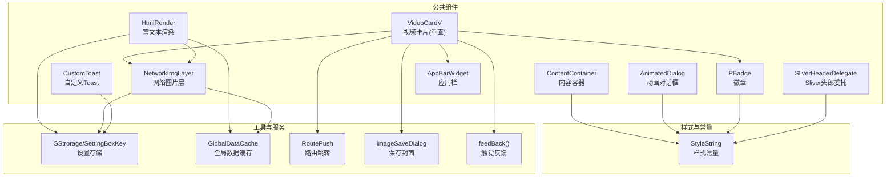

图示来源
- [video_card_v.dart:1-421](file://lib/common/widgets/video_card_v.dart#L1-L421)
- [html_render.dart:1-145](file://lib/common/widgets/html_render.dart#L1-L145)
- [network_img_layer.dart:1-128](file://lib/common/widgets/network_img_layer.dart#L1-L128)
- [animated_dialog.dart:1-60](file://lib/common/widgets/animated_dialog.dart#L1-L60)
- [badge.dart:1-89](file://lib/common/widgets/badge.dart#L1-L89)
- [content_container.dart:1-48](file://lib/common/widgets/content_container.dart#L1-L48)
- [custom_toast.dart:1-37](file://lib/common/widgets/custom_toast.dart#L1-L37)
- [sliver_header.dart:1-25](file://lib/common/widgets/sliver_header.dart#L1-L25)
- [appbar.dart:1-33](file://lib/common/widgets/appbar.dart#L1-L33)
- [constants.dart:1-21](file://lib/common/constants.dart#L1-L21)

章节来源
- [constants.dart:1-21](file://lib/common/constants.dart#L1-L21)

## 核心组件
本节概览各基础组件的职责与典型用法，后续章节将逐个深入。

- AnimatedDialog：全屏遮罩背景 + 缩放/淡入动画弹出子视图，支持点击遮罩关闭回调。
- PBadge：多形态徽章（主色/灰度/彩色/描边），支持尺寸、位置堆叠与字号。
- ContentContainer：基于 LayoutBuilder 的自适应滚动容器，支持底部固定区与禁滚开关。
- CustomToast：基于设置项控制透明度的轻提示，居底显示。
- HtmlRender：扩展 Html 渲染，支持代码高亮与图片点击预览画廊。
- NetworkImgLayer：网络图片加载、缓存、占位与质量参数化，支持头像/表情/普通图不同圆角。
- SliverHeaderDelegate：Sliver 可停靠头部委托，固定高度。
- VideoCardV：视频卡片（垂直布局），含标题、统计、徽章、更多面板等。
- AppBarWidget：基于 AnimationController 的滑入滑出应用栏。

章节来源
- [animated_dialog.dart:1-60](file://lib/common/widgets/animated_dialog.dart#L1-L60)
- [badge.dart:1-89](file://lib/common/widgets/badge.dart#L1-L89)
- [content_container.dart:1-48](file://lib/common/widgets/content_container.dart#L1-L48)
- [custom_toast.dart:1-37](file://lib/common/widgets/custom_toast.dart#L1-L37)
- [html_render.dart:1-145](file://lib/common/widgets/html_render.dart#L1-L145)
- [network_img_layer.dart:1-128](file://lib/common/widgets/network_img_layer.dart#L1-L128)
- [sliver_header.dart:1-25](file://lib/common/widgets/sliver_header.dart#L1-L25)
- [video_card_v.dart:1-421](file://lib/common/widgets/video_card_v.dart#L1-L421)
- [appbar.dart:1-33](file://lib/common/widgets/appbar.dart#L1-L33)

## 架构总览
以下序列图展示“视频卡片点击 -> 打开详情/更多面板 -> 保存封面/稍后再看/拉黑”这一关键交互链路。

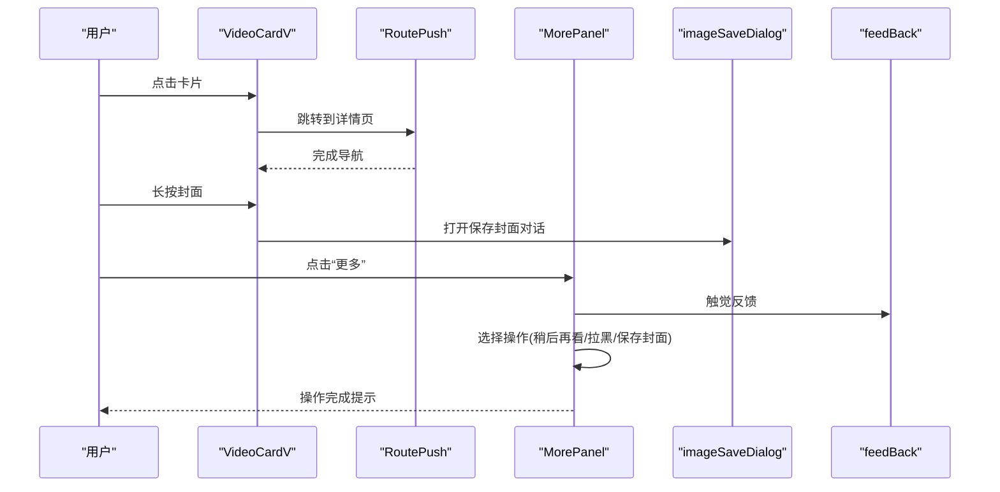

图示来源
- [video_card_v.dart:37-107](file://lib/common/widgets/video_card_v.dart#L37-L107)
- [video_card_v.dart:244-262](file://lib/common/widgets/video_card_v.dart#L244-L262)
- [video_card_v.dart:306-420](file://lib/common/widgets/video_card_v.dart#L306-L420)
- [route_push.dart:1-200](file://lib/utils/route_push.dart#L1-L200)
- [image_save.dart:1-200](file://lib/utils/image_save.dart#L1-L200)
- [feed_back.dart:1-200](file://lib/utils/feed_back.dart#L1-L200)

## 详细组件分析

### AnimatedDialog（动画对话框）
- 外观与行为
  - 全屏半透明黑色背景，点击背景触发关闭回调。
  - 弹窗采用缩放与淡入组合动画，时长与曲线可配置。
- 关键属性
  - child：弹窗主体内容。
  - closeFn：点击遮罩时的回调函数。
- 使用场景
  - 作为模态框的外层容器，承载图片画廊、登录提示等。
- 交互与事件
  - 点击背景触发关闭回调；内部内容通过 ScaleTransition/FadeTransition 展示。
- 样式与定制
  - 背景透明度由动画值驱动；可通过外部传入 child 自定义任意内容。
- 响应式与无障碍
  - 响应式：基于屏幕尺寸的全屏覆盖；无障碍：当前未显式设置可访问标签。
- 跨平台兼容
  - 使用 Flutter 原生动画与手势，跨平台一致。

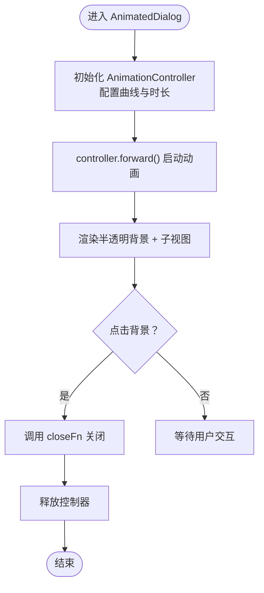

图示来源
- [animated_dialog.dart:14-58](file://lib/common/widgets/animated_dialog.dart#L14-L58)

章节来源
- [animated_dialog.dart:1-60](file://lib/common/widgets/animated_dialog.dart#L1-L60)

### PBadge（徽章）
- 外观与行为
  - 支持多种类型：主色、灰色、彩色、描边；多种尺寸：小/中；两种堆叠：定位/内边距。
  - 字体大小可配置，圆角可随尺寸变化。
- 关键属性
  - text：徽章文本。
  - type：primary/gray/color/line。
  - size：small/medium。
  - stack：position/normal。
  - top/right/bottom/left：定位偏移。
  - fs：字体大小。
- 使用场景
  - 视频时长、推荐理由、是否关注、番剧标签等。
- 交互与事件
  - 当前为静态展示，无交互事件。
- 样式与定制
  - 背景色/前景色/描边色根据主题与类型自动切换；定位堆叠与内边距堆叠二选一。
- 响应式与无障碍
  - 文字截断与紧凑布局适配不同屏幕；无障碍：可结合父级语义补充可访问名称。
- 跨平台兼容
  - 使用 Flutter 原生容器与文本组件，跨平台一致。

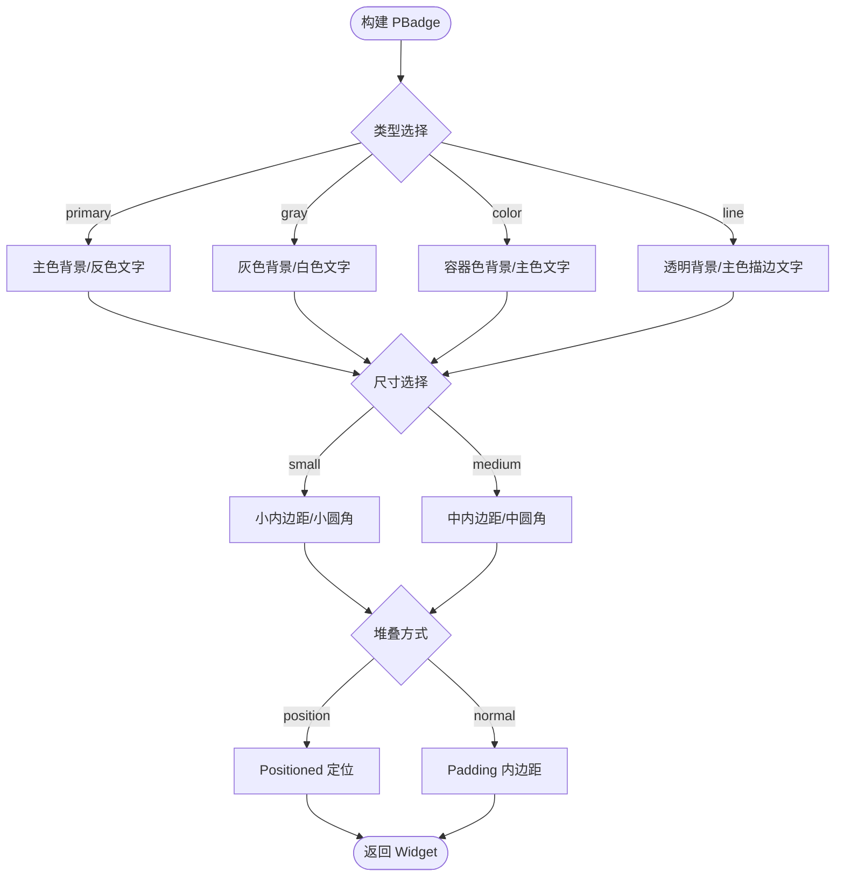

图示来源
- [badge.dart:27-87](file://lib/common/widgets/badge.dart#L27-L87)
- [constants.dart:3-9](file://lib/common/constants.dart#L3-L9)

章节来源
- [badge.dart:1-89](file://lib/common/widgets/badge.dart#L1-L89)
- [constants.dart:1-21](file://lib/common/constants.dart#L1-L21)

### ContentContainer（内容容器）
- 外观与行为
  - 基于 LayoutBuilder 获取父容器约束，内部使用 IntrinsicHeight 保证底部区域对齐。
  - 支持内容区与底部区并列，内容区可滚动或禁滚。
- 关键属性
  - contentWidget：内容区。
  - bottomWidget：底部区（如工具栏/加载区）。
  - isScrollable：是否允许滚动。
  - childClipBehavior：裁剪策略。
- 使用场景
  - 页面主体内容 + 底部操作条的组合布局。
- 交互与事件
  - 通过 isScrollable 控制滚动行为；无额外交互。
- 样式与定制
  - 通过 clipBehavior 与约束组合实现不同视觉效果。
- 响应式与无障碍
  - 响应式：自适应父容器宽度与最小/最大高度；无障碍：建议为底部区提供明确语义。
- 跨平台兼容
  - 使用 Flutter 原生布局控件，跨平台一致。

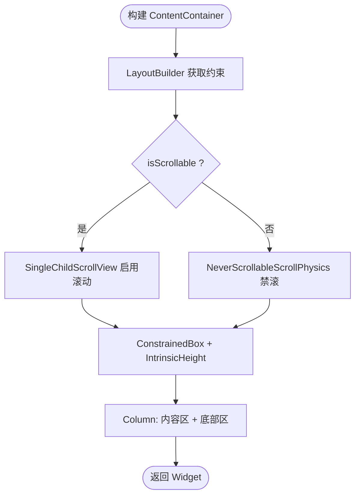

图示来源
- [content_container.dart:18-46](file://lib/common/widgets/content_container.dart#L18-L46)

章节来源
- [content_container.dart:1-48](file://lib/common/widgets/content_container.dart#L1-L48)

### CustomToast（自定义Toast）
- 外观与行为
  - 底部居中显示，圆角背景，文字颜色与主题一致。
  - 透明度来自设置项，默认 1.0。
- 关键属性
  - msg：提示文本。
- 使用场景
  - 操作结果提示、网络状态提示等。
- 交互与事件
  - 当前为静态展示，无交互。
- 样式与定制
  - 透明度通过 SettingBoxKey.defaultToastOp 读取；颜色与圆角可按主题调整。
- 响应式与无障碍
  - 响应式：底部安全区自适应；无障碍：建议在触发处提供 Announce。
- 跨平台兼容
  - 使用 Flutter 原生组件，跨平台一致。

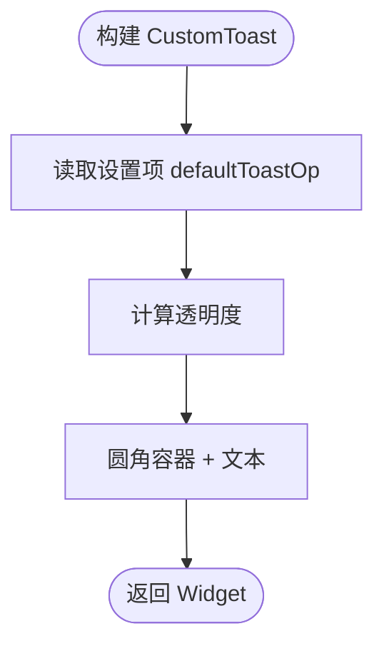

图示来源
- [custom_toast.dart:14-35](file://lib/common/widgets/custom_toast.dart#L14-L35)
- [storage.dart:1-200](file://lib/utils/storage.dart#L1-L200)

章节来源
- [custom_toast.dart:1-37](file://lib/common/widgets/custom_toast.dart#L1-L37)
- [storage.dart:1-200](file://lib/utils/storage.dart#L1-L200)

### HtmlRender（富文本渲染）
- 外观与行为
  - 支持代码块高亮（基于 highlight 工具）、链接点击、图片点击放大画廊。
  - 图片自动 HTTPS 升级、@质量参数拼接、表情/商城图过滤。
- 关键属性
  - htmlContent：HTML 字符串。
  - imgCount/imgList：图片计数与列表，用于画廊索引。
- 使用场景
  - 动态正文、文章内容、评论富文本。
- 交互与事件
  - 点击图片打开画廊；链接点击为空实现（预留）。
- 样式与定制
  - 通过 style 映射统一字体、行高、段落间距与链接颜色。
- 响应式与无障碍
  - 响应式：基于 Html 组件的自适应；无障碍：建议为图片提供替代文本。
- 跨平台兼容
  - 使用 flutter_html 与 cached_network_image，跨平台一致。

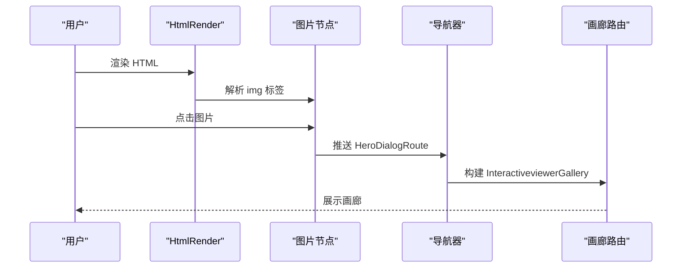

图示来源
- [html_render.dart:23-143](file://lib/common/widgets/html_render.dart#L23-L143)

章节来源
- [html_render.dart:1-145](file://lib/common/widgets/html_render.dart#L1-L145)

### NetworkImgLayer（网络图片层）
- 外观与行为
  - 支持占位图、错误图、缓存尺寸计算、质量参数化与圆角类型。
  - 自动处理协议升级与尺寸缓存，避免内存浪费。
- 关键属性
  - src/width/height/type/fadeOutDuration/fadeInDuration/quality/origAspectRatio。
- 使用场景
  - 封面图、头像、表情、背景图。
- 交互与事件
  - 当前为静态展示，无交互。
- 样式与定制
  - 圆角类型：头像=圆形、表情=方形、普通=主题圆角；质量默认从全局缓存读取。
- 响应式与无障碍
  - 响应式：cacheSize 计算缓存尺寸；无障碍：建议为重要图片提供描述。
- 跨平台兼容
  - 使用 cached_network_image，跨平台一致。

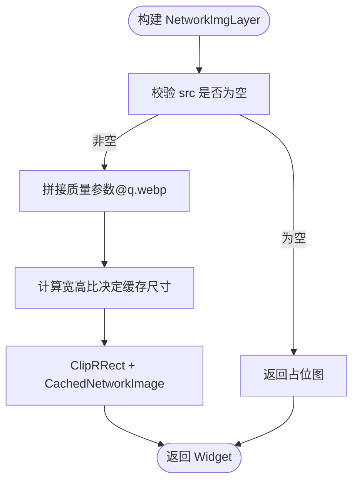

图示来源
- [network_img_layer.dart:34-96](file://lib/common/widgets/network_img_layer.dart#L34-L96)
- [global_data_cache.dart:1-200](file://lib/utils/global_data_cache.dart#L1-L200)

章节来源
- [network_img_layer.dart:1-128](file://lib/common/widgets/network_img_layer.dart#L1-L128)
- [global_data_cache.dart:1-200](file://lib/utils/global_data_cache.dart#L1-L200)

### SliverHeaderDelegate（Sliver头部委托）
- 外观与行为
  - 固定高度的可停靠头部，随滚动停靠。
- 关键属性
  - height：头部高度。
  - child：头部内容。
- 使用场景
  - 列表顶部固定标题/搜索栏。
- 交互与事件
  - 无交互，仅渲染。
- 样式与定制
  - 通过 child 自定义内容；高度固定。
- 响应式与无障碍
  - 响应式：随 Sliver 列表滚动；无障碍：建议为头部内容提供语义。
- 跨平台兼容
  - 使用 Flutter 原生 Sliver API，跨平台一致。

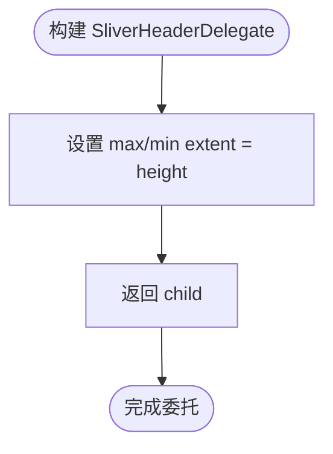

图示来源
- [sliver_header.dart:3-24](file://lib/common/widgets/sliver_header.dart#L3-L24)

章节来源
- [sliver_header.dart:1-25](file://lib/common/widgets/sliver_header.dart#L1-L25)

### VideoCardV（视频卡片-垂直布局）
- 外观与行为
  - 包含封面 Hero 动画、时长徽章、标题、统计、更多面板等。
  - 支持长按保存封面、点击进入详情页。
- 关键属性
  - videoItem：数据模型。
  - crossAxisCount：网格密度影响徽章与统计显示。
  - blockUserCb：屏蔽用户回调。
- 使用场景
  - 视频流/推荐流/搜索结果卡片。
- 交互与事件
  - 点击卡片：根据 goto 类型跳转到视频详情/番剧/动态/网页。
  - 长按封面：打开保存封面对话。
  - 更多按钮：打开底部面板进行“稍后再看/拉黑/保存封面”等操作。
- 样式与定制
  - 徽章、统计、圆角、间距等统一由 StyleString 与主题驱动。
- 响应式与无障碍
  - 响应式：Aspect 与 LayoutBuilder 适配不同屏幕；无障碍：建议为按钮提供可访问名称。
- 跨平台兼容
  - 使用 Flutter 原生组件与第三方库，跨平台一致。

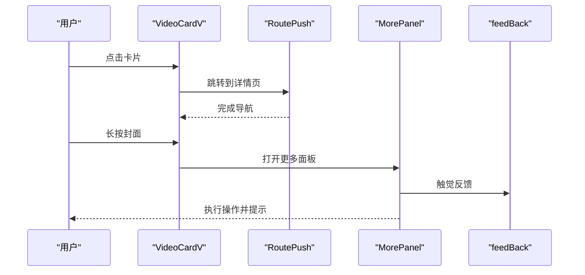

图示来源
- [video_card_v.dart:37-107](file://lib/common/widgets/video_card_v.dart#L37-L107)
- [video_card_v.dart:244-262](file://lib/common/widgets/video_card_v.dart#L244-L262)
- [video_card_v.dart:306-420](file://lib/common/widgets/video_card_v.dart#L306-L420)
- [route_push.dart:1-200](file://lib/utils/route_push.dart#L1-L200)
- [feed_back.dart:1-200](file://lib/utils/feed_back.dart#L1-L200)

章节来源
- [video_card_v.dart:1-421](file://lib/common/widgets/video_card_v.dart#L1-L421)
- [constants.dart:1-21](file://lib/common/constants.dart#L1-L21)

### AppBarWidget（应用栏）
- 外观与行为
  - 基于 AnimationController 控制显示/隐藏，使用 SlideTransition 实现滑入滑出。
- 关键属性
  - child：应用栏主体。
  - controller：动画控制器。
  - visible：是否可见。
- 使用场景
  - 滚动时自动隐藏/显示的应用栏。
- 交互与事件
  - 通过 visible 切换动画方向；无直接交互事件。
- 样式与定制
  - 通过 child 的 PreferredSize 控制高度；动画曲线可调。
- 响应式与无障碍
  - 响应式：随滚动状态变化；无障碍：建议为导航按钮提供语义。
- 跨平台兼容
  - 使用 Flutter 原生动画与布局，跨平台一致。

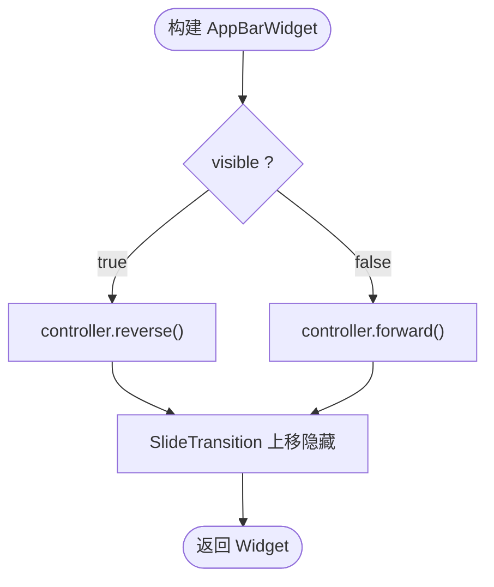

图示来源
- [appbar.dart:19-31](file://lib/common/widgets/appbar.dart#L19-L31)

章节来源
- [appbar.dart:1-33](file://lib/common/widgets/appbar.dart#L1-L33)

## 依赖分析
- 组件间耦合
  - VideoCardV 依赖 PBadge、NetworkImgLayer、MorePanel、RoutePush、imageSaveDialog、feedBack。
  - HtmlRender 依赖 NetworkImgLayer、GlobalDataCache、Setting 存储。
  - NetworkImgLayer 依赖 Setting 存储与全局缓存。
- 外部依赖
  - flutter_html、cached_network_image、flutter_smart_dialog、get_it、hive 等。
- 潜在循环依赖
  - 未发现直接循环；组件通过工具类解耦。

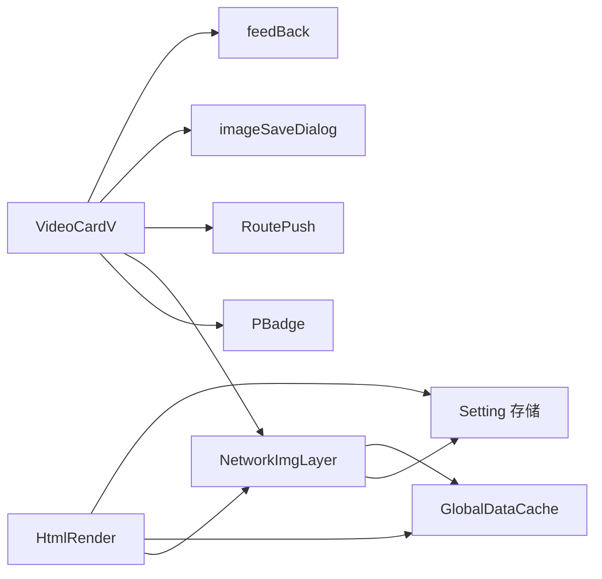

图示来源
- [video_card_v.dart:1-421](file://lib/common/widgets/video_card_v.dart#L1-L421)
- [html_render.dart:1-145](file://lib/common/widgets/html_render.dart#L1-L145)
- [network_img_layer.dart:1-128](file://lib/common/widgets/network_img_layer.dart#L1-L128)

章节来源
- [video_card_v.dart:1-421](file://lib/common/widgets/video_card_v.dart#L1-L421)
- [html_render.dart:1-145](file://lib/common/widgets/html_render.dart#L1-L145)
- [network_img_layer.dart:1-128](file://lib/common/widgets/network_img_layer.dart#L1-L128)

## 性能考虑
- 图片加载与缓存
  - 使用 cached_network_image 并结合缓存尺寸计算，减少内存占用与重绘。
  - 通过质量参数与 WebP 格式降低带宽与加载时间。
- 动画与过渡
  - AnimatedDialog 与 AppBarWidget 使用 AnimationController，注意在 dispose 中释放资源。
- 布局与滚动
  - ContentContainer 使用 IntrinsicHeight 与 ConstrainedBox，避免过度嵌套导致的布局抖动。
- 主题与样式
  - 统一使用 StyleString 与主题色，减少重复计算与样式冲突。

## 故障排查指南
- 图片不显示
  - 检查 src 是否为空或协议问题；确认质量参数与域名白名单。
  - 参考路径：[network_img_layer.dart:37-96](file://lib/common/widgets/network_img_layer.dart#L37-L96)
- 画廊无法打开
  - 确认图片 URL 正确且未被过滤（表情/商城图会被隐藏）。
  - 参考路径：[html_render.dart:43-112](file://lib/common/widgets/html_render.dart#L43-L112)
- Toast 透明度过高/过低
  - 检查 SettingBoxKey.defaultToastOp 设置项。
  - 参考路径：[custom_toast.dart:14-25](file://lib/common/widgets/custom_toast.dart#L14-L25)
- 卡片点击无反应
  - 检查 goto 类型与对应路由逻辑。
  - 参考路径：[video_card_v.dart:37-107](file://lib/common/widgets/video_card_v.dart#L37-L107)
- 应用栏不滑动
  - 确认 visible 与 controller 的联动逻辑。
  - 参考路径：[appbar.dart:20-31](file://lib/common/widgets/appbar.dart#L20-L31)

章节来源
- [network_img_layer.dart:1-128](file://lib/common/widgets/network_img_layer.dart#L1-L128)
- [html_render.dart:1-145](file://lib/common/widgets/html_render.dart#L1-L145)
- [custom_toast.dart:1-37](file://lib/common/widgets/custom_toast.dart#L1-L37)
- [video_card_v.dart:1-421](file://lib/common/widgets/video_card_v.dart#L1-L421)
- [appbar.dart:1-33](file://lib/common/widgets/appbar.dart#L1-L33)

## 结论
PiliPala 的基础组件以“可复用 + 可定制 + 可扩展”为目标，通过统一的样式常量与工具类支撑，形成清晰的组件分层与职责边界。建议在新增组件时遵循现有命名、参数与样式约定，确保一致性与可维护性。

## 附录
- 最佳实践
  - 统一使用 StyleString 与主题色，避免硬编码颜色。
  - 对图片组件统一设置缓存尺寸与质量参数。
  - 对动画组件在 dispose 中释放控制器。
- 常见问题
  - 图片加载失败时提供占位图与错误提示。
  - 富文本图片点击需考虑画廊体验与性能。
  - Toast 与提示需考虑用户偏好设置。