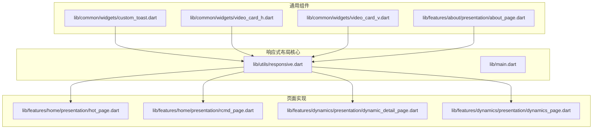
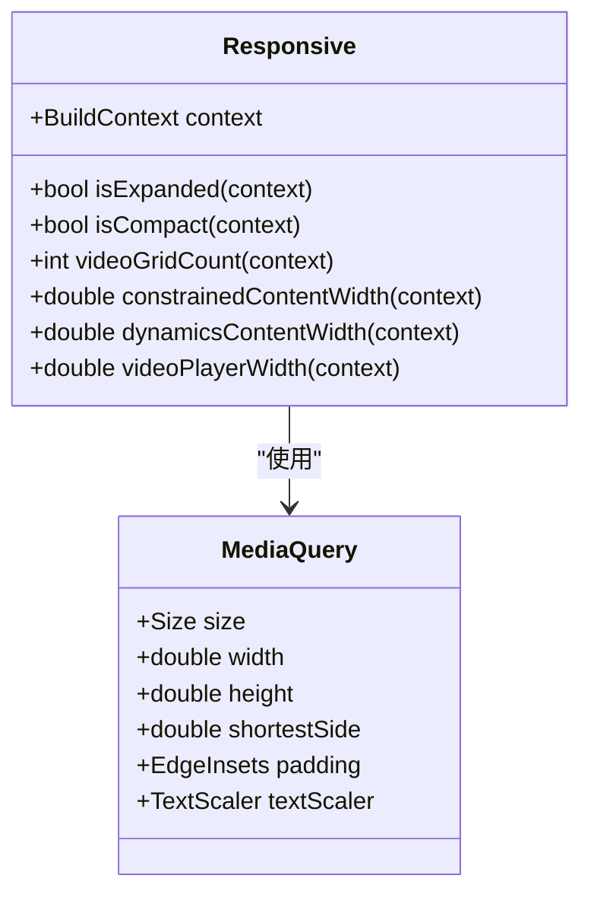
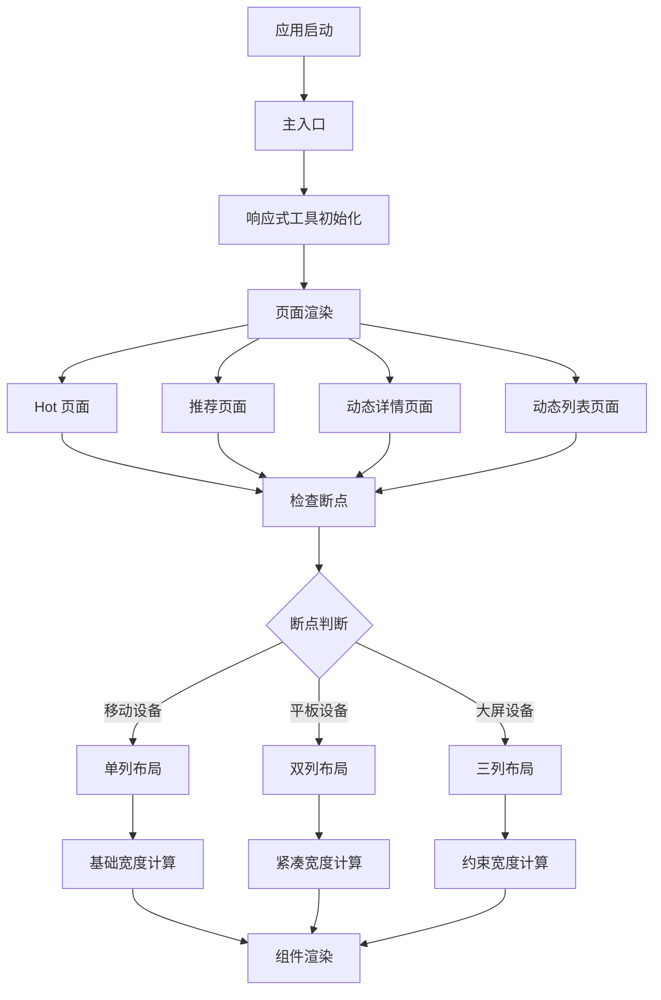
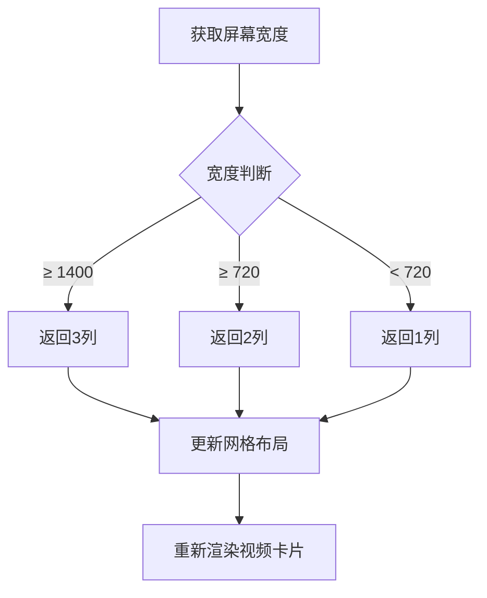
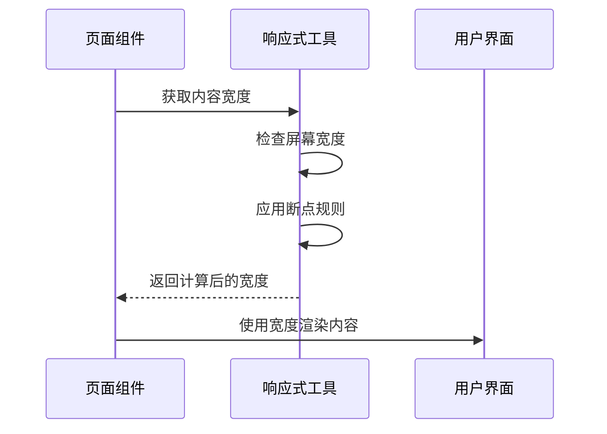
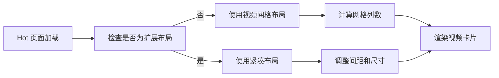
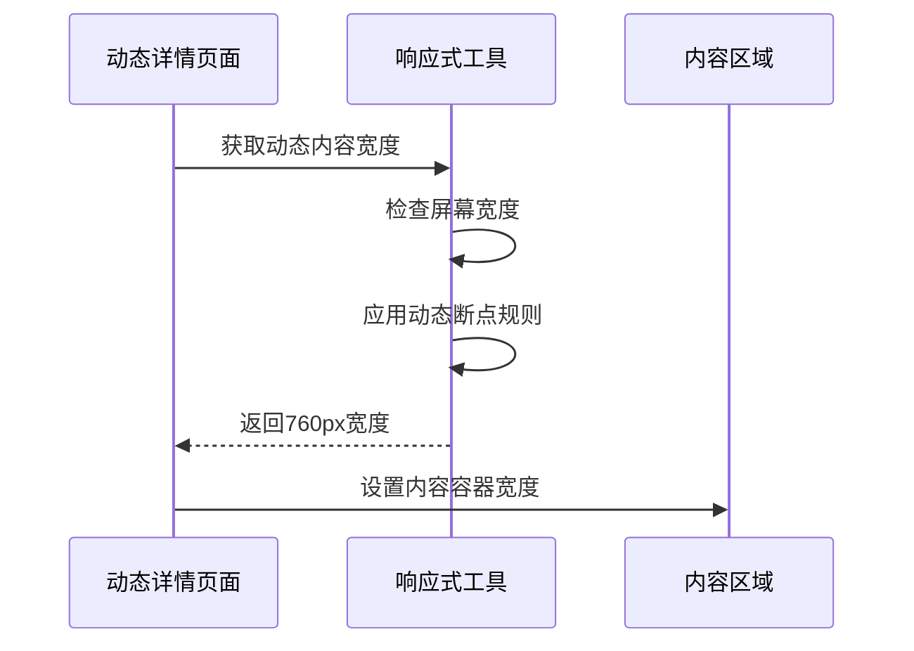
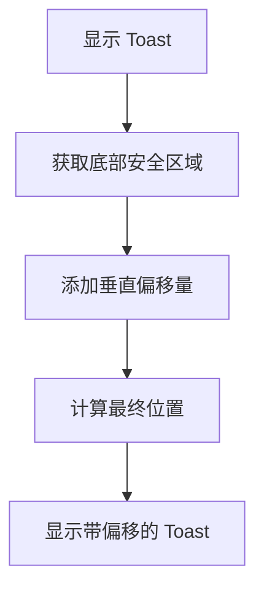
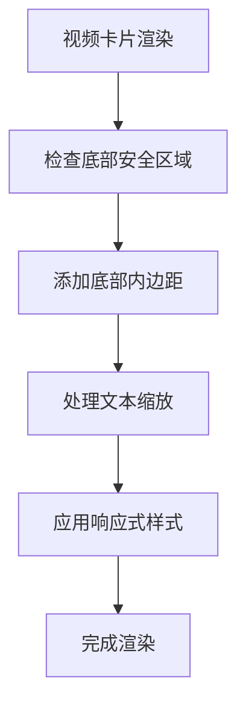
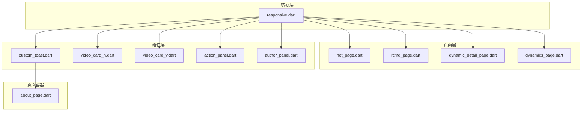

# 响应式布局工具

<cite>
**本文档引用的文件**
- [responsive.dart](file://lib/utils/responsive.dart)
- [main.dart](file://lib/main.dart)
- [hot_page.dart](file://lib/features/home/presentation/hot_page.dart)
- [rcmd_page.dart](file://lib/features/home/presentation/rcmd_page.dart)
- [dynamic_detail_page.dart](file://lib/features/dynamics/presentation/dynamic_detail_page.dart)
- [dynamics_page.dart](file://lib/features/dynamics/presentation/dynamics_page.dart)
- [custom_toast.dart](file://lib/common/widgets/custom_toast.dart)
- [video_card_h.dart](file://lib/common/widgets/video_card_h.dart)
- [video_card_v.dart](file://lib/common/widgets/video_card_v.dart)
- [about_page.dart](file://lib/features/about/presentation/about_page.dart)
- [action_panel.dart](file://lib/features/dynamics/presentation/widgets/action_panel.dart)
- [author_panel.dart](file://lib/features/dynamics/presentation/widgets/author_panel.dart)
</cite>

## 目录
1. [简介](#简介)
2. [项目结构](#项目结构)
3. [核心组件](#核心组件)
4. [架构概览](#架构概览)
5. [详细组件分析](#详细组件分析)
6. [依赖关系分析](#依赖关系分析)
7. [性能考虑](#性能考虑)
8. [故障排除指南](#故障排除指南)
9. [结论](#结论)

## 简介

PiliPala 是一个基于 Flutter 开发的 Bilibili 第三方客户端应用。本文档专注于分析项目中的响应式布局工具系统，该系统为应用提供了跨设备屏幕尺寸的自适应布局能力。响应式布局工具通过统一的断点管理和动态布局计算，确保应用在手机、平板等不同设备上都能提供最佳的用户体验。

## 项目结构

响应式布局系统主要分布在以下目录中：

**图表来源**
- [responsive.dart:1-55](file://lib/utils/responsive.dart#L1-L55)
- [hot_page.dart:124-150](file://lib/features/home/presentation/hot_page.dart#L124-L150)
- [rcmd_page.dart:125-139](file://lib/features/home/presentation/rcmd_page.dart#L125-L139)

**章节来源**
- [responsive.dart:1-55](file://lib/utils/responsive.dart#L1-L55)
- [main.dart](file://lib/main.dart)

## 核心组件

### Responsive 类分析

Responsive 类是整个响应式布局系统的核心，提供了统一的断点管理和布局计算功能。

**图表来源**
- [responsive.dart:3-55](file://lib/utils/responsive.dart#L3-L55)

### 断点定义

系统采用以下断点标准：

| 设备类型 | 最小宽度 | 断点描述 |
|---------|---------|---------|
| 移动设备 | < 600dp | 短边小于600dp的设备 |
| 平板设备 | ≥ 600dp | 短边大于等于600dp的设备 |
| 桌面设备 | ≥ 720dp | 宽度大于等于720dp的设备 |
| 大屏设备 | ≥ 1200dp | 宽度大于等于1200dp的设备 |

**章节来源**
- [responsive.dart:4-10](file://lib/utils/responsive.dart#L4-L10)

## 架构概览

响应式布局系统的整体架构如下：

**图表来源**
- [main.dart](file://lib/main.dart)
- [hot_page.dart:138-150](file://lib/features/home/presentation/hot_page.dart#L138-L150)
- [rcmd_page.dart:139-145](file://lib/features/home/presentation/rcmd_page.dart#L139-L145)

## 详细组件分析

### 视频网格布局系统

视频网格布局系统根据屏幕宽度动态调整列数：

**图表来源**
- [responsive.dart:12-21](file://lib/utils/responsive.dart#L12-L21)

### 内容宽度管理系统

内容宽度管理系统为不同类型的页面提供合适的容器宽度：

**图表来源**
- [responsive.dart:23-43](file://lib/utils/responsive.dart#L23-L43)

**章节来源**
- [responsive.dart:12-55](file://lib/utils/responsive.dart#L12-L55)

### 页面集成示例

#### Hot 页面集成

Hot 页面展示了如何在实际应用中使用响应式布局：

**图表来源**
- [hot_page.dart:138-150](file://lib/features/home/presentation/hot_page.dart#L138-L150)

**章节来源**
- [hot_page.dart:124-150](file://lib/features/home/presentation/hot_page.dart#L124-L150)

#### 动态详情页面集成

动态详情页面使用专门的内容宽度计算：

**图表来源**
- [dynamic_detail_page.dart:348-355](file://lib/features/dynamics/presentation/dynamic_detail_page.dart#L348-L355)

**章节来源**
- [dynamic_detail_page.dart:348-355](file://lib/features/dynamics/presentation/dynamic_detail_page.dart#L348-L355)

### 通用组件响应式处理

#### 自定义 Toast 组件

Toast 组件正确处理了安全区域和底部填充：

**图表来源**
- [custom_toast.dart:17-17](file://lib/common/widgets/custom_toast.dart#L17-L17)

**章节来源**
- [custom_toast.dart:17-17](file://lib/common/widgets/custom_toast.dart#L17-L17)

#### 视频卡片组件

视频卡片组件处理了多种响应式场景：

**图表来源**
- [video_card_h.dart:381-381](file://lib/common/widgets/video_card_h.dart#L381-L381)
- [video_card_h.dart:96-96](file://lib/common/widgets/video_card_h.dart#L96-L96)

**章节来源**
- [video_card_h.dart:96-96](file://lib/common/widgets/video_card_h.dart#L96-L96)
- [video_card_h.dart:381-381](file://lib/common/widgets/video_card_h.dart#L381-L381)

## 依赖关系分析

响应式布局系统与其他组件的依赖关系如下：

**图表来源**
- [responsive.dart:1-55](file://lib/utils/responsive.dart#L1-L55)
- [hot_page.dart:138-150](file://lib/features/home/presentation/hot_page.dart#L138-L150)
- [custom_toast.dart:17-17](file://lib/common/widgets/custom_toast.dart#L17-L17)

**章节来源**
- [responsive.dart:1-55](file://lib/utils/responsive.dart#L1-L55)

## 性能考虑

### 布局计算优化

1. **断点缓存**: 响应式工具使用静态方法避免重复计算
2. **条件渲染**: 仅在断点变化时重新计算布局
3. **最小重绘**: 通过精确的宽度计算减少不必要的重绘

### 内存使用优化

1. **轻量级设计**: Responsive 类只包含静态方法，无状态存储
2. **按需计算**: 宽度计算仅在需要时执行
3. **复用机制**: 同一断点规则在多个页面间复用

## 故障排除指南

### 常见问题及解决方案

#### 1. 断点不生效

**症状**: 布局没有根据屏幕尺寸变化
**原因**: 
- 缺少对 Responsive 工具的调用
- 上下文对象不正确
- 断点值设置不当

**解决方案**:
- 确保在页面中正确导入响应式工具
- 验证 BuildContext 的有效性
- 检查断点阈值设置

#### 2. 布局闪烁

**症状**: 页面加载时布局发生跳变
**原因**: 
- 布局计算时机不当
- 缺少过渡动画

**解决方案**:
- 在页面初始化时预先计算布局
- 添加适当的过渡效果

#### 3. 安全区域处理错误

**症状**: 底部内容被系统栏遮挡
**原因**: 忘记处理安全区域

**解决方案**:
- 使用 MediaQuery.padding.bottom
- 在组件中正确应用底部内边距

**章节来源**
- [custom_toast.dart:17-17](file://lib/common/widgets/custom_toast.dart#L17-L17)
- [video_card_h.dart:381-381](file://lib/common/widgets/video_card_h.dart#L381-L381)

## 结论

PiliPala 项目的响应式布局工具系统展现了良好的架构设计和实用性。通过统一的 Responsive 类和精心设计的断点系统，应用能够在各种设备上提供一致且优化的用户体验。

### 主要优势

1. **统一的断点管理**: 集中的断点定义便于维护和修改
2. **模块化设计**: 响应式工具与业务逻辑分离
3. **性能优化**: 静态方法和按需计算减少性能开销
4. **易于扩展**: 新增断点和布局规则简单直观

### 改进建议

1. **添加更多断点**: 考虑添加针对特定设备类型的断点
2. **性能监控**: 添加布局计算性能指标
3. **测试覆盖**: 增加响应式布局的自动化测试

该响应式布局系统为 PiliPala 提供了坚实的基础，使其能够优雅地适配从手机到桌面的各种设备，为用户提供了优秀的跨平台体验。