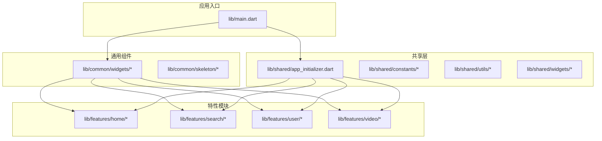
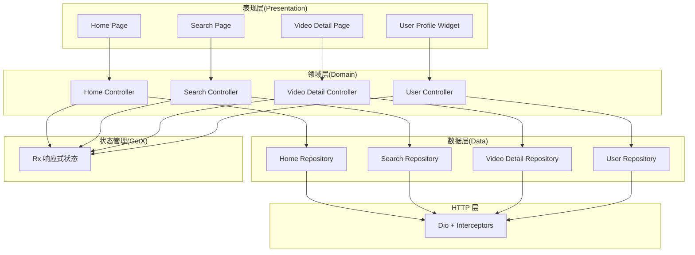
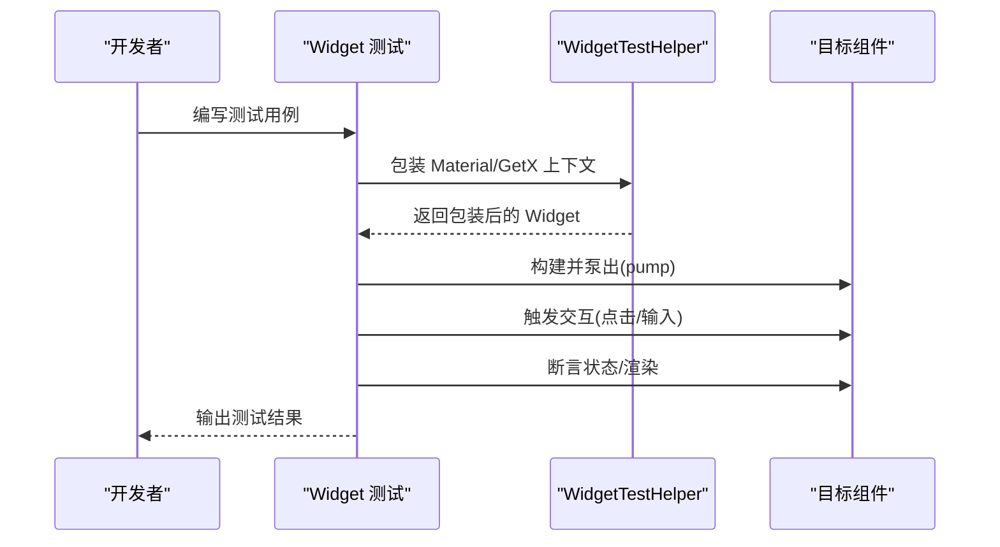
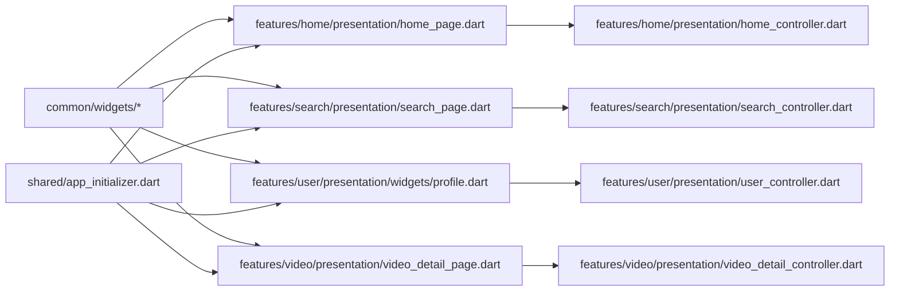

# 组件开发指南

<cite>
**本文引用的文件**
- [lib/main.dart](file://lib/main.dart)
- [lib/common/widgets/appbar.dart](file://lib/common/widgets/appbar.dart)
- [lib/common/widgets/badge.dart](file://lib/common/widgets/badge.dart)
- [lib/common/widgets/custom_toast.dart](file://lib/common/widgets/custom_toast.dart)
- [lib/common/widgets/network_img_layer.dart](file://lib/common/widgets/network_img_layer.dart)
- [lib/common/widgets/live_card.dart](file://lib/common/widgets/live_card.dart)
- [lib/common/widgets/html_render.dart](file://lib/common/widgets/html_render.dart)
- [lib/common/widgets/http_error.dart](file://lib/common/widgets/http_error.dart)
- [lib/common/widgets/no_data.dart](file://lib/common/widgets/no_data.dart)
- [lib/common/widgets/sliver_header.dart](file://lib/common/widgets/sliver_header.dart)
- [lib/features/home/presentation/home_page.dart](file://lib/features/home/presentation/home_page.dart)
- [lib/features/search/presentation/search_page.dart](file://lib/features/search/presentation/search_page.dart)
- [lib/features/user/presentation/widgets/profile.dart](file://lib/features/user/presentation/widgets/profile.dart)
- [lib/features/video/presentation/video_detail_page.dart](file://lib/features/video/presentation/video_detail_page.dart)
- [lib/shared/widgets/](file://lib/shared/widgets/)
- [lib/shared/utils/](file://lib/shared/utils/)
- [lib/shared/constants/](file://lib/shared/constants/)
- [lib/shared/app_initializer.dart](file://lib/shared/app_initializer.dart)
- [docs/spec/architecture/02-state-management.md](file://docs/spec/architecture/02-state-management.md)
- [docs/spec/architecture/03-http-layer.md](file://docs/spec/architecture/03-http-layer.md)
- [docs/spec/testing/strategy.md](file://docs/spec/testing/strategy.md)
- [docs/spec/testing/patterns.md](file://docs/spec/testing/patterns.md)
- [docs/spec/README.md](file://docs/spec/README.md)
- [analysis_options.yaml](file://analysis_options.yaml)
- [pubspec.yaml](file://pubspec.yaml)
</cite>

## 目录
1. [简介](#简介)
2. [项目结构](#项目结构)
3. [核心组件](#核心组件)
4. [架构总览](#架构总览)
5. [组件详细分析](#组件详细分析)
6. [依赖分析](#依赖分析)
7. [性能考虑](#性能考虑)
8. [故障排查指南](#故障排查指南)
9. [结论](#结论)
10. [附录](#附录)

## 简介
本指南面向在 PiliPala 项目中开发新 UI 组件的开发者，系统阐述组件设计原则、命名规范、文件组织结构、开发流程、测试方法、文档编写标准、性能优化技巧、版本管理与升级迁移方案，以及工具链与质量保证流程。内容基于项目现有架构与规范文档提炼，确保新组件与现有代码风格一致、可维护性强、性能稳定。

## 项目结构
PiliPala 采用多层模块化组织，前端核心位于 lib 目录，按领域划分 features，通用 UI 组件集中在 common 与 shared，状态管理采用 GetX，测试策略与规范由 docs/spec 提供指导。

图表来源
- [lib/main.dart](file://lib/main.dart)
- [lib/common/widgets/appbar.dart](file://lib/common/widgets/appbar.dart)
- [lib/shared/app_initializer.dart](file://lib/shared/app_initializer.dart)
- [lib/features/home/presentation/home_page.dart](file://lib/features/home/presentation/home_page.dart)
- [lib/features/search/presentation/search_page.dart](file://lib/features/search/presentation/search_page.dart)
- [lib/features/user/presentation/widgets/profile.dart](file://lib/features/user/presentation/widgets/profile.dart)
- [lib/features/video/presentation/video_detail_page.dart](file://lib/features/video/presentation/video_detail_page.dart)

章节来源
- [lib/main.dart](file://lib/main.dart)
- [docs/spec/README.md](file://docs/spec/README.md)

## 核心组件
- 通用 UI 组件：位于 common/widgets，提供可复用的通用控件，如 AppBar、Badge、CustomToast、NetworkImgLayer、LiveCard、HtmlRender、HttpError、NoData、SliverHeader 等。
- 特性页面与控制器：features 下按功能域组织，包含数据层、领域层与表现层，典型页面如 Home、Search、User、Video。
- 共享层：shared 提供初始化器、常量与工具，统一应用启动与基础能力。
- 状态管理：采用 GetX，通过 Rx 响应式变量驱动 UI 更新，Controller 负责状态与业务逻辑。

章节来源
- [lib/common/widgets/appbar.dart](file://lib/common/widgets/appbar.dart)
- [lib/common/widgets/badge.dart](file://lib/common/widgets/badge.dart)
- [lib/common/widgets/custom_toast.dart](file://lib/common/widgets/custom_toast.dart)
- [lib/common/widgets/network_img_layer.dart](file://lib/common/widgets/network_img_layer.dart)
- [lib/common/widgets/live_card.dart](file://lib/common/widgets/live_card.dart)
- [lib/common/widgets/html_render.dart](file://lib/common/widgets/html_render.dart)
- [lib/common/widgets/http_error.dart](file://lib/common/widgets/http_error.dart)
- [lib/common/widgets/no_data.dart](file://lib/common/widgets/no_data.dart)
- [lib/common/widgets/sliver_header.dart](file://lib/common/widgets/sliver_header.dart)
- [lib/features/home/presentation/home_page.dart](file://lib/features/home/presentation/home_page.dart)
- [lib/features/search/presentation/search_page.dart](file://lib/features/search/presentation/search_page.dart)
- [lib/features/user/presentation/widgets/profile.dart](file://lib/features/user/presentation/widgets/profile.dart)
- [lib/features/video/presentation/video_detail_page.dart](file://lib/features/video/presentation/video_detail_page.dart)
- [lib/shared/app_initializer.dart](file://lib/shared/app_initializer.dart)

## 架构总览
PiliPala 采用“功能优先”的模块化架构，结合 GetX 状态管理与清晰的三层（数据/领域/表现）分离，确保组件职责单一、可测试性强。

图表来源
- [docs/spec/architecture/02-state-management.md](file://docs/spec/architecture/02-state-management.md)
- [docs/spec/architecture/03-http-layer.md](file://docs/spec/architecture/03-http-layer.md)
- [lib/features/home/presentation/home_page.dart](file://lib/features/home/presentation/home_page.dart)
- [lib/features/search/presentation/search_page.dart](file://lib/features/search/presentation/search_page.dart)
- [lib/features/video/presentation/video_detail_page.dart](file://lib/features/video/presentation/video_detail_page.dart)
- [lib/features/user/presentation/widgets/profile.dart](file://lib/features/user/presentation/widgets/profile.dart)

## 组件详细分析

### 设计原则
- 单一职责：组件仅负责特定 UI 行为或展示，避免“上帝组件”。
- 可组合性：通过参数控制行为，支持嵌套与复用。
- 响应式更新：使用 GetX Rx 状态驱动 UI，减少手动重建。
- 可访问性与一致性：遵循主题与间距规范，保持跨页面一致的交互体验。
- 可测试性：对外暴露明确的输入/输出，便于单元与 Widget 测试。

章节来源
- [docs/spec/architecture/02-state-management.md](file://docs/spec/architecture/02-state-management.md)

### 命名规范
- 文件命名：小驼峰或短横线命名，语义明确；例如 common/widgets/custom_toast.dart。
- 组件命名：采用帕斯卡命名，如 ProfileWidget、LiveCard。
- 控制器命名：{Feature}Controller，如 HomeController、SearchController。
- 常量与工具：shared/constants 与 shared/utils 下按功能分类存放。

章节来源
- [lib/features/user/presentation/widgets/profile.dart](file://lib/features/user/presentation/widgets/profile.dart)
- [lib/shared/constants/](file://lib/shared/constants/)
- [lib/shared/utils/](file://lib/shared/utils/)

### 文件组织结构
- 通用组件：lib/common/widgets/*.dart，独立于特性模块，便于跨页面复用。
- 特性组件：features/{feature}/presentation/widgets/*.dart，与页面紧密耦合。
- 共享层：lib/shared 下的 app_initializer.dart、constants、utils、widgets，提供全局能力与工具。
- 示例路径：
  - 通用组件：[lib/common/widgets/custom_toast.dart](file://lib/common/widgets/custom_toast.dart)
  - 特性组件：[lib/features/user/presentation/widgets/profile.dart](file://lib/features/user/presentation/widgets/profile.dart)
  - 共享初始化：[lib/shared/app_initializer.dart](file://lib/shared/app_initializer.dart)

章节来源
- [lib/common/widgets/custom_toast.dart](file://lib/common/widgets/custom_toast.dart)
- [lib/features/user/presentation/widgets/profile.dart](file://lib/features/user/presentation/widgets/profile.dart)
- [lib/shared/app_initializer.dart](file://lib/shared/app_initializer.dart)

### 开发流程
- 需求与设计：参考 docs/spec 中的功能规格与测试策略，明确组件职责与交互。
- 结构搭建：在 common 或 shared 下创建文件，或在特性模块内新建 widgets 目录。
- 实现与状态：使用 GetX Rx 状态管理，避免直接操作 UI。
- 交互与回调：通过回调或 GetX 控制器传递事件，保持组件无副作用。
- 文档与注释：为组件添加 DartDoc 注释，说明用途、参数与行为。
- 提交流程：提交 PR 前确保通过 lint 与测试。

章节来源
- [docs/spec/README.md](file://docs/spec/README.md)
- [docs/spec/testing/strategy.md](file://docs/spec/testing/strategy.md)
- [analysis_options.yaml](file://analysis_options.yaml)

### 测试方法
- 单元测试：针对纯函数、数据转换与业务逻辑，覆盖边界条件与异常分支。
- Widget 测试：验证渲染、交互与状态变更；使用 WidgetTestHelper 包装依赖与等待稳定。
- 集成测试：验证关键用户流程，如登录、搜索、播放等。
- 测试目录建议：test/unit、test/widget、test/integration，配合 mocks 与 fixtures。

图表来源
- [docs/spec/testing/patterns.md](file://docs/spec/testing/patterns.md)
- [docs/spec/testing/strategy.md](file://docs/spec/testing/strategy.md)

章节来源
- [docs/spec/testing/strategy.md](file://docs/spec/testing/strategy.md)
- [docs/spec/testing/patterns.md](file://docs/spec/testing/patterns.md)

### 文档编写标准
- 组件文档：在组件文件顶部添加 DartDoc，说明用途、参数、返回值与注意事项。
- 示例与用法：提供最小可用示例，标注关键属性与回调。
- 变更日志：在 change_log 中记录重大变更与破坏性更新，便于升级迁移。

章节来源
- [docs/spec/README.md](file://docs/spec/README.md)

### 代码模板与最佳实践
- 无状态组件模板：采用 StatelessWidget，接收必需参数，构建 UI。
- 响应式状态模板：使用 GetX Rx 响应式变量，Obx 包裹需要更新的部分。
- 交互回调模板：通过函数参数传递事件，避免直接持有上下文。
- 最佳实践：
  - 避免在组件中直接发起网络请求，通过控制器或服务层处理。
  - 使用 theme 与 constants 统一样式与间距。
  - 对长列表使用懒加载与骨架屏提升体验。

章节来源
- [lib/features/user/presentation/widgets/profile.dart](file://lib/features/user/presentation/widgets/profile.dart)
- [docs/spec/architecture/02-state-management.md](file://docs/spec/architecture/02-state-management.md)

### 常见反模式
- 在组件中直接操作 UI 或状态，导致难以追踪与测试。
- 过度耦合：组件依赖具体实现细节而非抽象接口。
- 忽视响应式更新：手动重建导致性能下降与状态不一致。
- 缺少错误处理与空状态：导致崩溃或用户体验差。

章节来源
- [docs/spec/architecture/02-state-management.md](file://docs/spec/architecture/02-state-management.md)

### 性能优化技巧
- 渲染优化：使用 const 构造与 const 字面量，避免不必要的重建；对长列表使用延迟加载与缓存。
- 状态优化：合理拆分状态，避免大对象频繁更新；必要时使用 update 或 refresh。
- 图片与网络：使用 NetworkImgLayer 统一处理占位与错误；控制并发与缓存。
- 骨架屏：在加载阶段使用 skeleton 组件，改善感知性能。

章节来源
- [lib/common/widgets/network_img_layer.dart](file://lib/common/widgets/network_img_layer.dart)
- [lib/common/widgets/no_data.dart](file://lib/common/widgets/no_data.dart)
- [docs/spec/architecture/02-state-management.md](file://docs/spec/architecture/02-state-management.md)

### 内存管理
- 在控制器生命周期中释放资源：onClose 中取消订阅、关闭流、释放控制器。
- 避免循环引用：谨慎持有 context 与控制器引用。
- 及时清理：移除事件监听器与定时器。

章节来源
- [docs/spec/architecture/02-state-management.md](file://docs/spec/architecture/02-state-management.md)

### 版本管理、向后兼容与升级迁移
- 版本策略：遵循语义化版本，破坏性变更提升主版本号。
- 向后兼容：新增参数时提供默认值；废弃 API 保留并标注 @Deprecated。
- 升级迁移：在 change_log 中记录迁移步骤与影响范围；提供自动化脚本或迁移指南。

章节来源
- [docs/spec/README.md](file://docs/spec/README.md)

### 工具链与质量保证
- Lint 与静态检查：使用 analysis_options.yaml 定义规则，确保代码风格一致。
- 依赖管理：在 pubspec.yaml 中声明依赖，CI 中运行 flutter pub get。
- 测试与覆盖率：按测试策略配置单元/Widget/集成测试，生成覆盖率报告。
- CI/CD：在 GitHub Actions 中添加测试与覆盖率步骤。

章节来源
- [analysis_options.yaml](file://analysis_options.yaml)
- [pubspec.yaml](file://pubspec.yaml)
- [docs/spec/testing/strategy.md](file://docs/spec/testing/strategy.md)

## 依赖分析
组件间的依赖关系主要体现在：页面依赖控制器，控制器依赖仓库与服务，通用组件被多个页面复用，共享层提供初始化与基础能力。

图表来源
- [lib/common/widgets/appbar.dart](file://lib/common/widgets/appbar.dart)
- [lib/features/home/presentation/home_page.dart](file://lib/features/home/presentation/home_page.dart)
- [lib/features/search/presentation/search_page.dart](file://lib/features/search/presentation/search_page.dart)
- [lib/features/user/presentation/widgets/profile.dart](file://lib/features/user/presentation/widgets/profile.dart)
- [lib/features/video/presentation/video_detail_page.dart](file://lib/features/video/presentation/video_detail_page.dart)
- [lib/shared/app_initializer.dart](file://lib/shared/app_initializer.dart)

章节来源
- [lib/features/home/presentation/home_page.dart](file://lib/features/home/presentation/home_page.dart)
- [lib/features/search/presentation/search_page.dart](file://lib/features/search/presentation/search_page.dart)
- [lib/features/user/presentation/widgets/profile.dart](file://lib/features/user/presentation/widgets/profile.dart)
- [lib/features/video/presentation/video_detail_page.dart](file://lib/features/video/presentation/video_detail_page.dart)
- [lib/shared/app_initializer.dart](file://lib/shared/app_initializer.dart)

## 性能考虑
- 渲染层面：减少 rebuild 范围，使用 const 构造与不可变数据；对长列表使用懒加载与缓存。
- 状态层面：拆分细粒度状态，避免大对象频繁更新；合理使用 Obx 与 update。
- 网络与图片：统一处理占位与错误，控制并发与缓存；避免阻塞主线程。
- 骨架屏与过渡：在加载阶段使用 skeleton 组件，改善感知性能。

章节来源
- [lib/common/widgets/network_img_layer.dart](file://lib/common/widgets/network_img_layer.dart)
- [lib/common/widgets/no_data.dart](file://lib/common/widgets/no_data.dart)
- [docs/spec/architecture/02-state-management.md](file://docs/spec/architecture/02-state-management.md)

## 故障排查指南
- Obx 不更新：确认变量为 .obs 类型并在 Obx builder 中使用；对集合内部元素变更需调用 refresh。
- 控制器重复创建：使用 Get.lazyPut 或 Bindings；必要时使用 tag 区分实例。
- 内存泄漏：在 onClose 中释放 ScrollController、StreamSubscription、取消未完成请求、移除事件监听器。
- Widget 测试不稳定：使用 WidgetTestHelper 的 pumpAndSettle 与 setScreenSize，模拟环境。

章节来源
- [docs/spec/architecture/02-state-management.md](file://docs/spec/architecture/02-state-management.md)
- [docs/spec/testing/patterns.md](file://docs/spec/testing/patterns.md)

## 结论
通过遵循本文的设计原则、命名规范、文件组织与开发流程，并结合 GetX 状态管理与完善的测试策略，开发者可以高效地在 PiliPala 中创建高质量、可维护、高性能的 UI 组件。建议在每次迭代中同步完善文档与测试，确保组件演进的可追溯性与稳定性。

## 附录
- 参考文档体系：docs/spec，涵盖架构、API、测试与功能规格，作为组件开发的权威依据。
- 代码模板与示例：可参考 common/widgets 与 features 下的现有组件实现，遵循相同的结构与模式。

章节来源
- [docs/spec/README.md](file://docs/spec/README.md)