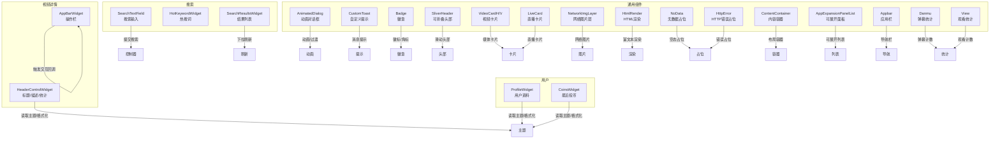
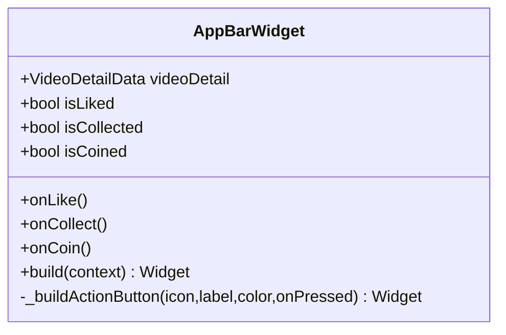
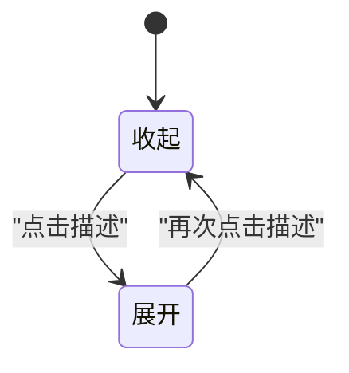
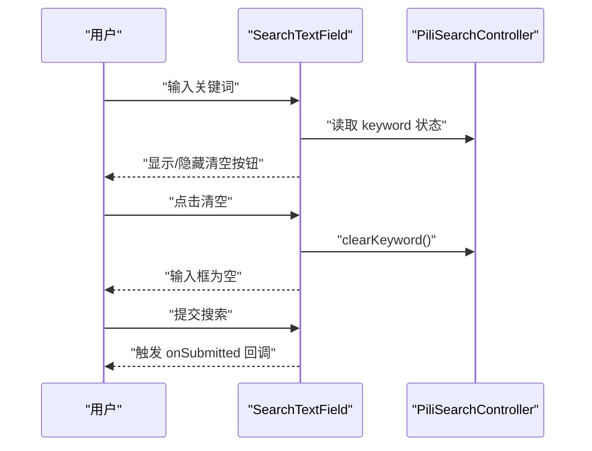
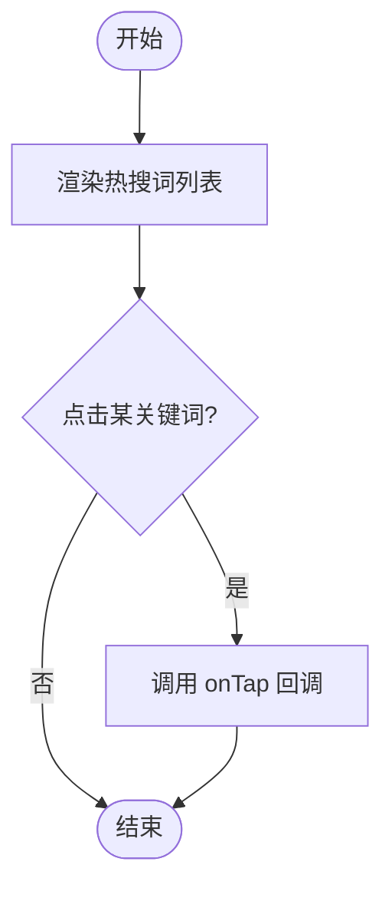
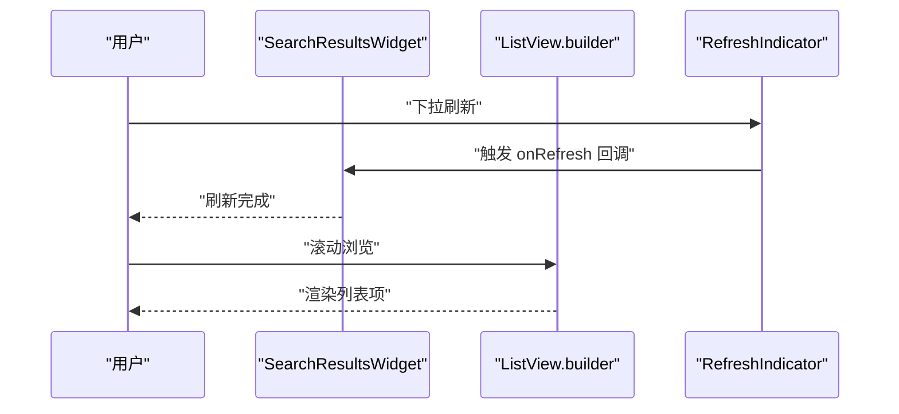
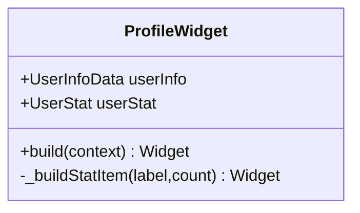
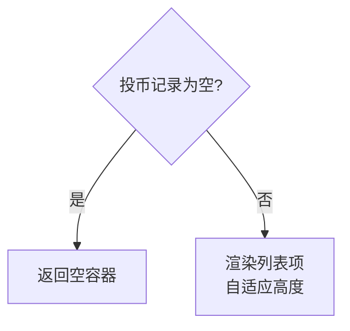
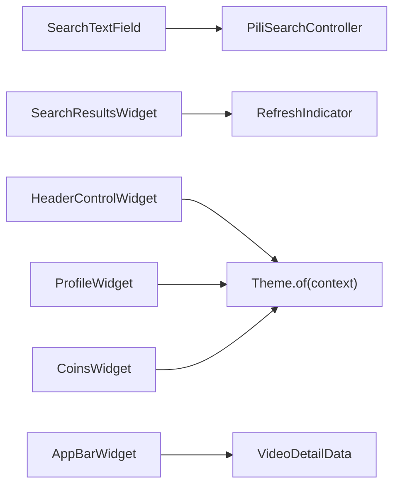

# 自定义组件

<cite>
**本文引用的文件**
- [app_bar.dart](file://lib/features/video/presentation/widgets/app_bar.dart)
- [header_control.dart](file://lib/features/video/presentation/widgets/header_control.dart)
- [search_text.dart](file://lib/features/search/presentation/widgets/search_text.dart)
- [hot_keyword.dart](file://lib/features/search/presentation/widgets/hot_keyword.dart)
- [search_results.dart](file://lib/features/search/presentation/widgets/search_results.dart)
- [profile.dart](file://lib/features/user/presentation/widgets/profile.dart)
- [coins.dart](file://lib/features/user/presentation/widgets/coins.dart)
- [animated_dialog.dart](file://lib/common/widgets/animated_dialog.dart)
- [custom_toast.dart](file://lib/common/widgets/custom_toast.dart)
- [badge.dart](file://lib/common/widgets/badge.dart)
- [sliver_header.dart](file://lib/common/widgets/sliver_header.dart)
- [video_card_h.dart](file://lib/common/widgets/video_card_h.dart)
- [video_card_v.dart](file://lib/common/widgets/video_card_v.dart)
- [live_card.dart](file://lib/common/widgets/live_card.dart)
- [network_img_layer.dart](file://lib/common/widgets/network_img_layer.dart)
- [html_render.dart](file://lib/common/widgets/html_render.dart)
- [no_data.dart](file://lib/common/widgets/no_data.dart)
- [http_error.dart](file://lib/common/widgets/http_error.dart)
- [content_container.dart](file://lib/common/widgets/content_container.dart)
- [app_expansion_panel_list.dart](file://lib/common/widgets/app_expansion_panel_list.dart)
- [appbar.dart](file://lib/common/widgets/appbar.dart)
- [danmu.dart](file://lib/common/widgets/stat/danmu.dart)
- [view.dart](file://lib/common/widgets/stat/view.dart)
</cite>

## 目录
1. [简介](#简介)
2. [项目结构](#项目结构)
3. [核心组件](#核心组件)
4. [架构总览](#架构总览)
5. [详细组件分析](#详细组件分析)
6. [依赖关系分析](#依赖关系分析)
7. [性能考量](#性能考量)
8. [故障排查指南](#故障排查指南)
9. [结论](#结论)
10. [附录](#附录)

## 简介
本文件聚焦于 PiliPala 项目中的自定义 UI 组件，覆盖视频详情页的操作栏与头部信息展示、搜索输入与结果列表、用户资料与投币记录、以及通用的骨架屏、卡片、对话框、提示、徽章、统计信息等组件。文档从架构、数据流、事件传播、生命周期、主题适配、动画与可定制性等维度进行系统化说明，并提供二次开发与扩展的最佳实践。

## 项目结构
自定义组件主要分布在以下位置：
- 视频详情相关：features/video/presentation/widgets
- 搜索相关：features/search/presentation/widgets
- 用户相关：features/user/presentation/widgets
- 通用组件：common/widgets 及其子目录（如 skeleton、stat）

图表来源
- [app_bar.dart:1-74](file://lib/features/video/presentation/widgets/app_bar.dart#L1-L74)
- [header_control.dart:1-108](file://lib/features/video/presentation/widgets/header_control.dart#L1-L108)
- [search_text.dart:1-44](file://lib/features/search/presentation/widgets/search_text.dart#L1-L44)
- [hot_keyword.dart:1-44](file://lib/features/search/presentation/widgets/hot_keyword.dart#L1-L44)
- [search_results.dart:1-91](file://lib/features/search/presentation/widgets/search_results.dart#L1-L91)
- [profile.dart:1-74](file://lib/features/user/presentation/widgets/profile.dart#L1-L74)
- [coins.dart:1-55](file://lib/features/user/presentation/widgets/coins.dart#L1-L55)
- [animated_dialog.dart](file://lib/common/widgets/animated_dialog.dart)
- [custom_toast.dart](file://lib/common/widgets/custom_toast.dart)
- [badge.dart](file://lib/common/widgets/badge.dart)
- [sliver_header.dart](file://lib/common/widgets/sliver_header.dart)
- [video_card_h.dart](file://lib/common/widgets/video_card_h.dart)
- [video_card_v.dart](file://lib/common/widgets/video_card_v.dart)
- [live_card.dart](file://lib/common/widgets/live_card.dart)
- [network_img_layer.dart](file://lib/common/widgets/network_img_layer.dart)
- [html_render.dart](file://lib/common/widgets/html_render.dart)
- [no_data.dart](file://lib/common/widgets/no_data.dart)
- [http_error.dart](file://lib/common/widgets/http_error.dart)
- [content_container.dart](file://lib/common/widgets/content_container.dart)
- [app_expansion_panel_list.dart](file://lib/common/widgets/app_expansion_panel_list.dart)
- [appbar.dart](file://lib/common/widgets/appbar.dart)
- [danmu.dart](file://lib/common/widgets/stat/danmu.dart)
- [view.dart](file://lib/common/widgets/stat/view.dart)

章节来源
- [app_bar.dart:1-74](file://lib/features/video/presentation/widgets/app_bar.dart#L1-L74)
- [header_control.dart:1-108](file://lib/features/video/presentation/widgets/header_control.dart#L1-L108)
- [search_text.dart:1-44](file://lib/features/search/presentation/widgets/search_text.dart#L1-L44)
- [hot_keyword.dart:1-44](file://lib/features/search/presentation/widgets/hot_keyword.dart#L1-L44)
- [search_results.dart:1-91](file://lib/features/search/presentation/widgets/search_results.dart#L1-L91)
- [profile.dart:1-74](file://lib/features/user/presentation/widgets/profile.dart#L1-L74)
- [coins.dart:1-55](file://lib/features/user/presentation/widgets/coins.dart#L1-L55)

## 核心组件
- 视频详情操作栏：提供点赞、投币、收藏、分享等交互按钮，支持图标与颜色的状态切换。
- 视频头部控制：展示标题、播放量/弹幕数/发布时间等统计，支持展开/收起描述区域。
- 搜索输入框：带清空按钮的圆角输入框，集成 GetX 控制器以管理关键词状态。
- 热搜词：Wrap 布局的 ActionChip 列表，点击触发搜索。
- 搜索结果列表：基于 RefreshIndicator 的下拉刷新与 ListView.builder 列表项。
- 用户资料：头像、昵称与关注/粉丝/动态统计。
- 最近投币：垂直列表展示投币记录，禁用滚动并自适应高度。
- 通用组件：动画对话框、自定义 Toast、徽章、SliverHeader、视频/直播卡片、网络图片层、HTML 渲染、空数据/错误占位、内容容器、可展开面板、应用栏、弹幕/观看统计等。

章节来源
- [app_bar.dart:4-23](file://lib/features/video/presentation/widgets/app_bar.dart#L4-L23)
- [header_control.dart:5-15](file://lib/features/video/presentation/widgets/header_control.dart#L5-L15)
- [search_text.dart:5-14](file://lib/features/search/presentation/widgets/search_text.dart#L5-L14)
- [hot_keyword.dart:5-14](file://lib/features/search/presentation/widgets/hot_keyword.dart#L5-L14)
- [search_results.dart:4-13](file://lib/features/search/presentation/widgets/search_results.dart#L4-L13)
- [profile.dart:5-14](file://lib/features/user/presentation/widgets/profile.dart#L5-L14)
- [coins.dart:4-11](file://lib/features/user/presentation/widgets/coins.dart#L4-L11)

## 架构总览
自定义组件遵循“功能域+展示层”的分层组织，组件通过参数注入数据与回调，利用主题系统实现跨平台一致的视觉风格；部分组件采用 StatefulWidget 管理本地状态（如展开/收起、输入框清空），并通过 setState 触发局部重绘。

```mermaid
graph TB
subgraph "视频详情域"
VAP["AppBarWidget"]
VHP["HeaderControlWidget"]
end
subgraph "搜索域"
ST["SearchTextField"]
HK["HotKeywordWidget"]
SR["SearchResultsWidget"]
end
subgraph "用户域"
PR["ProfileWidget"]
CO["CoinsWidget"]
end
subgraph "通用层"
AD["AnimatedDialog"]
CT["CustomToast"]
BAD["Badge"]
SH["SliverHeader"]
VC["VideoCardH/V"]
LC["LiveCard"]
NIL["NetworkImgLayer"]
HR["HtmlRender"]
NOD["NoData"]
ERR["HttpError"]
CC["ContentContainer"]
APL["AppExpansionPanelList"]
AB["Appbar"]
SD["Danmu"]
SV["View"]
end
VAP --> |"回调事件"| 控制器
VHP --> |"主题/格式化"| 主题
ST --> |"控制器/回调"| 控制器
SR --> |"下拉刷新回调"| 控制器
PR --> |"主题/格式化"| 主题
CO --> |"主题/格式化"| 主题
AD --> |"动画/过渡"| 动画
CT --> |"提示/消息"| 提示
BAD --> |"徽标/角标"| 徽章
SH --> |"滑动头部"| 头部
VC --> |"媒体卡片"| 卡片
LC --> |"直播卡片"| 卡片
NIL --> |"网络图片"| 图片
HR --> |"富文本渲染"| 渲染
NOD --> |"空态占位"| 占位
ERR --> |"错误占位"| 占位
CC --> |"布局容器"| 容器
APL --> |"可展开列表"| 列表
AB --> |"导航栏"| 导航
SD --> |"弹幕计数"| 统计
SV --> |"观看计数"| 统计
```

图表来源
- [app_bar.dart:10-22](file://lib/features/video/presentation/widgets/app_bar.dart#L10-L22)
- [header_control.dart:21-28](file://lib/features/video/presentation/widgets/header_control.dart#L21-L28)
- [search_text.dart:6-14](file://lib/features/search/presentation/widgets/search_text.dart#L6-L14)
- [search_results.dart:7-12](file://lib/features/search/presentation/widgets/search_results.dart#L7-L12)
- [profile.dart:6-14](file://lib/features/user/presentation/widgets/profile.dart#L6-L14)
- [coins.dart:5-11](file://lib/features/user/presentation/widgets/coins.dart#L5-L11)

## 详细组件分析

### 视频详情操作栏（AppBarWidget）
- 功能概述
  - 展示视频操作区：点赞、投币、收藏、分享。
  - 支持根据状态切换图标与颜色（如点赞红、投币橙、收藏黄）。
  - 通过回调函数响应用户点击。
- 实现要点
  - 使用 StatelessWidget 接收数据与回调，避免不必要的重建。
  - 内部复用 _buildActionButton 构建统一风格的按钮。
- 高级配置
  - 可通过传入不同状态布尔值控制图标与颜色。
  - 可替换或扩展按钮行为（例如分享跳转到外部页面）。
- 主题与样式
  - 图标与文字颜色随状态变化，保持与当前主题一致。
- 生命周期与事件
  - 无本地状态，事件通过回调上抛至父组件处理。
- 典型使用场景
  - 在视频详情页顶部固定显示，配合滚动视图隐藏/显示策略。

图表来源
- [app_bar.dart:4-73](file://lib/features/video/presentation/widgets/app_bar.dart#L4-L73)

章节来源
- [app_bar.dart:4-73](file://lib/features/video/presentation/widgets/app_bar.dart#L4-L73)

### 视频头部控制（HeaderControlWidget）
- 功能概述
  - 展示标题、统计信息与可折叠描述。
  - 点击描述区域切换展开/收起状态。
- 实现要点
  - StatefulWidget 管理展开状态，setState 触发局部更新。
  - 使用 Theme.of(context) 获取主题色与文本样式，提升一致性。
  - 描述文本根据状态设置最大行数与溢出策略。
- 高级配置
  - 可通过传入 playUrl 扩展播放入口（当前未使用）。
  - 可自定义统计项与格式化逻辑。
- 主题与样式
  - 标题使用标题样式并加粗；描述使用细体与 outline 色。
- 生命周期与事件
  - 构建时读取主题与数据；点击事件仅修改本地状态。
- 典型使用场景
  - 视频详情页顶部卡片，配合 SliverAppBar 或固定头部使用。

图表来源
- [header_control.dart:21-106](file://lib/features/video/presentation/widgets/header_control.dart#L21-L106)

章节来源
- [header_control.dart:5-106](file://lib/features/video/presentation/widgets/header_control.dart#L5-L106)

### 搜索输入框（SearchTextField）
- 功能概述
  - 圆角输入框，内置搜索图标与清空按钮。
  - 集成 GetX 控制器，自动填充已有关键词。
- 实现要点
  - 根据是否有关键词决定是否显示清空按钮。
  - 使用 Theme.colorScheme.surfaceVariant 作为背景色。
  - onSubmitted 回调交由父组件处理搜索提交。
- 高级配置
  - 可替换控制器类型或扩展键盘动作。
  - 可自定义边框、圆角与填充色。
- 主题与样式
  - 通过 Theme.of(context) 获取主题色，保证深浅色模式一致。
- 生命周期与事件
  - 构建时根据控制器状态决定 UI；清空按钮点击后调用控制器清理。
- 典型使用场景
  - 搜索页顶部输入框，结合热搜词与结果列表。

图表来源
- [search_text.dart:6-42](file://lib/features/search/presentation/widgets/search_text.dart#L6-L42)

章节来源
- [search_text.dart:5-42](file://lib/features/search/presentation/widgets/search_text.dart#L5-L42)

### 热搜词（HotKeywordWidget）
- 功能概述
  - Wrap 布局的热搜词列表，点击触发搜索。
- 实现要点
  - 使用 ActionChip 作为交互元素，支持 onPressed 回调。
  - 标题使用主题标题样式并加粗。
- 高级配置
  - 可自定义 Chip 样式、间距与换行规则。
- 主题与样式
  - 文字与背景色遵循主题规范。
- 生命周期与事件
  - 无本地状态，事件通过回调上抛。
- 典型使用场景
  - 搜索页热词推荐，引导用户搜索。

图表来源
- [hot_keyword.dart:5-42](file://lib/features/search/presentation/widgets/hot_keyword.dart#L5-L42)

章节来源
- [hot_keyword.dart:5-42](file://lib/features/search/presentation/widgets/hot_keyword.dart#L5-L42)

### 搜索结果列表（SearchResultsWidget）
- 功能概述
  - 当结果为空时显示“暂无搜索结果”；否则提供下拉刷新与列表。
- 实现要点
  - 使用 RefreshIndicator 包裹 ListView.builder，支持下拉刷新。
  - 列表项为卡片式 ListTile，包含封面、标题、作者与摘要。
- 高级配置
  - 可自定义下拉刷新颜色与回调。
  - 可扩展列表项为不同卡片类型（视频/直播/动态）。
- 主题与样式
  - 使用主题文本样式与颜色，保持一致性。
- 生命周期与事件
  - 无本地状态；刷新回调由父组件提供。
- 典型使用场景
  - 搜索页主内容区，配合输入框与热搜词使用。

图表来源
- [search_results.dart:4-33](file://lib/features/search/presentation/widgets/search_results.dart#L4-L33)

章节来源
- [search_results.dart:4-91](file://lib/features/search/presentation/widgets/search_results.dart#L4-L91)

### 用户资料（ProfileWidget）
- 功能概述
  - 展示用户头像、昵称与关注/粉丝/动态统计。
- 实现要点
  - 使用 CircleAvatar 显示头像，支持网络图片。
  - 统计项使用 Column 布局，数字加粗显示。
- 高级配置
  - 可扩展为更多统计维度（如获赞、等级等）。
- 主题与样式
  - 标题使用主题 titleLarge 并加粗；副标题使用 bodySmall 颜色。
- 生命周期与事件
  - 无本地状态，事件通过回调上抛。
- 典型使用场景
  - 个人主页、用户中心等页面。

图表来源
- [profile.dart:5-73](file://lib/features/user/presentation/widgets/profile.dart#L5-L73)

章节来源
- [profile.dart:5-73](file://lib/features/user/presentation/widgets/profile.dart#L5-L73)

### 最近投币（CoinsWidget）
- 功能概述
  - 展示最近投币记录，禁用滚动并自适应高度。
- 实现要点
  - 使用 ListView.builder 并设置 shrinkWrap 与 NeverScrollableScrollPhysics。
  - 列表项包含标题、作者与封面图。
- 高级配置
  - 可扩展为更多字段（时间、数量、理由等）。
- 主题与样式
  - 使用主题文本样式与颜色。
- 生命周期与事件
  - 无本地状态，事件通过回调上抛。
- 典型使用场景
  - 个人主页“最近投币”模块。

图表来源
- [coins.dart:14-53](file://lib/features/user/presentation/widgets/coins.dart#L14-L53)

章节来源
- [coins.dart:4-55](file://lib/features/user/presentation/widgets/coins.dart#L4-L55)

### 通用组件概览
- 动画对话框（AnimatedDialog）
  - 提供可配置的动画与过渡效果，用于模态交互。
- 自定义 Toast（CustomToast）
  - 封装消息提示，支持位置与样式定制。
- 徽章（Badge）
  - 用于角标/徽标展示，支持数字与文案。
- SliverHeader
  - 可折叠/展开的 Sliver 头部，常用于详情页。
- 视频卡片（VideoCardH/V）
  - 横向/纵向卡片，包含封面、标题、作者等。
- 直播卡片（LiveCard）
  - 直播间卡片，包含主播、标题、在线人数等。
- 网络图片层（NetworkImgLayer）
  - 封装网络图片加载与占位。
- HTML 渲染（HtmlRender）
  - 富文本渲染组件，支持基础标签与样式。
- 空数据/错误占位（NoData/HttpError）
  - 无数据与 HTTP 错误的占位展示。
- 内容容器（ContentContainer）
  - 统一内容区域的布局与间距。
- 可展开面板（AppExpansionPanelList）
  - 可折叠/展开的列表面板。
- 应用栏（Appbar）
  - 通用导航栏组件。
- 统计信息（Danmu/View）
  - 弹幕与观看统计组件。

章节来源
- [animated_dialog.dart](file://lib/common/widgets/animated_dialog.dart)
- [custom_toast.dart](file://lib/common/widgets/custom_toast.dart)
- [badge.dart](file://lib/common/widgets/badge.dart)
- [sliver_header.dart](file://lib/common/widgets/sliver_header.dart)
- [video_card_h.dart](file://lib/common/widgets/video_card_h.dart)
- [video_card_v.dart](file://lib/common/widgets/video_card_v.dart)
- [live_card.dart](file://lib/common/widgets/live_card.dart)
- [network_img_layer.dart](file://lib/common/widgets/network_img_layer.dart)
- [html_render.dart](file://lib/common/widgets/html_render.dart)
- [no_data.dart](file://lib/common/widgets/no_data.dart)
- [http_error.dart](file://lib/common/widgets/http_error.dart)
- [content_container.dart](file://lib/common/widgets/content_container.dart)
- [app_expansion_panel_list.dart](file://lib/common/widgets/app_expansion_panel_list.dart)
- [appbar.dart](file://lib/common/widgets/appbar.dart)
- [danmu.dart](file://lib/common/widgets/stat/danmu.dart)
- [view.dart](file://lib/common/widgets/stat/view.dart)

## 依赖关系分析
- 组件间耦合
  - 视频详情组件依赖模型与工具类（如日期/数字格式化）。
  - 搜索组件依赖 GetX 控制器与模型。
  - 通用组件依赖主题系统与 Flutter Material。
- 外部依赖
  - GetX：用于状态管理与路由。
  - Flutter Material：用于 UI 构建与主题。
- 潜在循环依赖
  - 组件间通过回调解耦，未见直接循环导入。
- 接口契约
  - 回调函数签名明确，便于替换实现。
  - 参数尽量使用不可变对象，减少副作用。

图表来源
- [search_text.dart:3](file://lib/features/search/presentation/widgets/search_text.dart#L3)
- [search_results.dart:23](file://lib/features/search/presentation/widgets/search_results.dart#L23)
- [header_control.dart:27](file://lib/features/video/presentation/widgets/header_control.dart#L27)
- [app_bar.dart:2](file://lib/features/video/presentation/widgets/app_bar.dart#L2)
- [profile.dart:2](file://lib/features/user/presentation/widgets/profile.dart#L2)
- [coins.dart](file://lib/features/user/presentation/widgets/coins.dart)

章节来源
- [search_text.dart:1-44](file://lib/features/search/presentation/widgets/search_text.dart#L1-L44)
- [search_results.dart:1-91](file://lib/features/search/presentation/widgets/search_results.dart#L1-L91)
- [header_control.dart:1-108](file://lib/features/video/presentation/widgets/header_control.dart#L1-L108)
- [app_bar.dart:1-74](file://lib/features/video/presentation/widgets/app_bar.dart#L1-L74)
- [profile.dart:1-74](file://lib/features/user/presentation/widgets/profile.dart#L1-L74)
- [coins.dart:1-55](file://lib/features/user/presentation/widgets/coins.dart#L1-L55)

## 性能考量
- 避免不必要的重建
  - 使用 StatelessWidget 传递不可变数据，减少重绘范围。
- 列表优化
  - 使用 ListView.builder 与合适的缓存策略。
  - 对长列表项进行裁剪与懒加载（如网络图片）。
- 主题与样式
  - 通过 Theme.of(context) 获取样式，避免硬编码颜色与字体。
- 动画与过渡
  - 合理使用 AnimatedDialog 与过渡动画，避免过度动画影响性能。
- 状态管理
  - 使用 GetX 控制器集中管理搜索状态，避免多处重复逻辑。

## 故障排查指南
- 输入框无清空按钮
  - 检查控制器 keyword 是否为空；确认条件渲染逻辑。
- 下拉刷新无效
  - 确认 onRefresh 回调是否正确传入；检查 RefreshIndicator 包裹范围。
- 描述无法展开/收起
  - 检查点击手势与 setState 是否被调用；确认状态变量作用域。
- 图片不显示
  - 检查网络图片地址与缓存策略；确认占位组件是否正确渲染。
- 主题颜色异常
  - 检查主题配置与颜色方案；确认组件是否使用 Theme.of(context)。

章节来源
- [search_text.dart:18-32](file://lib/features/search/presentation/widgets/search_text.dart#L18-L32)
- [search_results.dart:23-32](file://lib/features/search/presentation/widgets/search_results.dart#L23-L32)
- [header_control.dart:73-101](file://lib/features/video/presentation/widgets/header_control.dart#L73-L101)
- [network_img_layer.dart](file://lib/common/widgets/network_img_layer.dart)

## 结论
PiliPala 的自定义组件以“功能域+展示层”清晰分层，通过参数化与回调实现高内聚低耦合。组件广泛采用主题系统与 Material 设计语言，确保跨平台一致性；同时提供丰富的扩展点（回调、样式、动画）。建议在二次开发中遵循现有模式，优先使用回调与不可变数据，保持组件职责单一，并充分利用 GetX 进行状态管理。

## 附录
- 二次开发指南
  - 新增组件时，优先考虑是否属于某个功能域；若通用则放入 common/widgets。
  - 使用 StatelessWidget 传递数据与回调；必要时使用 StatefulWidget 管理本地状态。
  - 通过 Theme.of(context) 获取样式，避免硬编码。
  - 为复杂交互提供回调接口，便于父组件接管业务逻辑。
- 扩展接口建议
  - 为列表类组件提供 itemCount、itemBuilder、onRefresh 等标准接口。
  - 为输入类组件提供控制器与回调，便于统一状态管理。
- 最佳实践
  - 避免在组件内直接发起网络请求；通过回调或控制器处理。
  - 对长列表项进行裁剪与懒加载，提升滚动性能。
  - 使用 Wrap/ActionChip 等组件构建可交互的标签/关键词列表。