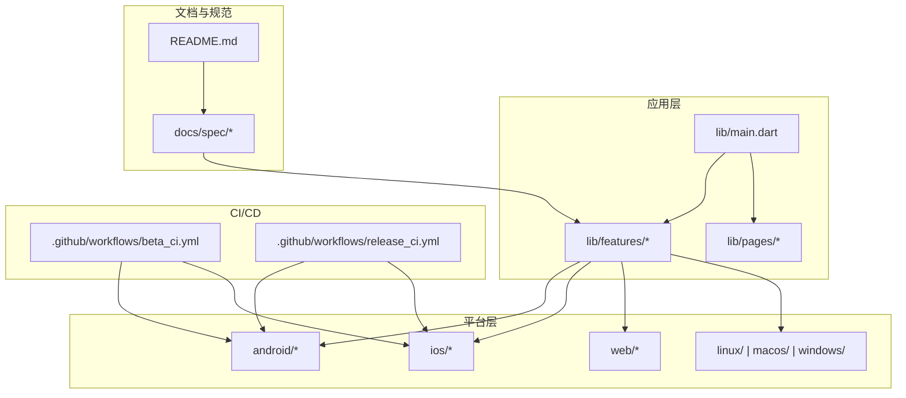
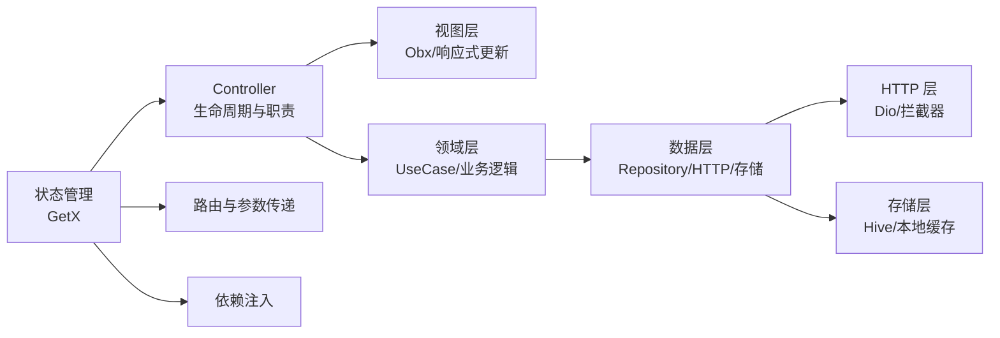
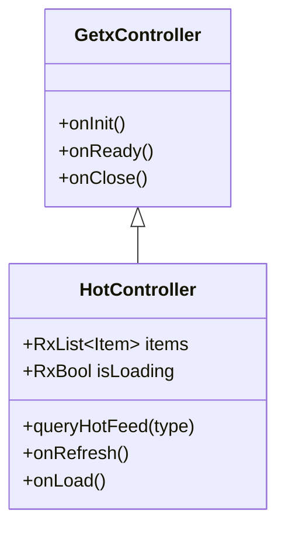
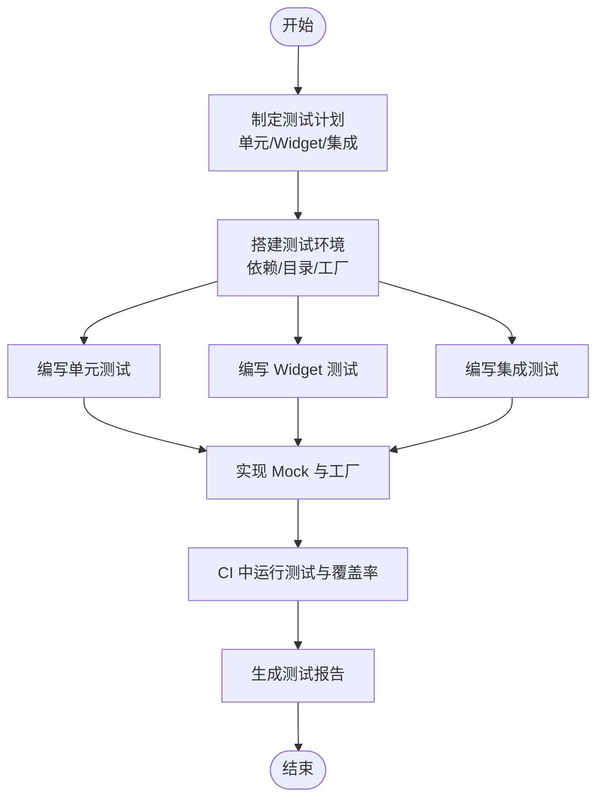
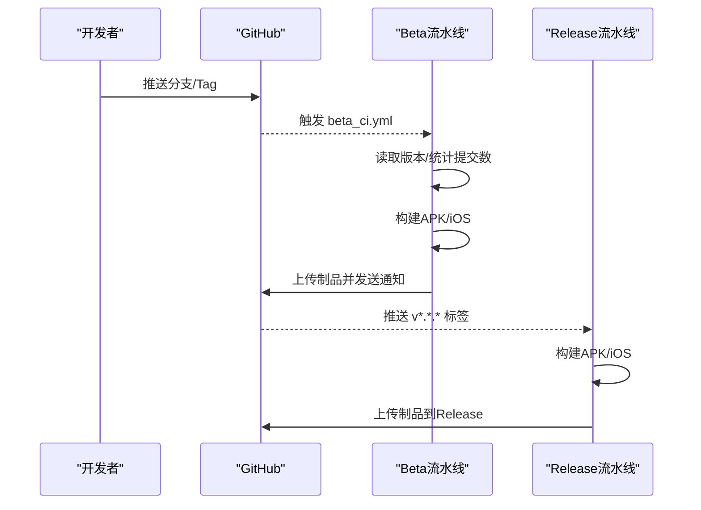
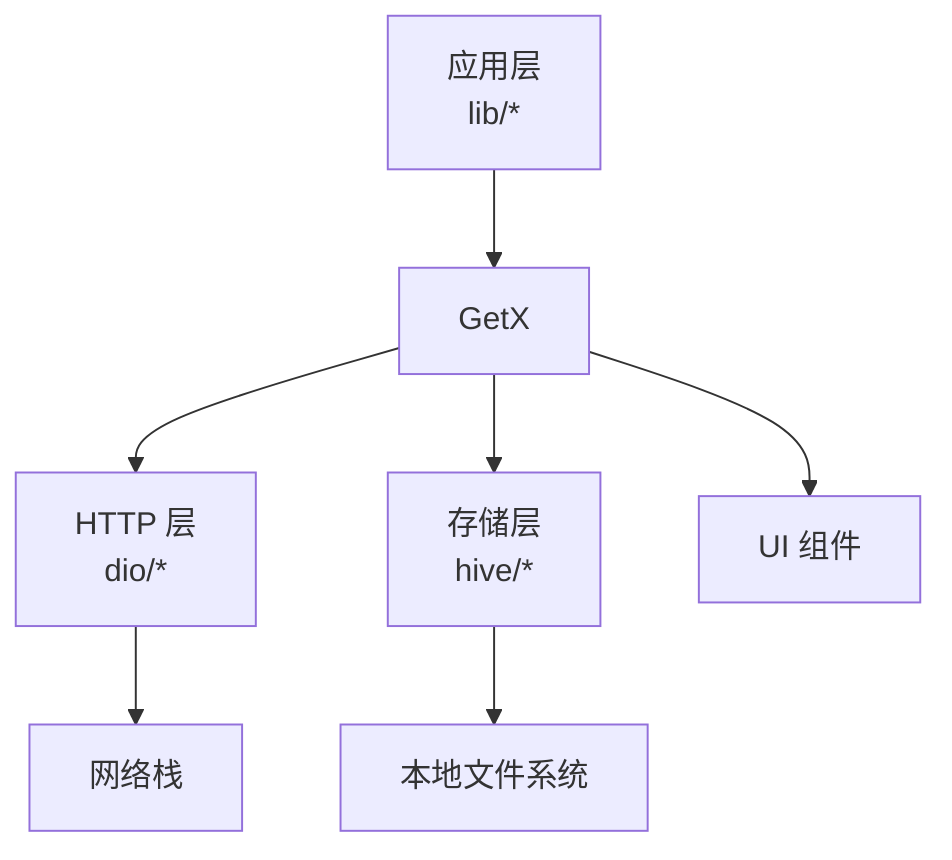

# 开发指南

<cite>
**本文引用的文件**
- [README.md](file://README.md)
- [analysis_options.yaml](file://analysis_options.yaml)
- [pubspec.yaml](file://pubspec.yaml)
- [.github/workflows/beta_ci.yml](file://.github/workflows/beta_ci.yml)
- [.github/workflows/release_ci.yml](file://.github/workflows/release_ci.yml)
- [.github/ISSUE_TEMPLATE/bug-反馈.md](file://.github/ISSUE_TEMPLATE/bug-反馈.md)
- [.github/ISSUE_TEMPLATE/功能请求.md](file://.github/ISSUE_TEMPLATE/功能请求.md)
- [docs/spec/README.md](file://docs/spec/README.md)
- [docs/spec/architecture/02-state-management.md](file://docs/spec/architecture/02-state-management.md)
- [docs/spec/testing/strategy.md](file://docs/spec/testing/strategy.md)
- [docs/spec/features/README.md](file://docs/spec/features/README.md)
- [change_log/1.0.25.1010.md](file://change_log/1.0.25.1010.md)
- [change_log/1.0.24.0626.md](file://change_log/1.0.24.0626.md)
- [android/app/src/main/kotlin/com/guozhigq/pilipala/MainActivity.kt](file://android/app/src/main/kotlin/com/guozhigq/pilipala/MainActivity.kt)
- [android/app/src/main/AndroidManifest.xml](file://android/app/src/main/AndroidManifest.xml)
- [ios/Runner/AppDelegate.swift](file://ios/Runner/AppDelegate.swift)
- [lib/main.dart](file://lib/main.dart)
</cite>

## 目录
1. [简介](#简介)
2. [项目结构](#项目结构)
3. [核心组件](#核心组件)
4. [架构总览](#架构总览)
5. [详细组件分析](#详细组件分析)
6. [依赖分析](#依赖分析)
7. [性能考虑](#性能考虑)
8. [故障排查指南](#故障排查指南)
9. [结论](#结论)
10. [附录](#附录)

## 简介
本指南面向新老开发者，系统性介绍 PiliPala 项目的开发规范、代码风格、Git 工作流、协作流程、编码标准、命名约定、注释规范、文档要求、IDE 配置建议、调试技巧、开发工具推荐、代码审查流程、提交信息规范、分支管理策略、开发周期与版本发布计划、问题跟踪流程，以及常见问题的解决方案与最佳实践。

## 项目结构
PiliPala 是基于 Flutter 的跨平台应用，采用多平台构建（Android/iOS/Web/Linux/macOS/Windows）。项目采用“功能优先”的 Spec 文档体系，配合三层架构（data/domain/presentation）逐步迁移现有 pages 结构。CI/CD 通过 GitHub Actions 实现 Beta 与 Release 流水线。

**图示来源**
- [lib/main.dart](file://lib/main.dart)
- [docs/spec/README.md](file://docs/spec/README.md)
- [.github/workflows/beta_ci.yml](file://.github/workflows/beta_ci.yml)
- [.github/workflows/release_ci.yml](file://.github/workflows/release_ci.yml)

**章节来源**
- [README.md](file://README.md)
- [docs/spec/README.md](file://docs/spec/README.md)

## 核心组件
- 代码规范与静态检查：通过 analysis_options.yaml 引入 Flutter 推荐 Lints，统一风格与质量基线。
- 依赖管理：pubspec.yaml 定义了应用依赖、开发依赖与版本策略，包含网络、存储、播放器、权限、UI 等模块。
- 架构与状态管理：采用 GetX 作为状态管理、路由与 DI 框架，规范 Controller 生命周期与响应式状态使用。
- 测试策略：制定单元/Widget/集成测试目标与目录结构，提供 Mock 与测试数据工厂模板。
- CI/CD：Beta 流水线按提交计数生成 beta 版本并推送至 Telegram；Release 流水线按 Git Tag 构建发布包并上传至 Release。

**章节来源**
- [analysis_options.yaml](file://analysis_options.yaml)
- [pubspec.yaml](file://pubspec.yaml)
- [docs/spec/architecture/02-state-management.md](file://docs/spec/architecture/02-state-management.md)
- [docs/spec/testing/strategy.md](file://docs/spec/testing/strategy.md)
- [.github/workflows/beta_ci.yml](file://.github/workflows/beta_ci.yml)
- [.github/workflows/release_ci.yml](file://.github/workflows/release_ci.yml)

## 架构总览
项目正从传统 pages 结构向 features 三层架构迁移，强调“Spec 先行”。迁移优先级为 P0（热门/排行）、P1（动态/直播/消息）、P2（设置/媒体库子模块）。状态管理统一使用 GetX，路由与依赖注入在同一框架内完成。

**图示来源**
- [docs/spec/architecture/02-state-management.md](file://docs/spec/architecture/02-state-management.md)
- [docs/spec/README.md](file://docs/spec/README.md)

## 详细组件分析

### 代码规范与静态检查
- 使用 Flutter 推荐 Lints，避免 print、鼓励单引号等，可在 analysis_options.yaml 中按需调整规则。
- 建议在 IDE 中启用实时分析，结合 Flutter DevTools 进行性能与内存分析。

**章节来源**
- [analysis_options.yaml](file://analysis_options.yaml)

### 依赖管理与版本策略
- 依赖集中在 pubspec.yaml，包含网络（dio、cookie 管理）、存储（hive）、播放器（media-kit）、权限与分享、WebView、Toast、下拉刷新/上拉加载、图标、加密、电量优化、展开/收起、投屏、二维码、WebSocket、Brotli、文本高亮等。
- 依赖覆盖 Flutter SDK 版本范围与平台特定依赖，注意版本冲突与升级策略。

**章节来源**
- [pubspec.yaml](file://pubspec.yaml)

### 状态管理与 Controller 规范
- 响应式状态：使用 .obs 定义 Rx 类型，Obx 监听状态变化自动重建 UI。
- 生命周期：onInit/onReady/onClose，分别用于初始化、首次渲染后、资源清理。
- 注入与隔离：Get.put/lazyPut/create，tag 隔离同类型多实例。
- 路由与参数：Get.toNamed/parameters，参数类型转换与可选值处理。
- 全局状态：GlobalDataCache、EventBus 跨组件通信。
- 最佳实践：状态初始化顺序、错误处理模式、列表状态管理、内存泄漏防护。

**图示来源**
- [docs/spec/architecture/02-state-management.md](file://docs/spec/architecture/02-state-management.md)

**章节来源**
- [docs/spec/architecture/02-state-management.md](file://docs/spec/architecture/02-state-management.md)

### 测试策略与目录结构
- 目标覆盖率：单元测试 60%+、Widget 测试 40%+、集成测试 20%+。
- 目录结构：unit/widget/integration/mocks/helpers。
- Mock 策略：Mock Dio、Mock Hive、Mock GetX Controller。
- 测试数据工厂：ApiResponseFactory、VideoFactory 等。
- CI 集成：GitHub Actions 中增加测试与覆盖率生成步骤。

**图示来源**
- [docs/spec/testing/strategy.md](file://docs/spec/testing/strategy.md)

**章节来源**
- [docs/spec/testing/strategy.md](file://docs/spec/testing/strategy.md)

### CI/CD 流程与版本发布
- Beta 流水线（beta_ci.yml）：
  - 触发条件：手动触发或推送至 x-main，忽略文档与 IDE 文件。
  - 版本更新：根据最近稳定版本标签与 first-parent 提交数计算 beta 版本号。
  - 构建：Android APK（按 ABI 分割与全量）、iOS IPA（无签名打包）。
  - 产物：重命名为带版本号并上传为制品，发送到 Telegram 频道。
- Release 流水线（release_ci.yml）：
  - 触发条件：推送 v*.*.* 标签。
  - 构建：Android APK（分割与全量）、iOS IPA。
  - 产物：重命名为带版本号并上传为 GitHub Release。

**图示来源**
- [.github/workflows/beta_ci.yml](file://.github/workflows/beta_ci.yml)
- [.github/workflows/release_ci.yml](file://.github/workflows/release_ci.yml)

**章节来源**
- [.github/workflows/beta_ci.yml](file://.github/workflows/beta_ci.yml)
- [.github/workflows/release_ci.yml](file://.github/workflows/release_ci.yml)

### 问题跟踪与协作流程
- 问题模板：Bug 反馈、功能请求，包含问题描述、复现步骤、预期行为、系统信息、截图/日志等字段。
- 协作流程：Issue -> Spec（如有）-> PR -> 代码审查 -> CI/CD -> 合并。

**章节来源**
- [.github/ISSUE_TEMPLATE/bug-反馈.md](file://.github/ISSUE_TEMPLATE/bug-反馈.md)
- [.github/ISSUE_TEMPLATE/功能请求.md](file://.github/ISSUE_TEMPLATE/功能请求.md)
- [docs/spec/README.md](file://docs/spec/README.md)

### 分支管理与开发周期
- 分支策略：x-main 作为 Beta 主线，按提交计数生成 beta 版本；Release 通过打 Tag 触发。
- 开发周期：以功能模块为单位推进，P0/P1/P2 优先级明确，Spec 先行，代码与文档同步更新。
- 版本发布：遵循 semver，构建产物命名包含版本号，变更日志与发布说明配套。

**章节来源**
- [.github/workflows/beta_ci.yml](file://.github/workflows/beta_ci.yml)
- [docs/spec/README.md](file://docs/spec/README.md)
- [change_log/1.0.25.1010.md](file://change_log/1.0.25.1010.md)
- [change_log/1.0.24.0626.md](file://change_log/1.0.24.0626.md)

### 平台入口与配置要点
- Android：MainActivity.kt、AndroidManifest.xml，注意权限声明与应用图标资源。
- iOS：AppDelegate.swift，注意 Info.plist 与签名配置（Release 无签名打包）。
- Web：index.html、manifest.json，注意资源路径与图标配置。
- 桌面端：CMakeLists.txt、main.cc、my_application.* 等，按 Flutter 桌面端模板配置。

**章节来源**
- [android/app/src/main/kotlin/com/guozhigq/pilipala/MainActivity.kt](file://android/app/src/main/kotlin/com/guozhigq/pilipala/MainActivity.kt)
- [android/app/src/main/AndroidManifest.xml](file://android/app/src/main/AndroidManifest.xml)
- [ios/Runner/AppDelegate.swift](file://ios/Runner/AppDelegate.swift)
- [lib/main.dart](file://lib/main.dart)

## 依赖分析
- 组件耦合：状态管理（GetX）贯穿视图、领域与数据层，降低耦合度；HTTP 层与存储层相对独立。
- 外部依赖：网络（dio）、播放器（media-kit）、存储（hive）、权限/分享/WebView 等，均通过 pubspec.yaml 管理。
- 潜在风险：依赖版本冲突（如 win32、archive、media-kit 的 git 覆盖）、平台特定依赖（iOS/Android）与构建脚本兼容性。

**图示来源**
- [pubspec.yaml](file://pubspec.yaml)
- [docs/spec/architecture/02-state-management.md](file://docs/spec/architecture/02-state-management.md)

**章节来源**
- [pubspec.yaml](file://pubspec.yaml)

## 性能考虑
- 播放器与解码：media-kit 作为主播放器，注意硬件加速与解码格式选择对性能的影响。
- 列表滚动与渲染：使用下拉刷新/上拉加载组件，合理分页与缓存策略减少网络与渲染压力。
- 网络与 Cookie：Dio + CookieJar + DioCookieManager，注意请求头与会话持久化。
- 存储与缓存：Hive 本地缓存，避免频繁 IO；全局状态缓存与事件总线减少重复计算。
- 平台差异：Android/iOS/Web/Linux/macOS/Windows 的性能特性不同，需针对性优化。

## 故障排查指南
- 状态不更新：确认变量为 .obs 类型、Obx 的 builder 中使用了响应式变量、修改集合内部元素后调用 refresh。
- Controller 重复创建：使用 Get.put 时确保只调用一次，考虑 Get.lazyPut 或 Bindings，必要时使用 tag 区分实例。
- 内存泄漏：在 onClose 中释放 ScrollController、StreamSubscription、取消未完成请求、移除事件监听器。
- CI 构建失败：检查 Java 版本、Flutter 版本、密钥与环境变量、路径与权限、Artifact 上传与 Telegram 通知配置。
- 版本号异常：Beta 流水线依赖最近稳定版本标签与 first-parent 提交数，确保标签存在且分支正确。

**章节来源**
- [docs/spec/architecture/02-state-management.md](file://docs/spec/architecture/02-state-management.md)
- [.github/workflows/beta_ci.yml](file://.github/workflows/beta_ci.yml)

## 结论
本指南提供了 PiliPala 项目的开发规范、架构与流程、测试与 CI/CD、问题跟踪与协作、平台入口与配置要点、依赖与性能考量、故障排查与最佳实践。建议新开发者从 Spec 与架构文档入手，严格遵循状态管理与测试策略，配合 CI/CD 快速交付高质量版本。

## 附录

### 开发环境配置建议
- IDE：Android Studio 或 VS Code，启用 Flutter/Dart 插件与实时分析。
- 工具：Flutter DevTools（性能/内存/网络）、Dart Code、Flutter Intl（国际化）、Hive Generator（模型）。
- 平台：按 README 的最低版本要求准备 Android/iOS/Web/Linux/macOS/Windows 构建环境。

**章节来源**
- [README.md](file://README.md)

### 提交信息规范与代码审查流程
- 提交信息：建议采用 Angular 风格（type(scope): subject），配合变更日志与 Issue 关联。
- 代码审查：PR 中包含 Spec 变更说明、测试覆盖、CI 成功、Reviewer 指定与批准。
- 合并与发布：合并到 x-main 触发 Beta，打 Tag 触发 Release。

**章节来源**
- [docs/spec/README.md](file://docs/spec/README.md)
- [.github/workflows/beta_ci.yml](file://.github/workflows/beta_ci.yml)
- [.github/workflows/release_ci.yml](file://.github/workflows/release_ci.yml)

### 常见开发问题与最佳实践
- 常见问题：状态不更新、Controller 重复创建、内存泄漏、CI 构建失败、版本号异常。
- 最佳实践：Spec 先行、代码与文档同步更新、单元/Widget/集成测试覆盖、响应式状态与生命周期规范、Mock 与测试数据工厂、CI 中运行测试与覆盖率生成。

**章节来源**
- [docs/spec/testing/strategy.md](file://docs/spec/testing/strategy.md)
- [docs/spec/architecture/02-state-management.md](file://docs/spec/architecture/02-state-management.md)
- [.github/workflows/beta_ci.yml](file://.github/workflows/beta_ci.yml)
- [.github/workflows/release_ci.yml](file://.github/workflows/release_ci.yml)