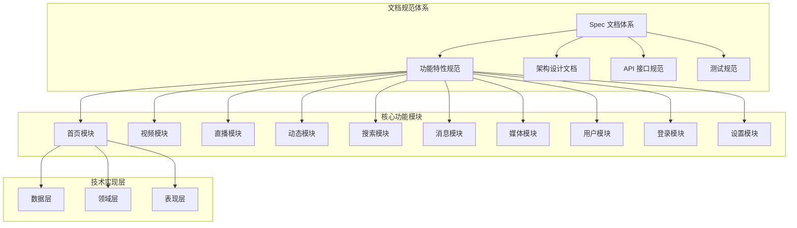
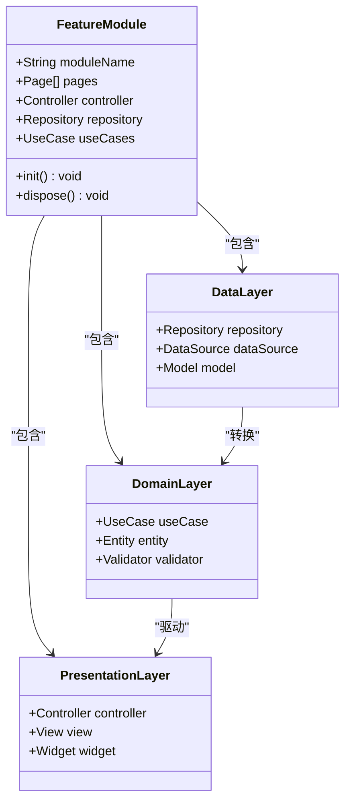
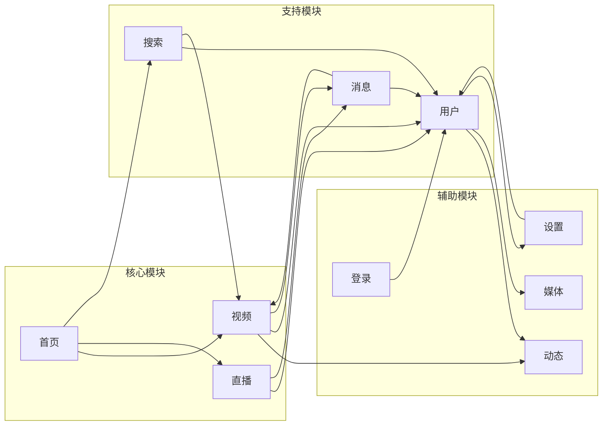
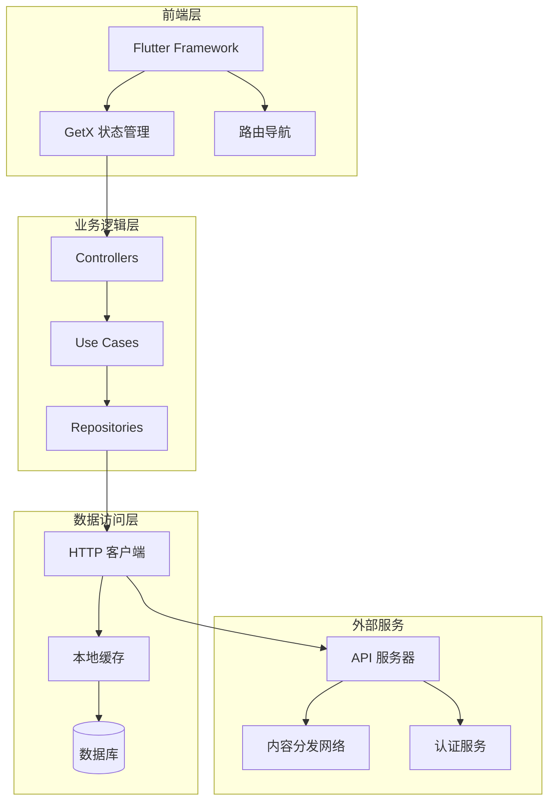
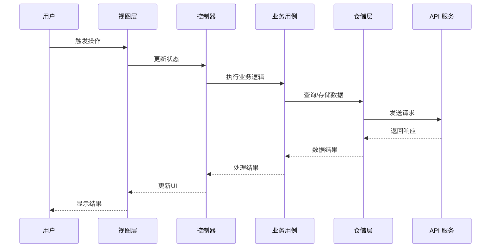
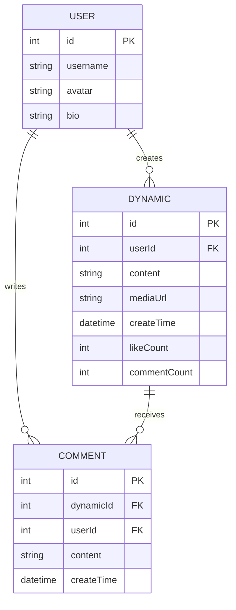
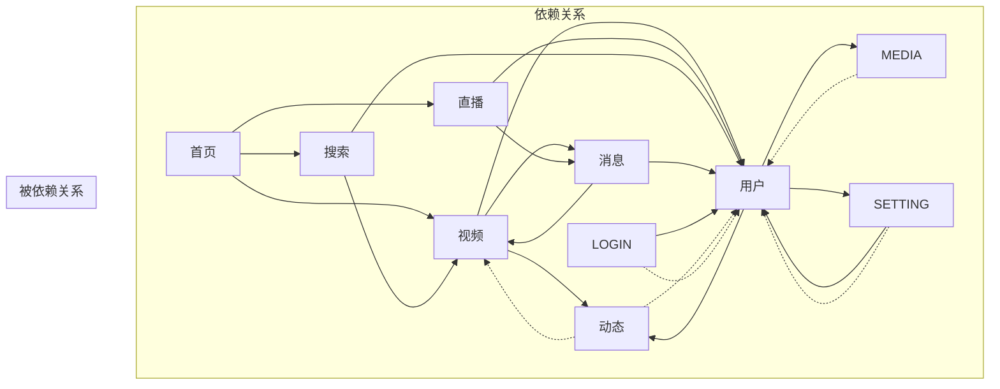
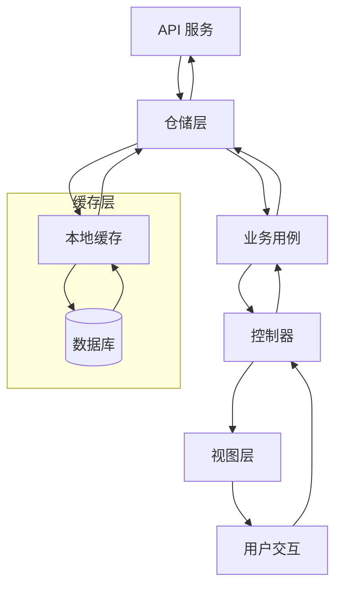

# 特性规范

<cite>
**本文档引用的文件**
- [docs/spec/README.md](file://docs/spec/README.md)
- [docs/spec/features/README.md](file://docs/spec/features/README.md)
- [docs/spec/features/dynamics/spec.md](file://docs/spec/features/dynamics/spec.md)
- [docs/spec/features/home/spec.md](file://docs/spec/features/home/spec.md)
- [docs/spec/features/live/spec.md](file://docs/spec/features/live/spec.md)
- [docs/spec/features/login/spec.md](file://docs/spec/features/login/spec.md)
- [docs/spec/features/media/spec.md](file://docs/spec/features/media/spec.md)
- [docs/spec/features/message/spec.md](file://docs/spec/features/message/spec.md)
- [docs/spec/features/search/spec.md](file://docs/spec/features/search/spec.md)
- [docs/spec/features/setting/spec.md](file://docs/spec/features/setting/spec.md)
- [docs/spec/features/user/spec.md](file://docs/spec/features/user/spec.md)
- [docs/spec/features/video/spec.md](file://docs/spec/features/video/spec.md)
- [lib/features/dynamics/dynamics.dart](file://lib/features/dynamics/dynamics.dart)
- [lib/features/home/home.dart](file://lib/features/home/home.dart)
- [lib/features/live/live.dart](file://lib/features/live/live.dart)
- [lib/features/login/login.dart](file://lib/features/login/login.dart)
- [lib/features/media/media.dart](file://lib/features/media/media.dart)
- [lib/features/message/message.dart](file://lib/features/message/message.dart)
- [lib/features/search/search.dart](file://lib/features/search/search.dart)
- [lib/features/setting/setting.dart](file://lib/features/setting/setting.dart)
- [lib/features/user/user.dart](file://lib/features/user/user.dart)
- [lib/features/video/video.dart](file://lib/features/video/video.dart)
</cite>

## 目录
1. [简介](#简介)
2. [项目结构](#项目结构)
3. [核心组件](#核心组件)
4. [架构概览](#架构概览)
5. [详细组件分析](#详细组件分析)
6. [依赖分析](#依赖分析)
7. [性能考虑](#性能考虑)
8. [故障排除指南](#故障排除指南)
9. [结论](#结论)

## 简介

PiliPala 是一个基于 Flutter 的多媒体应用，采用功能优先的架构设计。该项目的核心目标是为用户提供完整的视频、直播、动态等内容消费体验。通过规范化的特性文档体系，确保项目的可维护性和扩展性。

项目采用模块化设计，每个功能模块都包含独立的数据层、领域层和表现层，遵循 Clean Architecture 原则。所有功能模块都通过统一的特性规范文档进行管理，确保开发团队对功能需求有一致的理解。

## 项目结构

项目采用分层架构和功能模块化组织方式：

**图表来源**
- [docs/spec/README.md:1-62](file://docs/spec/README.md#L1-L62)
- [docs/spec/features/README.md:1-100](file://docs/spec/features/README.md#L1-L100)

**章节来源**
- [docs/spec/README.md:1-62](file://docs/spec/README.md#L1-L62)
- [docs/spec/features/README.md:1-100](file://docs/spec/features/README.md#L1-L100)

## 核心组件

### 功能模块架构

每个功能模块都遵循统一的三层架构模式：

**图表来源**
- [lib/features/dynamics/dynamics.dart:1-100](file://lib/features/dynamics/dynamics.dart#L1-L100)
- [lib/features/home/home.dart:1-100](file://lib/features/home/home.dart#L1-L100)
- [lib/features/live/live.dart:1-100](file://lib/features/live/live.dart#L1-L100)

### 模块间依赖关系

**图表来源**
- [lib/features/home/home.dart:1-100](file://lib/features/home/home.dart#L1-L100)
- [lib/features/video/video.dart:1-100](file://lib/features/video/video.dart#L1-L100)
- [lib/features/live/live.dart:1-100](file://lib/features/live/live.dart#L1-L100)

**章节来源**
- [lib/features/dynamics/dynamics.dart:1-100](file://lib/features/dynamics/dynamics.dart#L1-L100)
- [lib/features/home/home.dart:1-100](file://lib/features/home/home.dart#L1-L100)
- [lib/features/live/live.dart:1-100](file://lib/features/live/live.dart#L1-L100)

## 架构概览

### 技术栈架构

**图表来源**
- [docs/spec/README.md:24-51](file://docs/spec/README.md#L24-L51)

### 数据流架构

**图表来源**
- [docs/spec/README.md:19-22](file://docs/spec/README.md#L19-L22)

## 详细组件分析

### 首页模块 (Home Module)

首页模块作为应用的核心入口，整合了多种内容展示方式：

#### 功能特性
- 视频推荐流
- 热门内容展示
- 快速导航入口
- 个性化内容推送

#### 页面结构
- 主页 (home_page.dart)
- 热门页面 (hot_page.dart)
- 推荐页面 (rcmd_page.dart)

#### 状态管理
采用 GetX 状态管理模式，实现响应式数据绑定和状态同步。

**章节来源**
- [docs/spec/features/home/spec.md:1-100](file://docs/spec/features/home/spec.md#L1-L100)
- [lib/features/home/home.dart:1-100](file://lib/features/home/home.dart#L1-L100)

### 视频模块 (Video Module)

视频播放是应用的核心功能之一：

#### 核心功能
- 视频播放控制
- 播放历史记录
- 收藏和稍后观看
- 视频详情展示

#### 技术实现
- 基于 ExoPlayer 的视频播放引擎
- 自适应码率切换
- 缓存策略优化

**章节来源**
- [docs/spec/features/video/spec.md:1-100](file://docs/spec/features/video/spec.md#L1-L100)
- [lib/features/video/video.dart:1-100](file://lib/features/video/video.dart#L1-L100)

### 直播模块 (Live Module)

直播功能提供实时互动体验：

#### 功能特性
- 实时视频流播放
- 弹幕系统
- 礼物打赏
- 主播互动

#### 技术架构
- WebRTC 实现实时通信
- WebSocket 处理弹幕和互动
- CDN 加速视频传输

**章节来源**
- [docs/spec/features/live/spec.md:1-100](file://docs/spec/features/live/spec.md#L1-L100)
- [lib/features/live/live.dart:1-100](file://lib/features/live/live.dart#L1-L100)

### 动态模块 (Dynamics Module)

动态模块实现内容分享和社交功能：

#### 功能组成
- 动态发布
- 评论系统
- 点赞和转发
- 关注机制

#### 数据模型

**图表来源**
- [docs/spec/features/dynamics/spec.md:1-100](file://docs/spec/features/dynamics/spec.md#L1-L100)

**章节来源**
- [docs/spec/features/dynamics/spec.md:1-100](file://docs/spec/features/dynamics/spec.md#L1-L100)
- [lib/features/dynamics/dynamics.dart:1-100](file://lib/features/dynamics/dynamics.dart#L1-L100)

### 搜索模块 (Search Module)

搜索功能提供内容发现机制：

#### 搜索类型
- 视频搜索
- 用户搜索
- 标签搜索
- 直播搜索

#### 搜索策略
- 实时搜索建议
- 搜索历史记录
- 搜索结果排序
- 搜索过滤器

**章节来源**
- [docs/spec/features/search/spec.md:1-100](file://docs/spec/features/search/spec.md#L1-L100)
- [lib/features/search/search.dart:1-100](file://lib/features/search/search.dart#L1-L100)

### 消息模块 (Message Module)

消息系统处理用户间的通信：

#### 消息类型
- 系统通知
- 私信聊天
- 评论回复
- 点赞提醒

#### 实时通信
- WebSocket 连接管理
- 消息持久化
- 未读消息统计
- 消息推送

**章节来源**
- [docs/spec/features/message/spec.md:1-100](file://docs/spec/features/message/spec.md#L1-L100)
- [lib/features/message/message.dart:1-100](file://lib/features/message/message.dart#L1-L100)

### 媒体模块 (Media Module)

媒体管理模块提供内容收藏和管理功能：

#### 功能特性
- 收藏夹管理
- 播放历史
- 稍后观看
- 订阅管理

#### 数据组织
- 分类标签
- 时间线排序
- 搜索过滤
- 批量操作

**章节来源**
- [docs/spec/features/media/spec.md:1-100](file://docs/spec/features/media/spec.md#L1-L100)
- [lib/features/media/media.dart:1-100](file://lib/features/media/media.dart#L1-L100)

### 用户模块 (User Module)

用户模块实现个人资料和社交功能：

#### 用户功能
- 个人资料管理
- 关注/粉丝系统
- 个人作品展示
- 隐私设置

#### 社交特性
- 关注列表
- 粉丝统计
- 互动历史
- 黑名单管理

**章节来源**
- [docs/spec/features/user/spec.md:1-100](file://docs/spec/features/user/spec.md#L1-L100)
- [lib/features/user/user.dart:1-100](file://lib/features/user/user.dart#L1-L100)

### 登录模块 (Login Module)

登录模块提供用户身份验证：

#### 登录方式
- 手机号登录
- 第三方登录 (微信、QQ等)
- 验证码登录
- 游客模式

#### 安全机制
- Token 管理
- 密钥加密
- 会话保持
- 登出清理

**章节来源**
- [docs/spec/features/login/spec.md:1-100](file://docs/spec/features/login/spec.md#L1-L100)
- [lib/features/login/login.dart:1-100](file://lib/features/login/login.dart#L1-L100)

### 设置模块 (Setting Module)

设置模块提供应用配置管理：

#### 设置分类
- 基础设置
- 播放设置
- 隐私设置
- 风格设置
- 额外设置

#### 配置管理
- 设置项持久化
- 设置变更监听
- 默认值管理
- 设置导入导出

**章节来源**
- [docs/spec/features/setting/spec.md:1-100](file://docs/spec/features/setting/spec.md#L1-L100)
- [lib/features/setting/setting.dart:1-100](file://lib/features/setting/setting.dart#L1-L100)

## 依赖分析

### 模块依赖矩阵

### 数据依赖链

**图表来源**
- [docs/spec/README.md:19-22](file://docs/spec/README.md#L19-L22)

**章节来源**
- [docs/spec/README.md:19-22](file://docs/spec/README.md#L19-L22)

## 性能考虑

### 缓存策略

应用采用多层缓存机制以提升性能：

1. **内存缓存**：最近使用的数据
2. **磁盘缓存**：持久化的重要数据
3. **网络缓存**：API 响应缓存
4. **图片缓存**：媒体资源缓存

### 网络优化

- HTTP 连接池管理
- 请求去重和合并
- 增量更新机制
- 离线数据支持

### 内存管理

- 对象池模式
- 弱引用使用
- 内存泄漏检测
- 垃圾回收优化

## 故障排除指南

### 常见问题诊断

#### 登录问题
- 检查网络连接状态
- 验证用户名密码格式
- 查看 Token 是否过期
- 确认服务器状态

#### 播放问题
- 检查视频格式支持
- 验证网络带宽
- 清理播放缓存
- 重启播放器实例

#### 数据同步问题
- 检查本地数据库状态
- 验证缓存一致性
- 查看同步队列状态
- 重置同步标志位

### 调试工具

- 日志级别配置
- 性能监控指标
- 错误追踪系统
- 用户行为分析

**章节来源**
- [docs/spec/README.md:44-51](file://docs/spec/README.md#L44-L51)

## 结论

PiliPala 项目通过规范化的特性文档体系和模块化架构设计，为多媒体应用开发提供了完整的技术解决方案。每个功能模块都遵循统一的设计原则和开发规范，确保了系统的可维护性和扩展性。

项目的核心优势包括：

1. **清晰的架构层次**：分层设计确保了关注点分离
2. **标准化的开发流程**：统一的特性规范指导开发工作
3. **完善的模块化结构**：功能模块独立且可复用
4. **全面的技术栈支持**：从前端到后端的完整技术方案

通过持续的文档维护和技术演进，PiliPala 项目为 Flutter 生态系统中的多媒体应用开发提供了优秀的参考模板。