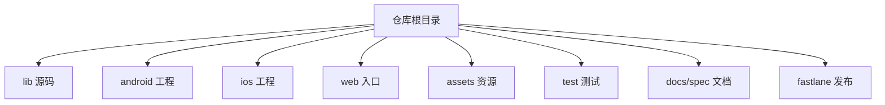
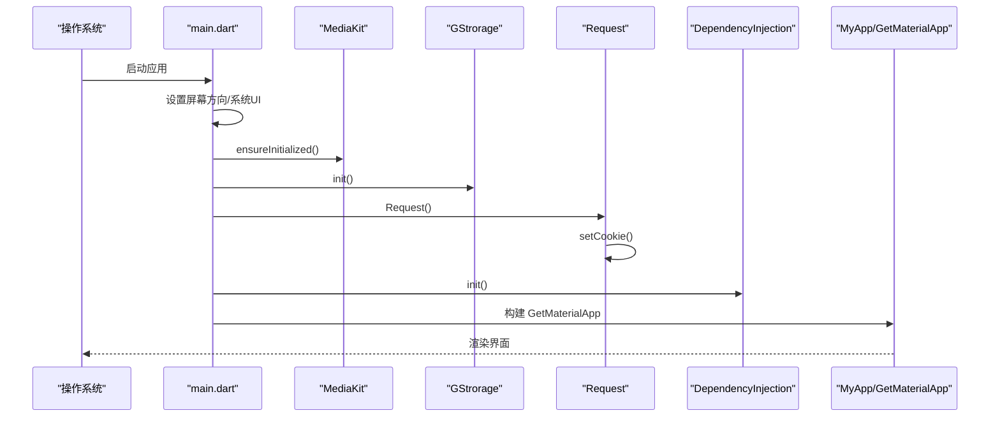
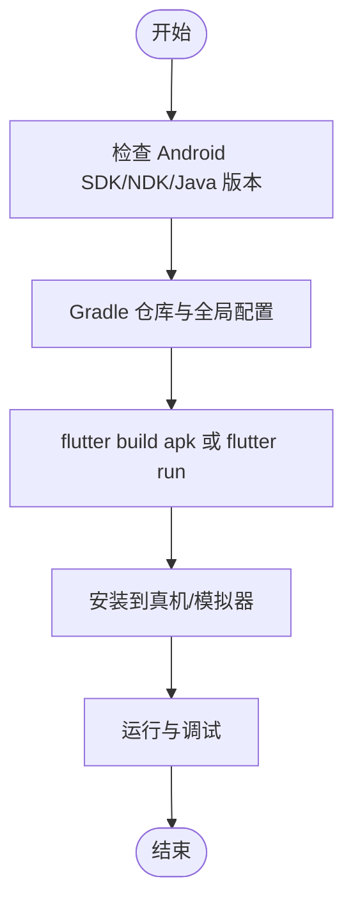
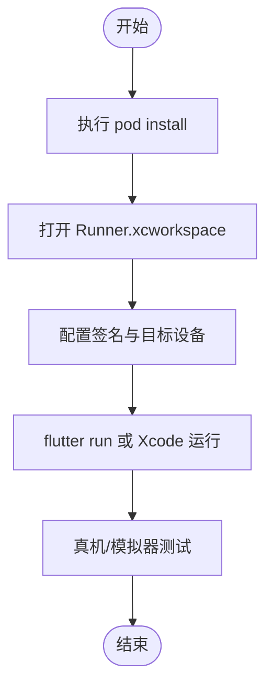
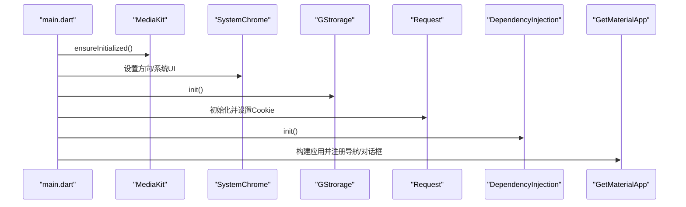
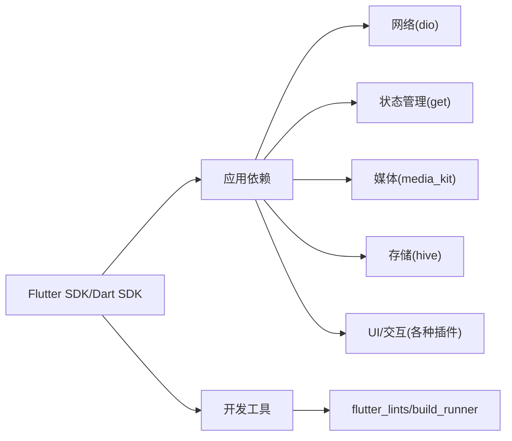

# 快速开始

<cite>
**本文引用的文件**
- [pubspec.yaml](file://pubspec.yaml)
- [README.md](file://README.md)
- [CLAUDE.md](file://CLAUDE.md)
- [lib/main.dart](file://lib/main.dart)
- [android/app/src/main/kotlin/com/guozhigq/pilipala/MainActivity.kt](file://android/app/src/main/kotlin/com/guozhigq/pilipala/MainActivity.kt)
- [ios/Runner/AppDelegate.swift](file://ios/Runner/AppDelegate.swift)
- [android/app/build.gradle](file://android/app/build.gradle)
- [android/build.gradle](file://android/build.gradle)
- [android/gradle.properties](file://android/gradle.properties)
- [android/settings.gradle](file://android/settings.gradle)
- [ios/Podfile](file://ios/Podfile)
- [web/index.html](file://web/index.html)
- [analysis_options.yaml](file://analysis_options.yaml)
</cite>

## 目录
1. [简介](#简介)
2. [项目结构](#项目结构)
3. [核心组件](#核心组件)
4. [架构总览](#架构总览)
5. [详细组件分析](#详细组件分析)
6. [依赖关系分析](#依赖关系分析)
7. [性能注意事项](#性能注意事项)
8. [故障排除指南](#故障排除指南)
9. [结论](#结论)
10. [附录](#附录)

## 简介
本指南面向首次接触 PiliPala 的开发者，帮助你在最短时间内完成开发环境搭建、项目克隆与依赖安装，并成功在 Android、iOS、Web 平台上运行应用。同时提供调试运行、热重载、真机测试的操作步骤以及常见问题的解决方案。

## 项目结构
PiliPala 是一个基于 Flutter 的跨平台应用，主要目录与职责如下：
- lib：Dart 应用源码，包含页面、业务层、网络层、模型与路由等
- android：Android 平台工程，含 Gradle 配置与 Kotlin 主入口
- ios：iOS 平台工程，含 Podfile 与 Swift 主入口
- web：Web 平台入口页面
- assets：资源文件（字体、图片、截图）
- test：单元测试、集成测试与辅助工具
- docs/spec：架构与功能规格文档
- fastlane：应用商店元数据与发布流程（非必需）

章节来源
- [README.md:24-38](file://README.md#L24-L38)

## 核心组件
- 启动入口与初始化
  - 应用启动在 lib/main.dart 中完成，包含媒体库初始化、系统方向设置、存储初始化、网络初始化、依赖注入、异常捕获与全局 UI 设置等。
- 平台主入口
  - Android：MainActivity.kt 继承自音频服务 Activity，确保后台音频播放能力。
  - iOS：AppDelegate.swift 在应用启动时注册插件并设置音频会话类别为播放模式，保证静音状态下也能播放音频。
- 构建与打包
  - Android 使用 Flutter Gradle 插件与 Kotlin；Gradle 配置集中于 android/build.gradle 与 android/app/build.gradle。
  - iOS 使用 CocoaPods，Podfile 指定最低部署版本与 Flutter 工具集成。
- Web 支持
  - web/index.html 提供标准的 Flutter Web 入口脚本与基础标签。

章节来源
- [lib/main.dart:33-80](file://lib/main.dart#L33-L80)
- [android/app/src/main/kotlin/com/guozhigq/pilipala/MainActivity.kt:1-9](file://android/app/src/main/kotlin/com/guozhigq/pilipala/MainActivity.kt#L1-L9)
- [ios/Runner/AppDelegate.swift:1-22](file://ios/Runner/AppDelegate.swift#L1-L22)
- [android/app/build.gradle:1-139](file://android/app/build.gradle#L1-L139)
- [android/build.gradle:1-70](file://android/build.gradle#L1-L70)
- [ios/Podfile:1-48](file://ios/Podfile#L1-L48)
- [web/index.html:1-60](file://web/index.html#L1-L60)

## 架构总览
下图展示了应用启动的关键流程：从 main.dart 入口到依赖注入、网络初始化、UI 构建与平台特定初始化。

图表来源
- [lib/main.dart:33-80](file://lib/main.dart#L33-L80)

章节来源
- [lib/main.dart:33-80](file://lib/main.dart#L33-L80)

## 详细组件分析

### Android 平台
- 开发工具与版本
  - Android SDK：compileSdkVersion 34，targetSdkVersion 由 Flutter 统一管理，minSdkVersion 21。
  - NDK 版本：25.1.8937393。
  - Java/Kotlin：JVM 1.8，Kotlin 1.9.0。
- 构建配置要点
  - 多 ABI 打包与分 ABI 输出，便于上传与分发。
  - 签名配置支持通过环境变量或本地属性文件注入。
- 运行与调试
  - 使用 flutter run 或 Android Studio 连接设备/模拟器运行。
  - 真机测试建议开启开发者选项中的 USB 调试与允许安装测试版应用。

图表来源
- [android/app/build.gradle:36-92](file://android/app/build.gradle#L36-L92)
- [android/build.gradle:13-28](file://android/build.gradle#L13-L28)
- [android/gradle.properties:1-4](file://android/gradle.properties#L1-L4)

章节来源
- [android/app/build.gradle:1-139](file://android/app/build.gradle#L1-L139)
- [android/build.gradle:1-70](file://android/build.gradle#L1-L70)
- [android/gradle.properties:1-4](file://android/gradle.properties#L1-L4)
- [android/settings.gradle:1-31](file://android/settings.gradle#L1-L31)

### iOS 平台
- 开发工具与版本
  - 最低部署版本：iOS 13.0。
  - 使用 CocoaPods 管理依赖，集成 Flutter 工具链。
- 音频播放
  - AppDelegate 在应用启动时设置 AVAudioSession 类别为播放模式，确保静音状态也能播放音频。
- 运行与调试
  - 使用 flutter run 或 Xcode 打开 Runner.xcworkspace 进行编译与调试。
  - 真机测试需配置开发者账号与设备 UDID。

图表来源
- [ios/Podfile:1-48](file://ios/Podfile#L1-L48)
- [ios/Runner/AppDelegate.swift:14-18](file://ios/Runner/AppDelegate.swift#L14-L18)

章节来源
- [ios/Podfile:1-48](file://ios/Podfile#L1-L48)
- [ios/Runner/AppDelegate.swift:1-22](file://ios/Runner/AppDelegate.swift#L1-L22)

### Web 平台
- 入口页面
  - web/index.html 提供 Flutter Web 的标准入口脚本与基础标签，支持 PWA 清单与图标。
- 运行与调试
  - 使用 flutter run -d chrome 或 flutter run -d edge 启动浏览器调试。
  - 生产构建使用 flutter build web。

章节来源
- [web/index.html:1-60](file://web/index.html#L1-L60)

### 启动流程与初始化
- 关键步骤
  - 初始化媒体库（非 Web）。
  - 设置屏幕方向与系统 UI。
  - 初始化本地存储与网络 Cookie。
  - 初始化依赖注入与全局缓存。
  - 构建 GetMaterialApp 并注册全局对话框与本地化。

图表来源
- [lib/main.dart:33-80](file://lib/main.dart#L33-L80)

章节来源
- [lib/main.dart:33-80](file://lib/main.dart#L33-L80)

## 依赖关系分析
- 语言与框架
  - Flutter SDK：>=3.0.0 <4.0.0。
  - Dart SDK：>=3.0.0 <4.0.0。
- 核心依赖
  - 网络：dio、cookie_jar、connectivity_plus、dio_http2_adapter。
  - 状态管理：get。
  - 媒体播放：media_kit、audio_service、audio_session。
  - 存储：hive、path_provider。
  - UI 与交互：flutter_smart_dialog、font_awesome_flutter、loading_more_list、pull_to_refresh_notification 等。
- 开发依赖
  - flutter_lints、build_runner、mockito、hive_generator。

图表来源
- [pubspec.yaml:21-173](file://pubspec.yaml#L21-L173)

章节来源
- [pubspec.yaml:21-173](file://pubspec.yaml#L21-L173)

## 性能注意事项
- 高帧率显示：Android 平台可通过 FlutterDisplayMode 设置首选显示模式，提升滚动与动画体验。
- 媒体初始化：在非 Web 平台调用 MediaKit.ensureInitialized，避免首次播放卡顿。
- 网络与 Cookie：统一的 Request 单例与 Cookie 管理会减少重复请求与鉴权开销。
- 本地存储：Hive 作为轻量级存储，注意在频繁写入场景下的性能与持久化策略。

章节来源
- [lib/main.dart:104-118](file://lib/main.dart#L104-L118)
- [lib/main.dart:35-37](file://lib/main.dart#L35-L37)

## 故障排除指南
- Xcode 与 auto_orientation 冲突
  - Xcode 13.4 不支持 auto_orientation，请按 README 提示注释相关代码以避免构建失败。
- Android 构建警告
  - Gradle 已移除将警告视为错误的配置，若仍出现错误，请检查 Java 版本与 AGP 兼容性。
- iOS 音频播放无声
  - 确认 AppDelegate 中已设置 AVAudioSession 类别为播放模式，并授予必要权限。
- Web 环境限制
  - 某些原生能力在 Web 平台不可用，需在代码中进行条件判断与降级处理。
- 依赖与构建问题
  - 使用 flutter pub get 安装依赖；如遇网络问题，可参考 CLAUDE.md 中的构建命令与镜像配置。
- 代码规范与分析
  - 使用 flutter analyze 检查潜在问题；analysis_options.yaml 已启用推荐规则。

章节来源
- [README.md:26-38](file://README.md#L26-L38)
- [android/build.gradle:52-61](file://android/build.gradle#L52-L61)
- [ios/Runner/AppDelegate.swift:14-18](file://ios/Runner/AppDelegate.swift#L14-L18)
- [CLAUDE.md:9-38](file://CLAUDE.md#L9-L38)
- [analysis_options.yaml:1-30](file://analysis_options.yaml#L1-L30)

## 结论
按照本指南完成环境准备、依赖安装与平台配置后，你可以在 Android、iOS、Web 上顺利运行 PiliPala。遇到问题时，优先参考 README 与 CLAUDE.md 中的提示，并结合本指南的故障排除部分进行定位与解决。

## 附录

### 开发环境要求与安装步骤
- Flutter SDK
  - 版本范围：>=3.0.0 <4.0.0。
  - 安装完成后，使用 flutter doctor 检查各平台工具状态。
- Android Studio
  - 安装 Android Studio 2022.3 或更高版本。
  - 配置 Android SDK（API 34）、NDK（25.1.8937393）与 JDK 1.8。
- Xcode
  - 安装 Xcode 15.1 或更高版本。
  - 配置 iOS 13.0+ 目标与开发者账号。
- Web 开发
  - 使用 Chrome/Edge 浏览器进行调试；生产构建使用 flutter build web。

章节来源
- [pubspec.yaml:21-23](file://pubspec.yaml#L21-L23)
- [README.md:24-38](file://README.md#L24-L38)

### 项目克隆与依赖安装
- 克隆仓库后，在项目根目录执行：
  - flutter pub get
  - Android：在 android 目录执行 ./gradlew assembleDebug（可选）
  - iOS：在 ios 目录执行 pod install
- 验证
  - flutter doctor 检查环境
  - flutter run 在模拟器/设备上运行

章节来源
- [CLAUDE.md:9-38](file://CLAUDE.md#L9-L38)

### 平台运行指南
- Android
  - flutter run（默认 debug）
  - flutter build apk --release（生成通用 APK）
  - 真机测试：开启开发者选项与 USB 调试
- iOS
  - flutter run（默认 debug）
  - flutter build ios --release --no-codesign（归档，不签名）
  - 真机测试：配置开发者账号与设备 UDID
- Web
  - flutter run -d chrome
  - flutter build web

章节来源
- [CLAUDE.md:9-38](file://CLAUDE.md#L9-L38)

### 调试运行、热重载与真机测试
- 调试运行
  - flutter run 启动调试模式，支持断点与日志输出。
- 热重载
  - 修改代码后自动热重载，无需重启应用。
- 真机测试
  - Android：USB 连接设备，开启开发者选项与允许安装测试版应用。
  - iOS：连接设备，Xcode 授权与签名配置。

章节来源
- [CLAUDE.md:9-38](file://CLAUDE.md#L9-L38)