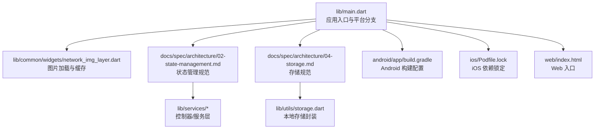
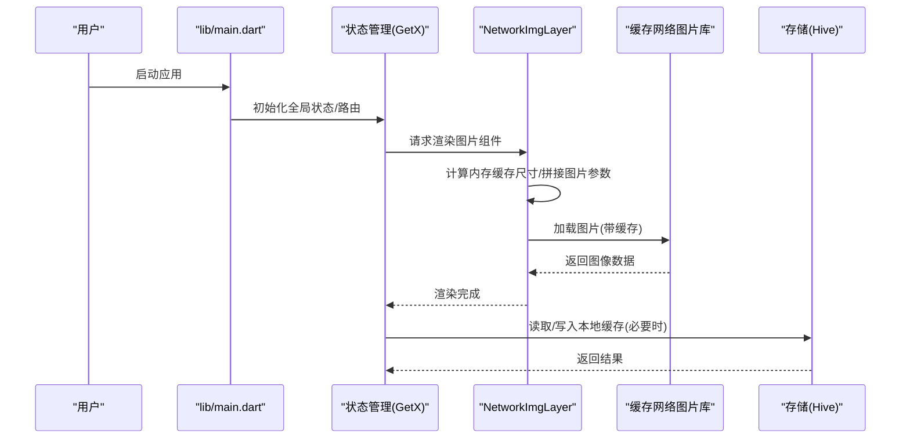
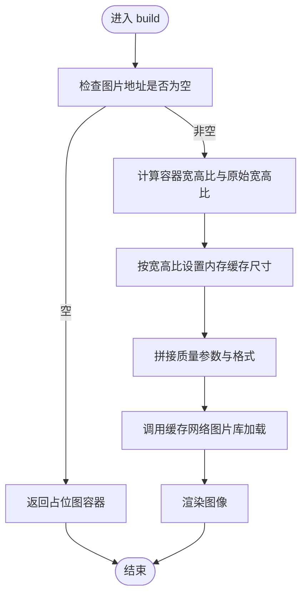
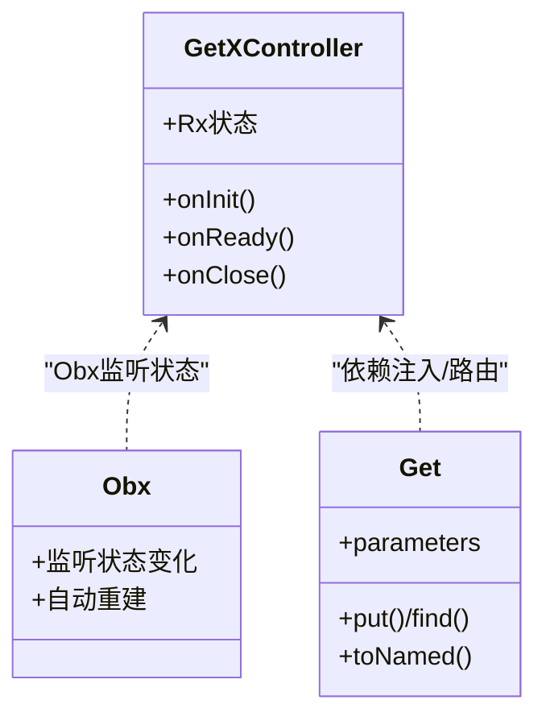
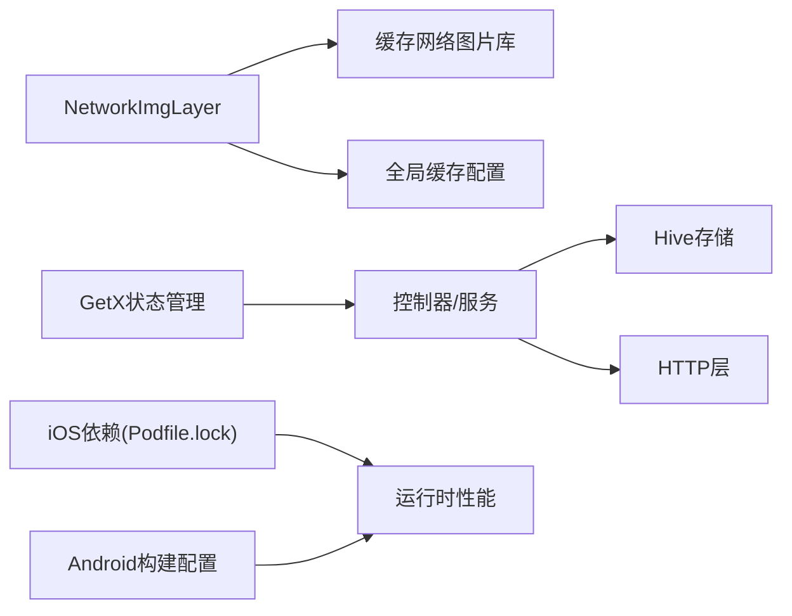

# 性能优化

<cite>
**本文引用的文件**
- [lib/common/widgets/network_img_layer.dart](file://lib/common/widgets/network_img_layer.dart)
- [docs/spec/architecture/02-state-management.md](file://docs/spec/architecture/02-state-management.md)
- [docs/spec/architecture/04-storage.md](file://docs/spec/architecture/04-storage.md)
- [lib/main.dart](file://lib/main.dart)
- [lib/models/danmaku/dm.pb.dart](file://lib/models/danmaku/dm.pb.dart)
- [lib/models/danmaku/dm.pbjson.dart](file://lib/models/danmaku/dm.pbjson.dart)
- [android/app/build.gradle](file://android/app/build.gradle)
- [android/gradle.properties](file://android/gradle.properties)
- [ios/Podfile.lock](file://ios/Podfile.lock)
- [web/index.html](file://web/index.html)
- [pubspec.yaml](file://pubspec.yaml)
</cite>

## 目录
1. [简介](#简介)
2. [项目结构](#项目结构)
3. [核心组件](#核心组件)
4. [架构总览](#架构总览)
5. [详细组件分析](#详细组件分析)
6. [依赖分析](#依赖分析)
7. [性能考量与优化策略](#性能考量与优化策略)
8. [故障排查指南](#故障排查指南)
9. [结论](#结论)
10. [附录](#附录)

## 简介
本指南面向PiliPala项目，系统性梳理并提出性能优化策略，覆盖内存管理、网络优化、图片优化、渲染性能、Flutter特有优化（Widget树、状态管理、异步编程）、平台差异（Android/iOS/Web）、缓存与懒加载、资源管理、性能监控与持续优化方法。内容基于仓库现有实现与文档进行归纳总结，并给出可操作的改进建议。

## 项目结构
- 应用入口位于lib/main.dart，按平台选择不同应用壳体。
- 图片加载与缓存通过自定义NetworkImgLayer组件结合缓存网络图片库实现。
- 状态管理采用GetX，文档明确了响应式状态、依赖注入、路由与全局缓存等实践。
- 存储层文档对Hive使用场景、事务与压缩策略进行了说明。
- 平台侧配置分别在android/、ios/、web/目录下，影响构建与运行时行为。

图表来源
- [lib/main.dart:120-149](file://lib/main.dart#L120-L149)
- [lib/common/widgets/network_img_layer.dart:1-127](file://lib/common/widgets/network_img_layer.dart#L1-L127)
- [docs/spec/architecture/02-state-management.md:1-56](file://docs/spec/architecture/02-state-management.md#L1-L56)
- [docs/spec/architecture/04-storage.md:271-283](file://docs/spec/architecture/04-storage.md#L271-L283)

章节来源
- [lib/main.dart:120-149](file://lib/main.dart#L120-L149)
- [lib/common/widgets/network_img_layer.dart:1-127](file://lib/common/widgets/network_img_layer.dart#L1-L127)
- [docs/spec/architecture/02-state-management.md:1-56](file://docs/spec/architecture/02-state-management.md#L1-L56)
- [docs/spec/architecture/04-storage.md:271-283](file://docs/spec/architecture/04-storage.md#L271-L283)

## 核心组件
- 图片加载与缓存：NetworkImgLayer负责根据容器宽高与原始宽高比计算内存缓存尺寸，拼接图片质量参数与格式后使用缓存网络图片组件加载，同时提供占位图与圆角裁剪。
- 状态管理：GetX响应式状态、依赖注入、路由与Tag隔离、全局数据缓存与事件总线。
- 存储：Hive Box的事务、压缩与安全注意事项。
- 平台适配：Android/iOS/Web入口与构建配置。

章节来源
- [lib/common/widgets/network_img_layer.dart:1-127](file://lib/common/widgets/network_img_layer.dart#L1-L127)
- [docs/spec/architecture/02-state-management.md:1-56](file://docs/spec/architecture/02-state-management.md#L1-L56)
- [docs/spec/architecture/04-storage.md:271-283](file://docs/spec/architecture/04-storage.md#L271-L283)

## 架构总览
从入口到渲染的关键路径如下：

图表来源
- [lib/main.dart:120-149](file://lib/main.dart#L120-L149)
- [lib/common/widgets/network_img_layer.dart:35-98](file://lib/common/widgets/network_img_layer.dart#L35-L98)
- [docs/spec/architecture/02-state-management.md:1-56](file://docs/spec/architecture/02-state-management.md#L1-L56)
- [docs/spec/architecture/04-storage.md:271-283](file://docs/spec/architecture/04-storage.md#L271-L283)

## 详细组件分析

### 图片加载与缓存组件（NetworkImgLayer）
- 内存缓存尺寸计算：依据容器宽高比与原始宽高比，优先按长边设置缓存尺寸，避免过度占用内存；若均未设置，则回退为容器像素宽度。
- 图片质量与格式：在URL后追加质量参数与WebP格式，降低带宽与解码成本。
- 占位与圆角：提供占位容器与圆角裁剪，减少闪烁与提升视觉一致性。
- 与缓存网络图片库集成：利用外部库进行磁盘缓存与网络请求复用，降低重复下载。

图表来源
- [lib/common/widgets/network_img_layer.dart:35-98](file://lib/common/widgets/network_img_layer.dart#L35-L98)

章节来源
- [lib/common/widgets/network_img_layer.dart:1-127](file://lib/common/widgets/network_img_layer.dart#L1-L127)

### 状态管理（GetX）
- 响应式状态：使用Rx变量驱动UI自动重建，避免手动刷新。
- 依赖注入与路由：统一管理控制器生命周期与路由参数传递。
- Tag隔离：多实例场景下通过Tag区分控制器，避免冲突。
- 全局缓存与事件总线：集中管理全局状态与跨组件通信。
- 最佳实践：在onInit/onReady/onClose中合理初始化/加载/释放资源，错误处理中明确状态重置。

图表来源
- [docs/spec/architecture/02-state-management.md:1-56](file://docs/spec/architecture/02-state-management.md#L1-L56)
- [docs/spec/architecture/02-state-management.md:172-259](file://docs/spec/architecture/02-state-management.md#L172-L259)

章节来源
- [docs/spec/architecture/02-state-management.md:1-56](file://docs/spec/architecture/02-state-management.md#L1-L56)
- [docs/spec/architecture/02-state-management.md:172-259](file://docs/spec/architecture/02-state-management.md#L172-L259)

### 存储（Hive）
- 事务与压缩：批量写入使用事务，定期压缩Box以回收空间。
- 安全注意事项：敏感数据放入专用Box，避免日志泄露。
- 大数据分页：建议对大列表采用分页存储与懒加载。

章节来源
- [docs/spec/architecture/04-storage.md:271-283](file://docs/spec/architecture/04-storage.md#L271-L283)

### 平台差异与构建配置
- Android：通过build.gradle与gradle.properties控制编译选项与构建参数。
- iOS：Podfile.lock记录依赖版本，影响二进制体积与运行时行为。
- Web：index.html作为入口，需关注首屏与资源加载策略。

章节来源
- [android/app/build.gradle](file://android/app/build.gradle)
- [android/gradle.properties](file://android/gradle.properties)
- [ios/Podfile.lock:87-102](file://ios/Podfile.lock#L87-L102)
- [web/index.html](file://web/index.html)

## 依赖分析
- 组件耦合：NetworkImgLayer依赖缓存网络图片库与全局缓存配置；状态管理贯穿业务层；存储层为状态与图片元数据提供持久化支持。
- 外部依赖：iOS端包含webview_flutter_wkwebview等插件，可能影响内存与渲染性能。
- 构建配置：Android与iOS的构建参数直接影响APK/IPA体积与启动时间。

图表来源
- [lib/common/widgets/network_img_layer.dart:1-127](file://lib/common/widgets/network_img_layer.dart#L1-L127)
- [docs/spec/architecture/02-state-management.md:1-56](file://docs/spec/architecture/02-state-management.md#L1-L56)
- [docs/spec/architecture/04-storage.md:271-283](file://docs/spec/architecture/04-storage.md#L271-L283)
- [ios/Podfile.lock:87-102](file://ios/Podfile.lock#L87-L102)

章节来源
- [lib/common/widgets/network_img_layer.dart:1-127](file://lib/common/widgets/network_img_layer.dart#L1-L127)
- [docs/spec/architecture/02-state-management.md:1-56](file://docs/spec/architecture/02-state-management.md#L1-L56)
- [docs/spec/architecture/04-storage.md:271-283](file://docs/spec/architecture/04-storage.md#L271-L283)
- [ios/Podfile.lock:87-102](file://ios/Podfile.lock#L87-L102)

## 性能考量与优化策略

### 内存管理
- 图片内存缓存：根据容器宽高比与原始宽高比设置内存缓存尺寸，避免超大纹理占用；在无显式尺寸时回退为容器像素宽度，防止越界。
- 列表与滚动：使用惰性列表、虚拟化与合适的item缓存策略，减少一次性渲染的节点数量。
- 对象池与复用：对频繁创建的对象（如消息气泡、评论项）采用池化或复用机制。
- Hive压缩：定期压缩Box，降低内存碎片与读取开销。

章节来源
- [lib/common/widgets/network_img_layer.dart:45-66](file://lib/common/widgets/network_img_layer.dart#L45-L66)
- [docs/spec/architecture/04-storage.md:271-283](file://docs/spec/architecture/04-storage.md#L271-L283)

### 网络优化
- 图片质量与格式：在URL后附加质量参数与WebP格式，降低带宽与解码成本。
- 缓存策略：结合磁盘缓存与ETag/Last-Modified，减少重复请求。
- 请求合并与去抖：对高频请求进行合并与去抖，降低网络压力。
- 超时与重试：设置合理的超时与指数退避重试策略，避免阻塞主线程。

章节来源
- [lib/common/widgets/network_img_layer.dart:40-41](file://lib/common/widgets/network_img_layer.dart#L40-L41)

### 图片优化
- 按需缩放：根据容器实际显示尺寸缩放，避免加载超大图片。
- 占位与渐进：使用占位图与渐进式加载，改善感知性能。
- 格式与质量：优先WebP，按设备能力动态调整质量参数。
- 圆角与裁剪：在绘制阶段完成圆角与裁剪，减少额外层级。

章节来源
- [lib/common/widgets/network_img_layer.dart:99-126](file://lib/common/widgets/network_img_layer.dart#L99-L126)

### 渲染性能
- Widget树优化：减少不必要的重建，使用Key、const构造器与轻量级Widget；避免深层嵌套与复杂布局。
- 异步渲染：将耗时任务移至后台线程，避免阻塞UI线程。
- 动画与过渡：尽量使用GPU加速的动画属性，避免频繁触发布局与绘制。
- 滚动性能：使用ListView.builder等惰性渲染，避免一次性构建大量子节点。

章节来源
- [docs/spec/architecture/02-state-management.md:1-56](file://docs/spec/architecture/02-state-management.md#L1-L56)

### Flutter特有优化
- 状态管理优化：使用GetX的响应式状态与Tag隔离，避免全局状态风暴；在onReady中做首次数据加载，在onClose中释放资源。
- 异步编程优化：使用Future/Stream进行异步处理，配合zone与错误边界，确保异常不崩溃UI。
- 依赖注入：集中管理控制器与服务，减少重复创建与泄漏风险。

章节来源
- [docs/spec/architecture/02-state-management.md:172-259](file://docs/spec/architecture/02-state-management.md#L172-L259)

### 不同平台的性能特点与建议
- Android
  - 构建优化：启用ProGuard/R8、按需打包、剔除无用资源。
  - 内存与GC：避免大对象常驻，合理使用弱引用与及时释放。
  - 启动时间：减少Application初始化工作，延迟加载非关键模块。
- iOS
  - 二进制体积：精简依赖、移除未使用功能；注意webview_flutter_wkwebview等插件的体积。
  - 内存管理：遵循ARC，避免循环引用；使用Instruments定位内存泄漏。
- Web
  - 首屏与资源：预加载关键资源、使用CDN、开启Gzip/Brotli压缩。
  - 渲染：避免DOM过深，使用Canvas或WebGL加速复杂图形。

章节来源
- [android/app/build.gradle](file://android/app/build.gradle)
- [android/gradle.properties](file://android/gradle.properties)
- [ios/Podfile.lock:87-102](file://ios/Podfile.lock#L87-L102)
- [web/index.html](file://web/index.html)

### 缓存策略、懒加载与资源管理最佳实践
- 缓存策略
  - 磁盘缓存：图片与静态资源使用磁盘缓存，设置过期策略与清理阈值。
  - 内存缓存：按显示尺寸与宽高比设置缓存尺寸，避免冗余。
  - Hive缓存：对小而频繁的数据使用内存缓存，大对象落地磁盘。
- 懒加载
  - 列表：使用builder模式与可见区域预加载。
  - 图片：仅在进入视口时发起请求，离开视口时取消或暂停。
- 资源管理
  - 分包与按需加载：将非关键模块拆分为独立包，按需下载。
  - 字体与图标：使用矢量资源，避免高分辨率位图。

章节来源
- [lib/common/widgets/network_img_layer.dart:45-66](file://lib/common/widgets/network_img_layer.dart#L45-L66)
- [docs/spec/architecture/04-storage.md:271-283](file://docs/spec/architecture/04-storage.md#L271-L283)

### 性能监控、瓶颈识别与解决
- 工具与方法
  - Flutter DevTools：CPU/内存/网络/渲染分析。
  - Android Studio Profiler：内存、CPU、网络与能耗分析。
  - Xcode Instruments：iOS内存与能耗分析。
  - Web性能：Chrome DevTools Performance/Network/Lighthouse。
- 瓶颈识别
  - UI卡顿：检查重建热点、布局计算与绘制开销。
  - 内存泄漏：关注未释放的控制器、订阅与缓存。
  - 网络慢：检查DNS、TLS握手、队头阻塞与缓存命中率。
- 解决方案
  - 减少重建：使用Key、分离状态、局部刷新。
  - 优化算法：使用更高效的数据结构与算法。
  - 引入缓存：增加磁盘与内存缓存，提高命中率。
  - 异步化：将耗时操作移至后台线程或Isolate。

章节来源
- [docs/spec/architecture/02-state-management.md:243-259](file://docs/spec/architecture/02-state-management.md#L243-L259)

### 性能测试、基准测试与持续监控
- 性能测试
  - 单元测试：针对热点函数与算法进行单元测试。
  - 集成测试：模拟真实场景下的交互与数据流。
- 基准测试
  - 使用flutter drive或第三方工具进行端到端基准。
  - 关键指标：启动时间、首帧时间、滚动流畅度、内存峰值。
- 持续监控
  - 上线前：自动化性能回归检查。
  - 上线后：埋点收集关键指标，建立告警与看板。

章节来源
- [docs/spec/architecture/02-state-management.md:243-259](file://docs/spec/architecture/02-state-management.md#L243-L259)

## 故障排查指南
- 图片不显示或加载缓慢
  - 检查图片URL与质量参数拼接逻辑。
  - 确认内存缓存尺寸计算是否合理。
  - 查看缓存网络图片库的日志与错误回调。
- 内存占用过高
  - 检查Hive Box是否定期压缩。
  - 确认控制器在onClose中释放资源。
  - 使用DevTools/Instruments定位泄漏点。
- 启动慢或卡顿
  - 延迟初始化非关键模块。
  - 优化首屏渲染，减少一次性构建的Widget数量。
  - 检查平台构建配置与依赖体积。

章节来源
- [lib/common/widgets/network_img_layer.dart:35-98](file://lib/common/widgets/network_img_layer.dart#L35-L98)
- [docs/spec/architecture/04-storage.md:271-283](file://docs/spec/architecture/04-storage.md#L271-L283)
- [docs/spec/architecture/02-state-management.md:235-259](file://docs/spec/architecture/02-state-management.md#L235-L259)

## 结论
通过在图片加载、状态管理、存储与平台构建等方面的系统性优化，PiliPala可在多端获得更优的性能表现。建议以DevTools与平台分析工具为抓手，持续监控关键指标，结合懒加载与缓存策略，逐步完善渲染与网络链路，最终实现稳定、流畅且可维护的高性能应用。

## 附录
- 数据模型与协议
  - Danmaku相关生成代码展示了高性能序列化/反序列化的基础，适合用于消息类数据的快速处理与传输。

章节来源
- [lib/models/danmaku/dm.pb.dart:5517-5999](file://lib/models/danmaku/dm.pb.dart#L5517-L5999)
- [lib/models/danmaku/dm.pbjson.dart:944-1385](file://lib/models/danmaku/dm.pbjson.dart#L944-L1385)
- [lib/models/danmaku/dm.pbjson.dart:1459-1474](file://lib/models/danmaku/dm.pbjson.dart#L1459-L1474)