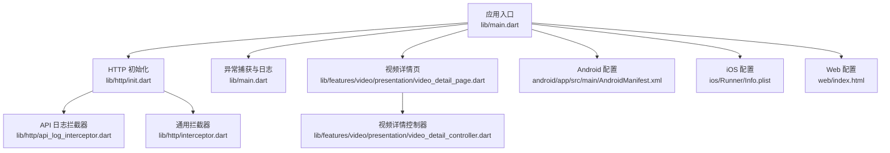
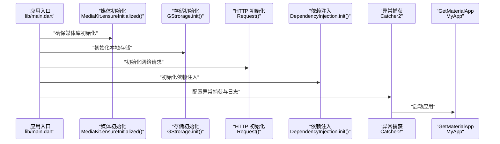
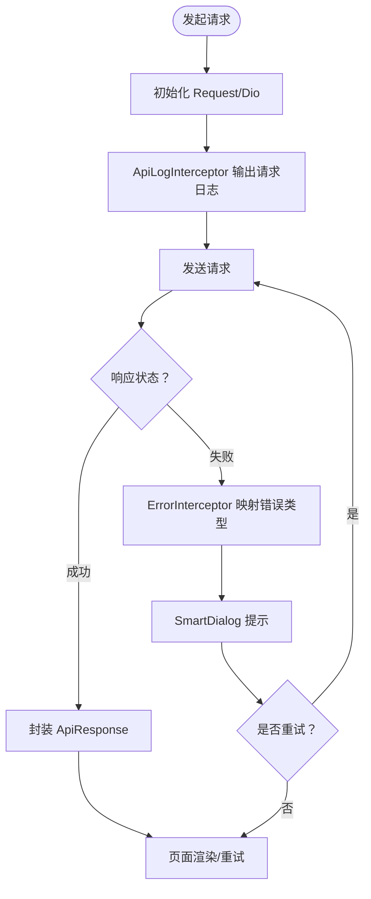
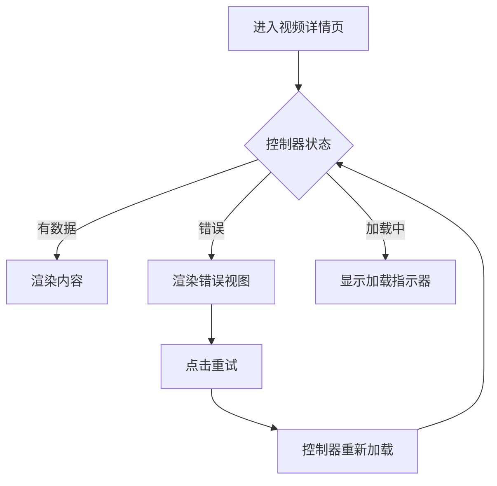
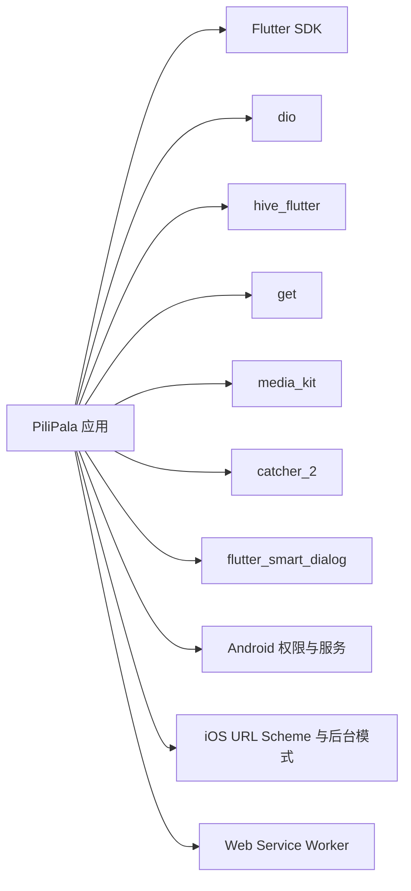
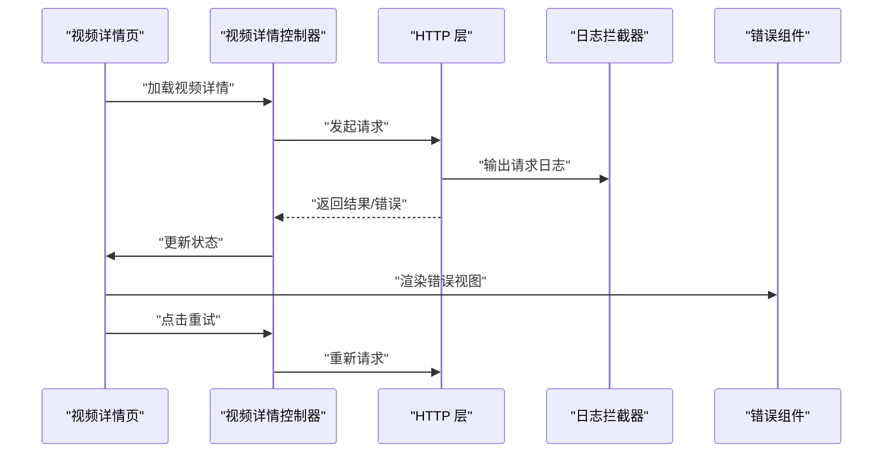

# 故障排除

<cite>
**本文引用的文件**
- [README.md](file://README.md)
- [pubspec.yaml](file://pubspec.yaml)
- [lib/main.dart](file://lib/main.dart)
- [lib/http/api_log_interceptor.dart](file://lib/http/api_log_interceptor.dart)
- [lib/http/interceptor.dart](file://lib/http/interceptor.dart)
- [lib/http/init.dart](file://lib/http/init.dart)
- [lib/http/api.dart](file://lib/http/api.dart)
- [lib/common/widgets/http_error.dart](file://lib/common/widgets/http_error.dart)
- [lib/features/video/presentation/video_detail_page.dart](file://lib/features/video/presentation/video_detail_page.dart)
- [lib/features/video/presentation/video_detail_controller.dart](file://lib/features/video/presentation/video_detail_controller.dart)
- [android/app/src/main/AndroidManifest.xml](file://android/app/src/main/AndroidManifest.xml)
- [ios/Runner/Info.plist](file://ios/Runner/Info.plist)
- [web/index.html](file://web/index.html)
- [docs/spec/architecture/03-http-layer.md](file://docs/spec/architecture/03-http-layer.md)
</cite>

## 目录
1. [简介](#简介)
2. [项目结构](#项目结构)
3. [核心组件](#核心组件)
4. [架构总览](#架构总览)
5. [详细组件分析](#详细组件分析)
6. [依赖关系分析](#依赖关系分析)
7. [性能考虑](#性能考虑)
8. [故障排除指南](#故障排除指南)
9. [结论](#结论)
10. [附录](#附录)

## 简介
本指南面向开发者与高级用户，系统化梳理 PiliPala 在开发与运行过程中可能遇到的环境配置、编译、运行时异常等问题，并提供统一的诊断方法、日志分析技巧与调试工具使用建议。同时覆盖 Android、iOS、Web 三大平台的差异化问题与解决方案，涵盖性能问题诊断、内存泄漏检测与崩溃分析方法，并给出错误代码参考与常见错误信息解释，帮助快速定位与解决问题。

## 项目结构
PiliPala 采用 Flutter 多端统一架构，核心入口位于 lib/main.dart，HTTP 层通过 lib/http/ 下的初始化与拦截器实现统一网络层；页面与控制器位于 lib/features/ 下，Android/iOS/Web 平台配置分别位于各自目录中。

**图表来源**
- [lib/main.dart:33-80](file://lib/main.dart#L33-L80)
- [lib/http/init.dart](file://lib/http/init.dart)
- [lib/http/api_log_interceptor.dart:1-83](file://lib/http/api_log_interceptor.dart#L1-L83)
- [lib/http/interceptor.dart:41-79](file://lib/http/interceptor.dart#L41-L79)
- [lib/features/video/presentation/video_detail_page.dart:190-204](file://lib/features/video/presentation/video_detail_page.dart#L190-L204)
- [lib/features/video/presentation/video_detail_controller.dart:321-347](file://lib/features/video/presentation/video_detail_controller.dart#L321-L347)
- [android/app/src/main/AndroidManifest.xml:38-272](file://android/app/src/main/AndroidManifest.xml#L38-L272)
- [ios/Runner/Info.plist:1-114](file://ios/Runner/Info.plist#L1-L114)
- [web/index.html:1-60](file://web/index.html#L1-L60)

**章节来源**
- [lib/main.dart:33-80](file://lib/main.dart#L33-L80)
- [README.md:24-38](file://README.md#L24-L38)

## 核心组件
- 应用入口与初始化：负责设备能力初始化、主题与动态色、高帧率设置、异常捕获与日志、全局数据缓存与 Scheme 初始化。
- HTTP 层：统一的 Request 单例、基础配置、拦截器链路（请求/响应/错误）、API 常量与端点规范。
- 页面与控制器：以视频详情页为例，展示加载状态、错误展示与重试逻辑。
- 平台配置：Android Manifest、iOS Info.plist、Web index.html 的关键权限与能力声明。

**章节来源**
- [lib/main.dart:33-80](file://lib/main.dart#L33-L80)
- [lib/http/init.dart](file://lib/http/init.dart)
- [lib/http/api_log_interceptor.dart:1-83](file://lib/http/api_log_interceptor.dart#L1-L83)
- [lib/http/interceptor.dart:41-79](file://lib/http/interceptor.dart#L41-L79)
- [lib/features/video/presentation/video_detail_page.dart:190-204](file://lib/features/video/presentation/video_detail_page.dart#L190-L204)

## 架构总览
下图展示了应用启动到页面渲染的关键调用序列，包括异常捕获、HTTP 初始化与拦截器链路。

**图表来源**
- [lib/main.dart:33-80](file://lib/main.dart#L33-L80)

## 详细组件分析

### HTTP 层与错误处理
- 统一请求封装：通过 Request 单例与 Dio 配置，集中处理超时、Base URL、拦截器等。
- 日志拦截器：输出请求/响应/错误的结构化日志，包含业务 code/msg 与数据摘要，便于排查。
- 通用拦截器：对网络异常类型进行统一提示与处理，避免重复逻辑分散在各处。
- 页面错误展示：提供 HttpError 组件与视频详情页的错误分支，支持一键重试。

**图表来源**
- [lib/http/api_log_interceptor.dart:33-83](file://lib/http/api_log_interceptor.dart#L33-L83)
- [lib/http/interceptor.dart:41-79](file://lib/http/interceptor.dart#L41-L79)
- [lib/http/init.dart](file://lib/http/init.dart)
- [lib/common/widgets/http_error.dart:1-59](file://lib/common/widgets/http_error.dart#L1-L59)
- [lib/features/video/presentation/video_detail_page.dart:338-361](file://lib/features/video/presentation/video_detail_page.dart#L338-L361)

**章节来源**
- [docs/spec/architecture/03-http-layer.md:30-350](file://docs/spec/architecture/03-http-layer.md#L30-L350)
- [lib/http/api_log_interceptor.dart:1-83](file://lib/http/api_log_interceptor.dart#L1-L83)
- [lib/http/interceptor.dart:41-79](file://lib/http/interceptor.dart#L41-L79)
- [lib/common/widgets/http_error.dart:1-59](file://lib/common/widgets/http_error.dart#L1-L59)
- [lib/features/video/presentation/video_detail_page.dart:338-361](file://lib/features/video/presentation/video_detail_page.dart#L338-L361)

### 视频详情页加载与错误处理
- 加载状态：根据控制器状态切换内容/加载/错误三种视图。
- 错误展示：错误视图提供重试按钮，触发控制器重新加载。
- 播放地址初始化：优先 DASH，回退 DURL，若仍为空则设置错误信息。

**图表来源**
- [lib/features/video/presentation/video_detail_page.dart:190-204](file://lib/features/video/presentation/video_detail_page.dart#L190-L204)
- [lib/features/video/presentation/video_detail_page.dart:338-361](file://lib/features/video/presentation/video_detail_page.dart#L338-L361)
- [lib/features/video/presentation/video_detail_controller.dart:321-347](file://lib/features/video/presentation/video_detail_controller.dart#L321-L347)

**章节来源**
- [lib/features/video/presentation/video_detail_page.dart:190-204](file://lib/features/video/presentation/video_detail_page.dart#L190-L204)
- [lib/features/video/presentation/video_detail_controller.dart:321-347](file://lib/features/video/presentation/video_detail_controller.dart#L321-L347)

## 依赖关系分析
- Flutter 与第三方库：Dio、Hive、Get、MediaKit、Catcher2、FlutterSmartDialog 等。
- 平台能力：Android 权限、iOS URL Scheme、Web Service Worker 启动。
- 构建与版本：Android 使用 versionName/versionCode，iOS 使用 CFBundleShortVersionString/CFBundleVersion。

**图表来源**
- [pubspec.yaml:30-154](file://pubspec.yaml#L30-L154)
- [android/app/src/main/AndroidManifest.xml:257-272](file://android/app/src/main/AndroidManifest.xml#L257-L272)
- [ios/Runner/Info.plist:58-112](file://ios/Runner/Info.plist#L58-L112)
- [web/index.html:35-57](file://web/index.html#L35-L57)

**章节来源**
- [pubspec.yaml:30-154](file://pubspec.yaml#L30-L154)

## 性能考虑
- 帧率与显示模式：Android 端可尝试设置高帧率，若设备不支持会静默失败，避免阻塞主线程。
- 网络层优化：通过日志拦截器识别高频接口（心跳、流媒体），合理排除打印，降低 I/O 压力。
- UI 渲染：页面根据状态切换，避免不必要的重建；视频播放区域在全屏/横屏时调整 pinned header 高度，减少滚动不同步带来的额外计算。

**章节来源**
- [lib/main.dart:103-118](file://lib/main.dart#L103-L118)
- [lib/http/api_log_interceptor.dart:9-15](file://lib/http/api_log_interceptor.dart#L9-L15)
- [lib/features/video/presentation/video_detail_page.dart:174-186](file://lib/features/video/presentation/video_detail_page.dart#L174-L186)

## 故障排除指南

### 一、环境配置问题
- Android
  - 权限缺失：确认 INTERNET、READ_MEDIA_*、FOREGROUND_SERVICE、WAKE_LOCK 等权限已在清单中声明。
  - Picture-in-Picture 支持：确保 activity 启用了 supportsPictureInPicture 与 resizeableActivity。
  - 高帧率：Android 端设置高帧率时需捕获异常，避免在不支持的设备上抛出异常。
- iOS
  - URL Scheme：确保 CFBundleURLTypes 包含 bilibili 及相关域名，以便外部跳转与分享。
  - 后台音频：启用 UIBackgroundModes/audio 以支持后台播放。
  - 相册/相机权限：Info.plist 中的 NSPhotoLibraryUsageDescription、NSCameraUsageDescription 等需完善。
- Web
  - Service Worker：index.html 中的 flutter.js 与 serviceWorkerVersion 需正确注入，确保离线与缓存可用。

**章节来源**
- [android/app/src/main/AndroidManifest.xml:38-272](file://android/app/src/main/AndroidManifest.xml#L38-L272)
- [ios/Runner/Info.plist:58-112](file://ios/Runner/Info.plist#L58-L112)
- [web/index.html:35-57](file://web/index.html#L35-L57)
- [lib/main.dart:103-118](file://lib/main.dart#L103-L118)

### 二、编译错误
- 依赖冲突：pubspec.yaml 中存在 dependency_overrides，若出现构建失败，优先检查 overrides 的路径与版本。
- Android Gradle 插件：确保 Gradle Wrapper 与 Android Gradle Plugin 版本兼容。
- iOS Pods：Podfile 与 Podfile.lock 需保持一致，执行 pod install 更新依赖。
- Web 构建：确认 base href 与 manifest.json 路径正确，避免资源 404。

**章节来源**
- [pubspec.yaml:174-189](file://pubspec.yaml#L174-L189)
- [README.md:24-38](file://README.md#L24-L38)

### 三、运行时异常
- 异常捕获与日志
  - 应用启动阶段通过 Catcher2 配置日志输出位置（Web 输出到控制台，非 Web 输出到文件），便于后续分析。
  - 建议在开发阶段开启更详细的日志，生产环境保留关键错误日志。
- 网络异常
  - 通用拦截器将 DioExceptionType 映射为用户可理解的提示，如“连接错误”“超时”等。
  - 若频繁出现未知错误，结合 ApiLogInterceptor 的请求/响应/错误日志定位具体接口与业务状态。
- 页面错误
  - 视频详情页在错误状态下提供“重试”按钮，触发控制器重新加载。
  - HttpError 组件可作为通用错误占位，统一风格与交互。

**图表来源**
- [lib/features/video/presentation/video_detail_page.dart:190-204](file://lib/features/video/presentation/video_detail_page.dart#L190-L204)
- [lib/features/video/presentation/video_detail_page.dart:338-361](file://lib/features/video/presentation/video_detail_page.dart#L338-L361)
- [lib/http/api_log_interceptor.dart:33-83](file://lib/http/api_log_interceptor.dart#L33-L83)
- [lib/http/interceptor.dart:41-79](file://lib/http/interceptor.dart#L41-L79)

**章节来源**
- [lib/main.dart:50-61](file://lib/main.dart#L50-L61)
- [lib/http/interceptor.dart:41-79](file://lib/http/interceptor.dart#L41-L79)
- [lib/common/widgets/http_error.dart:1-59](file://lib/common/widgets/http_error.dart#L1-L59)
- [lib/features/video/presentation/video_detail_page.dart:338-361](file://lib/features/video/presentation/video_detail_page.dart#L338-L361)

### 四、平台特定问题与解决方案
- Android
  - 帧率设置失败：在 try/catch 中设置高帧率，避免在不支持的设备上中断流程。
  - 权限与存储：READ_MEDIA_* 权限在 Android 13+ 需要运行时授权；存储初始化需在 runApp 前完成。
  - 媒体服务：前台服务与广播接收器需正确声明，避免后台播放异常。
- iOS
  - URL Scheme 与 Universal Links：确保 Info.plist 中的 LSApplicationQueriesSchemes 与 CFBundleURLTypes 完整。
  - 后台模式：启用 audio 以支持后台播放，避免切到后台后停止。
- Web
  - Service Worker 生命周期：确保 index.html 中的 serviceWorkerVersion 注入正确，避免离线缓存失效。
  - 资源路径：确认 base href 与静态资源路径一致，避免 404。

**章节来源**
- [lib/main.dart:103-118](file://lib/main.dart#L103-L118)
- [android/app/src/main/AndroidManifest.xml:257-272](file://android/app/src/main/AndroidManifest.xml#L257-L272)
- [ios/Runner/Info.plist:58-112](file://ios/Runner/Info.plist#L58-L112)
- [web/index.html:17-38](file://web/index.html#L17-L38)

### 五、性能问题诊断
- 帧率与卡顿
  - 检查高帧率设置是否生效；在低端设备上适当降低目标帧率。
  - 观察滚动与全屏切换时的布局计算，避免不必要的重建。
- 网络延迟
  - 使用 ApiLogInterceptor 定位慢接口，结合业务 code/msg 判断是否为服务端限流或鉴权问题。
  - 对高频接口（心跳、流媒体）进行日志排除，减少 I/O 压力。
- UI 渲染
  - 页面根据状态切换，避免在错误分支中做复杂计算；必要时拆分小部件以减少重建范围。

**章节来源**
- [lib/main.dart:103-118](file://lib/main.dart#L103-L118)
- [lib/http/api_log_interceptor.dart:9-15](file://lib/http/api_log_interceptor.dart#L9-L15)

### 六、内存泄漏与崩溃分析
- 内存泄漏
  - 控制器中持有异步任务与订阅时，确保在 dispose 或页面离开时取消订阅与释放资源。
  - 避免在 HTTP 层持有全局状态或上下文引用。
- 崩溃分析
  - 使用 Catcher2 在非 Web 环境输出文件日志，在 Web 环境输出到控制台，结合堆栈定位问题。
  - 对于视频播放器相关的崩溃，优先检查播放地址初始化逻辑与媒体库初始化顺序。

**章节来源**
- [lib/main.dart:50-61](file://lib/main.dart#L50-L61)
- [lib/features/video/presentation/video_detail_controller.dart:321-347](file://lib/features/video/presentation/video_detail_controller.dart#L321-L347)

### 七、错误代码参考与常见错误信息
- HTTP 层错误码处理
  - 200：正常；302：重定向，提取 access_key；4xx：客户端错误，提示用户；5xx：服务器错误，提示重试。
- 业务错误码
  - Bilibili API 返回的业务错误码需在业务层判断，例如未登录等场景。
- 常见错误信息
  - “证书有误！”、“服务器异常，请稍后重试！”、“连接错误，请检查网络设置”、“网络连接超时，请检查网络设置”、“响应超时，请稍后重试！”、“发送请求超时，请检查网络设置”、“网络异常！”等。

**章节来源**
- [docs/spec/architecture/03-http-layer.md:291-314](file://docs/spec/architecture/03-http-layer.md#L291-L314)
- [lib/http/interceptor.dart:59-79](file://lib/http/interceptor.dart#L59-L79)

### 八、日志分析技巧与调试工具
- 日志输出
  - Web：控制台查看；非 Web：文件路径由 getLogsPath() 决定，建议定期归档。
- 调试工具
  - Flutter DevTools：监控内存、性能与网络请求。
  - Android Studio/VS Code：断点调试与日志过滤。
  - iOS Simulator：结合 Xcode 控制台与 Allocations/Leaks 工具。
  - Web：浏览器开发者工具 Network/Timeline 面板。

**章节来源**
- [lib/main.dart:50-61](file://lib/main.dart#L50-L61)

## 结论
本指南提供了从环境配置、编译、运行到性能与崩溃分析的系统化排障流程。建议在开发阶段充分利用日志拦截器与 Catcher2，结合平台配置清单与页面错误组件，快速定位问题根因并实施修复。对于跨端一致性问题，优先检查 HTTP 层与平台能力差异，确保在多端具备相同的错误处理与用户体验。

## 附录
- 快速检查清单
  - Android：权限、PiP、高帧率、媒体服务声明。
  - iOS：URL Scheme、后台音频、权限描述。
  - Web：Service Worker、base href、资源路径。
  - 网络：日志拦截器开启、错误映射、重试策略。
  - 性能：帧率设置、高频接口日志排除、UI 状态切换。