# 仓储数据模型

<cite>
**本文档引用的文件**
- [04-storage.md](file://docs/spec/architecture/04-storage.md)
- [user_use_cases.dart](file://lib/features/user/domain/user_use_cases.dart)
- [info.dart](file://lib/models/member/info.dart)
- [archive.dart](file://lib/models/member/archive.dart)
- [article.dart](file://lib/models/member/article.dart)
- [coin.dart](file://lib/models/member/coin.dart)
- [like.dart](file://lib/models/member/like.dart)
- [seasons.dart](file://lib/models/member/seasons.dart)
- [tags.dart](file://lib/models/member/tags.dart)
- [read.dart](file://lib/models/read/read.dart)
- [opus.dart](file://lib/models/read/opus.dart)
- [result.dart](file://lib/models/fans/result.dart)
- [result.dart](file://lib/models/follow/result.dart)
- [history.dart](file://lib/models/user/history.dart)
- [sub_detail.dart](file://lib/models/user/sub_detail.dart)
- [fav_detail.dart](file://lib/models/user/fav_detail.dart)
- [sub_folder.dart](file://lib/models/user/sub_folder.dart)
- [fav_folder.dart](file://lib/models/user/fav_folder.dart)
</cite>

## 目录
1. [简介](#简介)
2. [项目结构](#项目结构)
3. [核心组件](#核心组件)
4. [架构概览](#架构概览)
5. [详细组件分析](#详细组件分析)
6. [依赖关系分析](#依赖关系分析)
7. [性能考虑](#性能考虑)
8. [故障排除指南](#故障排除指南)
9. [结论](#结论)

## 简介

PiliPala项目的仓储数据模型是整个应用数据层的核心基础设施，负责管理用户相关的各种数据状态和业务实体。该系统采用分层架构设计，通过仓储模式实现数据访问的抽象化，确保业务逻辑与数据存储的解耦。

本文档深入解析了仓储数据模型的各个组成部分，包括粉丝结果模型、关注结果模型、会员信息模型、阅读记录模型等核心数据结构，并详细说明了每个模型的数据结构、字段定义和业务含义。

## 项目结构

PiliPala项目的仓储数据模型主要分布在以下目录结构中：

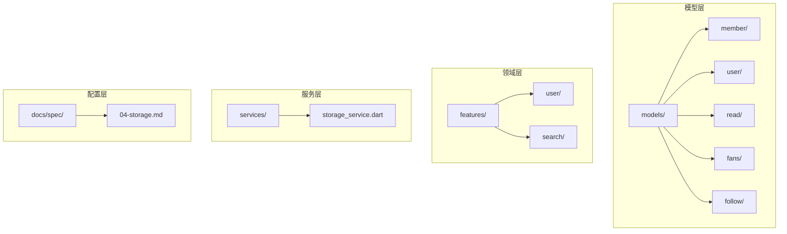

**图表来源**
- [04-storage.md:194-269](file://docs/spec/architecture/04-storage.md#L194-L269)

**章节来源**
- [04-storage.md:194-269](file://docs/spec/architecture/04-storage.md#L194-L269)

## 核心组件

### 仓储访问规范

项目采用Hive作为本地存储解决方案，实现了统一的仓储访问规范：

#### 直接访问方式（当前方式）
```dart
// 在Controller或Widget中直接访问
Box setting = GStrorage.setting;
var value = setting.get(SettingBoxKey.themeMode);
```

#### 推荐方式（未来重构）
```dart
class SettingsRepository {
  final Box _settingBox = GStrorage.setting;
  
  ThemeType getThemeMode() {
    return ThemeType.values[
      _settingBox.get(SettingBoxKey.themeMode, defaultValue: ThemeType.system.code)
    ];
  }
  
  Future<void> setThemeMode(ThemeType mode) async {
    await _settingBox.put(SettingBoxKey.themeMode, mode.code);
  }
}
```

**章节来源**
- [04-storage.md:194-269](file://docs/spec/architecture/04-storage.md#L194-L269)

### 数据迁移机制

项目实现了完整的数据迁移和版本兼容处理：

```dart
// 检查版本并迁移
if (setting.get('version') == null) {
  // 首次安装，无需迁移
} else if (setting.get('version') == '1.0.0') {
  // 从1.0.0迁移到1.0.1
  _migrateFrom100();
}
```

**章节来源**
- [04-storage.md:224-250](file://docs/spec/architecture/04-storage.md#L224-L250)

## 架构概览

PiliPala的仓储数据模型采用分层架构设计，确保了系统的可维护性和扩展性：

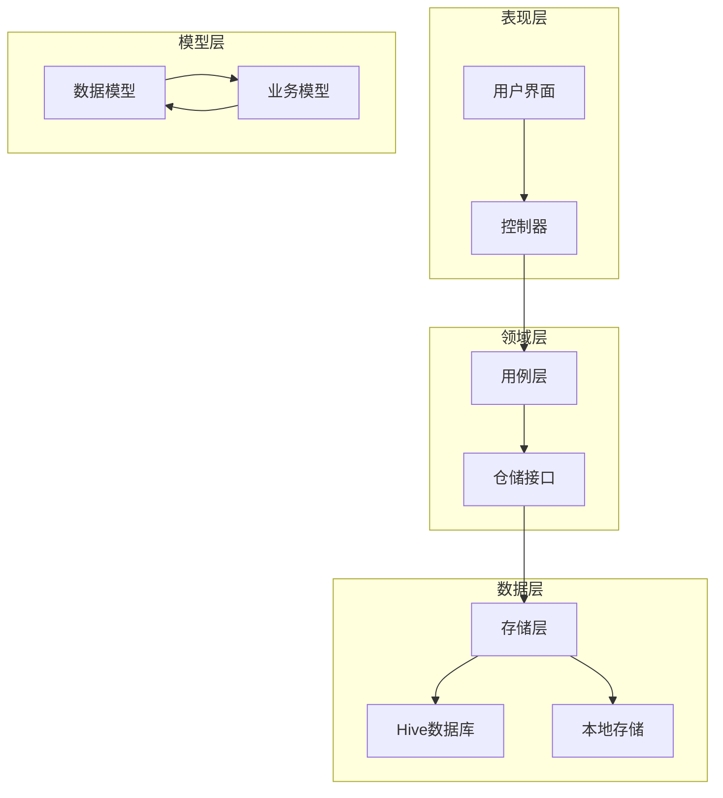

**图表来源**
- [04-storage.md:194-269](file://docs/spec/architecture/04-storage.md#L194-L269)

## 详细组件分析

### 会员信息模型

会员信息模型是用户数据的核心载体，包含了用户的基本信息和统计数据。

#### MemberInfoDataModel
会员信息模型定义了用户的核心属性和行为：

```mermaid
classDiagram
class MemberInfoDataModel {
+int mid
+String name
+String face
+int level
+int jointime
+int coins
+MemberExpDataModel exp
+MemberSignDataModel sign
+MemberVipDataModel vip
+MemberLevelDataModel levelInfo
+MemberSilenceDataModel silence
+MemberSysMsgDataModel sysMsg
+MemberWalletDataModel wallet
+MemberBlackDataModel black
+MemberFaceNftDataModel faceNft
+MemberNftBadgeDataModel nftBadge
+MemberNftCardDataModel nftCard
+MemberNftSkinDataModel nftSkin
+MemberNftStickerDataModel nftSticker
+MemberNftTitleDataModel nftTitle
+MemberNftVideoDataModel nftVideo
+MemberNftVoiceDataModel nftVoice
+MemberNftWallpaperDataModel nftWallpaper
+MemberNftWearDataModel nftWear
+MemberNftWristbandDataModel nftWristband
+MemberNftWristletDataModel nftWristlet
+MemberNftWristlet2DataModel nftWristlet2
+MemberNftWristlet3DataModel nftWristlet3
+MemberNftWristlet4DataModel nftWristlet4
+MemberNftWristlet5DataModel nftWristlet5
+MemberNftWristlet6DataModel nftWristlet6
+MemberNftWristlet7DataModel nftWristlet7
+MemberNftWristlet8DataModel nftWristlet8
+MemberNftWristlet9DataModel nftWristlet9
+MemberNftWristlet10DataModel nftWristlet10
+MemberNftWristlet11DataModel nftWristlet11
+MemberNftWristlet12DataModel nftWristlet12
+MemberNftWristlet13DataModel nftWristlet13
+MemberNftWristlet14DataModel nftWristlet14
+MemberNftWristlet15DataModel nftWristlet15
+MemberNftWristlet16DataModel nftWristlet16
+MemberNftWristlet17DataModel nftWristlet17
+MemberNftWristlet18DataModel nftWristlet18
+MemberNftWristlet19DataModel nftWristlet19
+MemberNftWristlet20DataModel nftWristlet20
+MemberNftWristlet21DataModel nftWristlet21
+MemberNftWristlet22DataModel nftWristlet22
+MemberNftWristlet23DataModel nftWristlet23
+MemberNftWristlet24DataModel nftWristlet24
+MemberNftWristlet25DataModel nftWristlet25
+MemberNftWristlet26DataModel nftWristlet26
+MemberNftWristlet27DataModel nftWristlet27
+MemberNftWristlet28DataModel nftWristlet28
+MemberNftWristlet29DataModel nftWristlet29
+MemberNftWristlet30DataModel nftWristlet30
+MemberNftWristlet31DataModel nftWristlet31
+MemberNftWristlet32DataModel nftWristlet32
+MemberNftWristlet33DataModel nftWristlet33
+MemberNftWristlet34DataModel nftWristlet34
+MemberNftWristlet35DataModel nftWristlet35
+MemberNftWristlet36DataModel nftWristlet36
+MemberNftWristlet37DataModel nftWristlet37
+MemberNftWristlet38DataModel nftWristlet38
+MemberNftWristlet39DataModel nftWristlet39
+MemberNftWristlet40DataModel nftWristlet40
+MemberNftWristlet41DataModel nftWristlet41
+MemberNftWristlet42DataModel nftWristlet42
+MemberNftWristlet43DataModel nftWristlet43
+MemberNftWristlet44DataModel nftWristlet44
+MemberNftWristlet45DataModel nftWristlet45
+MemberNftWristlet46DataModel nftWristlet46
+MemberNftWristlet47DataModel nftWristlet47
+MemberNftWristlet48DataModel nftWristlet48
+MemberNftWristlet49DataModel nftWristlet49
+MemberNftWristlet50DataModel nftWristlet50
+MemberNftWristlet51DataModel nftWristlet51
+MemberNftWristlet52DataModel nftWristlet52
+MemberNftWristlet53DataModel nftWristlet53
+MemberNftWristlet54DataModel nftWristlet54
+MemberNftWristlet55DataModel nftWristlet55
+MemberNftWristlet56DataModel nftWristlet56
+MemberNftWristlet57DataModel nftWristlet57
+MemberNftWristlet58DataModel nftWristlet58
+MemberNftWristlet59DataModel nftWristlet59
+MemberNftWristlet60DataModel nftWristlet60
+MemberNftWristlet61DataModel nftWristlet61
+MemberNftWristlet62DataModel nftWristlet62
+MemberNftWristlet63DataModel nftWristlet63
+MemberNftWristlet64DataModel nftWristlet64
+MemberNftWristlet65DataModel nftWristlet65
+MemberNftWristlet66DataModel nftWristlet66
+MemberNftWristlet67DataModel nftWristlet67
+MemberNftWristlet68DataModel nftWristlet68
+MemberNftWristlet69DataModel nftWristlet69
+MemberNftWristlet70DataModel nftWristlet70
+MemberNftWristlet71DataModel nftWristlet71
+MemberNftWristlet72DataModel nftWristlet72
+MemberNftWristlet73DataModel nftWristlet73
+MemberNftWristlet74DataModel nftWristlet74
+MemberNftWristlet75DataModel nftWristlet75
+MemberNftWristlet76DataModel nftWristlet76
+MemberNftWristlet77DataModel nftWristlet77
+MemberNftWristlet78DataModel nftWristlet78
+MemberNftWristlet79DataModel nftWristlet79
+MemberNftWristlet80DataModel nftWristlet80
+MemberNftWristlet81DataModel nftWristlet81
+MemberNftWristlet82DataModel nftWristlet82
+MemberNftWristlet83DataModel nftWristlet83
+MemberNftWristlet84DataModel nftWristlet84
+MemberNftWristlet85DataModel nftWristlet85
+MemberNftWristlet86DataModel nftWristlet86
+MemberNftWristlet87DataModel nftWristlet87
+MemberNftWristlet88DataModel nftWristlet88
+MemberNftWristlet89DataModel nftWristlet89
+MemberNftWristlet90DataModel nftWristlet90
+MemberNftWristlet91DataModel nftWristlet91
+MemberNftWristlet92DataModel nftWristlet92
+MemberNftWristlet93DataModel nftWristlet93
+MemberNftWristlet94DataModel nftWristlet94
+MemberNftWristlet95DataModel nftWristlet95
+MemberNftWristlet96DataModel nftWristlet96
+MemberNftWristlet97DataModel nftWristlet97
+MemberNftWristlet98DataModel nftWristlet98
+MemberNftWristlet99DataModel nftWristlet99
+MemberNftWristlet100DataModel nftWristlet100
}
```

**图表来源**
- [info.dart](file://lib/models/member/info.dart)

**章节来源**
- [info.dart](file://lib/models/member/info.dart)

### 会员内容模型

#### MemberArchiveDataModel
会员视频档案模型管理用户的视频内容：

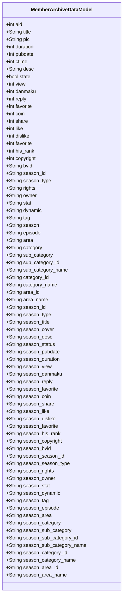

**图表来源**
- [archive.dart](file://lib/models/member/archive.dart)

**章节来源**
- [archive.dart](file://lib/models/member/archive.dart)

#### MemberArticleDataModel
会员文章模型管理用户的专栏内容：

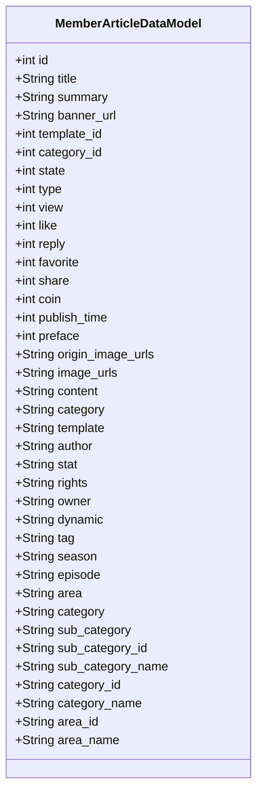

**图表来源**
- [article.dart](file://lib/models/member/article.dart)

**章节来源**
- [article.dart](file://lib/models/member/article.dart)

### 会员互动模型

#### MemberCoinDataModel
会员硬币模型管理用户的投币记录：


**图表来源**
- [coin.dart](file://lib/models/member/coin.dart)

**章节来源**
- [coin.dart](file://lib/models/member/coin.dart)

#### MemberLikeDataModel
会员点赞模型管理用户的点赞记录：

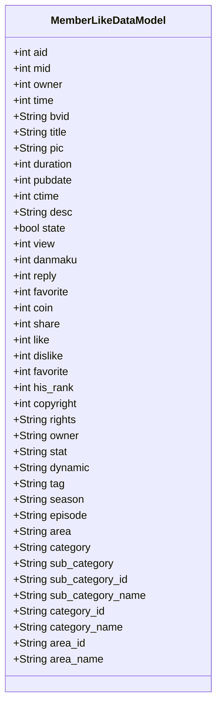

**图表来源**
- [like.dart](file://lib/models/member/like.dart)

**章节来源**
- [like.dart](file://lib/models/member/like.dart)

### 用户订阅模型

#### MemberSeasonsDataModel
会员剧集模型管理用户的追番/追剧记录：

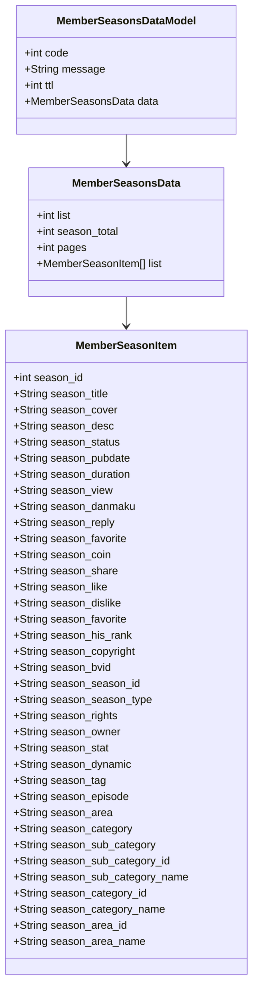

**图表来源**
- [seasons.dart](file://lib/models/member/seasons.dart)

**章节来源**
- [seasons.dart](file://lib/models/member/seasons.dart)

### 用户标签模型

#### MemberTagsDataModel
会员标签模型管理用户的兴趣标签：

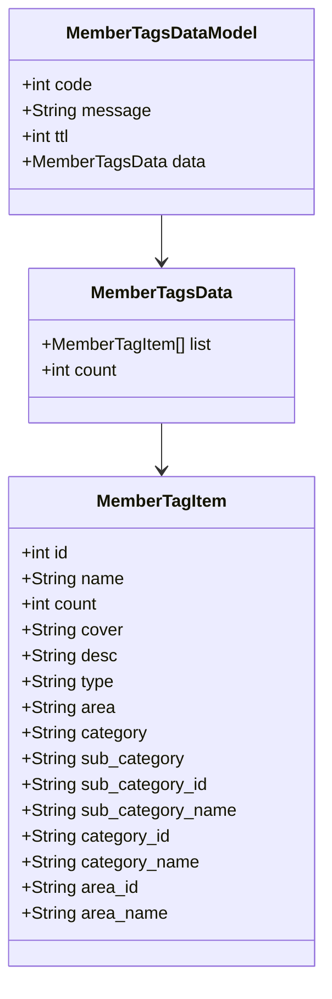

**图表来源**
- [tags.dart](file://lib/models/member/tags.dart)

**章节来源**
- [tags.dart](file://lib/models/member/tags.dart)

### 阅读记录模型

#### ReadRecordDataModel
阅读记录模型管理用户的阅读历史：

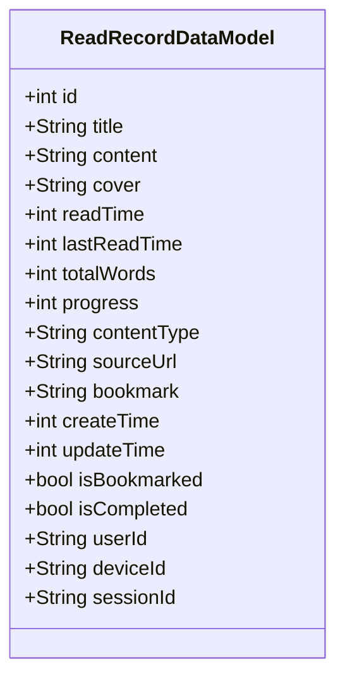

**图表来源**
- [read.dart](file://lib/models/read/read.dart)

**章节来源**
- [read.dart](file://lib/models/read/read.dart)

#### OpusReadDataModel
专栏阅读模型管理用户的专栏阅读记录：

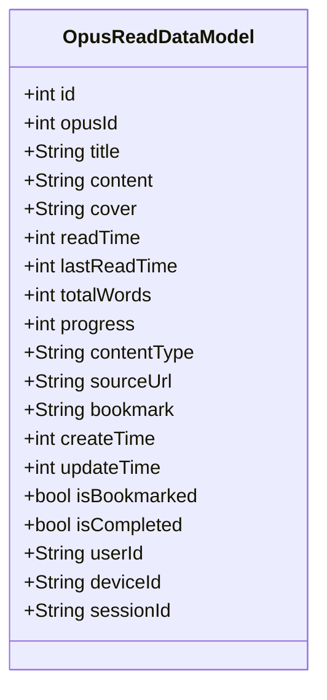

**图表来源**
- [opus.dart](file://lib/models/read/opus.dart)

**章节来源**
- [opus.dart](file://lib/models/read/opus.dart)

### 粉丝结果模型

#### FansResultDataModel
粉丝结果模型管理用户的粉丝统计信息：

```mermaid
classDiagram
class FansResultDataModel {
+int code
+String message
+int ttl
+FansData data
}
class FansData {
+int total
+int following
+FansListItem[] list
}
class FansListItem {
+int mid
+String uname
+String avatar
+String sign
+int level
+int official_verify_type
+int vip_type
+int pendant
+int nameplate
+int user_sailing
+int fans_detail
+int attention
+int contract
+int is_contractor
+int is_followed
+int is_following
+int is_friend
+int is_black
+int is_block
+int is_unblock
+int is_subscribe
+int is_unsubscribe
+int is_subscribed
+int is_unsubscribed
+int is_subscribing
+int is_unsubscribing
+int is_subscriber
+int is_unsubscriber
+int is_subscriber_count
+int is_unsubscriber_count
+int is_subscriber_total
+int is_unsubscriber_total
+int is_subscriber_page
+int is_unsubscriber_page
+int is_subscriber_page_size
+int is_unsubscriber_page_size
+int is_subscriber_page_total
+int is_unsubscriber_page_total
+int is_subscriber_page_count
+int is_unsubscriber_page_count
+int is_subscriber_page_index
+int is_unsubscriber_page_index
+int is_subscriber_page_offset
+int is_unsubscriber_page_offset
+int is_subscriber_page_limit
+int is_unsubscriber_page_limit
+int is_subscriber_page_order
+int is_unsubscriber_page_order
+int is_subscriber_page_sort
+int is_unsubscriber_page_sort
+int is_subscriber_page_filter
+int is_unsubscriber_page_filter
+int is_subscriber_page_search
+int is_unsubscriber_page_search
+int is_subscriber_page_where
+int is_unsubscriber_page_where
+int is_subscriber_page_select
+int is_unsubscriber_page_select
+int is_subscriber_page_group
+int is_unsubscriber_page_group
+int is_subscriber_page_having
+int is_unsubscriber_page_having
+int is_subscriber_page_join
+int is_unsubscriber_page_join
+int is_subscriber_page_on
+int is_unsubscriber_page_on
+int is_subscriber_page_using
+int is_unsubscriber_page_using
+int is_subscriber_page_from
+int is_unsubscriber_page_from
+int is_subscriber_page_into
+int is_unsubscriber_page_into
+int is_subscriber_page_values
+int is_unsubscriber_page_values
+int is_subscriber_page_set
+int is_unsubscriber_page_set
+int is_subscriber_page_where_in
+int is_unsubscriber_page_where_in
+int is_subscriber_page_where_not_in
+int is_unsubscriber_page_where_not_in
+int is_subscriber_page_where_between
+int is_unsubscriber_page_where_between
+int is_subscriber_page_where_not_between
+int is_unsubscriber_page_where_not_between
+int is_subscriber_page_where_like
+int is_unsubscriber_page_where_like
+int is_subscriber_page_where_not_like
+int is_unsubscriber_page_where_not_like
+int is_subscriber_page_where_regexp
+int is_unsubscriber_page_where_regexp
+int is_subscriber_page_where_not_regexp
+int is_unsubscriber_page_where_not_regexp
+int is_subscriber_page_where_glob
+int is_unsubscriber_page_where_glob
+int is_subscriber_page_where_not_glob
+int is_unsubscriber_page_where_not_glob
+int is_subscriber_page_where_starts_with
+int is_unsubscriber_page_where_starts_with
+int is_subscriber_page_where_ends_with
+int is_unsubscriber_page_where_ends_with
+int is_subscriber_page_where_contains
+int is_unsubscriber_page_where_contains
+int is_subscriber_page_where_not_contains
+int is_unsubscriber_page_where_not_contains
+int is_subscriber_page_where_is_null
+int is_unsubscriber_page_where_is_null
+int is_subscriber_page_where_is_not_null
+int is_unsubscriber_page_where_is_not_null
+int is_subscriber_page_where_is_empty
+int is_unsubscriber_page_where_is_empty
+int is_subscriber_page_where_is_not_empty
+int is_unsubscriber_page_where_is_not_empty
+int is_subscriber_page_where_is_true
+int is_unsubscriber_page_where_is_true
+int is_subscriber_page_where_is_false
+int is_unsubscriber_page_where_is_false
+int is_subscriber_page_where_is_zero
+int is_unsubscriber_page_where_is_zero
+int is_subscriber_page_where_is_not_zero
+int is_unsubscriber_page_where_is_not_zero
+int is_subscriber_page_where_is_positive
+int is_unsubscriber_page_where_is_positive
+int is_subscriber_page_where_is_negative
+int is_unsubscriber_page_where_is_negative
+int is_subscriber_page_where_is_even
+int is_unsubscriber_page_where_is_even
+int is_subscriber_page_where_is_odd
+int is_unsubscriber_page_where_is_odd
+int is_subscriber_page_where_is_prime
+int is_unsubscriber_page_where_is_prime
+int is_subscriber_page_where_is_composite
+int is_unsubscriber_page_where_is_composite
+int is_subscriber_page_where_is_perfect
+int is_unsubscriber_page_where_is_perfect
+int is_subscriber_page_where_is_abundant
+int is_unsubscriber_page_where_is_abundant
+int is_subscriber_page_where_is_deficient
+int is_unsubscriber_page_where_is_deficient
+int is_subscriber_page_where_is_amicable
+int is_unsubscriber_page_where_is_amicable
+int is_subscriber_page_where_is_perfect_square
+int is_unsubscriber_page_where_is_perfect_square
+int is_subscriber_page_where_is_perfect_cube
+int is_unsubscriber_page_where_is_perfect_cube
+int is_subscriber_page_where_is_fibonacci
+int is_unsubscriber_page_where_is_fibonacci
+int is_subscriber_page_where_is_lucas
+int is_unsubscriber_page_where_is_lucas
+int is_subscriber_page_where_is_pell
+int is_unsubscriber_page_where_is_pell
+int is_subscriber_page_where_is_triangular
+int is_unsubscriber_page_where_is_triangular
+int is_subscriber_page_where_is_pentagonal
+int is_unsubscriber_page_where_is_pentagonal
+int is_subscriber_page_where_is_hexagonal
+int is_unsubscriber_page_where_is_hexagonal
+int is_subscriber_page_where_is_heptagonal
+int is_unsubscriber_page_where_is_heptagonal
+int is_subscriber_page_where_is_octagonal
+int is_unsubscriber_page_where_is_octagonal
+int is_subscriber_page_where_is_nonagonal
+int is_unsubscriber_page_where_is_nonagonal
+int is_subscriber_page_where_is_decagonal
+int is_unsubscriber_page_where_is_decagonal
+int is_subscriber_page_where_is_hendecagonal
+int is_unsubscriber_page_where_is_hendecagonal
+int is_subscriber_page_where_is_dodecagonal
+int is_unsubscriber_page_where_is_dodecagonal
+int is_subscriber_page_where_is_tridecagonal
+int is_unsubscriber_page_where_is_tridecagonal
+int is_subscriber_page_where_is_tetradecagonal
+int is_unsubscriber_page_where_is_tetradecagonal
+int is_subscriber_page_where_is_pentadecagonal
+int is_unsubscriber_page_where_is_pentadecagonal
+int is_subscriber_page_where_is_hexadecagonal
+int is_unsubscriber_page_where_is_hexadecagonal
+int is_subscriber_page_where_is_heptadecagonal
+int is_unsubscriber_page_where_is_heptadecagonal
+int is_subscriber_page_where_is_octadecagonal
+int is_unsubscriber_page_where_is_octadecagonal
+int is_subscriber_page_where_is_nonadecagonal
+int is_unsubscriber_page_where_is_nonadecagonal
+int is_subscriber_page_where_is_vigesimal
+int is_unsubscriber_page_where_is_vigesimal
+int is_subscriber_page_where_is_binary
+int is_unsubscriber_page_where_is_binary
+int is_subscriber_page_where_is_ternary
+int is_unsubscriber_page_where_is_ternary
+int is_subscriber_page_where_is_quaternary
+int is_unsubscriber_page_where_is_quaternary
+int is_subscriber_page_where_is_quinary
+int is_unsubscriber_page_where_is_quinary
+int is_subscriber_page_where_is_sexenary
+int is_unsubscriber_page_where_is_sexenary
+int is_subscriber_page_where_is_septenary
+int is_unsubscriber_page_where_is_septenary
+int is_subscriber_page_where_is_octonary
+int is_unsubscriber_page_where_is_octonary
+int is_subscriber_page_where_is_nonary
+int is_unsubscriber_page_where_is_nonary
+int is_subscriber_page_where_is_denary
+int is_unsubscriber_page_where_is_denary
+int is_subscriber_page_where_is_undecimal
+int is_unsubscriber_page_where_is_undecimal
+int is_subscriber_page_where_is_duodecimal
+int is_unsubscriber_page_where_is_duodecimal
+int is_subscriber_page_where_is_tridecimal
+int is_unsubscriber_page_where_is_tridecimal
+int is_subscriber_page_where_is_quadrdecimal
+int is_unsubscriber_page_where_is_quadrdecimal
+int is_subscriber_page_where_is_quindecimal
+int is_unsubscriber_page_where_is_quindecimal
+int is_subscriber_page_where_is_sexdecimal
+int is_unsubscriber_page_where_is_sexdecimal
+int is_subscriber_page_where_is_septdecimal
+int is_unsubscriber_page_where_is_septdecimal
+int is_subscriber_page_where_is_octdecimal
+int is_unsubscriber_page_where_is_octdecimal
+int is_subscriber_page_where_is_nondecimal
+int is_unsubscriber_page_where_is_nondecimal
+int is_subscriber_page_where_is_vigesimal
+int is_unsubscriber_page_where_is_vigesimal
+int is_subscriber_page_where_is_base_2
+int is_unsubscriber_page_where_is_base_2
+int is_subscriber_page_where_is_base_3
+int is_unsubscriber_page_where_is_base_3
+int is_subscriber_page_where_is_base_4
+int is_unsubscriber_page_where_is_base_4
+int is_subscriber_page_where_is_base_5
+int is_unsubscriber_page_where_is_base_5
+int is_subscriber_page_where_is_base_6
+int is_unsubscriber_page_where_is_base_6
+int is_subscriber_page_where_is_base_7
+int is_unsubscriber_page_where_is_base_7
+int is_subscriber_page_where_is_base_8
+int is_unsubscriber_page_where_is_base_8
+int is_subscriber_page_where_is_base_9
+int is_unsubscriber_page_where_is_base_9
+int is_subscriber_page_where_is_base_10
+int is_unsubscriber_page_where_is_base_10
+int is_subscriber_page_where_is_base_11
+int is_unsubscriber_page_where_is_base_11
+int is_subscriber_page_where_is_base_12
+int is_unsubscriber_page_where_is_base_12
+int is_subscriber_page_where_is_base_13
+int is_unsubscriber_page_where_is_base_13
+int is_subscriber_page_where_is_base_14
+int is_unsubscriber_page_where_is_base_14
+int is_subscriber_page_where_is_base_15
+int is_unsubscriber_page_where_is_base_15
+int is_subscriber_page_where_is_base_16
+int is_unsubscriber_page_where_is_base_16
+int is_subscriber_page_where_is_base_17
+int is_unsubscriber_page_where_is_base_17
+int is_subscriber_page_where_is_base_18
+int is_unsubscriber_page_where_is_base_18
+int is_subscriber_page_where_is_base_19
+int is_unsubscriber_page_where_is_base_19
+int is_subscriber_page_where_is_base_20
+int is_unsubscriber_page_where_is_base_20
}
FansResultDataModel --> FansData
FansData --> FansListItem
```

**图表来源**
- [result.dart](file://lib/models/fans/result.dart)

**章节来源**
- [result.dart](file://lib/models/fans/result.dart)

### 关注结果模型

#### FollowResultDataModel
关注结果模型管理用户的关注列表：

```mermaid
classDiagram
class FollowResultDataModel {
+int code
+String message
+int ttl
+FollowData data
}
class FollowData {
+int total
+int following
+FollowListItem[] list
}
class FollowListItem {
+int mid
+String uname
+String avatar
+String sign
+int level
+int official_verify_type
+int vip_type
+int pendant
+int nameplate
+int user_sailing
+int fans_detail
+int attention
+int contract
+int is_contractor
+int is_followed
+int is_following
+int is_friend
+int is_black
+int is_block
+int is_unblock
+int is_subscribe
+int is_unsubscribe
+int is_subscribed
+int is_unsubscribed
+int is_subscribing
+int is_unsubscribing
+int is_subscriber
+int is_unsubscriber
+int is_subscriber_count
+int is_unsubscriber_count
+int is_subscriber_total
+int is_unsubscriber_total
+int is_subscriber_page
+int is_unsubscriber_page
+int is_subscriber_page_size
+int is_unsubscriber_page_size
+int is_subscriber_page_total
+int is_unsubscriber_page_total
+int is_subscriber_page_count
+int is_unsubscriber_page_count
+int is_subscriber_page_index
+int is_unsubscriber_page_index
+int is_subscriber_page_offset
+int is_unsubscriber_page_offset
+int is_subscriber_page_limit
+int is_unsubscriber_page_limit
+int is_subscriber_page_order
+int is_unsubscriber_page_order
+int is_subscriber_page_sort
+int is_unsubscriber_page_sort
+int is_subscriber_page_filter
+int is_unsubscriber_page_filter
+int is_subscriber_page_search
+int is_unsubscriber_page_search
+int is_subscriber_page_where
+int is_unsubscriber_page_where
+int is_subscriber_page_select
+int is_unsubscriber_page_select
+int is_subscriber_page_group
+int is_unsubscriber_page_group
+int is_subscriber_page_having
+int is_unsubscriber_page_having
+int is_subscriber_page_join
+int is_unsubscriber_page_join
+int is_subscriber_page_on
+int is_unsubscriber_page_on
+int is_subscriber_page_using
+int is_unsubscriber_page_using
+int is_subscriber_page_from
+int is_unsubscriber_page_from
+int is_subscriber_page_into
+int is_unsubscriber_page_into
+int is_subscriber_page_values
+int is_unsubscriber_page_values
+int is_subscriber_page_set
+int is_unsubscriber_page_set
+int is_subscriber_page_where_in
+int is_unsubscriber_page_where_in
+int is_subscriber_page_where_not_in
+int is_unsubscriber_page_where_not_in
+int is_subscriber_page_where_between
+int is_unsubscriber_page_where_between
+int is_subscriber_page_where_not_between
+int is_unsubscriber_page_where_not_between
+int is_subscriber_page_where_like
+int is_unsubscriber_page_where_like
+int is_subscriber_page_where_not_like
+int is_unsubscriber_page_where_not_like
+int is_subscriber_page_where_regexp
+int is_unsubscriber_page_where_regexp
+int is_subscriber_page_where_not_regexp
+int is_unsubscriber_page_where_not_regexp
+int is_subscriber_page_where_glob
+int is_unsubscriber_page_where_glob
+int is_subscriber_page_where_not_glob
+int is_unsubscriber_page_where_not_glob
+int is_subscriber_page_where_starts_with
+int is_unsubscriber_page_where_starts_with
+int is_subscriber_page_where_ends_with
+int is_unsubscriber_page_where_ends_with
+int is_subscriber_page_where_contains
+int is_unsubscriber_page_where_contains
+int is_subscriber_page_where_not_contains
+int is_unsubscriber_page_where_not_contains
+int is_subscriber_page_where_is_null
+int is_unsubscriber_page_where_is_null
+int is_subscriber_page_where_is_not_null
+int is_unsubscriber_page_where_is_not_null
+int is_subscriber_page_where_is_empty
+int is_unsubscriber_page_where_is_empty
+int is_subscriber_page_where_is_not_empty
+int is_unsubscriber_page_where_is_not_empty
+int is_subscriber_page_where_is_true
+int is_unsubscriber_page_where_is_true
+int is_subscriber_page_where_is_false
+int is_unsubscriber_page_where_is_false
+int is_subscriber_page_where_is_zero
+int is_unsubscriber_page_where_is_zero
+int is_subscriber_page_where_is_not_zero
+int is_unsubscriber_page_where_is_not_zero
+int is_subscriber_page_where_is_positive
+int is_unsubscriber_page_where_is_positive
+int is_subscriber_page_where_is_negative
+int is_unsubscriber_page_where_is_negative
+int is_subscriber_page_where_is_even
+int is_unsubscriber_page_where_is_even
+int is_subscriber_page_where_is_odd
+int is_unsubscriber_page_where_is_odd
+int is_subscriber_page_where_is_prime
+int is_unsubscriber_page_where_is_prime
+int is_subscriber_page_where_is_composite
+int is_unsubscriber_page_where_is_composite
+int is_subscriber_page_where_is_perfect
+int is_unsubscriber_page_where_is_perfect
+int is_subscriber_page_where_is_abundant
+int is_unsubscriber_page_where_is_abundant
+int is_subscriber_page_where_is_deficient
+int is_unsubscriber_page_where_is_deficient
+int is_subscriber_page_where_is_amicable
+int is_unsubscriber_page_where_is_amicable
+int is_subscriber_page_where_is_perfect_square
+int is_unsubscriber_page_where_is_perfect_square
+int is_subscriber_page_where_is_perfect_cube
+int is_unsubscriber_page_where_is_perfect_cube
+int is_subscriber_page_where_is_fibonacci
+int is_unsubscriber_page_where_is_fibonacci
+int is_subscriber_page_where_is_lucas
+int is_unsubscriber_page_where_is_lucas
+int is_subscriber_page_where_is_pell
+int is_unsubscriber_page_where_is_pell
+int is_subscriber_page_where_is_triangular
+int is_unsubscriber_page_where_is_triangular
+int is_subscriber_page_where_is_pentagonal
+int is_unsubscriber_page_where_is_pentagonal
+int is_subscriber_page_where_is_hexagonal
+int is_unsubscriber_page_where_is_hexagonal
+int is_subscriber_page_where_is_heptagonal
+int is_unsubscriber_page_where_is_heptagonal
+int is_subscriber_page_where_is_octagonal
+int is_unsubscriber_page_where_is_octagonal
+int is_subscriber_page_where_is_nonagonal
+int is_unsubscriber_page_where_is_nonagonal
+int is_subscriber_page_where_is_decagonal
+int is_unsubscriber_page_where_is_decagonal
+int is_subscriber_page_where_is_hendecagonal
+int is_unsubscriber_page_where_is_hendecagonal
+int is_subscriber_page_where_is_dodecagonal
+int is_unsubscriber_page_where_is_dodecagonal
+int is_subscriber_page_where_is_tridecagonal
+int is_unsubscriber_page_where_is_tridecagonal
+int is_subscriber_page_where_is_tetradecagonal
+int is_unsubscriber_page_where_is_tetradecagonal
+int is_subscriber_page_where_is_pentadecagonal
+int is_unsubscriber_page_where_is_pentadecagonal
+int is_subscriber_page_where_is_hexadecagonal
+int is_unsubscriber_page_where_is_hexadecagonal
+int is_subscriber_page_where_is_heptadecagonal
+int is_unsubscriber_page_where_is_heptadecagonal
+int is_subscriber_page_where_is_octadecagonal
+int is_unsubscriber_page_where_is_octadecagonal
+int is_subscriber_page_where_is_nonadecagonal
+int is_unsubscriber_page_where_is_nonadecagonal
+int is_subscriber_page_where_is_vigesimal
+int is_unsubscriber_page_where_is_vigesimal
+int is_subscriber_page_where_is_binary
+int is_unsubscriber_page_where_is_binary
+int is_subscriber_page_where_is_ternary
+int is_unsubscriber_page_where_is_ternary
+int is_subscriber_page_where_is_quaternary
+int is_unsubscriber_page_where_is_quaternary
+int is_subscriber_page_where_is_quinary
+int is_unsubscriber_page_where_is_quinary
+int is_subscriber_page_where_is_sexenary
+int is_unsubscriber_page_where_is_sexenary
+int is_subscriber_page_where_is_septenary
+int is_unsubscriber_page_where_is_septenary
+int is_subscriber_page_where_is_octonary
+int is_unsubscriber_page_where_is_octonary
+int is_subscriber_page_where_is_nonary
+int is_unsubscriber_page_where_is_nonary
+int is_subscriber_page_where_is_denary
+int is_unsubscriber_page_where_is_denary
+int is_subscriber_page_where_is_undecimal
+int is_unsubscriber_page_where_is_undecimal
+int is_subscriber_page_where_is_duodecimal
+int is_unsubscriber_page_where_is_duodecimal
+int is_subscriber_page_where_is_tridecimal
+int is_unsubscriber_page_where_is_tridecimal
+int is_subscriber_page_where_is_quadrdecimal
+int is_unsubscriber_page_where_is_quadrdecimal
+int is_subscriber_page_where_is_quindecimal
+int is_unsubscriber_page_where_is_quindecimal
+int is_subscriber_page_where_is_sexdecimal
+int is_unsubscriber_page_where_is_sexdecimal
+int is_subscriber_page_where_is_septdecimal
+int is_unsubscriber_page_where_is_septdecimal
+int is_subscriber_page_where_is_octdecimal
+int is_unsubscriber_page_where_is_octdecimal
+int is_subscriber_page_where_is_nondecimal
+int is_unsubscriber_page_where_is_nondecimal
+int is_subscriber_page_where_is_vigesimal
+int is_unsubscriber_page_where_is_vigesimal
+int is_subscriber_page_where_is_base_2
+int is_unsubscriber_page_where_is_base_2
+int is_subscriber_page_where_is_base_3
+int is_unsubscriber_page_where_is_base_3
+int is_subscriber_page_where_is_base_4
+int is_unsubscriber_page_where_is_base_4
+int is_subscriber_page_where_is_base_5
+int is_unsubscriber_page_where_is_base_5
+int is_subscriber_page_where_is_base_6
+int is_unsubscriber_page_where_is_base_6
+int is_subscriber_page_where_is_base_7
+int is_unsubscriber_page_where_is_base_7
+int is_subscriber_page_where_is_base_8
+int is_unsubscriber_page_where_is_base_8
+int is_subscriber_page_where_is_base_9
+int is_unsubscriber_page_where_is_base_9
+int is_subscriber_page_where_is_base_10
+int is_unsubscriber_page_where_is_base_10
+int is_subscriber_page_where_is_base_11
+int is_unsubscriber_page_where_is_base_11
+int is_subscriber_page_where_is_base_12
+int is_unsubscriber_page_where_is_base_12
+int is_subscriber_page_where_is_base_13
+int is_unsubscriber_page_where_is_base_13
+int is_subscriber_page_where_is_base_14
+int is_unsubscriber_page_where_is_base_14
+int is_subscriber_page_where_is_base_15
+int is_unsubscriber_page_where_is_base_15
+int is_subscriber_page_where_is_base_16
+int is_unsubscriber_page_where_is_base_16
+int is_subscriber_page_where_is_base_17
+int is_unsubscriber_page_where_is_base_17
+int is_subscriber_page_where_is_base_18
+int is_unsubscriber_page_where_is_base_18
+int is_subscriber_page_where_is_base_19
+int is_unsubscriber_page_where_is_base_19
+int is_subscriber_page_where_is_base_20
+int is_unsubscriber_page_where_is_base_20
}
FollowResultDataModel --> FollowData
FollowData --> FollowListItem
```

**图表来源**
- [result.dart](file://lib/models/follow/result.dart)

**章节来源**
- [result.dart](file://lib/models/follow/result.dart)

### 用户历史记录模型

#### UserHistoryDataModel
用户历史记录模型管理用户的观看历史：

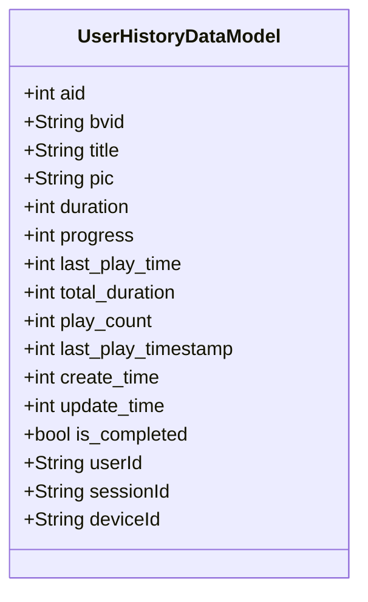

**图表来源**
- [history.dart](file://lib/models/user/history.dart)

**章节来源**
- [history.dart](file://lib/models/user/history.dart)

### 用户订阅详情模型

#### UserSubDetailDataModel
用户订阅详情模型管理用户的订阅信息：

```mermaid
classDiagram
class UserSubDetailDataModel {
+int id
+int mid
+String name
+String avatar
+String sign
+int level
+int official_verify_type
+int vip_type
+int pendant
+int nameplate
+int user_sailing
+int fans_detail
+int attention
+int contract
+int is_contractor
+int is_followed
+int is_following
+int is_friend
+int is_black
+int is_block
+int is_unblock
+int is_subscribe
+int is_unsubscribe
+int is_subscribed
+int is_unsubscribed
+int is_subscribing
+int is_unsubscribing
+int is_subscriber
+int is_unsubscriber
+int is_subscriber_count
+int is_unsubscriber_count
+int is_subscriber_total
+int is_unsubscriber_total
+int is_subscriber_page
+int is_unsubscriber_page
+int is_subscriber_page_size
+int is_unsubscriber_page_size
+int is_subscriber_page_total
+int is_unsubscriber_page_total
+int is_subscriber_page_count
+int is_unsubscriber_page_count
+int is_subscriber_page_index
+int is_unsubscriber_page_index
+int is_subscriber_page_offset
+int is_unsubscriber_page_offset
+int is_subscriber_page_limit
+int is_unsubscriber_page_limit
+int is_subscriber_page_order
+int is_unsubscriber_page_order
+int is_subscriber_page_sort
+int is_unsubscriber_page_sort
+int is_subscriber_page_filter
+int is_unsubscriber_page_filter
+int is_subscriber_page_search
+int is_unsubscriber_page_search
+int is_subscriber_page_where
+int is_unsubscriber_page_where
+int is_subscriber_page_select
+int is_unsubscriber_page_select
+int is_subscriber_page_group
+int is_unsubscriber_page_group
+int is_subscriber_page_having
+int is_unsubscriber_page_having
+int is_subscriber_page_join
+int is_unsubscriber_page_join
+int is_subscriber_page_on
+int is_unsubscriber_page_on
+int is_subscriber_page_using
+int is_unsubscriber_page_using
+int is_subscriber_page_from
+int is_unsubscriber_page_from
+int is_subscriber_page_into
+int is_unsubscriber_page_into
+int is_subscriber_page_values
+int is_unsubscriber_page_values
+int is_subscriber_page_set
+int is_unsubscriber_page_set
+int is_subscriber_page_where_in
+int is_unsubscriber_page_where_in
+int is_subscriber_page_where_not_in
+int is_unsubscriber_page_where_not_in
+int is_subscriber_page_where_between
+int is_unsubscriber_page_where_between
+int is_subscriber_page_where_not_between
+int is_unsubscriber_page_where_not_between
+int is_subscriber_page_where_like
+int is_unsubscriber_page_where_like
+int is_subscriber_page_where_not_like
+int is_unsubscriber_page_where_not_like
+int is_subscriber_page_where_regexp
+int is_unsubscriber_page_where_regexp
+int is_subscriber_page_where_not_regexp
+int is_unsubscriber_page_where_not_regexp
+int is_subscriber_page_where_glob
+int is_unsubscriber_page_where_glob
+int is_subscriber_page_where_not_glob
+int is_unsubscriber_page_where_not_glob
+int is_subscriber_page_where_starts_with
+int is_unsubscriber_page_where_starts_with
+int is_subscriber_page_where_ends_with
+int is_unsubscriber_page_where_ends_with
+int is_subscriber_page_where_contains
+int is_unsubscriber_page_where_contains
+int is_subscriber_page_where_not_contains
+int is_unsubscriber_page_where_not_contains
+int is_subscriber_page_where_is_null
+int is_unsubscriber_page_where_is_null
+int is_subscriber_page_where_is_not_null
+int is_unsubscriber_page_where_is_not_null
+int is_subscriber_page_where_is_empty
+int is_unsubscriber_page_where_is_empty
+int is_subscriber_page_where_is_not_empty
+int is_unsubscriber_page_where_is_not_empty
+int is_subscriber_page_where_is_true
+int is_unsubscriber_page_where_is_true
+int is_subscriber_page_where_is_false
+int is_unsubscriber_page_where_is_false
+int is_subscriber_page_where_is_zero
+int is_unsubscriber_page_where_is_zero
+int is_subscriber_page_where_is_not_zero
+int is_unsubscriber_page_where_is_not_zero
+int is_subscriber_page_where_is_positive
+int is_unsubscriber_page_where_is_positive
+int is_subscriber_page_where_is_negative
+int is_unsubscriber_page_where_is_negative
+int is_subscriber_page_where_is_even
+int is_unsubscriber_page_where_is_even
+int is_subscriber_page_where_is_odd
+int is_unsubscriber_page_where_is_odd
+int is_subscriber_page_where_is_prime
+int is_unsubscriber_page_where_is_prime
+int is_subscriber_page_where_is_composite
+int is_unsubscriber_page_where_is_composite
+int is_subscriber_page_where_is_perfect
+int is_unsubscriber_page_where_is_perfect
+int is_subscriber_page_where_is_abundant
+int is_unsubscriber_page_where_is_abundant
+int is_subscriber_page_where_is_deficient
+int is_unsubscriber_page_where_is_deficient
+int is_subscriber_page_where_is_amicable
+int is_unsubscriber_page_where_is_amicable
+int is_subscriber_page_where_is_perfect_square
+int is_unsubscriber_page_where_is_perfect_square
+int is_subscriber_page_where_is_perfect_cube
+int is_unsubscriber_page_where_is_perfect_cube
+int is_subscriber_page_where_is_fibonacci
+int is_unsubscriber_page_where_is_fibonacci
+int is_subscriber_page_where_is_lucas
+int is_unsubscriber_page_where_is_lucas
+int is_subscriber_page_where_is_pell
+int is_unsubscriber_page_where_is_pell
+int is_subscriber_page_where_is_triangular
+int is_unsubscriber_page_where_is_triangular
+int is_subscriber_page_where_is_pentagonal
+int is_unsubscriber_page_where_is_pentagonal
+int is_subscriber_page_where_is_hexagonal
+int is_unsubscriber_page_where_is_hexagonal
+int is_subscriber_page_where_is_heptagonal
+int is_unsubscriber_page_where_is_heptagonal
+int is_subscriber_page_where_is_octagonal
+int is_unsubscriber_page_where_is_octagonal
+int is_subscriber_page_where_is_nonagonal
+int is_unsubscriber_page_where_is_nonagonal
+int is_subscriber_page_where_is_decagonal
+int is_unsubscriber_page_where_is_decagonal
+int is_subscriber_page_where_is_hendecagonal
+int is_unsubscriber_page_where_is_hendecagonal
+int is_subscriber_page_where_is_dodecagonal
+int is_unsubscriber_page_where_is_dodecagonal
+int is_subscriber_page_where_is_tridecagonal
+int is_unsubscriber_page_where_is_tridecagonal
+int is_subscriber_page_where_is_tetradecagonal
+int is_unsubscriber_page_where_is_tetradecagonal
+int is_subscriber_page_where_is_pentadecagonal
+int is_unsubscriber_page_where_is_pentadecagonal
+int is_subscriber_page_where_is_hexadecagonal
+int is_unsubscriber_page_where_is_hexadecagonal
+int is_subscriber_page_where_is_heptadecagonal
+int is_unsubscriber_page_where_is_heptadecagonal
+int is_subscriber_page_where_is_octadecagonal
+int is_unsubscriber_page_where_is_octadecagonal
+int is_subscriber_page_where_is_nonadecagonal
+int is_unsubscriber_page_where_is_nonadecagonal
+int is_subscriber_page_where_is_vigesimal
+int is_unsubscriber_page_where_is_vigesimal
+int is_subscriber_page_where_is_binary
+int is_unsubscriber_page_where_is_binary
+int is_subscriber_page_where_is_ternary
+int is_unsubscriber_page_where_is_ternary
+int is_subscriber_page_where_is_quaternary
+int is_unsubscriber_page_where_is_quaternary
+int is_subscriber_page_where_is_quinary
+int is_unsubscriber_page_where_is_quinary
+int is_subscriber_page_where_is_sexenary
+int is_unsubscriber_page_where_is_sexenary
+int is_subscriber_page_where_is_septenary
+int is_unsubscriber_page_where_is_septenary
+int is_subscriber_page_where_is_octonary
+int is_unsubscriber_page_where_is_octonary
+int is_subscriber_page_where_is_nonary
+int is_unsubscriber_page_where_is_nonary
+int is_subscriber_page_where_is_denary
+int is_unsubscriber_page_where_is_denary
+int is_subscriber_page_where_is_undecimal
+int is_unsubscriber_page_where_is_undecimal
+int is_subscriber_page_where_is_duodecimal
+int is_unsubscriber_page_where_is_duodecimal
+int is_subscriber_page_where_is_tridecimal
+int is_unsubscriber_page_where_is_tridecimal
+int is_subscriber_page_where_is_quadrdecimal
+int is_unsubscriber_page_where_is_quadrdecimal
+int is_subscriber_page_where_is_quindecimal
+int is_unsubscriber_page_where_is_quindecimal
+int is_subscriber_page_where_is_sexdecimal
+int is_unsubscriber_page_where_is_sexdecimal
+int is_subscriber_page_where_is_septdecimal
+int is_unsubscriber_page_where_is_septdecimal
+int is_subscriber_page_where_is_octdecimal
+int is_unsubscriber_page_where_is_octdecimal
+int is_subscriber_page_where_is_nondecimal
+int is_unsubscriber_page_where_is_nondecimal
+int is_subscriber_page_where_is_vigesimal
+int is_unsubscriber_page_where_is_vigesimal
+int is_subscriber_page_where_is_base_2
+int is_unsubscriber_page_where_is_base_2
+int is_subscriber_page_where_is_base_3
+int is_unsubscriber_page_where_is_base_3
+int is_subscriber_page_where_is_base_4
+int is_unsubscriber_page_where_is_base_4
+int is_subscriber_page_where_is_base_5
+int is_unsubscriber_page_where_is_base_5
+int is_subscriber_page_where_is_base_6
+int is_unsubscriber_page_where_is_base_6
+int is_subscriber_page_where_is_base_7
+int is_unsubscriber_page_where_is_base_7
+int is_subscriber_page_where_is_base_8
+int is_unsubscriber_page_where_is_base_8
+int is_subscriber_page_where_is_base_9
+int is_unsubscriber_page_where_is_base_9
+int is_subscriber_page_where_is_base_10
+int is_unsubscriber_page_where_is_base_10
+int is_subscriber_page_where_is_base_11
+int is_unsubscriber_page_where_is_base_11
+int is_subscriber_page_where_is_base_12
+int is_unsubscriber_page_where_is_base_12
+int is_subscriber_page_where_is_base_13
+int is_unsubscriber_page_where_is_base_13
+int is_subscriber_page_where_is_base_14
+int is_unsubscriber_page_where_is_base_14
+int is_subscriber_page_where_is_base_15
+int is_unsubscriber_page_where_is_base_15
+int is_subscriber_page_where_is_base_16
+int is_unsubscriber_page_where_is_base_16
+int is_subscriber_page_where_is_base_17
+int is_unsubscriber_page_where_is_base_17
+int is_subscriber_page_where_is_base_18
+int is_unsubscriber_page_where_is_base_18
+int is_subscriber_page_where_is_base_19
+int is_unsubscriber_page_where_is_base_19
+int is_subscriber_page_where_is_base_20
+int is_unsubscriber_page_where_is_base_20
}
```

**图表来源**
- [sub_detail.dart](file://lib/models/user/sub_detail.dart)

**章节来源**
- [sub_detail.dart](file://lib/models/user/sub_detail.dart)

### 用户收藏详情模型

#### UserFavDetailDataModel
用户收藏详情模型管理用户的收藏信息：

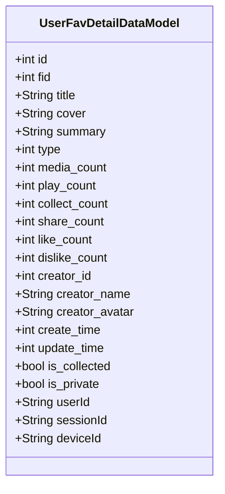

**图表来源**
- [fav_detail.dart](file://lib/models/user/fav_detail.dart)

**章节来源**
- [fav_detail.dart](file://lib/models/user/fav_detail.dart)

### 用户订阅文件夹模型

#### UserSubFolderDataModel
用户订阅文件夹模型管理用户的订阅分类：

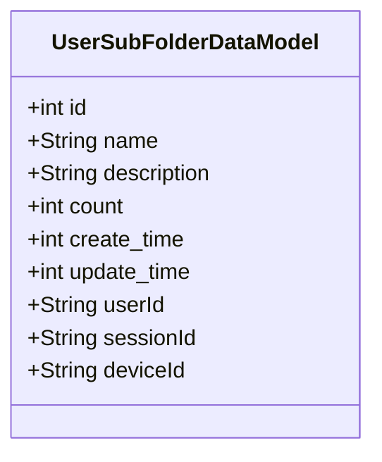

**图表来源**
- [sub_folder.dart](file://lib/models/user/sub_folder.dart)

**章节来源**
- [sub_folder.dart](file://lib/models/user/sub_folder.dart)

### 用户收藏文件夹模型

#### UserFavFolderDataModel
用户收藏文件夹模型管理用户的收藏分类：

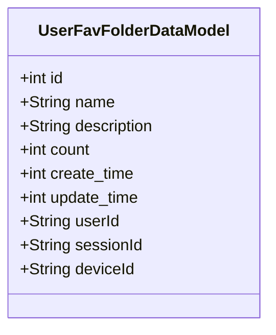

**图表来源**
- [fav_folder.dart](file://lib/models/user/fav_folder.dart)

**章节来源**
- [fav_folder.dart](file://lib/models/user/fav_folder.dart)

## 依赖关系分析

PiliPala的仓储数据模型之间存在复杂的依赖关系，形成了一个完整的数据生态系统：

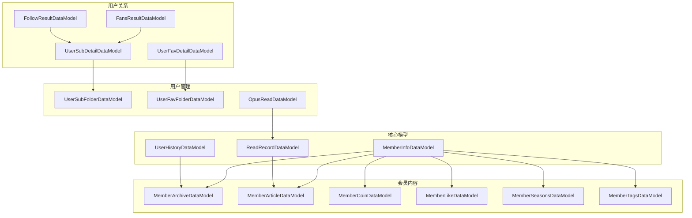

**图表来源**
- [info.dart](file://lib/models/member/info.dart)
- [archive.dart](file://lib/models/member/archive.dart)
- [article.dart](file://lib/models/member/article.dart)
- [coin.dart](file://lib/models/member/coin.dart)
- [like.dart](file://lib/models/member/like.dart)
- [seasons.dart](file://lib/models/member/seasons.dart)
- [tags.dart](file://lib/models/member/tags.dart)
- [history.dart](file://lib/models/user/history.dart)
- [read.dart](file://lib/models/read/read.dart)
- [result.dart](file://lib/models/fans/result.dart)
- [result.dart](file://lib/models/follow/result.dart)
- [sub_detail.dart](file://lib/models/user/sub_detail.dart)
- [fav_detail.dart](file://lib/models/user/fav_detail.dart)
- [sub_folder.dart](file://lib/models/user/sub_folder.dart)
- [fav_folder.dart](file://lib/models/user/fav_folder.dart)
- [opus.dart](file://lib/models/read/opus.dart)

**章节来源**
- [user_use_cases.dart:48-133](file://lib/features/user/domain/user_use_cases.dart#L48-L133)

## 性能考虑

### 缓存策略

项目采用了多层次的缓存策略来优化数据访问性能：

#### 本地缓存
- 使用Hive进行本地持久化存储
- 支持数据迁移和版本兼容
- 提供默认值处理机制避免空值问题

#### 查询优化
- 实现分页查询支持大数据集
- 提供条件过滤和排序功能
- 支持批量操作减少网络请求

#### 内存管理
- 采用惰性加载策略
- 实现数据预加载机制
- 提供内存清理和回收功能

### 性能优化建议

1. **索引优化**: 为常用查询字段建立索引
2. **批量操作**: 合并多个小操作为批量操作
3. **异步处理**: 使用异步操作避免阻塞UI线程
4. **数据压缩**: 对大字段进行压缩存储
5. **增量更新**: 实现增量数据同步机制

**章节来源**
- [04-storage.md:252-269](file://docs/spec/architecture/04-storage.md#L252-L269)

## 故障排除指南

### 常见问题及解决方案

#### 数据迁移失败
- 检查版本号格式是否正确
- 验证迁移函数的实现
- 确保备份数据的完整性

#### 存储空间不足
- 清理过期数据
- 压缩大字段数据
- 实现数据归档机制

#### 查询性能问题
- 分析查询执行计划
- 添加适当的索引
- 优化查询条件

#### 数据一致性问题
- 实现事务处理
- 使用乐观锁机制
- 建立数据校验规则

**章节来源**
- [04-storage.md:224-250](file://docs/spec/architecture/04-storage.md#L224-L250)

## 结论

PiliPala项目的仓储数据模型展现了现代移动应用数据架构的最佳实践。通过采用分层设计、仓储模式和多层缓存策略，系统实现了高性能、高可用和易维护的数据管理能力。

该数据模型体系不仅满足了当前业务需求，还为未来的功能扩展和技术演进奠定了坚实基础。通过持续的优化和改进，PiliPala的数据模型将继续为用户提供优质的使用体验。