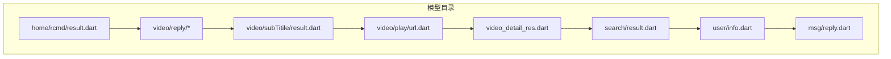
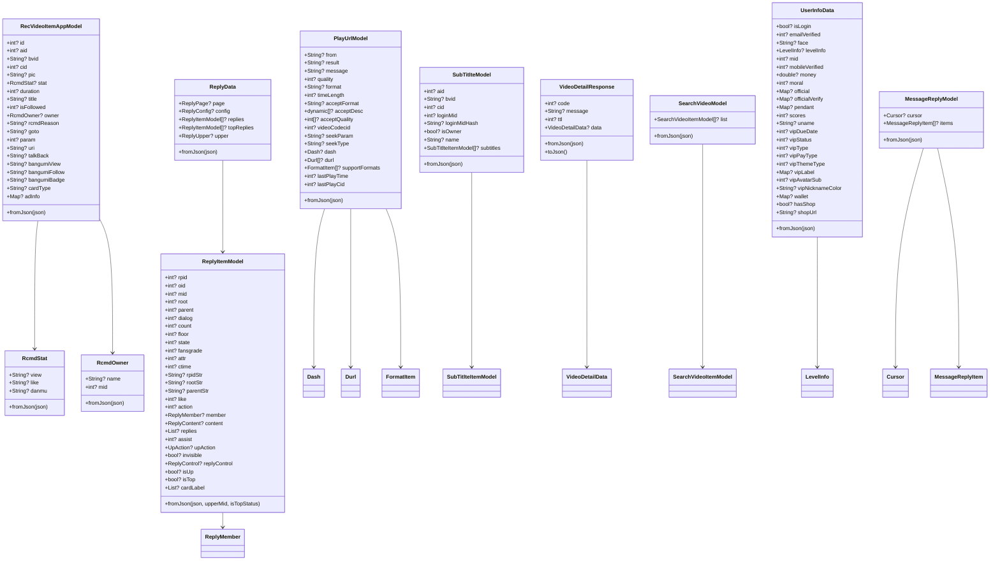
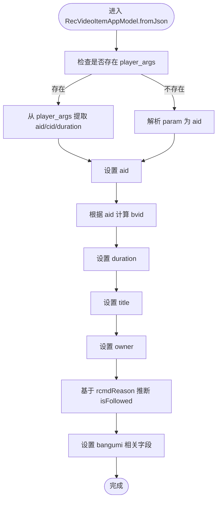
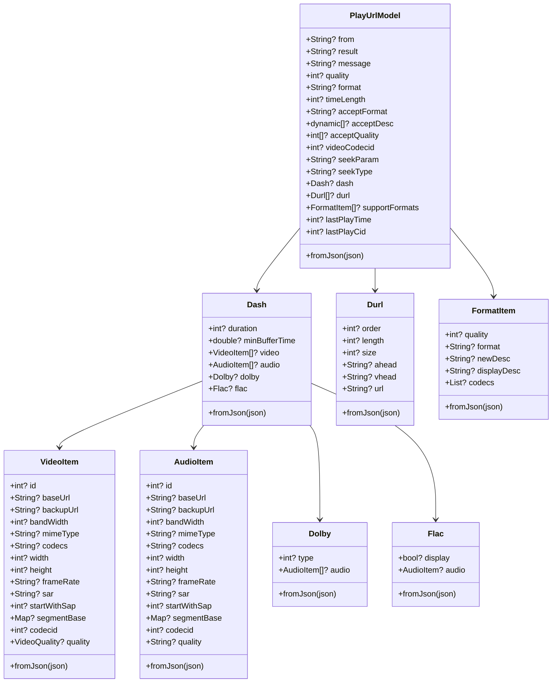
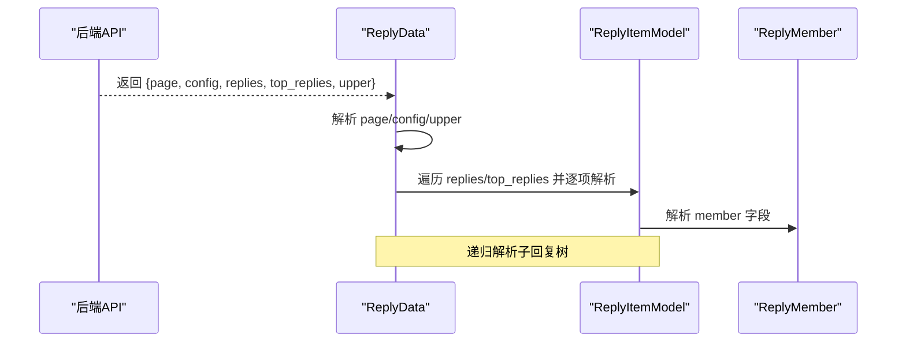
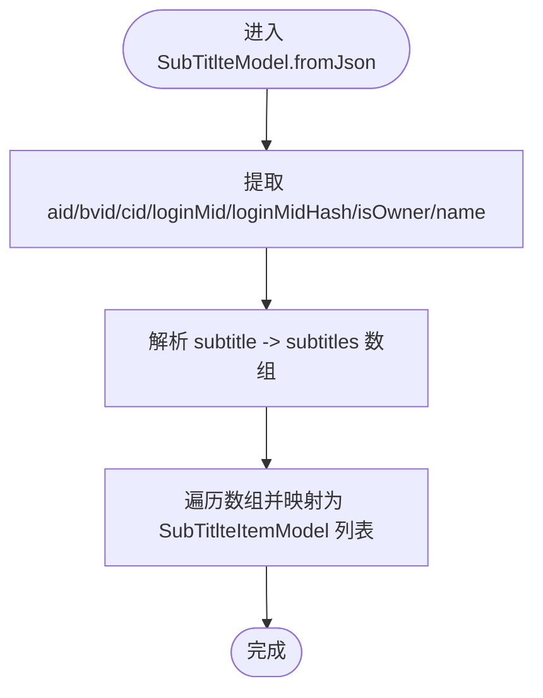
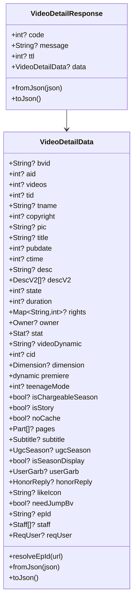
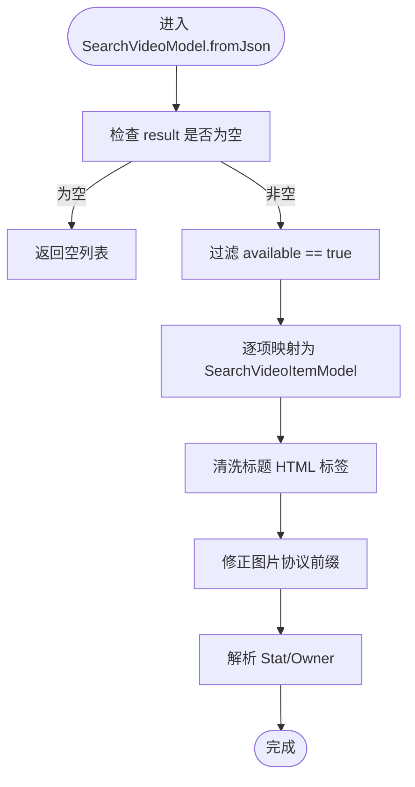
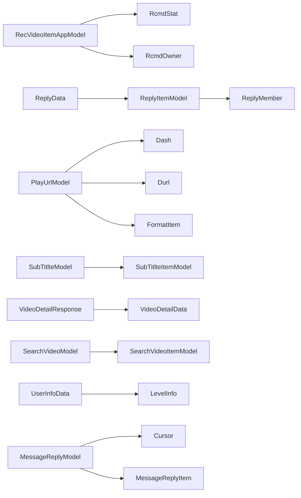

# 响应数据模型

<cite>
**本文档引用的文件**
- [lib/models/home/rcmd/result.dart](file://lib/models/home/rcmd/result.dart)
- [lib/models/video/reply/data.dart](file://lib/models/video/reply/data.dart)
- [lib/models/video/reply/item.dart](file://lib/models/video/reply/item.dart)
- [lib/models/video/reply/member.dart](file://lib/models/video/reply/member.dart)
- [lib/models/video/subTitile/result.dart](file://lib/models/video/subTitile/result.dart)
- [lib/models/video/play/url.dart](file://lib/models/video/play/url.dart)
- [lib/models/video_detail_res.dart](file://lib/models/video_detail_res.dart)
- [lib/models/search/result.dart](file://lib/models/search/result.dart)
- [lib/models/user/info.dart](file://lib/models/user/info.dart)
- [lib/models/msg/reply.dart](file://lib/models/msg/reply.dart)
</cite>

## 目录
1. [简介](#简介)
2. [项目结构](#项目结构)
3. [核心组件](#核心组件)
4. [架构总览](#架构总览)
5. [详细组件分析](#详细组件分析)
6. [依赖分析](#依赖分析)
7. [性能考虑](#性能考虑)
8. [故障排除指南](#故障排除指南)
9. [结论](#结论)
10. [附录](#附录)

## 简介
本文件系统性梳理 PiliPala 的响应数据模型，覆盖推荐结果、播放信息、评论回复、字幕数据、视频详情、搜索结果、用户信息与消息回复等关键 API 响应。文档从数据结构、嵌套关系、字段定义与类型、解析流程、错误处理、与前端组件映射以及缓存与性能优化等方面进行深入说明，帮助开发者快速理解并正确使用各响应模型。

## 项目结构
模型文件主要位于 lib/models 目录下，按功能域分层组织：
- 推荐结果：home/rcmd/result.dart
- 视频评论：video/reply/*
- 字幕数据：video/subTitile/result.dart
- 播放信息：video/play/url.dart
- 视频详情：video_detail_res.dart
- 搜索结果：search/result.dart
- 用户信息：user/info.dart
- 消息回复：msg/reply.dart

**图表来源**
- [lib/models/home/rcmd/result.dart:1-135](file://lib/models/home/rcmd/result.dart#L1-L135)
- [lib/models/video/reply/data.dart:1-41](file://lib/models/video/reply/data.dart#L1-L41)
- [lib/models/video/subTitile/result.dart:1-82](file://lib/models/video/subTitile/result.dart#L1-L82)
- [lib/models/video/play/url.dart:1-282](file://lib/models/video/play/url.dart#L1-L282)
- [lib/models/video_detail_res.dart:1-732](file://lib/models/video_detail_res.dart#L1-L732)
- [lib/models/search/result.dart:1-466](file://lib/models/search/result.dart#L1-L466)
- [lib/models/user/info.dart:1-137](file://lib/models/user/info.dart#L1-L137)
- [lib/models/msg/reply.dart:1-169](file://lib/models/msg/reply.dart#L1-L169)

**章节来源**
- [lib/models/home/rcmd/result.dart:1-135](file://lib/models/home/rcmd/result.dart#L1-L135)
- [lib/models/video/reply/data.dart:1-41](file://lib/models/video/reply/data.dart#L1-L41)
- [lib/models/video/subTitile/result.dart:1-82](file://lib/models/video/subTitile/result.dart#L1-L82)
- [lib/models/video/play/url.dart:1-282](file://lib/models/video/play/url.dart#L1-L282)
- [lib/models/video_detail_res.dart:1-732](file://lib/models/video_detail_res.dart#L1-L732)
- [lib/models/search/result.dart:1-466](file://lib/models/search/result.dart#L1-L466)
- [lib/models/user/info.dart:1-137](file://lib/models/user/info.dart#L1-L137)
- [lib/models/msg/reply.dart:1-169](file://lib/models/msg/reply.dart#L1-L169)

## 核心组件
- 推荐结果模型：RecVideoItemAppModel、RcmdStat、RcmdOwner、RcmdReason
- 评论回复模型：ReplyData、ReplyItemModel、ReplyMember、ReplyControl、UpAction
- 字幕数据模型：SubTitlteModel、SubTitlteItemModel
- 播放信息模型：PlayUrlModel、Dash、VideoItem、AudioItem、Durl、Dolby、Flac、FormatItem
- 视频详情模型：VideoDetailResponse、VideoDetailData 及其子模型
- 搜索结果模型：SearchVideoModel、SearchUserModel、SearchLiveModel、SearchMBangumiModel、SearchArticleModel 及各自条目模型
- 用户信息模型：UserInfoData、LevelInfo
- 消息回复模型：MessageReplyModel、Cursor、MessageReplyItem、ReplyContentItem、ReplyUser

**章节来源**
- [lib/models/home/rcmd/result.dart:3-135](file://lib/models/home/rcmd/result.dart#L3-L135)
- [lib/models/video/reply/data.dart:7-41](file://lib/models/video/reply/data.dart#L7-L41)
- [lib/models/video/reply/item.dart:4-160](file://lib/models/video/reply/item.dart#L4-L160)
- [lib/models/video/reply/member.dart:1-70](file://lib/models/video/reply/member.dart#L1-L70)
- [lib/models/video/subTitile/result.dart:1-82](file://lib/models/video/subTitile/result.dart#L1-L82)
- [lib/models/video/play/url.dart:3-282](file://lib/models/video/play/url.dart#L3-L282)
- [lib/models/video_detail_res.dart:3-732](file://lib/models/video_detail_res.dart#L3-L732)
- [lib/models/search/result.dart:4-466](file://lib/models/search/result.dart#L4-L466)
- [lib/models/user/info.dart:5-137](file://lib/models/user/info.dart#L5-L137)
- [lib/models/msg/reply.dart:1-169](file://lib/models/msg/reply.dart#L1-L169)

## 架构总览
响应模型遵循统一的 JSON 到 Dart 对象映射模式：每个模型类提供构造函数与 fromJson 工厂方法，用于将后端返回的 Map<String, dynamic> 转换为强类型对象；同时提供 toJson 方法以便序列化。复杂嵌套结构通过子模型类进一步拆分，提升可维护性与可测试性。

**图表来源**
- [lib/models/home/rcmd/result.dart:3-135](file://lib/models/home/rcmd/result.dart#L3-L135)
- [lib/models/video/reply/data.dart:7-41](file://lib/models/video/reply/data.dart#L7-L41)
- [lib/models/video/reply/item.dart:4-160](file://lib/models/video/reply/item.dart#L4-L160)
- [lib/models/video/play/url.dart:3-282](file://lib/models/video/play/url.dart#L3-L282)
- [lib/models/video/subTitile/result.dart:1-82](file://lib/models/video/subTitile/result.dart#L1-L82)
- [lib/models/video_detail_res.dart:3-732](file://lib/models/video_detail_res.dart#L3-L732)
- [lib/models/search/result.dart:4-466](file://lib/models/search/result.dart#L4-L466)
- [lib/models/user/info.dart:5-137](file://lib/models/user/info.dart#L5-L137)
- [lib/models/msg/reply.dart:1-169](file://lib/models/msg/reply.dart#L1-L169)

## 详细组件分析

### 推荐结果模型
- RecVideoItemAppModel
  - 关键字段：id、aid、bvid、cid、pic、stat、duration、title、isFollowed、owner、rcmdReason、goto、param、uri、talkBack、bangumiView、bangumiFollow、bangumiBadge、cardType、adInfo
  - 解析逻辑要点：
    - 使用 player_args 中 aid/cid/duration 进行优先解析
    - bvid 通过 aid 计算转换
    - isFollowed 基于 rcmdReason 文本匹配“已关注/新关注”推断
    - bangumi 场景下的角标与关注信息来自特定字段
  - 复杂度：O(1) 初始化与字段映射
  - 错误处理：对缺失字段提供默认值，避免空指针
- RcmdStat：封面左/右文本映射为播放量、弹幕数等
- RcmdOwner：根据 goto 类型选择 up 名称来源
- RcmdReason：推荐原因文本

**图表来源**
- [lib/models/home/rcmd/result.dart:50-89](file://lib/models/home/rcmd/result.dart#L50-L89)

**章节来源**
- [lib/models/home/rcmd/result.dart:3-135](file://lib/models/home/rcmd/result.dart#L3-L135)

### 播放信息模型
- PlayUrlModel
  - 字段：from、result、message、quality、format、timeLength、acceptFormat、acceptDesc、acceptQuality、videoCodecid、seekParam、seekType、dash、durl、supportFormats、lastPlayTime、lastPlayCid
  - 复杂嵌套：Dash、VideoItem、AudioItem、Durl、Dolby、Flac、FormatItem
  - 解析要点：
    - dash/audio/video 子结构按需解析
    - acceptQuality 映射为整型列表
    - lastPlayTime/lastPlayCid 用于续播
- Dash：时长、最小缓冲时间、音视频轨道、杜比与无损音频
- VideoItem/AudioItem：基础地址、备份地址、带宽、MIME、编解码、分辨率、帧率、质量枚举映射
- Durl：分段播放参数
- Dolby/Flac：音效类型与音频轨道
- FormatItem：支持格式描述

**图表来源**
- [lib/models/video/play/url.dart:3-282](file://lib/models/video/play/url.dart#L3-L282)

**章节来源**
- [lib/models/video/play/url.dart:3-282](file://lib/models/video/play/url.dart#L3-L282)

### 评论回复模型
- ReplyData：聚合 page、config、replies、topReplies、upper
- ReplyItemModel：评论主干字段、成员信息、内容、回复树、控制信息、UP 主标记、置顶标记
- ReplyMember：用户标识、昵称、签名、头像、等级、挂件、官方认证、VIP、粉丝详情、帆船样式
- ReplyControl：UP 回复、置顶、点赞、显示开关、入口文案、标题文案、时间描述、位置
- UpAction：UP 点赞/回复状态

**图表来源**
- [lib/models/video/reply/data.dart:22-39](file://lib/models/video/reply/data.dart#L22-L39)
- [lib/models/video/reply/item.dart:65-103](file://lib/models/video/reply/item.dart#L65-L103)
- [lib/models/video/reply/member.dart:25-38](file://lib/models/video/reply/member.dart#L25-L38)

**章节来源**
- [lib/models/video/reply/data.dart:7-41](file://lib/models/video/reply/data.dart#L7-L41)
- [lib/models/video/reply/item.dart:4-160](file://lib/models/video/reply/item.dart#L4-L160)
- [lib/models/video/reply/member.dart:1-70](file://lib/models/video/reply/member.dart#L1-L70)

### 字幕数据模型
- SubTitlteModel：包含 aid/bvid/cid/loginMid/loginMidHash/isOwner/name/subtitles
- SubTitlteItemModel：字幕条目，包含 id、语言、语言说明、锁定状态、URL、类型、AI 类型/状态、标题、内容占位、体节占位
- 解析要点：将 subtitle 字段中的 subtitles 数组映射为子模型列表；语言字段标准化处理

**图表来源**
- [lib/models/video/subTitile/result.dart:22-35](file://lib/models/video/subTitile/result.dart#L22-L35)

**章节来源**
- [lib/models/video/subTitile/result.dart:1-82](file://lib/models/video/subTitile/result.dart#L1-L82)

### 视频详情模型
- VideoDetailResponse：顶层响应容器，包含 code/message/ttl/data
- VideoDetailData：视频主体数据，包含 bvid/aid/videos/tid/tname/copyright/pic/title/pubdate/ctime/desc/descV2/state/duration/rights/owner/stat/videoDynamic/cid/dimension/premiere/teenageMode/isChargeableSeason/isStory/noCache/pages/subtitle/ugcSeason/isSeasonDisplay/userGarb/honorReply/likeIcon/needJumpBv/epId/staff/reqUser
- 子模型：DescV2、Dimension、HonorReply/Honor、Owner、Part、Stat、Subtitle、UserGarb、UgcSeason/SectionItem/EpisodeItem、Staff/Vip、ReqUser
- 解析要点：对嵌套列表与对象进行条件解析；对 redirect_url 提取 epId；对权限、维度、分P、字幕、荣誉、用户装饰、人员、请求用户等进行细粒度建模

**图表来源**
- [lib/models/video_detail_res.dart:3-218](file://lib/models/video_detail_res.dart#L3-L218)

**章节来源**
- [lib/models/video_detail_res.dart:3-732](file://lib/models/video_detail_res.dart#L3-L732)

### 搜索结果模型
- SearchVideoModel/SearchVideoItemModel：过滤可用结果、清洗标题、修正图片协议、解析统计与 UP 主
- Stat/Owner：播放、弹幕、收藏、评论、点赞与作者信息
- SearchUserModel/SearchUserItemModel：用户搜索结果，含粉丝数、视频数、等级、性别、直播状态、房间号等
- SearchLiveModel/SearchLiveItemModel：直播搜索结果，含在线人数、标签、分类名、封面等
- SearchMBangumiModel/SearchMBangumiItemModel：番剧搜索结果，含媒体 ID、标题、CV、工作人员、季信息、评分等
- SearchArticleModel/SearchArticleItemModel：专栏搜索结果，含发布时间、点赞、图片、分类等

**图表来源**
- [lib/models/search/result.dart:7-14](file://lib/models/search/result.dart#L7-L14)

**章节来源**
- [lib/models/search/result.dart:4-466](file://lib/models/search/result.dart#L4-L466)

### 用户信息模型
- UserInfoData：登录态、头像、等级、UID、邮箱/手机验证、资产、积分、昵称、VIP 信息、钱包、店铺等
- LevelInfo：当前等级、经验区间、下一等级所需经验
- 解析要点：对数值类型进行类型兼容处理（如 money 由 int/double 统一为 double）

**章节来源**
- [lib/models/user/info.dart:5-137](file://lib/models/user/info.dart#L5-L137)

### 消息回复模型
- MessageReplyModel：游标与消息项列表
- Cursor：游标 ID、是否结束、时间戳
- MessageReplyItem：计数、ID、多条标志、内容项、回复时间、用户
- ReplyContentItem：业务类型、标题、描述、图片、URI、Native URI、详情标题、根/源/目标回复内容、AT/话题详情、按钮隐藏状态、点赞状态、弹幕、消息
- ReplyUser：用户 MID、粉丝数、昵称、头像、链接、关注状态

**章节来源**
- [lib/models/msg/reply.dart:1-169](file://lib/models/msg/reply.dart#L1-L169)

## 依赖分析
- 模型间依赖关系清晰，采用组合而非继承，降低耦合度
- 子模型独立性强，便于单元测试与复用
- fromJson 与 toJson 成对出现，保证序列化一致性

**图表来源**
- [lib/models/home/rcmd/result.dart:3-135](file://lib/models/home/rcmd/result.dart#L3-L135)
- [lib/models/video/reply/data.dart:7-41](file://lib/models/video/reply/data.dart#L7-L41)
- [lib/models/video/play/url.dart:3-282](file://lib/models/video/play/url.dart#L3-L282)
- [lib/models/video/subTitile/result.dart:1-82](file://lib/models/video/subTitile/result.dart#L1-L82)
- [lib/models/video_detail_res.dart:3-732](file://lib/models/video_detail_res.dart#L3-L732)
- [lib/models/search/result.dart:4-466](file://lib/models/search/result.dart#L4-L466)
- [lib/models/user/info.dart:5-137](file://lib/models/user/info.dart#L5-L137)
- [lib/models/msg/reply.dart:1-169](file://lib/models/msg/reply.dart#L1-L169)

**章节来源**
- [lib/models/home/rcmd/result.dart:3-135](file://lib/models/home/rcmd/result.dart#L3-L135)
- [lib/models/video/reply/data.dart:7-41](file://lib/models/video/reply/data.dart#L7-L41)
- [lib/models/video/play/url.dart:3-282](file://lib/models/video/play/url.dart#L3-L282)
- [lib/models/video/subTitile/result.dart:1-82](file://lib/models/video/subTitile/result.dart#L1-L82)
- [lib/models/video_detail_res.dart:3-732](file://lib/models/video_detail_res.dart#L3-L732)
- [lib/models/search/result.dart:4-466](file://lib/models/search/result.dart#L4-L466)
- [lib/models/user/info.dart:5-137](file://lib/models/user/info.dart#L5-L137)
- [lib/models/msg/reply.dart:1-169](file://lib/models/msg/reply.dart#L1-L169)

## 性能考虑
- 解析效率
  - 尽量在 fromJson 中做一次性映射，避免重复计算
  - 对 acceptQuality 等列表字段使用 map 转换一次完成
- 内存占用
  - 大型列表（如 replies/topReplies）建议延迟加载或分页
  - 对仅展示用的冗余字段（如 content/body 占位）在解析后及时清理
- 缓存策略
  - 针对推荐结果与搜索结果：按关键词/页面缓存响应，结合 TTL 控制失效
  - 针对播放信息：缓存最近一次选清的 quality/format，减少重复解析
  - 针对视频详情：按 bvid/aid 缓存，结合本地数据库存储 lastPlayTime/lastPlayCid
  - 针对字幕：按 cid 缓存字幕列表，按语言键缓存具体字幕内容
  - 针对用户信息：按 mid 缓存 UserInfoData，结合本地持久化
- 网络与渲染
  - 图片与视频资源采用懒加载与占位图
  - 评论树渲染采用虚拟列表或分页加载
- 错误恢复
  - 对缺失字段提供默认值，避免崩溃
  - 对网络异常与解析异常进行捕获与重试

[本节为通用性能指导，不直接分析具体文件]

## 故障排除指南
- 常见问题
  - 字段缺失：在 fromJson 中对可空字段提供默认值，避免空指针
  - 数据类型不一致：对数值字段进行类型转换（如 money 由 int/double 统一）
  - 嵌套解析失败：先解析父对象，再解析子对象，确保判空
  - 语言与标题清洗：使用正则或工具函数清洗 HTML 标签与特殊字符
- 定位方法
  - 在 fromJson 开始处打印关键字段，确认后端返回结构
  - 对复杂嵌套结构分步解析，逐步缩小范围
- 修复建议
  - 为每个模型提供 toString 或 toLog 方法辅助调试
  - 对关键字段增加边界检查与日志记录

**章节来源**
- [lib/models/search/result.dart:81-101](file://lib/models/search/result.dart#L81-L101)
- [lib/models/user/info.dart:91-109](file://lib/models/user/info.dart#L91-L109)

## 结论
PiliPala 的响应数据模型以清晰的层次化设计与完善的 JSON 映射机制为基础，覆盖推荐、播放、评论、字幕、详情、搜索、用户与消息等核心场景。通过合理的字段定义、嵌套结构与解析流程，模型既满足前端展示需求，又具备良好的扩展性与可维护性。配合缓存与性能优化策略，可在保证用户体验的同时提升整体性能。

[本节为总结性内容，不直接分析具体文件]

## 附录
- 前端组件映射建议
  - 推荐卡片：RecVideoItemAppModel → 视频卡片组件
  - 播放器：PlayUrlModel → 清晰度/格式选择器、Dash/Audio 分轨
  - 评论区：ReplyData → 评论列表、回复树、UP 标记、置顶标记
  - 字幕：SubTitlteModel → 字幕切换器、字幕加载器
  - 视频详情：VideoDetailData → 标题/封面/描述/分P/字幕/荣誉/UP 主信息
  - 搜索结果：SearchVideoModel/SearchUserModel/SearchLiveModel → 不同类型卡片
  - 用户信息：UserInfoData → 个人资料、等级、VIP、资产
  - 消息回复：MessageReplyModel → 消息列表、内容项渲染

[本节为概念性内容，不直接分析具体文件]