# 弹幕数据模型

<cite>
**本文档引用的文件**
- [dm.proto](file://lib/models/danmaku/dm.proto)
- [dm.pb.dart](file://lib/models/danmaku/dm.pb.dart)
- [dm.pbjson.dart](file://lib/models/danmaku/dm.pbjson.dart)
- [dm.pbenum.dart](file://lib/models/danmaku/dm.pbenum.dart)
</cite>

## 目录
1. [简介](#简介)
2. [项目结构](#项目结构)
3. [核心组件](#核心组件)
4. [架构概览](#架构概览)
5. [详细组件分析](#详细组件分析)
6. [依赖关系分析](#依赖关系分析)
7. [性能考虑](#性能考虑)
8. [故障排除指南](#故障排除指南)
9. [结论](#结论)

## 简介

PiliPala弹幕系统基于B站官方弹幕协议设计，采用Protocol Buffers进行数据序列化和反序列化。该系统提供了完整的弹幕生命周期管理，包括弹幕获取、解析、渲染和存储等功能。

弹幕数据模型支持多种弹幕类型（普通弹幕、顶部弹幕、底部弹幕、滚动弹幕等），并具备智能云屏蔽、弹幕配置管理、互动弹幕等功能特性。

## 项目结构

弹幕相关文件位于`lib/models/danmaku/`目录下，包含以下核心文件：

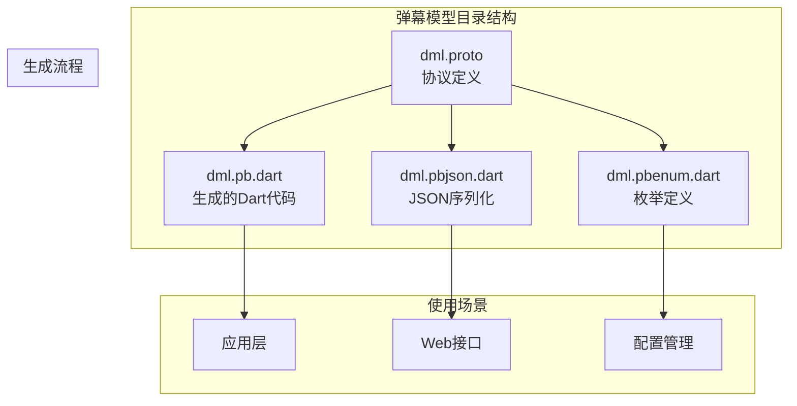

**图表来源**
- [dm.proto:1-893](file://lib/models/danmaku/dm.proto#L1-L893)
- [dm.pb.dart:1-10195](file://lib/models/danmaku/dm.pb.dart#L1-L10195)
- [dm.pbjson.dart:1-2319](file://lib/models/danmaku/dm.pbjson.dart#L1-L2319)
- [dm.pbenum.dart:1-348](file://lib/models/danmaku/dm.pbenum.dart#L1-L348)

**章节来源**
- [dm.proto:1-893](file://lib/models/danmaku/dm.proto#L1-L893)
- [dm.pb.dart:1-10195](file://lib/models/danmaku/dm.pb.dart#L1-L10195)

## 核心组件

### 弹幕元素模型

弹幕系统的核心数据结构是`DanmakuElem`，它包含了弹幕的所有基本信息：

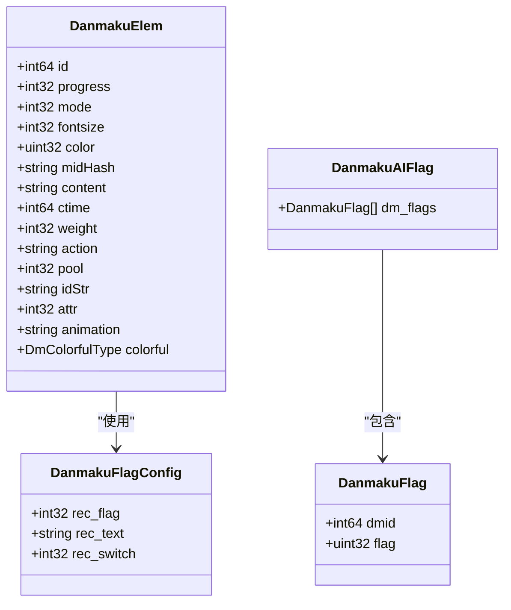

**图表来源**
- [dm.proto:196-229](file://lib/models/danmaku/dm.proto#L196-L229)
- [dm.proto:231-247](file://lib/models/danmaku/dm.proto#L231-L247)
- [dm.proto:190-194](file://lib/models/danmaku/dm.proto#L190-L194)

### 弹幕配置系统

弹幕配置系统分为默认配置和用户配置两个层次：

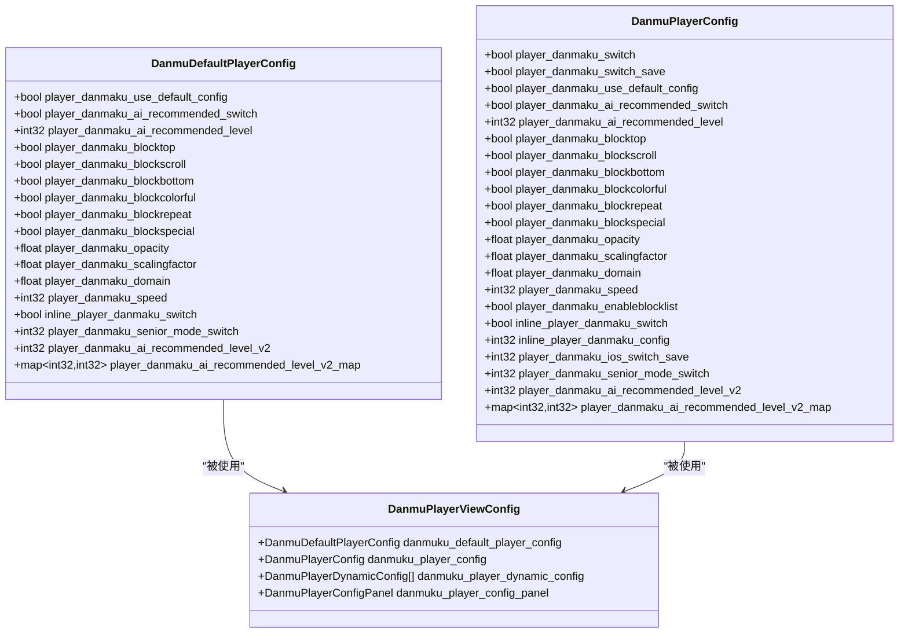

**图表来源**
- [dm.proto:249-268](file://lib/models/danmaku/dm.proto#L249-L268)
- [dm.proto:270-294](file://lib/models/danmaku/dm.proto#L270-L294)
- [dm.proto:310-320](file://lib/models/danmaku/dm.proto#L310-L320)

**章节来源**
- [dm.proto:196-294](file://lib/models/danmaku/dm.proto#L196-L294)

## 架构概览

弹幕系统采用分层架构设计，从底层的数据模型到上层的应用逻辑：

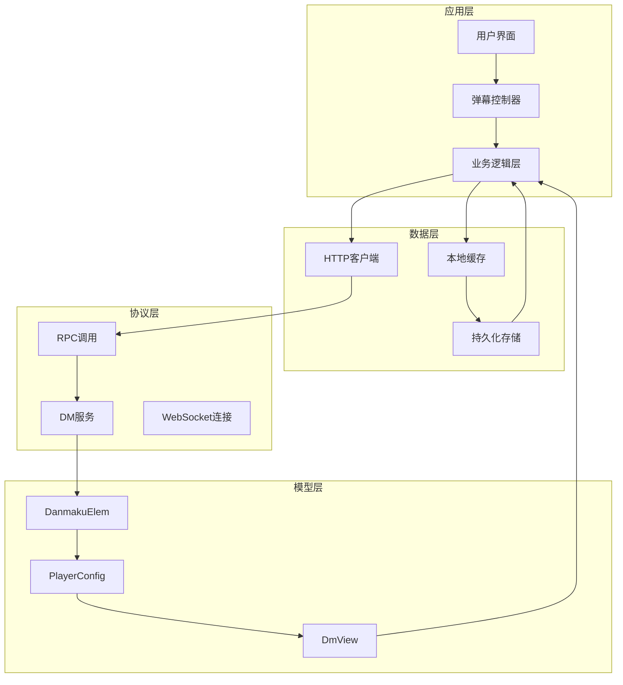

**图表来源**
- [dm.proto:9-22](file://lib/models/danmaku/dm.proto#L9-L22)
- [dm.pb.dart:1-10195](file://lib/models/danmaku/dm.pb.dart#L1-L10195)

## 详细组件分析

### 弹幕消息格式

弹幕消息格式遵循B站官方协议规范，支持多种弹幕类型和样式配置：

#### 弹幕类型定义

| 类型编号 | 弹幕类型 | 描述 |
|---------|---------|------|
| 1 | 普通弹幕 | 基础滚动弹幕 |
| 2 | 普通弹幕 | 基础滚动弹幕 |
| 3 | 普通弹幕 | 基础滚动弹幕 |
| 4 | 顶部弹幕 | 顶部固定弹幕 |
| 5 | 底部弹幕 | 底部固定弹幕 |
| 6 | 逆向弹幕 | 反向滚动弹幕 |
| 7 | 高级弹幕 | 高级动画弹幕 |
| 8 | 代码弹幕 | 特殊代码格式 |
| 9 | BAS弹幕 | 特殊弹幕池 |

#### 弹幕样式配置

弹幕样式通过多个参数控制：

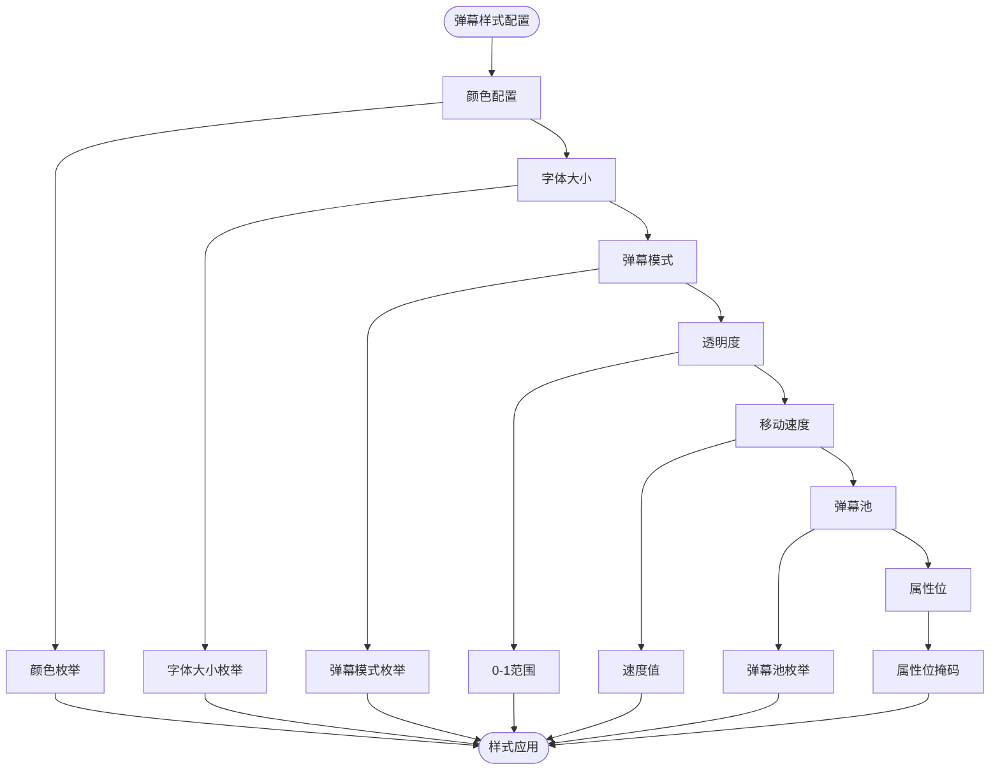

**图表来源**
- [dm.proto:196-229](file://lib/models/danmaku/dm.proto#L196-L229)
- [dm.proto:350-354](file://lib/models/danmaku/dm.proto#L350-L354)

### 弹幕发送和接收机制

弹幕系统支持多种获取方式：

#### 分段弹幕获取

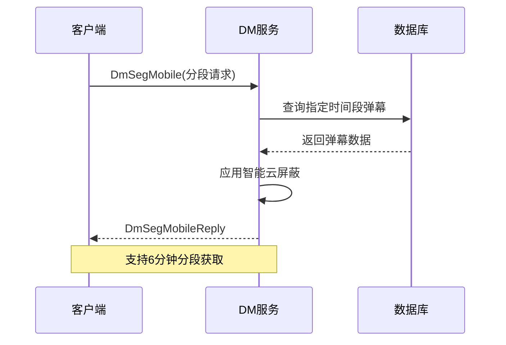

**图表来源**
- [dm.proto:411-444](file://lib/models/danmaku/dm.proto#L411-L444)

#### 弹幕元数据获取

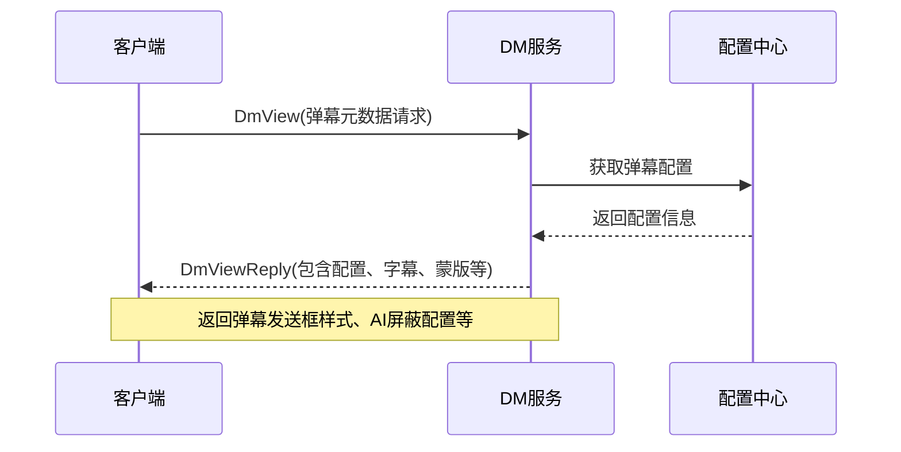

**图表来源**
- [dm.proto:490-546](file://lib/models/danmaku/dm.proto#L490-L546)

### 弹幕序列化和反序列化

系统提供多种序列化格式支持：

#### Protocol Buffers序列化

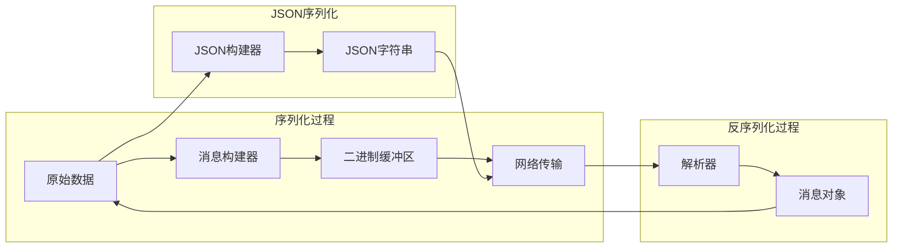

**图表来源**
- [dm.pb.dart:67-72](file://lib/models/danmaku/dm.pb.dart#L67-L72)
- [dm.pbjson.dart:1-800](file://lib/models/danmaku/dm.pbjson.dart#L1-L800)

#### 生成的Dart代码结构

生成的Dart代码包含以下主要类：

| 类名 | 用途 | 特性 |
|------|------|------|
| DanmakuElem | 弹幕元素 | 核心弹幕数据结构 |
| DanmuPlayerConfig | 用户弹幕配置 | 用户自定义配置 |
| DanmuDefaultPlayerConfig | 默认弹幕配置 | 系统默认配置 |
| DanmakuAIFlag | AI云屏蔽配置 | 智能屏蔽规则 |
| DmSegMobileReply | 分段弹幕响应 | 弹幕数据容器 |
| DmViewReply | 弹幕元数据响应 | 配置和元数据 |

**章节来源**
- [dm.pb.dart:1690-1751](file://lib/models/danmaku/dm.pb.dart#L1690-L1751)
- [dm.pb.dart:4730-4771](file://lib/models/danmaku/dm.pb.dart#L4730-L4771)
- [dm.pb.dart:5554-5602](file://lib/models/danmaku/dm.pb.dart#L5554-L5602)

### 弹幕生命周期管理

弹幕生命周期包括创建、验证、渲染、存储和清理等阶段：

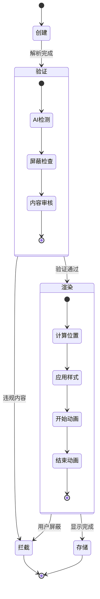

**图表来源**
- [dm.proto:190-247](file://lib/models/danmaku/dm.proto#L190-L247)
- [dm.proto:411-421](file://lib/models/danmaku/dm.proto#L411-L421)

### 实时传输和存储策略

#### 实时传输

弹幕系统支持实时传输机制：

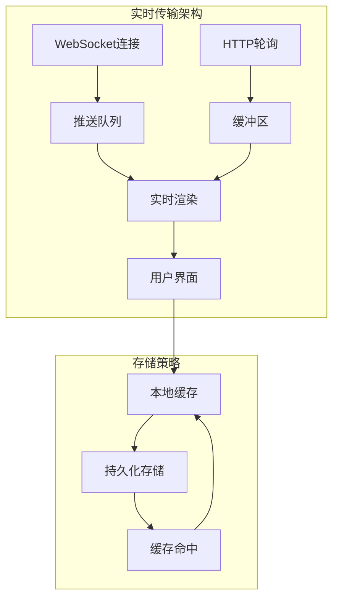

**图表来源**
- [dm.proto:9-22](file://lib/models/danmaku/dm.proto#L9-L22)
- [dm.pb.dart:1-10195](file://lib/models/danmaku/dm.pb.dart#L1-L10195)

## 依赖关系分析

弹幕系统各组件之间的依赖关系如下：

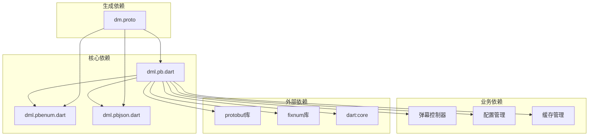

**图表来源**
- [dm.proto:1-893](file://lib/models/danmaku/dm.proto#L1-L893)
- [dm.pb.dart:8-16](file://lib/models/danmaku/dm.pb.dart#L8-L16)
- [dm.pbenum.dart:1-348](file://lib/models/danmaku/dm.pbenum.dart#L1-L348)

**章节来源**
- [dm.pb.dart:1-10195](file://lib/models/danmaku/dm.pb.dart#L1-L10195)
- [dm.pbenum.dart:1-348](file://lib/models/danmaku/dm.pbenum.dart#L1-L348)

## 性能考虑

### 序列化性能优化

1. **Protocol Buffers优势**
   - 二进制格式，体积小
   - 零拷贝访问
   - 流式处理支持

2. **内存管理**
   - 使用PbList减少内存分配
   - 对象池复用
   - 按需加载

### 渲染性能优化

1. **弹幕渲染优化**
   - 弹幕池管理
   - 重叠检测算法
   - 虚拟化渲染

2. **网络传输优化**
   - 分段加载
   - 增量更新
   - 压缩传输

### 存储性能优化

1. **缓存策略**
   - LRU缓存
   - 分层缓存
   - 预加载机制

2. **数据库优化**
   - 索引优化
   - 批量操作
   - 连接池管理

## 故障排除指南

### 常见问题及解决方案

#### 弹幕解析错误

**问题症状**：弹幕无法正常显示或解析失败

**可能原因**：
- 协议版本不匹配
- 数据格式异常
- 编码问题

**解决步骤**：
1. 检查协议版本兼容性
2. 验证数据完整性
3. 确认编码格式

#### 性能问题

**问题症状**：弹幕渲染卡顿或延迟

**可能原因**：
- 弹幕数量过多
- 渲染复杂度过高
- 内存不足

**优化建议**：
1. 实施弹幕限流
2. 简化渲染逻辑
3. 增加内存管理

#### 网络问题

**问题症状**：弹幕加载失败或超时

**可能原因**：
- 网络连接不稳定
- 服务器负载过高
- 防火墙阻拦

**解决措施**：
1. 实施重连机制
2. 优化请求频率
3. 配置代理设置

**章节来源**
- [dm.pb.dart:67-72](file://lib/models/danmaku/dm.pb.dart#L67-L72)
- [dm.pbjson.dart:1-800](file://lib/models/danmaku/dm.pbjson.dart#L1-L800)

## 结论

PiliPala弹幕数据模型基于成熟的Protocol Buffers技术栈，提供了完整而高效的弹幕处理能力。系统设计充分考虑了性能、可扩展性和用户体验，在保证功能完整性的同时实现了良好的运行效率。

通过分层架构设计和模块化组件组织，弹幕系统具备了良好的可维护性和扩展性，能够适应未来业务发展的需求。同时，完善的序列化机制和缓存策略确保了系统的高性能运行。