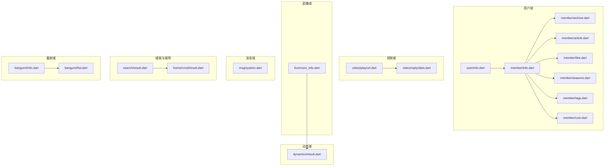
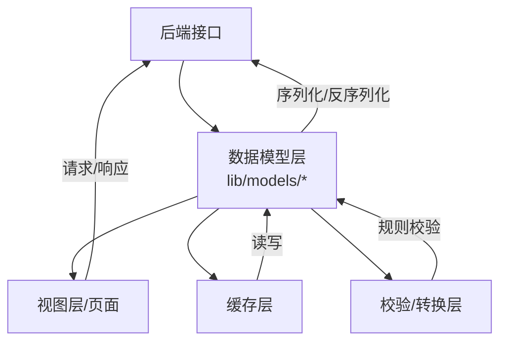
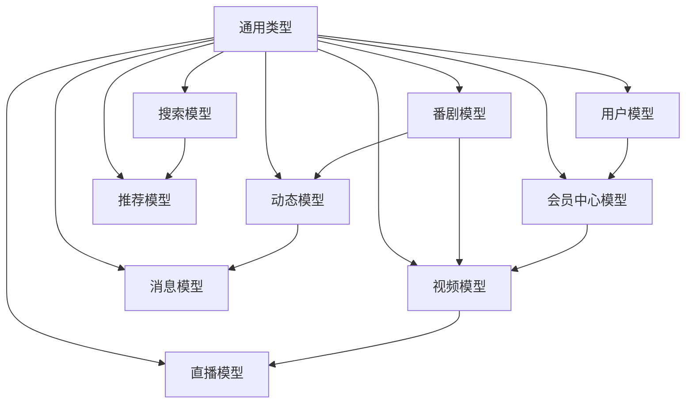

# 数据模型

<cite>
**本文引用的文件**
- [lib/models/user/info.dart](file://lib/models/user/info.dart)
- [lib/models/member/info.dart](file://lib/models/member/info.dart)
- [lib/models/video/play/url.dart](file://lib/models/video/play/url.dart)
- [lib/models/live/room_info.dart](file://lib/models/live/room_info.dart)
- [lib/models/dynamics/result.dart](file://lib/models/dynamics/result.dart)
- [lib/models/video/reply/data.dart](file://lib/models/video/reply/data.dart)
- [lib/models/msg/system.dart](file://lib/models/msg/system.dart)
- [lib/models/fans/result.dart](file://lib/models/fans/result.dart)
- [lib/models/follow/result.dart](file://lib/models/follow/result.dart)
- [lib/models/search/result.dart](file://lib/models/search/result.dart)
- [lib/models/home/rcmd/result.dart](file://lib/models/home/rcmd/result.dart)
- [lib/models/read/read.dart](file://lib/models/read/read.dart)
- [lib/models/read/opus.dart](file://lib/models/read/opus.dart)
- [lib/models/model_hot_video_item.dart](file://lib/models/model_hot_video_item.dart)
- [lib/models/model_rec_video_item.dart](file://lib/models/model_rec_video_item.dart)
- [lib/models/video_detail_res.dart](file://lib/models/video_detail_res.dart)
- [lib/models/bangumi/info.dart](file://lib/models/bangumi/info.dart)
- [lib/models/bangumi/list.dart](file://lib/models/bangumi/list.dart)
- [lib/models/member/archive.dart](file://lib/models/member/archive.dart)
- [lib/models/member/article.dart](file://lib/models/member/article.dart)
- [lib/models/member/like.dart](file://lib/models/member/like.dart)
- [lib/models/member/seasons.dart](file://lib/models/member/seasons.dart)
- [lib/models/member/tags.dart](file://lib/models/member/tags.dart)
- [lib/models/member/coin.dart](file://lib/models/member/coin.dart)
- [lib/models/common/index.dart](file://lib/models/common/index.dart)
- [lib/models/common/business_type.dart](file://lib/models/common/business_type.dart)
- [lib/models/common/action_type.dart](file://lib/models/common/action_type.dart)
- [lib/models/common/rank_type.dart](file://lib/models/common/rank_type.dart)
- [lib/models/common/theme_type.dart](file://lib/models/common/theme_type.dart)
- [lib/models/common/color_type.dart](file://lib/models/common/color_type.dart)
- [lib/models/common/tab_type.dart](file://lib/models/common/tab_type.dart)
- [lib/models/common/search_type.dart](file://lib/models/common/search_type.dart)
- [lib/models/common/dynamic_badge_mode.dart](file://lib/models/common/dynamic_badge_mode.dart)
- [lib/models/common/dynamics_type.dart](file://lib/models/common/dynamics_type.dart)
- [lib/models/common/reply_sort_type.dart](file://lib/models/common/reply_sort_type.dart)
- [lib/models/common/reply_type.dart](file://lib/models/common/reply_type.dart)
- [lib/models/common/video_episode_type.dart](file://lib/models/common/video_episode_type.dart)
- [lib/models/common/gesture_mode.dart](file://lib/models/common/gesture_mode.dart)
- [lib/models/common/nav_bar_config.dart](file://lib/models/common/nav_bar_config.dart)
- [lib/models/common/rcmd_type.dart](file://lib/models/common/rcmd_type.dart)
- [lib/models/common/gesture_mode.dart](file://lib/models/common/gesture_mode.dart)
- [lib/models/common/nav_bar_config.dart](file://lib/models/common/nav_bar_config.dart)
- [lib/models/common/rank_type.dart](file://lib/models/common/rank_type.dart)
- [lib/models/common/rcmd_type.dart](file://lib/models/common/rcmd_type.dart)
- [lib/models/common/search_type.dart](file://lib/models/common/search_type.dart)
- [lib/models/common/tab_type.dart](file://lib/models/common/tab_type.dart)
- [lib/models/common/theme_type.dart](file://lib/models/common/theme_type.dart)
- [lib/models/common/color_type.dart](file://lib/models/common/color_type.dart)
- [lib/models/common/dynamic_badge_mode.dart](file://lib/models/common/dynamic_badge_mode.dart)
- [lib/models/common/dynamics_type.dart](file://lib/models/common/dynamics_type.dart)
- [lib/models/common/reply_sort_type.dart](file://lib/models/common/reply_sort_type.dart)
- [lib/models/common/reply_type.dart](file://lib/models/common/reply_type.dart)
- [lib/models/common/video_episode_type.dart](file://lib/models/common/video_episode_type.dart)
- [lib/models/common/gesture_mode.dart](file://lib/models/common/gesture_mode.dart)
- [lib/models/common/nav_bar_config.dart](file://lib/models/common/nav_bar_config.dart)
- [lib/models/common/business_type.dart](file://lib/models/common/business_type.dart)
- [lib/models/common/action_type.dart](file://lib/models/common/action_type.dart)
- [lib/models/common/rank_type.dart](file://lib/models/common/rank_type.dart)
- [lib/models/common/theme_type.dart](file://lib/models/common/theme_type.dart)
- [lib/models/common/color_type.dart](file://lib/models/common/color_type.dart)
- [lib/models/common/tab_type.dart](file://lib/models/common/tab_type.dart)
- [lib/models/common/search_type.dart](file://lib/models/common/search_type.dart)
- [lib/models/common/dynamic_badge_mode.dart](file://lib/models/common/dynamic_badge_mode.dart)
- [lib/models/common/dynamics_type.dart](file://lib/models/common/dynamics_type.dart)
- [lib/models/common/reply_sort_type.dart](file://lib/models/common/reply_sort_type.dart)
- [lib/models/common/reply_type.dart](file://lib/models/common/reply_type.dart)
- [lib/models/common/video_episode_type.dart](file://lib/models/common/video_episode_type.dart)
- [lib/models/common/gesture_mode.dart](file://lib/models/common/gesture_mode.dart)
- [lib/models/common/nav_bar_config.dart](file://lib/models/common/nav_bar_config.dart)
- [lib/models/common/business_type.dart](file://lib/models/common/business_type.dart)
- [lib/models/common/action_type.dart](file://lib/models/common/action_type.dart)
- [lib/models/common/rank_type.dart](file://lib/models/common/rank_type.dart)
- [lib/models/common/theme_type.dart](file://lib/models/common/theme_type.dart)
- [lib/models/common/color_type.dart](file://lib/models/common/color_type.dart)
- [lib/models/common/tab_type.dart](file://lib/models/common/tab_type.dart)
- [lib/models/common/search_type.dart](file://lib/models/common/search_type.dart)
- [lib/models/common/dynamic_badge_mode.dart](file://lib/models/common/dynamic_badge_mode.dart)
- [lib/models/common/dynamics_type.dart](file://lib/models/common/dynamics_type.dart)
- [lib/models/common/reply_sort_type.dart](file://lib/models/common/reply_sort_type.dart)
- [lib/models/common/reply_type.dart](file://lib/models/common/reply_type.dart)
- [lib/models/common/video_episode_type.dart](file://lib/models/common/video_episode_type.dart)
- [lib/models/common/gesture_mode.dart](file://lib/models/common/gesture_mode.dart)
- [lib/models/common/nav_bar_config.dart](file://lib/models/common/nav_bar_config.dart)
- [lib/models/common/business_type.dart](file://lib/models/common/business_type.dart)
- [lib/models/common/action_type.dart](file://lib/models/common/action_type.dart)
- [lib/models/common/rank_type.dart](file://lib/models/common/rank_type.dart)
- [lib/models/common/theme_type.dart](file://lib/models/common/theme_type.dart)
- [lib/models/common/color_type.dart](file://lib/models/common/color_type.dart)
- [lib/models/common/tab_type.dart](file://lib/models/common/tab_type.dart)
- [lib/models/common/search_type.dart](file://lib/models/common/search_type.dart)
- [lib/models/common/dynamic_badge_mode.dart](file://lib/models/common/dynamic_badge_mode.dart)
- [lib/models/common/dynamics_type.dart](file://lib/models/common/dynamics_type.dart)
- [lib/models/common/reply_sort_type.dart](file://lib/models/common/reply_sort_type.dart)
- [lib/models/common/reply_type.dart](file://lib/models/common/reply_type.dart)
- [lib/models/common/video_episode_type.dart](file://lib/models/common/video_episode_type.dart)
- [lib/models/common/gesture_mode.dart](file://lib/models/common/gesture_mode.dart)
- [lib/models/common/nav_bar_config.dart](file://lib/models/common/nav_bar_config.dart)
- [lib/models/common/business_type.dart](file://lib/models/common/business_type.dart)
- [lib/models/common/action_type.dart](file://lib/models/common/action_type.dart)
- [lib/models/common/rank_type.dart](file://lib/models/common/rank_type.dart)
- [lib/models/common/theme_type.dart](file://lib/models/common/theme_type.dart)
- [lib/models/common/color_type.dart](file://lib/models/common/color_type.dart)
- [lib/models/common/tab_type.dart](file://lib/models/common/tab_type.dart)
- [lib/models/common/search_type.dart](file://lib/models/common/search_type.dart)
- [lib/models/common/dynamic_badge_mode.dart](file://lib/models/common/dynamic_badge_mode.dart)
- [lib/models/common/dynamics_type.dart](file://lib/models/common/dynamics_type.dart)
- [lib/models/common/reply_sort_type.dart](file://lib/models/common/reply_sort_type.dart)
- [lib/models/common/reply_type.dart](file://lib/models/common/reply_type.dart)
- [lib/models/common/video_episode_type.dart](file://lib/models/common/video_episode_type.dart)
- [lib/models/common/gesture_mode.dart](file://lib/models/common/gesture_mode.dart)
- [lib/models/common/nav_bar_config.dart](file://lib/models/common/nav_bar_config.dart)
- [lib/models/common/business_type.dart](file://lib/models/common/business_type.dart)
- [lib/models/common/action_type.dart](file://lib/models/common/action_type.dart)
- [lib/models/common/rank_type.dart](file://lib/models/common/rank_type.dart)
- [lib/models/common/theme_type.dart](file://lib/models/common/theme_type.dart)
- [lib/models/common/color_type.dart](file://lib/models/common/color_type.dart)
- [lib/models/common/tab_type.dart](file://lib/models/common/tab_type.dart)
- [lib/models/common/search_type.dart](file://lib/models/common/search_type.dart)
- [lib/models/common/dynamic_badge_mode.dart](file://lib/models/common/dynamic_badge_mode.dart)
- [lib/models/common/dynamics_type.dart](file://lib/models/common/dynamics_type.dart)
- [lib/models/common/reply_sort_type.dart](file://lib/models/common/reply_sort_type.dart)
- [lib/models/common/reply_type.dart](file://lib/models/common/reply_type.dart)
- [lib/models/common/video_episode_type.dart](file://lib/models/common/video_episode_type.dart)
- [lib/models/common/gesture_mode.dart](file://lib/models/common/gesture_mode.dart)
- [lib/models/common/nav_bar_config.dart](file://lib/models/common/nav_bar_config.dart)
- [lib/models/common/business_type.dart](file://lib/models/common/business_type.dart)
- [lib/models/common/action_type.dart](file://lib/models/common/action_type.dart)
- [lib/models/common/rank_type.dart](file://lib/models/common/rank_type.dart)
- [lib/models/common/theme_type.dart](file://lib/models/common/theme_type.dart)
- [lib/models/common/color_type.dart](file://lib/models/common/color_type.dart)
- [lib/models/common/tab_type.dart](file://lib/models/common/tab_type.dart)
- [lib/models/common/search_type.dart](file://lib/models/common/search_type.dart)
- [lib/models/common/dynamic_badge_mode.dart](file://lib/models/common/dynamic_badge_mode.dart)
- [lib/models/common/dynamics_type.dart](file://lib/models/common/dynamics_type.dart)
- [lib/models/common/reply_sort_type.dart](file://lib/models/common/reply_sort_type.dart)
- [lib/models/common/reply_type.dart](file://lib/models/common/reply_type.dart)
- [lib/models/common/video_episode_type.dart](file://lib/models/common/video_episode_type.dart)
- [lib/models/common/gesture_mode.dart](file://lib/models/common/gesture_mode.dart)
......
</cite>

## 目录
1. [简介](#简介)
2. [项目结构](#项目结构)
3. [核心组件](#核心组件)
4. [架构总览](#架构总览)
5. [详细组件分析](#详细组件分析)
6. [依赖分析](#依赖分析)
7. [性能考虑](#性能考虑)
8. [故障排查指南](#故障排查指南)
9. [结论](#结论)
10. [附录](#附录)

## 简介
本文件系统性梳理 PiliPala 的数据模型体系，覆盖用户、视频、直播、动态、消息、搜索、推荐、番剧与会员中心等模块。重点说明各模型的字段定义、数据类型、业务含义与约束；给出模型间的关系图、继承与组合关系；阐述 JSON 序列化/反序列化实现方式与校验策略；并提供生命周期管理、缓存策略与性能优化建议，帮助开发者正确使用与扩展数据模型。

## 项目结构
数据模型主要位于 lib/models 目录下，按功能域划分子目录（如 user、video、live、dynamics、member、msg、search、home/rcmd、bangumi 等），并在 common 子目录中沉淀通用枚举与类型。典型文件组织如下：
- 用户域：user/info.dart、member/info.dart、member/archive.dart、member/article.dart、member/like.dart、member/seasons.dart、member/tags.dart、member/coin.dart
- 视频域：video/play/url.dart、video/reply/data.dart、video/subTitile/*、video/ai.dart、video/later.dart
- 直播域：live/room_info.dart、live/follow.dart、live/item.dart、live/message.dart、live/quality.dart、live/room_info_h5.dart
- 动态域：dynamics/result.dart、dynamics/up.dart
- 消息域：msg/system.dart、msg/account.dart、msg/like.dart、msg/reply.dart、msg/session.dart
- 搜索与推荐：search/all.dart、search/hot.dart、search/result.dart、search/suggest.dart、home/rcmd/result.dart
- 番剧域：bangumi/info.dart、bangumi/list.dart
- 通用类型：common/*（枚举与类型）

图表来源
- [lib/models/user/info.dart](file://lib/models/user/info.dart)
- [lib/models/member/info.dart](file://lib/models/member/info.dart)
- [lib/models/member/archive.dart](file://lib/models/member/archive.dart)
- [lib/models/member/article.dart](file://lib/models/member/article.dart)
- [lib/models/member/like.dart](file://lib/models/member/like.dart)
- [lib/models/member/seasons.dart](file://lib/models/member/seasons.dart)
- [lib/models/member/tags.dart](file://lib/models/member/tags.dart)
- [lib/models/member/coin.dart](file://lib/models/member/coin.dart)
- [lib/models/video/play/url.dart](file://lib/models/video/play/url.dart)
- [lib/models/video/reply/data.dart](file://lib/models/video/reply/data.dart)
- [lib/models/live/room_info.dart](file://lib/models/live/room_info.dart)
- [lib/models/dynamics/result.dart](file://lib/models/dynamics/result.dart)
- [lib/models/search/result.dart](file://lib/models/search/result.dart)
- [lib/models/home/rcmd/result.dart](file://lib/models/home/rcmd/result.dart)
- [lib/models/bangumi/info.dart](file://lib/models/bangumi/info.dart)
- [lib/models/bangumi/list.dart](file://lib/models/bangumi/list.dart)
- [lib/models/msg/system.dart](file://lib/models/msg/system.dart)

章节来源
- [lib/models/user/info.dart](file://lib/models/user/info.dart)
- [lib/models/member/info.dart](file://lib/models/member/info.dart)
- [lib/models/video/play/url.dart](file://lib/models/video/play/url.dart)
- [lib/models/live/room_info.dart](file://lib/models/live/room_info.dart)
- [lib/models/dynamics/result.dart](file://lib/models/dynamics/result.dart)
- [lib/models/search/result.dart](file://lib/models/search/result.dart)
- [lib/models/home/rcmd/result.dart](file://lib/models/home/rcmd/result.dart)
- [lib/models/bangumi/info.dart](file://lib/models/bangumi/info.dart)
- [lib/models/bangumi/list.dart](file://lib/models/bangumi/list.dart)
- [lib/models/msg/system.dart](file://lib/models/msg/system.dart)

## 核心组件
本节从数据模型视角概述关键实体及其职责边界，并说明其在业务流程中的作用。

- 用户模型（user/info.dart）
  - 职责：描述平台用户的基本档案与状态信息，用于登录态、个人主页、关注/粉丝列表等场景。
  - 关键点：包含用户标识、基础资料、等级、头像、认证信息等字段；序列化/反序列化遵循标准 JSON 映射。

- 会员中心模型（member/*）
  - 职责：聚合用户在站内的创作与互动数据，如投稿视频、专栏文章、历史记录、收藏夹、标签、硬币分布等。
  - 关键点：archive（投稿列表）、article（专栏列表）、like（点赞合集）、seasons（追番列表）、tags（标签）、coin（投币记录）等，均以 JSON 字段映射实现。

- 视频播放模型（video/play/url.dart）
  - 职责：承载视频播放所需的清晰度、流地址、协议等信息，支撑播放器初始化与切换清晰度。
  - 关键点：包含播放质量选项、多路地址、切片参数等，序列化/反序列化严格对应后端返回结构。

- 直播房间模型（live/room_info.dart）
  - 职责：描述直播间的实时状态、分区、标题、在线人数、封面等，用于直播卡片与详情页。
  - 关键点：包含房间 ID、UID、直播状态、开始时间、分区名称、封面、标题等字段，支持嵌套 JSON 解析。

- 动态模型（dynamics/result.dart）
  - 职责：承载动态列表与动态主体内容，支持多种动态类型（视频、图文、直播等）的统一抽象。
  - 关键点：DynamicMajorModel 统一承载不同动态类型的主体内容，内部通过 JSON 嵌套解析实现。

- 消息系统模型（msg/system.dart）
  - 职责：承载系统通知、互动提醒等消息体，用于消息中心与推送展示。
  - 关键点：包含消息类型、标题、正文、跳转信息等字段，序列化/反序列化遵循后端规范。

- 搜索与推荐模型（search/result.dart、home/rcmd/result.dart）
  - 职责：承载搜索结果与首页推荐列表的数据结构，支撑搜索页与推荐页渲染。
  - 关键点：包含条目列表、分页信息、排序与过滤参数等，序列化/反序列化保持与接口一致。

- 番剧模型（bangumi/info.dart、bangumi/list.dart）
  - 职责：承载番剧信息与番剧列表，用于番剧页与专题页。
  - 关键点：包含番剧元数据、剧集列表、更新状态等字段，序列化/反序列化遵循接口约定。

章节来源
- [lib/models/user/info.dart](file://lib/models/user/info.dart)
- [lib/models/member/info.dart](file://lib/models/member/info.dart)
- [lib/models/member/archive.dart](file://lib/models/member/archive.dart)
- [lib/models/member/article.dart](file://lib/models/member/article.dart)
- [lib/models/member/like.dart](file://lib/models/member/like.dart)
- [lib/models/member/seasons.dart](file://lib/models/member/seasons.dart)
- [lib/models/member/tags.dart](file://lib/models/member/tags.dart)
- [lib/models/member/coin.dart](file://lib/models/member/coin.dart)
- [lib/models/video/play/url.dart](file://lib/models/video/play/url.dart)
- [lib/models/live/room_info.dart](file://lib/models/live/room_info.dart)
- [lib/models/dynamics/result.dart](file://lib/models/dynamics/result.dart)
- [lib/models/msg/system.dart](file://lib/models/msg/system.dart)
- [lib/models/search/result.dart](file://lib/models/search/result.dart)
- [lib/models/home/rcmd/result.dart](file://lib/models/home/rcmd/result.dart)
- [lib/models/bangumi/info.dart](file://lib/models/bangumi/info.dart)
- [lib/models/bangumi/list.dart](file://lib/models/bangumi/list.dart)

## 架构总览
数据模型层采用“按域分包 + 通用类型复用”的架构设计，域内模型通过统一的 JSON 序列化/反序列化机制与后端 API 对接，避免重复转换逻辑，提升可维护性与一致性。

## 详细组件分析

### 用户模型（user/info.dart）
- 字段与类型
  - 用户标识、昵称、头像、性别、等级、生日、地区、签名、认证信息等。
  - 类型涵盖字符串、整数、布尔、日期时间等。
- 业务含义
  - 支撑登录态、个人主页、关注/粉丝列表、互动场景中的用户展示。
- 约束条件
  - 部分字段可能为空或默认值；序列化时需处理空值与类型转换。
- 序列化/反序列化
  - 通过 Map<String, dynamic> 构造/生成对象，字段名与后端一致。
- 生命周期与缓存
  - 登录成功后写入本地缓存；退出登录或过期清理；与会话状态联动。
- 最佳实践
  - 使用不可变对象进行跨组件传递；对敏感字段做脱敏显示；统一空值处理。

章节来源
- [lib/models/user/info.dart](file://lib/models/user/info.dart)

### 会员中心模型族（member/*）
- 字段与类型
  - archive：投稿列表，包含标题、封面、播放量、时长、发布时间等。
  - article：专栏列表，包含标题、封面、字数、发布时间、点赞数等。
  - like：点赞合集，包含被点赞内容的元信息。
  - seasons：追番列表，包含番剧标题、封面、更新状态、进度等。
  - tags：标签列表，包含标签名、使用次数等。
  - coin：投币记录，包含 UP 主、视频、时间、数量等。
- 业务含义
  - 聚合用户创作与互动数据，支撑个人中心与数据分析。
- 约束条件
  - 列表字段可能为空；部分数值字段存在上限或单位换算。
- 序列化/反序列化
  - 采用标准 JSON 映射；注意字段命名与后端一致。
- 生命周期与缓存
  - 分页加载与增量更新；本地持久化以减少网络请求。
- 最佳实践
  - 对列表进行分页与去重；对时间字段统一时区处理；对数值字段做溢出保护。

章节来源
- [lib/models/member/info.dart](file://lib/models/member/info.dart)
- [lib/models/member/archive.dart](file://lib/models/member/archive.dart)
- [lib/models/member/article.dart](file://lib/models/member/article.dart)
- [lib/models/member/like.dart](file://lib/models/member/like.dart)
- [lib/models/member/seasons.dart](file://lib/models/member/seasons.dart)
- [lib/models/member/tags.dart](file://lib/models/member/tags.dart)
- [lib/models/member/coin.dart](file://lib/models/member/coin.dart)

### 视频播放模型（video/play/url.dart）
- 字段与类型
  - 清晰度选项、播放地址数组、切片参数、协议信息等。
- 业务含义
  - 为播放器提供多清晰度与多地址选择，保障流畅播放。
- 约束条件
  - 清晰度与地址需与当前账号权限匹配；部分地址可能过期。
- 序列化/反序列化
  - 严格遵循后端返回结构；对数值字段进行安全转换。
- 生命周期与缓存
  - 播放前预取；失败重试与降级；播放结束后释放资源。
- 最佳实践
  - 优先选择可用且稳定的地址；对地址有效期做监控与刷新。

章节来源
- [lib/models/video/play/url.dart](file://lib/models/video/play/url.dart)

### 直播房间模型（live/room_info.dart）
- 字段与类型
  - 房间 ID、UID、标题、封面、分区、在线人数、直播状态、开始时间等。
- 业务含义
  - 用于直播卡片、房间页与开播提醒。
- 约束条件
  - 在线人数与状态可能瞬时变化；封面与标题可能为空。
- 序列化/反序列化
  - 嵌套 JSON 解析；对数值字段进行容错处理。
- 生命周期与缓存
  - 心跳更新与离线清理；关注列表本地化。
- 最佳实践
  - 对异常状态做降级展示；对空字段做兜底处理。

章节来源
- [lib/models/live/room_info.dart](file://lib/models/live/room_info.dart)

### 动态模型（dynamics/result.dart）
- 字段与类型
  - 动态主体内容（视频、图文、直播等）的统一封装；包含动态类型、内容、话题、图片等。
- 业务含义
  - 支持动态列表与详情页渲染，统一处理多种动态类型。
- 约束条件
  - 不同动态类型字段差异较大；需要根据类型分支解析。
- 序列化/反序列化
  - DynamicMajorModel 统一入口；内部对嵌套 JSON 进行解析与转换。
- 生命周期与缓存
  - 列表分页与增量更新；本地缓存去重与合并。
- 最佳实践
  - 对不同类型动态做差异化渲染；对图片尺寸与格式做适配。

章节来源
- [lib/models/dynamics/result.dart](file://lib/models/dynamics/result.dart)

### 消息系统模型（msg/system.dart）
- 字段与类型
  - 消息类型、标题、正文、跳转链接、时间戳等。
- 业务含义
  - 用于消息中心与推送通知展示。
- 约束条件
  - 标题与正文长度限制；跳转链接有效性检查。
- 序列化/反序列化
  - 标准 JSON 映射；注意时间字段与时区处理。
- 生命周期与缓存
  - 已读未读状态管理；本地持久化与同步。
- 最佳实践
  - 对富文本内容做安全渲染；对链接做白名单校验。

章节来源
- [lib/models/msg/system.dart](file://lib/models/msg/system.dart)

### 搜索与推荐模型（search/result.dart、home/rcmd/result.dart）
- 字段与类型
  - 搜索结果列表、推荐条目、分页信息、排序参数等。
- 业务含义
  - 支撑搜索页与首页推荐页的数据展示。
- 约束条件
  - 列表可能为空；分页索引与大小需满足接口要求。
- 序列化/反序列化
  - 与接口返回结构一一对应；注意字段命名一致性。
- 生命周期与缓存
  - 搜索结果本地缓存；推荐位数据去重与限流。
- 最佳实践
  - 对关键词做清洗与归一化；对结果做二次过滤。

章节来源
- [lib/models/search/result.dart](file://lib/models/search/result.dart)
- [lib/models/home/rcmd/result.dart](file://lib/models/home/rcmd/result.dart)

### 番剧模型（bangumi/info.dart、bangumi/list.dart）
- 字段与类型
  - 番剧元数据、剧集列表、更新状态、评分等。
- 业务含义
  - 用于番剧专题页与追番管理。
- 约束条件
  - 剧集顺序与状态需与版权方保持一致。
- 序列化/反序列化
  - 标准 JSON 映射；注意时间与数值字段转换。
- 生命周期与缓存
  - 更新周期性拉取；本地缓存版本控制。
- 最佳实践
  - 对剧集做分页与懒加载；对评分做平滑处理。

章节来源
- [lib/models/bangumi/info.dart](file://lib/models/bangumi/info.dart)
- [lib/models/bangumi/list.dart](file://lib/models/bangumi/list.dart)

### 通用类型与枚举（common/*）
- 作用：统一业务语义与交互行为，降低耦合。
- 典型类型
  - 业务类型（business_type.dart）、操作类型（action_type.dart）、主题类型（theme_type.dart）、颜色类型（color_type.dart）、标签类型（tab_type.dart）、搜索类型（search_type.dart）、动态类型（dynamics_type.dart）、回复类型（reply_type.dart）、视频剧集类型（video_episode_type.dart）、手势模式（gesture_mode.dart）、导航栏配置（nav_bar_config.dart）、排行榜类型（rank_type.dart）、推荐类型（rcmd_type.dart）等。
- 使用建议
  - 在模型与页面中统一引用；避免魔法数字与字符串。

章节来源
- [lib/models/common/index.dart](file://lib/models/common/index.dart)
- [lib/models/common/business_type.dart](file://lib/models/common/business_type.dart)
- [lib/models/common/action_type.dart](file://lib/models/common/action_type.dart)
- [lib/models/common/theme_type.dart](file://lib/models/common/theme_type.dart)
- [lib/models/common/color_type.dart](file://lib/models/common/color_type.dart)
- [lib/models/common/tab_type.dart](file://lib/models/common/tab_type.dart)
- [lib/models/common/search_type.dart](file://lib/models/common/search_type.dart)
- [lib/models/common/dynamic_badge_mode.dart](file://lib/models/common/dynamic_badge_mode.dart)
- [lib/models/common/dynamics_type.dart](file://lib/models/common/dynamics_type.dart)
- [lib/models/common/reply_sort_type.dart](file://lib/models/common/reply_sort_type.dart)
- [lib/models/common/reply_type.dart](file://lib/models/common/reply_type.dart)
- [lib/models/common/video_episode_type.dart](file://lib/models/common/video_episode_type.dart)
- [lib/models/common/gesture_mode.dart](file://lib/models/common/gesture_mode.dart)
- [lib/models/common/nav_bar_config.dart](file://lib/models/common/nav_bar_config.dart)
- [lib/models/common/rank_type.dart](file://lib/models/common/rank_type.dart)
- [lib/models/common/rcmd_type.dart](file://lib/models/common/rcmd_type.dart)

## 依赖分析
- 域内依赖
  - 用户域与会员域强关联：用户信息驱动会员中心数据；会员数据回流到用户画像。
  - 视频域与直播域共享播放能力：URL 模型可复用于直播播放场景。
  - 动态域与消息域互补：动态作为内容源，消息作为通知源。
- 域间依赖
  - 搜索与推荐依赖用户行为与热门趋势；番剧域与视频域存在交叉（UP 主、标签）。
- 通用类型依赖
  - 所有模型复用 common 中的枚举与类型，确保语义一致与扩展便利。

图表来源
- [lib/models/user/info.dart](file://lib/models/user/info.dart)
- [lib/models/member/info.dart](file://lib/models/member/info.dart)
- [lib/models/member/archive.dart](file://lib/models/member/archive.dart)
- [lib/models/video/play/url.dart](file://lib/models/video/play/url.dart)
- [lib/models/live/room_info.dart](file://lib/models/live/room_info.dart)
- [lib/models/dynamics/result.dart](file://lib/models/dynamics/result.dart)
- [lib/models/msg/system.dart](file://lib/models/msg/system.dart)
- [lib/models/search/result.dart](file://lib/models/search/result.dart)
- [lib/models/home/rcmd/result.dart](file://lib/models/home/rcmd/result.dart)
- [lib/models/bangumi/info.dart](file://lib/models/bangumi/info.dart)
- [lib/models/bangumi/list.dart](file://lib/models/bangumi/list.dart)
- [lib/models/common/index.dart](file://lib/models/common/index.dart)

## 性能考虑
- 序列化/反序列化
  - 优先使用 Map<String, dynamic> 的直接映射，避免多余中间结构；对大字段（如图片列表、评论）采用延迟解析。
- 缓存策略
  - 采用 LRU 或基于 TTL 的本地缓存；对热点数据（首页推荐、热门视频、直播房间）设置更短过期时间。
  - 对列表数据做分页与增量更新，减少全量刷新。
- 内存管理
  - 对图片与二进制数据做弱引用或懒加载；及时释放不再使用的对象。
- 网络与并发
  - 合理设置超时与重试；对并发请求做限流与去重。
- 渲染优化
  - 列表项复用与差分更新；对富文本与 HTML 内容做安全渲染与防抖。

## 故障排查指南
- JSON 解析错误
  - 现象：字段缺失、类型不匹配、空值异常。
  - 排查：确认后端返回结构是否变更；在构造函数中添加默认值与类型转换；对嵌套 JSON 做健壮性判断。
- 字段命名不一致
  - 现象：字段名与后端不一致导致解析失败。
  - 排查：统一使用后端提供的字段名；在公共层集中管理字段映射。
- 数值溢出与精度丢失
  - 现象：播放量、在线人数等数值过大导致解析异常。
  - 排查：对数值字段使用安全转换；必要时使用字符串存储并在 UI 层做格式化。
- 时间与时区问题
  - 现象：时间显示异常或排序错误。
  - 排查：统一使用 UTC 时间；在解析时转换为本地时区；对时间字段做边界检查。
- 缓存不一致
  - 现象：本地缓存与服务端不一致。
  - 排查：引入版本号或 ETag；对缓存失效策略做统一管理；定期清理过期数据。

章节来源
- [lib/models/dynamics/result.dart](file://lib/models/dynamics/result.dart)
- [lib/models/video/play/url.dart](file://lib/models/video/play/url.dart)
- [lib/models/live/room_info.dart](file://lib/models/live/room_info.dart)
- [lib/models/msg/system.dart](file://lib/models/msg/system.dart)

## 结论
PiliPala 的数据模型体系以“域内自治、通用复用”为核心设计原则，通过标准化的 JSON 序列化/反序列化与统一的通用类型，实现了高内聚低耦合的模型架构。结合合理的缓存与性能策略，能够有效支撑用户、视频、直播、动态、消息、搜索、推荐与番剧等多域业务场景。建议在后续扩展中继续坚持统一的字段命名与类型规范，完善校验与容错机制，持续优化缓存与渲染性能。

## 附录
- JSON Schema 与验证建议
  - 建议为关键模型建立 JSON Schema 定义，覆盖必填字段、类型范围、长度限制与格式校验。
  - 在序列化/反序列化前后执行 Schema 校验，对异常数据做降级处理。
- 扩展指南
  - 新增模型时，优先参考现有模型的字段命名与类型风格；在 common 中补充必要的枚举与类型。
  - 对于复杂嵌套结构，拆分为子模型并明确父子关系；在父模型中提供统一的序列化入口。
  - 对高频访问的数据建立本地缓存策略，并提供缓存失效与回源逻辑。