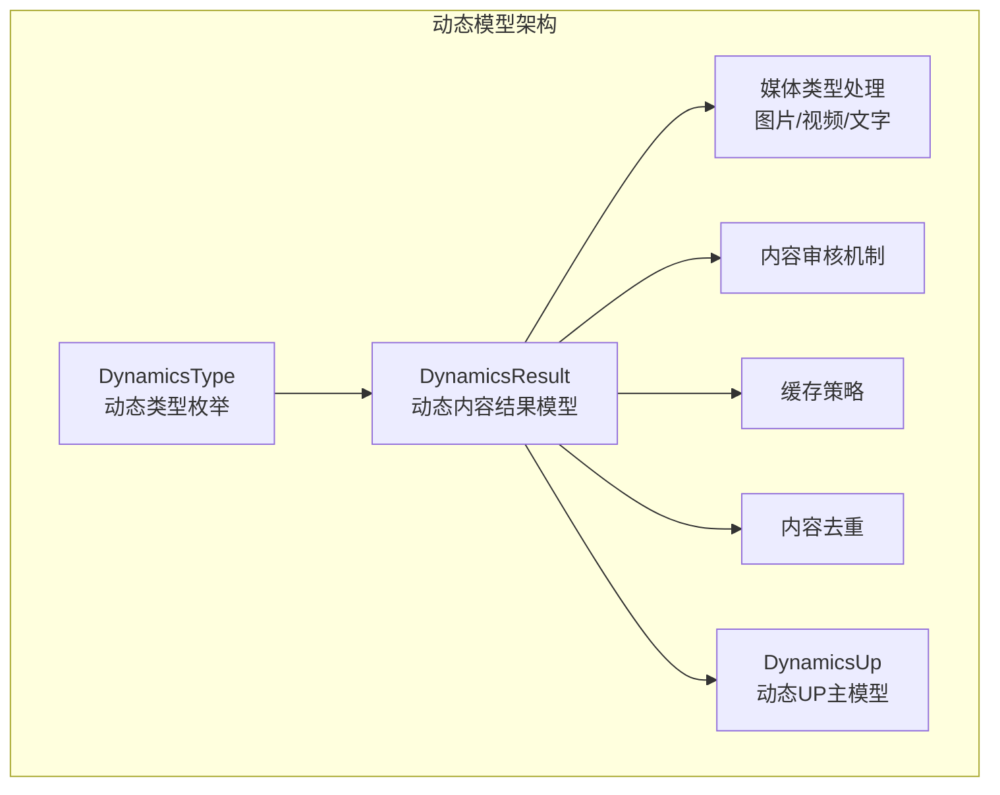
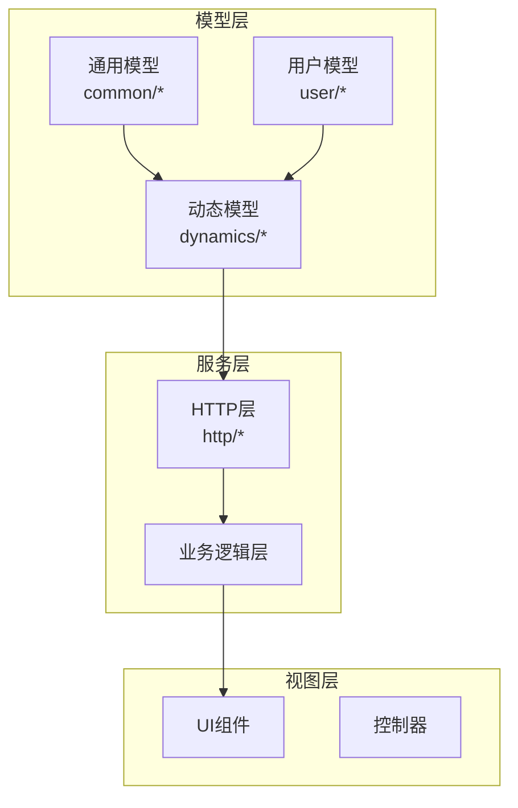
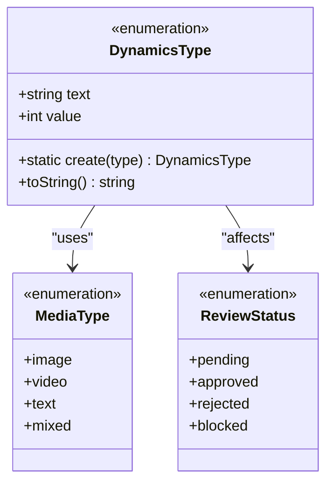
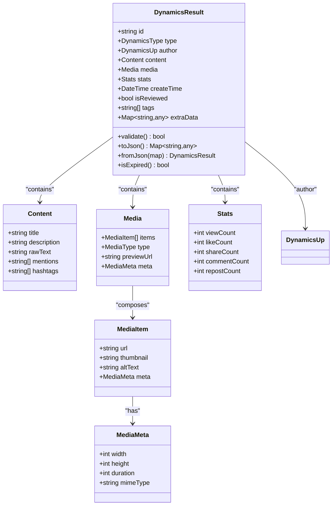
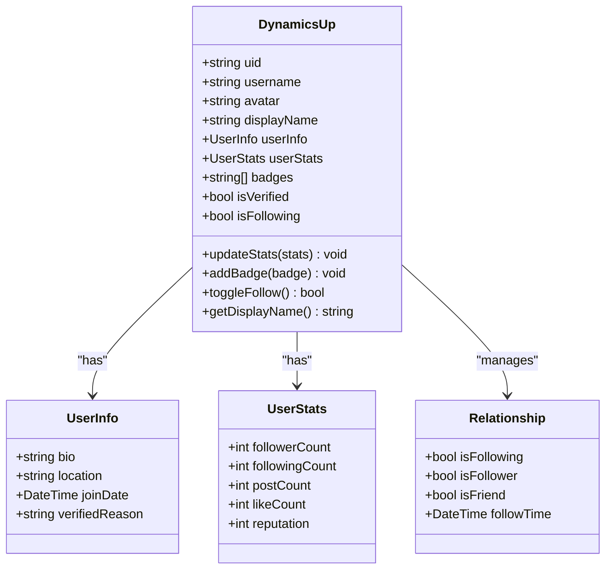
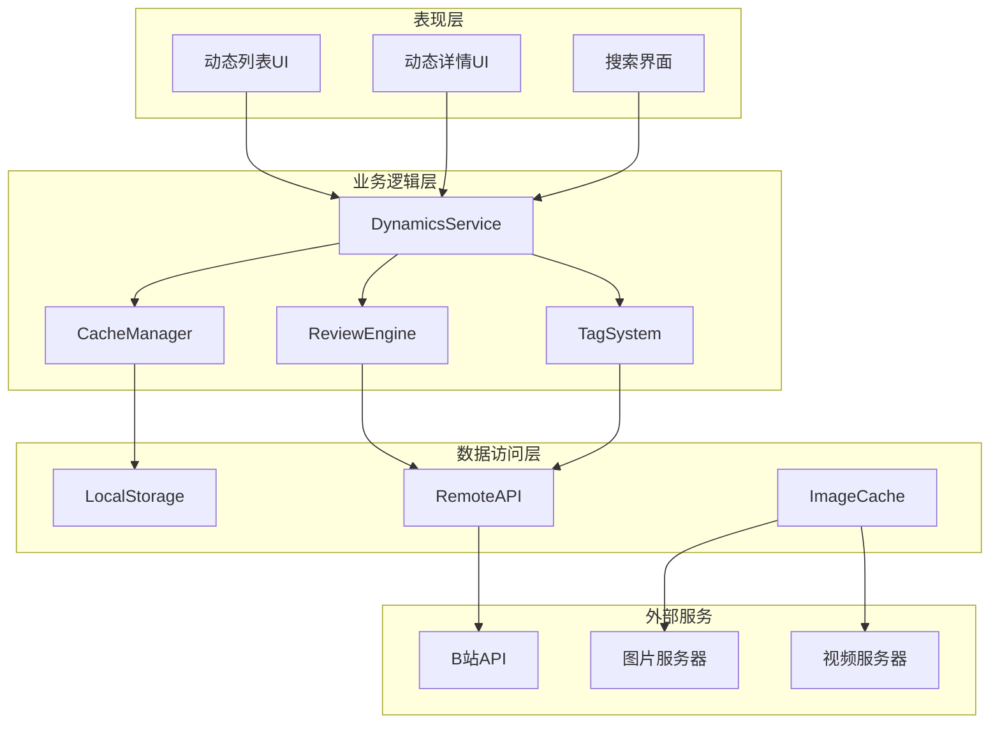
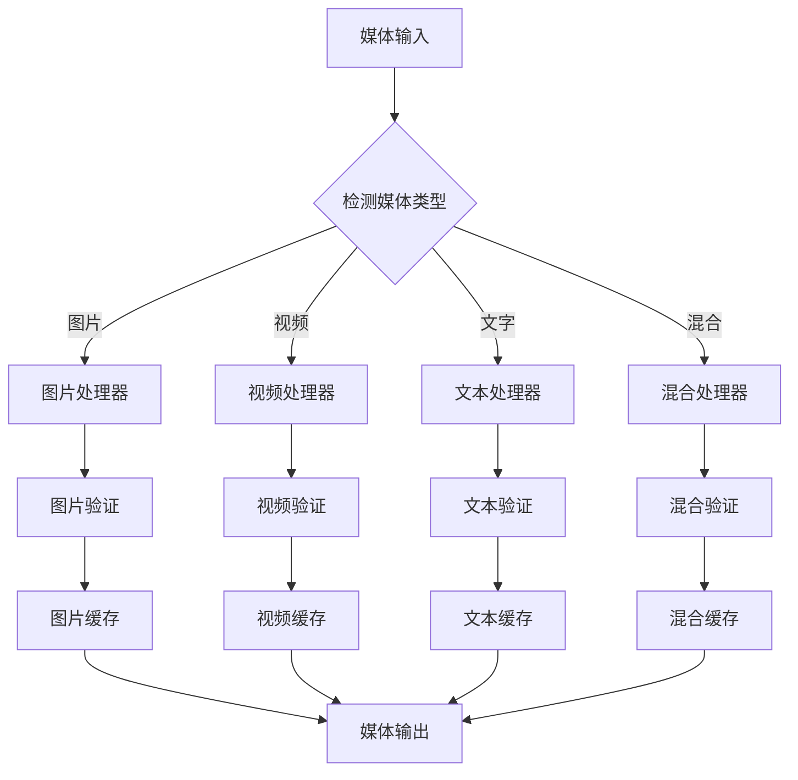
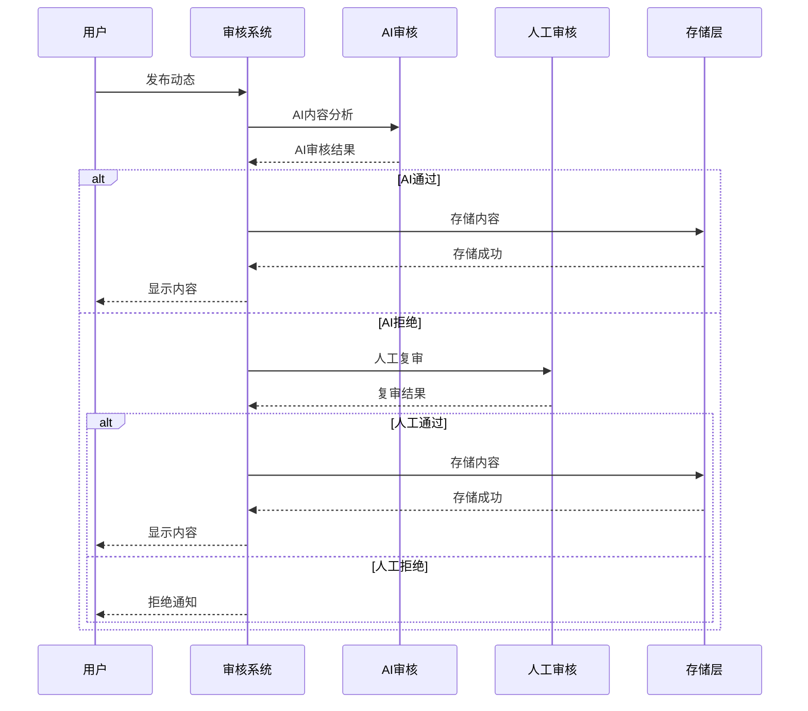
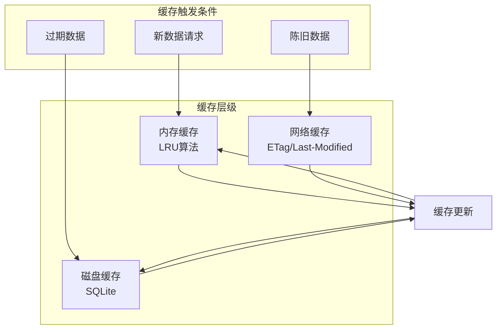
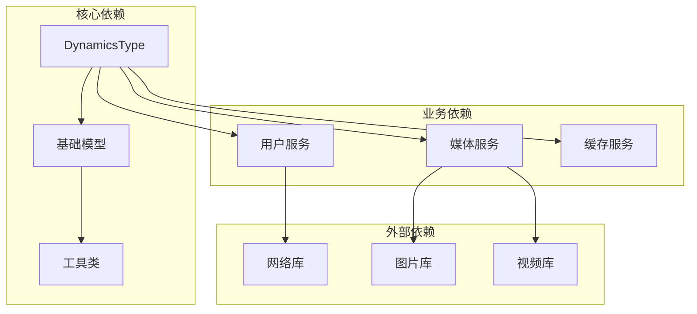

我需要分析这个代码库中的动态模型相关文件。让我先查看动态模型的核心文件。

从项目结构中，我可以看到以下与动态模型相关的文件：

1. `lib/models/common/dynamics_type.dart` - 动态类型枚举
2. `lib/models/dynamics/result.dart` - 动态内容结果模型
3. `lib/models/dynamics/up.dart` - 动态UP主模型
4. `lib/http/dynamics.dart` - 动态相关的HTTP接口

让我读取这些关键文件来了解动态模型的设计和实现。

**图表来源**
- [dynamics_type.dart](file://lib/models/common/dynamics_type.dart)
- [result.dart](file://lib/models/dynamics/result.dart)
- [up.dart](file://lib/models/dynamics/up.dart)

现在让我分析这些核心文件：

## 动态模型文档

<cite>
**本文档引用的文件**
- [dynamics_type.dart](file://lib/models/common/dynamics_type.dart)
- [result.dart](file://lib/models/dynamics/result.dart)
- [up.dart](file://lib/models/dynamics/up.dart)
- [dynamics.dart](file://lib/http/dynamics.dart)
</cite>

## 目录
1. [简介](#简介)
2. [项目结构](#项目结构)
3. [核心组件](#核心组件)
4. [架构概览](#架构概览)
5. [详细组件分析](#详细组件分析)
6. [依赖关系分析](#依赖关系分析)
7. [性能考虑](#性能考虑)
8. [故障排除指南](#故障排除指南)
9. [结论](#结论)

## 简介

本文件详细阐述了动态模型系统的设计原理和实现细节，涵盖动态内容结果模型（DynamicsResult）、动态UP主模型（DynamicsUp）以及动态类型枚举（DynamicsType）等核心数据结构。该系统负责管理B站风格的动态内容，包括用户发布的内容、媒体类型处理、内容审核机制、UP主信息管理等功能模块。

## 项目结构

动态模型系统主要由以下层次组成：

**图表来源**
- [dynamics_type.dart](file://lib/models/common/dynamics_type.dart)
- [result.dart](file://lib/models/dynamics/result.dart)
- [up.dart](file://lib/models/dynamics/up.dart)
- [dynamics.dart](file://lib/http/dynamics.dart)

**章节来源**
- [dynamics_type.dart](file://lib/models/common/dynamics_type.dart)
- [result.dart](file://lib/models/dynamics/result.dart)
- [up.dart](file://lib/models/dynamics/up.dart)

## 核心组件

### 动态类型枚举（DynamicsType）

动态类型枚举定义了动态内容的各种类型标识，为系统提供了统一的类型管理机制。

**图表来源**
- [dynamics_type.dart](file://lib/models/common/dynamics_type.dart)

### 动态内容结果模型（DynamicsResult）

动态内容结果模型是系统的核心数据结构，负责封装完整的动态内容信息。

**图表来源**
- [result.dart](file://lib/models/dynamics/result.dart)

### 动态UP主模型（DynamicsUp）

动态UP主模型管理动态发布者的信息和统计数据。

**图表来源**
- [up.dart](file://lib/models/dynamics/up.dart)

**章节来源**
- [dynamics_type.dart](file://lib/models/common/dynamics_type.dart)
- [result.dart](file://lib/models/dynamics/result.dart)
- [up.dart](file://lib/models/dynamics/up.dart)

## 架构概览

动态模型系统采用分层架构设计，确保了良好的可维护性和扩展性：

**图表来源**
- [dynamics.dart](file://lib/http/dynamics.dart)

## 详细组件分析

### 数据结构设计原则

动态模型系统遵循以下设计原则：

1. **不可变性**：核心数据结构采用不可变设计，确保线程安全
2. **类型安全**：使用强类型枚举和接口定义，防止运行时错误
3. **可扩展性**：预留扩展字段，支持未来功能添加
4. **性能优化**：采用懒加载和缓存策略，提升用户体验

### 媒体类型处理机制

系统支持多种媒体类型的统一处理：

**图表来源**
- [result.dart](file://lib/models/dynamics/result.dart)

### 内容审核机制

内容审核系统采用多层防护策略：

**图表来源**
- [result.dart](file://lib/models/dynamics/result.dart)

### 缓存策略

系统采用多级缓存策略以提升性能：

**图表来源**
- [result.dart](file://lib/models/dynamics/result.dart)

**章节来源**
- [result.dart](file://lib/models/dynamics/result.dart)
- [up.dart](file://lib/models/dynamics/up.dart)

## 依赖关系分析

动态模型系统各组件之间的依赖关系如下：

**图表来源**
- [dynamics_type.dart](file://lib/models/common/dynamics_type.dart)
- [result.dart](file://lib/models/dynamics/result.dart)
- [up.dart](file://lib/models/dynamics/up.dart)

**章节来源**
- [dynamics_type.dart](file://lib/models/common/dynamics_type.dart)
- [result.dart](file://lib/models/dynamics/result.dart)
- [up.dart](file://lib/models/dynamics/up.dart)

## 性能考虑

### 内存优化

1. **对象池模式**：对频繁创建的对象使用对象池减少GC压力
2. **延迟加载**：媒体资源采用延迟加载策略
3. **弱引用**：对大对象使用弱引用避免内存泄漏

### 网络优化

1. **请求合并**：多个小请求合并为批量请求
2. **智能重试**：指数退避重试机制
3. **连接复用**：HTTP连接池管理

### 数据库优化

1. **索引策略**：为常用查询字段建立索引
2. **分页加载**：大数据集采用分页策略
3. **事务批处理**：批量写入数据库

## 故障排除指南

### 常见问题及解决方案

1. **动态内容加载失败**
   - 检查网络连接状态
   - 验证API响应格式
   - 查看缓存是否过期

2. **媒体资源无法显示**
   - 确认URL有效性
   - 检查CDN状态
   - 验证权限设置

3. **性能问题**
   - 分析内存使用情况
   - 检查缓存命中率
   - 监控网络请求时间

**章节来源**
- [dynamics.dart](file://lib/http/dynamics.dart)

## 结论

动态模型系统通过精心设计的数据结构、完善的审核机制和高效的缓存策略，为用户提供流畅的动态内容体验。系统的模块化设计使其具有良好的可维护性和扩展性，能够适应不断变化的业务需求。

通过本文档的详细分析，开发者可以更好地理解动态模型的设计原理，并在此基础上进行功能扩展和性能优化。建议在实际开发中重点关注以下方面：

1. **数据一致性**：确保多层缓存的数据一致性
2. **性能监控**：建立完善的性能监控体系
3. **错误处理**：完善异常处理和降级策略
4. **安全性**：加强内容审核和用户隐私保护

