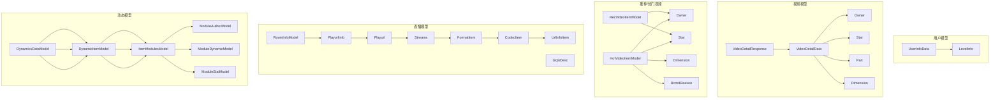
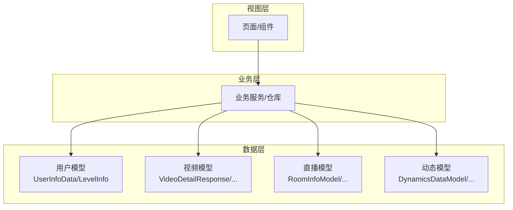
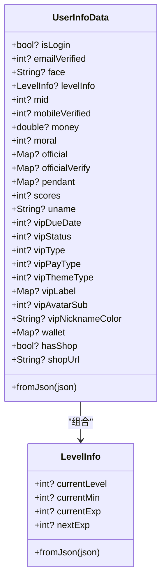
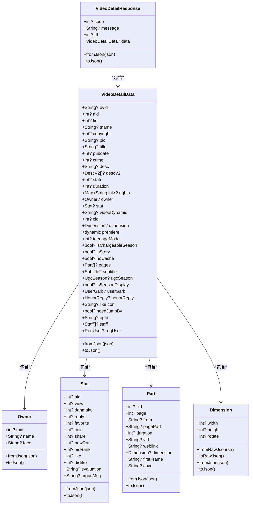
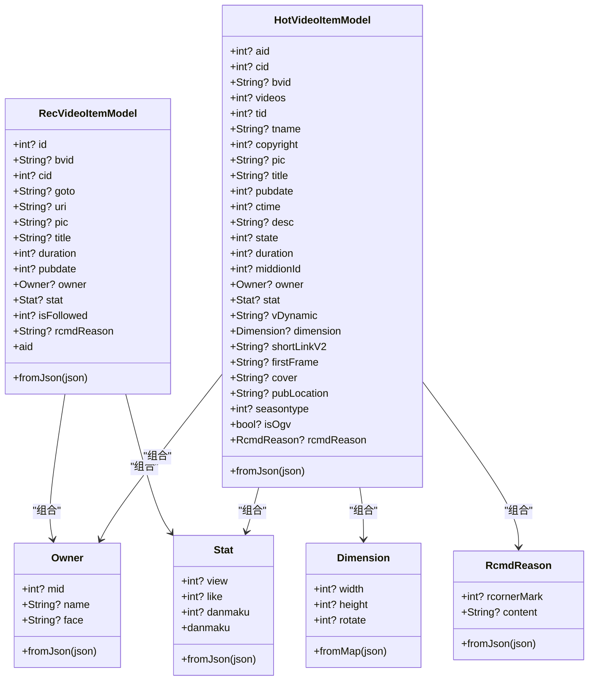
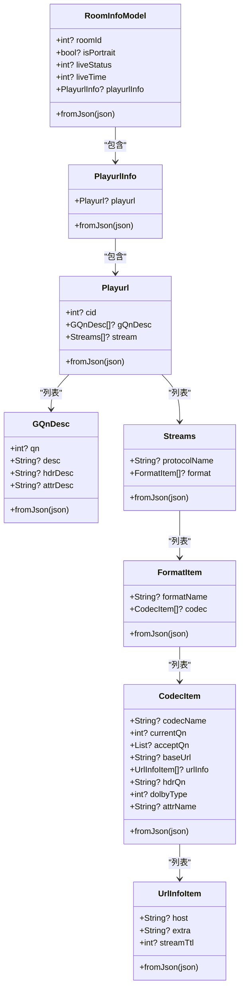
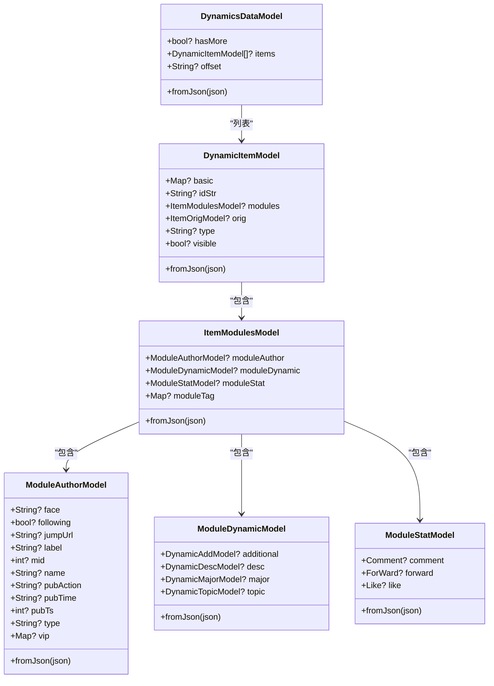
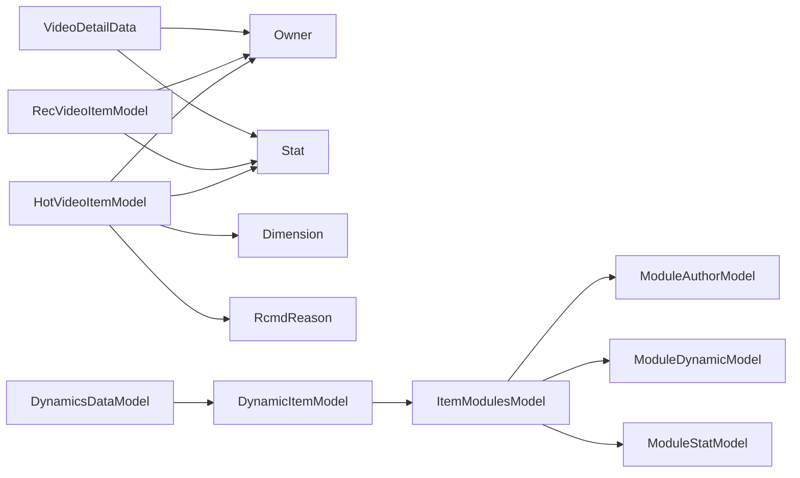

# 核心数据模型

<cite>
**本文引用的文件**
- [lib/models/user/info.dart](file://lib/models/user/info.dart)
- [lib/models/user/info.g.dart](file://lib/models/user/info.g.dart)
- [lib/models/video_detail_res.dart](file://lib/models/video_detail_res.dart)
- [lib/models/model_rec_video_item.dart](file://lib/models/model_rec_video_item.dart)
- [lib/models/model_hot_video_item.dart](file://lib/models/model_hot_video_item.dart)
- [lib/models/model_owner.dart](file://lib/models/model_owner.dart)
- [lib/models/live/room_info.dart](file://lib/models/live/room_info.dart)
- [lib/models/dynamics/result.dart](file://lib/models/dynamics/result.dart)
</cite>

## 目录
1. [简介](#简介)
2. [项目结构](#项目结构)
3. [核心组件](#核心组件)
4. [架构总览](#架构总览)
5. [详细组件分析](#详细组件分析)
6. [依赖分析](#依赖分析)
7. [性能考量](#性能考量)
8. [故障排查指南](#故障排查指南)
9. [结论](#结论)
10. [附录](#附录)

## 简介
本文件系统性梳理 PiliPala 的核心数据模型，覆盖用户、视频、直播与动态四大领域。内容包括：
- 字段定义、数据类型、业务含义与约束
- 模型间的关系、继承与组合
- 序列化/反序列化实现与 JSON 映射策略
- 生命周期管理、缓存策略与性能优化建议
- 使用最佳实践与扩展指南

## 项目结构
围绕“模型”目录下的数据类组织，按功能域划分：用户、视频、直播、动态等。核心模型文件如下：
- 用户：UserInfoData、LevelInfo 及其生成的适配器
- 视频：VideoDetailResponse/VideoDetailData 及其子模型（Owner、Stat、Part、Dimension 等）
- 推荐/热门视频：RecVideoItemModel、HotVideoItemModel、Owner、Stat、Dimension、RcmdReason
- 直播：RoomInfoModel、PlayurlInfo、Playurl、GQnDesc、Streams、FormatItem、CodecItem、UrlInfoItem
- 动态：DynamicsDataModel、DynamicItemModel、ItemModulesModel、ModuleAuthorModel、ModuleDynamicModel、ModuleStatModel 等

图表来源
- [lib/models/user/info.dart:5-137](file://lib/models/user/info.dart#L5-L137)
- [lib/models/video_detail_res.dart:3-218](file://lib/models/video_detail_res.dart#L3-L218)
- [lib/models/model_rec_video_item.dart:3-52](file://lib/models/model_rec_video_item.dart#L3-L52)
- [lib/models/model_hot_video_item.dart:3-89](file://lib/models/model_hot_video_item.dart#L3-L89)
- [lib/models/live/room_info.dart:1-159](file://lib/models/live/room_info.dart#L1-L159)
- [lib/models/dynamics/result.dart:4-22](file://lib/models/dynamics/result.dart#L4-L22)

章节来源
- [lib/models/user/info.dart:1-137](file://lib/models/user/info.dart#L1-L137)
- [lib/models/video_detail_res.dart:1-218](file://lib/models/video_detail_res.dart#L1-L218)
- [lib/models/model_rec_video_item.dart:1-75](file://lib/models/model_rec_video_item.dart#L1-L75)
- [lib/models/model_hot_video_item.dart:1-168](file://lib/models/model_hot_video_item.dart#L1-L168)
- [lib/models/live/room_info.dart:1-159](file://lib/models/live/room_info.dart#L1-L159)
- [lib/models/dynamics/result.dart:1-904](file://lib/models/dynamics/result.dart#L1-L904)

## 核心组件
本节对四大核心模型进行字段级解析与关系说明，并给出序列化/反序列化要点。

- 用户模型（UserInfoData、LevelInfo）
  - 字段概览：登录态、头像、等级信息、会员信息、钱包与商店标识等
  - 关系：UserInfoData 组合 LevelInfo；通过 Hive 注解持久化
  - 序列化：支持 fromJson 构造；生成的适配器用于二进制读写
  - 约束：部分字段存在类型兼容性处理（如数值转 double、字符串转 int）

- 视频详情模型（VideoDetailResponse、VideoDetailData 及子模型）
  - 字段概览：BV/AV 号、标题、封面、时长、分区、UP 主、统计、分 P、字幕、剧集等
  - 关系：包含 Owner、Stat、Part、Subtitle、UgcSeason、Staff、ReqUser 等
  - 序列化：统一的 fromJson/toJson 实现，复杂字段递归映射
  - 约束：descV2、rights、pages 等集合字段的空值安全处理

- 推荐/热门视频模型（RecVideoItemModel、HotVideoItemModel）
  - 字段概览：id/bvid/cid/goto/uri、封面、标题、时长、发布时间、UP 主、统计、是否关注、推荐原因
  - 关系：复用 Owner、Stat；HotVideoItemModel 增加维度与推荐原因
  - 序列化：fromJson 映射，别名与兼容性字段（如 aid、danmaku 别名）
  - 约束：is_followed 默认值、rcmd_reason 内容提取

- 直播房间模型（RoomInfoModel、PlayurlInfo、Playurl、Streams 等）
  - 字段概览：房间号、横竖屏、直播状态、播放流配置、清晰度描述、协议/格式/编解码项
  - 关系：多层嵌套对象，最终指向 UrlInfoItem
  - 序列化：逐层 fromJson，列表字段 map 转换
  - 约束：字段类型兼容（字符串/整数）、可选字段处理

- 动态模型（DynamicsDataModel、DynamicItemModel、模块化结构）
  - 字段概览：hasMore、items、offset；动态条目、模块作者、动态内容、统计
  - 关系：模块化设计，支持图文、视频、直播等多种 Major 类型
  - 序列化：复杂嵌套与 JSON 解析（如 content 字段二次解析）
  - 约束：布尔/整数兼容、时间戳与字符串互转、空值保护

章节来源
- [lib/models/user/info.dart:5-137](file://lib/models/user/info.dart#L5-L137)
- [lib/models/user/info.g.dart:9-154](file://lib/models/user/info.g.dart#L9-L154)
- [lib/models/video_detail_res.dart:3-218](file://lib/models/video_detail_res.dart#L3-L218)
- [lib/models/model_rec_video_item.dart:3-52](file://lib/models/model_rec_video_item.dart#L3-L52)
- [lib/models/model_hot_video_item.dart:3-89](file://lib/models/model_hot_video_item.dart#L3-L89)
- [lib/models/live/room_info.dart:1-159](file://lib/models/live/room_info.dart#L1-L159)
- [lib/models/dynamics/result.dart:4-22](file://lib/models/dynamics/result.dart#L4-L22)

## 架构总览
下图展示核心模型在应用中的角色与交互：

图表来源
- [lib/models/user/info.dart:5-137](file://lib/models/user/info.dart#L5-L137)
- [lib/models/video_detail_res.dart:3-218](file://lib/models/video_detail_res.dart#L3-L218)
- [lib/models/live/room_info.dart:1-159](file://lib/models/live/room_info.dart#L1-L159)
- [lib/models/dynamics/result.dart:4-22](file://lib/models/dynamics/result.dart#L4-L22)

## 详细组件分析

### 用户模型分析
- 设计要点
  - 使用 Hive 注解进行本地持久化，字段通过 @HiveField 编号映射
  - LevelInfo 作为嵌套对象，独立适配器提升可维护性
  - fromJson 中对字段类型进行兼容处理（如 int/double、字符串转 int）
- 关键字段与含义
  - 登录态与认证：isLogin、emailVerified、mobileVerified
  - 头像与昵称：face、uname
  - 等级与经验：levelInfo(currentLevel/currentExp/nextExp)
  - 会员与钱包：vipType/vipStatus/vipLabel/vipNicknameColor、wallet、hasShop/shopUrl
  - 其他：money、moral、scores、pendant、official/officialVerify
- 序列化与反序列化
  - fromJson 支持缺省字段与类型转换
  - 生成适配器负责二进制读写，字段编号与类型严格对应
- 约束与校验
  - 部分字段存在默认值或空值保护
  - 业务侧需注意字段命名差异（如 vip_pay_type、vip_label 等）

图表来源
- [lib/models/user/info.dart:5-137](file://lib/models/user/info.dart#L5-L137)
- [lib/models/user/info.g.dart:9-154](file://lib/models/user/info.g.dart#L9-L154)

章节来源
- [lib/models/user/info.dart:5-137](file://lib/models/user/info.dart#L5-L137)
- [lib/models/user/info.g.dart:9-154](file://lib/models/user/info.g.dart#L9-L154)

### 视频模型分析
- 设计要点
  - VideoDetailResponse 作为顶层响应容器，包含 code/message/ttl/data
  - VideoDetailData 聚合视频元信息、UP 主、统计、分 P、字幕、剧集等
  - 子模型（Owner、Stat、Part、Dimension）职责单一，便于复用
- 关键字段与含义
  - 基础信息：bvid、aid、title、pic、duration、pubdate、ctime、desc、descV2
  - 分区与权限：tid/tname、rights、copyright
  - UP 主与统计：owner(mid/name/face)、stat(view/danmaku/reply/favorite/coin/share/like/dislike)
  - 分 P 与维度：pages(Part)、dimension(width/height/rotate)
  - 剧集与附加：ugcSeason、subtitle、staff、reqUser
- 序列化与反序列化
  - fromJson 对集合字段进行空值保护与类型转换
  - toJson 将嵌套对象递归序列化
- 约束与校验
  - descV2、rights、pages 等字段为空时返回空集合
  - redirect_url 提取 epId 的正则匹配逻辑

图表来源
- [lib/models/video_detail_res.dart:3-218](file://lib/models/video_detail_res.dart#L3-L218)

章节来源
- [lib/models/video_detail_res.dart:3-218](file://lib/models/video_detail_res.dart#L3-L218)

### 推荐/热门视频模型分析
- 设计要点
  - RecVideoItemModel 与 HotVideoItemModel 复用 Owner、Stat，保持一致的数据契约
  - HotVideoItemModel 扩展维度（Dimension）与推荐原因（RcmdReason）
  - 提供别名字段以兼容 UI 组件（如 aid、danmaku）
- 关键字段与含义
  - RecVideoItemModel：id/bvid/cid/goto/uri、pic/title/duration/pubdate、owner/stat、is_followed、rcmd_reason
  - HotVideoItemModel：aid/cid/bvid/videos/tid/tname/copyright、pic/title、pubdate/ctime/desc/state/duration、owner/stat、vDynamic/dimension/shortLinkV2/firstFrame/cover、pubLocation/seasontype/isOgv、rcmdReason
- 序列化与反序列化
  - fromJson 对集合与嵌套对象进行映射
  - 别名与兼容性字段在 getter/setter 层面处理
- 约束与校验
  - is_followed 默认值处理
  - rcmd_reason 的内容提取与空值保护

图表来源
- [lib/models/model_rec_video_item.dart:3-52](file://lib/models/model_rec_video_item.dart#L3-L52)
- [lib/models/model_hot_video_item.dart:3-89](file://lib/models/model_hot_video_item.dart#L3-L89)
- [lib/models/model_owner.dart:1-18](file://lib/models/model_owner.dart#L1-L18)

章节来源
- [lib/models/model_rec_video_item.dart:3-52](file://lib/models/model_rec_video_item.dart#L3-L52)
- [lib/models/model_hot_video_item.dart:3-89](file://lib/models/model_hot_video_item.dart#L3-L89)
- [lib/models/model_owner.dart:1-18](file://lib/models/model_owner.dart#L1-L18)

### 直播模型分析
- 设计要点
  - RoomInfoModel 作为顶层容器，包含房间基础信息与播放流配置
  - PlayurlInfo/Playurl/GQnDesc/Streams/FormatItem/CodecItem/UrlInfoItem 形成清晰的层级结构
- 关键字段与含义
  - 房间信息：roomId、isPortrait、liveStatus、liveTime、playurlInfo
  - 播放流：cid、gQnDesc、stream、format、codec、baseUrl、urlInfo、host、extra、streamTtl
- 序列化与反序列化
  - 逐层 fromJson，列表字段 map 转换
  - 字段类型兼容（字符串/整数），可选字段保护
- 约束与校验
  - 字段命名与枚举值需与后端约定保持一致

图表来源
- [lib/models/live/room_info.dart:1-159](file://lib/models/live/room_info.dart#L1-L159)

章节来源
- [lib/models/live/room_info.dart:1-159](file://lib/models/live/room_info.dart#L1-L159)

### 动态模型分析
- 设计要点
  - DynamicsDataModel 作为顶层容器，包含分页参数与条目列表
  - DynamicItemModel 采用模块化设计，支持作者、动态内容、统计等模块
  - 支持多种 Major 类型（视频、图文、直播等）与富文本节点
- 关键字段与含义
  - 容器：hasMore、items、offset
  - 条目：basic/idStr/modules/orig/type/visible
  - 模块：moduleAuthor(face/following/jumpUrl/label/mid/name/pubAction/pubTime/pubTs/type/vip)
  - 动态内容：additional/desc/major/topic
  - 统计：comment/forward/like（含 count/forbidden/status）
- 序列化与反序列化
  - fromJson 对复杂嵌套与 JSON 字符串进行二次解析
  - 字段类型兼容（布尔/整数/字符串互转）
- 约束与校验
  - 空值保护与默认值处理
  - 富文本节点与表情字段的可选映射

图表来源
- [lib/models/dynamics/result.dart:4-22](file://lib/models/dynamics/result.dart#L4-L22)
- [lib/models/dynamics/result.dart:24-105](file://lib/models/dynamics/result.dart#L24-L105)
- [lib/models/dynamics/result.dart:107-156](file://lib/models/dynamics/result.dart#L107-L156)
- [lib/models/dynamics/result.dart:158-185](file://lib/models/dynamics/result.dart#L158-L185)
- [lib/models/dynamics/result.dart:822-888](file://lib/models/dynamics/result.dart#L822-L888)

章节来源
- [lib/models/dynamics/result.dart:4-22](file://lib/models/dynamics/result.dart#L4-L22)
- [lib/models/dynamics/result.dart:24-105](file://lib/models/dynamics/result.dart#L24-L105)
- [lib/models/dynamics/result.dart:107-156](file://lib/models/dynamics/result.dart#L107-L156)
- [lib/models/dynamics/result.dart:158-185](file://lib/models/dynamics/result.dart#L158-L185)
- [lib/models/dynamics/result.dart:822-888](file://lib/models/dynamics/result.dart#L822-L888)

## 依赖分析
- 组件耦合
  - 视频模型与推荐/热门模型共享 Owner、Stat、Dimension、RcmdReason，降低重复与提升一致性
  - 动态模型内部模块化程度高，便于扩展新的 Major 类型
- 外部依赖
  - 用户模型使用 Hive 进行本地持久化
  - 视频/动态/直播模型主要依赖 Dart 标准库与 JSON 映射
- 循环依赖
  - 当前模型未见循环依赖迹象，结构清晰

图表来源
- [lib/models/video_detail_res.dart:3-218](file://lib/models/video_detail_res.dart#L3-L218)
- [lib/models/model_rec_video_item.dart:3-52](file://lib/models/model_rec_video_item.dart#L3-L52)
- [lib/models/model_hot_video_item.dart:3-89](file://lib/models/model_hot_video_item.dart#L3-L89)
- [lib/models/dynamics/result.dart:4-22](file://lib/models/dynamics/result.dart#L4-L22)

章节来源
- [lib/models/video_detail_res.dart:3-218](file://lib/models/video_detail_res.dart#L3-L218)
- [lib/models/model_rec_video_item.dart:3-52](file://lib/models/model_rec_video_item.dart#L3-L52)
- [lib/models/model_hot_video_item.dart:3-89](file://lib/models/model_hot_video_item.dart#L3-L89)
- [lib/models/dynamics/result.dart:4-22](file://lib/models/dynamics/result.dart#L4-L22)

## 性能考量
- 序列化性能
  - 视频与动态模型的 fromJson/toJson 递归映射较为密集，建议在批量渲染场景中避免重复解析
  - 用户模型使用 Hive 二进制适配器，读写效率高，适合频繁访问的用户数据
- 内存占用
  - 直播模型层级较深且包含大量列表，建议按需加载与懒加载策略
  - 动态模型富文本节点与表情字段可能产生额外内存开销，建议在 UI 层做虚拟化
- 缓存策略
  - 用户模型：Hive Box 持久化，结合失效策略（如 lastModified）
  - 视频详情：按 bvid/aid 缓存，结合网络请求去重与过期控制
  - 推荐/热门视频：基于路由与页面生命周期缓存，避免重复拉取
  - 直播与动态：按房间/动态 ID 缓存，结合增量更新与分页加载

## 故障排查指南
- 字段类型不一致
  - 现象：布尔/整数/字符串混用导致显示异常
  - 处理：在 fromJson 中增加类型判断与转换（参考现有实现）
- 空值与缺省字段
  - 现象：集合字段为空或缺失导致崩溃
  - 处理：统一空值保护与默认值初始化
- JSON 二次解析
  - 现象：content 字段为字符串需二次解析
  - 处理：确保解析失败时的兜底逻辑与日志记录
- Hive 本地存储
  - 现象：升级版本后字段编号不匹配导致读取异常
  - 处理：谨慎调整 @HiveField 编号，必要时迁移旧数据

章节来源
- [lib/models/user/info.dart:82-109](file://lib/models/user/info.dart#L82-L109)
- [lib/models/video_detail_res.dart:112-166](file://lib/models/video_detail_res.dart#L112-L166)
- [lib/models/dynamics/result.dart:750-779](file://lib/models/dynamics/result.dart#L750-L779)

## 结论
PiliPala 的核心数据模型以清晰的职责划分与模块化设计为基础，兼顾了序列化效率与业务扩展性。通过统一的 fromJson/toJson 与 Hive 持久化策略，实现了跨层的一致性与可维护性。建议在后续迭代中持续完善字段约束、错误处理与缓存策略，以进一步提升稳定性与性能。

## 附录
- 最佳实践
  - 在 fromJson 中统一处理类型兼容与空值保护
  - 对深层嵌套对象采用惰性解析与按需加载
  - 使用别名与兼容字段提升 UI 组件复用性
  - 对 Hive 模型进行版本化管理，避免字段编号冲突
- 扩展指南
  - 新增字段时优先考虑现有适配器与序列化路径
  - 对于新增 Major 类型，遵循动态模型的模块化设计
  - 引入缓存时明确失效策略与更新机制