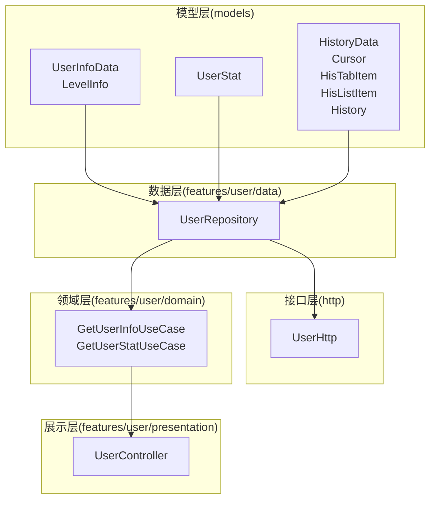
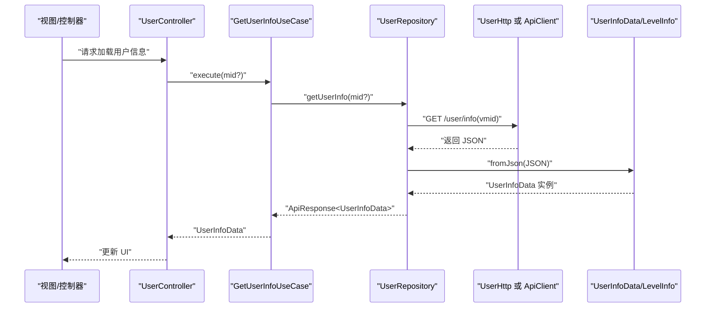
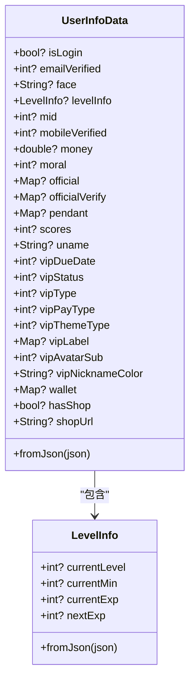
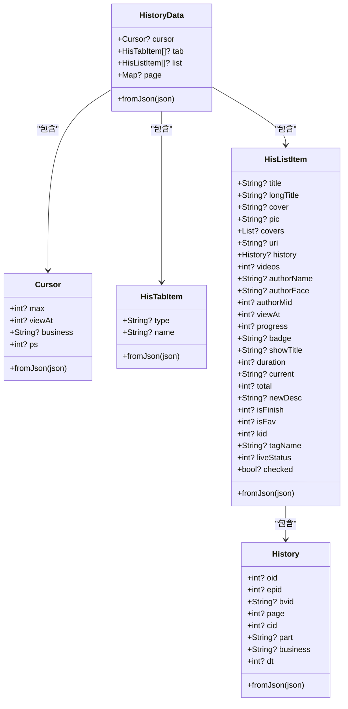
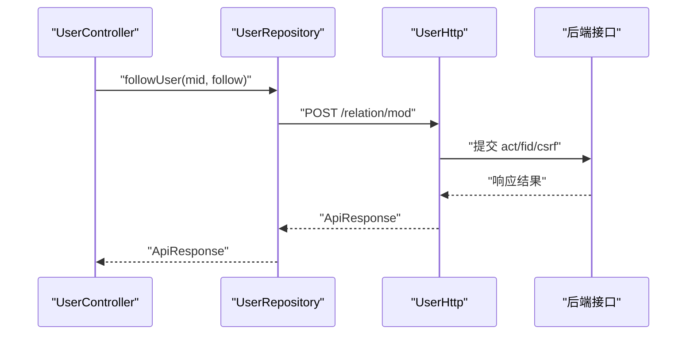
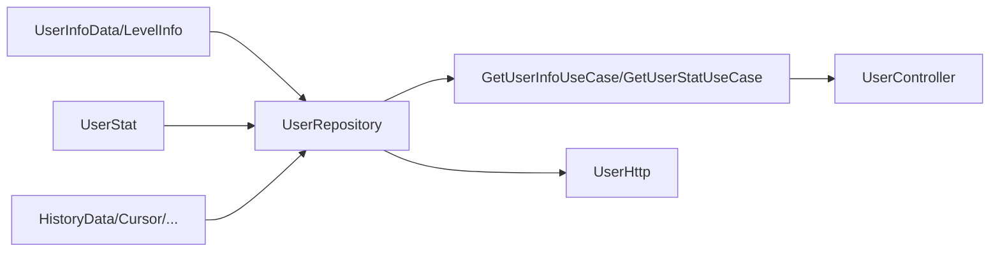

# 用户模型

<cite>
**本文引用的文件**
- [lib/models/user/info.dart](file://lib/models/user/info.dart)
- [lib/models/user/info.g.dart](file://lib/models/user/info.g.dart)
- [lib/models/user/stat.dart](file://lib/models/user/stat.dart)
- [lib/models/user/history.dart](file://lib/models/user/history.dart)
- [lib/features/user/data/user_repository.dart](file://lib/features/user/data/user_repository.dart)
- [lib/http/user.dart](file://lib/http/user.dart)
- [lib/features/user/domain/user_use_cases.dart](file://lib/features/user/domain/user_use_cases.dart)
- [lib/features/user/presentation/user_controller.dart](file://lib/features/user/presentation/user_controller.dart)
- [test/unit/repository/user_repository_test.dart](file://test/unit/repository/user_repository_test.dart)
</cite>

## 目录
1. [简介](#简介)
2. [项目结构](#项目结构)
3. [核心组件](#核心组件)
4. [架构总览](#架构总览)
5. [详细组件分析](#详细组件分析)
6. [依赖分析](#依赖分析)
7. [性能考量](#性能考量)
8. [故障排查指南](#故障排查指南)
9. [结论](#结论)
10. [附录](#附录)

## 简介
本文件系统性梳理用户相关数据模型与集成路径，覆盖以下核心模型：
- 用户基本信息模型：UserInfoData 及其嵌套模型 LevelInfo
- 用户统计模型：UserStat
- 用户历史记录模型：HistoryData、Cursor、HisTabItem、HisListItem、History

文档将从字段语义、数据类型、验证与约束、序列化/反序列化、与认证/关注/历史系统的集成、缓存策略、性能优化与安全建议等方面进行深入说明，并提供最佳实践与扩展指南。

## 项目结构
用户模型位于 models 层，采用“模型 + 生成适配器”的方式实现本地持久化；数据访问通过仓库层统一对外暴露；上层通过用例与控制器进行编排。

图表来源
- [lib/models/user/info.dart:1-137](file://lib/models/user/info.dart#L1-L137)
- [lib/models/user/stat.dart:1-18](file://lib/models/user/stat.dart#L1-L18)
- [lib/models/user/history.dart:1-178](file://lib/models/user/history.dart#L1-L178)
- [lib/features/user/data/user_repository.dart:1-235](file://lib/features/user/data/user_repository.dart#L1-L235)
- [lib/http/user.dart:1-541](file://lib/http/user.dart#L1-L541)
- [lib/features/user/domain/user_use_cases.dart:1-133](file://lib/features/user/domain/user_use_cases.dart#L1-L133)
- [lib/features/user/presentation/user_controller.dart:32-71](file://lib/features/user/presentation/user_controller.dart#L32-L71)

章节来源
- [lib/models/user/info.dart:1-137](file://lib/models/user/info.dart#L1-L137)
- [lib/models/user/stat.dart:1-18](file://lib/models/user/stat.dart#L1-L18)
- [lib/models/user/history.dart:1-178](file://lib/models/user/history.dart#L1-L178)
- [lib/features/user/data/user_repository.dart:1-235](file://lib/features/user/data/user_repository.dart#L1-L235)
- [lib/http/user.dart:1-541](file://lib/http/user.dart#L1-L541)
- [lib/features/user/domain/user_use_cases.dart:1-133](file://lib/features/user/domain/user_use_cases.dart#L1-L133)
- [lib/features/user/presentation/user_controller.dart:32-71](file://lib/features/user/presentation/user_controller.dart#L32-L71)

## 核心组件
本节对三个核心用户模型进行逐项说明，包括字段类型、业务含义、验证与约束、序列化/反序列化与复杂度分析。

- UserInfoData
  - 字段概览与要点
    - 标识类：mid（整型）、isLogin（布尔）
    - 基本信息：uname（字符串）、face（头像地址）
    - 官方/装扮：official、officialVerify、pendant、vip*系列字段（含到期时间、状态、类型、支付类型、主题类型、标签、头像副标题、昵称颜色）
    - 财富与积分：money（数值型，注意 JSON 中可能为整数或浮点）、scores（积分）
    - 其他：emailVerified、mobileVerified（整型验证标志）、wallet（映射）、hasShop、shopUrl、moral（道德分）
    - 嵌套：levelInfo（LevelInfo）
  - 验证与约束
    - mid 通常唯一且非负；isLogin 默认值处理见反序列化逻辑
    - money 在 JSON 反序列化时做 int->double 的兼容转换
    - VIP 相关字段多为枚举/状态码，需结合业务规则校验
  - 序列化/反序列化
    - 提供 fromJson 构造函数，支持可选字段与默认值
    - 自动生成的适配器用于 Hive 持久化读写，字段索引与类型一一对应
  - 复杂度
    - 反序列化 O(n)，n 为字段数量；Hive 读写为固定字段索引访问

- LevelInfo
  - 字段概览：currentLevel、currentMin、currentExp、nextExp
  - 特殊逻辑：nextExp 在特定等级条件下取值不同，反序列化时做了分支处理
  - 复杂度：O(1)

- UserStat
  - 字段概览：following（关注数）、follower（粉丝数）、dynamicCount（动态数）
  - 复杂度：O(1)

- HistoryData 族
  - HistoryData：包含游标、标签页、列表与分页元数据
  - Cursor：max、viewAt、business、ps（每页条数）
  - HisTabItem：type、name（历史分类标签）
  - HisListItem：标题、封面、作者信息、进度、时长、是否完结/收藏、kid、标签名、直播状态等丰富字段
  - History：oid、epid、bvid、page、cid、part、business、dt（时间戳）
  - 复杂度：单条 HisListItem 反序列化 O(m)，m 为字段数；列表反序列化 O(n*m)

章节来源
- [lib/models/user/info.dart:5-137](file://lib/models/user/info.dart#L5-L137)
- [lib/models/user/info.g.dart:9-154](file://lib/models/user/info.g.dart#L9-L154)
- [lib/models/user/stat.dart:1-18](file://lib/models/user/stat.dart#L1-L18)
- [lib/models/user/history.dart:1-178](file://lib/models/user/history.dart#L1-L178)

## 架构总览
用户模型在系统中的调用链路如下：前端控制器通过用例调用仓库，仓库封装 HTTP 请求并返回模型实例；上层根据业务需求组合多个模型。

图表来源
- [lib/features/user/presentation/user_controller.dart:58-71](file://lib/features/user/presentation/user_controller.dart#L58-L71)
- [lib/features/user/domain/user_use_cases.dart:10-26](file://lib/features/user/domain/user_use_cases.dart#L10-L26)
- [lib/features/user/data/user_repository.dart:22-49](file://lib/features/user/data/user_repository.dart#L22-L49)
- [lib/http/user.dart:29-37](file://lib/http/user.dart#L29-L37)
- [lib/models/user/info.dart:82-110](file://lib/models/user/info.dart#L82-L110)

## 详细组件分析

### 用户基本信息模型（UserInfoData 与 LevelInfo）
- 设计要点
  - 使用 Hive 注解进行本地持久化，配合生成的适配器实现二进制序列化
  - 嵌套对象 LevelInfo 也具备独立的适配器，确保层级结构稳定
  - 反序列化时对 money 进行 int->double 的兼容处理，避免类型不一致导致的异常
- 关键字段与约束
  - mid：用户标识，应唯一且非负
  - isLogin：登录态标记，默认值处理保证健壮性
  - face、uname：显示用基础字段，需校验 URL 与长度
  - VIP 系列字段：需与平台规则保持一致，避免越界或非法值
  - levelInfo.nextExp：特殊分支逻辑，需在消费端保持一致性
- 性能与安全
  - Hive 适配器字段索引访问 O(1)，适合频繁读取
  - 对外部 JSON 的字段映射需严格校验，防止注入或越界
- 扩展建议
  - 新增字段时同步更新适配器与 fromJson 映射
  - 对敏感字段（如钱包、余额）在 UI 层做最小化展示与权限控制

图表来源
- [lib/models/user/info.dart:5-137](file://lib/models/user/info.dart#L5-L137)
- [lib/models/user/info.g.dart:9-154](file://lib/models/user/info.g.dart#L9-L154)

章节来源
- [lib/models/user/info.dart:5-137](file://lib/models/user/info.dart#L5-L137)
- [lib/models/user/info.g.dart:9-154](file://lib/models/user/info.g.dart#L9-L154)

### 用户统计模型（UserStat）
- 字段与含义
  - following：关注数
  - follower：粉丝数
  - dynamicCount：动态数
- 使用场景
  - 个人主页、他人主页、排行榜等页面展示
- 复杂度与约束
  - O(1) 反序列化；字段为整型，需非负校验

章节来源
- [lib/models/user/stat.dart:1-18](file://lib/models/user/stat.dart#L1-L18)

### 用户历史记录模型（HistoryData 族）
- 数据结构与职责
  - HistoryData：聚合游标、标签、列表与分页信息
  - Cursor：分页游标与参数
  - HisTabItem：历史分类标签
  - HisListItem：历史条目详情（标题、封面、作者、进度、时长、收藏/完结状态、kid 等）
  - History：具体对象的 oid/bvid/cid/business/dt 等
- 反序列化要点
  - 对空值与默认值进行兜底（如空数组、空字符串、零值转 null）
  - bvid/page/cid 等字段存在边界值处理（空串/0 视为缺失）
- 使用流程
  - 通过仓库的 getHistoryList 获取列表，再由控制器驱动 UI 更新

图表来源
- [lib/models/user/history.dart:1-178](file://lib/models/user/history.dart#L1-L178)

章节来源
- [lib/models/user/history.dart:1-178](file://lib/models/user/history.dart#L1-L178)

### 与认证系统、关注系统、历史系统的集成
- 认证系统
  - 当前登录用户信息通过接口获取并反序列化为 UserInfoData；后续可基于 isLogin 与 mid 决定 UI 行为
- 关注系统
  - 通过仓库的 followUser 接口提交关注/取消关注请求；mid 来源于用户信息模型
- 历史系统
  - 历史列表通过 getHistoryList 获取；HisListItem 中的 kid 用于删除/清空历史等操作

图表来源
- [lib/features/user/data/user_repository.dart:218-234](file://lib/features/user/data/user_repository.dart#L218-L234)
- [lib/http/user.dart:273-309](file://lib/http/user.dart#L273-L309)

章节来源
- [lib/features/user/data/user_repository.dart:218-234](file://lib/features/user/data/user_repository.dart#L218-L234)
- [lib/http/user.dart:273-309](file://lib/http/user.dart#L273-L309)

## 依赖分析
- 模型层
  - UserInfoData/LevelInfo：依赖 Hive 注解与生成适配器
  - UserStat：纯数据模型
  - HistoryData 族：相互组合，形成历史数据的完整视图
- 仓库层
  - UserRepository 统一封装用户相关 API，负责将 HTTP 响应映射到模型
- 接口层
  - UserHttp 提供历史、收藏、稍后再看等业务接口的封装
- 领域层
  - 用例层提供单一职责的执行入口，便于测试与复用
- 展示层
  - 控制器持有用例实例，协调加载与错误处理

图表来源
- [lib/models/user/info.dart:1-137](file://lib/models/user/info.dart#L1-L137)
- [lib/models/user/stat.dart:1-18](file://lib/models/user/stat.dart#L1-L18)
- [lib/models/user/history.dart:1-178](file://lib/models/user/history.dart#L1-L178)
- [lib/features/user/data/user_repository.dart:1-235](file://lib/features/user/data/user_repository.dart#L1-L235)
- [lib/http/user.dart:1-541](file://lib/http/user.dart#L1-L541)
- [lib/features/user/domain/user_use_cases.dart:1-133](file://lib/features/user/domain/user_use_cases.dart#L1-L133)
- [lib/features/user/presentation/user_controller.dart:32-71](file://lib/features/user/presentation/user_controller.dart#L32-L71)

章节来源
- [lib/features/user/data/user_repository.dart:1-235](file://lib/features/user/data/user_repository.dart#L1-L235)
- [lib/http/user.dart:1-541](file://lib/http/user.dart#L1-L541)
- [lib/features/user/domain/user_use_cases.dart:1-133](file://lib/features/user/domain/user_use_cases.dart#L1-L133)
- [lib/features/user/presentation/user_controller.dart:32-71](file://lib/features/user/presentation/user_controller.dart#L32-L71)

## 性能考量
- 序列化/反序列化
  - UserInfoData/LevelInfo 使用 Hive 适配器，字段索引访问为 O(1)，适合高频读取
  - HistoryData 列表反序列化为 O(n*m)，建议分页加载与懒渲染
- 缓存策略
  - 对 UserInfoData/LevelInfo/HistoryData 的热点数据进行内存缓存；对历史列表按游标增量更新
  - 对于 VIP/钱包等敏感字段，仅在必要页面缓存并设置合理过期时间
- 网络与并发
  - 用例层统一错误处理与重试策略；控制器层避免重复请求
- UI 渲染
  - 列表项按需渲染，使用虚拟列表减少内存占用

## 故障排查指南
- 常见问题
  - 字段类型不匹配：如 money 为整数时未转换为 double，导致 UI 展示异常
  - 空值与默认值：pic、showTitle、bvid/page/cid 等字段的空值/零值处理
  - 登录态失效：isLogin 为 false 或接口返回未登录
- 定位方法
  - 在仓库层打印原始响应 JSON，核对字段映射
  - 单元测试覆盖 fromJson 的边界场景（空数组、空字符串、null）
- 参考测试
  - 测试用例覆盖了 getUserInfo、getUserStat、followUser 的成功与失败分支

章节来源
- [test/unit/repository/user_repository_test.dart:64-129](file://test/unit/repository/user_repository_test.dart#L64-L129)

## 结论
用户模型以清晰的分层设计支撑了认证、关注与历史三大核心功能。通过 Hive 适配器与严格的 fromJson 映射，既保证了性能又提升了健壮性。建议在扩展新字段时遵循“模型—适配器—仓库—用例—控制器”的完整链路，确保一致性与可维护性。

## 附录

### JSON Schema 定义（示意）
以下为用户信息与历史列表的 Schema 概念性描述，用于指导前端与后端对齐：

- UserInfoData Schema（概念）
  - isLogin: boolean
  - mid: integer
  - uname: string
  - face: string(url)
  - money: number
  - level_info: LevelInfo
  - vip_*: 若干整型字段
  - 其他: 可选映射/布尔/字符串

- LevelInfo Schema（概念）
  - current_level: integer
  - current_min: integer
  - current_exp: integer
  - next_exp: integer

- UserStat Schema（概念）
  - following: integer
  - follower: integer
  - dynamic_count: integer

- HistoryData Schema（概念）
  - cursor: Cursor
  - tab: array[HisTabItem]
  - list: array[HisListItem]
  - page: object

- Cursor/HisTabItem/HisListItem/History Schema（概念）
  - 参考各模型字段定义

### 数据转换方法与最佳实践
- 反序列化
  - 优先使用 fromJson 构造函数，确保可选字段与默认值处理
  - 对 money 等数值字段进行类型兼容处理
- 序列化
  - 使用 Hive 适配器进行本地持久化；注意字段索引与类型一致性
- 错误处理
  - 用例层统一抛出异常，控制器层捕获并反馈 UI
- 安全与隐私
  - 对 VIP/钱包等敏感字段进行最小化展示与权限控制
  - 对历史列表的 kid 等关键字段进行二次校验