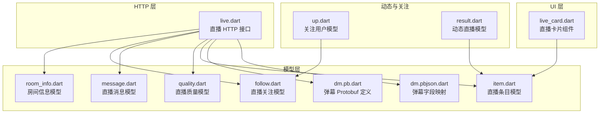
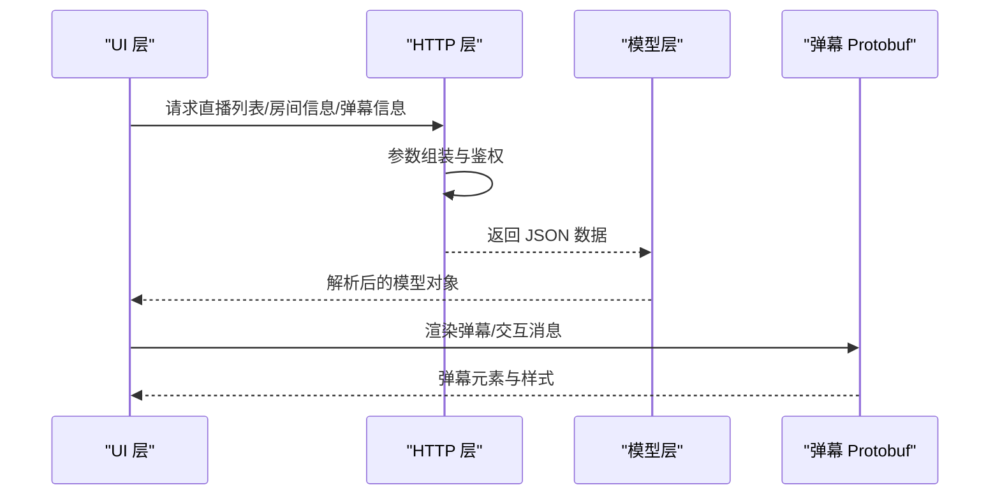
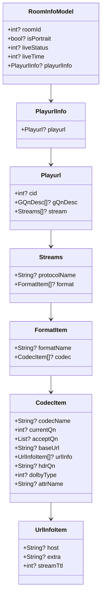
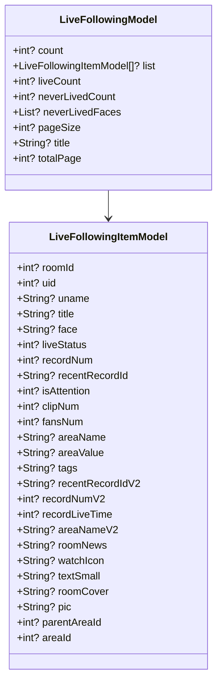
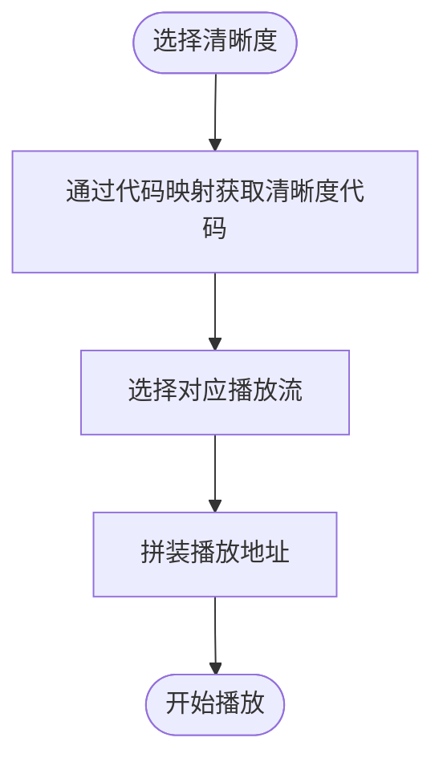
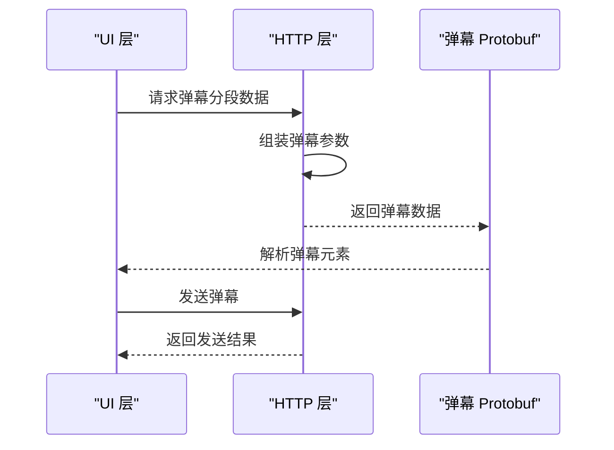
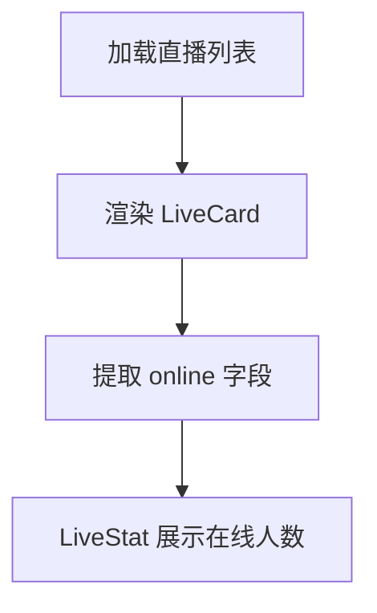
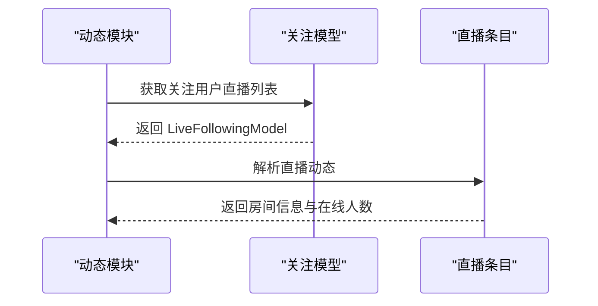
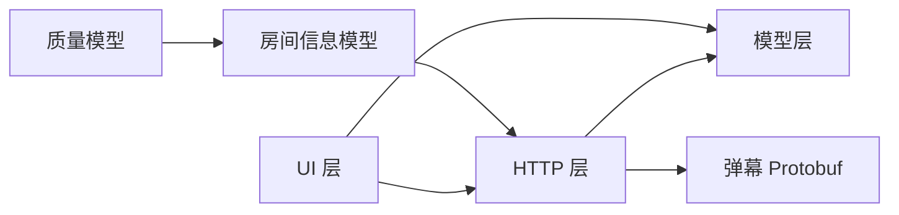

# 直播模型

<cite>
**本文档引用的文件**
- [room_info.dart](file://lib/models/live/room_info.dart)
- [follow.dart](file://lib/models/live/follow.dart)
- [message.dart](file://lib/models/live/message.dart)
- [quality.dart](file://lib/models/live/quality.dart)
- [item.dart](file://lib/models/live/item.dart)
- [live.dart](file://lib/http/live.dart)
- [dm.pb.dart](file://lib/models/danmaku/dm.pb.dart)
- [dm.pbjson.dart](file://lib/models/danmaku/dm.pbjson.dart)
- [live_card.dart](file://lib/common/widgets/live_card.dart)
- [up.dart](file://lib/models/dynamics/up.dart)
- [result.dart](file://lib/models/dynamics/result.dart)
</cite>

## 目录
1. [简介](#简介)
2. [项目结构](#项目结构)
3. [核心组件](#核心组件)
4. [架构概览](#架构概览)
5. [详细组件分析](#详细组件分析)
6. [依赖关系分析](#依赖关系分析)
7. [性能考量](#性能考量)
8. [故障排查指南](#故障排查指南)
9. [结论](#结论)
10. [附录](#附录)

## 简介
本文件系统性梳理直播模型体系，围绕直播房间信息模型（LiveRoomInfo）、直播关注模型（LiveFollow）、直播消息模型（LiveMessage）、直播质量模型（LiveQuality）等核心数据结构进行设计原理与实现细节解析。同时覆盖直播房间状态管理、观众数量、弹幕系统与互动功能的数据结构，直播消息的实时传输协议、消息类型分类与持久化机制，以及 WebSocket 连接处理、消息队列管理与断线重连策略，并给出性能优化、延迟控制与并发处理建议及最佳实践。

## 项目结构
直播相关代码主要分布在以下模块：
- 模型层：lib/models/live 下的房间信息、关注、消息、质量、房间条目等模型；lib/models/danmaku 下的弹幕 Protobuf 定义
- HTTP 层：lib/http/live.dart 提供直播列表、房间信息、弹幕信息、发送弹幕、关注列表等接口封装
- UI 组件：lib/common/widgets/live_card.dart 展示直播卡片与在线人数统计
- 动态与关注：lib/models/dynamics/up.dart、lib/models/dynamics/result.dart 提供关注用户与动态中直播相关信息



**图表来源**
- [room_info.dart:1-159](file://lib/models/live/room_info.dart#L1-L159)
- [follow.dart:1-127](file://lib/models/live/follow.dart#L1-L127)
- [message.dart:1-102](file://lib/models/live/message.dart#L1-L102)
- [quality.dart:1-44](file://lib/models/live/quality.dart#L1-L44)
- [item.dart:1-78](file://lib/models/live/item.dart#L1-L78)
- [live.dart:1-162](file://lib/http/live.dart#L1-L162)
- [dm.pb.dart:1-800](file://lib/models/danmaku/dm.pb.dart#L1-L800)
- [dm.pbjson.dart:1851-1893](file://lib/models/danmaku/dm.pbjson.dart#L1851-L1893)
- [live_card.dart:1-119](file://lib/common/widgets/live_card.dart#L1-L119)
- [up.dart:1-131](file://lib/models/dynamics/up.dart#L1-L131)
- [result.dart:750-849](file://lib/models/dynamics/result.dart#L750-L849)

**章节来源**
- [room_info.dart:1-159](file://lib/models/live/room_info.dart#L1-L159)
- [follow.dart:1-127](file://lib/models/live/follow.dart#L1-L127)
- [message.dart:1-102](file://lib/models/live/message.dart#L1-L102)
- [quality.dart:1-44](file://lib/models/live/quality.dart#L1-L44)
- [item.dart:1-78](file://lib/models/live/item.dart#L1-L78)
- [live.dart:1-162](file://lib/http/live.dart#L1-L162)
- [dm.pb.dart:1-800](file://lib/models/danmaku/dm.pb.dart#L1-L800)
- [dm.pbjson.dart:1851-1893](file://lib/models/danmaku/dm.pbjson.dart#L1851-L1893)
- [live_card.dart:1-119](file://lib/common/widgets/live_card.dart#L1-L119)
- [up.dart:1-131](file://lib/models/dynamics/up.dart#L1-L131)
- [result.dart:750-849](file://lib/models/dynamics/result.dart#L750-L849)

## 核心组件
- 直播房间信息模型（RoomInfoModel）
  - 描述房间基础信息、直播状态、播放流配置与清晰度描述
  - 关键字段：房间 ID、横竖屏标识、直播状态、直播开始时间、播放流信息
  - 播放流信息包含协议、格式、编解码、清晰度列表与 URL 信息
- 直播关注模型（LiveFollowingModel/LiveFollowingItemModel）
  - 描述用户关注的主播直播状态、封面、标题、分区等
  - 关键字段：房间 ID、UID、昵称、直播状态、粉丝数、分区信息等
- 直播消息模型（LiveMessageModel/LiveSuperChatMessage）
  - 描述弹幕、醒目留言、在线人数、加入、关注等消息类型
  - 消息颜色支持十六进制到 RGB 的转换
- 直播质量模型（LiveQuality）
  - 清晰度枚举与代码映射、描述文本映射
  - 支持从代码反查清晰度等级
- 直播条目模型（LiveItemModel）
  - 列表页展示用，包含标题、在线人数、封面、分区等
- 弹幕 Protobuf 模型（dm.pb.dart）
  - 定义弹幕元素、命令弹幕、分段弹幕等结构
  - 包含弹幕发送、AI 标识、块状弹幕等字段

**章节来源**
- [room_info.dart:1-159](file://lib/models/live/room_info.dart#L1-L159)
- [follow.dart:1-127](file://lib/models/live/follow.dart#L1-L127)
- [message.dart:1-102](file://lib/models/live/message.dart#L1-L102)
- [quality.dart:1-44](file://lib/models/live/quality.dart#L1-L44)
- [item.dart:1-78](file://lib/models/live/item.dart#L1-L78)
- [dm.pb.dart:1346-7524](file://lib/models/danmaku/dm.pb.dart#L1346-L7524)

## 架构概览
直播数据从 HTTP 接口获取，经由模型层解析后进入 UI 层渲染。弹幕通过 Protobuf 结构定义，消息类型在模型层统一抽象，质量选择通过清晰度枚举与代码映射实现。



**图表来源**
- [live.dart:1-162](file://lib/http/live.dart#L1-L162)
- [room_info.dart:1-159](file://lib/models/live/room_info.dart#L1-L159)
- [message.dart:1-102](file://lib/models/live/message.dart#L1-L102)
- [dm.pb.dart:1346-7524](file://lib/models/danmaku/dm.pb.dart#L1346-L7524)

## 详细组件分析

### 直播房间信息模型（RoomInfoModel）
- 设计要点
  - 分层嵌套模型：RoomInfoModel -> PlayurlInfo -> Playurl -> Streams/FormatItem/CodecItem -> UrlInfoItem
  - 清晰度描述与 HDR/杜比等属性通过 GQnDesc/CodecItem 字段表达
  - 支持多协议、多格式、多编解码组合，便于客户端按网络环境选择最优流
- 关键流程
  - HTTP 层调用房间信息接口，传入房间 ID 与清晰度参数
  - 模型层递归解析 JSON，构建完整播放流树
  - UI 层根据选择的清晰度与协议生成播放地址



**图表来源**
- [room_info.dart:1-159](file://lib/models/live/room_info.dart#L1-L159)

**章节来源**
- [room_info.dart:1-159](file://lib/models/live/room_info.dart#L1-L159)
- [live.dart:30-51](file://lib/http/live.dart#L30-L51)

### 直播关注模型（LiveFollowingModel）
- 设计要点
  - 关注列表聚合：count、liveCount、neverLivedCount、分页信息
  - 条目模型包含房间 ID、UID、昵称、直播状态、封面、分区、粉丝数等
- 关键流程
  - HTTP 层请求“我的关注正在直播”接口
  - 模型层解析列表并逐项构造条目模型
  - UI 层展示关注用户的直播状态与封面



**图表来源**
- [follow.dart:1-127](file://lib/models/live/follow.dart#L1-L127)

**章节来源**
- [follow.dart:1-127](file://lib/models/live/follow.dart#L1-L127)
- [live.dart:126-147](file://lib/http/live.dart#L126-L147)

### 直播消息模型（LiveMessageModel）
- 设计要点
  - 消息类型：普通弹幕、醒目留言、在线人数、加入、关注
  - 颜色模型：支持从整数颜色值转换为 RGB，并输出十六进制字符串
  - 支持表情映射与用户头像、UID 等扩展字段
- 关键流程
  - HTTP 层获取弹幕信息与发送弹幕
  - 模型层解析消息类型与颜色，构建消息对象
  - UI 层根据类型渲染不同样式与交互

```mermaid
classDiagram
class LiveMessageModel {
+LiveMessageType type
+String userName
+String? message
+dynamic data
+String? face
+int? uid
+Map~String, dynamic~? emots
+LiveMessageColor color
}
class LiveSuperChatMessage {
+String backgroundBottomColor
+String backgroundColor
+DateTime endTime
+String face
+String message
+String price
+DateTime startTime
+String userName
}
class LiveMessageColor {
+int r
+int g
+int b
+toString()
+numberToColor(int)
}
enum LiveMessageType {
+chat
+superChat
+online
+join
+follow
}
LiveMessageModel --> LiveMessageColor
LiveSuperChatMessage --> LiveMessageModel
```

**图表来源**
- [message.dart:1-102](file://lib/models/live/message.dart#L1-L102)

**章节来源**
- [message.dart:1-102](file://lib/models/live/message.dart#L1-L102)
- [live.dart:71-124](file://lib/http/live.dart#L71-L124)

### 直播质量模型（LiveQuality）
- 设计要点
  - 清晰度枚举与代码映射：dolby(杜比)、super4K(4K)、origin(原画)、bluRay(蓝光)、superHD(超清)、smooth(高清)、flunt(流畅)
  - 代码与描述文本双向映射，支持从代码反查清晰度等级
- 关键流程
  - UI 层选择清晰度，通过代码映射选择对应流
  - HTTP 层传入 qn 参数，服务端返回对应清晰度的播放地址



**图表来源**
- [quality.dart:1-44](file://lib/models/live/quality.dart#L1-L44)

**章节来源**
- [quality.dart:1-44](file://lib/models/live/quality.dart#L1-L44)
- [room_info.dart:55-159](file://lib/models/live/room_info.dart#L55-L159)

### 弹幕系统与 Protobuf 定义
- 设计要点
  - 弹幕元素结构：CommandDm、DmSegMobileReply 等
  - 支持 AI 标识、块状弹幕、分段弹幕等高级特性
  - 弹幕字段映射：如 text_input、check_box、toast、bubble、label、post_status 等
- 关键流程
  - HTTP 层获取弹幕分段数据
  - Protobuf 解析弹幕元素，渲染到 UI
  - 支持弹幕发送与鉴权参数



**图表来源**
- [live.dart:71-124](file://lib/http/live.dart#L71-L124)
- [dm.pb.dart:1346-7524](file://lib/models/danmaku/dm.pb.dart#L1346-L7524)
- [dm.pbjson.dart:1851-1893](file://lib/models/danmaku/dm.pbjson.dart#L1851-L1893)

**章节来源**
- [dm.pb.dart:1346-7524](file://lib/models/danmaku/dm.pb.dart#L1346-L7524)
- [dm.pbjson.dart:1851-1893](file://lib/models/danmaku/dm.pbjson.dart#L1851-L1893)
- [live.dart:71-124](file://lib/http/live.dart#L71-L124)

### 直播卡片与在线人数展示
- 设计要点
  - LiveCard 组件展示直播卡片，包含标题、UP 主名、在线人数等
  - 在线人数通过 LiveStat 组件展示，来源于直播条目模型的 online 字段
- 关键流程
  - 列表页使用 LiveCard 渲染每个直播条目
  - LiveStat 读取 online 字段并更新 UI



**图表来源**
- [live_card.dart:1-119](file://lib/common/widgets/live_card.dart#L1-L119)
- [item.dart:1-78](file://lib/models/live/item.dart#L1-L78)

**章节来源**
- [live_card.dart:1-119](file://lib/common/widgets/live_card.dart#L1-L119)
- [item.dart:1-78](file://lib/models/live/item.dart#L1-L78)

### 动态中的直播信息
- 设计要点
  - FollowUpModel 提供关注用户中正在直播的集合
  - DynamicLiveModel/DynamicLive2Model 描述动态中直播相关内容
- 关键流程
  - 获取关注 UP 与直播状态
  - 动态中解析直播动态，提取房间 ID、标题、封面、在线人数等



**图表来源**
- [up.dart:1-131](file://lib/models/dynamics/up.dart#L1-L131)
- [result.dart:750-849](file://lib/models/dynamics/result.dart#L750-L849)

**章节来源**
- [up.dart:1-131](file://lib/models/dynamics/up.dart#L1-L131)
- [result.dart:750-849](file://lib/models/dynamics/result.dart#L750-L849)

## 依赖关系分析
- HTTP 层依赖模型层进行数据解析
- UI 层依赖 HTTP 层与模型层
- 弹幕系统依赖 Protobuf 定义与 HTTP 层提供的弹幕接口
- 清晰度选择依赖质量模型与房间信息模型中的清晰度描述



**图表来源**
- [live.dart:1-162](file://lib/http/live.dart#L1-L162)
- [room_info.dart:1-159](file://lib/models/live/room_info.dart#L1-L159)
- [quality.dart:1-44](file://lib/models/live/quality.dart#L1-L44)
- [dm.pb.dart:1-800](file://lib/models/danmaku/dm.pb.dart#L1-L800)

**章节来源**
- [live.dart:1-162](file://lib/http/live.dart#L1-L162)
- [room_info.dart:1-159](file://lib/models/live/room_info.dart#L1-L159)
- [quality.dart:1-44](file://lib/models/live/quality.dart#L1-L44)
- [dm.pb.dart:1-800](file://lib/models/danmaku/dm.pb.dart#L1-L800)

## 性能考量
- 清晰度选择
  - 使用质量模型的代码映射快速定位目标清晰度，减少 UI 层判断逻辑
  - 建议在网络波动时自动回退到更高容错的清晰度（如流畅）
- 播放流加载
  - 优先选择低延迟协议与格式，结合当前网络状况动态切换
  - 缓存播放地址与 TTL，避免频繁请求
- 弹幕渲染
  - 对弹幕元素进行批量渲染与回收，避免频繁创建销毁
  - 合理设置弹幕密度与透明度，平衡视觉效果与性能
- 并发处理
  - 将 HTTP 请求与 UI 更新分离，避免阻塞主线程
  - 使用异步加载与懒加载策略，降低首帧压力

## 故障排查指南
- 房间信息为空或异常
  - 检查 HTTP 层返回状态码与消息
  - 确认房间 ID 与清晰度参数正确
- 弹幕无法显示
  - 确认弹幕接口返回正常
  - 检查 Protobuf 解析是否成功
  - 验证弹幕字段映射是否匹配
- 清晰度不可用
  - 检查质量模型映射是否正确
  - 确认服务器返回的清晰度列表包含所选清晰度
- 在线人数不更新
  - 检查直播卡片组件是否正确读取 online 字段
  - 确认数据源是否包含最新在线人数

**章节来源**
- [live.dart:1-162](file://lib/http/live.dart#L1-L162)
- [dm.pb.dart:1346-7524](file://lib/models/danmaku/dm.pb.dart#L1346-L7524)
- [quality.dart:1-44](file://lib/models/live/quality.dart#L1-L44)
- [live_card.dart:1-119](file://lib/common/widgets/live_card.dart#L1-L119)

## 结论
直播模型以清晰的分层设计实现了房间信息、关注、消息、质量与弹幕等核心能力。通过质量模型与房间信息模型的配合，可灵活适配不同网络环境；通过消息模型与 Protobuf 定义，保障了弹幕系统的可扩展性与稳定性。建议在实际工程中结合性能考量与故障排查指南，持续优化播放体验与交互性能。

## 附录
- 最佳实践
  - 使用质量模型进行清晰度选择，避免硬编码清晰度数值
  - 对弹幕数据进行缓存与去重，提升渲染效率
  - 在 UI 层对异常状态进行降级处理，保证用户体验
- 扩展指南
  - 新增清晰度时同步更新质量模型映射
  - 新增弹幕类型时完善 Protobuf 定义与 UI 渲染逻辑
  - 对直播卡片进行主题化与可定制化扩展