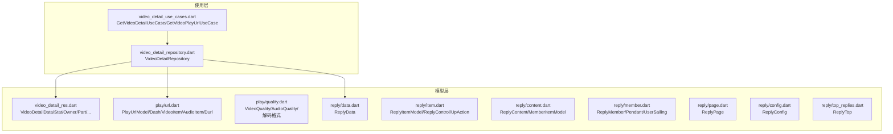
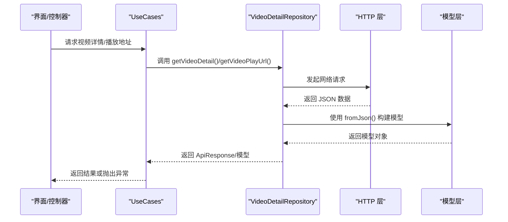
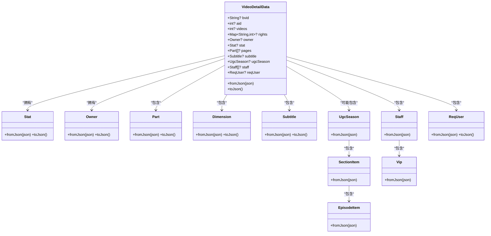
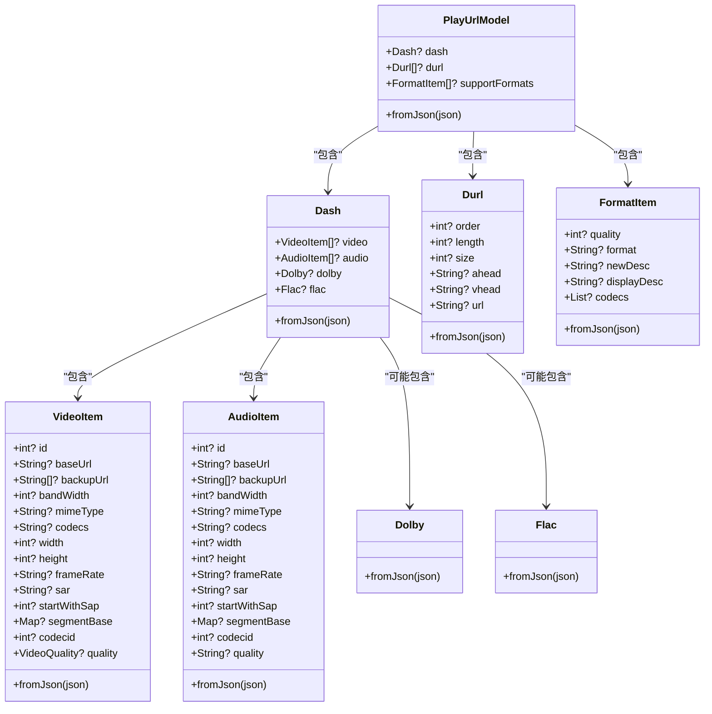
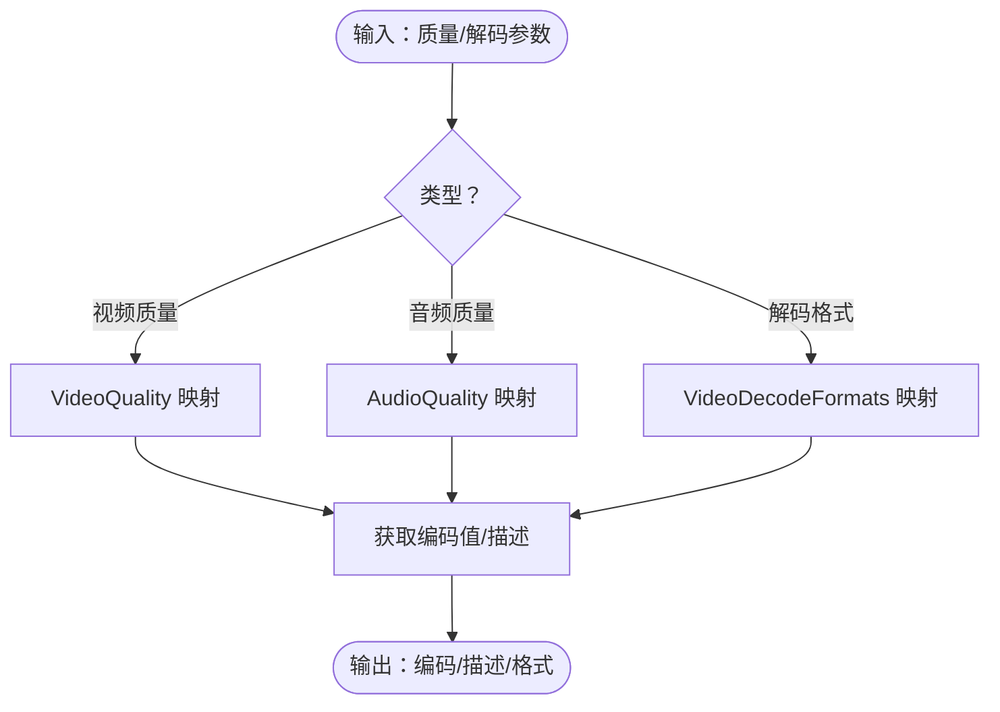
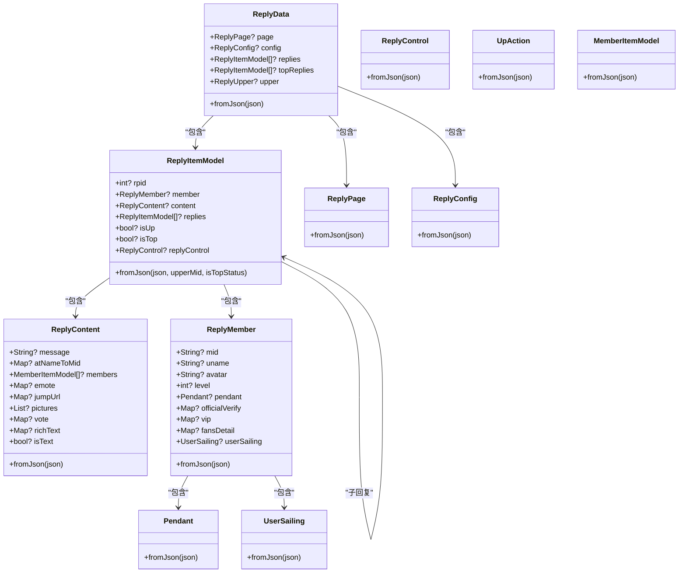
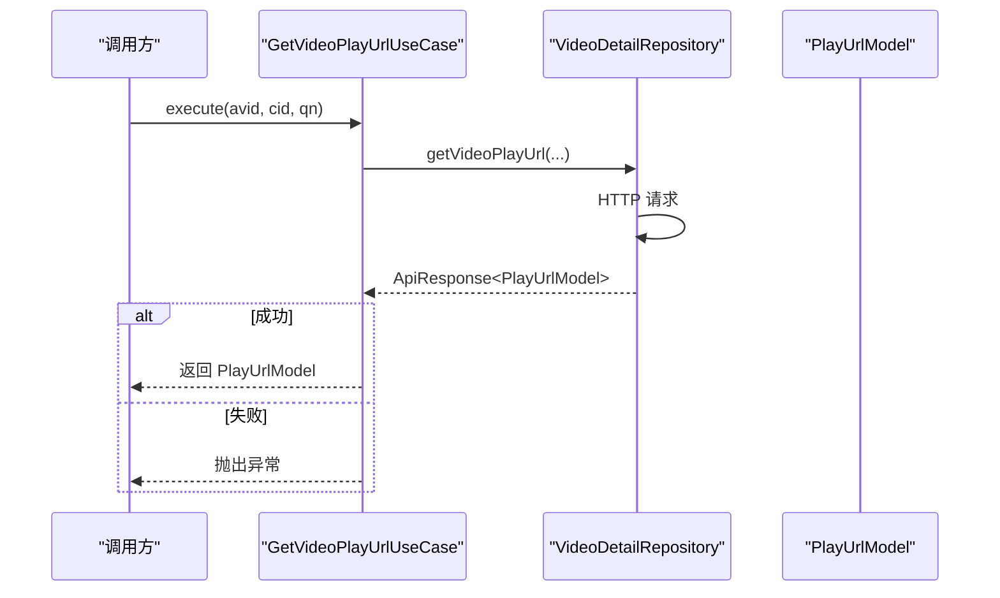
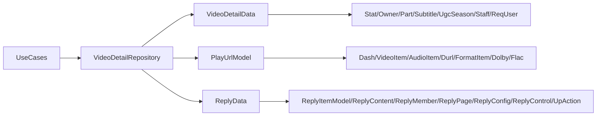

# 视频模型

<cite>
**本文引用的文件**
- [lib/models/video_detail_res.dart](file://lib/models/video_detail_res.dart)
- [lib/models/video/play/url.dart](file://lib/models/video/play/url.dart)
- [lib/models/video/play/quality.dart](file://lib/models/video/play/quality.dart)
- [lib/models/video/reply/data.dart](file://lib/models/video/reply/data.dart)
- [lib/models/video/reply/item.dart](file://lib/models/video/reply/item.dart)
- [lib/models/video/reply/page.dart](file://lib/models/video/reply/page.dart)
- [lib/models/video/reply/config.dart](file://lib/models/video/reply/config.dart)
- [lib/models/video/reply/content.dart](file://lib/models/video/reply/content.dart)
- [lib/models/video/reply/member.dart](file://lib/models/video/reply/member.dart)
- [lib/models/video/reply/top_replies.dart](file://lib/models/video/reply/top_replies.dart)
- [lib/features/video/data/video_detail_repository.dart](file://lib/features/video/data/video_detail_repository.dart)
- [lib/features/video/domain/video_detail_use_cases.dart](file://lib/features/video/domain/video_detail_use_cases.dart)
</cite>

## 目录
1. [简介](#简介)
2. [项目结构](#项目结构)
3. [核心组件](#核心组件)
4. [架构总览](#架构总览)
5. [详细组件分析](#详细组件分析)
6. [依赖关系分析](#依赖关系分析)
7. [性能考量](#性能考量)
8. [故障排查指南](#故障排查指南)
9. [结论](#结论)
10. [附录](#附录)

## 简介
本文件系统性梳理视频模型体系，围绕以下目标展开：
- 深入解析视频播放相关模型（PlayUrlModel、Dash、VideoItem、AudioItem、Durl、VideoQuality、AudioQuality 等），阐明其字段含义、质量映射、DASH/多段流结构及兼容性处理。
- 全面说明视频回复系统模型（ReplyData、ReplyItemModel、ReplyContent、ReplyMember、ReplyPage、ReplyConfig 等），解释评论层级、排序机制与内容过滤逻辑。
- 总结序列化实现、数据验证规则与错误处理机制，并给出缓存策略、CDN 优化与播放性能建议。
- 提供面向开发者的最佳实践与扩展指南。

## 项目结构
视频模型主要分布在以下位置：
- 视频详情与播放：models/video_detail_res.dart、models/video/play/*.dart
- 视频回复：models/video/reply/*.dart
- 使用层：features/video/data/video_detail_repository.dart、features/video/domain/video_detail_use_cases.dart

图表来源
- [lib/models/video_detail_res.dart:34-218](file://lib/models/video_detail_res.dart#L34-L218)
- [lib/models/video/play/url.dart:3-66](file://lib/models/video/play/url.dart#L3-L66)
- [lib/models/video/play/quality.dart:3-138](file://lib/models/video/play/quality.dart#L3-L138)
- [lib/models/video/reply/data.dart:7-40](file://lib/models/video/reply/data.dart#L7-L40)
- [lib/models/video/reply/item.dart:4-104](file://lib/models/video/reply/item.dart#L4-L104)
- [lib/models/video/reply/content.dart:1-62](file://lib/models/video/reply/content.dart#L1-L62)
- [lib/models/video/reply/member.dart:1-70](file://lib/models/video/reply/member.dart#L1-L70)
- [lib/models/video/reply/page.dart:1-21](file://lib/models/video/reply/page.dart#L1-L21)
- [lib/models/video/reply/config.dart:1-18](file://lib/models/video/reply/config.dart#L1-L18)
- [lib/models/video/reply/top_replies.dart:1-2](file://lib/models/video/reply/top_replies.dart#L1-L2)
- [lib/features/video/data/video_detail_repository.dart:10-36](file://lib/features/video/data/video_detail_repository.dart#L10-L36)
- [lib/features/video/domain/video_detail_use_cases.dart:8-48](file://lib/features/video/domain/video_detail_use_cases.dart#L8-L48)

章节来源
- [lib/models/video_detail_res.dart:1-732](file://lib/models/video_detail_res.dart#L1-L732)
- [lib/models/video/play/url.dart:1-282](file://lib/models/video/play/url.dart#L1-L282)
- [lib/models/video/play/quality.dart:1-138](file://lib/models/video/play/quality.dart#L1-L138)
- [lib/models/video/reply/data.dart:1-41](file://lib/models/video/reply/data.dart#L1-L41)
- [lib/models/video/reply/item.dart:1-160](file://lib/models/video/reply/item.dart#L1-L160)
- [lib/models/video/reply/content.dart:1-62](file://lib/models/video/reply/content.dart#L1-L62)
- [lib/models/video/reply/member.dart:1-70](file://lib/models/video/reply/member.dart#L1-L70)
- [lib/models/video/reply/page.dart:1-21](file://lib/models/video/reply/page.dart#L1-L21)
- [lib/models/video/reply/config.dart:1-18](file://lib/models/video/reply/config.dart#L1-L18)
- [lib/models/video/reply/top_replies.dart:1-2](file://lib/models/video/reply/top_replies.dart#L1-L2)
- [lib/features/video/data/video_detail_repository.dart:1-36](file://lib/features/video/data/video_detail_repository.dart#L1-L36)
- [lib/features/video/domain/video_detail_use_cases.dart:1-48](file://lib/features/video/domain/video_detail_use_cases.dart#L1-L48)

## 核心组件
- 视频详情模型：VideoDetailData 及其子模型（Stat、Owner、Part、Dimension、Subtitle、UgcSeason、Staff、ReqUser 等），用于承载视频元信息、统计、分P、字幕、剧集等。
- 播放模型：PlayUrlModel 及其子模型（Dash、VideoItem、AudioItem、Durl、FormatItem、Dolby、Flac），描述 DASH 多轨流与传统多段直链的播放参数与质量选择。
- 质量枚举：VideoQuality、AudioQuality、VideoDecodeFormats，提供质量编码、描述与解码格式映射。
- 回复模型：ReplyData、ReplyItemModel、ReplyContent、ReplyMember、ReplyPage、ReplyConfig、ReplyControl、UpAction 等，支撑评论树、置顶评论、UP 主标识与控制信息。
- 使用用例：GetVideoDetailUseCase、GetVideoPlayUrlUseCase，封装仓库调用与错误处理。

章节来源
- [lib/models/video_detail_res.dart:34-218](file://lib/models/video_detail_res.dart#L34-L218)
- [lib/models/video/play/url.dart:3-282](file://lib/models/video/play/url.dart#L3-L282)
- [lib/models/video/play/quality.dart:3-138](file://lib/models/video/play/quality.dart#L3-L138)
- [lib/models/video/reply/data.dart:7-40](file://lib/models/video/reply/data.dart#L7-L40)
- [lib/models/video/reply/item.dart:4-160](file://lib/models/video/reply/item.dart#L4-L160)
- [lib/features/video/domain/video_detail_use_cases.dart:8-48](file://lib/features/video/domain/video_detail_use_cases.dart#L8-L48)

## 架构总览
视频模型在应用中的流转路径如下：
- 使用层通过 Use Cases 调用 Repository 获取视频详情与播放地址。
- Repository 将 HTTP 响应反序列化为模型对象，供上层业务使用。
- 播放器根据 PlayUrlModel 的 DASH 或 DURL 结构选择合适的质量与清晰度。

图表来源
- [lib/features/video/domain/video_detail_use_cases.dart:14-48](file://lib/features/video/domain/video_detail_use_cases.dart#L14-L48)
- [lib/features/video/data/video_detail_repository.dart:17-36](file://lib/features/video/data/video_detail_repository.dart#L17-L36)
- [lib/models/video_detail_res.dart:112-166](file://lib/models/video_detail_res.dart#L112-L166)
- [lib/models/video/play/url.dart:43-65](file://lib/models/video/play/url.dart#L43-L65)

## 详细组件分析

### 视频详情模型（VideoDetailData）
- 设计要点
  - 字段覆盖全面：包括基础元信息（标题、封面、发布时间）、统计信息（播放、点赞、投币、分享、历史最高排名）、权利声明（rights）、作者信息（owner）、分P（pages）、字幕（subtitle）、剧集（ugcSeason）、人员（staff）、登录态相关（reqUser）等。
  - 子模型解耦：Stat、Owner、Part、Dimension、Subtitle、UgcSeason、Staff、ReqUser 等均独立建模，便于按需使用。
  - 可空与默认：大量字段为可空类型，fromJson 中对 null 进行分支处理；部分字段提供默认值或空集合。
- 序列化与反序列化
  - 提供 fromJson 和 toJson，支持嵌套子模型递归转换。
  - 特殊处理：descV2、pages、subtitle、ugcSeason、staff、reqUser 等字段在反序列化时进行类型转换与空值判断。
- 错误处理
  - 仓库层在响应失败时返回错误信息；Use Case 层在数据为空时抛出异常，便于上层统一处理。

图表来源
- [lib/models/video_detail_res.dart:34-218](file://lib/models/video_detail_res.dart#L34-L218)
- [lib/models/video_detail_res.dart:438-507](file://lib/models/video_detail_res.dart#L438-L507)
- [lib/models/video_detail_res.dart:349-377](file://lib/models/video_detail_res.dart#L349-L377)
- [lib/models/video_detail_res.dart:379-436](file://lib/models/video_detail_res.dart#L379-L436)
- [lib/models/video_detail_res.dart:254-285](file://lib/models/video_detail_res.dart#L254-L285)
- [lib/models/video_detail_res.dart:509-536](file://lib/models/video_detail_res.dart#L509-L536)
- [lib/models/video_detail_res.dart:558-605](file://lib/models/video_detail_res.dart#L558-L605)
- [lib/models/video_detail_res.dart:607-631](file://lib/models/video_detail_res.dart#L607-L631)
- [lib/models/video_detail_res.dart:633-669](file://lib/models/video_detail_res.dart#L633-L669)
- [lib/models/video_detail_res.dart:671-709](file://lib/models/video_detail_res.dart#L671-L709)
- [lib/models/video_detail_res.dart:711-731](file://lib/models/video_detail_res.dart#L711-L731)

章节来源
- [lib/models/video_detail_res.dart:34-218](file://lib/models/video_detail_res.dart#L34-L218)

### 播放模型（PlayUrlModel、Dash、VideoItem、AudioItem、Durl、FormatItem、Dolby、Flac）
- 设计要点
  - 支持 DASH 与传统多段直链两种模式：DASH 包含独立的音视频轨；DURL 列表按顺序拼接播放。
  - VideoItem/AudioItem 描述具体质量、分辨率、编解码、带宽等；FormatItem 描述支持格式列表。
  - Quality 映射：VideoQuality 与 AudioQuality 通过内部编码表与枚举值互转，确保与后端约定一致。
- 字段与兼容性
  - backupUrl、segmentBase、startWithSap、sar 等字段保留播放器扩展能力。
  - 解码格式映射：VideoDecodeFormats 提供字符串与枚举之间的转换，便于识别 AV1/HEVC/AVC 等。
- 错误处理
  - 仓库层在响应失败时返回错误；Use Case 层在数据为空时抛出异常。

图表来源
- [lib/models/video/play/url.dart:3-282](file://lib/models/video/play/url.dart#L3-L282)

章节来源
- [lib/models/video/play/url.dart:3-282](file://lib/models/video/play/url.dart#L3-L282)

### 质量与解码格式（VideoQuality、AudioQuality、VideoDecodeFormats）
- 设计要点
  - VideoQuality：提供从枚举到编码值的映射，以及从编码值回推枚举的能力；描述文本用于 UI 展示。
  - AudioQuality：同样提供编码与描述映射。
  - VideoDecodeFormats：提供字符串与枚举之间的双向映射，支持从编码字符串前缀识别解码格式。
- 使用建议
  - 优先使用编码值进行网络请求参数传递，避免字符串不一致导致的兼容问题。
  - UI 展示使用描述文本，提升可读性。

图表来源
- [lib/models/video/play/quality.dart:3-138](file://lib/models/video/play/quality.dart#L3-L138)

章节来源
- [lib/models/video/play/quality.dart:3-138](file://lib/models/video/play/quality.dart#L3-L138)

### 视频回复模型（ReplyData、ReplyItemModel、ReplyContent、ReplyMember、ReplyPage、ReplyConfig）
- 设计要点
  - ReplyData：聚合分页信息（ReplyPage）、配置（ReplyConfig）、普通评论列表（replies）、置顶评论（topReplies）与 UP 主信息（upper）。
  - ReplyItemModel：评论树节点，包含用户信息（ReplyMember）、内容（ReplyContent）、回复列表（replies）、UP 主标识（isUp）、置顶标记（isTop）、控制信息（ReplyControl）等。
  - ReplyContent：消息正文、@ 用户、表情、图片、投票、富文本等，同时计算是否“纯文本”以决定折叠策略。
  - ReplyMember：用户头像、等级、徽章、官方认证、VIP、粉丝卡片等。
  - ReplyPage/ReplyConfig：分页计数、显示开关等。
- 排序与层级
  - 评论树通过 root、parent、dialog 等字段构建层级；顶层 replies 与子层 replies 递归构建。
  - 置顶评论与普通评论分别加载，置顶标记 isTop 由上层 mid 对比设置。
- 内容过滤
  - reply_control 中的 sub_reply_entry_text 用于判断是否展示子回复入口，结合阈值判断是否显示。
  - location 字段解析为地理位置信息，用于展示。

图表来源
- [lib/models/video/reply/data.dart:7-40](file://lib/models/video/reply/data.dart#L7-L40)
- [lib/models/video/reply/item.dart:4-160](file://lib/models/video/reply/item.dart#L4-L160)
- [lib/models/video/reply/content.dart:1-62](file://lib/models/video/reply/content.dart#L1-L62)
- [lib/models/video/reply/member.dart:1-70](file://lib/models/video/reply/member.dart#L1-L70)
- [lib/models/video/reply/page.dart:1-21](file://lib/models/video/reply/page.dart#L1-L21)
- [lib/models/video/reply/config.dart:1-18](file://lib/models/video/reply/config.dart#L1-L18)

章节来源
- [lib/models/video/reply/data.dart:7-40](file://lib/models/video/reply/data.dart#L7-L40)
- [lib/models/video/reply/item.dart:65-103](file://lib/models/video/reply/item.dart#L65-L103)
- [lib/models/video/reply/content.dart:26-45](file://lib/models/video/reply/content.dart#L26-L45)
- [lib/models/video/reply/member.dart:25-38](file://lib/models/video/reply/member.dart#L25-L38)
- [lib/models/video/reply/page.dart:14-19](file://lib/models/video/reply/page.dart#L14-L19)
- [lib/models/video/reply/config.dart:12-16](file://lib/models/video/reply/config.dart#L12-L16)

### 使用流程与错误处理
- 视频详情与播放地址获取
  - Use Cases 分别封装了获取详情与播放地址的执行逻辑，Repository 负责网络请求与模型反序列化。
  - 当响应失败或数据为空时，Use Case 抛出异常，便于上层统一处理。
- 错误处理
  - 仓库层返回 ApiResponse，包含成功/失败状态与消息；Use Case 层在失败时抛出异常，保证调用方明确感知错误。

图表来源
- [lib/features/video/domain/video_detail_use_cases.dart:29-48](file://lib/features/video/domain/video_detail_use_cases.dart#L29-L48)
- [lib/features/video/data/video_detail_repository.dart:17-36](file://lib/features/video/data/video_detail_repository.dart#L17-L36)
- [lib/models/video/play/url.dart:43-65](file://lib/models/video/play/url.dart#L43-L65)

章节来源
- [lib/features/video/domain/video_detail_use_cases.dart:8-48](file://lib/features/video/domain/video_detail_use_cases.dart#L8-L48)
- [lib/features/video/data/video_detail_repository.dart:10-36](file://lib/features/video/data/video_detail_repository.dart#L10-L36)

## 依赖关系分析
- 组件内聚与耦合
  - VideoDetailData 与各子模型松耦合，通过嵌套模型进行组合，便于按需使用。
  - PlayUrlModel 与 Dash/VideoItem/AudioItem 等强关联，形成播放参数的完整描述。
  - ReplyData 作为容器类，聚合多个子模型，职责清晰。
- 外部依赖
  - 使用层依赖仓库层提供的模型构造能力；仓库层依赖 HTTP 层返回的原始 JSON。
- 循环依赖
  - 模型之间未见循环依赖；评论树通过引用而非继承避免循环。

图表来源
- [lib/features/video/data/video_detail_repository.dart:10-36](file://lib/features/video/data/video_detail_repository.dart#L10-L36)
- [lib/models/video_detail_res.dart:34-218](file://lib/models/video_detail_res.dart#L34-L218)
- [lib/models/video/play/url.dart:3-282](file://lib/models/video/play/url.dart#L3-L282)
- [lib/models/video/reply/data.dart:7-40](file://lib/models/video/reply/data.dart#L7-L40)

章节来源
- [lib/features/video/data/video_detail_repository.dart:10-36](file://lib/features/video/data/video_detail_repository.dart#L10-L36)
- [lib/models/video_detail_res.dart:34-218](file://lib/models/video_detail_res.dart#L34-L218)
- [lib/models/video/play/url.dart:3-282](file://lib/models/video/play/url.dart#L3-L282)
- [lib/models/video/reply/data.dart:7-40](file://lib/models/video/reply/data.dart#L7-L40)

## 性能考量
- 播放性能
  - 优先选择 DASH 模式以获得更佳的自适应能力与缓冲体验；在弱网环境下可动态切换质量。
  - 合理利用 backupUrl 与多段直链（DURL）作为备用路径，提升播放成功率。
  - 依据带宽与设备能力选择合适质量（VideoQuality），避免过高码率导致卡顿。
- CDN 与缓存
  - 播放地址通常具备较长有效期，可在本地缓存最近一次播放的地址与质量，减少重复请求。
  - 对于字幕、封面等静态资源，采用 CDN 缓存策略，结合 ETag/Last-Modified 实现条件请求。
- UI 与交互
  - 评论树渲染时采用虚拟列表与懒加载，避免一次性渲染大量节点。
  - 置顶评论与普通评论分离加载，降低首屏压力。
- 数据验证
  - 在 fromJson 中对可空字段进行判空与类型转换，防止运行时崩溃。
  - 对特殊字段如 location、sub_reply_entry_text 进行正则匹配与边界检查。

## 故障排查指南
- 常见问题
  - 播放地址为空：检查 Use Case 是否正确捕获仓库返回的错误信息；确认网络层返回状态与数据结构。
  - 评论树异常：核对 root、parent、dialog 字段是否正确；确认 isUp 与 isTop 标记的设置逻辑。
  - 质量映射失败：确认传入编码值是否在 VideoQuality/AudioQuality 的编码表范围内。
- 定位方法
  - 打印模型的 toJson 输出，核对关键字段是否缺失或类型不符。
  - 在仓库层增加日志记录请求参数与响应体，便于定位接口差异。
- 处理建议
  - 对于不可恢复的错误（如无效参数），直接抛出异常并提示用户重试。
  - 对于可恢复的网络错误，增加重试与退避策略。

章节来源
- [lib/features/video/domain/video_detail_use_cases.dart:21-26](file://lib/features/video/domain/video_detail_use_cases.dart#L21-L26)
- [lib/models/video/reply/item.dart:98-102](file://lib/models/video/reply/item.dart#L98-L102)
- [lib/models/video/play/quality.dart:35-49](file://lib/models/video/play/quality.dart#L35-L49)

## 结论
本视频模型体系以清晰的数据结构与完善的序列化/反序列化为基础，覆盖视频详情、播放参数与评论系统的全链路需求。通过质量枚举与解码格式映射，确保播放参数的稳定与可维护；通过容器模型与子模型解耦，提升扩展性与可测试性。建议在实际工程中结合 CDN 缓存与播放器自适应策略，持续优化用户体验。

## 附录
- 最佳实践
  - 使用枚举编码值作为网络参数，避免字符串差异引发的兼容问题。
  - 在 UI 层仅消费必要的字段，减少不必要的模型转换与渲染开销。
  - 对评论树进行分页与懒加载，结合虚拟列表提升滚动性能。
- 扩展指南
  - 新增播放质量：在 VideoQuality/AudioQuality 中补充编码与描述映射。
  - 新增解码格式：在 VideoDecodeFormats 中添加字符串与枚举映射。
  - 新增评论类型：在 ReplyItemModel 中扩展字段，并在 ReplyControl 中完善展示逻辑。