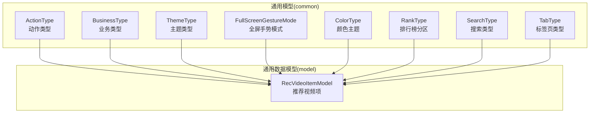
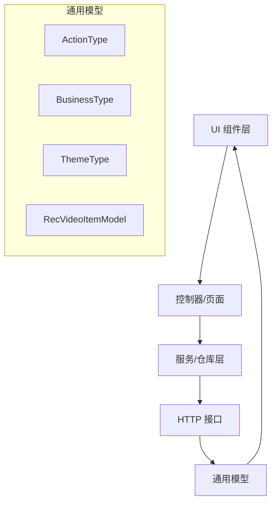
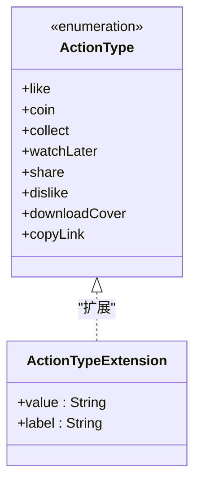
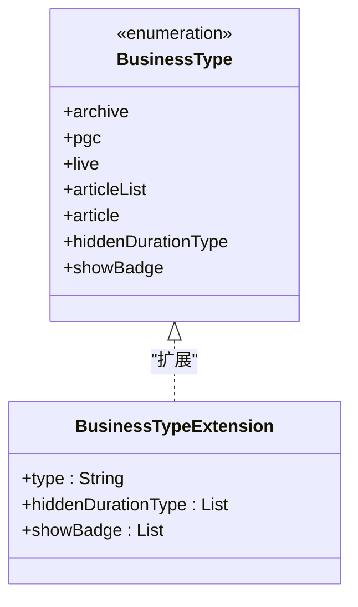
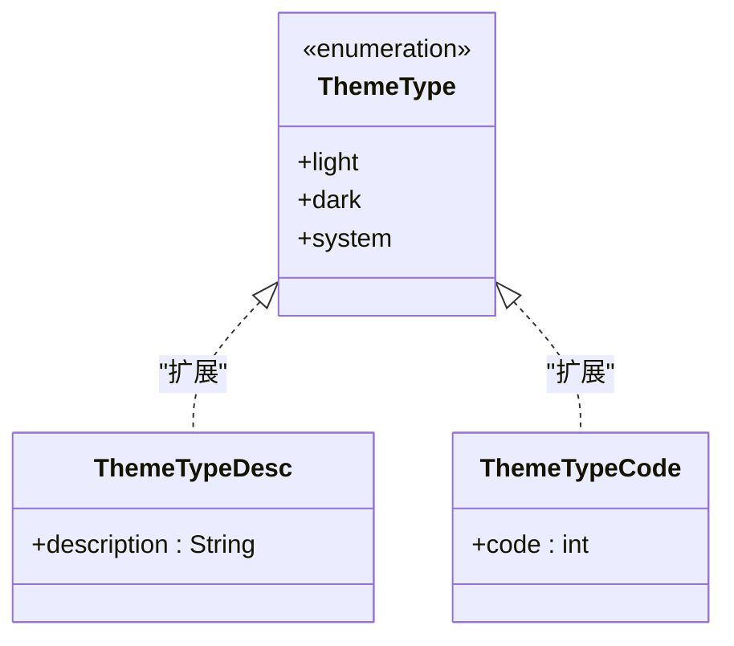
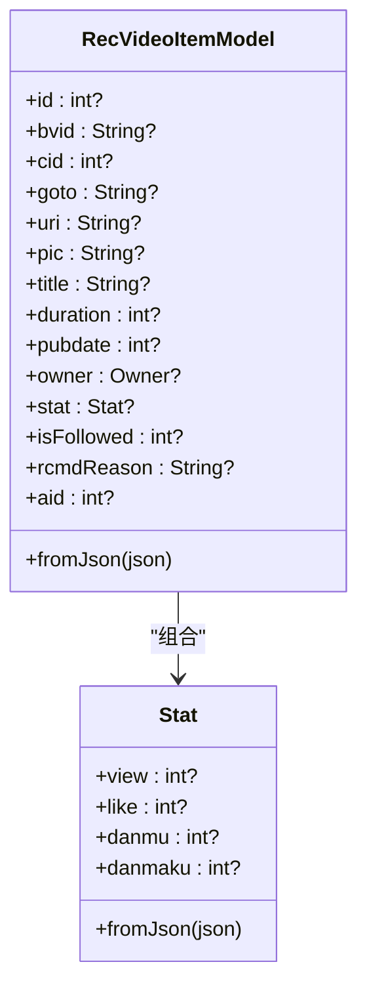
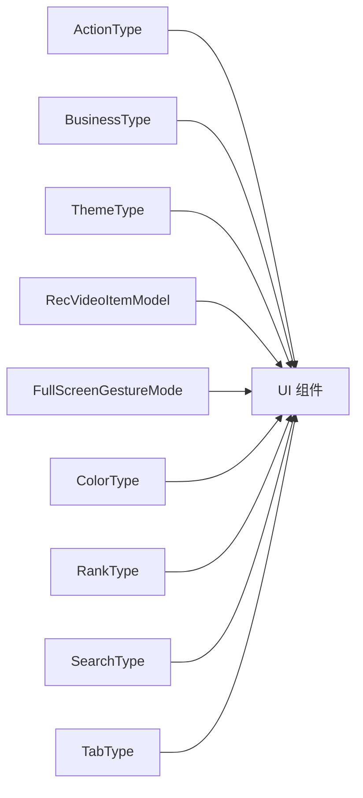

# 通用模型

<cite>
**本文引用的文件**
- [action_type.dart](file://lib/models/common/action_type.dart)
- [business_type.dart](file://lib/models/common/business_type.dart)
- [theme_type.dart](file://lib/models/common/theme_type.dart)
- [model_rec_video_item.dart](file://lib/models/model_rec_video_item.dart)
- [gesture_mode.dart](file://lib/models/common/gesture_mode.dart)
- [color_type.dart](file://lib/models/common/color_type.dart)
- [rank_type.dart](file://lib/models/common/rank_type.dart)
- [search_type.dart](file://lib/models/common/search_type.dart)
- [tab_type.dart](file://lib/models/common/tab_type.dart)
- [index.dart](file://lib/models/common/index.dart)
</cite>

## 目录
1. [引言](#引言)
2. [项目结构](#项目结构)
3. [核心组件](#核心组件)
4. [架构总览](#架构总览)
5. [详细组件分析](#详细组件分析)
6. [依赖分析](#依赖分析)
7. [性能考量](#性能考量)
8. [故障排查指南](#故障排查指南)
9. [结论](#结论)
10. [附录](#附录)

## 引言
本文件聚焦于应用中的“通用模型”体系，围绕动作类型模型（ActionType）、业务类型模型（BusinessType）、主题类型模型（ThemeType）、推荐视频项模型（ModelRecVideoItem）等跨模块通用数据结构进行系统化梳理。内容涵盖设计原则、实现细节、类型枚举与业务规则、扩展机制、向后兼容与版本管理策略、使用场景与最佳实践，以及与应用其他模型的协作关系。

## 项目结构
通用模型主要位于 lib/models/common 目录，采用按功能域分组的组织方式，便于跨页面与控制器复用；同时，推荐视频项模型位于 lib/models 根目录，作为跨模块通用的数据载体。

图表来源
- [action_type.dart:1-94](file://lib/models/common/action_type.dart#L1-L94)
- [business_type.dart:1-24](file://lib/models/common/business_type.dart#L1-L24)
- [theme_type.dart:1-14](file://lib/models/common/theme_type.dart#L1-L14)
- [model_rec_video_item.dart:1-75](file://lib/models/model_rec_video_item.dart#L1-L75)
- [gesture_mode.dart:1-13](file://lib/models/common/gesture_mode.dart#L1-L13)
- [color_type.dart:1-24](file://lib/models/common/color_type.dart#L1-L24)
- [rank_type.dart:1-197](file://lib/models/common/rank_type.dart#L1-L197)
- [search_type.dart:1-65](file://lib/models/common/search_type.dart#L1-L65)
- [tab_type.dart:1-57](file://lib/models/common/tab_type.dart#L1-L57)

章节来源
- [index.dart:1-5](file://lib/models/common/index.dart#L1-L5)

## 核心组件
- 动作类型模型（ActionType）：统一抽象用户可执行的操作集合，提供值映射与本地化标签，并配套菜单配置，便于在 UI 中一致呈现与调用。
- 业务类型模型（BusinessType）：抽象内容形态（普通视频、剧集、直播、文章等），提供类型字符串映射与业务行为（如是否隐藏时长、是否展示徽标）的判定逻辑。
- 主题类型模型（ThemeType）：抽象明暗主题与系统跟随策略，提供描述文本与编码值，支撑全局主题切换。
- 推荐视频项模型（ModelRecVideoItem）：跨模块通用的视频卡片数据载体，包含基础元信息、统计信息、UP 主信息、推荐原因等，具备兼容性别名字段，适配既有 UI 组件。

章节来源
- [action_type.dart:1-94](file://lib/models/common/action_type.dart#L1-L94)
- [business_type.dart:1-24](file://lib/models/common/business_type.dart#L1-L24)
- [theme_type.dart:1-14](file://lib/models/common/theme_type.dart#L1-L14)
- [model_rec_video_item.dart:1-75](file://lib/models/model_rec_video_item.dart#L1-L75)

## 架构总览
通用模型在应用中的定位是“跨模块共享的数据契约”，通过枚举与扩展方法提供稳定的语义边界，避免各业务模块重复定义相同概念。推荐视频项模型作为数据载体，承载来自不同接口的通用字段，经由 JSON 解析生成，供 UI 层渲染与交互。

图表来源
- [action_type.dart:1-94](file://lib/models/common/action_type.dart#L1-L94)
- [business_type.dart:1-24](file://lib/models/common/business_type.dart#L1-L24)
- [theme_type.dart:1-14](file://lib/models/common/theme_type.dart#L1-L14)
- [model_rec_video_item.dart:1-75](file://lib/models/model_rec_video_item.dart#L1-L75)

## 详细组件分析

### 动作类型模型（ActionType）
- 设计要点
  - 使用枚举统一表达用户操作集合，避免魔法字符串。
  - 通过扩展方法提供值映射与本地化标签，便于 UI 一致性展示。
  - 提供菜单配置列表，直接绑定图标、标签与动作值，降低 UI 与逻辑耦合。
- 业务规则
  - 每个动作值对应一个稳定字符串标识，用于与后端或埋点系统对齐。
  - 标签面向中文用户，确保界面文案统一。
- 扩展与兼容
  - 新增动作时，需同步更新扩展映射与菜单配置，保证 UI 与逻辑一致。
  - 若未来需要国际化，可在扩展中引入翻译函数，保持现有调用方式不变。

图表来源
- [action_type.dart:5-46](file://lib/models/common/action_type.dart#L5-L46)

章节来源
- [action_type.dart:1-94](file://lib/models/common/action_type.dart#L1-L94)

### 业务类型模型（BusinessType）
- 设计要点
  - 覆盖普通视频、剧集、直播、文章列表与文章等核心业务形态。
  - 通过扩展方法提供类型字符串映射，以及两类业务行为判定：隐藏时长、展示徽标。
- 业务规则
  - 隐藏时长与展示徽标的行为集合由类型索引映射决定，确保 UI 行为与业务形态一致。
- 扩展与兼容
  - 新增业务形态时，需补充类型字符串映射与行为判定集合，保持扩展数组长度一致。
  - 如需新增行为判定维度，应保持扩展方法返回集合与类型枚举一一对应。

图表来源
- [business_type.dart:1-24](file://lib/models/common/business_type.dart#L1-L24)

章节来源
- [business_type.dart:1-24](file://lib/models/common/business_type.dart#L1-L24)

### 主题类型模型（ThemeType）
- 设计要点
  - 抽象浅色、深色与系统跟随三种主题策略。
  - 提供描述文本与编码值，便于存储与传输。
- 业务规则
  - 描述文本与编码值均通过索引映射，确保与 UI 与设置模块一致。
- 扩展与兼容
  - 新增主题策略时，需同步更新描述与编码映射，保持索引一致性。

图表来源
- [theme_type.dart:1-14](file://lib/models/common/theme_type.dart#L1-L14)

章节来源
- [theme_type.dart:1-14](file://lib/models/common/theme_type.dart#L1-L14)

### 推荐视频项模型（ModelRecVideoItem）
- 设计要点
  - 作为跨模块通用的视频卡片数据载体，包含基础元信息、统计信息、UP 主信息、推荐原因等。
  - 提供兼容性别名字段（如 aid 对应 id），降低 UI 组件升级成本。
  - 统一通过 JSON 构造，便于对接不同接口返回格式。
- 业务规则
  - 字段解析时对空值进行安全兜底，避免 UI 渲染异常。
  - 统一在视图层进行格式化处理，模型层保留原始数据。
- 扩展与兼容
  - 新增字段时，应在构造函数与 JSON 解析处同步添加，保证向后兼容。
  - 若接口字段命名变化，可通过 JSON 解析映射保持对外字段稳定。

图表来源
- [model_rec_video_item.dart:3-75](file://lib/models/model_rec_video_item.dart#L3-L75)

章节来源
- [model_rec_video_item.dart:1-75](file://lib/models/model_rec_video_item.dart#L1-L75)

### 其他通用模型（辅助理解）
- 全屏手势模式（FullScreenGestureMode）：抽象从上滑/从下滑进入全屏两种手势策略，提供值与标签映射，便于播放器交互配置。
- 颜色主题（ColorType）：提供一组预设颜色与中文标签，支持主题色选择与动态切换。
- 排行榜分区（RankType）：抽象各分区的枚举与描述、ID 映射，配合标签页配置与页面路由。
- 搜索类型（SearchType）：抽象视频、番剧、直播间、用户、专栏等搜索类型及其过滤条件，提供类型与标签映射。
- 标签页类型（TabType）：抽象直播、推荐、热门、番剧等标签页，提供描述与 ID 映射，并关联控制器与页面。

章节来源
- [gesture_mode.dart:1-13](file://lib/models/common/gesture_mode.dart#L1-L13)
- [color_type.dart:1-24](file://lib/models/common/color_type.dart#L1-L24)
- [rank_type.dart:1-197](file://lib/models/common/rank_type.dart#L1-L197)
- [search_type.dart:1-65](file://lib/models/common/search_type.dart#L1-L65)
- [tab_type.dart:1-57](file://lib/models/common/tab_type.dart#L1-L57)

## 依赖分析
- 内聚性
  - 通用模型内部高度内聚，每个模型围绕单一职责（动作、业务、主题、数据载体）展开。
- 耦合度
  - 通用模型之间低耦合，通过枚举与扩展方法提供稳定契约，UI 与控制器仅依赖这些契约。
- 外部依赖
  - 部分模型依赖框架组件（如图标、国际化上下文），但通过扩展方法封装，便于替换与测试。

图表来源
- [action_type.dart:1-94](file://lib/models/common/action_type.dart#L1-L94)
- [business_type.dart:1-24](file://lib/models/common/business_type.dart#L1-L24)
- [theme_type.dart:1-14](file://lib/models/common/theme_type.dart#L1-L14)
- [model_rec_video_item.dart:1-75](file://lib/models/model_rec_video_item.dart#L1-L75)
- [gesture_mode.dart:1-13](file://lib/models/common/gesture_mode.dart#L1-L13)
- [color_type.dart:1-24](file://lib/models/common/color_type.dart#L1-L24)
- [rank_type.dart:1-197](file://lib/models/common/rank_type.dart#L1-L197)
- [search_type.dart:1-65](file://lib/models/common/search_type.dart#L1-L65)
- [tab_type.dart:1-57](file://lib/models/common/tab_type.dart#L1-L57)

## 性能考量
- 枚举与扩展方法
  - 枚举访问与扩展方法均为 O(1)，开销极低，适合高频调用场景。
- JSON 解析
  - 推荐视频项模型的 JSON 解析在首次渲染前完成，后续仅做字段读取，避免重复解析。
- UI 渲染
  - 将格式化逻辑下沉至视图层，减少模型层负担，提升可测试性与可维护性。
- 菜单与配置
  - 菜单配置在初始化时构建一次，避免运行时重复计算。

## 故障排查指南
- 动作类型不显示
  - 检查扩展方法映射与菜单配置是否一致，确认新增动作已同步更新。
- 业务类型行为异常
  - 校验扩展方法中的行为判定集合与类型枚举索引是否匹配。
- 主题切换无效
  - 确认主题类型扩展方法返回的编码值与设置模块约定一致。
- 推荐视频项字段为空
  - 检查 JSON 解析处的空值兜底逻辑，确认接口返回字段命名是否发生变化。
- 全屏手势不生效
  - 校验手势模式扩展方法的值与标签映射，确保与播放器配置一致。

章节来源
- [action_type.dart:19-46](file://lib/models/common/action_type.dart#L19-L46)
- [business_type.dart:16-23](file://lib/models/common/business_type.dart#L16-L23)
- [theme_type.dart:7-13](file://lib/models/common/theme_type.dart#L7-L13)
- [model_rec_video_item.dart:37-51](file://lib/models/model_rec_video_item.dart#L37-L51)
- [gesture_mode.dart:9-12](file://lib/models/common/gesture_mode.dart#L9-L12)

## 结论
通用模型通过枚举与扩展方法提供了稳定、可复用的数据契约，显著降低了跨模块的耦合度与维护成本。推荐视频项模型作为通用数据载体，进一步提升了 UI 与接口的解耦能力。遵循本文的扩展与兼容策略，可在保证向后兼容的前提下持续演进通用模型体系。

## 附录
- 版本管理建议
  - 通用模型的枚举与扩展映射应保持稳定，新增枚举值时尽量追加到末尾，避免修改已有索引。
  - 对外暴露的字符串与编码值应纳入变更日志，便于前端与后端协同升级。
- 最佳实践
  - 在 UI 层集中消费扩展方法与菜单配置，避免分散逻辑。
  - 将格式化与本地化逻辑放在视图层，模型层保持纯数据。
  - 对于可能为空的字段，始终在解析阶段提供安全兜底，防止运行时崩溃。