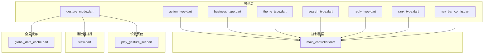
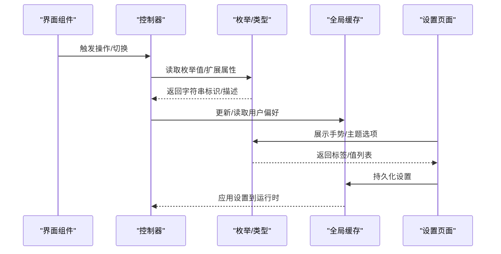
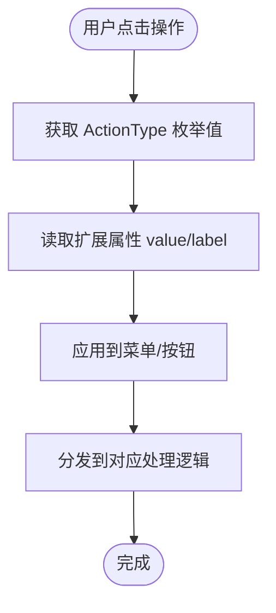
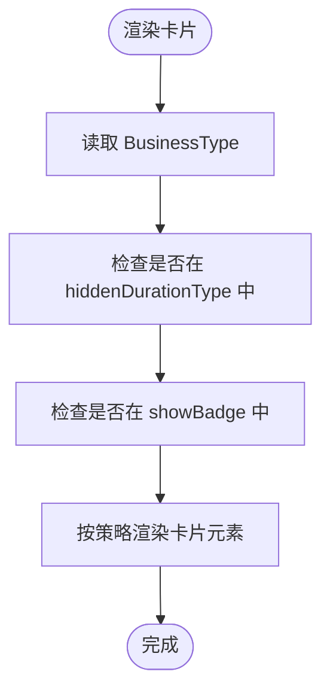
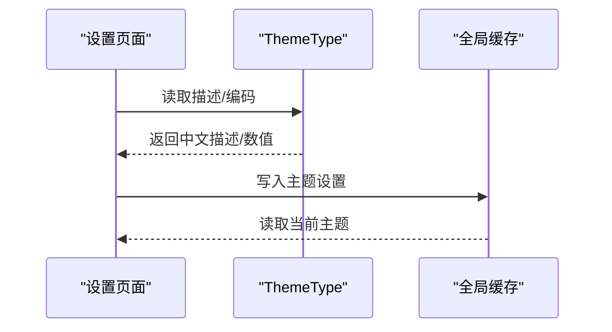
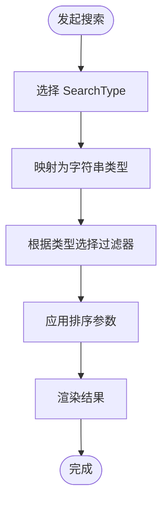
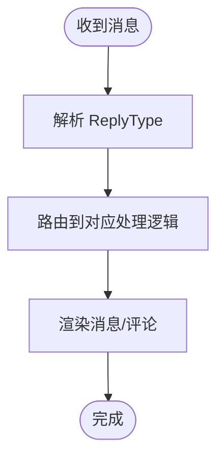
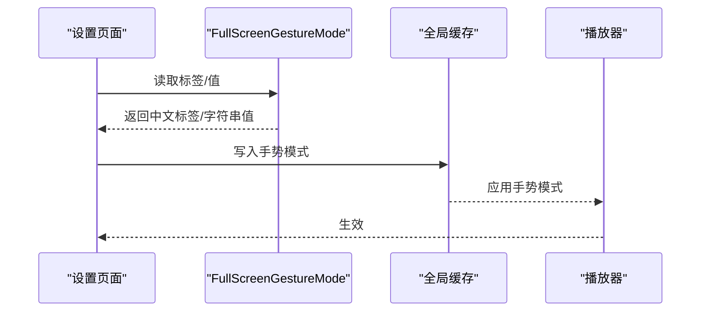
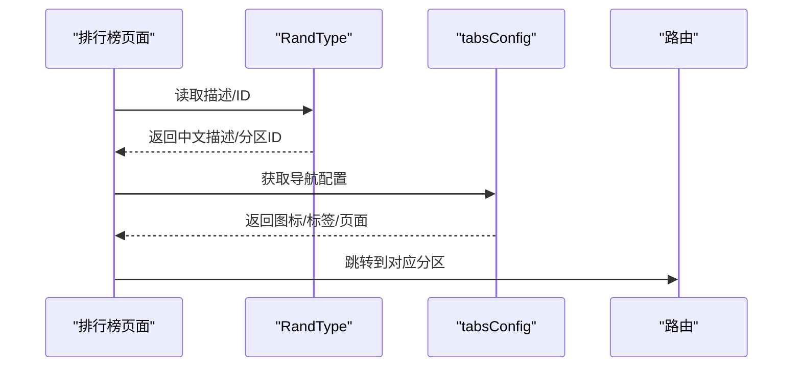
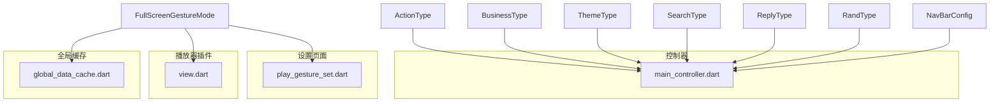

# 通用枚举和类型

<cite>
**本文档引用的文件**
- [action_type.dart](file://lib/models/common/action_type.dart)
- [business_type.dart](file://lib/models/common/business_type.dart)
- [theme_type.dart](file://lib/models/common/theme_type.dart)
- [search_type.dart](file://lib/models/common/search_type.dart)
- [reply_type.dart](file://lib/models/common/reply_type.dart)
- [gesture_mode.dart](file://lib/models/common/gesture_mode.dart)
- [rank_type.dart](file://lib/models/common/rank_type.dart)
- [nav_bar_config.dart](file://lib/models/common/nav_bar_config.dart)
- [main_controller.dart](file://lib/features/main/presentation/main_controller.dart)
- [play_gesture_set.dart](file://lib/pages/setting/pages/play_gesture_set.dart)
- [view.dart](file://lib/plugin/pl_player/view.dart)
- [global_data_cache.dart](file://lib/utils/global_data_cache.dart)
</cite>

## 目录
1. [简介](#简介)
2. [项目结构](#项目结构)
3. [核心组件](#核心组件)
4. [架构概览](#架构概览)
5. [详细组件分析](#详细组件分析)
6. [依赖关系分析](#依赖关系分析)
7. [性能考虑](#性能考虑)
8. [故障排除指南](#故障排除指南)
9. [结论](#结论)

## 简介

本文件系统性地梳理了 PiliPala 项目中的通用枚举和类型定义，涵盖操作类型、业务类型、主题类型、搜索类型、回复类型、手势模式、排行榜类型以及导航栏配置等核心数据结构。通过对每个枚举值的语义、使用场景和业务规则进行深入解析，并结合实际代码实现，帮助开发者在不同模块中正确使用这些通用类型，确保类型安全和代码一致性。

## 项目结构

通用枚举和类型主要位于 `lib/models/common/` 目录下，同时在控制器、页面设置、播放器插件和全局缓存中被广泛使用：

**图表来源**
- [action_type.dart:1-94](file://lib/models/common/action_type.dart#L1-L94)
- [business_type.dart:1-24](file://lib/models/common/business_type.dart#L1-L24)
- [theme_type.dart:1-14](file://lib/models/common/theme_type.dart#L1-L14)
- [search_type.dart:1-65](file://lib/models/common/search_type.dart#L1-L65)
- [reply_type.dart:1-50](file://lib/models/common/reply_type.dart#L1-L50)
- [gesture_mode.dart:1-13](file://lib/models/common/gesture_mode.dart#L1-L13)
- [rank_type.dart:1-197](file://lib/models/common/rank_type.dart#L1-L197)
- [nav_bar_config.dart](file://lib/models/common/nav_bar_config.dart)
- [main_controller.dart:40-120](file://lib/features/main/presentation/main_controller.dart#L40-L120)
- [play_gesture_set.dart:1-80](file://lib/pages/setting/pages/play_gesture_set.dart#L1-L80)
- [view.dart:80-100](file://lib/plugin/pl_player/view.dart#L80-L100)
- [global_data_cache.dart:1-80](file://lib/utils/global_data_cache.dart#L1-L80)

**章节来源**
- [action_type.dart:1-94](file://lib/models/common/action_type.dart#L1-L94)
- [business_type.dart:1-24](file://lib/models/common/business_type.dart#L1-L24)
- [theme_type.dart:1-14](file://lib/models/common/theme_type.dart#L1-L14)
- [search_type.dart:1-65](file://lib/models/common/search_type.dart#L1-L65)
- [reply_type.dart:1-50](file://lib/models/common/reply_type.dart#L1-L50)
- [gesture_mode.dart:1-13](file://lib/models/common/gesture_mode.dart#L1-L13)
- [rank_type.dart:1-197](file://lib/models/common/rank_type.dart#L1-L197)
- [nav_bar_config.dart](file://lib/models/common/nav_bar_config.dart)

## 核心组件

本节对各枚举和类型进行逐项说明，包括枚举值含义、扩展属性、使用场景和业务规则。

### ActionType（操作类型）

- 枚举值与含义
  - 点赞视频
  - 投币
  - 收藏视频
  - 稍后再看
  - 视频分享
  - 不喜欢
  - 下载封面
  - 复制链接
- 扩展属性
  - value：字符串标识符列表，按索引映射到具体值
  - label：中文标签列表，用于界面展示
- 菜单配置
  - 提供操作菜单的图标、标签和对应 Action 值的映射表
- 使用场景
  - 视频卡片右上角菜单
  - 个人中心操作面板
  - 互动行为触发逻辑
- 业务规则
  - 某些操作可能受权限或状态限制
  - 不同业务类型（如直播、文章）可启用的操作集合不同

**章节来源**
- [action_type.dart:1-94](file://lib/models/common/action_type.dart#L1-L94)

### BusinessType（业务类型）

- 枚举值与含义
  - archive：普通视频
  - pgc：剧集（番剧/影视）
  - live：直播
  - articleList：文章列表
  - article：文章
  - hiddenDurationType：隐藏时长的业务类型集合
  - showBadge：右上角徽标显示的业务类型集合
- 扩展属性
  - type：将枚举值映射为字符串标识
  - hiddenDurationType：返回需要隐藏时长的类型列表
  - showBadge：返回需要显示徽标的类型列表
- 使用场景
  - 内容卡片渲染逻辑
  - 时长显示策略
  - 徽标提示（如PGC、文章类内容）
- 业务规则
  - 不同业务类型决定卡片布局、功能按钮和徽标策略

**章节来源**
- [business_type.dart:1-24](file://lib/models/common/business_type.dart#L1-L24)

### ThemeType（主题类型）

- 枚举值与含义
  - light：浅色主题
  - dark：深色主题
  - system：跟随系统主题
- 扩展属性
  - description：中文描述列表
  - code：整数编码列表（0/1/2）
- 使用场景
  - 设置页面主题选择
  - 应用主题切换逻辑
- 业务规则
  - 切换主题后需同步更新界面和持久化存储

**章节来源**
- [theme_type.dart:1-14](file://lib/models/common/theme_type.dart#L1-L14)

### SearchType（搜索类型）

- 枚举值与含义
  - video：视频
  - media_bangumi：番剧
  - live_room：直播间
  - bili_user：用户
  - article：专栏
- 扩展属性
  - type：将枚举值映射为字符串标识
  - label：中文标签列表
- 过滤类型
  - ArchiveFilterType：视频结果的排序方式
  - ArticleFilterType：专栏结果的排序方式
- 使用场景
  - 搜索页Tab切换
  - 搜索结果排序控制
- 业务规则
  - 不同类型使用不同的过滤参数和排序策略

**章节来源**
- [search_type.dart:1-65](file://lib/models/common/search_type.dart#L1-L65)

### ReplyType（回复类型）

- 枚举值与含义
  - unset：未设置
  - video：视频评论
  - topic：话题
  - activity：活动
  - videoS：小视频
  - blockMsg：小黑屋封禁信息
  - publicMsg：公告信息
  - liveActivity：直播活动
  - activityFile：活动稿件
  - livePublic：直播公告
  - album：相簿
  - column：专栏
  - ticket：票务
  - audio：音频
  - comment：点评
  - dynamics：动态
  - playList：播单
  - musicPlayList：音乐播单
  - comics1/2/3：漫画系列
  - course：课程
- 使用场景
  - 评论区适配不同业务类型
  - 通知和消息分类
- 业务规则
  - 某些类型仅用于系统内部消息展示

**章节来源**
- [reply_type.dart:1-50](file://lib/models/common/reply_type.dart#L1-L50)

### FullScreenGestureMode（全屏手势模式）

- 枚举值与含义
  - fromToptoBottom：从上滑到下进入全屏
  - fromBottomtoTop：从下滑到上进入全屏
- 扩展属性
  - values：字符串标识列表
  - labels：中文标签列表
- 使用场景
  - 播放器手势设置
  - 用户偏好记忆与应用
- 业务规则
  - 与播放器交互体验相关，影响手势区域和行为

**章节来源**
- [gesture_mode.dart:1-13](file://lib/models/common/gesture_mode.dart#L1-L13)

### RandType（排行榜类型）

- 枚举值与含义
  - 全站、动画、音乐、舞蹈、游戏、知识、科技、运动、汽车、美食、动物圈、鬼畜、时尚、娱乐、影视
- 扩展属性
  - description：中文描述列表
  - id：对应分区ID列表
- Tab配置
  - tabsConfig：包含图标、标签、类型、目标页面的配置表
- 使用场景
  - 排行榜页面的分区导航
  - 区域内容页路由跳转
- 业务规则
  - 每个分区对应特定的 rid 参数

**章节来源**
- [rank_type.dart:1-197](file://lib/models/common/rank_type.dart#L1-L197)

### NavBarConfig（导航栏配置）

- 结构说明
  - 定义导航栏的配置项，包括图标、标签、选中状态等
- 使用场景
  - 主页底部导航
  - 页面切换与状态管理
- 业务规则
  - 与路由和页面状态保持一致

**章节来源**
- [nav_bar_config.dart](file://lib/models/common/nav_bar_config.dart)

## 架构概览

通用枚举和类型在系统中的流转路径如下：

**图表来源**
- [main_controller.dart:40-120](file://lib/features/main/presentation/main_controller.dart#L40-L120)
- [play_gesture_set.dart:1-80](file://lib/pages/setting/pages/play_gesture_set.dart#L1-L80)
- [view.dart:80-100](file://lib/plugin/pl_player/view.dart#L80-L100)
- [global_data_cache.dart:1-80](file://lib/utils/global_data_cache.dart#L1-L80)
- [gesture_mode.dart:1-13](file://lib/models/common/gesture_mode.dart#L1-L13)
- [theme_type.dart:1-14](file://lib/models/common/theme_type.dart#L1-L14)

## 详细组件分析

### 操作类型与菜单配置

- 设计模式
  - 枚举 + 扩展属性：通过索引映射到字符串值和中文标签
  - 配置表：将图标、标签、值组合为统一的数据结构
- 使用流程

**图表来源**
- [action_type.dart:1-94](file://lib/models/common/action_type.dart#L1-L94)

**章节来源**
- [action_type.dart:1-94](file://lib/models/common/action_type.dart#L1-L94)

### 业务类型与卡片渲染

- 设计模式
  - 枚举 + 扩展属性：根据业务类型决定显示策略
  - 集合属性：hiddenDurationType 和 showBadge 控制 UI 行为
- 使用流程

**图表来源**
- [business_type.dart:1-24](file://lib/models/common/business_type.dart#L1-L24)

**章节来源**
- [business_type.dart:1-24](file://lib/models/common/business_type.dart#L1-L24)

### 主题类型与设置联动

- 设计模式
  - 枚举 + 扩展属性：提供描述和编码
  - 设置页面读取/写入：与全局缓存同步
- 使用流程

**图表来源**
- [theme_type.dart:1-14](file://lib/models/common/theme_type.dart#L1-L14)
- [global_data_cache.dart:1-80](file://lib/utils/global_data_cache.dart#L1-L80)

**章节来源**
- [theme_type.dart:1-14](file://lib/models/common/theme_type.dart#L1-L14)
- [global_data_cache.dart:1-80](file://lib/utils/global_data_cache.dart#L1-L80)

### 搜索类型与过滤策略

- 设计模式
  - 枚举 + 扩展属性：type 和 label 映射
  - 子枚举：ArchiveFilterType 和 ArticleFilterType
- 使用流程

**图表来源**
- [search_type.dart:1-65](file://lib/models/common/search_type.dart#L1-L65)

**章节来源**
- [search_type.dart:1-65](file://lib/models/common/search_type.dart#L1-L65)

### 回复类型与消息分类

- 设计模式
  - 枚举：覆盖多种业务场景的消息类型
  - 用途：评论区、通知、系统消息等
- 使用流程

**图表来源**
- [reply_type.dart:1-50](file://lib/models/common/reply_type.dart#L1-L50)

**章节来源**
- [reply_type.dart:1-50](file://lib/models/common/reply_type.dart#L1-L50)

### 手势模式与播放器集成

- 设计模式
  - 枚举 + 扩展属性：提供标签和值
  - 设置页面与全局缓存联动
- 使用流程

**图表来源**
- [play_gesture_set.dart:1-80](file://lib/pages/setting/pages/play_gesture_set.dart#L1-L80)
- [gesture_mode.dart:1-13](file://lib/models/common/gesture_mode.dart#L1-L13)
- [global_data_cache.dart:1-80](file://lib/utils/global_data_cache.dart#L1-L80)
- [view.dart:80-100](file://lib/plugin/pl_player/view.dart#L80-L100)

**章节来源**
- [play_gesture_set.dart:1-80](file://lib/pages/setting/pages/play_gesture_set.dart#L1-L80)
- [gesture_mode.dart:1-13](file://lib/models/common/gesture_mode.dart#L1-L13)
- [global_data_cache.dart:1-80](file://lib/utils/global_data_cache.dart#L1-L80)
- [view.dart:80-100](file://lib/plugin/pl_player/view.dart#L80-L100)

### 排行榜类型与导航

- 设计模式
  - 枚举 + 扩展属性：描述和ID映射
  - tabsConfig：统一的导航配置
- 使用流程

**图表来源**
- [rank_type.dart:1-197](file://lib/models/common/rank_type.dart#L1-L197)

**章节来源**
- [rank_type.dart:1-197](file://lib/models/common/rank_type.dart#L1-L197)

## 依赖关系分析

通用枚举和类型在系统中的耦合关系如下：

**图表来源**
- [main_controller.dart:40-120](file://lib/features/main/presentation/main_controller.dart#L40-L120)
- [play_gesture_set.dart:1-80](file://lib/pages/setting/pages/play_gesture_set.dart#L1-L80)
- [view.dart:80-100](file://lib/plugin/pl_player/view.dart#L80-L100)
- [global_data_cache.dart:1-80](file://lib/utils/global_data_cache.dart#L1-L80)
- [action_type.dart:1-94](file://lib/models/common/action_type.dart#L1-L94)
- [business_type.dart:1-24](file://lib/models/common/business_type.dart#L1-L24)
- [theme_type.dart:1-14](file://lib/models/common/theme_type.dart#L1-L14)
- [search_type.dart:1-65](file://lib/models/common/search_type.dart#L1-L65)
- [reply_type.dart:1-50](file://lib/models/common/reply_type.dart#L1-L50)
- [gesture_mode.dart:1-13](file://lib/models/common/gesture_mode.dart#L1-L13)
- [rank_type.dart:1-197](file://lib/models/common/rank_type.dart#L1-L197)
- [nav_bar_config.dart](file://lib/models/common/nav_bar_config.dart)

**章节来源**
- [main_controller.dart:40-120](file://lib/features/main/presentation/main_controller.dart#L40-L120)
- [play_gesture_set.dart:1-80](file://lib/pages/setting/pages/play_gesture_set.dart#L1-L80)
- [view.dart:80-100](file://lib/plugin/pl_player/view.dart#L80-L100)
- [global_data_cache.dart:1-80](file://lib/utils/global_data_cache.dart#L1-L80)

## 性能考虑

- 枚举访问复杂度
  - 扩展属性通过数组索引访问，时间复杂度 O(1)，空间开销极低
- 配置表优化
  - tabsConfig 等配置表在初始化时一次性构建，避免重复计算
- 缓存策略
  - 全局缓存集中管理用户偏好，减少频繁读写操作
- 类型安全
  - 使用枚举替代字符串常量，降低拼写错误风险
  - 扩展属性提供统一的字符串/描述映射，便于国际化扩展

## 故障排除指南

- 枚举值不匹配
  - 症状：扩展属性返回空或异常
  - 排查：确认枚举值顺序与扩展属性数组长度一致
  - 参考：[action_type.dart:19-46](file://lib/models/common/action_type.dart#L19-L46)、[business_type.dart:16-23](file://lib/models/common/business_type.dart#L16-L23)
- 设置未生效
  - 症状：切换主题/手势后界面未变化
  - 排查：检查全局缓存写入与读取流程
  - 参考：[global_data_cache.dart:1-80](file://lib/utils/global_data_cache.dart#L1-L80)、[play_gesture_set.dart:1-80](file://lib/pages/setting/pages/play_gesture_set.dart#L1-L80)
- 导航配置错误
  - 症状：排行榜Tab无法跳转
  - 排查：核对 tabsConfig 中的 page 参数与路由定义
  - 参考：[rank_type.dart:60-197](file://lib/models/common/rank_type.dart#L60-L197)

**章节来源**
- [action_type.dart:19-46](file://lib/models/common/action_type.dart#L19-L46)
- [business_type.dart:16-23](file://lib/models/common/business_type.dart#L16-L23)
- [global_data_cache.dart:1-80](file://lib/utils/global_data_cache.dart#L1-L80)
- [play_gesture_set.dart:1-80](file://lib/pages/setting/pages/play_gesture_set.dart#L1-L80)
- [rank_type.dart:60-197](file://lib/models/common/rank_type.dart#L60-L197)

## 结论

通过系统化的枚举和类型设计，PiliPala 实现了跨模块的一致性和可维护性。建议在新增功能时遵循现有模式：
- 使用枚举定义业务概念
- 通过扩展属性提供字符串/描述映射
- 在控制器和页面中统一读取和应用
- 利用全局缓存管理用户偏好
- 保持配置表与枚举值的同步