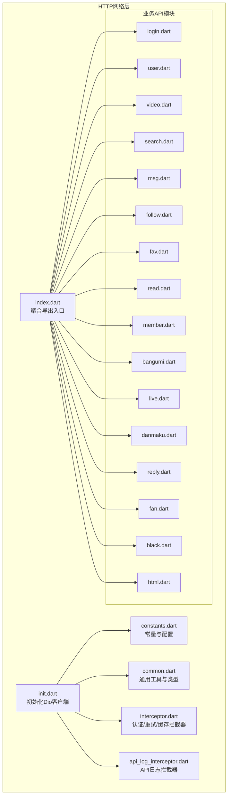
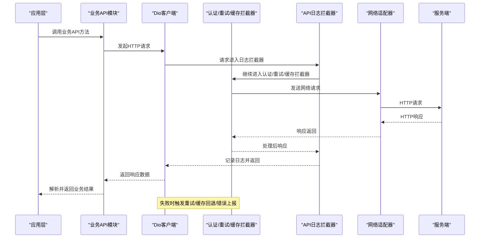
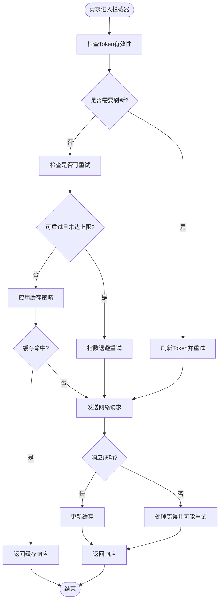
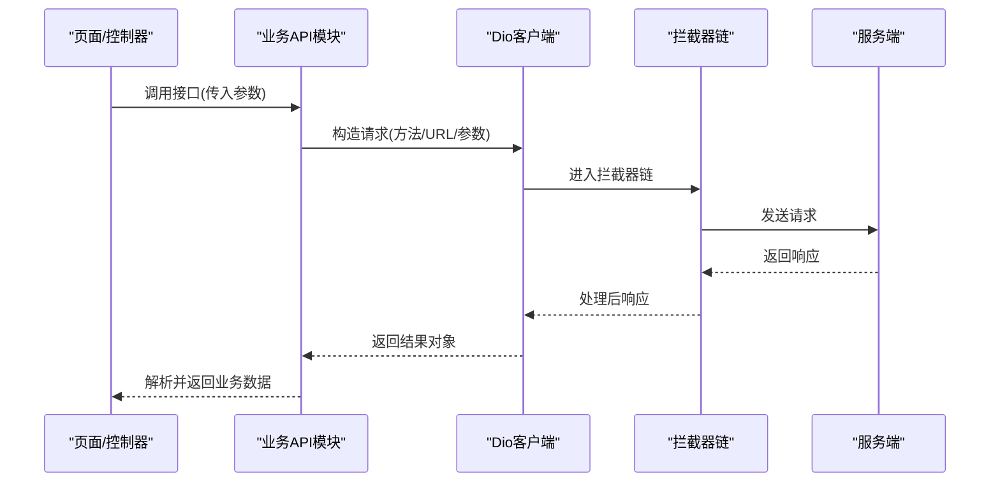
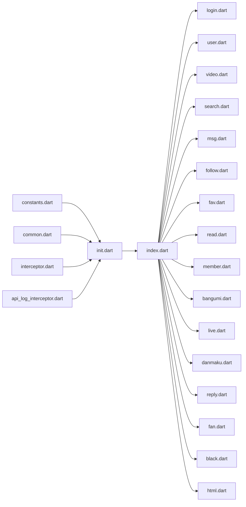

# HTTP网络层

<cite>
**本文档引用的文件**
- [lib/http/init.dart](file://lib/http/init.dart)
- [lib/http/index.dart](file://lib/http/index.dart)
- [lib/http/interceptor.dart](file://lib/http/interceptor.dart)
- [lib/http/api.dart](file://lib/http/api.dart)
- [lib/http/constants.dart](file://lib/http/constants.dart)
- [lib/http/login.dart](file://lib/http/login.dart)
- [lib/http/user.dart](file://lib/http/user.dart)
- [lib/http/video.dart](file://lib/http/video.dart)
- [lib/http/search.dart](file://lib/http/search.dart)
- [lib/http/msg.dart](file://lib/http/msg.dart)
- [lib/http/follow.dart](file://lib/http/follow.dart)
- [lib/http/fav.dart](file://lib/http/fav.dart)
- [lib/http/read.dart](file://lib/http/read.dart)
- [lib/http/member.dart](file://lib/http/member.dart)
- [lib/http/bangumi.dart](file://lib/http/bangumi.dart)
- [lib/http/live.dart](file://lib/http/live.dart)
- [lib/http/danmaku.dart](file://lib/http/danmaku.dart)
- [lib/http/reply.dart](file://lib/http/reply.dart)
- [lib/http/fan.dart](file://lib/http/fan.dart)
- [lib/http/black.dart](file://lib/http/black.dart)
- [lib/http/html.dart](file://lib/http/html.dart)
- [lib/http/common.dart](file://lib/http/common.dart)
- [lib/http/api_log_interceptor.dart](file://lib/http/api_log_interceptor.dart)
- [lib/common/widgets/http_error.dart](file://lib/common/widgets/http_error.dart)
</cite>

## 目录
1. [简介](#简介)
2. [项目结构](#项目结构)
3. [核心组件](#核心组件)
4. [架构总览](#架构总览)
5. [详细组件分析](#详细组件分析)
6. [依赖关系分析](#依赖关系分析)
7. [性能考量](#性能考量)
8. [故障排查指南](#故障排查指南)
9. [结论](#结论)
10. [附录](#附录)

## 简介
本章节面向PiliPala项目的HTTP网络层，系统性阐述基于Dio的客户端配置与使用，涵盖拦截器、适配器、超时设置、API接口组织、请求响应处理、错误处理、生命周期管理、重试策略、缓存机制、安全配置（HTTPS与证书验证）等内容。文档同时提供RESTful API调用流程、参数传递与响应解析的示例路径，并给出可操作的排障建议。

## 项目结构
HTTP网络层位于lib/http目录下，采用按功能模块划分的组织方式：每个业务域（如用户、视频、搜索、消息等）对应独立的API文件；公共配置集中在init.dart、constants.dart、common.dart中；拦截器与日志记录在interceptor.dart与api_log_interceptor.dart中；index.dart作为聚合入口导出各模块API。

图表来源
- [lib/http/init.dart](file://lib/http/init.dart)
- [lib/http/index.dart](file://lib/http/index.dart)
- [lib/http/interceptor.dart](file://lib/http/interceptor.dart)
- [lib/http/api_log_interceptor.dart](file://lib/http/api_log_interceptor.dart)
- [lib/http/constants.dart](file://lib/http/constants.dart)
- [lib/http/common.dart](file://lib/http/common.dart)
- [lib/http/login.dart](file://lib/http/login.dart)
- [lib/http/user.dart](file://lib/http/user.dart)
- [lib/http/video.dart](file://lib/http/video.dart)
- [lib/http/search.dart](file://lib/http/search.dart)
- [lib/http/msg.dart](file://lib/http/msg.dart)
- [lib/http/follow.dart](file://lib/http/follow.dart)
- [lib/http/fav.dart](file://lib/http/fav.dart)
- [lib/http/read.dart](file://lib/http/read.dart)
- [lib/http/member.dart](file://lib/http/member.dart)
- [lib/http/bangumi.dart](file://lib/http/bangumi.dart)
- [lib/http/live.dart](file://lib/http/live.dart)
- [lib/http/danmaku.dart](file://lib/http/danmaku.dart)
- [lib/http/reply.dart](file://lib/http/reply.dart)
- [lib/http/fan.dart](file://lib/http/fan.dart)
- [lib/http/black.dart](file://lib/http/black.dart)
- [lib/http/html.dart](file://lib/http/html.dart)

章节来源
- [lib/http/init.dart](file://lib/http/init.dart)
- [lib/http/index.dart](file://lib/http/index.dart)
- [lib/http/interceptor.dart](file://lib/http/interceptor.dart)
- [lib/http/api_log_interceptor.dart](file://lib/http/api_log_interceptor.dart)
- [lib/http/constants.dart](file://lib/http/constants.dart)
- [lib/http/common.dart](file://lib/http/common.dart)

## 核心组件
- Dio客户端初始化与全局配置：在init.dart中完成基础超时、基础URL、默认头、适配器等设置，并注入拦截器链。
- 拦截器体系：认证/重试/缓存拦截器负责令牌刷新、失败重试、缓存命中与更新；API日志拦截器用于请求/响应日志输出。
- 常量与配置：constants.dart集中管理端点、超时、分页参数、HTTP头等。
- 业务API模块：每个领域模块封装对应的GET/POST/PUT/DELETE方法，统一返回泛型结果对象。
- 通用工具：common.dart提供类型定义、工具函数（如参数拼装、时间格式化等）。
- 错误处理UI：http_error.dart提供网络错误的可视化组件，便于在页面层展示。

章节来源
- [lib/http/init.dart](file://lib/http/init.dart)
- [lib/http/interceptor.dart](file://lib/http/interceptor.dart)
- [lib/http/api_log_interceptor.dart](file://lib/http/api_log_interceptor.dart)
- [lib/http/constants.dart](file://lib/http/constants.dart)
- [lib/http/common.dart](file://lib/http/common.dart)
- [lib/common/widgets/http_error.dart](file://lib/common/widgets/http_error.dart)

## 架构总览
下图展示了从应用发起请求到收到响应的完整链路，包括拦截器顺序、错误处理与UI反馈。

图表来源
- [lib/http/init.dart](file://lib/http/init.dart)
- [lib/http/interceptor.dart](file://lib/http/interceptor.dart)
- [lib/http/api_log_interceptor.dart](file://lib/http/api_log_interceptor.dart)
- [lib/http/api.dart](file://lib/http/api.dart)

## 详细组件分析

### Dio客户端初始化与配置
- 基础URL与默认头：通过constants.dart中的基础URL与通用头配置，确保所有请求的一致性。
- 超时设置：连接超时、接收超时、发送超时在init.dart中统一设定，避免重复配置。
- 适配器：根据平台选择合适的HttpAdapter，保证在Web/移动端的兼容性。
- 全局拦截器链：先注入API日志拦截器，再注入认证/重试/缓存拦截器，最后由业务API模块发起请求。

章节来源
- [lib/http/init.dart](file://lib/http/init.dart)
- [lib/http/constants.dart](file://lib/http/constants.dart)

### 拦截器体系
- 认证/重试/缓存拦截器（interceptor.dart）
  - 认证：在请求前注入或刷新Token，处理401未授权场景。
  - 重试：对瞬时失败（如网络抖动）进行指数退避重试，限制最大重试次数。
  - 缓存：支持响应缓存与命中，结合ETag/Last-Modified实现条件请求，减少带宽与延迟。
- API日志拦截器（api_log_interceptor.dart）
  - 记录请求URL、方法、头、查询参数、请求体、响应状态码、耗时与响应体摘要，便于调试与监控。

图表来源
- [lib/http/interceptor.dart](file://lib/http/interceptor.dart)
- [lib/http/api_log_interceptor.dart](file://lib/http/api_log_interceptor.dart)

章节来源
- [lib/http/interceptor.dart](file://lib/http/interceptor.dart)
- [lib/http/api_log_interceptor.dart](file://lib/http/api_log_interceptor.dart)

### API接口组织与调用
- 聚合入口：index.dart导出各业务模块API，便于上层统一导入与使用。
- 业务模块：每个模块（如login.dart、user.dart、video.dart、search.dart等）封装该领域的RESTful接口，遵循统一的参数命名与返回结构。
- 参数传递：通过查询参数、表单参数、JSON体等方式传递，具体以各模块方法签名为准。
- 响应解析：统一返回泛型结果对象，包含状态码、数据体、错误信息等字段，便于上层处理。

图表来源
- [lib/http/index.dart](file://lib/http/index.dart)
- [lib/http/api.dart](file://lib/http/api.dart)
- [lib/http/login.dart](file://lib/http/login.dart)
- [lib/http/user.dart](file://lib/http/user.dart)
- [lib/http/video.dart](file://lib/http/video.dart)
- [lib/http/search.dart](file://lib/http/search.dart)

章节来源
- [lib/http/index.dart](file://lib/http/index.dart)
- [lib/http/api.dart](file://lib/http/api.dart)
- [lib/http/login.dart](file://lib/http/login.dart)
- [lib/http/user.dart](file://lib/http/user.dart)
- [lib/http/video.dart](file://lib/http/video.dart)
- [lib/http/search.dart](file://lib/http/search.dart)

### 错误处理机制
- 拦截器内处理：对401未授权、网络异常、超时等进行分类处理，必要时触发重试或刷新Token。
- UI层展示：http_error.dart提供错误提示组件，支持显示错误类型、消息与重试按钮。
- 结果对象：业务API返回的统一结果对象包含错误字段，便于上层判断与展示。

章节来源
- [lib/http/interceptor.dart](file://lib/http/interceptor.dart)
- [lib/common/widgets/http_error.dart](file://lib/common/widgets/http_error.dart)

### 生命周期管理与缓存机制
- 生命周期：Dio实例在init.dart中创建并注入拦截器，随应用启动初始化；业务模块仅负责调用，不持有Dio实例。
- 缓存策略：interceptor.dart中实现缓存命中与更新逻辑，结合条件请求头减少无效传输。
- 条件请求：利用ETag/Last-Modified实现304 Not Modified，提升性能与节省流量。

章节来源
- [lib/http/init.dart](file://lib/http/init.dart)
- [lib/http/interceptor.dart](file://lib/http/interceptor.dart)

### 安全考虑与HTTPS配置
- HTTPS强制：基础URL来自constants.dart，确保所有请求走HTTPS通道。
- 证书验证：默认启用系统证书链验证；如需自定义证书校验，可在init.dart中配置HttpAdapter的证书策略。
- 敏感信息保护：Token与Cookie通过安全头传输，避免明文泄露；日志拦截器对敏感字段进行脱敏处理。

章节来源
- [lib/http/constants.dart](file://lib/http/constants.dart)
- [lib/http/init.dart](file://lib/http/init.dart)
- [lib/http/api_log_interceptor.dart](file://lib/http/api_log_interceptor.dart)

## 依赖关系分析
- 初始化依赖：init.dart依赖constants.dart、common.dart、interceptor.dart、api_log_interceptor.dart。
- 业务模块依赖：各业务API模块依赖init.dart提供的Dio实例与公共工具。
- 聚合入口：index.dart统一导出各业务模块，降低上层耦合度。
- 错误UI：http_error.dart被页面层引用，形成错误展示的独立组件。

图表来源
- [lib/http/init.dart](file://lib/http/init.dart)
- [lib/http/index.dart](file://lib/http/index.dart)
- [lib/http/interceptor.dart](file://lib/http/interceptor.dart)
- [lib/http/api_log_interceptor.dart](file://lib/http/api_log_interceptor.dart)
- [lib/http/constants.dart](file://lib/http/constants.dart)
- [lib/http/common.dart](file://lib/http/common.dart)
- [lib/http/login.dart](file://lib/http/login.dart)
- [lib/http/user.dart](file://lib/http/user.dart)
- [lib/http/video.dart](file://lib/http/video.dart)
- [lib/http/search.dart](file://lib/http/search.dart)
- [lib/http/msg.dart](file://lib/http/msg.dart)
- [lib/http/follow.dart](file://lib/http/follow.dart)
- [lib/http/fav.dart](file://lib/http/fav.dart)
- [lib/http/read.dart](file://lib/http/read.dart)
- [lib/http/member.dart](file://lib/http/member.dart)
- [lib/http/bangumi.dart](file://lib/http/bangumi.dart)
- [lib/http/live.dart](file://lib/http/live.dart)
- [lib/http/danmaku.dart](file://lib/http/danmaku.dart)
- [lib/http/reply.dart](file://lib/http/reply.dart)
- [lib/http/fan.dart](file://lib/http/fan.dart)
- [lib/http/black.dart](file://lib/http/black.dart)
- [lib/http/html.dart](file://lib/http/html.dart)

章节来源
- [lib/http/init.dart](file://lib/http/init.dart)
- [lib/http/index.dart](file://lib/http/index.dart)
- [lib/http/interceptor.dart](file://lib/http/interceptor.dart)
- [lib/http/api_log_interceptor.dart](file://lib/http/api_log_interceptor.dart)
- [lib/http/constants.dart](file://lib/http/constants.dart)
- [lib/http/common.dart](file://lib/http/common.dart)

## 性能考量
- 超时与重试：合理设置超时阈值与最大重试次数，避免阻塞主线程；指数退避降低服务器压力。
- 缓存策略：充分利用条件请求与本地缓存，减少重复请求；对热点数据设置合理的TTL。
- 日志开销：生产环境建议关闭或降级日志拦截器，避免影响性能。
- 并发控制：对高频接口进行并发限制与队列化，防止资源争用。

## 故障排查指南
- 401未授权：检查认证拦截器是否正确刷新Token；确认Token有效期与作用域。
- 网络超时/断网：检查超时配置与网络状态监听；在UI层展示http_error.dart组件辅助定位。
- 缓存异常：确认缓存键生成规则与条件请求头是否一致；核对ETag/Last-Modified是否正确。
- 日志定位：开启API日志拦截器，查看请求/响应摘要，快速定位问题接口与参数。
- 证书问题：若出现HTTPS握手失败，检查证书链与系统时间；必要时在init.dart中调整证书验证策略。

章节来源
- [lib/http/interceptor.dart](file://lib/http/interceptor.dart)
- [lib/http/api_log_interceptor.dart](file://lib/http/api_log_interceptor.dart)
- [lib/common/widgets/http_error.dart](file://lib/common/widgets/http_error.dart)

## 结论
PiliPala的HTTP网络层以Dio为核心，通过清晰的模块化设计与完善的拦截器体系，实现了认证、重试、缓存、日志与错误处理的统一管理。配合constants.dart与init.dart的集中配置，既保证了开发效率，也提升了运行时的稳定性与安全性。建议在生产环境中谨慎开启日志拦截器，并根据业务特性优化缓存与重试策略。

## 附录
- RESTful调用示例路径参考：
  - 登录接口：[lib/http/login.dart](file://lib/http/login.dart)
  - 用户信息：[lib/http/user.dart](file://lib/http/user.dart)
  - 视频列表：[lib/http/video.dart](file://lib/http/video.dart)
  - 搜索接口：[lib/http/search.dart](file://lib/http/search.dart)
  - 消息接口：[lib/http/msg.dart](file://lib/http/msg.dart)
  - 关注/粉丝：[lib/http/follow.dart](file://lib/http/follow.dart)、[lib/http/fan.dart](file://lib/http/fan.dart)
  - 收藏/历史：[lib/http/fav.dart](file://lib/http/fav.dart)、[lib/http/read.dart](file://lib/http/read.dart)
  - 成员/会员：[lib/http/member.dart](file://lib/http/member.dart)
  - 番剧：[lib/http/bangumi.dart](file://lib/http/bangumi.dart)
  - 直播：[lib/http/live.dart](file://lib/http/live.dart)
  - 弹幕：[lib/http/danmaku.dart](file://lib/http/danmaku.dart)
  - 回复：[lib/http/reply.dart](file://lib/http/reply.dart)
  - 黑名单：[lib/http/black.dart](file://lib/http/black.dart)
  - HTML渲染：[lib/http/html.dart](file://lib/http/html.dart)