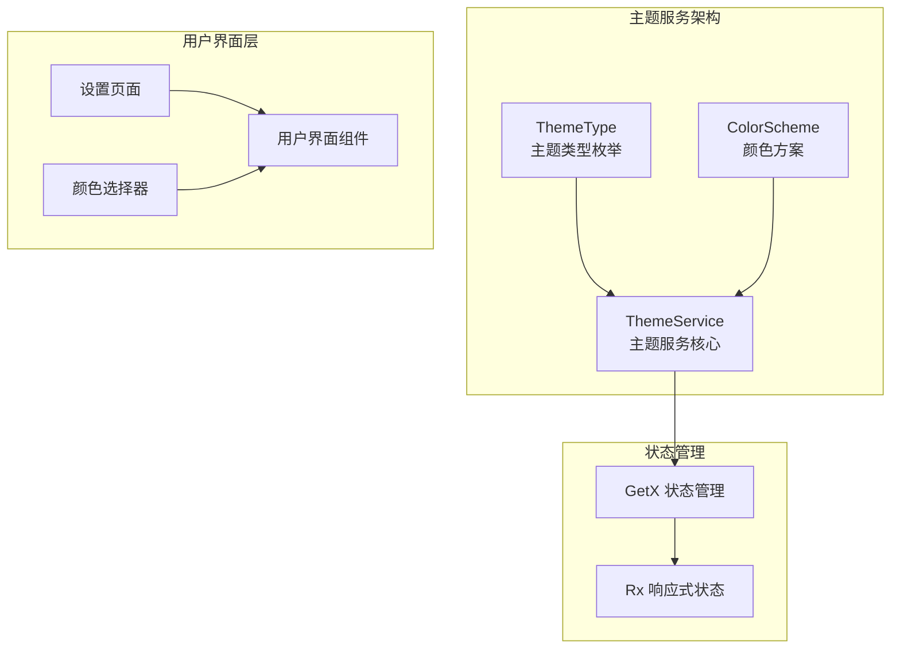
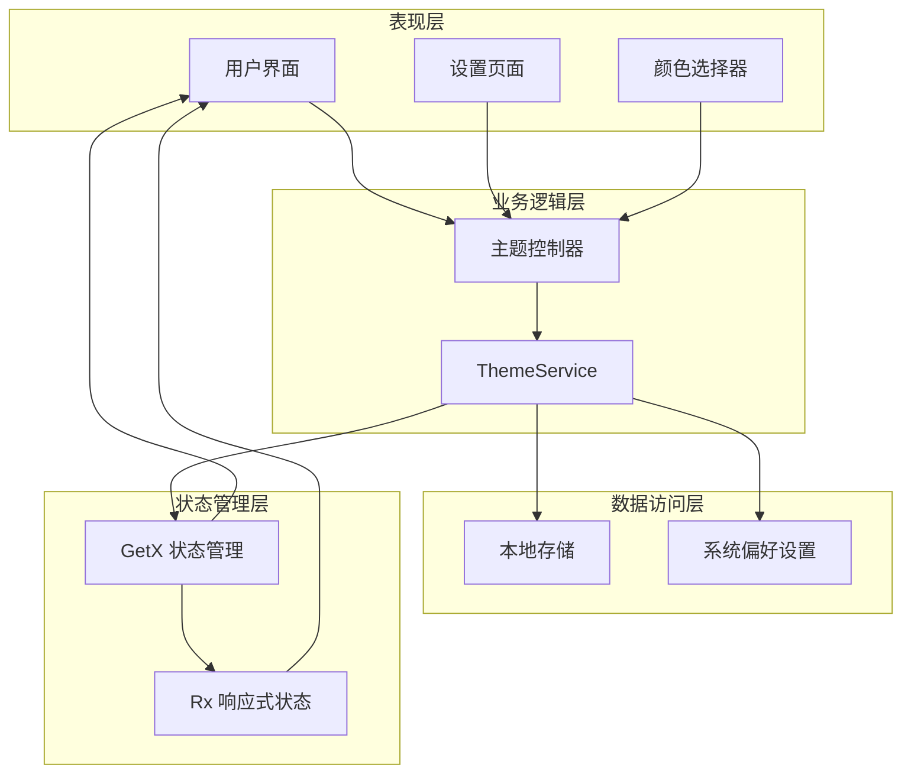
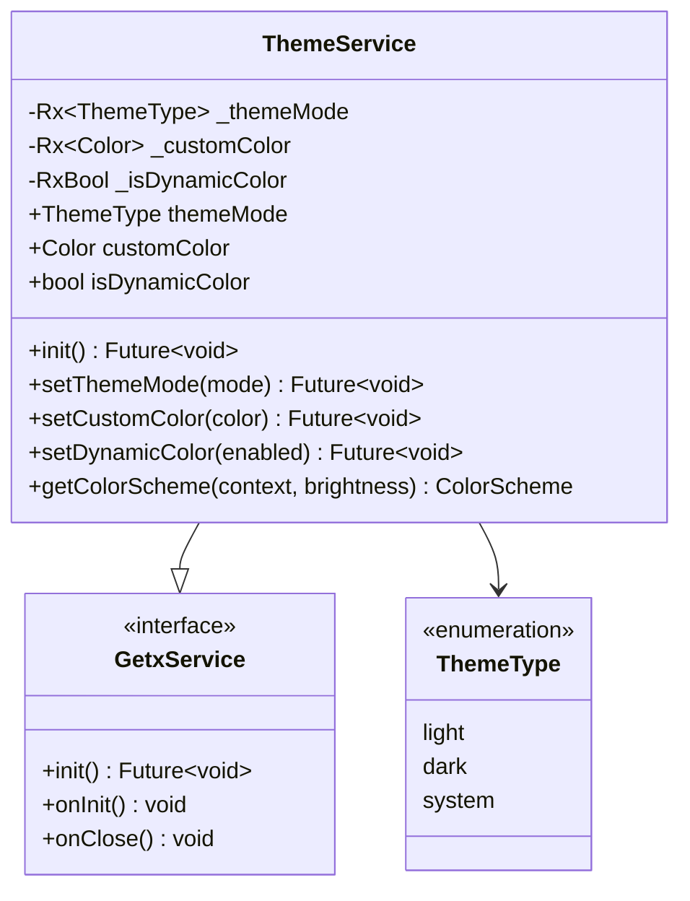
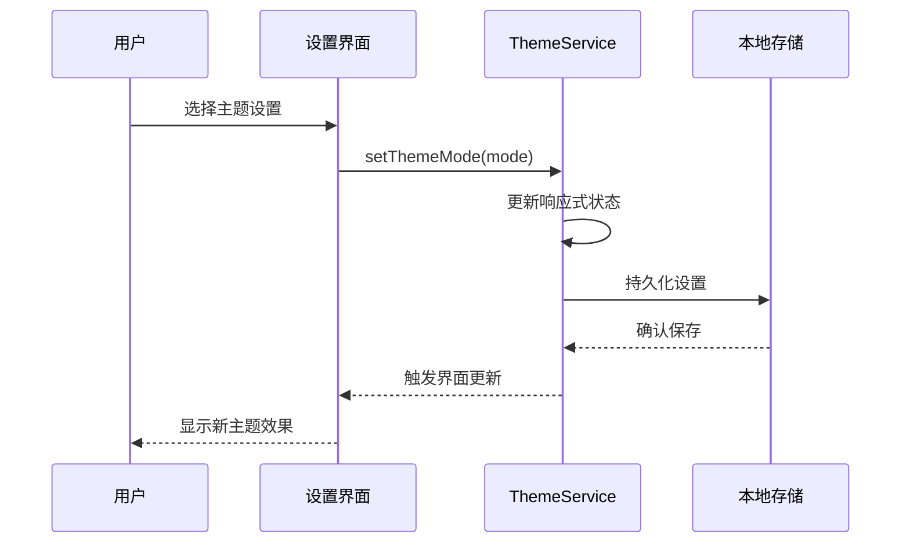
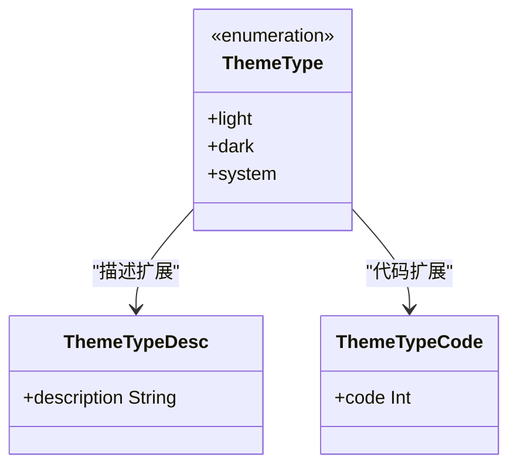
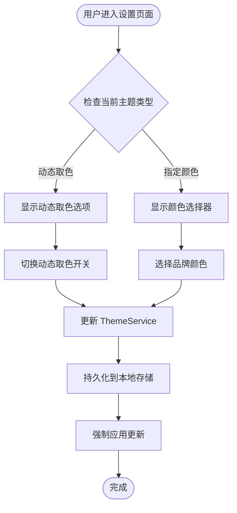
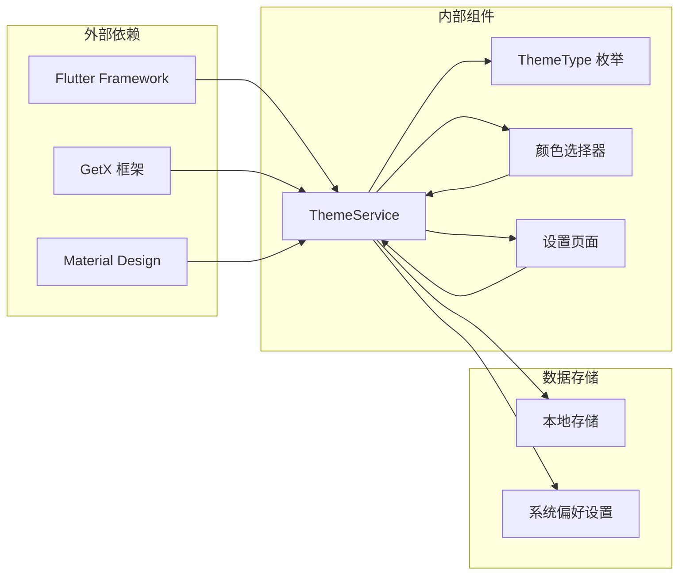

# 主题服务

<cite>
**本文档中引用的文件**
- [theme_service.dart](file://lib/core/theme/theme_service.dart)
- [theme_type.dart](file://lib/models/common/theme_type.dart)
- [main.dart](file://lib/main.dart)
- [color_select.dart](file://lib/features/setting/presentation/pages/color_select.dart)
- [color_select.dart](file://lib/pages/setting/pages/color_select.dart)
- [02-state-management.md](file://docs/spec/architecture/02-state-management.md)
</cite>

## 目录
1. [简介](#简介)
2. [项目结构](#项目结构)
3. [核心组件](#核心组件)
4. [架构概览](#架构概览)
5. [详细组件分析](#详细组件分析)
6. [依赖关系分析](#依赖关系分析)
7. [性能考虑](#性能考虑)
8. [故障排除指南](#故障排除指南)
9. [结论](#结论)

## 简介

主题服务是 PiliPala 应用程序中的核心功能模块，负责管理应用程序的主题设置、颜色方案和外观配置。该服务基于 GetX 状态管理系统构建，提供了响应式的主题状态管理和持久化存储功能。

本服务支持三种主题模式：浅色模式、深色模式和系统跟随模式，并允许用户自定义品牌颜色和动态取色功能。通过集中化的主题管理，确保整个应用程序具有一致的视觉体验和流畅的用户体验。

## 项目结构

主题服务相关的文件组织结构如下：

**图表来源**
- [theme_service.dart:1-56](file://lib/core/theme/theme_service.dart#L1-L56)
- [theme_type.dart:1-13](file://lib/models/common/theme_type.dart#L1-L13)

**章节来源**
- [theme_service.dart:1-56](file://lib/core/theme/theme_service.dart#L1-L56)
- [theme_type.dart:1-13](file://lib/models/common/theme_type.dart#L1-L13)

## 核心组件

### ThemeService 类

ThemeService 是主题服务的核心类，继承自 GetxService，提供以下主要功能：

- **主题模式管理**：支持 light、dark、system 三种模式
- **自定义颜色管理**：允许用户选择品牌颜色
- **动态颜色支持**：基于系统动态颜色方案
- **响应式状态管理**：使用 GetX 的响应式机制

### ThemeType 枚举

定义了三种主题模式：
- `light`：浅色模式
- `dark`：深色模式  
- `system`：跟随系统设置

### 颜色方案生成

服务能够根据当前设置生成相应的 ColorScheme，支持明暗两种模式的颜色方案。

**章节来源**
- [theme_service.dart:5-56](file://lib/core/theme/theme_service.dart#L5-L56)
- [theme_type.dart:1-13](file://lib/models/common/theme_type.dart#L1-L13)

## 架构概览

主题服务的整体架构采用分层设计，确保了良好的可维护性和扩展性：

**图表来源**
- [theme_service.dart:11-56](file://lib/core/theme/theme_service.dart#L11-L56)
- [02-state-management.md:1-259](file://docs/spec/architecture/02-state-management.md#L1-L259)

## 详细组件分析

### ThemeService 实现分析

ThemeService 采用了响应式编程模式，使用 GetX 的状态管理机制：

**图表来源**
- [theme_service.dart:11-56](file://lib/core/theme/theme_service.dart#L11-L56)

#### 响应式状态管理

服务使用三个核心响应式状态变量：

| 状态变量 | 类型 | 描述 | 默认值 |
|---------|------|------|--------|
| `_themeMode` | Rx<ThemeType> | 当前主题模式 | ThemeType.system |
| `_customColor` | Rx<Color> | 自定义品牌颜色 | 绿色调色板 |
| `_isDynamicColor` | RxBool | 动态颜色开关 | true |

#### 主题设置流程

**图表来源**
- [theme_service.dart:32-47](file://lib/core/theme/theme_service.dart#L32-L47)

**章节来源**
- [theme_service.dart:11-56](file://lib/core/theme/theme_service.dart#L11-L56)

### 主题类型枚举分析

ThemeType 枚举提供了主题模式的标准化表示：

**图表来源**
- [theme_type.dart:1-13](file://lib/models/common/theme_type.dart#L1-L13)

#### 扩展方法

- `ThemeTypeDesc.description`：提供中文描述文本
- `ThemeTypeCode.code`：提供数值编码用于存储

**章节来源**
- [theme_type.dart:7-13](file://lib/models/common/theme_type.dart#L7-L13)

### 设置界面集成

主题服务与用户界面的集成体现在设置页面中：

**图表来源**
- [color_select.dart:47-104](file://lib/features/setting/presentation/pages/color_select.dart#L47-L104)

**章节来源**
- [color_select.dart:38-104](file://lib/features/setting/presentation/pages/color_select.dart#L38-L104)

## 依赖关系分析

主题服务的依赖关系图展示了各组件之间的相互作用：

**图表来源**
- [theme_service.dart:1-3](file://lib/core/theme/theme_service.dart#L1-L3)
- [main.dart:82-234](file://lib/main.dart#L82-L234)

### 关键依赖说明

- **Flutter Framework**：提供基础的 UI 和平台能力
- **GetX**：提供响应式状态管理和依赖注入
- **Material Design**：提供标准的 UI 组件和设计规范
- **本地存储**：持久化用户的主题偏好设置

**章节来源**
- [theme_service.dart:1-3](file://lib/core/theme/theme_service.dart#L1-L3)
- [main.dart:82-234](file://lib/main.dart#L82-L234)

## 性能考虑

主题服务在设计时考虑了以下性能优化：

### 响应式更新优化
- 使用 GetX 的响应式机制避免不必要的界面重建
- 通过 `Get.forceAppUpdate()` 精确控制更新时机
- 合理使用 `Obx` 组件减少状态监听开销

### 内存管理
- 使用 `Rx` 类型的响应式状态，自动管理内存回收
- 避免在主题服务中存储大型数据结构
- 及时清理不再使用的状态引用

### 状态持久化策略
- 异步保存用户设置，避免阻塞主线程
- 批量更新相关设置，减少存储操作次数

## 故障排除指南

### 常见问题及解决方案

#### 主题设置不生效
1. **检查响应式状态更新**：确认 `Get.forceAppUpdate()` 是否被调用
2. **验证存储持久化**：检查本地存储是否正确保存设置
3. **确认主题服务初始化**：确保 `ThemeService.init()` 正常执行

#### 颜色方案异常
1. **检查动态颜色支持**：确认设备支持动态颜色功能
2. **验证品牌颜色有效性**：确保自定义颜色值在有效范围内
3. **检查 ColorScheme 生成**：确认颜色方案生成逻辑正常

#### 界面更新延迟
1. **优化状态监听**：减少不必要的 `Obx` 组件嵌套
2. **批量更新状态**：将相关状态更新合并为一次操作
3. **检查异步操作**：确保异步设置操作完成后才触发更新

**章节来源**
- [theme_service.dart:24-29](file://lib/core/theme/theme_service.dart#L24-L29)
- [color_select.dart:86-90](file://lib/features/setting/presentation/pages/color_select.dart#L86-L90)

## 结论

主题服务作为 PiliPala 应用程序的重要组成部分，通过精心设计的架构实现了灵活且高效的主题管理功能。该服务不仅提供了完整的主题设置能力，还确保了良好的用户体验和性能表现。

主要特点包括：
- 基于 GetX 的响应式状态管理
- 支持多种主题模式和自定义选项
- 完善的持久化存储机制
- 与 Flutter 生态系统的深度集成

未来可以考虑的功能增强：
- 添加更多预设主题选项
- 支持用户自定义主题导入导出
- 增强主题动画和过渡效果
- 提供更丰富的颜色调节工具