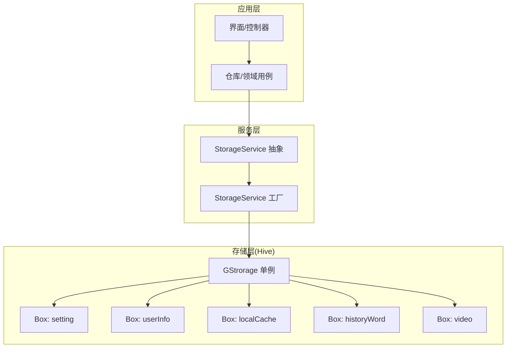
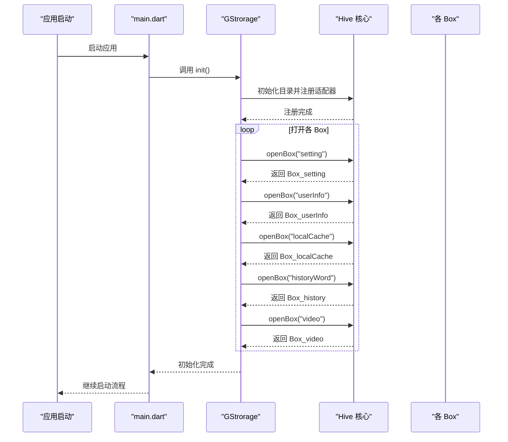
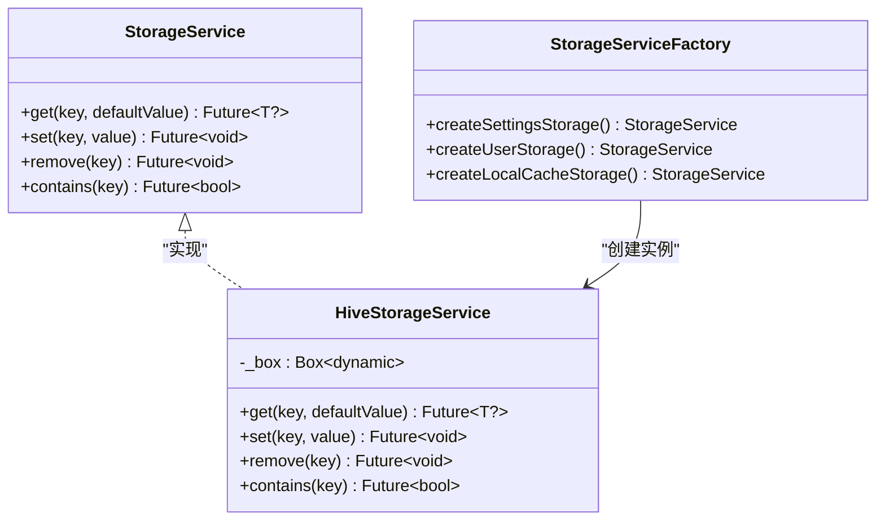
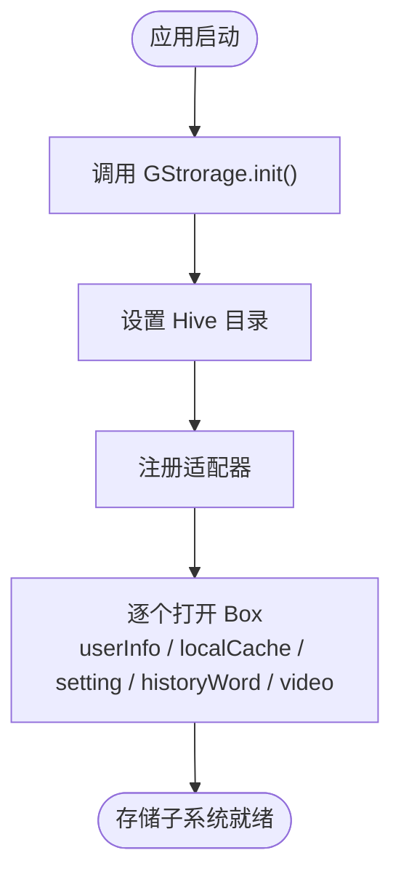
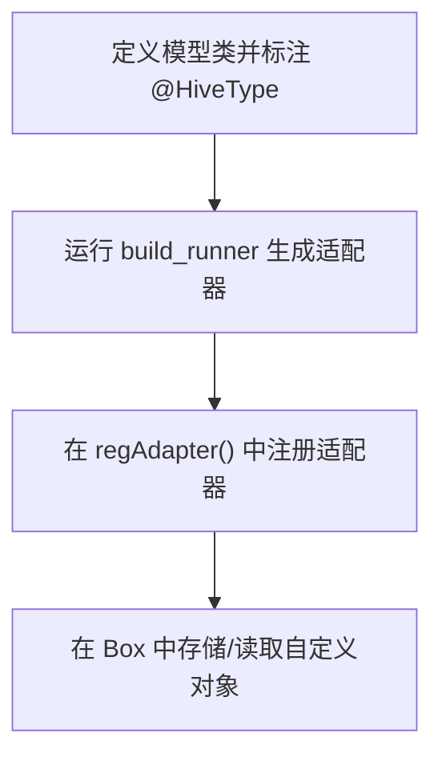
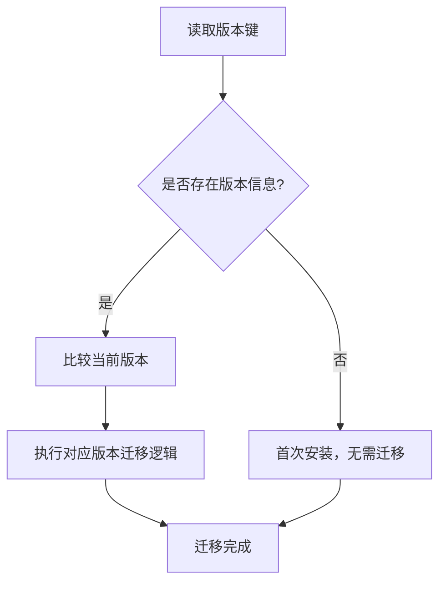
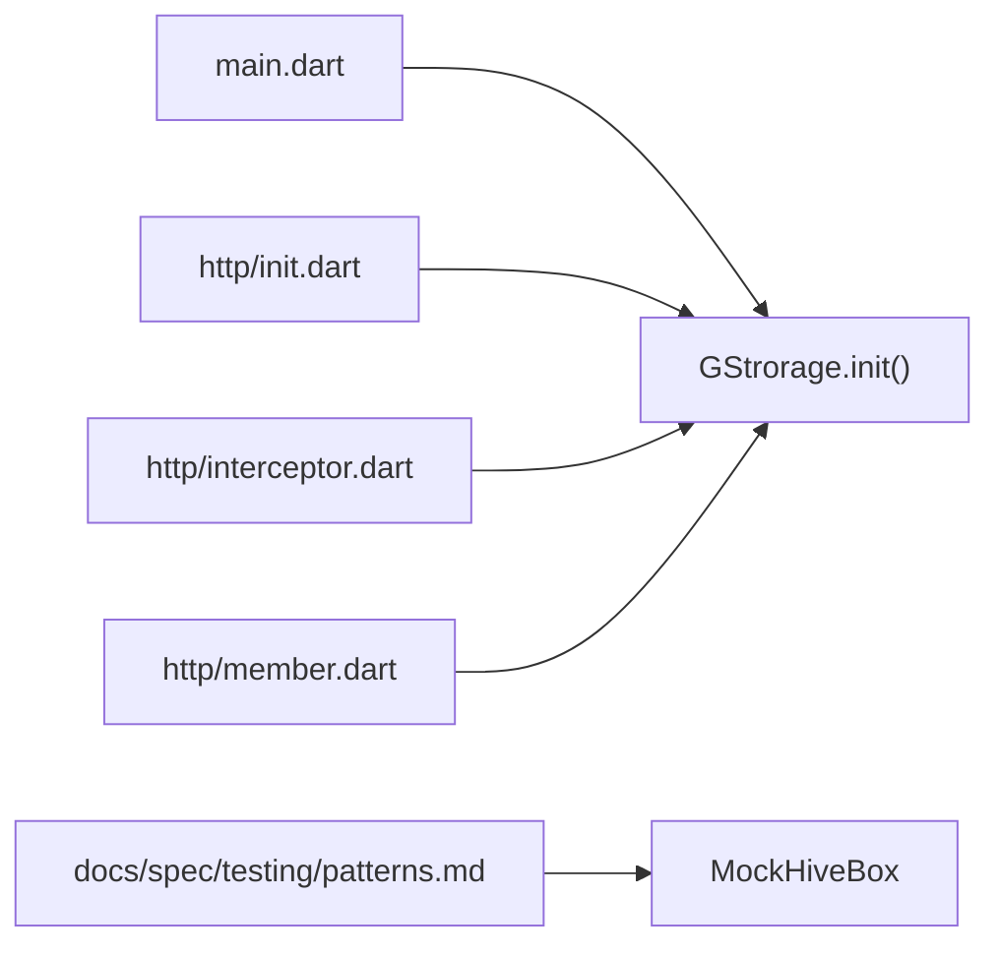

# 存储系统

<cite>
**本文引用的文件**
- [storage_service.dart](file://lib/core/storage/storage_service.dart)
- [04-storage.md](file://docs/spec/architecture/04-storage.md)
- [storage.dart](file://lib/utils/storage.dart)
- [init.dart](file://lib/http/init.dart)
- [interceptor.dart](file://lib/http/interceptor.dart)
- [member.dart](file://lib/http/member.dart)
- [patterns.md](file://docs/spec/testing/patterns.md)
- [main.dart](file://lib/main.dart)
</cite>

## 目录
1. [简介](#简介)
2. [项目结构](#项目结构)
3. [核心组件](#核心组件)
4. [架构总览](#架构总览)
5. [详细组件分析](#详细组件分析)
6. [依赖关系分析](#依赖关系分析)
7. [性能考量](#性能考量)
8. [故障排查指南](#故障排查指南)
9. [结论](#结论)
10. [附录](#附录)

## 简介
本文件系统性梳理 PiliPala 项目的本地存储方案，重点围绕 Hive 本地数据库的选型与实现、键值规范、适配器注册、数据迁移策略、缓存机制设计、事务与并发控制、性能优化与容量管理等方面进行深入说明，并提供面向开发者的最佳实践与排障建议。

## 项目结构
PiliPala 的存储体系以 Hive 为核心，通过统一的 GStrorage 单例管理多个 Box（如 setting、userInfo、localCache、historyWord、video），并在应用启动阶段完成初始化与适配器注册。业务层通过直接访问或通过抽象的 StorageService 接口进行读写操作；测试层支持对 Hive 进行 Mock 以便隔离验证。



图表来源
- [storage_service.dart:24-64](file://lib/core/storage/storage_service.dart#L24-L64)
- [04-storage.md:22-41](file://docs/spec/architecture/04-storage.md#L22-L41)

章节来源
- [04-storage.md:1-41](file://docs/spec/architecture/04-storage.md#L1-L41)
- [storage_service.dart:1-64](file://lib/core/storage/storage_service.dart#L1-L64)

## 核心组件
- StorageService 抽象接口：提供类型安全的 get/set/remove/contains 操作，便于测试替身与集中式逻辑。
- HiveStorageService 实现：基于 Hive Box 的具体实现，封装读写删除与存在性判断。
- StorageServiceFactory：按 Box 类型创建对应的 StorageService 实例，便于依赖注入与替换。
- GStrorage 单例：集中初始化 Hive、注册适配器、打开各 Box，提供全局访问入口。
- 键值常量：SettingBoxKey、LocalCacheKey、VideoBoxKey 等，统一键名管理，避免魔法字符串。

章节来源
- [storage_service.dart:10-64](file://lib/core/storage/storage_service.dart#L10-L64)
- [04-storage.md:22-41](file://docs/spec/architecture/04-storage.md#L22-L41)
- [storage.dart:48-113](file://lib/utils/storage.dart#L48-L113)

## 架构总览
下图展示了从应用层到存储层的数据流与职责边界，以及适配器注册与 Box 初始化的关键步骤。



图表来源
- [04-storage.md:29-41](file://docs/spec/architecture/04-storage.md#L29-L41)
- [main.dart:1-50](file://lib/main.dart#L1-L50)

## 详细组件分析

### StorageService 抽象与实现
- 抽象接口：定义泛型 get/set/remove/contains，确保类型安全与可测试性。
- 实现类：HiveStorageService 将抽象映射到 Hive Box 的 get/put/delete/contains。
- 工厂：根据业务域（设置、用户信息、本地缓存）创建对应 StorageService，便于依赖注入与替换。



图表来源
- [storage_service.dart:10-64](file://lib/core/storage/storage_service.dart#L10-L64)

章节来源
- [storage_service.dart:10-64](file://lib/core/storage/storage_service.dart#L10-L64)

### GStrorage 单例与 Box 管理
- 初始化：在应用启动时调用 init()，设置 Hive 目录、注册适配器、打开各 Box。
- Box 分类：userInfo（登录用户信息）、localCache（认证与签名、弹幕设置、代理等）、setting（应用设置）、historyWord（搜索历史）、video（播放偏好）。
- 适配器：通过 regAdapter() 注册自定义类型适配器，确保复杂对象可序列化存储。



图表来源
- [04-storage.md:22-41](file://docs/spec/architecture/04-storage.md#L22-L41)

章节来源
- [04-storage.md:22-41](file://docs/spec/architecture/04-storage.md#L22-L41)

### 键值规范与读写示例
- 键值常量：SettingBoxKey、LocalCacheKey、VideoBoxKey 等，统一键名，避免魔法字符串。
- 读取：始终提供默认值，避免 null 导致的异常。
- 写入：支持基础类型与注册了适配器的自定义类型。
- 删除：支持单键删除与清空 Box。

```mermaid
sequenceDiagram
participant UI as "界面/控制器"
participant GS as "GStrorage"
participant Box as "Box(setting)"
participant Key as "SettingBoxKey"
UI->>GS : 获取 Box(setting)
GS-->>UI : 返回 Box_setting
UI->>Box : get(Key.themeMode, defaultValue)
Box-->>UI : 返回枚举 code
UI->>UI : 解析为 ThemeType
UI->>Box : put(Key.themeMode, newMode.code)
Box-->>UI : 写入成功
```

图表来源
- [04-storage.md:119-151](file://docs/spec/architecture/04-storage.md#L119-L151)
- [storage.dart:48-113](file://lib/utils/storage.dart#L48-L113)

章节来源
- [04-storage.md:44-151](file://docs/spec/architecture/04-storage.md#L44-L151)
- [storage.dart:48-113](file://lib/utils/storage.dart#L48-L113)

### 适配器注册与类型管理
- 注册：在 regAdapter() 中注册 UserInfoData、LevelInfo 等自定义类型适配器。
- 生成：通过 hive_generator 为模型类添加注解并生成适配器。
- Type ID：为每个自定义类型分配唯一 typeId，新增类型需递增。



图表来源
- [04-storage.md:155-192](file://docs/spec/architecture/04-storage.md#L155-L192)

章节来源
- [04-storage.md:155-192](file://docs/spec/architecture/04-storage.md#L155-L192)

### 数据迁移与默认值处理
- 版本兼容：通过读取版本键进行条件迁移，避免破坏旧数据。
- 默认值：读取时始终提供默认值，防止因缺失键导致的空指针或异常。



图表来源
- [04-storage.md:224-250](file://docs/spec/architecture/04-storage.md#L224-L250)

章节来源
- [04-storage.md:224-250](file://docs/spec/architecture/04-storage.md#L224-L250)

### 缓存机制设计（内存与磁盘）
- 磁盘缓存：Hive Box 作为持久化缓存，适合长期保存设置、用户信息、认证令牌、签名密钥、播放偏好等。
- 内存缓存：在 UI 层或业务层对热点数据进行内存缓存，减少重复读取；网络图片加载时根据尺寸计算内存缓存大小，平衡内存占用与渲染性能。
- 策略建议：对大对象采用懒加载与弱引用结合的方式；对频繁读取的小对象可放入内存缓存；定期清理过期或不常用数据。

章节来源
- [04-storage.md:271-283](file://docs/spec/architecture/04-storage.md#L271-L283)
- [lib/common/widgets/network_img_layer.dart:45-66](file://lib/common/widgets/network_img_layer.dart#L45-L66)

### 事务处理与并发控制
- 事务：批量写入时使用 Hive 事务以保证一致性与原子性，降低多次 IO 开销。
- 并发：Hive 本身具备线程安全能力，但建议在业务层避免同时对同一 Box 进行大量并发写操作；必要时通过队列或锁协调。
- 压缩：定期压缩 Box 以回收空间并提升查询性能。

章节来源
- [04-storage.md:271-277](file://docs/spec/architecture/04-storage.md#L271-L277)

### 安全注意事项
- 敏感数据：将 Token、Cookie 等敏感信息放入 localCache Box，避免泄露到其他 Box。
- 日志：避免在日志中输出敏感键值或完整对象。
- 加密：当前未强制启用加密存储，建议未来对敏感字段引入加密层（如 AES）。

章节来源
- [04-storage.md:278-283](file://docs/spec/architecture/04-storage.md#L278-L283)

### 代码示例路径（读写、事务、并发）
- 读取设置示例：[04-storage.md:119-131](file://docs/spec/architecture/04-storage.md#L119-L131)
- 写入设置示例：[04-storage.md:133-141](file://docs/spec/architecture/04-storage.md#L133-L141)
- 删除与清空示例：[04-storage.md:143-151](file://docs/spec/architecture/04-storage.md#L143-L151)
- 事务与压缩建议：[04-storage.md:271-277](file://docs/spec/architecture/04-storage.md#L271-L277)
- 并发与锁建议：[04-storage.md:271-277](file://docs/spec/architecture/04-storage.md#L271-L277)

## 依赖关系分析
- 应用启动依赖：main.dart 调用 GStrorage.init() 完成存储初始化。
- 业务依赖：HTTP 层在鉴权与代理配置中读写 localCache 与 setting；用户信息写入 userInfo Box。
- 测试依赖：测试规范提供 MockHiveBox，便于单元测试隔离存储层。



图表来源
- [main.dart:1-50](file://lib/main.dart#L1-L50)
- [init.dart:26-38](file://lib/http/init.dart#L26-L38)
- [interceptor.dart:29-31](file://lib/http/interceptor.dart#L29-L31)
- [member.dart:465-469](file://lib/http/member.dart#L465-L469)
- [patterns.md:216-245](file://docs/spec/testing/patterns.md#L216-L245)

章节来源
- [main.dart:1-50](file://lib/main.dart#L1-L50)
- [init.dart:26-38](file://lib/http/init.dart#L26-L38)
- [interceptor.dart:29-31](file://lib/http/interceptor.dart#L29-L31)
- [member.dart:465-469](file://lib/http/member.dart#L465-L469)
- [patterns.md:216-245](file://docs/spec/testing/patterns.md#L216-L245)

## 性能考量
- 批量写入：使用事务合并多次 put 操作，减少磁盘 IO。
- 压缩策略：定期压缩 Box，释放碎片空间，提升查询效率。
- 读写频率：避免频繁读写热键，可通过节流或去抖策略降低压力。
- 大数据分页：对列表型数据采用分页存储与懒加载，避免一次性加载过多。
- 内存缓存：热点数据放入内存缓存，结合 LRU 或 TTL 策略淘汰冷数据。

章节来源
- [04-storage.md:271-277](file://docs/spec/architecture/04-storage.md#L271-L277)

## 故障排查指南
- 初始化失败：检查 GStrorage.init() 是否在应用启动早期调用，确认目录权限与适配器注册是否正确。
- 读取为空：确认键名拼写与常量一致，且读取时提供了默认值。
- 自定义对象无法序列化：检查是否注册了对应适配器，typeId 是否唯一且递增。
- 测试失败：使用 MockHiveBox 替换真实 Box，确保测试隔离与可重复性。
- 敏感数据泄露：确认敏感信息仅写入 localCache，避免在日志中打印。

章节来源
- [04-storage.md:224-250](file://docs/spec/architecture/04-storage.md#L224-L250)
- [patterns.md:216-245](file://docs/spec/testing/patterns.md#L216-L245)

## 结论
PiliPala 的存储系统以 Hive 为基础，通过 GStrorage 单例与 StorageService 抽象实现了清晰的职责分离与良好的可测试性。配合统一的键值规范、适配器注册与迁移策略，系统在功能扩展与维护性方面具备良好基础。建议后续在安全层面引入敏感数据加密，在性能层面完善事务与缓存策略，并持续优化容量管理与版本演进流程。

## 附录
- 键值常量参考：SettingBoxKey、LocalCacheKey、VideoBoxKey
- 适配器注册与生成参考：regAdapter()、@HiveType/@HiveField
- 事务与压缩建议：批量写入、定期压缩、内存缓存策略