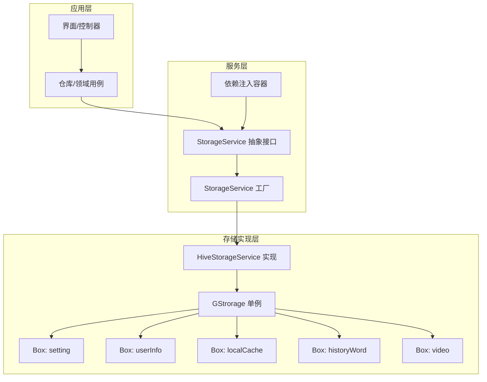
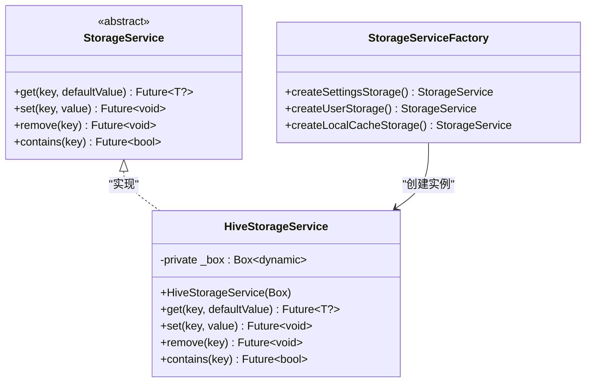
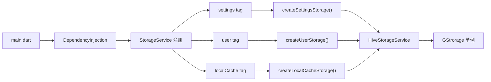

# 存储系统

<cite>
**本文引用的文件**
- [storage_service.dart](file://lib/core/storage/storage_service.dart)
- [04-storage.md](file://docs/spec/architecture/04-storage.md)
- [storage.dart](file://lib/utils/storage.dart)
- [dependency_injection.dart](file://lib/core/di/dependency_injection.dart)
- [core.dart](file://lib/core/core.dart)
- [core_mocks.dart](file://test/mocks/core_mocks.dart)
- [main.dart](file://lib/main.dart)
</cite>

## 更新摘要
**所做更改**
- 新增存储服务抽象化章节，详细介绍 StorageService 接口设计
- 更新架构图以反映新的抽象层结构
- 新增依赖注入集成说明
- 更新工厂模式实现细节
- 新增测试替身使用指南

## 目录
1. [简介](#简介)
2. [项目结构](#项目结构)
3. [核心组件](#核心组件)
4. [架构总览](#架构总览)
5. [详细组件分析](#详细组件分析)
6. [依赖关系分析](#依赖关系分析)
7. [性能考量](#性能考量)
8. [故障排查指南](#故障排查指南)
9. [结论](#结论)
10. [附录](#附录)

## 简介
本文件系统性梳理 PiliPala 项目的本地存储方案，重点围绕 StorageService 抽象接口的设计与实现、Hive 本地数据库的集成、键值规范、适配器注册、数据迁移策略、缓存机制设计、事务与并发控制、性能优化与容量管理等方面进行深入说明，并提供面向开发者的最佳实践与排障建议。

**更新** 新增存储服务抽象化设计，通过统一接口支持不同存储后端，提升系统的可测试性和可扩展性。

## 项目结构
PiliPala 的存储体系以 StorageService 抽象接口为核心，通过 HiveStorageService 具体实现和 StorageServiceFactory 工厂模式，提供类型安全的存储操作。系统支持依赖注入集成，便于在不同场景下灵活切换存储后端。



**图表来源**
- [storage_service.dart:10-64](file://lib/core/storage/storage_service.dart#L10-L64)
- [dependency_injection.dart:43-49](file://lib/core/di/dependency_injection.dart#L43-L49)

**章节来源**
- [storage_service.dart:1-64](file://lib/core/storage/storage_service.dart#L1-L64)
- [dependency_injection.dart:41-50](file://lib/core/di/dependency_injection.dart#L41-L50)

## 核心组件
- **StorageService 抽象接口**：提供类型安全的 get/set/remove/contains 操作，确保编译时类型检查和运行时安全性。
- **HiveStorageService 实现**：基于 Hive Box 的具体实现，封装读写删除与存在性判断操作。
- **StorageServiceFactory**：按业务域创建对应的 StorageService 实例，支持设置、用户信息、本地缓存等不同存储域。
- **依赖注入集成**：通过 Get.lazyPut 和标签系统实现存储服务的延迟初始化和多实例管理。
- **GStrorage 单例**：集中管理 Hive Box 的初始化、适配器注册和生命周期管理。

**章节来源**
- [storage_service.dart:10-64](file://lib/core/storage/storage_service.dart#L10-L64)
- [dependency_injection.dart:43-49](file://lib/core/di/dependency_injection.dart#L43-L49)
- [storage.dart:7-48](file://lib/utils/storage.dart#L7-L48)

## 架构总览
下图展示了从应用层到存储层的数据流与职责边界，以及依赖注入和工厂模式的关键步骤。

```mermaid
sequenceDiagram
participant App as "应用启动"
participant DI as "依赖注入容器"
participant Factory as "StorageServiceFactory"
participant Service as "StorageService"
participant HiveImpl as "HiveStorageService"
participant Gs as "GStrorage"
participant Box as "Hive Box"
App->>DI : 初始化依赖注入
DI->>Factory : 创建存储服务实例
Factory->>HiveImpl : new HiveStorageService(box)
HiveImpl->>Gs : 使用 GStrorage.box
Gs->>Box : 访问具体 Box
Box-->>Gs : 返回存储数据
Gs-->>HiveImpl : 返回 Box 实例
HiveImpl-->>Service : 返回实现
Service-->>DI : 注册到容器
DI-->>App : 存储服务可用
```

**图表来源**
- [dependency_injection.dart:43-49](file://lib/core/di/dependency_injection.dart#L43-L49)
- [storage_service.dart:52-63](file://lib/core/storage/storage_service.dart#L52-L63)

## 详细组件分析

### StorageService 抽象接口设计
StorageService 接口提供了统一的存储操作规范，确保类型安全和可测试性：

- **泛型方法**：get<T>()、set<T>() 方法支持编译时类型检查
- **标准操作**：包含 get、set、remove、contains 四种基本操作
- **异步设计**：所有操作均为 Future 类型，支持非阻塞 I/O
- **默认值支持**：get 操作支持默认值参数，避免空值处理



**图表来源**
- [storage_service.dart:10-64](file://lib/core/storage/storage_service.dart#L10-L64)

**章节来源**
- [storage_service.dart:10-15](file://lib/core/storage/storage_service.dart#L10-L15)
- [storage_service.dart:24-49](file://lib/core/storage/storage_service.dart#L24-L49)
- [storage_service.dart:52-63](file://lib/core/storage/storage_service.dart#L52-L63)

### HiveStorageService 具体实现
HiveStorageService 是 StorageService 接口的默认实现，基于 Hive Box 提供存储功能：

- **Box 包装**：通过构造函数接收 Box 实例，实现接口到具体实现的映射
- **类型转换**：在 get 操作中进行类型安全的转换
- **异步操作**：所有 Hive 操作都通过 await 关键字确保异步执行
- **错误处理**：依赖 Hive 库内置的错误处理机制

**章节来源**
- [storage_service.dart:24-49](file://lib/core/storage/storage_service.dart#L24-L49)

### StorageServiceFactory 工厂模式
StorageServiceFactory 提供了按业务域创建存储服务实例的工厂方法：

- **设置存储**：createSettingsStorage() 创建设置相关的存储服务
- **用户存储**：createUserStorage() 创建用户信息存储服务  
- **本地缓存存储**：createLocalCacheStorage() 创建本地缓存存储服务
- **依赖注入集成**：与 Get.lazyPut 结合实现延迟初始化

**章节来源**
- [storage_service.dart:52-63](file://lib/core/storage/storage_service.dart#L52-L63)
- [dependency_injection.dart:43-49](file://lib/core/di/dependency_injection.dart#L43-L49)

### 依赖注入集成
系统通过 GetX 框架实现存储服务的依赖注入：

- **延迟初始化**：使用 Get.lazyPut 实现按需创建和缓存
- **标签系统**：通过 tag 参数区分不同类型的存储服务
- **自动注入**：在控制器和仓库中通过依赖注入获取存储服务
- **生命周期管理**：由框架负责存储服务的创建和销毁

**章节来源**
- [dependency_injection.dart:43-49](file://lib/core/di/dependency_injection.dart#L43-L49)
- [core.dart:4-5](file://lib/core/core.dart#L4-L5)

### GStrorage 单例管理
GStrorage 作为 Hive Box 的统一管理入口：

- **Box 初始化**：在 init() 方法中初始化所有 Hive Box
- **适配器注册**：通过 regAdapter() 注册自定义类型适配器
- **生命周期管理**：提供 close() 方法用于资源清理
- **平台适配**：支持 Web 和移动端的不同初始化策略

**章节来源**
- [storage.dart:7-48](file://lib/utils/storage.dart#L7-L48)
- [storage.dart:50-68](file://lib/utils/storage.dart#L50-L68)

### 键值规范与读写示例
系统提供统一的键值常量管理：

- **SettingBoxKey**：应用设置相关的键值常量
- **LocalCacheKey**：本地缓存相关的键值常量  
- **VideoBoxKey**：视频播放设置相关的键值常量
- **类型安全**：通过常量确保键名的一致性和类型安全

**章节来源**
- [storage.dart:71-198](file://lib/utils/storage.dart#L71-L198)

### 适配器注册与类型管理
系统通过适配器机制支持自定义对象的序列化：

- **注册机制**：在 regAdapter() 中注册 UserInfoData、LevelInfo 等适配器
- **类型标识**：每个自定义类型都有唯一的 typeId
- **构建工具**：使用 hive_generator 自动生成适配器代码

**章节来源**
- [storage.dart:50-53](file://lib/utils/storage.dart#L50-L53)

### 数据迁移与默认值处理
系统提供完整的数据迁移和默认值处理机制：

- **版本检查**：通过版本键检查数据兼容性
- **条件迁移**：根据版本号执行相应的迁移逻辑
- **默认值保障**：所有读取操作都提供默认值参数

**章节来源**
- [04-storage.md:224-250](file://docs/spec/architecture/04-storage.md#L224-L250)

### 缓存机制设计（内存与磁盘）
系统采用多层次缓存策略：

- **磁盘缓存**：Hive Box 作为持久化缓存，存储长期数据
- **内存缓存**：在业务层对热点数据进行内存缓存
- **混合策略**：根据数据访问频率和重要性选择合适的缓存策略

**章节来源**
- [04-storage.md:271-283](file://docs/spec/architecture/04-storage.md#L271-L283)

### 事务处理与并发控制
系统支持高效的事务处理和并发控制：

- **批量操作**：通过 Hive 事务支持批量写入操作
- **压缩策略**：定期压缩 Box 以回收空间和提升性能
- **并发协调**：建议在业务层避免对同一 Box 的大量并发写操作

**章节来源**
- [04-storage.md:271-277](file://docs/spec/architecture/04-storage.md#L271-L277)

### 安全注意事项
系统提供多层安全保护：

- **敏感数据隔离**：将 Token、Cookie 等敏感信息放入专用 Box
- **日志安全**：避免在日志中输出敏感键值或完整对象
- **加密支持**：为敏感字段预留加密存储的扩展空间

**章节来源**
- [04-storage.md:278-283](file://docs/spec/architecture/04-storage.md#L278-L283)

### 测试替身使用指南
系统支持完整的测试替身机制：

- **MockStorageService**：继承自 Mock 类，实现 StorageService 接口
- **测试隔离**：通过替身实现存储层的单元测试隔离
- **行为模拟**：可以模拟各种存储操作的返回值和异常情况

**章节来源**
- [core_mocks.dart:8-9](file://test/mocks/core_mocks.dart#L8-L9)

## 依赖关系分析
系统通过依赖注入建立清晰的依赖关系：



**图表来源**
- [dependency_injection.dart:43-49](file://lib/core/di/dependency_injection.dart#L43-L49)
- [storage_service.dart:52-63](file://lib/core/storage/storage_service.dart#L52-L63)

**章节来源**
- [dependency_injection.dart:41-50](file://lib/core/di/dependency_injection.dart#L41-L50)
- [core.dart:4-5](file://lib/core/core.dart#L4-L5)

## 性能考量
系统在性能优化方面采取多项措施：

- **延迟初始化**：通过 Get.lazyPut 实现按需创建，减少启动时间
- **批量操作**：支持 Hive 事务批量写入，减少磁盘 I/O 次数
- **压缩策略**：定期压缩 Box 以回收空间和提升查询效率
- **内存管理**：合理使用内存缓存，避免过度占用系统资源

**章节来源**
- [dependency_injection.dart:43-49](file://lib/core/di/dependency_injection.dart#L43-L49)
- [04-storage.md:271-277](file://docs/spec/architecture/04-storage.md#L271-L277)

## 故障排查指南
针对存储系统的常见问题提供排查指导：

- **初始化失败**：检查 GStrorage.init() 是否正确调用，确认 Hive 适配器注册
- **依赖注入问题**：确认 StorageServiceFactory 的工厂方法正确实现
- **类型转换错误**：检查存储数据的类型与期望类型是否匹配
- **测试失败**：确认 MockStorageService 正确实现了 StorageService 接口
- **内存泄漏**：检查存储服务的生命周期管理和资源清理

**章节来源**
- [storage_service.dart:10-15](file://lib/core/storage/storage_service.dart#L10-L15)
- [core_mocks.dart:8-9](file://test/mocks/core_mocks.dart#L8-L9)

## 结论
PiliPala 的存储系统通过 StorageService 抽象接口实现了高度的模块化和可测试性。新的抽象化设计不仅保持了与现有 Hive 实现的兼容性，还为未来的存储后端扩展奠定了基础。配合依赖注入集成、工厂模式和完整的测试支持，系统在功能扩展、维护性和性能方面都具备了良好的基础。建议后续继续完善测试覆盖率，探索更多存储后端的可能性，并持续优化性能表现。

## 附录
- **存储服务接口**：StorageService 抽象接口定义
- **实现类**：HiveStorageService 具体实现
- **工厂模式**：StorageServiceFactory 工厂方法
- **依赖注入**：Get.lazyPut 集成配置
- **测试替身**：MockStorageService 使用示例
- **键值常量**：SettingBoxKey、LocalCacheKey、VideoBoxKey
- **适配器注册**：regAdapter() 方法实现
- **事务处理**：批量写入和压缩策略