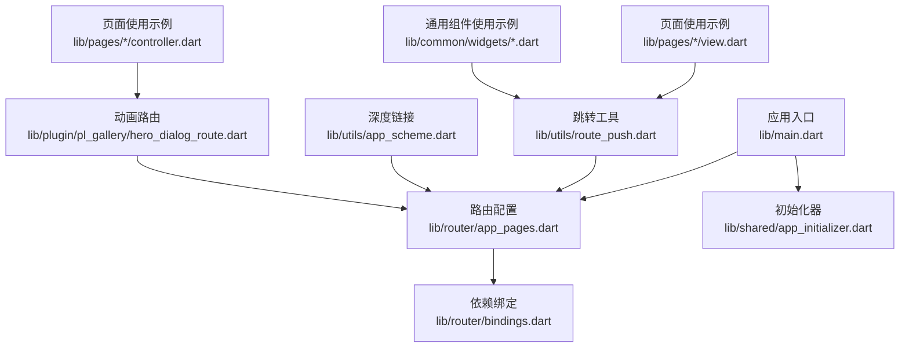
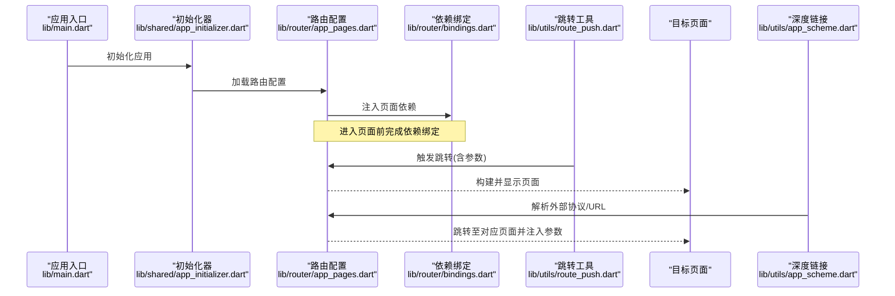
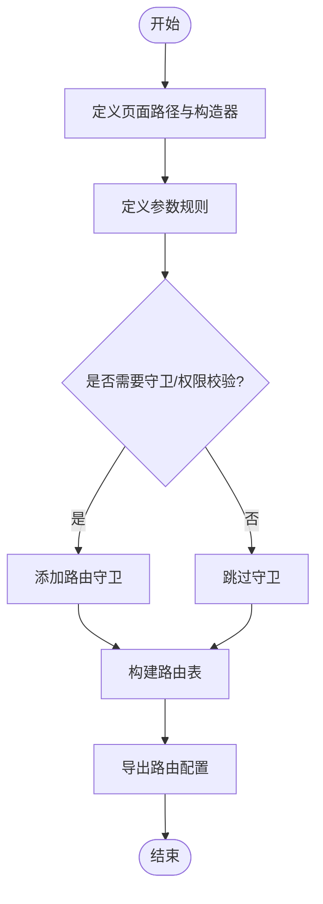
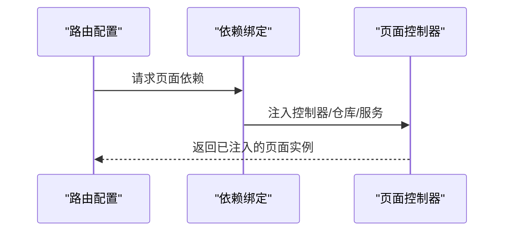
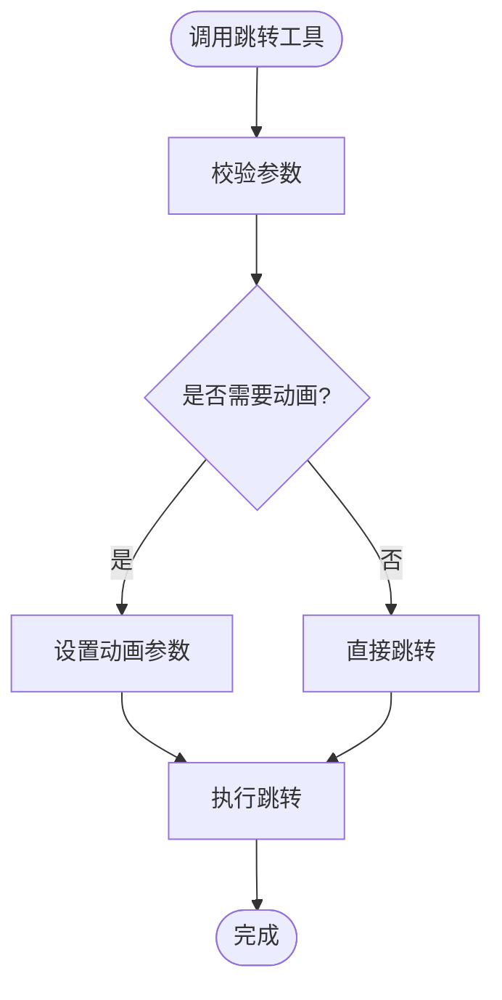
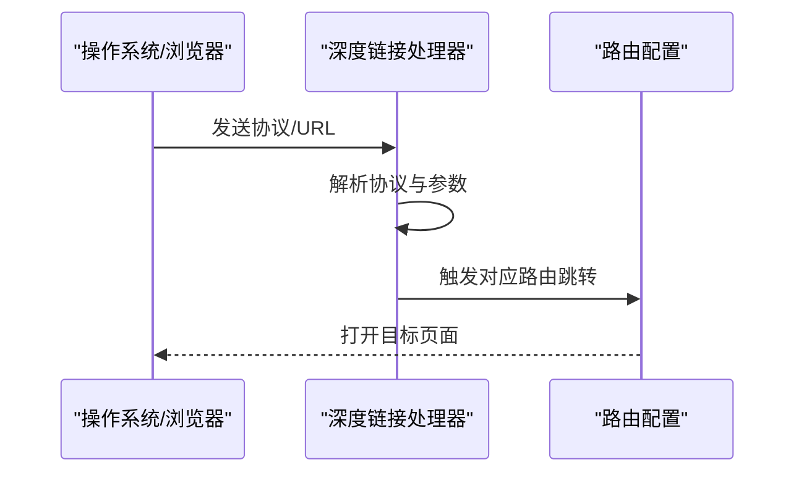
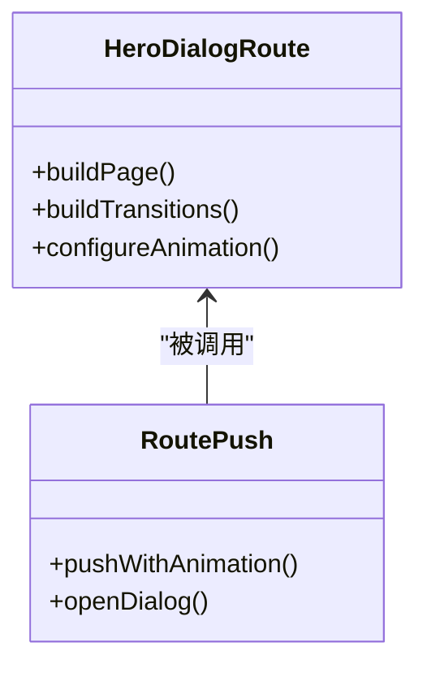
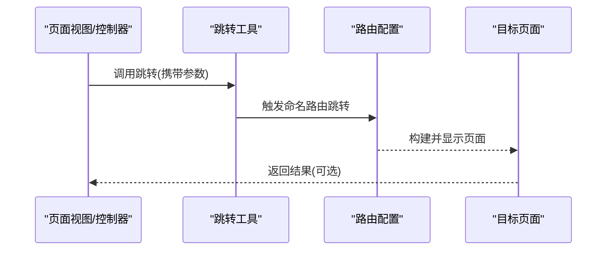
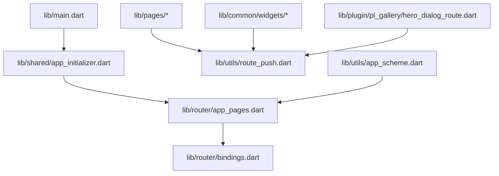

# 导航系统

<cite>
**本文引用的文件**
- [lib/main.dart](file://lib/main.dart)
- [lib/router/app_pages.dart](file://lib/router/app_pages.dart)
- [lib/router/bindings.dart](file://lib/router/bindings.dart)
- [lib/utils/route_push.dart](file://lib/utils/route_push.dart)
- [lib/utils/app_scheme.dart](file://lib/utils/app_scheme.dart)
- [lib/shared/app_initializer.dart](file://lib/shared/app_initializer.dart)
- [lib/plugin/pl_gallery/hero_dialog_route.dart](file://lib/plugin/pl_gallery/hero_dialog_route.dart)
- [lib/pages/opus/controller.dart](file://lib/pages/opus/controller.dart)
- [lib/pages/read/controller.dart](file://lib/pages/read/controller.dart)
- [lib/pages/whisper_detail/widget/chat_item.dart](file://lib/pages/whisper_detail/widget/chat_item.dart)
- [lib/pages/dynamics/view.dart](file://lib/pages/dynamics/view.dart)
- [lib/pages/search_panel/widgets/media_bangumi_panel.dart](file://lib/pages/search_panel/widgets/media_bangumi_panel.dart)
- [lib/pages/subscription/view.dart](file://lib/pages/subscription/view.dart)
- [lib/pages/history/view.dart](file://lib/pages/history/view.dart)
- [lib/pages/fav/view.dart](file://lib/pages/fav/view.dart)
- [lib/pages/later/view.dart](file://lib/pages/later/view.dart)
- [lib/pages/bangumi/widgets/bangumu_card_v.dart](file://lib/pages/bangumi/widgets/bangumi_card_v.dart)
- [lib/common/widgets/video_card_h.dart](file://lib/common/widgets/video_card_h.dart)
- [lib/common/widgets/video_card_v.dart](file://lib/common/widgets/video_card_v.dart)
</cite>

## 目录
1. [简介](#简介)
2. [项目结构](#项目结构)
3. [核心组件](#核心组件)
4. [架构总览](#架构总览)
5. [详细组件分析](#详细组件分析)
6. [依赖关系分析](#依赖关系分析)
7. [性能考虑](#性能考虑)
8. [故障排查指南](#故障排查指南)
9. [结论](#结论)
10. [附录](#附录)

## 简介
本文件系统性梳理 PiliPala 项目的导航体系，重点覆盖自定义路由配置、页面跳转与参数传递、返回栈控制、深度链接处理、路由守卫与权限控制、导航动画与过渡效果、以及性能优化与内存管理策略。文档以“自上而下”的方式组织：先给出整体架构与关键组件，再深入到具体实现细节，并通过图示帮助读者快速建立对导航系统的整体认知。

## 项目结构
导航相关的核心文件集中在以下位置：
- 应用入口与初始化：lib/main.dart
- 路由配置与页面映射：lib/router/app_pages.dart
- 依赖注入与绑定：lib/router/bindings.dart
- 页面跳转工具：lib/utils/route_push.dart
- 深度链接与外部协议：lib/utils/app_scheme.dart
- 初始化器（加载路由配置）：lib/shared/app_initializer.dart
- 动画路由（对话框/转场）：lib/plugin/pl_gallery/hero_dialog_route.dart
- 多个页面中使用跳转工具的示例：lib/pages/*/view.dart、lib/pages/*/controller.dart、lib/common/widgets/*.dart 等

**图表来源**
- [lib/main.dart](file://lib/main.dart)
- [lib/router/app_pages.dart](file://lib/router/app_pages.dart)
- [lib/shared/app_initializer.dart](file://lib/shared/app_initializer.dart)
- [lib/router/bindings.dart](file://lib/router/bindings.dart)
- [lib/utils/route_push.dart](file://lib/utils/route_push.dart)
- [lib/utils/app_scheme.dart](file://lib/utils/app_scheme.dart)
- [lib/plugin/pl_gallery/hero_dialog_route.dart](file://lib/plugin/pl_gallery/hero_dialog_route.dart)

**章节来源**
- [lib/main.dart](file://lib/main.dart)
- [lib/router/app_pages.dart](file://lib/router/app_pages.dart)
- [lib/shared/app_initializer.dart](file://lib/shared/app_initializer.dart)

## 核心组件
- 路由配置中心：负责定义页面路径、页面构造器、路由名称与参数规则，统一管理页面映射与导航入口。
- 依赖绑定层：在进入页面前进行状态/控制器注入，确保页面具备所需依赖，提升解耦与可测试性。
- 跳转工具：封装统一的 push/pop/replace 等跳转方法，支持带参跳转、返回栈控制、动画配置等。
- 深度链接处理器：解析外部协议与 URL，触发对应页面跳转或参数注入。
- 动画路由：提供对话框式转场、Hero 动画等视觉体验增强。
- 页面使用点：各页面与通用组件通过统一工具调用导航，形成一致的交互行为。

**章节来源**
- [lib/router/app_pages.dart](file://lib/router/app_pages.dart)
- [lib/router/bindings.dart](file://lib/router/bindings.dart)
- [lib/utils/route_push.dart](file://lib/utils/route_push.dart)
- [lib/utils/app_scheme.dart](file://lib/utils/app_scheme.dart)
- [lib/plugin/pl_gallery/hero_dialog_route.dart](file://lib/plugin/pl_gallery/hero_dialog_route.dart)

## 架构总览
下图展示了从应用启动到页面跳转的关键流程，以及与动画、深度链接、依赖注入的关系。

**图表来源**
- [lib/main.dart](file://lib/main.dart)
- [lib/shared/app_initializer.dart](file://lib/shared/app_initializer.dart)
- [lib/router/app_pages.dart](file://lib/router/app_pages.dart)
- [lib/router/bindings.dart](file://lib/router/bindings.dart)
- [lib/utils/route_push.dart](file://lib/utils/route_push.dart)
- [lib/utils/app_scheme.dart](file://lib/utils/app_scheme.dart)

## 详细组件分析

### 路由配置与页面映射（app_pages.dart）
- 定义页面路径与页面构造器，统一管理路由名称与参数规则。
- 提供导航入口（如 pushNamed、pushReplacementNamed 等），集中处理跳转逻辑。
- 支持参数传递与校验，保证跳转时的数据一致性。
- 可扩展为支持条件导航与动态路由（例如根据用户状态或上下文动态选择页面）。

**图表来源**
- [lib/router/app_pages.dart](file://lib/router/app_pages.dart)

**章节来源**
- [lib/router/app_pages.dart](file://lib/router/app_pages.dart)

### 依赖注入与绑定（bindings.dart）
- 在页面进入前执行依赖注入，确保页面控制器/状态已就绪。
- 与路由配置配合，实现“页面即服务”的解耦模式，便于单元测试与替换实现。
- 可按需延迟注入，减少首屏压力。

**图表来源**
- [lib/router/bindings.dart](file://lib/router/bindings.dart)
- [lib/router/app_pages.dart](file://lib/router/app_pages.dart)

**章节来源**
- [lib/router/bindings.dart](file://lib/router/bindings.dart)
- [lib/router/app_pages.dart](file://lib/router/app_pages.dart)

### 页面跳转工具（route_push.dart）
- 统一的 push/pop/replace 方法，支持带参跳转与返回栈控制。
- 封装动画参数与过渡效果，避免在页面中重复实现。
- 提供便捷方法用于条件跳转（如登录态判断后跳转）。

**图表来源**
- [lib/utils/route_push.dart](file://lib/utils/route_push.dart)

**章节来源**
- [lib/utils/route_push.dart](file://lib/utils/route_push.dart)

### 深度链接与外部协议（app_scheme.dart）
- 解析外部协议与 URL，识别页面与参数。
- 将解析结果转换为内部路由调用，实现从外部环境到应用内的无缝跳转。
- 可结合路由守卫进行权限校验与参数补全。

**图表来源**
- [lib/utils/app_scheme.dart](file://lib/utils/app_scheme.dart)
- [lib/router/app_pages.dart](file://lib/router/app_pages.dart)

**章节来源**
- [lib/utils/app_scheme.dart](file://lib/utils/app_scheme.dart)
- [lib/router/app_pages.dart](file://lib/router/app_pages.dart)

### 动画路由与转场（hero_dialog_route.dart）
- 提供对话框式转场与 Hero 动画，增强页面切换的视觉连贯性。
- 适用于详情页、图片浏览、弹窗等场景，提升用户体验。
- 与跳转工具配合，统一动画风格与参数。

**图表来源**
- [lib/plugin/pl_gallery/hero_dialog_route.dart](file://lib/plugin/pl_gallery/hero_dialog_route.dart)
- [lib/utils/route_push.dart](file://lib/utils/route_push.dart)

**章节来源**
- [lib/plugin/pl_gallery/hero_dialog_route.dart](file://lib/plugin/pl_gallery/hero_dialog_route.dart)
- [lib/utils/route_push.dart](file://lib/utils/route_push.dart)

### 页面与组件中的导航使用示例
- 页面视图与控制器通过统一工具发起跳转，保持行为一致。
- 常见场景包括：列表项点击跳转详情、搜索结果跳转、收藏/稍后再看等管理页跳转。
- 通用组件（如卡片、按钮）也通过工具实现跳转，降低重复代码。

**图表来源**
- [lib/pages/dynamics/view.dart](file://lib/pages/dynamics/view.dart)
- [lib/pages/search_panel/widgets/media_bangumi_panel.dart](file://lib/pages/search_panel/widgets/media_bangumi_panel.dart)
- [lib/pages/subscription/view.dart](file://lib/pages/subscription/view.dart)
- [lib/pages/history/view.dart](file://lib/pages/history/view.dart)
- [lib/pages/fav/view.dart](file://lib/pages/fav/view.dart)
- [lib/pages/later/view.dart](file://lib/pages/later/view.dart)
- [lib/pages/bangumi/widgets/bangumi_card_v.dart](file://lib/pages/bangumi/widgets/bangumi_card_v.dart)
- [lib/common/widgets/video_card_h.dart](file://lib/common/widgets/video_card_h.dart)
- [lib/common/widgets/video_card_v.dart](file://lib/common/widgets/video_card_v.dart)
- [lib/utils/route_push.dart](file://lib/utils/route_push.dart)
- [lib/router/app_pages.dart](file://lib/router/app_pages.dart)

**章节来源**
- [lib/pages/dynamics/view.dart](file://lib/pages/dynamics/view.dart)
- [lib/pages/search_panel/widgets/media_bangumi_panel.dart](file://lib/pages/search_panel/widgets/media_bangumi_panel.dart)
- [lib/pages/subscription/view.dart](file://lib/pages/subscription/view.dart)
- [lib/pages/history/view.dart](file://lib/pages/history/view.dart)
- [lib/pages/fav/view.dart](file://lib/pages/fav/view.dart)
- [lib/pages/later/view.dart](file://lib/pages/later/view.dart)
- [lib/pages/bangumi/widgets/bangumi_card_v.dart](file://lib/pages/bangumi/widgets/bangumi_card_v.dart)
- [lib/common/widgets/video_card_h.dart](file://lib/common/widgets/video_card_h.dart)
- [lib/common/widgets/video_card_v.dart](file://lib/common/widgets/video_card_v.dart)
- [lib/utils/route_push.dart](file://lib/utils/route_push.dart)
- [lib/router/app_pages.dart](file://lib/router/app_pages.dart)

## 依赖关系分析
- 应用入口依赖初始化器，初始化器加载路由配置；路由配置依赖依赖绑定层；页面与组件通过跳转工具与深度链接处理器间接依赖路由配置。
- 动画路由作为可插拔模块，与跳转工具配合使用，不改变主流程但增强体验。
- 各页面与组件通过统一工具调用导航，降低耦合度，提高复用性。

**图表来源**
- [lib/main.dart](file://lib/main.dart)
- [lib/shared/app_initializer.dart](file://lib/shared/app_initializer.dart)
- [lib/router/app_pages.dart](file://lib/router/app_pages.dart)
- [lib/router/bindings.dart](file://lib/router/bindings.dart)
- [lib/utils/route_push.dart](file://lib/utils/route_push.dart)
- [lib/utils/app_scheme.dart](file://lib/utils/app_scheme.dart)
- [lib/plugin/pl_gallery/hero_dialog_route.dart](file://lib/plugin/pl_gallery/hero_dialog_route.dart)

**章节来源**
- [lib/main.dart](file://lib/main.dart)
- [lib/shared/app_initializer.dart](file://lib/shared/app_initializer.dart)
- [lib/router/app_pages.dart](file://lib/router/app_pages.dart)
- [lib/router/bindings.dart](file://lib/router/bindings.dart)
- [lib/utils/route_push.dart](file://lib/utils/route_push.dart)
- [lib/utils/app_scheme.dart](file://lib/utils/app_scheme.dart)
- [lib/plugin/pl_gallery/hero_dialog_route.dart](file://lib/plugin/pl_gallery/hero_dialog_route.dart)

## 性能考虑
- 路由懒加载：仅在首次访问时加载页面与依赖，减少首屏体积与启动时间。
- 依赖延迟注入：在页面真正需要时才注入控制器/仓库，避免无谓的初始化成本。
- 动画与转场优化：合理使用动画参数，避免复杂动画导致掉帧；对高频跳转场景可关闭动画。
- 参数传递最小化：仅传递必要参数，避免大对象跨页面传输；必要时使用轻量级标识符+缓存查询。
- 返回栈管理：避免过深的返回栈；对不需要返回的页面使用替换跳转，减少内存占用。
- 深度链接预检：在解析外部协议前进行合法性校验，避免无效跳转造成的资源浪费。

## 故障排查指南
- 路由无法匹配：检查路由配置中的路径与参数规则，确认页面名称与传参是否一致。
- 页面未注入依赖：确认依赖绑定层是否正确注册，页面进入顺序是否符合预期。
- 跳转无动画或异常：检查动画路由配置与跳转工具参数，确保与页面类型匹配。
- 深度链接失效：核对协议注册与 URL 结构，确认解析逻辑与路由配置一致。
- 返回栈异常：检查跳转方式（push/pop/replace），避免误用导致栈混乱。

## 结论
PiliPala 的导航系统通过“路由配置 + 依赖绑定 + 统一跳转工具 + 深度链接 + 动画路由”的组合，实现了高内聚、低耦合且可扩展的导航能力。借助统一的跳转工具与依赖注入，页面与组件的导航行为保持一致；通过深度链接与动画路由，进一步提升了用户体验与可发现性。建议在后续迭代中继续完善路由守卫与权限控制、参数校验与错误恢复机制，并持续优化性能与内存占用。

## 附录
- 典型导航场景参考路径（不包含具体代码内容）：
  - 条件导航：[lib/utils/route_push.dart](file://lib/utils/route_push.dart)
  - 动态路由：[lib/router/app_pages.dart](file://lib/router/app_pages.dart)
  - 嵌套导航：[lib/router/app_pages.dart](file://lib/router/app_pages.dart)
  - 返回栈控制：[lib/utils/route_push.dart](file://lib/utils/route_push.dart)
  - 深度链接处理：[lib/utils/app_scheme.dart](file://lib/utils/app_scheme.dart)
  - 路由守卫与权限控制：[lib/router/app_pages.dart](file://lib/router/app_pages.dart)
  - 导航动画与转场：[lib/plugin/pl_gallery/hero_dialog_route.dart](file://lib/plugin/pl_gallery/hero_dialog_route.dart)
  - 页面使用示例：[lib/pages/dynamics/view.dart](file://lib/pages/dynamics/view.dart)、[lib/pages/search_panel/widgets/media_bangumi_panel.dart](file://lib/pages/search_panel/widgets/media_bangumi_panel.dart)、[lib/pages/subscription/view.dart](file://lib/pages/subscription/view.dart)、[lib/pages/history/view.dart](file://lib/pages/history/view.dart)、[lib/pages/fav/view.dart](file://lib/pages/fav/view.dart)、[lib/pages/later/view.dart](file://lib/pages/later/view.dart)、[lib/pages/bangumi/widgets/bangumi_card_v.dart](file://lib/pages/bangumi/widgets/bangumi_card_v.dart)、[lib/common/widgets/video_card_h.dart](file://lib/common/widgets/video_card_h.dart)、[lib/common/widgets/video_card_v.dart](file://lib/common/widgets/video_card_v.dart)