# 导航安全工具

<cite>
**本文档引用的文件**
- [README.md](file://README.md)
- [main.dart](file://lib/main.dart)
- [app_pages.dart](file://lib/router/app_pages.dart)
- [bindings.dart](file://lib/router/bindings.dart)
- [main_page.dart](file://lib/features/main/presentation/main_page.dart)
- [main_controller.dart](file://lib/features/main/presentation/main_controller.dart)
- [navigation_helper.dart](file://lib/utils/navigation_helper.dart)
- [02-state-management.md](file://docs/spec/architecture/02-state-management.md)
- [05-navigation.md](file://docs/spec/architecture/05-navigation.md)
</cite>

## 目录
1. [简介](#简介)
2. [项目结构](#项目结构)
3. [核心组件](#核心组件)
4. [架构概览](#架构概览)
5. [详细组件分析](#详细组件分析)
6. [依赖关系分析](#依赖关系分析)
7. [性能考虑](#性能考虑)
8. [故障排除指南](#故障排除指南)
9. [结论](#结论)

## 简介

PiliPala 是一个基于 Flutter 开发的 Bilibili 第三方客户端，专注于导航安全和用户体验优化。该项目采用现代化的三层架构设计，实现了完整的导航安全机制，包括页面返回保护、导航状态管理、以及跨平台兼容性处理。

项目的核心特色包括：
- 基于 GetX 的响应式状态管理
- 完整的路由管理系统
- 导航安全防护机制
- 跨平台兼容性（Android、iOS、Web）
- 高性能的视频播放体验

## 项目结构

项目采用模块化的三层架构设计，将功能按照数据层、领域层、展示层进行分离：

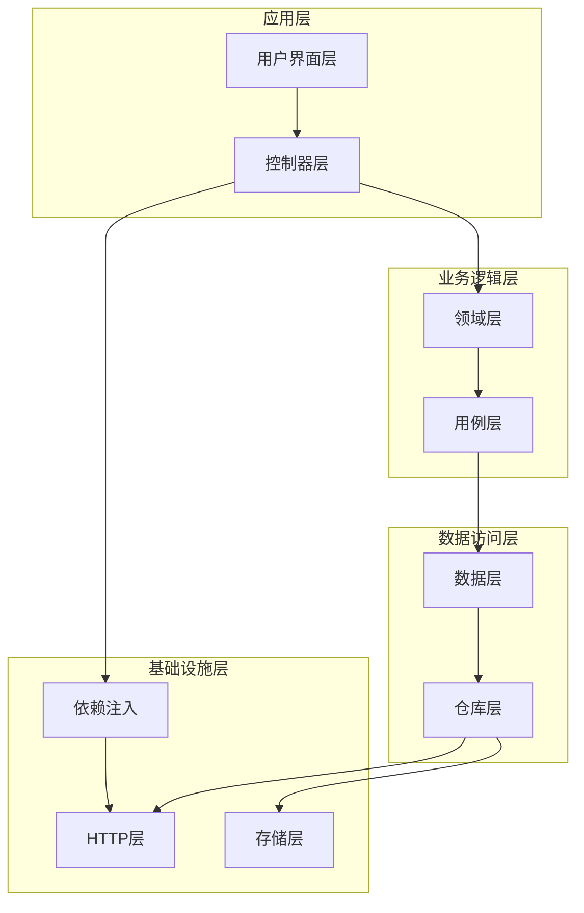

**图表来源**
- [main.dart:33-80](file://lib/main.dart#L33-L80)
- [app_pages.dart:94-299](file://lib/router/app_pages.dart#L94-L299)

**章节来源**
- [README.md:122-142](file://README.md#L122-L142)
- [main.dart:1-289](file://lib/main.dart#L1-289)

## 核心组件

### 导航安全架构

项目实现了多层次的导航安全机制，确保应用在各种场景下的稳定性和安全性：

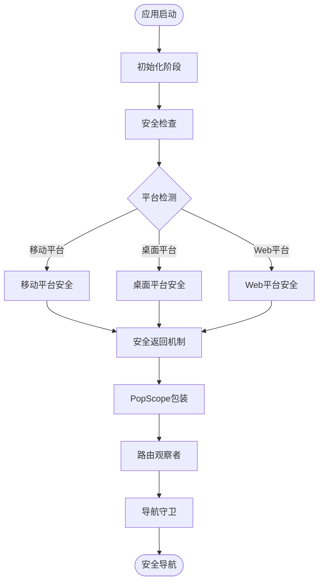

**图表来源**
- [main.dart:33-80](file://lib/main.dart#L33-L80)
- [navigation_helper.dart:6-24](file://lib/utils/navigation_helper.dart#L6-L24)

### 路由管理系统

项目采用 GetX 的路由管理方案，实现了完整的路由注册和依赖注入机制：

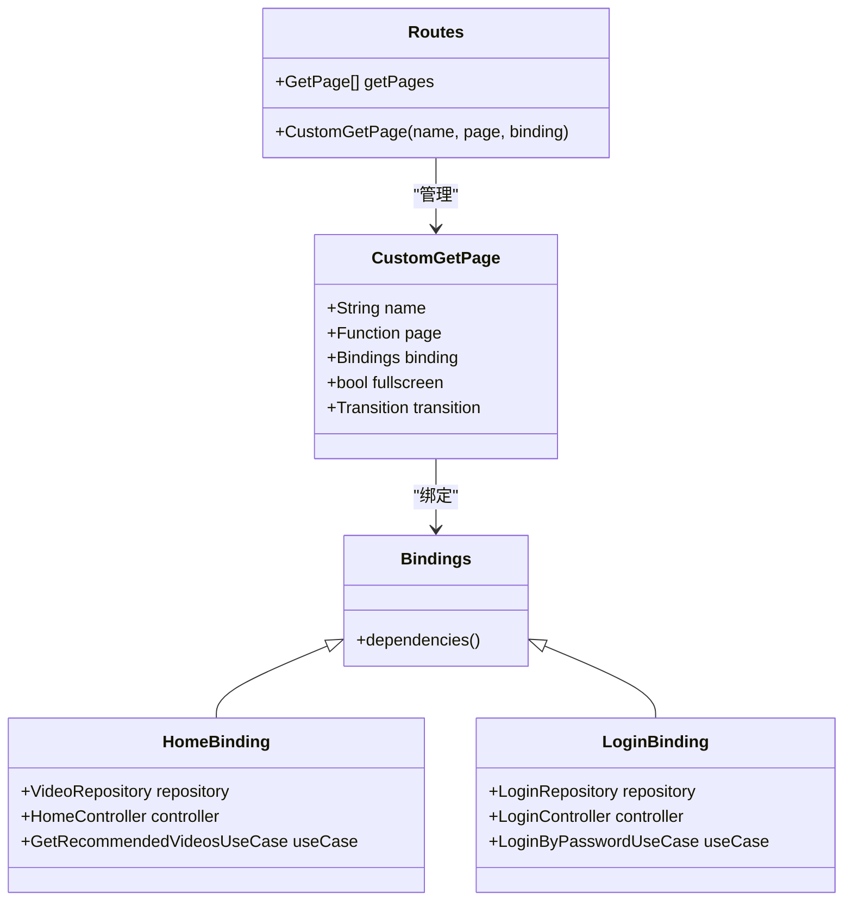

**图表来源**
- [app_pages.dart:94-317](file://lib/router/app_pages.dart#L94-L317)
- [bindings.dart:44-254](file://lib/router/bindings.dart#L44-L254)

**章节来源**
- [app_pages.dart:1-317](file://lib/router/app_pages.dart#L1-L317)
- [bindings.dart:1-254](file://lib/router/bindings.dart#L1-L254)

## 架构概览

### 导航安全体系

项目构建了一个完整的导航安全体系，涵盖了从应用启动到页面销毁的全过程：

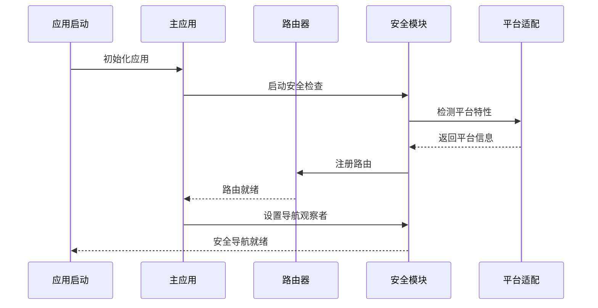

**图表来源**
- [main.dart:33-80](file://lib/main.dart#L33-L80)
- [main.dart:277-286](file://lib/main.dart#L277-L286)

### 页面生命周期管理

项目实现了严格的页面生命周期管理，确保每个页面都能正确处理导航事件：

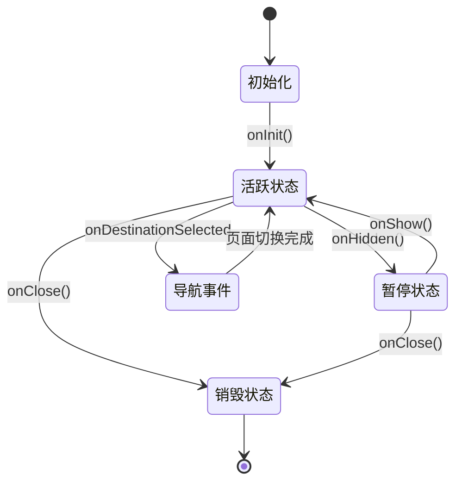

**图表来源**
- [main_page.dart:33-110](file://lib/features/main/presentation/main_page.dart#L33-L110)
- [main_controller.dart:62-80](file://lib/features/main/presentation/main_controller.dart#L62-L80)

**章节来源**
- [main.dart:82-289](file://lib/main.dart#L82-L289)
- [main_page.dart:1-253](file://lib/features/main/presentation/main_page.dart#L1-L253)

## 详细组件分析

### 主导航组件

主导航组件是整个应用导航系统的核心，负责管理底部导航栏和页面切换：

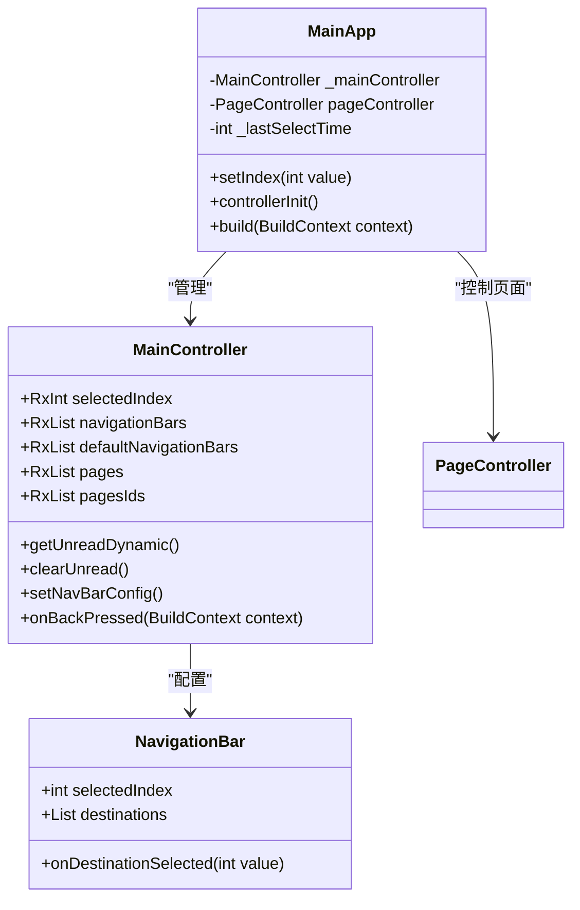

**图表来源**
- [main_page.dart:26-253](file://lib/features/main/presentation/main_page.dart#L26-L253)
- [main_controller.dart:1-118](file://lib/features/main/presentation/main_controller.dart#L1-L118)

#### 导航安全机制

项目实现了多重导航安全机制：

1. **平台兼容性检查**：自动检测设备类型并调整导航行为
2. **页面返回保护**：防止意外的页面返回操作
3. **导航状态同步**：确保导航状态与应用状态保持一致
4. **内存资源管理**：及时清理不再使用的导航资源

**章节来源**
- [main_page.dart:122-130](file://lib/features/main/presentation/main_page.dart#L122-L130)
- [main_page.dart:173-249](file://lib/features/main/presentation/main_page.dart#L173-L249)

### 路由安全控制

路由安全控制是导航系统的重要组成部分，确保只有授权的用户才能访问特定的功能：

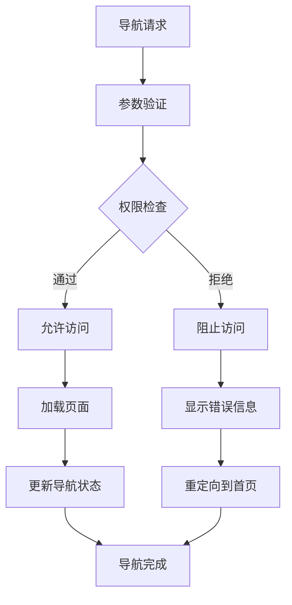

**图表来源**
- [app_pages.dart:228-258](file://lib/router/app_pages.dart#L228-L258)
- [05-navigation.md:240-279](file://docs/spec/architecture/05-navigation.md#L240-L279)

### 导航观察者系统

项目实现了全局的导航观察者系统，用于监控和控制应用的导航行为：

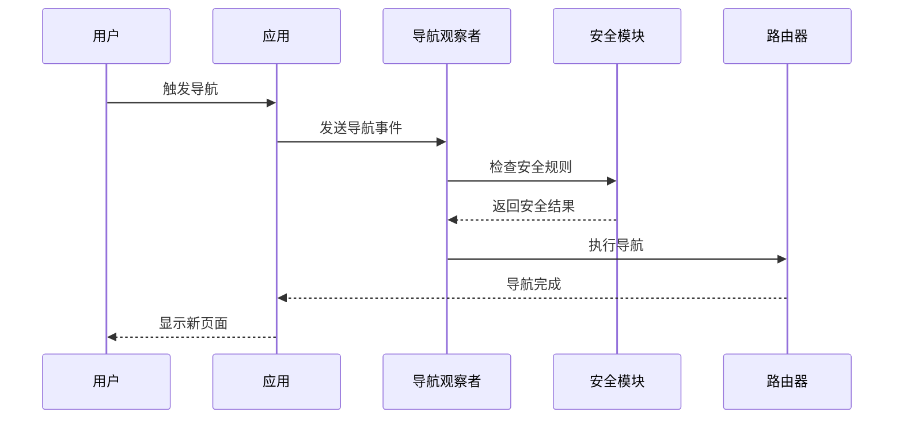

**图表来源**
- [main.dart:277-280](file://lib/main.dart#L277-L280)
- [main.dart:38-45](file://lib/main.dart#L38-L45)

**章节来源**
- [main.dart:267-286](file://lib/main.dart#L267-L286)
- [navigation_helper.dart:1-24](file://lib/utils/navigation_helper.dart#L1-L24)

## 依赖关系分析

### 组件依赖图

项目中的组件之间存在清晰的依赖关系，形成了稳定的架构层次：

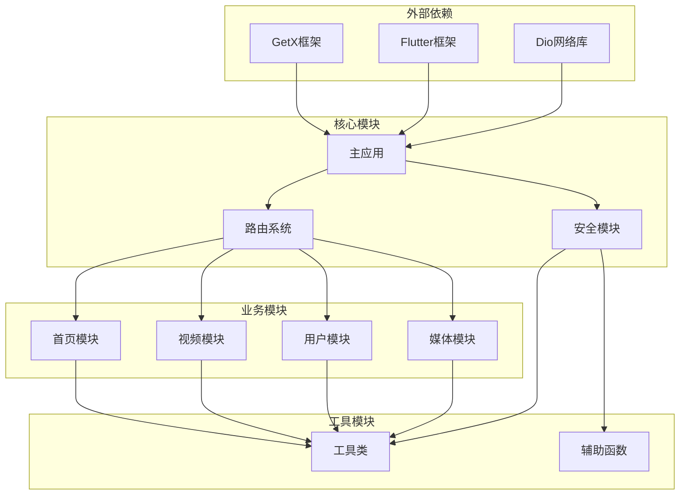

**图表来源**
- [main.dart:1-31](file://lib/main.dart#L1-L31)
- [app_pages.dart:38-90](file://lib/router/app_pages.dart#L38-L90)

### 依赖注入架构

项目采用 GetX 的依赖注入机制，实现了松耦合的设计：

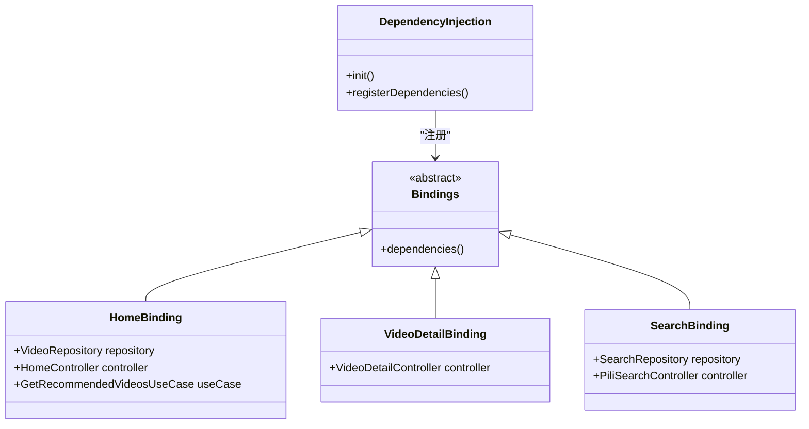

**图表来源**
- [bindings.dart:44-254](file://lib/router/bindings.dart#L44-L254)

**章节来源**
- [bindings.dart:1-254](file://lib/router/bindings.dart#L1-L254)
- [app_pages.dart:94-299](file://lib/router/app_pages.dart#L94-L299)

## 性能考虑

### 导航性能优化

项目在导航性能方面采用了多项优化措施：

1. **懒加载机制**：使用 Get.lazyPut 实现依赖的延迟加载
2. **内存管理**：及时清理不再使用的控制器和资源
3. **状态缓存**：合理使用响应式状态减少不必要的重建
4. **平台适配**：针对不同平台优化导航行为

### 性能监控

项目实现了完善的性能监控机制：

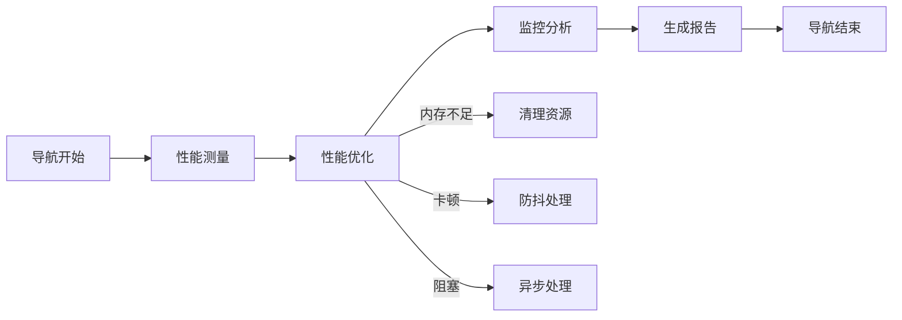

## 故障排除指南

### 常见导航问题

| 问题类型 | 症状描述 | 解决方案 |
|---------|---------|---------|
| 页面无法返回 | 使用 Get.back() 无效 | 使用 safeBack() 替代 |
| 导航状态异常 | 页面切换后状态错乱 | 检查 onInit/onClose 生命周期 |
| 内存泄漏 | 页面销毁后仍占用内存 | 确保正确清理控制器和监听器 |
| 平台兼容性 | 桌面平台导航异常 | 检查平台检测逻辑 |

### 调试技巧

1. **启用调试模式**：在开发环境中启用详细的日志输出
2. **监控内存使用**：定期检查应用的内存占用情况
3. **测试多平台**：在不同平台上测试导航功能
4. **模拟异常场景**：测试网络中断、权限拒绝等异常情况

**章节来源**
- [navigation_helper.dart:6-24](file://lib/utils/navigation_helper.dart#L6-L24)
- [05-navigation.md:273-279](file://docs/spec/architecture/05-navigation.md#L273-L279)

## 结论

PiliPala 项目展现了现代 Flutter 应用在导航安全方面的最佳实践。通过采用模块化的三层架构、完善的依赖注入机制、以及多层次的安全防护，项目实现了稳定可靠的导航体验。

项目的主要优势包括：
- **安全性强**：多层安全机制确保应用稳定运行
- **扩展性好**：模块化设计便于功能扩展
- **性能优异**：优化的导航机制提升用户体验
- **维护性强**：清晰的架构便于长期维护

未来的发展方向包括进一步完善导航安全机制、优化性能表现、以及增强跨平台兼容性。这些改进将进一步提升应用的整体质量和用户体验。