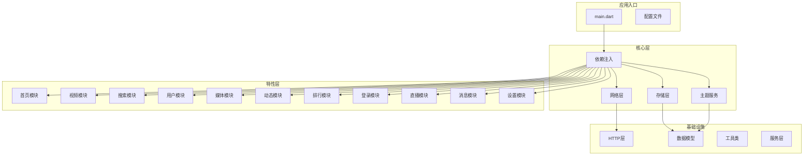
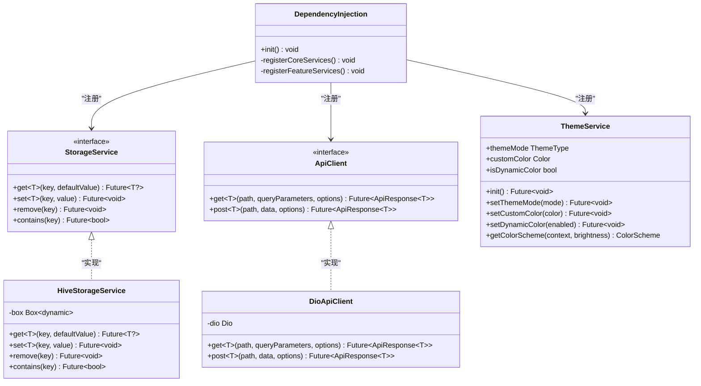
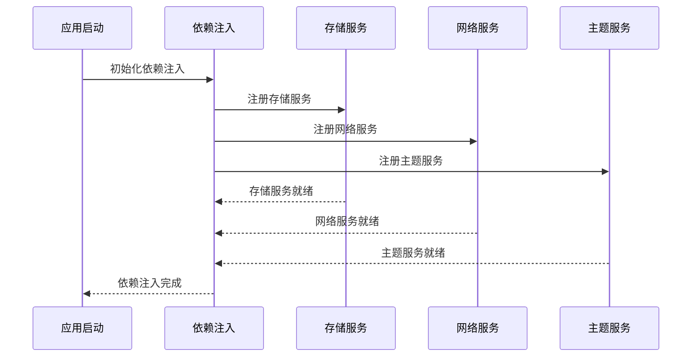
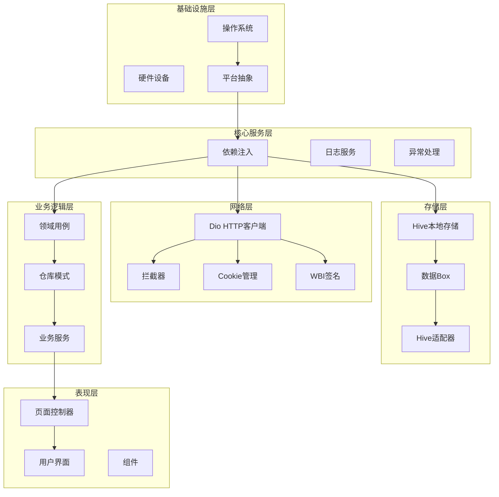
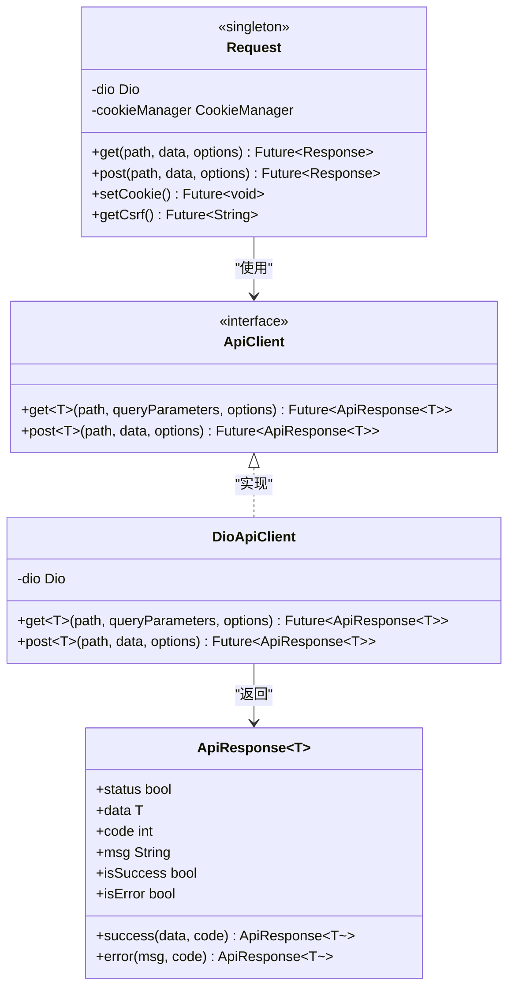
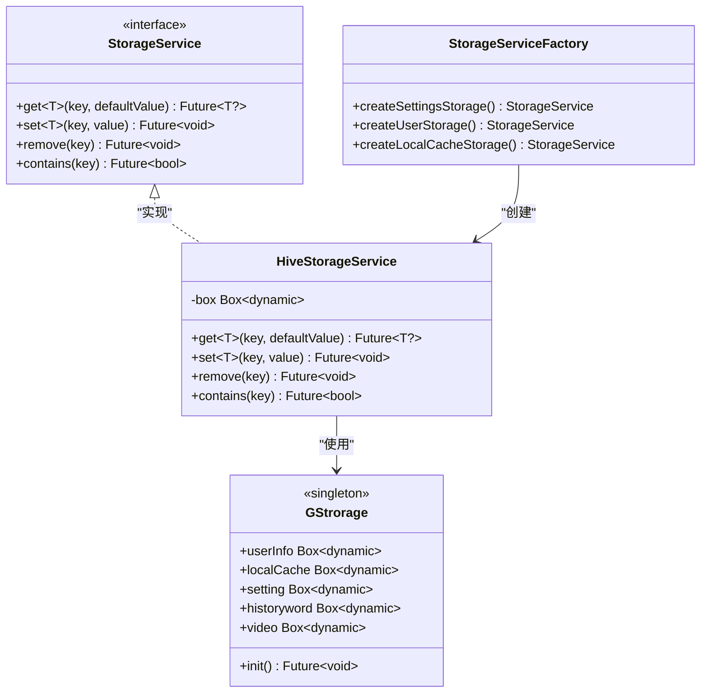
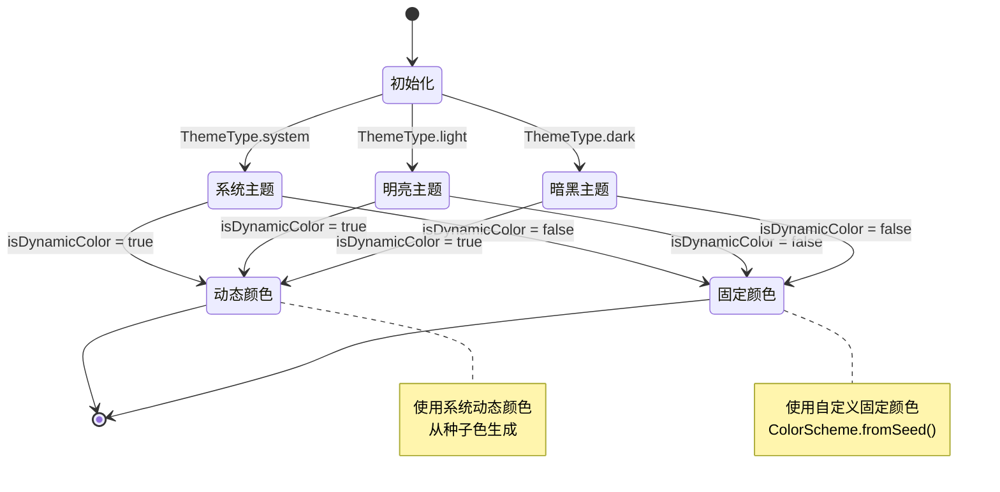
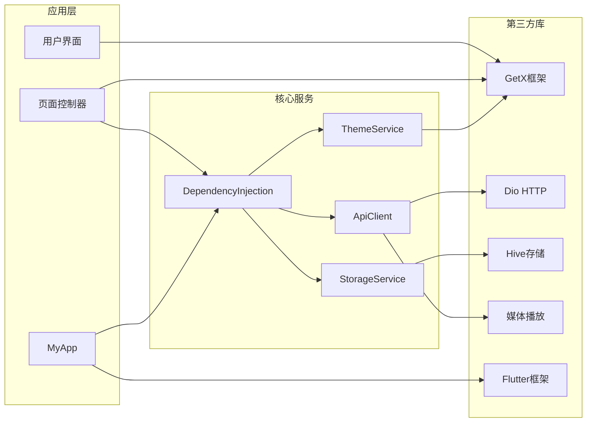

# 架构规范

<cite>
**本文档引用的文件**
- [README.md](file://README.md)
- [pubspec.yaml](file://pubspec.yaml)
- [main.dart](file://lib/main.dart)
- [dependency_injection.dart](file://lib/core/di/dependency_injection.dart)
- [api_client.dart](file://lib/core/network/api_client.dart)
- [storage_service.dart](file://lib/core/storage/storage_service.dart)
- [theme_service.dart](file://lib/core/theme/theme_service.dart)
- [02-state-management.md](file://docs/spec/architecture/02-state-management.md)
- [03-http-layer.md](file://docs/spec/architecture/03-http-layer.md)
- [04-storage.md](file://docs/spec/architecture/04-storage.md)
- [05-navigation.md](file://docs/spec/architecture/05-navigation.md)
</cite>

## 目录
1. [引言](#引言)
2. [项目结构](#项目结构)
3. [核心组件](#核心组件)
4. [架构概览](#架构概览)
5. [详细组件分析](#详细组件分析)
6. [依赖分析](#依赖分析)
7. [性能考虑](#性能考虑)
8. [故障排除指南](#故障排除指南)
9. [结论](#结论)

## 引言

PiliPala 是一个基于 Flutter 开发的 Bilibili 第三方客户端应用。该项目采用了现代化的架构设计，正在从传统的 pages/ 扁平结构迁移到 features/ 三层架构（data/domain/presentation）。项目的核心技术栈包括 GetX 状态管理、Dio HTTP 客户端、Hive 本地存储等。

根据项目 README 的架构迁移状态，目前已有 16 个模块完成了 95% 的迁移工作，包括 home、video、search、user、media、dynamics、rank、login 等核心功能模块。

## 项目结构

项目采用模块化的目录结构，按照功能特性进行组织：

**图表来源**
- [main.dart:33-80](file://lib/main.dart#L33-L80)
- [dependency_injection.dart:41-114](file://lib/core/di/dependency_injection.dart#L41-L114)

**章节来源**
- [README.md:122-142](file://README.md#L122-L142)
- [pubspec.yaml:30-150](file://pubspec.yaml#L30-L150)

## 核心组件

### 依赖注入系统

项目采用 GetX 的依赖注入机制，通过 DependencyInjection 类统一管理所有服务的注册和生命周期：

**图表来源**
- [dependency_injection.dart:41-114](file://lib/core/di/dependency_injection.dart#L41-L114)
- [storage_service.dart:10-65](file://lib/core/storage/storage_service.dart#L10-L65)
- [api_client.dart:11-151](file://lib/core/network/api_client.dart#L11-L151)
- [theme_service.dart:11-57](file://lib/core/theme/theme_service.dart#L11-L57)

### 状态管理系统

项目使用 GetX 作为统一的状态管理框架，实现了响应式状态管理和依赖注入的集成：

**图表来源**
- [main.dart:47-48](file://lib/main.dart#L47-L48)
- [dependency_injection.dart:42-55](file://lib/core/di/dependency_injection.dart#L42-L55)

**章节来源**
- [dependency_injection.dart:1-114](file://lib/core/di/dependency_injection.dart#L1-L114)
- [02-state-management.md:5-82](file://docs/spec/architecture/02-state-management.md#L5-L82)

## 架构概览

项目采用分层架构设计，从底层到上层依次为：基础设施层、核心服务层、特性模块层和表现层。

**图表来源**
- [pubspec.yaml:30-150](file://pubspec.yaml#L30-L150)
- [api_client.dart:63-151](file://lib/core/network/api_client.dart#L63-L151)
- [storage_service.dart:17-65](file://lib/core/storage/storage_service.dart#L17-L65)

## 详细组件分析

### HTTP 层架构

HTTP 层采用单例模式封装 Dio 客户端，提供了统一的请求处理机制：

**图表来源**
- [api_client.dart:11-151](file://lib/core/network/api_client.dart#L11-L151)

### 存储层架构

存储层使用 Hive 作为本地数据持久化方案，通过统一的服务接口管理不同类型的数据：

**图表来源**
- [storage_service.dart:10-65](file://lib/core/storage/storage_service.dart#L10-L65)

### 主题管理系统

主题服务负责管理应用的主题设置，包括主题模式、自定义颜色和动态颜色：

**图表来源**
- [theme_service.dart:11-57](file://lib/core/theme/theme_service.dart#L11-L57)

**章节来源**
- [03-http-layer.md:1-350](file://docs/spec/architecture/03-http-layer.md#L1-L350)
- [04-storage.md:1-283](file://docs/spec/architecture/04-storage.md#L1-L283)
- [05-navigation.md:1-280](file://docs/spec/architecture/05-navigation.md#L1-L280)

## 依赖分析

项目的主要依赖关系如下：

**图表来源**
- [pubspec.yaml:30-150](file://pubspec.yaml#L30-L150)
- [main.dart:1-32](file://lib/main.dart#L1-L32)

**章节来源**
- [pubspec.yaml:1-248](file://pubspec.yaml#L1-L248)

## 性能考虑

### 状态管理优化

- 使用 Get.lazyPut() 实现延迟加载，避免不必要的内存占用
- 合理使用响应式变量，避免过度重建
- 在 onClose() 方法中及时清理资源

### 网络层优化

- 使用连接池和请求复用减少网络开销
- 实现适当的缓存策略
- 合理设置超时时间和重试机制

### 存储层优化

- 使用批量操作减少磁盘 I/O
- 定期压缩和清理存储空间
- 优化数据序列化和反序列化过程

## 故障排除指南

### 常见问题及解决方案

1. **依赖注入问题**
   - 确保所有服务都在 DependencyInjection.init() 中正确注册
   - 检查服务的生命周期和作用域

2. **网络请求失败**
   - 检查 API 端点和参数格式
   - 验证 Cookie 和认证信息
   - 查看网络拦截器的日志

3. **状态不更新**
   - 确保使用响应式变量（.obs）
   - 检查 Obx 组件的使用
   - 验证状态更新的时机

4. **存储访问异常**
   - 确认 Hive Box 已正确初始化
   - 检查适配器注册情况
   - 验证数据类型和默认值

**章节来源**
- [02-state-management.md:280-299](file://docs/spec/architecture/02-state-management.md#L280-L299)
- [03-http-layer.md:291-350](file://docs/spec/architecture/03-http-layer.md#L291-L350)
- [04-storage.md:252-283](file://docs/spec/architecture/04-storage.md#L252-L283)

## 结论

PiliPala 项目展现了现代 Flutter 应用的良好架构实践。通过采用分层架构、依赖注入、响应式状态管理等设计模式，项目实现了良好的可维护性和扩展性。

当前项目已经完成了大部分模块的架构迁移，剩余模块的迁移工作相对简单，主要是清理独立模块和补充缺失的功能。这种渐进式的迁移策略降低了风险，保证了项目的稳定性。

项目的架构规范文档完善，涵盖了状态管理、HTTP 层、存储和导航等核心方面，为开发者提供了清晰的指导原则。建议在后续开发中继续遵循这些规范，保持架构的一致性和代码质量。