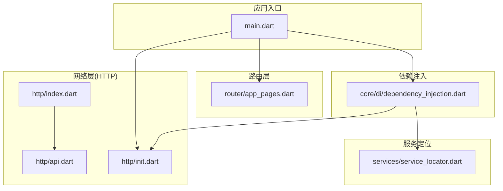
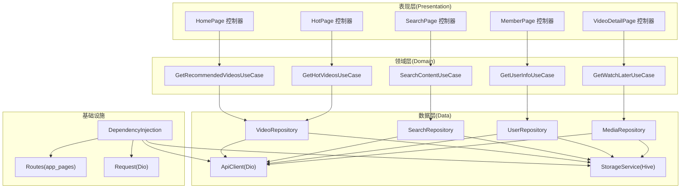
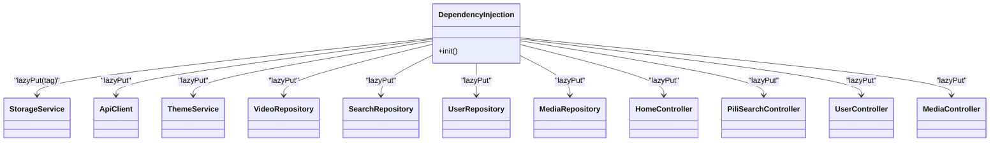
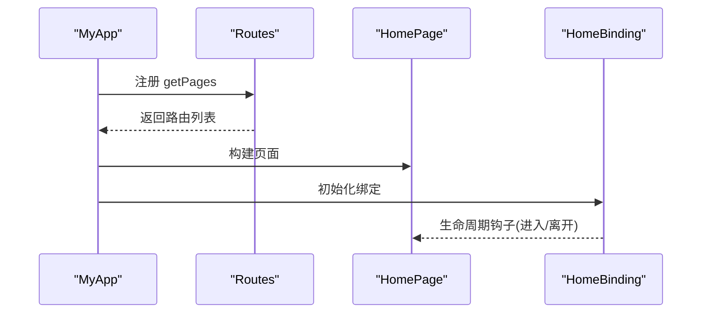
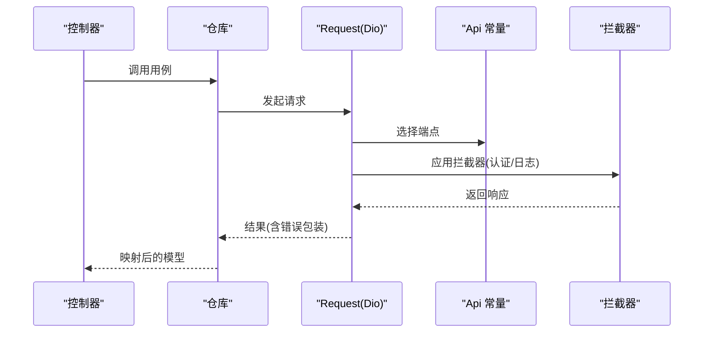
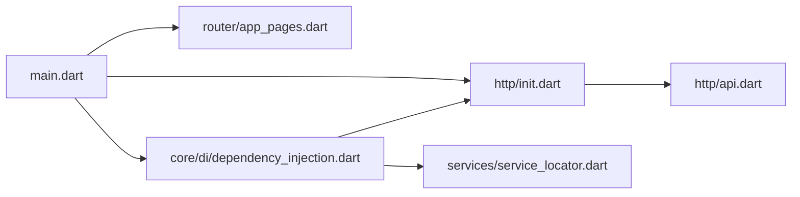

# 架构设计

<cite>
**本文引用的文件**
- [lib/main.dart](file://lib/main.dart)
- [lib/http/index.dart](file://lib/http/index.dart)
- [lib/http/api.dart](file://lib/http/api.dart)
- [lib/http/init.dart](file://lib/http/init.dart)
- [lib/core/di/dependency_injection.dart](file://lib/core/di/dependency_injection.dart)
- [lib/router/app_pages.dart](file://lib/router/app_pages.dart)
- [lib/services/service_locator.dart](file://lib/services/service_locator.dart)
</cite>

## 目录
1. [引言](#引言)
2. [项目结构](#项目结构)
3. [核心组件](#核心组件)
4. [架构总览](#架构总览)
5. [详细组件分析](#详细组件分析)
6. [依赖分析](#依赖分析)
7. [性能考量](#性能考量)
8. [故障排查指南](#故障排查指南)
9. [结论](#结论)
10. [附录](#附录)

## 引言
本架构设计文档面向 PiliPala 项目，系统阐述其整体架构模式与关键设计原则，重点包括：
- MVVM 架构与控制器职责划分
- Repository 模式与数据层抽象
- 依赖注入（GetX）与服务定位
- 三层架构（data/domain/presentation）的实现与迁移策略
- 状态管理（GetX）、路由系统、HTTP 层与存储方案
- 数据流向与组件交互关系
- 技术决策原因、权衡与约束条件
- 开发者扩展与维护指导

## 项目结构
PiliPala 采用按功能域与层次分离的组织方式：
- 应用入口与平台初始化：lib/main.dart
- HTTP 层：lib/http/{api.dart, init.dart, index.dart}
- 依赖注入：lib/core/di/dependency_injection.dart
- 路由系统：lib/router/app_pages.dart
- 服务定位与后台服务：lib/services/service_locator.dart
- 特性模块（features）：按功能域划分，如 home/search/user/media/login 等
- 页面与通用组件：lib/pages 与 lib/common

**图表来源**
- [lib/main.dart:33-80](file://lib/main.dart#L33-L80)
- [lib/router/app_pages.dart:83-246](file://lib/router/app_pages.dart#L83-L246)
- [lib/core/di/dependency_injection.dart:31-88](file://lib/core/di/dependency_injection.dart#L31-L88)
- [lib/http/index.dart:1-3](file://lib/http/index.dart#L1-L3)
- [lib/http/api.dart:1-599](file://lib/http/api.dart#L1-L599)
- [lib/http/init.dart:22-339](file://lib/http/init.dart#L22-L339)
- [lib/services/service_locator.dart:7-11](file://lib/services/service_locator.dart#L7-L11)

**章节来源**
- [lib/main.dart:33-80](file://lib/main.dart#L33-L80)
- [lib/router/app_pages.dart:83-246](file://lib/router/app_pages.dart#L83-L246)
- [lib/core/di/dependency_injection.dart:31-88](file://lib/core/di/dependency_injection.dart#L31-L88)
- [lib/http/index.dart:1-3](file://lib/http/index.dart#L1-L3)
- [lib/http/api.dart:1-599](file://lib/http/api.dart#L1-L599)
- [lib/http/init.dart:22-339](file://lib/http/init.dart#L22-L339)
- [lib/services/service_locator.dart:7-11](file://lib/services/service_locator.dart#L7-L11)

## 核心组件
- 应用入口与平台初始化：负责设备能力检测、主题与文本缩放、系统沉浸式样式、全局缓存初始化、异常捕获与日志记录、依赖注入与路由注册等。
- HTTP 层：统一的 API 常量与请求封装，包含 Cookie 管理、请求头注入、代理配置、错误处理与日志拦截器。
- 依赖注入（GetX）：集中注册与延迟加载各 Feature 的仓储、用例与控制器，降低耦合度。
- 路由系统：基于 GetX 的路由表，支持新旧路由并存与绑定（binding）生命周期。
- 服务定位：后台音频/视频服务的初始化与注入，便于跨页面共享。

**章节来源**
- [lib/main.dart:33-80](file://lib/main.dart#L33-L80)
- [lib/http/init.dart:22-339](file://lib/http/init.dart#L22-L339)
- [lib/core/di/dependency_injection.dart:31-88](file://lib/core/di/dependency_injection.dart#L31-L88)
- [lib/router/app_pages.dart:83-246](file://lib/router/app_pages.dart#L83-L246)
- [lib/services/service_locator.dart:7-11](file://lib/services/service_locator.dart#L7-L11)

## 架构总览
PiliPala 采用 MVVM + Repository + 依赖注入的混合架构：
- 表现层（View/Controller）：由 GetX 控制器承载业务逻辑与状态，页面通过控制器与仓库交互。
- 领域层（Use Cases）：封装业务用例，协调仓库与模型转换。
- 数据层（Repository/Storage/API）：统一数据源抽象，支持本地缓存与远程 API。
- 基础设施：路由、依赖注入、网络、存储、服务定位。

**图表来源**
- [lib/core/di/dependency_injection.dart:31-88](file://lib/core/di/dependency_injection.dart#L31-L88)
- [lib/router/app_pages.dart:83-246](file://lib/router/app_pages.dart#L83-L246)
- [lib/http/init.dart:22-339](file://lib/http/init.dart#L22-L339)

## 详细组件分析

### MVVM 与控制器职责
- 控制器（GetX）承担 View 与 Model 之间的协调，负责：
  - 维护局部状态与 UI 状态
  - 调用用例执行业务流程
  - 订阅仓库变更并更新视图
- 页面作为视图层，专注渲染与用户交互；控制器通过依赖注入获取用例与仓库实例，避免直接依赖具体实现。

**章节来源**
- [lib/core/di/dependency_injection.dart:31-88](file://lib/core/di/dependency_injection.dart#L31-L88)

### Repository 模式与数据抽象
- 仓库负责：
  - 统一数据源访问（远程 API 与本地缓存）
  - 数据转换与模型映射
  - 错误处理与重试策略
- 通过接口或抽象类隔离数据源差异，便于替换与测试。

**章节来源**
- [lib/core/di/dependency_injection.dart:47-77](file://lib/core/di/dependency_injection.dart#L47-L77)

### 依赖注入（GetX）
- 在依赖注入类中集中注册：
  - 存储服务（Settings/User/LocalCache）
  - 网络客户端（ApiClient/Dio）
  - 主题服务（ThemeService）
  - 各 Feature 的仓库、用例与控制器
- 使用 Get.lazyPut 实现延迟加载，提升启动性能与内存效率。

**图表来源**
- [lib/core/di/dependency_injection.dart:31-88](file://lib/core/di/dependency_injection.dart#L31-L88)

**章节来源**
- [lib/core/di/dependency_injection.dart:31-88](file://lib/core/di/dependency_injection.dart#L31-L88)

### 路由系统设计
- 路由表集中定义，支持：
  - 新旧路由并存（features 页面与传统 pages 页面）
  - 自定义 GetPage（过渡动画、全屏对话框、绑定生命周期）
  - 统一注册到 GetMaterialApp 的 getPages
- 页面与绑定（binding）配合，实现进入/退出时的资源管理与状态恢复。

**图表来源**
- [lib/router/app_pages.dart:83-246](file://lib/router/app_pages.dart#L83-L246)

**章节来源**
- [lib/router/app_pages.dart:83-246](file://lib/router/app_pages.dart#L83-L246)

### HTTP 层与数据流
- 请求封装：
  - 统一 Cookie 管理与持久化
  - 注入用户标识与风控头（x-bili-*）
  - 支持系统代理与证书校验回调
  - 错误统一转换为 JSON 响应，便于前端处理
- API 常量集中管理，便于维护与替换。

**图表来源**
- [lib/http/init.dart:22-339](file://lib/http/init.dart#L22-L339)
- [lib/http/api.dart:1-599](file://lib/http/api.dart#L1-L599)

**章节来源**
- [lib/http/init.dart:22-339](file://lib/http/init.dart#L22-L339)
- [lib/http/api.dart:1-599](file://lib/http/api.dart#L1-L599)

### 存储方案与缓存策略
- 本地存储采用 Hive，通过 StorageService 抽象不同 Box（设置、用户、本地缓存）。
- 依赖注入中按标签注册不同存储实例，便于按需获取。
- HTTP 层结合 CookieJar 与持久化 Cookie，保障登录态与风控参数。

**章节来源**
- [lib/core/di/dependency_injection.dart:34-39](file://lib/core/di/dependency_injection.dart#L34-L39)
- [lib/http/init.dart:36-78](file://lib/http/init.dart#L36-L78)

### 状态管理（GetX）
- GetX 提供轻量级状态管理与依赖注入，适合移动端快速迭代场景。
- 控制器持有状态与方法，页面通过 GetX 绑定自动重建。
- 与路由、服务定位协同，形成清晰的控制流。

**章节来源**
- [lib/main.dart:236-286](file://lib/main.dart#L236-L286)

### 服务定位与后台服务
- 通过服务定位器初始化音频/视频后台服务处理器，便于全局共享与跨页面调用。
- 与依赖注入配合，确保服务生命周期可控。

**章节来源**
- [lib/services/service_locator.dart:7-11](file://lib/services/service_locator.dart#L7-L11)

## 依赖分析
- 入口依赖：main.dart 依赖路由、依赖注入、HTTP 初始化、服务定位与全局缓存。
- 路由依赖：routes 依赖各 feature 页面与 pages 页面，以及绑定。
- 依赖注入：集中注册仓储、用例、控制器、网络与存储，降低模块间耦合。
- HTTP 依赖：Request 依赖拦截器、Cookie 管理与 API 常量。

**图表来源**
- [lib/main.dart:33-80](file://lib/main.dart#L33-L80)
- [lib/router/app_pages.dart:83-246](file://lib/router/app_pages.dart#L83-L246)
- [lib/core/di/dependency_injection.dart:31-88](file://lib/core/di/dependency_injection.dart#L31-L88)
- [lib/http/init.dart:22-339](file://lib/http/init.dart#L22-L339)
- [lib/http/api.dart:1-599](file://lib/http/api.dart#L1-L599)
- [lib/services/service_locator.dart:7-11](file://lib/services/service_locator.dart#L7-L11)

**章节来源**
- [lib/main.dart:33-80](file://lib/main.dart#L33-L80)
- [lib/router/app_pages.dart:83-246](file://lib/router/app_pages.dart#L83-L246)
- [lib/core/di/dependency_injection.dart:31-88](file://lib/core/di/dependency_injection.dart#L31-L88)
- [lib/http/init.dart:22-339](file://lib/http/init.dart#L22-L339)
- [lib/http/api.dart:1-599](file://lib/http/api.dart#L1-L599)
- [lib/services/service_locator.dart:7-11](file://lib/services/service_locator.dart#L7-L11)

## 性能考量
- 启动阶段：
  - 设备方向限制、媒体库初始化、日志清理与全局缓存初始化，减少运行期抖动。
- 网络层：
  - 统一超时配置、错误包装、日志拦截器与后台转换器，提升稳定性与可观测性。
- 依赖注入：
  - lazyPut 延迟实例化，按需加载，降低冷启动成本。
- UI 与主题：
  - 文本缩放、动态配色与边缘到边缘样式，兼顾可用性与性能。

**章节来源**
- [lib/main.dart:33-80](file://lib/main.dart#L33-L80)
- [lib/http/init.dart:154-213](file://lib/http/init.dart#L154-L213)
- [lib/core/di/dependency_injection.dart:31-88](file://lib/core/di/dependency_injection.dart#L31-L88)

## 故障排查指南
- 异常捕获与日志：
  - 使用 Catcher2 在发布环境输出到文件或控制台，便于定位问题。
- 网络错误：
  - Request 对 DioException 进行统一包装，返回包含错误消息的响应，便于前端展示。
- Cookie 与登录态：
  - setCookie 与 CookieJar 持久化，确保登录态与风控参数有效。
- 代理与证书：
  - 支持系统代理配置与证书回调，解决特定网络环境问题。

**章节来源**
- [lib/main.dart:51-61](file://lib/main.dart#L51-L61)
- [lib/http/init.dart:238-248](file://lib/http/init.dart#L238-L248)
- [lib/http/init.dart:36-78](file://lib/http/init.dart#L36-L78)
- [lib/http/init.dart:186-200](file://lib/http/init.dart#L186-L200)

## 结论
PiliPala 通过 MVVM + Repository + 依赖注入的组合，实现了清晰的分层与低耦合；GetX 在状态管理与依赖注入上的简洁性，适配移动端快速迭代需求。HTTP 层与存储层的抽象保证了可维护性与可替换性。建议在后续演进中持续完善用例边界、增强单元测试覆盖率，并逐步引入更细粒度的错误恢复与重试策略。

## 附录
- 三层架构迁移策略建议：
  - 从 pages 与 controllers 迁移至 features/{module}/presentation
  - 为每个模块新增 domain/use_cases 与 data/repository
  - 通过依赖注入逐步替换硬编码实例化
- 扩展指导：
  - 新增功能时，先定义用例与仓库接口，再实现具体实现
  - 严格区分请求参数、业务参数与响应模型，避免混用
  - 使用路由绑定管理页面生命周期，确保资源释放