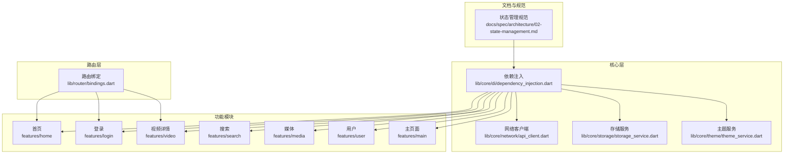
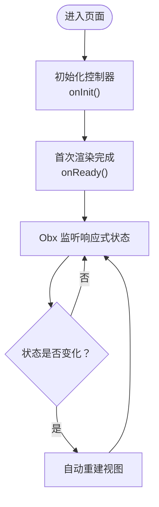
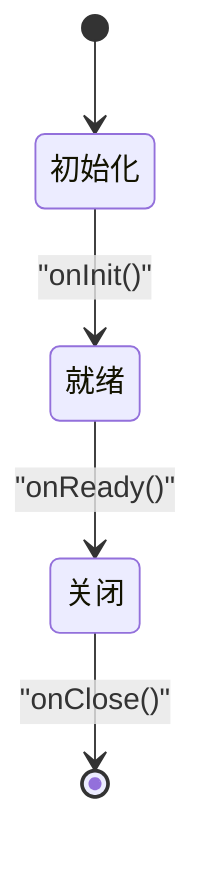
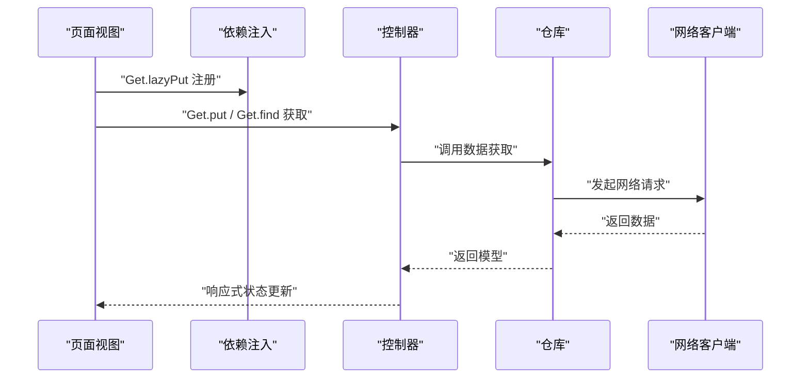
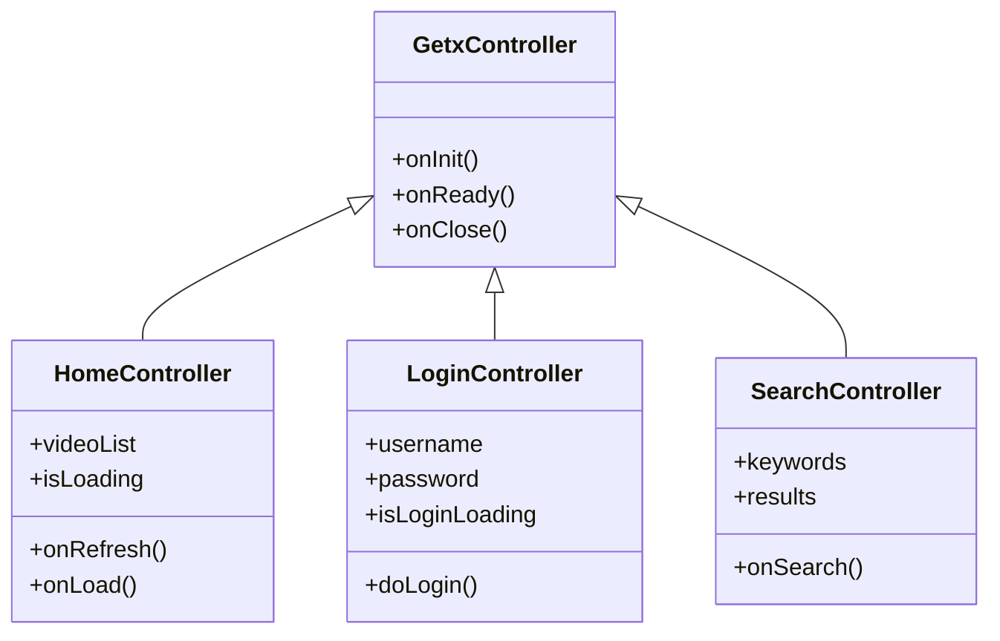
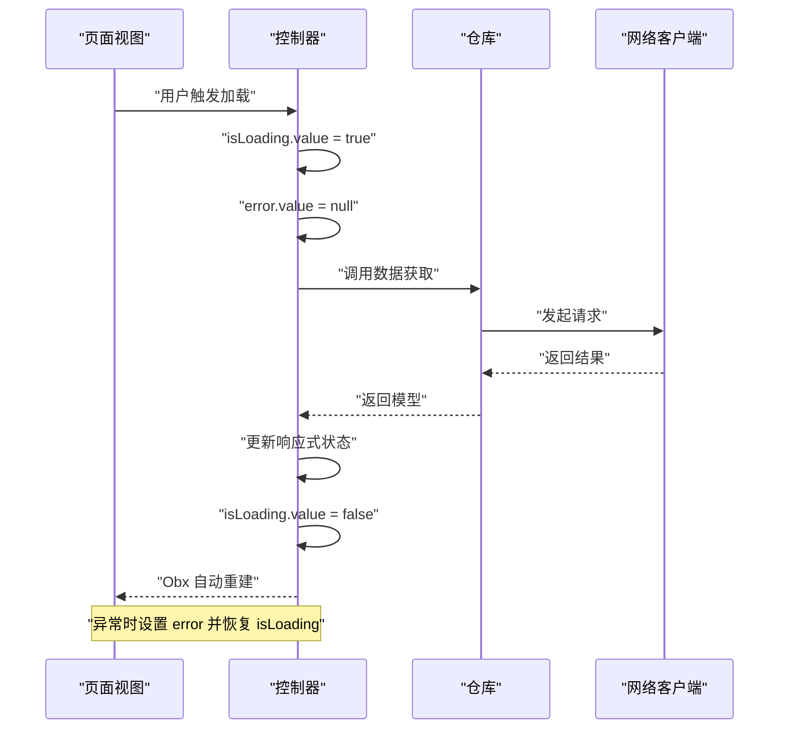
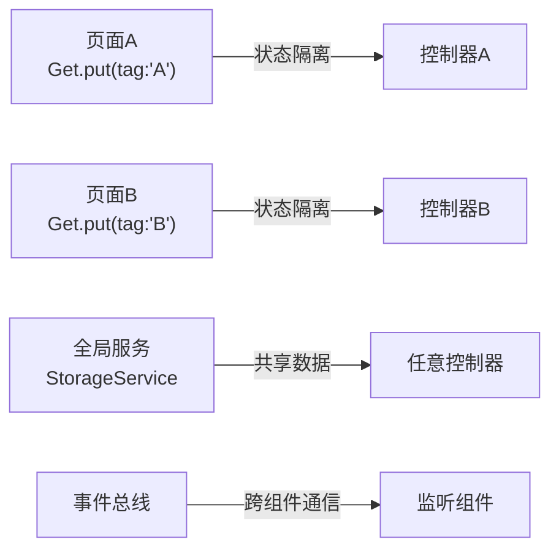

# 状态管理

<cite>
**本文引用的文件**
- [状态管理规范](file://docs/spec/architecture/02-state-management.md)
- [依赖注入](file://lib/core/di/dependency_injection.dart)
- [路由绑定](file://lib/router/bindings.dart)
- [首页控制器](file://lib/features/home/presentation/home_controller.dart)
- [登录控制器](file://lib/features/login/presentation/login_controller.dart)
- [搜索控制器](file://lib/features/search/presentation/search_controller.dart)
- [视频详情控制器](file://lib/features/video/presentation/video_detail_controller.dart)
- [媒体控制器](file://lib/features/media/presentation/media_controller.dart)
- [用户控制器](file://lib/features/user/presentation/user_controller.dart)
- [主页面控制器](file://lib/features/main/presentation/main_controller.dart)
- [首页页面](file://lib/features/home/presentation/home_page.dart)
- [登录页面](file://lib/features/login/presentation/login_page.dart)
- [搜索页面](file://lib/features/search/presentation/search_page.dart)
- [视频详情页面](file://lib/features/video/presentation/video_detail_page.dart)
- [媒体页面](file://lib/features/media/presentation/media_page.dart)
- [用户页面](file://lib/features/user/presentation/member_page.dart)
- [主页面](file://lib/features/main/presentation/main_page.dart)
- [网络客户端](file://lib/core/network/api_client.dart)
- [存储服务](file://lib/core/storage/storage_service.dart)
- [主题服务](file://lib/core/theme/theme_service.dart)
- [首页仓库](file://lib/features/home/data/video_repository.dart)
- [登录仓库](file://lib/features/login/data/login_repository.dart)
- [搜索仓库](file://lib/features/search/data/search_repository.dart)
- [媒体仓库](file://lib/features/media/data/media_repository.dart)
- [视频详情仓库](file://lib/features/video/data/video_detail_repository.dart)
- [用户仓库](file://lib/features/user/data/user_repository.dart)
- [首页推荐用例](file://lib/features/home/domain/video_use_cases.dart)
- [登录用例](file://lib/features/login/domain/login_use_cases.dart)
- [搜索用例](file://lib/features/search/domain/search_use_cases.dart)
- [媒体用例](file://lib/features/media/domain/media_use_cases.dart)
- [视频详情用例](file://lib/features/video/domain/video_detail_use_cases.dart)
- [用户用例](file://lib/features/user/domain/user_use_cases.dart)
</cite>

## 目录
1. [简介](#简介)
2. [项目结构](#项目结构)
3. [核心组件](#核心组件)
4. [架构概览](#架构概览)
5. [详细组件分析](#详细组件分析)
6. [依赖关系分析](#依赖关系分析)
7. [性能考虑](#性能考虑)
8. [故障排除指南](#故障排除指南)
9. [结论](#结论)

## 简介
本文件为 PiliPala 项目的状态管理文档，基于 GetX 框架构建。项目采用 MVVM 架构，其中 ViewModel 由 GetX 的 Controller 实现，通过响应式状态驱动视图更新。本文档深入解释 Obx、Bindings、Controller 的设计模式，详述响应式状态管理机制、控制器生命周期、依赖注入实现，并提供最佳实践指导。

## 项目结构
项目遵循功能模块化的目录组织，状态管理相关的核心文件分布如下：
- 文档规范：docs/spec/architecture/02-state-management.md
- 依赖注入：lib/core/di/dependency_injection.dart
- 路由绑定：lib/router/bindings.dart
- 控制器：lib/features/*/presentation/*_controller.dart
- 页面：lib/features/*/presentation/*_page.dart
- 仓库与用例：lib/features/*/data/*_repository.dart 和 lib/features/*/domain/*_use_cases.dart
- 核心服务：lib/core/network/api_client.dart、lib/core/storage/storage_service.dart、lib/core/theme/theme_service.dart

图表来源
- [状态管理规范:1-299](file://docs/spec/architecture/02-state-management.md#L1-L299)
- [依赖注入:31-58](file://lib/core/di/dependency_injection.dart#L31-L58)
- [路由绑定:22-57](file://lib/router/bindings.dart#L22-L57)

章节来源
- [状态管理规范:1-299](file://docs/spec/architecture/02-state-management.md#L1-L299)
- [依赖注入:31-58](file://lib/core/di/dependency_injection.dart#L31-L58)
- [路由绑定:22-57](file://lib/router/bindings.dart#L22-L57)

## 核心组件
本节概述状态管理的关键组件及其职责。

- 响应式状态
  - 使用 .obs 将普通变量转换为响应式变量，支持基本类型、集合、对象等。
  - Obx 用于包裹需要自动更新的 Widget，实现按需重建。
  - 状态更新方式包括 .value 赋值、集合的 add/remove、refresh 强制重建、update 手动触发。

- Controller 生命周期
  - onInit：初始化逻辑，加载数据、设置监听器。
  - onReady：首次渲染完成后执行。
  - onClose：清理资源，如取消订阅、关闭流、释放控制器。

- 依赖注入
  - Get.put：立即创建并注册。
  - Get.lazyPut：首次使用时创建，延迟初始化。
  - Get.create：每次获取创建新实例。
  - Tag 隔离：使用 tag 区分相同类型的不同实例。

- 路由状态管理
  - 路由传参：通过 Get.toNamed 传递参数，使用 Get.parameters 获取。
  - 参数类型转换：对数值、可选参数进行解析。

- 全局状态
  - 全局数据缓存：使用 GlobalDataCache 管理全局状态。
  - 事件总线：使用 EventBus 进行跨组件通信。

章节来源
- [状态管理规范:9-299](file://docs/spec/architecture/02-state-management.md#L9-L299)

## 架构概览
下图展示了基于 GetX 的 MVVM 架构在项目中的落地：

```mermaid
graph TB
subgraph "视图层(View)"
V_HOME["首页页面<br/>features/home/presentation/home_page.dart"]
V_LOGIN["登录页面<br/>features/login/presentation/login_page.dart"]
V_SEARCH["搜索页面<br/>features/search/presentation/search_page.dart"]
V_VIDEO["视频详情页面<br/>features/video/presentation/video_detail_page.dart"]
V_MEDIA["媒体页面<br/>features/media/presentation/media_page.dart"]
V_USER["用户页面<br/>features/user/presentation/member_page.dart"]
V_MAIN["主页面<br/>features/main/presentation/main_page.dart"]
end
subgraph "ViewModel(Controller)"
C_HOME["首页控制器<br/>features/home/presentation/home_controller.dart"]
C_LOGIN["登录控制器<br/>features/login/presentation/login_controller.dart"]
C_SEARCH["搜索控制器<br/>features/search/presentation/search_controller.dart"]
C_VIDEO["视频详情控制器<br/>features/video/presentation/video_detail_controller.dart"]
C_MEDIA["媒体控制器<br/>features/media/presentation/media_controller.dart"]
C_USER["用户控制器<br/>features/user/presentation/user_controller.dart"]
C_MAIN["主页面控制器<br/>features/main/presentation/main_controller.dart"]
end
subgraph "领域层(Domain)"
U_HOME["首页用例集<br/>features/home/domain/video_use_cases.dart"]
U_LOGIN["登录用例集<br/>features/login/domain/login_use_cases.dart"]
U_SEARCH["搜索用例集<br/>features/search/domain/search_use_cases.dart"]
U_VIDEO["视频详情用例集<br/>features/video/domain/video_detail_use_cases.dart"]
U_MEDIA["媒体用例集<br/>features/media/domain/media_use_cases.dart"]
U_USER["用户用例集<br/>features/user/domain/user_use_cases.dart"]
end
subgraph "数据层(Data)"
R_HOME["首页仓库<br/>features/home/data/video_repository.dart"]
R_LOGIN["登录仓库<br/>features/login/data/login_repository.dart"]
R_SEARCH["搜索仓库<br/>features/search/data/search_repository.dart"]
R_VIDEO["视频详情仓库<br/>features/video/data/video_detail_repository.dart"]
R_MEDIA["媒体仓库<br/>features/media/data/media_repository.dart"]
R_USER["用户仓库<br/>features/user/data/user_repository.dart"]
end
subgraph "基础设施层(Core)"
S_API["网络客户端<br/>core/network/api_client.dart"]
S_STORE["存储服务<br/>core/storage/storage_service.dart"]
S_THEME["主题服务<br/>core/theme/theme_service.dart"]
end
V_HOME --> C_HOME
V_LOGIN --> C_LOGIN
V_SEARCH --> C_SEARCH
V_VIDEO --> C_VIDEO
V_MEDIA --> C_MEDIA
V_USER --> C_USER
V_MAIN --> C_MAIN
C_HOME --> U_HOME
C_LOGIN --> U_LOGIN
C_SEARCH --> U_SEARCH
C_VIDEO --> U_VIDEO
C_MEDIA --> U_MEDIA
C_USER --> U_USER
C_MAIN --> U_HOME
U_HOME --> R_HOME
U_LOGIN --> R_LOGIN
U_SEARCH --> R_SEARCH
U_VIDEO --> R_VIDEO
U_MEDIA --> R_MEDIA
U_USER --> R_USER
R_HOME --> S_API
R_LOGIN --> S_API
R_SEARCH --> S_API
R_VIDEO --> S_API
R_MEDIA --> S_API
R_USER --> S_API
R_HOME --> S_STORE
R_LOGIN --> S_STORE
R_SEARCH --> S_STORE
R_VIDEO --> S_STORE
R_MEDIA --> S_STORE
R_USER --> S_STORE
C_HOME --> S_THEME
C_LOGIN --> S_THEME
C_SEARCH --> S_THEME
C_VIDEO --> S_THEME
C_MEDIA --> S_THEME
C_USER --> S_THEME
C_MAIN --> S_THEME
```

图表来源
- [首页页面](file://lib/features/home/presentation/home_page.dart)
- [登录页面](file://lib/features/login/presentation/login_page.dart)
- [搜索页面](file://lib/features/search/presentation/search_page.dart)
- [视频详情页面](file://lib/features/video/presentation/video_detail_page.dart)
- [媒体页面](file://lib/features/media/presentation/media_page.dart)
- [用户页面](file://lib/features/user/presentation/member_page.dart)
- [主页面](file://lib/features/main/presentation/main_page.dart)
- [首页控制器](file://lib/features/home/presentation/home_controller.dart)
- [登录控制器](file://lib/features/login/presentation/login_controller.dart)
- [搜索控制器](file://lib/features/search/presentation/search_controller.dart)
- [视频详情控制器](file://lib/features/video/presentation/video_detail_controller.dart)
- [媒体控制器](file://lib/features/media/presentation/media_controller.dart)
- [用户控制器](file://lib/features/user/presentation/user_controller.dart)
- [主页面控制器](file://lib/features/main/presentation/main_controller.dart)
- [首页推荐用例](file://lib/features/home/domain/video_use_cases.dart)
- [登录用例](file://lib/features/login/domain/login_use_cases.dart)
- [搜索用例](file://lib/features/search/domain/search_use_cases.dart)
- [媒体用例](file://lib/features/media/domain/media_use_cases.dart)
- [视频详情用例](file://lib/features/video/domain/video_detail_use_cases.dart)
- [用户用例](file://lib/features/user/domain/user_use_cases.dart)
- [首页仓库](file://lib/features/home/data/video_repository.dart)
- [登录仓库](file://lib/features/login/data/login_repository.dart)
- [搜索仓库](file://lib/features/search/data/search_repository.dart)
- [媒体仓库](file://lib/features/media/data/media_repository.dart)
- [视频详情仓库](file://lib/features/video/data/video_detail_repository.dart)
- [用户仓库](file://lib/features/user/data/user_repository.dart)
- [网络客户端](file://lib/core/network/api_client.dart)
- [存储服务](file://lib/core/storage/storage_service.dart)
- [主题服务](file://lib/core/theme/theme_service.dart)

## 详细组件分析

### 响应式状态与 Obx 使用
- Obx 包裹需要自动更新的 Widget，当响应式变量变化时自动重建。
- 状态更新方式：
  - 单值更新：使用 .value 赋值。
  - 集合操作：使用 add/remove 等方法。
  - 强制重建：调用 refresh。
  - 手动触发：update。

图表来源
- [状态管理规范:24-47](file://docs/spec/architecture/02-state-management.md#L24-L47)

章节来源
- [状态管理规范:9-47](file://docs/spec/architecture/02-state-management.md#L9-L47)

### Controller 设计模式与生命周期
- 命名规范：页面 Controller 使用 {Feature}Controller 命名。
- 职责边界：管理页面状态、处理用户交互、调用 HTTP 层获取数据、数据转换和格式化；不直接操作 UI、不包含布局逻辑、不包含过多业务逻辑。
- 生命周期：
  - onInit：初始化逻辑，加载数据、设置监听器。
  - onReady：首次渲染完成后执行。
  - onClose：清理资源，如取消订阅、关闭流、释放控制器。

图表来源
- [状态管理规范:60-82](file://docs/spec/architecture/02-state-management.md#L60-L82)

章节来源
- [状态管理规范:58-82](file://docs/spec/architecture/02-state-management.md#L58-L82)

### 依赖注入与 Bindings
- 注册方式：
  - Get.put：立即创建并注册。
  - Get.lazyPut：首次使用时创建。
  - Get.create：每次获取创建新实例。
- 注入位置：Controller 应在 View 的 build 方法或 initState 中注入。
- Tag 隔离：当多个页面使用相同类型的 Controller 时，使用 tag 区分。

图表来源
- [依赖注入:31-58](file://lib/core/di/dependency_injection.dart#L31-L58)
- [路由绑定:22-57](file://lib/router/bindings.dart#L22-L57)

章节来源
- [状态管理规范:144-182](file://docs/spec/architecture/02-state-management.md#L144-L182)
- [依赖注入:31-58](file://lib/core/di/dependency_injection.dart#L31-L58)
- [路由绑定:22-57](file://lib/router/bindings.dart#L22-L57)

### MVVM 中 ViewModel 的职责与实现
- ViewModel（Controller）职责：
  - 管理页面状态（加载中、错误、空数据、有数据）。
  - 处理用户交互（点击、下拉刷新、上拉加载）。
  - 调用仓库获取数据。
  - 数据转换和格式化。
- 实现方式：
  - 使用 GetxController 继承，定义响应式状态变量。
  - 在 onInit/onReady 中执行数据加载。
  - 在交互事件中调用数据获取方法并更新状态。

图表来源
- [首页控制器](file://lib/features/home/presentation/home_controller.dart)
- [登录控制器](file://lib/features/login/presentation/login_controller.dart)
- [搜索控制器](file://lib/features/search/presentation/search_controller.dart)

章节来源
- [状态管理规范:84-94](file://docs/spec/architecture/02-state-management.md#L84-L94)
- [首页控制器](file://lib/features/home/presentation/home_controller.dart)
- [登录控制器](file://lib/features/login/presentation/login_controller.dart)
- [搜索控制器](file://lib/features/search/presentation/search_controller.dart)

### 状态订阅与更新机制
- 状态订阅：Obx 监听响应式变量，当变量变化时自动重建。
- 状态更新：通过 .value、集合操作、refresh、update 等方式进行更新。
- 错误处理：在加载数据时设置 isLoading、清空 error、捕获异常并设置错误信息、finally 中恢复 isLoading。

图表来源
- [状态管理规范:243-259](file://docs/spec/architecture/02-state-management.md#L243-L259)

章节来源
- [状态管理规范:243-259](file://docs/spec/architecture/02-state-management.md#L243-L259)

### 状态隔离与跨组件状态共享
- 状态隔离：使用 tag 区分相同类型的不同实例，避免冲突。
- 跨组件状态共享：通过全局服务（如 StorageService、ThemeService）或事件总线进行共享。

图表来源
- [状态管理规范:172-182](file://docs/spec/architecture/02-state-management.md#L172-L182)
- [状态管理规范:221-233](file://docs/spec/architecture/02-state-management.md#L221-L233)

章节来源
- [状态管理规范:172-182](file://docs/spec/architecture/02-state-management.md#L172-L182)
- [状态管理规范:221-233](file://docs/spec/architecture/02-state-management.md#L221-L233)

### 性能优化与内存管理
- 性能优化：
  - 使用 Get.lazyPut 延迟初始化，减少启动时开销。
  - 合理使用 refresh，避免不必要的重建。
  - 对列表状态使用 hasMore 控制加载更多。
- 内存管理：
  - 在 onClose 中释放 ScrollController、StreamSubscription 等资源。
  - 取消未完成的 HTTP 请求。
  - 移除事件监听器。

章节来源
- [状态管理规范:280-298](file://docs/spec/architecture/02-state-management.md#L280-L298)

## 依赖关系分析
下图展示了依赖注入与各模块之间的关系：

```mermaid
graph TB
DI["依赖注入<br/>core/di/dependency_injection.dart"] --> HOME["首页模块<br/>features/home"]
DI --> LOGIN["登录模块<br/>features/login"]
DI --> SEARCH["搜索模块<br/>features/search"]
DI --> VIDEO["视频详情模块<br/>features/video"]
DI --> MEDIA["媒体模块<br/>features/media"]
DI --> USER["用户模块<br/>features/user"]
DI --> MAIN["主页面模块<br/>features/main"]
DI --> API["网络客户端<br/>core/network/api_client.dart"]
DI --> STORE["存储服务<br/>core/storage/storage_service.dart"]
DI --> THEME["主题服务<br/>core/theme/theme_service.dart"]
HOME --> H_CTRL["首页控制器<br/>features/home/presentation/home_controller.dart"]
LOGIN --> L_CTRL["登录控制器<br/>features/login/presentation/login_controller.dart"]
SEARCH --> S_CTRL["搜索控制器<br/>features/search/presentation/search_controller.dart"]
VIDEO --> V_CTRL["视频详情控制器<br/>features/video/presentation/video_detail_controller.dart"]
MEDIA --> M_CTRL["媒体控制器<br/>features/media/presentation/media_controller.dart"]
USER --> U_CTRL["用户控制器<br/>features/user/presentation/user_controller.dart"]
MAIN --> MA_CTRL["主页面控制器<br/>features/main/presentation/main_controller.dart"]
```

图表来源
- [依赖注入:31-58](file://lib/core/di/dependency_injection.dart#L31-L58)
- [首页控制器](file://lib/features/home/presentation/home_controller.dart)
- [登录控制器](file://lib/features/login/presentation/login_controller.dart)
- [搜索控制器](file://lib/features/search/presentation/search_controller.dart)
- [视频详情控制器](file://lib/features/video/presentation/video_detail_controller.dart)
- [媒体控制器](file://lib/features/media/presentation/media_controller.dart)
- [用户控制器](file://lib/features/user/presentation/user_controller.dart)
- [主页面控制器](file://lib/features/main/presentation/main_controller.dart)

章节来源
- [依赖注入:31-58](file://lib/core/di/dependency_injection.dart#L31-L58)

## 性能考虑
- 延迟初始化：使用 Get.lazyPut 减少应用启动时的初始化成本。
- 精准重建：仅在 Obx 包裹的区域进行响应式重建，避免整页重建。
- 列表优化：使用 hasMore 控制加载更多，避免无意义的数据请求。
- 资源释放：在 onClose 中及时释放资源，防止内存泄漏。

## 故障排除指南
- Obx 不更新：
  - 确保变量是 .obs 类型。
  - 确保在 Obx 的 builder 中使用了响应式变量。
  - 如果修改 List/Map 内部元素，需要调用 .refresh。
- Controller 重复创建：
  - 使用 Get.put 时确保只调用一次。
  - 考虑使用 Get.lazyPut 或 Bindings。
  - 使用 tag 区分不同实例。
- 内存泄漏：
  - 在 onClose 中释放 ScrollController、StreamSubscription 等。
  - 取消未完成的 HTTP 请求。
  - 移除事件监听器。

章节来源
- [状态管理规范:280-298](file://docs/spec/architecture/02-state-management.md#L280-L298)

## 结论
PiliPala 项目通过 GetX 实现了清晰的 MVVM 状态管理，结合 Bindings 和依赖注入，实现了模块化、可维护的状态管理方案。通过响应式状态与 Obx 的配合，实现了高效的 UI 更新；通过严格的生命周期管理和资源释放，保证了应用的稳定性与性能。建议在实际开发中遵循本文档的最佳实践，确保状态管理的一致性与可扩展性。