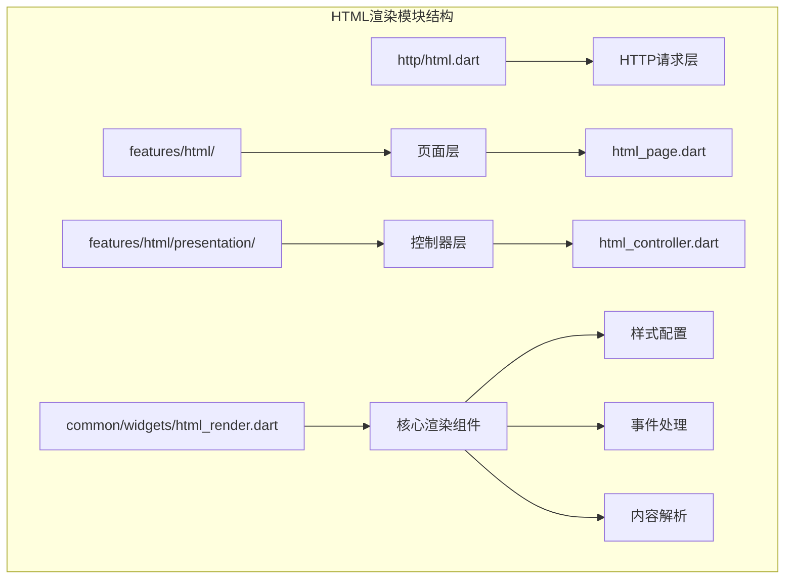
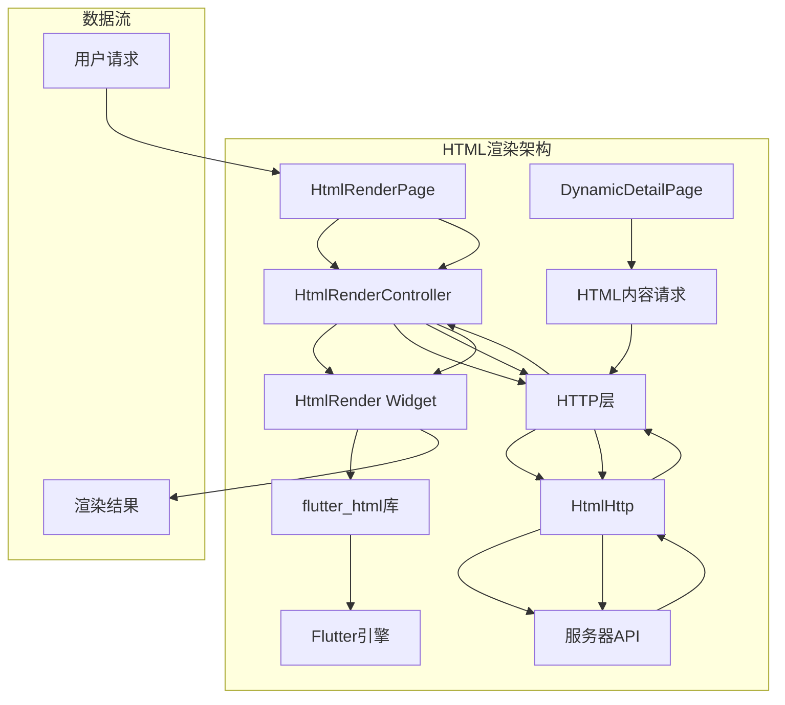
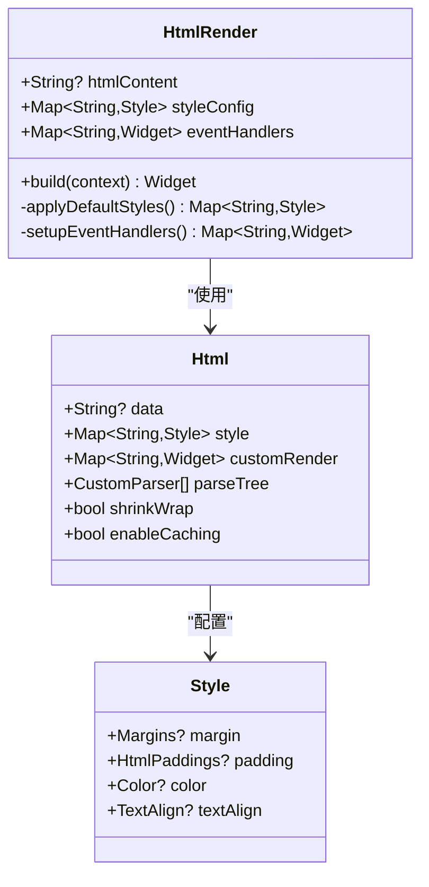
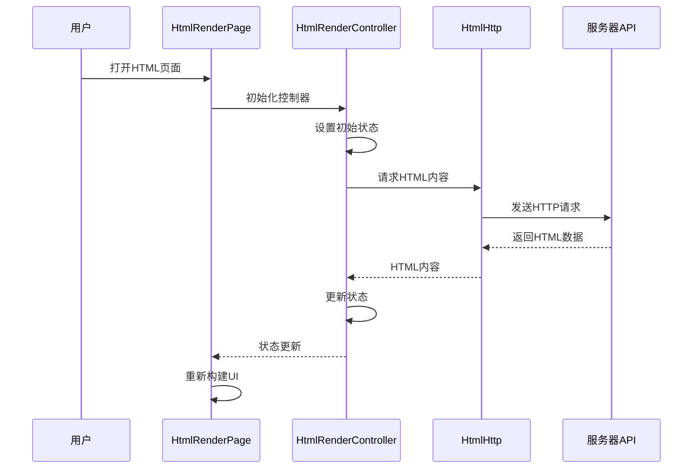
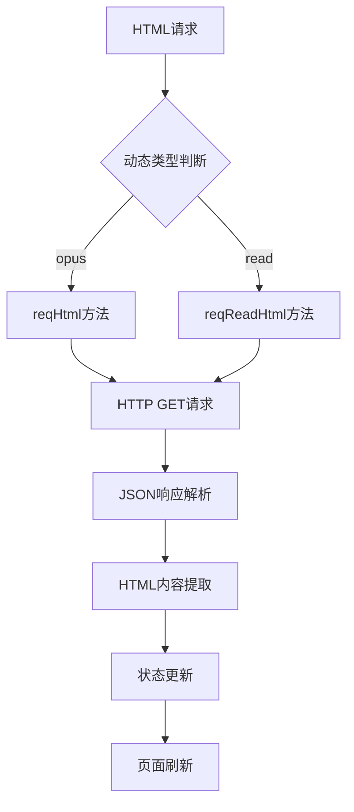
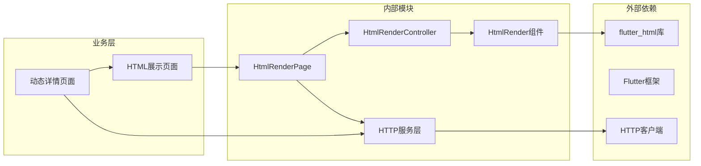
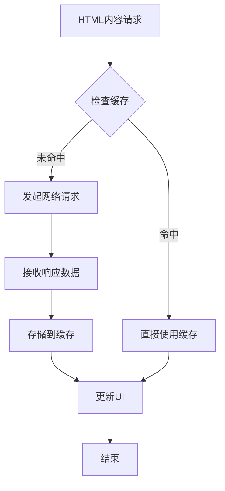

# HTML渲染模块

<cite>
**本文档引用的文件**
- [lib/common/widgets/html_render.dart](file://lib/common/widgets/html_render.dart)
- [lib/features/html/presentation/html_controller.dart](file://lib/features/html/presentation/html_controller.dart)
- [lib/features/html/presentation/html_page.dart](file://lib/features/html/presentation/html_page.dart)
- [lib/http/html.dart](file://lib/http/html.dart)
- [lib/features/dynamics/presentation/dynamic_detail_page.dart](file://lib/features/dynamics/presentation/dynamic_detail_page.dart)
</cite>

## 目录
1. [简介](#简介)
2. [项目结构](#项目结构)
3. [核心组件](#核心组件)
4. [架构概览](#架构概览)
5. [详细组件分析](#详细组件分析)
6. [依赖关系分析](#依赖关系分析)
7. [性能考虑](#性能考虑)
8. [故障排除指南](#故障排除指南)
9. [结论](#结论)

## 简介

HTML渲染模块是Pilipala应用中的一个关键功能组件，负责将从服务器获取的HTML内容在Flutter应用中进行渲染显示。该模块基于flutter_html库构建，提供了完整的HTML内容展示解决方案，支持动态内容、富文本格式和交互式元素。

该模块主要服务于动态内容展示场景，允许用户浏览社区动态、文章内容等富文本信息。通过统一的渲染接口，开发者可以轻松地在应用中集成各种HTML内容展示功能。

## 项目结构

HTML渲染模块采用分层架构设计，包含以下主要目录和文件：

**图表来源**
- [lib/common/widgets/html_render.dart:1-150](file://lib/common/widgets/html_render.dart#L1-L150)
- [lib/features/html/presentation/html_page.dart:1-80](file://lib/features/html/presentation/html_page.dart#L1-L80)
- [lib/features/html/presentation/html_controller.dart:1-80](file://lib/features/html/presentation/html_controller.dart#L1-L80)

**章节来源**
- [lib/common/widgets/html_render.dart:1-150](file://lib/common/widgets/html_render.dart#L1-L150)
- [lib/features/html/presentation/html_page.dart:1-80](file://lib/features/html/presentation/html_page.dart#L1-L80)
- [lib/features/html/presentation/html_controller.dart:1-80](file://lib/features/html/presentation/html_controller.dart#L1-L80)

## 核心组件

### HtmlRender 渲染组件

HtmlRender是整个HTML渲染模块的核心组件，继承自StatelessWidget，专门用于渲染HTML内容。

**主要特性：**
- 基于flutter_html库实现
- 支持多种HTML标签和CSS样式
- 提供自定义样式配置
- 内置错误处理机制

**关键属性：**
- `htmlContent`: 要渲染的HTML字符串内容
- `styleConfig`: 自定义样式配置对象
- `eventHandlers`: 事件处理器集合

**章节来源**
- [lib/common/widgets/html_render.dart:8-30](file://lib/common/widgets/html_render.dart#L8-L30)

### HtmlRenderController 控制器

HtmlRenderController继承自GetxController，负责管理HTML内容的获取和状态管理。

**核心功能：**
- HTML内容请求管理
- 动态类型处理（opus、read等）
- 错误状态管理
- 数据缓存策略

**主要方法：**
- `reqHtml(id)`: 获取HTML内容
- `reqReadHtml(id)`: 获取阅读模式HTML
- `updateLoadingStatus()`: 更新加载状态

**章节来源**
- [lib/features/html/presentation/html_controller.dart:10-50](file://lib/features/html/presentation/html_controller.dart#L10-L50)

### HtmlRenderPage 页面组件

HtmlRenderPage是HTML渲染的页面容器，集成了控制器和渲染组件。

**页面结构：**
- 应用栏（Appbar）
- 加载指示器
- HTML渲染区域
- 错误处理界面

**导航集成：**
- 支持路由参数传递
- 集成状态管理
- 生命周期管理

**章节来源**
- [lib/features/html/presentation/html_page.dart:17-80](file://lib/features/html/presentation/html_page.dart#L17-L80)

## 架构概览

HTML渲染模块采用MVVM架构模式，实现了清晰的关注点分离：

**图表来源**
- [lib/features/html/presentation/html_page.dart:1-80](file://lib/features/html/presentation/html_page.dart#L1-L80)
- [lib/features/html/presentation/html_controller.dart:1-80](file://lib/features/html/presentation/html_controller.dart#L1-L80)
- [lib/http/html.dart:1-200](file://lib/http/html.dart#L1-L200)

**章节来源**
- [lib/features/dynamics/presentation/dynamic_detail_page.dart:120-220](file://lib/features/dynamics/presentation/dynamic_detail_page.dart#L120-L220)

## 详细组件分析

### HtmlRender 组件深度分析

HtmlRender组件实现了完整的HTML渲染功能，具有以下设计特点：

**图表来源**
- [lib/common/widgets/html_render.dart:8-150](file://lib/common/widgets/html_render.dart#L8-L150)

**组件特性：**
- **样式系统**: 支持HTML和Body标签的样式配置
- **事件处理**: 可扩展的点击事件处理器
- **性能优化**: 内置缓存机制
- **响应式设计**: 支持不同屏幕尺寸

**章节来源**
- [lib/common/widgets/html_render.dart:1-150](file://lib/common/widgets/html_render.dart#L1-L150)

### HtmlRenderController 状态管理

控制器层实现了完整的状态管理逻辑：

**图表来源**
- [lib/features/html/presentation/html_controller.dart:37-45](file://lib/features/html/presentation/html_controller.dart#L37-L45)
- [lib/http/html.dart:1-200](file://lib/http/html.dart#L1-L200)

**状态管理流程：**
1. **初始化状态**: 设置默认的加载和错误状态
2. **请求处理**: 根据动态类型选择合适的请求方法
3. **数据处理**: 解析返回的数据并更新状态
4. **UI更新**: 通知页面组件重新渲染

**章节来源**
- [lib/features/html/presentation/html_controller.dart:10-50](file://lib/features/html/presentation/html_controller.dart#L10-L50)

### HTTP层集成

HTTP层负责与后端API的通信：

**图表来源**
- [lib/http/html.dart:1-200](file://lib/http/html.dart#L1-L200)

**HTTP请求流程：**
- **请求方法**: 使用GET方法获取HTML内容
- **参数传递**: 包含id和dynamicType参数
- **响应处理**: 解析JSON响应并提取HTML数据
- **错误处理**: 统一的异常处理机制

**章节来源**
- [lib/http/html.dart:1-200](file://lib/http/html.dart#L1-L200)

## 依赖关系分析

HTML渲染模块的依赖关系体现了清晰的分层架构：

**图表来源**
- [lib/common/widgets/html_render.dart:1-10](file://lib/common/widgets/html_render.dart#L1-L10)
- [lib/features/html/presentation/html_page.dart:1-20](file://lib/features/html/presentation/html_page.dart#L1-L20)

**依赖特点：**
- **低耦合**: 各组件职责明确，相互独立
- **可测试性**: 通过接口抽象，便于单元测试
- **可扩展性**: 支持新的HTML标签和样式扩展
- **维护性**: 清晰的层次结构便于维护

**章节来源**
- [lib/features/dynamics/presentation/dynamic_detail_page.dart:1-50](file://lib/features/dynamics/presentation/dynamic_detail_page.dart#L1-L50)

## 性能考虑

### 渲染优化策略

HTML渲染模块采用了多项性能优化措施：

**内存管理：**
- 使用StatelessWidget减少状态管理开销
- 实现懒加载机制避免不必要的渲染
- 合理的缓存策略提升重复访问性能

**网络优化：**
- HTTP请求的重试机制
- 响应数据的压缩传输
- 连接池管理优化

**渲染优化：**
- flutter_html库的内置优化
- 样式计算的缓存机制
- DOM树的增量更新

### 缓存策略

**缓存机制：**
- **内存缓存**: 短期内容缓存
- **持久化缓存**: 长期内容存储
- **失效策略**: 基于时间戳的内容过期

## 故障排除指南

### 常见问题及解决方案

**HTML渲染失败：**
- 检查HTML内容格式是否正确
- 验证网络连接状态
- 查看控制台错误日志

**样式显示异常：**
- 确认CSS样式兼容性
- 检查自定义样式的优先级
- 验证字体资源加载

**性能问题：**
- 监控内存使用情况
- 分析渲染时间统计
- 优化大型HTML内容的处理

**章节来源**
- [lib/common/widgets/html_render.dart:1-150](file://lib/common/widgets/html_render.dart#L1-L150)
- [lib/features/html/presentation/html_controller.dart:1-80](file://lib/features/html/presentation/html_controller.dart#L1-L80)

## 结论

HTML渲染模块为Pilipala应用提供了完整而高效的HTML内容展示解决方案。通过合理的架构设计和优化策略，该模块能够满足复杂HTML内容的渲染需求，同时保持良好的性能表现。

**主要优势：**
- **模块化设计**: 清晰的分层架构便于维护和扩展
- **性能优化**: 多层次的性能优化策略确保流畅体验
- **错误处理**: 完善的错误处理机制提升用户体验
- **可扩展性**: 支持新的HTML标签和样式扩展

**未来改进方向：**
- 增强离线缓存能力
- 优化大文件HTML内容的处理
- 添加更多交互式元素支持
- 实现更精细的性能监控

该模块的成功实施为Pilipala应用的动态内容展示奠定了坚实基础，为用户提供优质的HTML内容浏览体验。