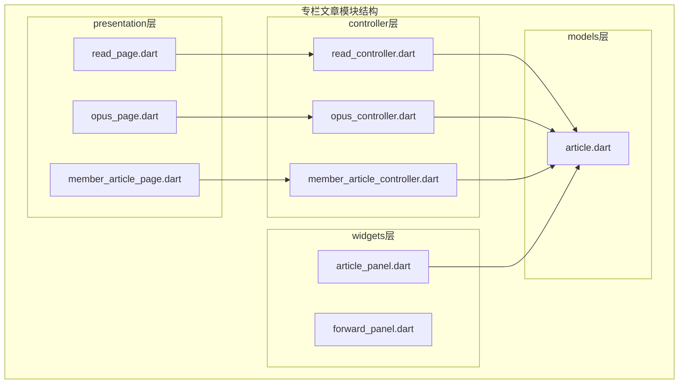
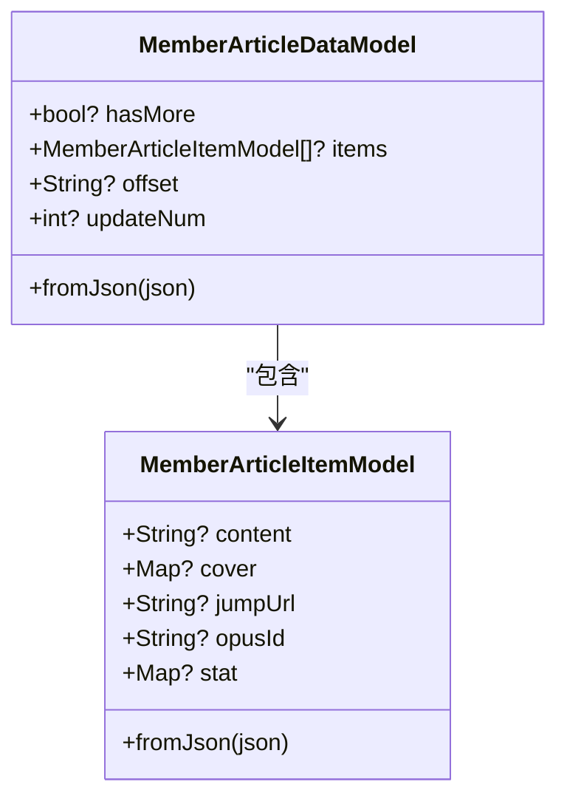
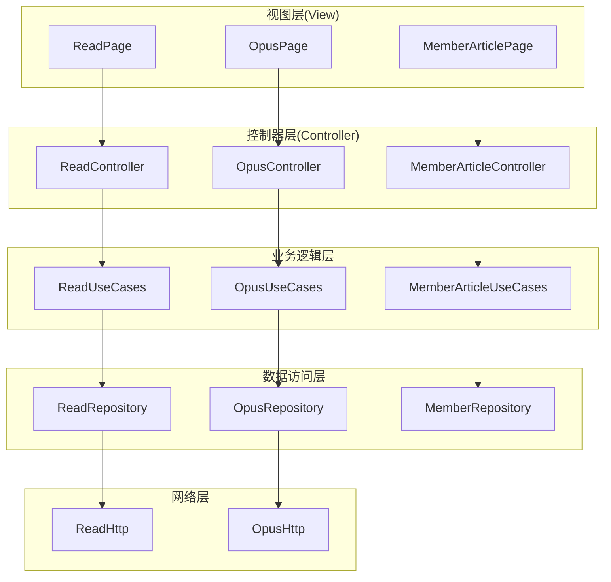
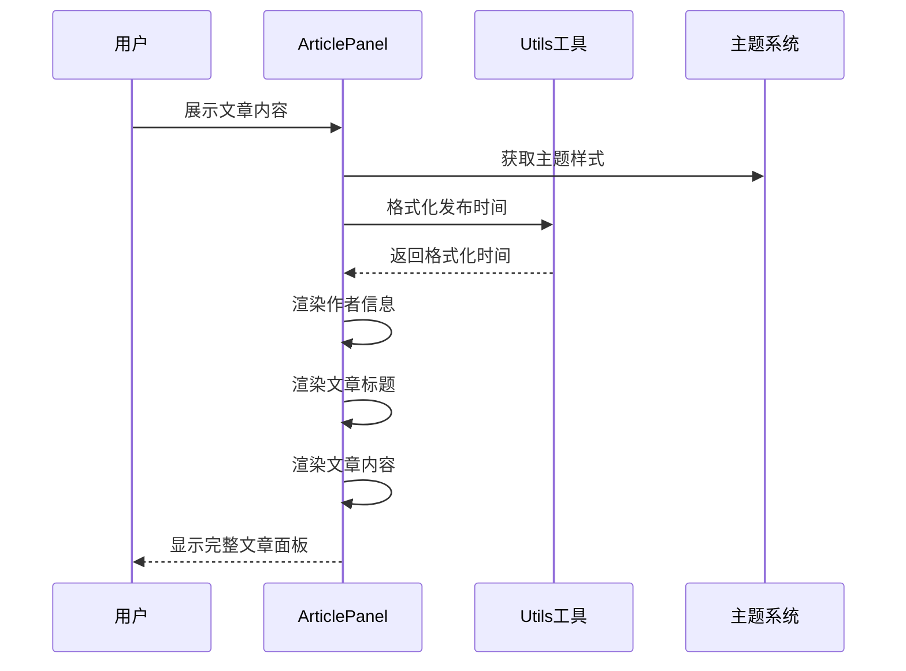
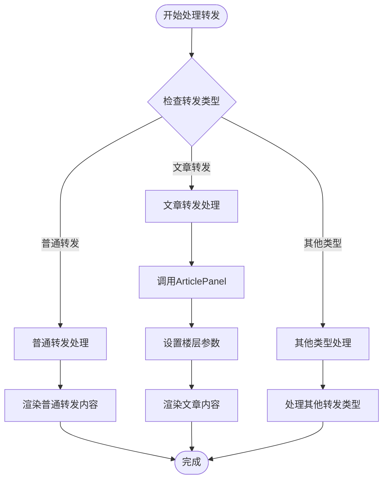
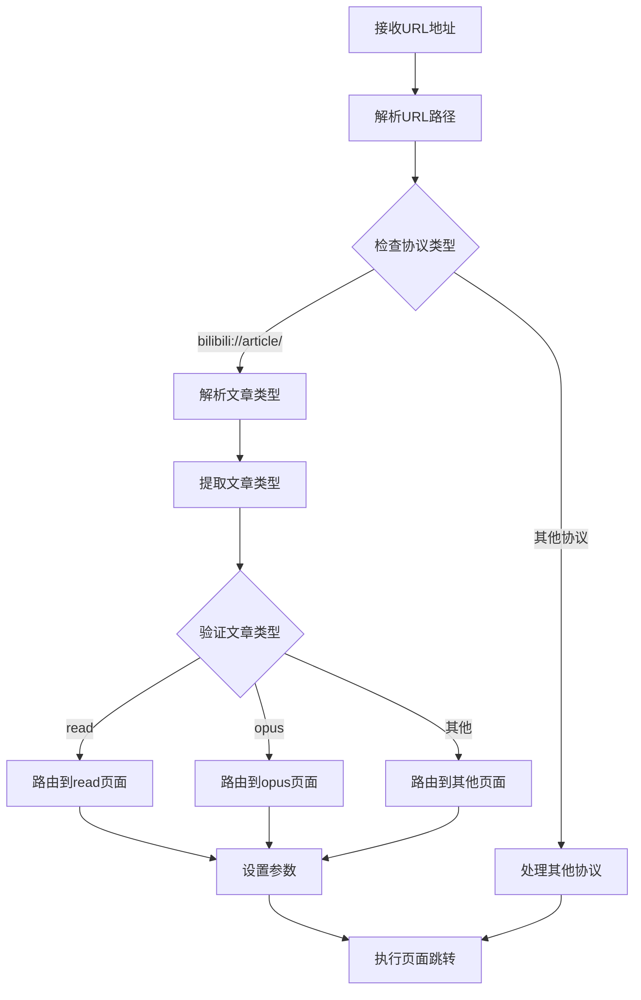
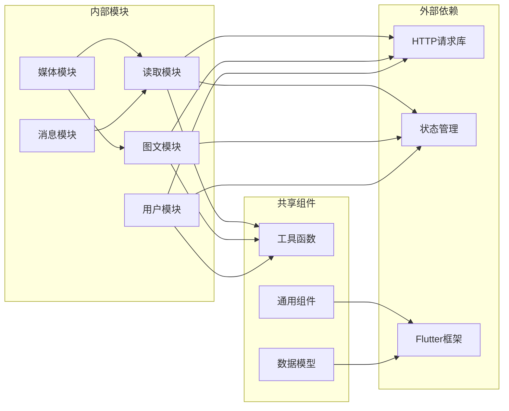

# 专栏文章模块

<cite>
**本文档引用的文件**
- [lib/features/read/presentation/read_page.dart](file://lib/features/read/presentation/read_page.dart)
- [lib/features/read/presentation/read_controller.dart](file://lib/features/read/presentation/read_controller.dart)
- [lib/features/opus/presentation/opus_page.dart](file://lib/features/opus/presentation/opus_page.dart)
- [lib/features/opus/presentation/opus_controller.dart](file://lib/features/opus/presentation/opus_controller.dart)
- [lib/features/user/presentation/member_article/member_article_page.dart](file://lib/features/user/presentation/member_article/member_article_page.dart)
- [lib/features/user/presentation/member_article/member_article_controller.dart](file://lib/features/user/presentation/member_article/member_article_controller.dart)
- [lib/models/member/article.dart](file://lib/models/member/article.dart)
- [lib/features/dynamics/presentation/widgets/article_panel.dart](file://lib/features/dynamics/presentation/widgets/article_panel.dart)
- [lib/features/dynamics/presentation/widgets/forward_panel.dart](file://lib/features/dynamics/presentation/widgets/forward_panel.dart)
- [lib/features/dynamics/presentation/dynamics_controller.dart](file://lib/features/dynamics/presentation/dynamics_controller.dart)
- [lib/features/media/presentation/history/history_controller.dart](file://lib/features/media/presentation/history/history_controller.dart)
- [lib/features/media/presentation/history_search/history_search_controller.dart](file://lib/features/media/presentation/history_search/history_search_controller.dart)
- [lib/features/message/presentation/whisper_detail/widget/chat_item.dart](file://lib/features/message/presentation/whisper_detail/widget/chat_item.dart)
- [lib/common/widgets/video_card_v.dart](file://lib/common/widgets/video_card_v.dart)
</cite>

## 目录
1. [简介](#简介)
2. [项目结构](#项目结构)
3. [核心组件](#核心组件)
4. [架构概览](#架构概览)
5. [详细组件分析](#详细组件分析)
6. [依赖关系分析](#依赖关系分析)
7. [性能考虑](#性能考虑)
8. [故障排除指南](#故障排除指南)
9. [结论](#结论)

## 简介

专栏文章模块是Pilipala应用中的重要功能模块，主要负责处理和展示B站专栏文章内容。该模块支持多种文章类型，包括普通文章(read)、图文文章(opus)等，并提供了完整的文章浏览、收藏、历史记录等功能。

## 项目结构

专栏文章模块采用Flutter标准的特性分离架构，按照功能模块进行组织：

**图表来源**
- [lib/features/read/presentation/read_page.dart:1-50](file://lib/features/read/presentation/read_page.dart#L1-L50)
- [lib/features/opus/presentation/opus_page.dart:1-50](file://lib/features/opus/presentation/opus_page.dart#L1-L50)
- [lib/features/user/presentation/member_article/member_article_page.dart:1-50](file://lib/features/user/presentation/member_article/member_article_page.dart#L1-L50)

**章节来源**
- [lib/features/read/presentation/read_page.dart:1-50](file://lib/features/read/presentation/read_page.dart#L1-L50)
- [lib/features/opus/presentation/opus_page.dart:1-50](file://lib/features/opus/presentation/opus_page.dart#L1-L50)
- [lib/features/user/presentation/member_article/member_article_page.dart:1-50](file://lib/features/user/presentation/member_article/member_article_page.dart#L1-L50)

## 核心组件

### 文章数据模型

文章模块的核心数据结构由两个主要类组成：

**图表来源**
- [lib/models/member/article.dart:1-51](file://lib/models/member/article.dart#L1-L51)

### 文章控制器

系统提供三个主要的文章控制器，分别处理不同类型的专栏文章：

| 控制器 | 类型 | 功能 |
|--------|------|------|
| ReadController | 普通文章 | 处理read类型的文章内容解析和展示 |
| OpusController | 图文文章 | 处理opus类型的文章内容，支持富文本格式 |
| MemberArticleController | 用户文章 | 处理用户个人主页的文章列表展示 |

**章节来源**
- [lib/features/read/presentation/read_controller.dart:1-50](file://lib/features/read/presentation/read_controller.dart#L1-L50)
- [lib/features/opus/presentation/opus_controller.dart:1-50](file://lib/features/opus/presentation/opus_controller.dart#L1-L50)
- [lib/features/user/presentation/member_article/member_article_controller.dart:1-50](file://lib/features/user/presentation/member_article/member_article_controller.dart#L1-L50)

## 架构概览

专栏文章模块采用MVVM架构模式，实现了清晰的分层设计：

**图表来源**
- [lib/features/read/presentation/read_controller.dart:1-50](file://lib/features/read/presentation/read_controller.dart#L1-L50)
- [lib/features/opus/presentation/opus_controller.dart:1-50](file://lib/features/opus/presentation/opus_controller.dart#L1-L50)
- [lib/features/user/presentation/member_article/member_article_controller.dart:1-50](file://lib/features/user/presentation/member_article/member_article_controller.dart#L1-L50)

## 详细组件分析

### 文章面板组件

文章面板是专栏文章模块的核心UI组件，提供了统一的文章展示界面：

**图表来源**
- [lib/features/dynamics/presentation/widgets/article_panel.dart:6-45](file://lib/features/dynamics/presentation/widgets/article_panel.dart#L6-L45)

文章面板支持两种显示模式：
- **楼层模式(floor=1)**: 标准的文章列表显示
- **转发模式(floor=2)**: 包含作者信息和发布时间的详细显示

**章节来源**
- [lib/features/dynamics/presentation/widgets/article_panel.dart:1-45](file://lib/features/dynamics/presentation/widgets/article_panel.dart#L1-L45)

### 动态转发面板

动态转发面板扩展了文章面板的功能，专门用于处理转发场景：

**图表来源**
- [lib/features/dynamics/presentation/widgets/forward_panel.dart:1-100](file://lib/features/dynamics/presentation/widgets/forward_panel.dart#L1-L100)

**章节来源**
- [lib/features/dynamics/presentation/widgets/forward_panel.dart:1-100](file://lib/features/dynamics/presentation/widgets/forward_panel.dart#L1-L100)

### 文章类型路由处理

系统支持多种文章类型的URL解析和路由跳转：

**图表来源**
- [lib/features/dynamics/presentation/dynamics_controller.dart:170-185](file://lib/features/dynamics/presentation/dynamics_controller.dart#L170-L185)

**章节来源**
- [lib/features/dynamics/presentation/dynamics_controller.dart:50-60](file://lib/features/dynamics/presentation/dynamics_controller.dart#L50-L60)
- [lib/features/dynamics/presentation/dynamics_controller.dart:170-185](file://lib/features/dynamics/presentation/dynamics_controller.dart#L170-L185)

### 历史记录集成

文章模块与历史记录功能深度集成，支持不同类型文章的历史追踪：

| 文章类型 | 历史记录键 | 功能特性 |
|----------|------------|----------|
| article_read | article_read | 普通文章阅读历史 |
| article_opus | article_opus | 图文文章阅读历史 |
| article_cv | article_cv | 专栏文章阅读历史 |

**章节来源**
- [lib/features/media/presentation/history/history_controller.dart:160-170](file://lib/features/media/presentation/history/history_controller.dart#L160-L170)
- [lib/features/media/presentation/history_search/history_search_controller.dart:90-100](file://lib/features/media/presentation/history_search/history_search_controller.dart#L90-L100)

## 依赖关系分析

专栏文章模块与其他系统组件的依赖关系如下：

**图表来源**
- [lib/features/read/presentation/read_controller.dart:1-30](file://lib/features/read/presentation/read_controller.dart#L1-L30)
- [lib/features/opus/presentation/opus_controller.dart:1-30](file://lib/features/opus/presentation/opus_controller.dart#L1-L30)
- [lib/features/user/presentation/member_article/member_article_controller.dart:1-30](file://lib/features/user/presentation/member_article/member_article_controller.dart#L1-L30)

**章节来源**
- [lib/features/read/presentation/read_controller.dart:1-30](file://lib/features/read/presentation/read_controller.dart#L1-L30)
- [lib/features/opus/presentation/opus_controller.dart:1-30](file://lib/features/opus/presentation/opus_controller.dart#L1-L30)
- [lib/features/user/presentation/member_article/member_article_controller.dart:1-30](file://lib/features/user/presentation/member_article/member_article_controller.dart#L1-L30)

## 性能考虑

### 内存优化策略

1. **懒加载机制**: 文章内容按需加载，避免一次性加载大量数据
2. **缓存策略**: 使用GetX状态管理实现数据缓存，减少重复请求
3. **图片优化**: 支持图片懒加载和尺寸适配

### 网络请求优化

1. **请求合并**: 对于频繁访问的文章，采用请求合并策略
2. **错误重试**: 实现智能重试机制，提高请求成功率
3. **离线支持**: 支持部分离线功能，提升用户体验

## 故障排除指南

### 常见问题及解决方案

| 问题类型 | 症状描述 | 解决方案 |
|----------|----------|----------|
| 文章加载失败 | 页面空白或显示错误 | 检查网络连接，清理缓存数据 |
| 图片显示异常 | 图片不显示或加载缓慢 | 检查图片URL，启用图片缓存 |
| 路由跳转失败 | 无法打开特定文章 | 验证URL格式，检查文章类型参数 |
| 历史记录缺失 | 文章未记录到历史 | 检查历史记录权限，确认文章类型支持 |

### 调试技巧

1. **日志监控**: 启用详细的日志输出，跟踪文章加载流程
2. **网络调试**: 使用开发者工具监控网络请求状态
3. **内存监控**: 定期检查内存使用情况，防止内存泄漏

**章节来源**
- [lib/features/read/presentation/read_controller.dart:1-50](file://lib/features/read/presentation/read_controller.dart#L1-L50)
- [lib/features/opus/presentation/opus_controller.dart:1-50](file://lib/features/opus/presentation/opus_controller.dart#L1-L50)

## 结论

专栏文章模块通过清晰的架构设计和完善的组件体系，为用户提供了流畅的文章浏览体验。模块支持多种文章类型，具备良好的扩展性和维护性。未来可以进一步优化性能表现，增强个性化推荐功能，并完善离线阅读能力。

该模块的成功实现体现了Flutter开发的最佳实践，为类似的内容展示类应用提供了优秀的参考模板。