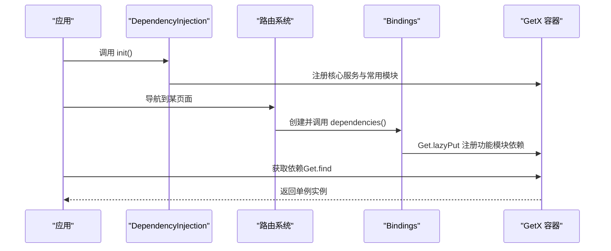
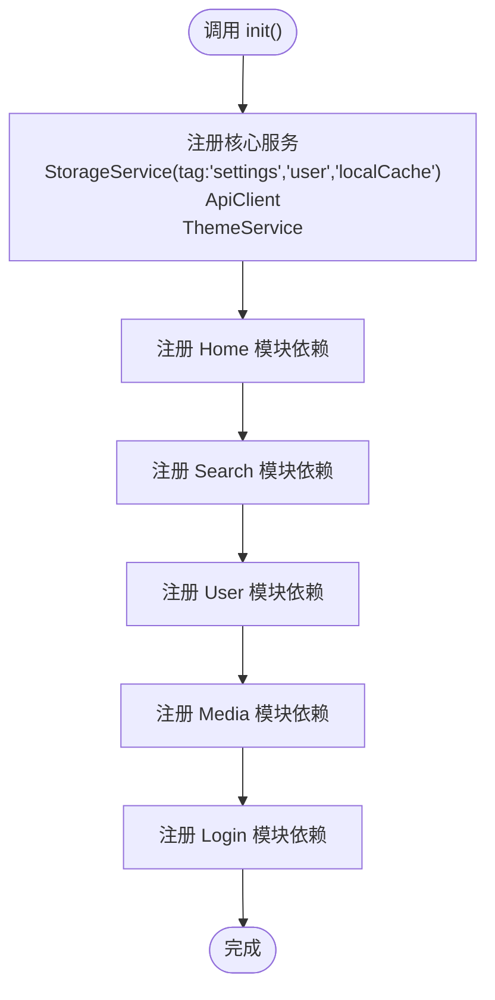
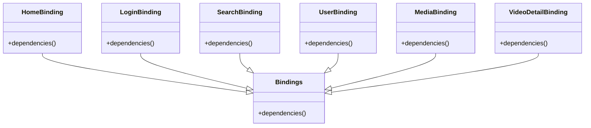
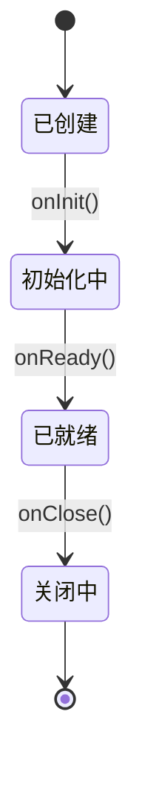
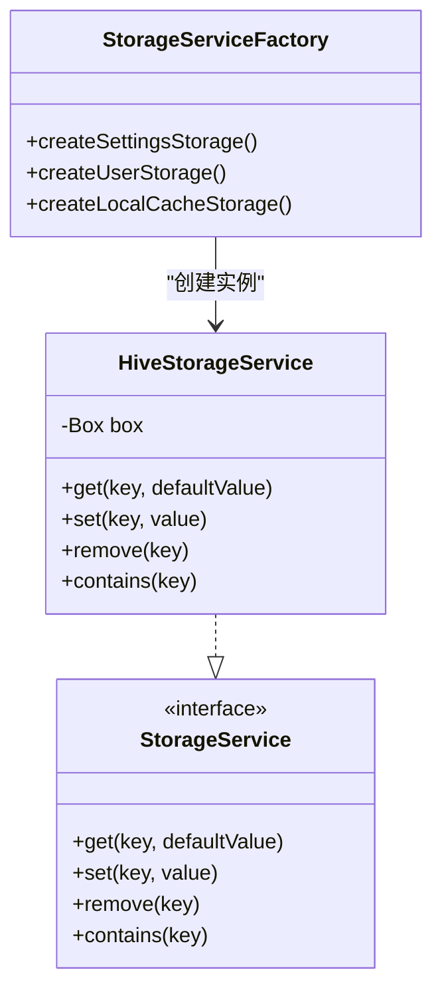
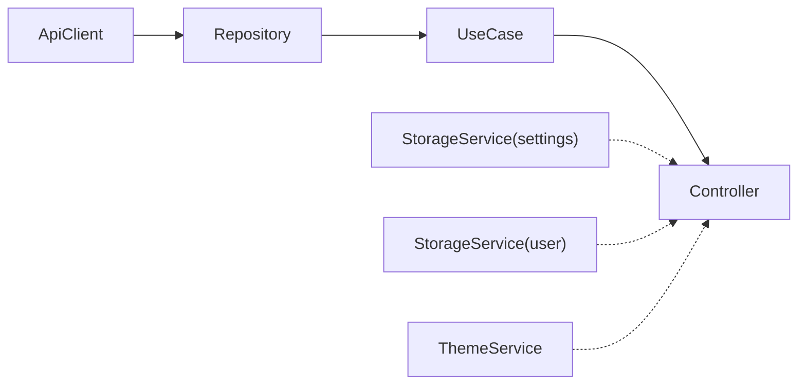

# 依赖注入

<cite>
**本文引用的文件**
- [bindings.dart](file://lib/router/bindings.dart)
- [dependency_injection.dart](file://lib/core/di/dependency_injection.dart)
- [02-state-management.md](file://docs/spec/architecture/02-state-management.md)
- [storage_service.dart](file://lib/core/storage/storage_service.dart)
</cite>

## 目录
1. [简介](#简介)
2. [项目结构](#项目结构)
3. [核心组件](#核心组件)
4. [架构总览](#架构总览)
5. [详细组件分析](#详细组件分析)
6. [依赖关系分析](#依赖关系分析)
7. [性能考虑](#性能考虑)
8. [故障排查指南](#故障排查指南)
9. [结论](#结论)
10. [附录](#附录)

## 简介
本文件系统性梳理 PiliPala 的依赖注入体系，基于 GetX 框架实现。重点覆盖：
- Bindings 类的职责与实现方式
- 依赖声明与生命周期管理
- 单例、工厂与作用域管理策略
- 延迟加载、循环依赖处理与内存管理
- 依赖关系图、注入流程图与配置示例
- 最佳实践、性能优化与调试方法

## 项目结构
PiliPala 的依赖注入采用“按功能模块划分”的组织方式：
- 核心层依赖集中初始化于核心模块的依赖注入入口
- 功能层依赖通过路由绑定（Bindings）在进入对应页面时按需注册
- 控制器（Controller）与领域用例（UseCase）、仓储（Repository）等通过 Get.lazyPut 实现延迟单例

```mermaid
graph TB
subgraph "应用启动"
DI["DependencyInjection.init()"]
end
subgraph "核心服务"
S1["StorageService(settings)"]
S2["StorageService(user)"]
S3["StorageService(localCache)"]
N1["ApiClient"]
T1["ThemeService"]
end
subgraph "功能模块"
subgraph "首页"
R1["VideoRepository"]
U1["GetRecommendedVideosUseCase"]
U2["GetHotVideosUseCase"]
C1["HomeController"]
end
subgraph "搜索"
R2["SearchRepository"]
U3["GetHotSearchUseCase"]
U4["SearchContentUseCase"]
U5["GetSearchSuggestionsUseCase"]
C2["PiliSearchController"]
end
subgraph "用户"
R3["UserRepository"]
U6["GetUserInfoUseCase"]
U7["GetUserStatUseCase"]
U8["FollowUserUseCase"]
U9["GetUserCoinsUseCase"]
U10["GetUserLikesUseCase"]
U11["GetUserSeasonsUseCase"]
C3["UserController"]
end
subgraph "媒体"
R4["MediaRepository"]
U12["GetWatchLaterUseCase"]
U13["GetHistoryUseCase"]
U14["GetFavFoldersUseCase"]
U15["GetFavFolderDetailUseCase"]
C4["MediaController"]
end
subgraph "登录"
R5["LoginRepository"]
U16["GetCaptchaUseCase"]
U17["GetWebKeyUseCase"]
U18["EncryptPasswordUseCase"]
U19["LoginByPasswordUseCase"]
U20["LoginBySmsCodeUseCase"]
U21["SendSmsCodeUseCase"]
U22["QrCodeLoginUseCase"]
C5["LoginController"]
end
end
DI --> S1
DI --> S2
DI --> S3
DI --> N1
DI --> T1
DI --> R1
DI --> R2
DI --> R3
DI --> R4
DI --> R5
DI --> U1
DI --> U2
DI --> U3
DI --> U4
DI --> U5
DI --> U6
DI --> U7
DI --> U8
DI --> U9
DI --> U10
DI --> U11
DI --> U12
DI --> U13
DI --> U14
DI --> U15
DI --> U16
DI --> U17
DI --> U18
DI --> U19
DI --> U20
DI --> U21
DI --> U22
DI --> C1
DI --> C2
DI --> C3
DI --> C4
DI --> C5
```

图表来源
- [dependency_injection.dart:31-89](file://lib/core/di/dependency_injection.dart#L31-L89)

章节来源
- [dependency_injection.dart:1-90](file://lib/core/di/dependency_injection.dart#L1-L90)
- [bindings.dart:1-99](file://lib/router/bindings.dart#L1-L99)

## 核心组件
- 依赖注入入口（DependencyInjection.init）
  - 负责注册核心服务（存储、网络、主题）与各功能模块的仓储、用例、控制器
  - 使用 Get.lazyPut 实现延迟单例，按需创建并缓存实例
- 路由绑定（Bindings）
  - 每个路由对应一个 Bindings 子类，重写 dependencies 方法进行依赖注册
  - 用于按需注册功能模块内的依赖，避免全局一次性加载
- 控制器（Controller）
  - 通过 GetxController 提供生命周期回调 onInit/onReady/onClose
  - 通过 Get.put / Get.lazyPut / Get.create 管理实例化策略与作用域
- 仓储与用例（Repository/UseCase）
  - 通过 Get.lazyPut 注册为单例，供控制器调用
- 存储服务（StorageService）
  - 抽象接口 + Hive 实现，支持多实例（settings/user/localCache），通过 tag 隔离

章节来源
- [dependency_injection.dart:31-89](file://lib/core/di/dependency_injection.dart#L31-L89)
- [bindings.dart:22-98](file://lib/router/bindings.dart#L22-L98)
- [02-state-management.md:144-182](file://docs/spec/architecture/02-state-management.md#L144-L182)
- [storage_service.dart:10-64](file://lib/core/storage/storage_service.dart#L10-L64)

## 架构总览
依赖注入采用“启动阶段集中 + 路由阶段按需”的双层策略：
- 启动阶段：注册核心服务与常用功能模块，确保全局可用
- 路由阶段：进入具体页面时，通过 Bindings 注册该页面专属依赖，避免无谓开销

图表来源
- [dependency_injection.dart:31-89](file://lib/core/di/dependency_injection.dart#L31-L89)
- [bindings.dart:22-98](file://lib/router/bindings.dart#L22-L98)

## 详细组件分析

### 组件一：依赖注入入口（DependencyInjection）
- 职责
  - 注册核心服务：StorageService（settings/user/localCache）、ApiClient、ThemeService
  - 注册常用功能模块：Home/Search/User/Media/Login 的仓储、用例与控制器
- 实现要点
  - 使用 Get.lazyPut 实现延迟单例，首次使用时创建并缓存
  - 通过 tag 区分同一类型的不同实例（如多套 StorageService）
- 生命周期
  - 在应用启动时调用一次，保证后续按需获取
- 性能影响
  - 将高频使用的模块提前注册，减少首帧等待；低频模块可交由路由绑定按需注册

图表来源
- [dependency_injection.dart:31-89](file://lib/core/di/dependency_injection.dart#L31-L89)

章节来源
- [dependency_injection.dart:31-89](file://lib/core/di/dependency_injection.dart#L31-L89)

### 组件二：路由绑定（Bindings）
- 职责
  - 在进入特定路由时，注册该页面所需的功能模块依赖
  - 避免同路由跳转时控制器冲突（例如视频详情页由页面自行注册）
- 实现要点
  - 每个功能模块一个 Bindings 子类，dependencies 中仅注册当前模块依赖
  - 对于需要按 tag 注册的控制器，在页面内使用 Get.put(tag: ...) 自行管理
- 生命周期
  - 与路由生命周期绑定，进入页面时注册，离开页面不自动销毁（由 Get.lazyPut 单例特性决定）

图表来源
- [bindings.dart:22-98](file://lib/router/bindings.dart#L22-L98)

章节来源
- [bindings.dart:22-98](file://lib/router/bindings.dart#L22-L98)

### 组件三：控制器（Controller）与生命周期
- 生命周期
  - onInit：初始化状态与订阅
  - onReady：首次渲染后执行，适合发起首次数据请求
  - onClose：清理资源（取消订阅、关闭流、释放控制器）
- 注入位置
  - 建议在页面 build 或 initState 中使用 Get.put 注入
  - 对于需要区分实例的场景，使用 tag 隔离
- 作用域
  - Get.put 默认单例；Get.create 每次获取都创建新实例；Get.lazyPut 延迟单例

图表来源
- [02-state-management.md:60-82](file://docs/spec/architecture/02-state-management.md#L60-L82)

章节来源
- [02-state-management.md:144-182](file://docs/spec/architecture/02-state-management.md#L144-L182)
- [02-state-management.md:60-82](file://docs/spec/architecture/02-state-management.md#L60-L82)

### 组件四：存储服务（StorageService）与工厂
- 设计目标
  - 抽象存储接口，便于测试与替换实现
  - 通过工厂创建不同用途的存储实例（设置、用户信息、本地缓存）
  - 通过 tag 在容器中区分实例
- 实现模式
  - 接口 + 具体实现（HiveStorageService）
  - 工厂方法创建多实例并注册到容器

图表来源
- [storage_service.dart:10-64](file://lib/core/storage/storage_service.dart#L10-L64)

章节来源
- [storage_service.dart:10-64](file://lib/core/storage/storage_service.dart#L10-L64)

## 依赖关系分析
- 模块耦合
  - 控制器依赖用例；用例依赖仓储；仓储依赖网络/存储服务
  - 通过 Get.lazyPut 注册，形成清晰的单向依赖链
- 作用域与生命周期
  - 核心服务与常用模块：全局单例（启动时注册）
  - 功能模块：按需单例（路由绑定注册）
  - 页面级控制器：按页面作用域（Get.put），可通过 tag 区分
- 循环依赖处理
  - 通过延迟注入（Get.lazyPut）与按需注册，避免编译期循环
  - 若出现运行时循环，建议拆分职责或引入中间层

图表来源
- [dependency_injection.dart:31-89](file://lib/core/di/dependency_injection.dart#L31-L89)

章节来源
- [dependency_injection.dart:31-89](file://lib/core/di/dependency_injection.dart#L31-L89)

## 性能考虑
- 延迟加载
  - 使用 Get.lazyPut 将非关键路径的依赖延迟到首次使用时创建，降低启动时间
- 单例复用
  - 核心服务与常用模块注册为单例，避免重复创建带来的内存与 CPU 开销
- 作用域控制
  - 页面级控制器使用 Get.put，配合 tag 避免实例冲突；必要时使用 Get.create 限定作用域
- 缓存与持久化
  - 利用 StorageService 的多实例隔离，减少锁竞争与命名冲突
- 调试与可观测性
  - 通过日志记录依赖注册与获取点，定位性能瓶颈

## 故障排查指南
- 注入失败
  - 确认依赖已在启动或路由绑定中注册
  - 检查 tag 是否匹配（获取与注册 tag 必须一致）
- 内存泄漏
  - 在控制器 onClose 中释放资源；避免持有页面上下文过久
  - 对于临时实例，优先使用 Get.create 并及时释放
- 循环依赖
  - 检查依赖链是否形成闭环；拆分职责或引入接口抽象
- 性能问题
  - 将重型初始化移至 Get.lazyPut；避免在主线程做阻塞操作
  - 使用 StorageService 的多实例隔离，减少不必要的同步

## 结论
PiliPala 的依赖注入体系以 GetX 为核心，结合“启动集中注册 + 路由按需注册”的双层策略，实现了高内聚、低耦合且具备良好性能与可维护性的架构。通过明确的生命周期管理、作用域控制与工厂模式，系统在复杂业务场景下仍保持清晰与稳定。

## 附录

### 配置示例（路径指引）
- 启动注册入口
  - [dependency_injection.dart:31-89](file://lib/core/di/dependency_injection.dart#L31-L89)
- 路由绑定注册
  - [bindings.dart:22-98](file://lib/router/bindings.dart#L22-L98)
- 控制器注入位置与标签
  - [02-state-management.md:144-182](file://docs/spec/architecture/02-state-management.md#L144-L182)
- 存储服务多实例注册
  - [storage_service.dart:10-64](file://lib/core/storage/storage_service.dart#L10-L64)