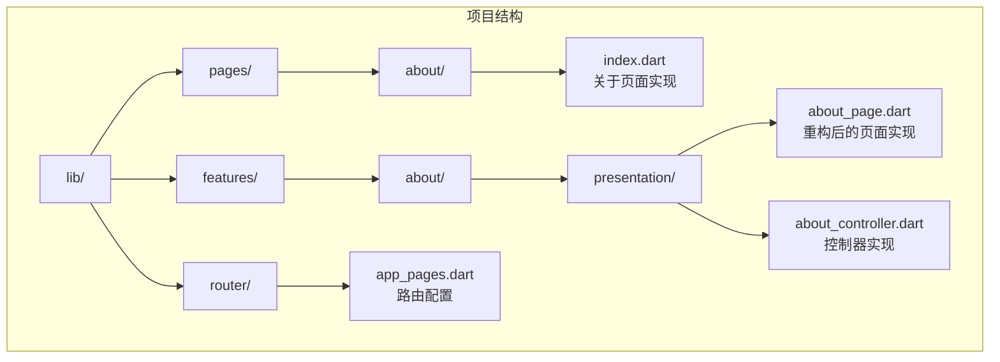
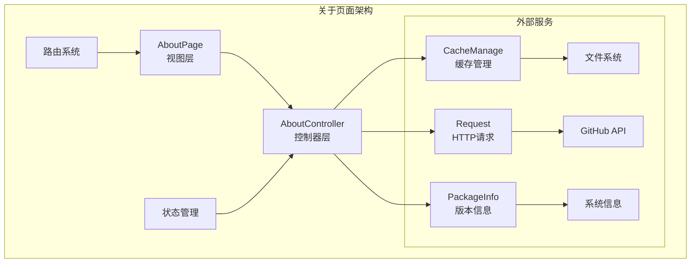
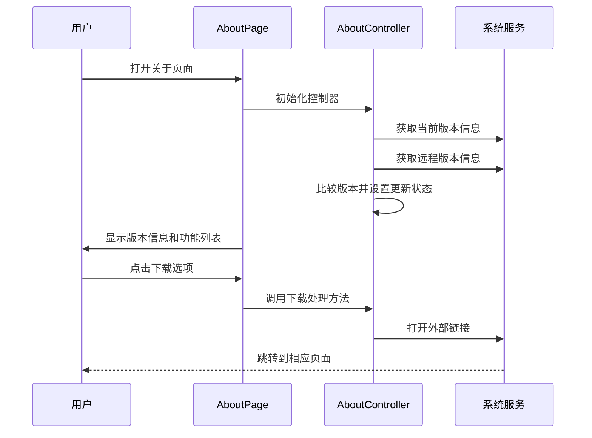
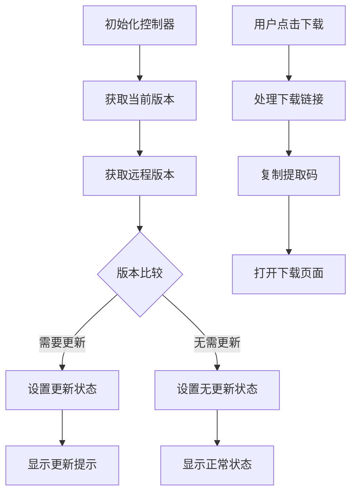
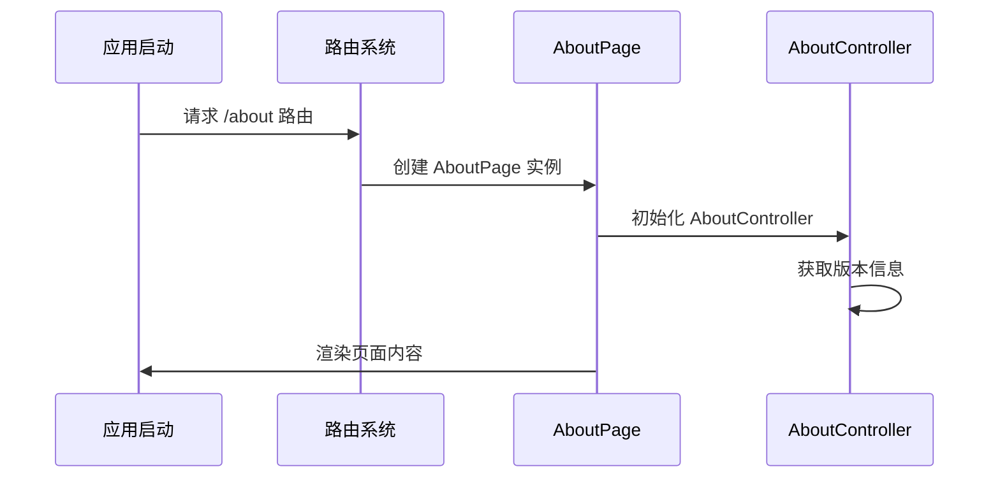
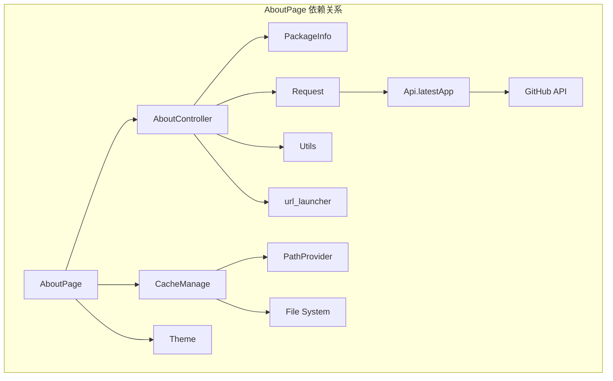

# 关于页面模块

<cite>
**本文档引用的文件**
- [lib/pages/about/index.dart](file://lib/pages/about/index.dart)
- [lib/features/about/presentation/about_page.dart](file://lib/features/about/presentation/about_page.dart)
- [lib/features/about/presentation/about_controller.dart](file://lib/features/about/presentation/about_controller.dart)
- [lib/router/app_pages.dart](file://lib/router/app_pages.dart)
- [lib/utils/cache_manage.dart](file://lib/utils/cache_manage.dart)
- [lib/models/github/latest.dart](file://lib/models/github/latest.dart)
- [lib/utils/utils.dart](file://lib/utils/utils.dart)
- [lib/http/index.dart](file://lib/http/index.dart)
- [docs/spec/architecture/05-navigation.md](file://docs/spec/architecture/05-navigation.md)
</cite>

## 目录
1. [简介](#简介)
2. [项目结构](#项目结构)
3. [核心组件](#核心组件)
4. [架构概览](#架构概览)
5. [详细组件分析](#详细组件分析)
6. [依赖关系分析](#依赖关系分析)
7. [性能考虑](#性能考虑)
8. [故障排除指南](#故障排除指南)
9. [结论](#结论)

## 简介

关于页面模块是PiliPala应用中的一个功能模块，主要用于展示应用的基本信息、版本更新检测、下载链接、社区交流渠道以及缓存管理等功能。该模块采用Flutter框架开发，使用GetX状态管理和路由系统，实现了现代化的移动应用界面设计。

## 项目结构

关于页面模块在项目中采用了两种实现方式：

**图表来源**
- [lib/pages/about/index.dart:1-369](file://lib/pages/about/index.dart#L1-L369)
- [lib/features/about/presentation/about_page.dart:1-202](file://lib/features/about/presentation/about_page.dart#L1-L202)
- [lib/features/about/presentation/about_controller.dart:1-137](file://lib/features/about/presentation/about_controller.dart#L1-L137)

**章节来源**
- [lib/pages/about/index.dart:1-369](file://lib/pages/about/index.dart#L1-L369)
- [lib/features/about/presentation/about_page.dart:1-202](file://lib/features/about/presentation/about_page.dart#L1-L202)
- [lib/features/about/presentation/about_controller.dart:1-137](file://lib/features/about/presentation/about_controller.dart#L1-L137)

## 核心组件

关于页面模块包含以下核心组件：

### 页面组件 (AboutPage)
- **状态管理**: 使用GetX的Obx响应式状态管理
- **UI布局**: 采用Column布局，包含应用Logo、版本信息、功能列表等
- **交互功能**: 支持版本更新检测、下载链接跳转、社区交流等

### 控制器组件 (AboutController)
- **版本管理**: 获取当前应用版本和远程版本信息
- **更新检测**: 实现版本比较和更新提示功能
- **外部链接**: 处理各种外部链接跳转操作

### 路由配置
- **路由名称**: `/about`
- **页面绑定**: 绑定相应的依赖注入服务
- **过渡动画**: 使用自定义的过渡效果

**章节来源**
- [lib/features/about/presentation/about_page.dart:7-202](file://lib/features/about/presentation/about_page.dart#L7-L202)
- [lib/features/about/presentation/about_controller.dart:11-137](file://lib/features/about/presentation/about_controller.dart#L11-L137)
- [lib/router/app_pages.dart:248-249](file://lib/router/app_pages.dart#L248-L249)

## 架构概览

关于页面模块采用了MVVM架构模式，结合了GetX的状态管理机制：

**图表来源**
- [lib/features/about/presentation/about_page.dart:14-202](file://lib/features/about/presentation/about_page.dart#L14-L202)
- [lib/features/about/presentation/about_controller.dart:11-137](file://lib/features/about/presentation/about_controller.dart#L11-L137)
- [lib/router/app_pages.dart:248-249](file://lib/router/app_pages.dart#L248-L249)

## 详细组件分析

### AboutPage 组件分析

AboutPage是关于页面的主要UI组件，采用了Material Design设计风格：

#### UI结构分析
- **头部区域**: 包含应用Logo和标题显示
- **版本信息**: 显示当前应用版本，支持版本更新检测
- **功能列表**: 提供多种功能入口，包括下载、反馈、社区等
- **缓存管理**: 显示和管理应用缓存

#### 交互流程

**图表来源**
- [lib/features/about/presentation/about_page.dart:30-202](file://lib/features/about/presentation/about_page.dart#L30-L202)
- [lib/features/about/presentation/about_controller.dart:19-137](file://lib/features/about/presentation/about_controller.dart#L19-L137)

**章节来源**
- [lib/features/about/presentation/about_page.dart:14-202](file://lib/features/about/presentation/about_page.dart#L14-L202)

### AboutController 控制器分析

AboutController负责处理关于页面的所有业务逻辑：

#### 核心功能实现

| 功能类别 | 方法名称 | 功能描述 |
|---------|---------|----------|
| 版本管理 | getCurrentApp() | 获取当前应用版本 |
| 版本管理 | getRemoteApp() | 获取远程最新版本 |
| 更新检测 | onUpdate() | 处理版本更新逻辑 |
| 外部链接 | githubUrl() | 跳转到GitHub主页 |
| 外部链接 | githubRelease() | 跳转到GitHub发布页面 |
| 外部链接 | panDownload() | 跳转到网盘下载 |
| 社区交流 | qqChanel() | 复制QQ群号 |
| 社区交流 | tgChanel() | 跳转到Telegram频道 |
| 缓存管理 | logs() | 打开错误日志页面 |

#### 数据流分析

**图表来源**
- [lib/features/about/presentation/about_controller.dart:19-47](file://lib/features/about/presentation/about_controller.dart#L19-L47)

**章节来源**
- [lib/features/about/presentation/about_controller.dart:11-137](file://lib/features/about/presentation/about_controller.dart#L11-L137)

### 路由集成分析

关于页面通过路由系统进行集成，支持多种导航方式：

#### 路由配置

| 路由名称 | 页面路径 | 绑定服务 | 功能描述 |
|---------|---------|---------|----------|
| `/about` | features_about.AboutPage | 无 | 关于页面主入口 |
| `/logs` | features_setting.LogsPage | 无 | 错误日志页面 |

#### 导航流程

**图表来源**
- [lib/router/app_pages.dart:248-249](file://lib/router/app_pages.dart#L248-L249)

**章节来源**
- [lib/router/app_pages.dart:248-249](file://lib/router/app_pages.dart#L248-L249)

## 依赖关系分析

关于页面模块的依赖关系如下：

**图表来源**
- [lib/features/about/presentation/about_page.dart:1-10](file://lib/features/about/presentation/about_page.dart#L1-L10)
- [lib/features/about/presentation/about_controller.dart:1-10](file://lib/features/about/presentation/about_controller.dart#L1-L10)

### 外部依赖

| 依赖包 | 版本 | 用途 |
|-------|------|------|
| package_info_plus | 最新版 | 获取应用版本信息 |
| flutter_smart_dialog | 最新版 | 显示提示对话框 |
| url_launcher | 最新版 | 打开外部链接 |
| hive | 最新版 | 本地数据存储 |

**章节来源**
- [lib/features/about/presentation/about_page.dart:1-10](file://lib/features/about/presentation/about_page.dart#L1-L10)
- [lib/features/about/presentation/about_controller.dart:1-10](file://lib/features/about/presentation/about_controller.dart#L1-L10)

## 性能考虑

关于页面模块在性能方面采用了以下优化策略：

### 内存管理
- **懒加载**: 页面组件采用延迟初始化策略
- **缓存控制**: 合理管理图片和数据缓存
- **状态优化**: 使用GetX的响应式状态管理减少不必要的重绘

### 网络请求优化
- **版本检测**: 仅在页面初始化时进行版本检查
- **错误处理**: 实现完善的网络异常处理机制
- **超时控制**: 设置合理的请求超时时间

### 用户体验优化
- **加载状态**: 显示版本检测的加载状态
- **错误提示**: 提供友好的错误提示信息
- **快速反馈**: 对用户操作提供即时反馈

## 故障排除指南

### 常见问题及解决方案

| 问题类型 | 症状描述 | 可能原因 | 解决方案 |
|---------|---------|---------|---------|
| 版本检测失败 | 显示"获取远程版本失败" | 网络连接问题 | 检查网络连接，重试操作 |
| 外链无法打开 | 点击链接无反应 | 系统未安装相应应用 | 提示用户安装相应应用 |
| 缓存清理失败 | 清除缓存后大小未变化 | 文件权限问题 | 检查应用权限设置 |
| 页面显示异常 | 版本信息显示不正确 | 缓存数据过期 | 重启应用或手动刷新 |

### 调试建议

1. **日志查看**: 通过`/logs`页面查看详细的错误日志
2. **网络诊断**: 检查GitHub API的可用性和响应时间
3. **缓存检查**: 验证缓存目录的读写权限
4. **版本对比**: 手动对比当前版本与远程版本信息

**章节来源**
- [lib/features/about/presentation/about_controller.dart:34-37](file://lib/features/about/presentation/about_controller.dart#L34-L37)
- [lib/features/about/presentation/about_page.dart:185-194](file://lib/features/about/presentation/about_page.dart#L185-L194)

## 结论

关于页面模块作为PiliPala应用的重要组成部分，展现了现代Flutter应用开发的最佳实践。该模块具有以下特点：

### 技术优势
- **架构清晰**: 采用MVVM架构和GetX状态管理
- **代码组织**: 模块化设计，职责分离明确
- **用户体验**: 提供丰富的功能和良好的交互体验
- **性能优化**: 有效的内存管理和网络请求优化

### 功能完整性
- **版本管理**: 完整的版本检测和更新机制
- **社区集成**: 多渠道的社区交流支持
- **缓存管理**: 便捷的缓存清理和监控功能
- **扩展性**: 易于添加新的功能和链接

### 发展前景
随着PiliPala项目向features架构的迁移，关于页面模块已经完成了从pages到features的重构，为后续的功能扩展和维护奠定了坚实的基础。该模块的设计理念和实现方式可以作为其他功能模块开发的参考模板。