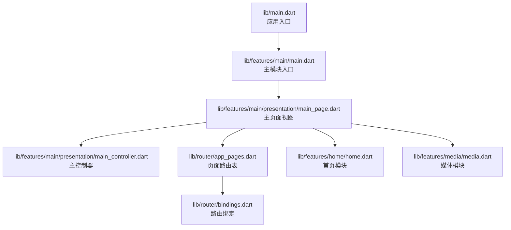
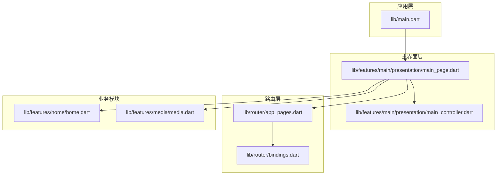
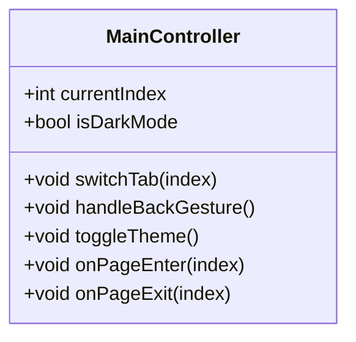
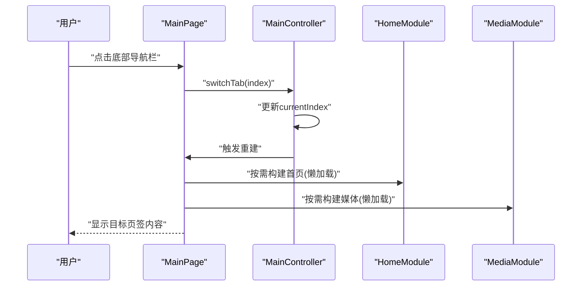
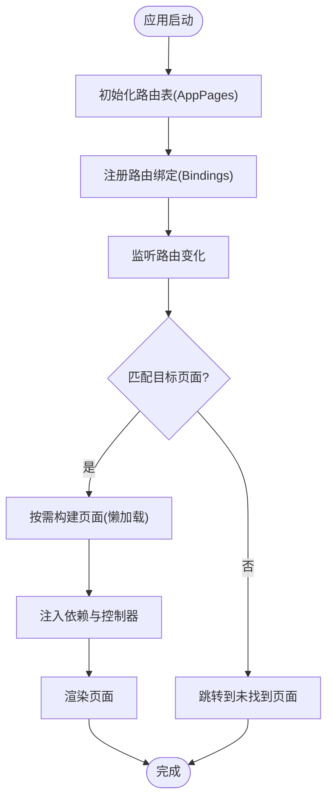
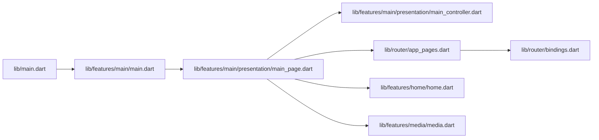

# 主界面模块

<cite>
**本文档引用的文件**
- [lib/main.dart](file://lib/main.dart)
- [lib/features/main/main.dart](file://lib/features/main/main.dart)
- [lib/features/main/presentation/main_controller.dart](file://lib/features/main/presentation/main_controller.dart)
- [lib/features/main/presentation/main_page.dart](file://lib/features/main/presentation/main_page.dart)
- [lib/router/app_pages.dart](file://lib/router/app_pages.dart)
- [lib/router/bindings.dart](file://lib/router/bindings.dart)
- [lib/features/home/home.dart](file://lib/features/home/home.dart)
- [lib/features/home/presentation/home_page.dart](file://lib/features/home/presentation/home_page.dart)
- [lib/features/home/presentation/home_controller.dart](file://lib/features/home/presentation/home_controller.dart)
- [lib/features/media/media.dart](file://lib/features/media/media.dart)
- [lib/features/media/presentation/media_page.dart](file://lib/features/media/presentation/media_page.dart)
- [lib/features/media/presentation/media_controller.dart](file://lib/features/media/presentation/media_controller.dart)
</cite>

## 目录
1. [简介](#简介)
2. [项目结构](#项目结构)
3. [核心组件](#核心组件)
4. [架构总览](#架构总览)
5. [详细组件分析](#详细组件分析)
6. [依赖关系分析](#依赖关系分析)
7. [性能考虑](#性能考虑)
8. [故障排除指南](#故障排除指南)
9. [结论](#结论)
10. [附录](#附录)

## 简介
本文件系统性梳理主界面模块的设计与实现，覆盖应用主框架、导航结构、页面布局、状态管理、页面切换与生命周期管理等关键主题。文档同时涵盖底部导航栏、侧边菜单与页面路由机制，以及主题切换、状态栏定制、手势导航等交互特性，并提供页面懒加载、内存管理与性能优化的实践指南，最后给出扩展导航、新增页面与自定义动画的实施建议。

## 项目结构
主界面模块位于 features/main 目录下，采用基于特性的分层组织方式：入口文件负责应用启动与全局配置，主页面承载底部导航与多页面容器，控制器负责状态管理与页面间协调，路由层统一管理页面映射与依赖绑定。

**图表来源**
- [lib/main.dart](file://lib/main.dart)
- [lib/features/main/main.dart](file://lib/features/main/main.dart)
- [lib/features/main/presentation/main_page.dart](file://lib/features/main/presentation/main_page.dart)
- [lib/features/main/presentation/main_controller.dart](file://lib/features/main/presentation/main_controller.dart)
- [lib/router/app_pages.dart](file://lib/router/app_pages.dart)
- [lib/router/bindings.dart](file://lib/router/bindings.dart)
- [lib/features/home/home.dart](file://lib/features/home/home.dart)
- [lib/features/media/media.dart](file://lib/features/media/media.dart)

**章节来源**
- [lib/main.dart](file://lib/main.dart)
- [lib/features/main/main.dart](file://lib/features/main/main.dart)

## 核心组件
- 应用入口与初始化：负责全局配置、主题与路由初始化，确保主界面在应用启动时正确渲染。
- 主页面与导航容器：提供底部导航栏与页面容器，承载首页与媒体等子页面，支持页面切换与状态保持。
- 主控制器：集中管理当前选中页签、页面栈状态、手势返回与主题切换等行为。
- 路由系统：通过路由表与绑定机制，实现页面注册、参数传递与依赖注入。
- 子模块集成：首页与媒体模块以模块化方式接入主页面，遵循统一的状态管理模式与导航协议。

**章节来源**
- [lib/features/main/presentation/main_page.dart](file://lib/features/main/presentation/main_page.dart)
- [lib/features/main/presentation/main_controller.dart](file://lib/features/main/presentation/main_controller.dart)
- [lib/router/app_pages.dart](file://lib/router/app_pages.dart)
- [lib/router/bindings.dart](file://lib/router/bindings.dart)

## 架构总览
主界面采用“模块化 + 控制器驱动”的架构设计。应用启动后，入口文件完成全局初始化；主页面作为导航容器，内部通过控制器管理当前页签与页面栈；路由层负责页面注册与依赖绑定；子模块（如首页、媒体）以独立模块形式接入，共享状态与导航协议。

**图表来源**
- [lib/main.dart](file://lib/main.dart)
- [lib/features/main/presentation/main_page.dart](file://lib/features/main/presentation/main_page.dart)
- [lib/features/main/presentation/main_controller.dart](file://lib/features/main/presentation/main_controller.dart)
- [lib/router/app_pages.dart](file://lib/router/app_pages.dart)
- [lib/router/bindings.dart](file://lib/router/bindings.dart)
- [lib/features/home/home.dart](file://lib/features/home/home.dart)
- [lib/features/media/media.dart](file://lib/features/media/media.dart)

## 详细组件分析

### 主控制器（MainController）
职责与能力
- 当前页签管理：维护当前选中的页签索引，触发页面切换与重建。
- 页面栈与懒加载：控制子页面的构建时机，避免不必要的资源消耗。
- 手势返回与导航：处理滑动返回与页签切换，提升交互流畅度。
- 主题与状态栏：响应主题切换事件，更新状态栏样式与颜色。
- 生命周期管理：在页面进入/退出时执行必要的初始化与清理逻辑。

状态与数据流
- 内部状态包括当前页签索引、页面栈、主题模式与状态栏配置。
- 通过依赖注入与路由绑定，与子模块控制器进行解耦协作。

**图表来源**
- [lib/features/main/presentation/main_controller.dart](file://lib/features/main/presentation/main_controller.dart)

**章节来源**
- [lib/features/main/presentation/main_controller.dart](file://lib/features/main/presentation/main_controller.dart)

### 主页面（MainPage）
职责与能力
- 导航容器：承载底部导航栏与页面容器，负责页签切换与页面重建。
- 布局与主题：根据控制器状态动态调整主题与状态栏样式。
- 手势与动画：配合控制器实现滑动返回与页面切换动画。
- 子页面集成：通过路由表注册首页与媒体模块，实现模块化接入。

页面结构
- 底部导航栏：提供页签项与图标，点击或滑动触发切换。
- 页面容器：按需构建子页面，支持懒加载与状态保持。
- 顶部状态栏：根据主题与页面内容动态适配颜色与样式。

**图表来源**
- [lib/features/main/presentation/main_page.dart](file://lib/features/main/presentation/main_page.dart)
- [lib/features/main/presentation/main_controller.dart](file://lib/features/main/presentation/main_controller.dart)
- [lib/features/home/home.dart](file://lib/features/home/home.dart)
- [lib/features/media/media.dart](file://lib/features/media/media.dart)

**章节来源**
- [lib/features/main/presentation/main_page.dart](file://lib/features/main/presentation/main_page.dart)

### 路由系统（AppPages 与 Bindings）
职责与能力
- 页面路由表：集中定义所有页面路径与对应视图，便于统一管理与查找。
- 路由绑定：为每个页面提供依赖注入与控制器绑定，确保页面启动时具备所需依赖。
- 参数传递：支持页面间参数传递与返回值处理。
- 懒加载策略：结合控制器实现按需构建，减少初始加载开销。

**图表来源**
- [lib/router/app_pages.dart](file://lib/router/app_pages.dart)
- [lib/router/bindings.dart](file://lib/router/bindings.dart)

**章节来源**
- [lib/router/app_pages.dart](file://lib/router/app_pages.dart)
- [lib/router/bindings.dart](file://lib/router/bindings.dart)

### 子模块集成（首页与媒体）
- 首页模块：提供推荐、热门等内容页，通过统一的控制器与路由接入主页面。
- 媒体模块：提供媒体播放与管理相关页面，同样遵循懒加载与状态管理规范。
- 协作方式：主控制器在切换页签时，按需构建对应模块页面，避免全局一次性加载。

**章节来源**
- [lib/features/home/home.dart](file://lib/features/home/home.dart)
- [lib/features/home/presentation/home_page.dart](file://lib/features/home/presentation/home_page.dart)
- [lib/features/home/presentation/home_controller.dart](file://lib/features/home/presentation/home_controller.dart)
- [lib/features/media/media.dart](file://lib/features/media/media.dart)
- [lib/features/media/presentation/media_page.dart](file://lib/features/media/presentation/media_page.dart)
- [lib/features/media/presentation/media_controller.dart](file://lib/features/media/presentation/media_controller.dart)

## 依赖关系分析
主界面模块的依赖关系清晰，入口文件负责全局初始化，主页面承担导航与容器职责，控制器集中管理状态与交互，路由层提供统一的页面注册与依赖注入机制，子模块以独立模块形式接入并共享状态与导航协议。

**图表来源**
- [lib/main.dart](file://lib/main.dart)
- [lib/features/main/main.dart](file://lib/features/main/main.dart)
- [lib/features/main/presentation/main_page.dart](file://lib/features/main/presentation/main_page.dart)
- [lib/features/main/presentation/main_controller.dart](file://lib/features/main/presentation/main_controller.dart)
- [lib/router/app_pages.dart](file://lib/router/app_pages.dart)
- [lib/router/bindings.dart](file://lib/router/bindings.dart)
- [lib/features/home/home.dart](file://lib/features/home/home.dart)
- [lib/features/media/media.dart](file://lib/features/media/media.dart)

**章节来源**
- [lib/main.dart](file://lib/main.dart)
- [lib/features/main/main.dart](file://lib/features/main/main.dart)
- [lib/features/main/presentation/main_page.dart](file://lib/features/main/presentation/main_page.dart)
- [lib/features/main/presentation/main_controller.dart](file://lib/features/main/presentation/main_controller.dart)
- [lib/router/app_pages.dart](file://lib/router/app_pages.dart)
- [lib/router/bindings.dart](file://lib/router/bindings.dart)
- [lib/features/home/home.dart](file://lib/features/home/home.dart)
- [lib/features/media/media.dart](file://lib/features/media/media.dart)

## 性能考虑
- 懒加载策略：仅在用户切换到对应页签时才构建页面，减少初始内存占用与启动时间。
- 页面栈管理：避免重复构建已存在的页面，必要时复用已有实例以降低重建成本。
- 主题切换优化：主题切换时仅更新受影响的UI节点，避免全量重绘。
- 状态栏与手势：合理设置状态栏样式与手势区域，减少不必要的绘制与布局计算。
- 子模块隔离：首页与媒体模块独立加载，避免相互影响导致的性能问题。

## 故障排除指南
- 页面不显示或空白：检查路由表是否正确注册目标页面，确认绑定是否成功注入控制器。
- 切换页签无响应：验证主控制器的页签索引更新逻辑与页面重建流程。
- 主题切换无效：确认主题切换事件是否正确下发至主控制器与页面组件。
- 手势返回异常：检查手势识别与页面栈状态，确保返回逻辑与重建流程一致。
- 内存占用过高：排查是否存在未释放的监听器或未销毁的页面实例，优化懒加载策略。

**章节来源**
- [lib/features/main/presentation/main_controller.dart](file://lib/features/main/presentation/main_controller.dart)
- [lib/features/main/presentation/main_page.dart](file://lib/features/main/presentation/main_page.dart)
- [lib/router/app_pages.dart](file://lib/router/app_pages.dart)
- [lib/router/bindings.dart](file://lib/router/bindings.dart)

## 结论
主界面模块通过清晰的分层与模块化设计，实现了稳定的导航与页面管理。主控制器集中处理状态与交互，路由系统提供统一的页面注册与依赖注入，子模块以懒加载方式接入，兼顾了性能与可扩展性。遵循本文档的实践建议，可在保证用户体验的同时，持续扩展导航功能、新增页面并实现自定义动画效果。

## 附录
- 扩展导航功能：在路由表中新增页面映射，在绑定中注册依赖，最后在主控制器中增加页签项与切换逻辑。
- 添加新页面：定义页面视图与控制器，注册到路由表并配置懒加载策略，确保与现有状态管理兼容。
- 自定义动画：在页面切换处引入自定义过渡动画，结合手势返回实现更自然的交互体验。
- 主题与状态栏：通过控制器统一管理主题切换与状态栏样式，确保跨页面一致性。