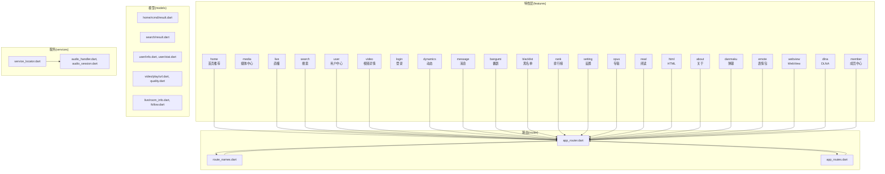
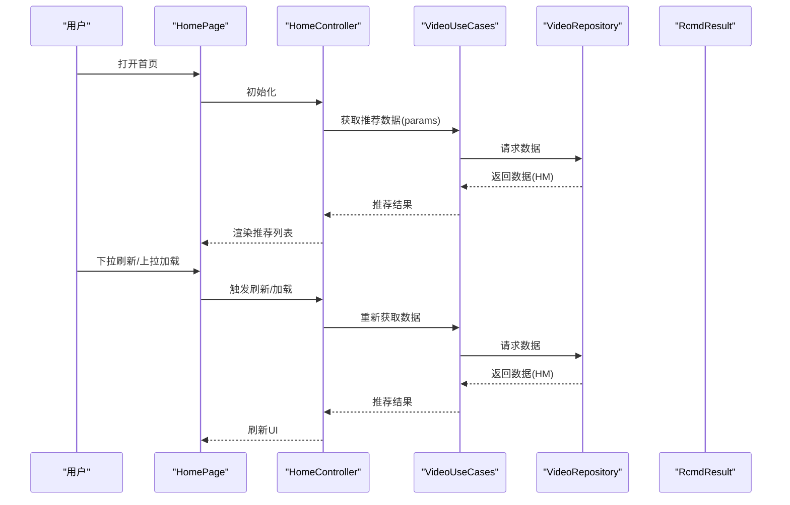
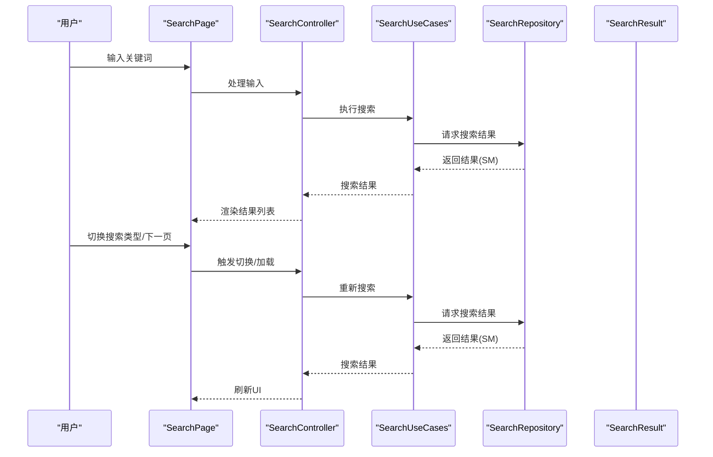
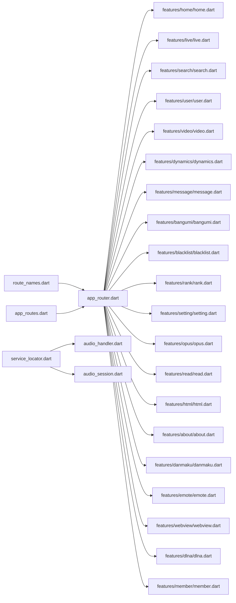

# 功能模块

<cite>
**本文引用的文件**
- [lib/features/home/home.dart](file://lib/features/home/home.dart)
- [lib/features/home/presentation/home_page.dart](file://lib/features/home/presentation/home_page.dart)
- [lib/features/home/presentation/home_controller.dart](file://lib/features/home/presentation/home_controller.dart)
- [lib/features/home/presentation/rcmd_page.dart](file://lib/features/home/presentation/rcmd_page.dart)
- [lib/features/home/presentation/hot_page.dart](file://lib/features/home/presentation/hot_page.dart)
- [lib/features/home/data/video_repository.dart](file://lib/features/home/data/video_repository.dart)
- [lib/features/home/domain/video_use_cases.dart](file://lib/features/home/domain/video_use_cases.dart)
- [lib/features/media/media.dart](file://lib/features/media/media.dart)
- [lib/features/media/presentation/media_page.dart](file://lib/features/media/presentation/media_page.dart)
- [lib/features/media/presentation/media_controller.dart](file://lib/features/media/presentation/media_controller.dart)
- [lib/features/media/data/media_repository.dart](file://lib/features/media/data/media_repository.dart)
- [lib/features/media/domain/media_use_cases.dart](file://lib/features/media/domain/media_use_cases.dart)
- [lib/features/live/live.dart](file://lib/features/live/live.dart)
- [lib/features/live/presentation/live_page.dart](file://lib/features/live/presentation/live_page.dart)
- [lib/features/live/presentation/live_controller.dart](file://lib/features/live/presentation/live_controller.dart)
- [lib/features/live/presentation/live_room_page.dart](file://lib/features/live/presentation/live_room_page.dart)
- [lib/features/live/presentation/live_room_controller.dart](file://lib/features/live/presentation/live_room_controller.dart)
- [lib/features/search/search.dart](file://lib/features/search/search.dart)
- [lib/features/search/presentation/search_page.dart](file://lib/features/search/presentation/search_page.dart)
- [lib/features/search/presentation/search_controller.dart](file://lib/features/search/presentation/search_controller.dart)
- [lib/features/search/data/search_repository.dart](file://lib/features/search/data/search_repository.dart)
- [lib/features/search/domain/search_use_cases.dart](file://lib/features/search/domain/search_use_cases.dart)
- [lib/features/user/user.dart](file://lib/features/user/user.dart)
- [lib/features/user/presentation/user_controller.dart](file://lib/features/user/presentation/user_controller.dart)
- [lib/features/user/presentation/member_page.dart](file://lib/features/user/presentation/member_page.dart)
- [lib/features/user/data/user_repository.dart](file://lib/features/user/data/user_repository.dart)
- [lib/features/user/domain/user_use_cases.dart](file://lib/features/user/domain/user_use_cases.dart)
- [lib/features/video/video.dart](file://lib/features/video/video.dart)
- [lib/features/video/presentation/video_detail_page.dart](file://lib/features/video/presentation/video_detail_page.dart)
- [lib/features/video/presentation/video_detail_controller.dart](file://lib/features/video/presentation/video_detail_controller.dart)
- [lib/features/video/data/video_detail_repository.dart](file://lib/features/video/data/video_detail_repository.dart)
- [lib/features/video/domain/video_detail_use_cases.dart](file://lib/features/video/domain/video_detail_use_cases.dart)
- [lib/features/login/login.dart](file://lib/features/login/login.dart)
- [lib/features/login/presentation/login_page.dart](file://lib/features/login/presentation/login_page.dart)
- [lib/features/login/presentation/login_controller.dart](file://lib/features/login/presentation/login_controller.dart)
- [lib/features/login/data/login_repository.dart](file://lib/features/login/data/login_repository.dart)
- [lib/features/login/domain/login_use_cases.dart](file://lib/features/login/domain/login_use_cases.dart)
- [lib/features/dynamics/dynamics.dart](file://lib/features/dynamics/dynamics.dart)
- [lib/features/dynamics/presentation/dynamics_page.dart](file://lib/features/dynamics/presentation/dynamics_page.dart)
- [lib/features/dynamics/presentation/dynamics_controller.dart](file://lib/features/dynamics/presentation/dynamics_controller.dart)
- [lib/features/dynamics/data/dynamics_repository.dart](file://lib/features/dynamics/data/dynamics_repository.dart)
- [lib/features/dynamics/domain/dynamics_use_cases.dart](file://lib/features/dynamics/domain/dynamics_use_cases.dart)
- [lib/features/message/message.dart](file://lib/features/message/message.dart)
- [lib/features/message/presentation/at/at_page.dart](file://lib/features/message/presentation/at/at_page.dart)
- [lib/features/message/presentation/like/like_page.dart](file://lib/features/message/presentation/like/like_page.dart)
- [lib/features/message/presentation/reply/reply_page.dart](file://lib/features/message/presentation/reply/reply_page.dart)
- [lib/features/message/presentation/system/system_page.dart](file://lib/features/message/presentation/system/system_page.dart)
- [lib/features/message/presentation/whisper/whisper_page.dart](file://lib/features/message/presentation/whisper/whisper_page.dart)
- [lib/features/message/presentation/whisper_detail/whisper_detail_page.dart](file://lib/features/message/presentation/whisper_detail/whisper_detail_page.dart)
- [lib/features/message/data/message_repository.dart](file://lib/features/message/data/message_repository.dart)
- [lib/features/message/domain/message_use_cases.dart](file://lib/features/message/domain/message_use_cases.dart)
- [lib/features/bangumi/bangumi.dart](file://lib/features/bangumi/bangumi.dart)
- [lib/features/bangumi/presentation/bangumi_page.dart](file://lib/features/bangumi/presentation/bangumi_page.dart)
- [lib/features/bangumi/presentation/bangumi_controller.dart](file://lib/features/bangumi/presentation/bangumi_controller.dart)
- [lib/features/bangumi/presentation/introduction/bangumi_intro_page.dart](file://lib/features/bangumi/presentation/introduction/bangumi_intro_page.dart)
- [lib/features/bangumi/presentation/introduction/bangumi_intro_controller.dart](file://lib/features/bangumi/presentation/introduction/bangumi_intro_controller.dart)
- [lib/features/blacklist/blacklist.dart](file://lib/features/blacklist/blacklist.dart)
- [lib/features/blacklist/presentation/blacklist_page.dart](file://lib/features/blacklist/presentation/blacklist_page.dart)
- [lib/features/blacklist/presentation/blacklist_controller.dart](file://lib/features/blacklist/presentation/blacklist_controller.dart)
- [lib/features/main/main.dart](file://lib/features/main/main.dart)
- [lib/features/main/presentation/main_page.dart](file://lib/features/main/presentation/main_page.dart)
- [lib/features/main/presentation/main_controller.dart](file://lib/features/main/presentation/main_controller.dart)
- [lib/features/rank/rank.dart](file://lib/features/rank/rank.dart)
- [lib/features/rank/presentation/rank_page.dart](file://lib/features/rank/presentation/rank_page.dart)
- [lib/features/rank/presentation/rank_controller.dart](file://lib/features/rank/presentation/rank_controller.dart)
- [lib/features/rank/data/rank_repository.dart](file://lib/features/rank/data/rank_repository.dart)
- [lib/features/rank/domain/rank_use_cases.dart](file://lib/features/rank/domain/rank_use_cases.dart)
- [lib/features/setting/setting.dart](file://lib/features/setting/setting.dart)
- [lib/features/setting/presentation/setting_page.dart](file://lib/features/setting/presentation/setting_page.dart)
- [lib/features/setting/presentation/setting_controller.dart](file://lib/features/setting/presentation/setting_controller.dart)
- [lib/features/setting/presentation/pages/play_setting_page.dart](file://lib/features/setting/presentation/pages/play_setting_page.dart)
- [lib/features/setting/presentation/pages/style_setting_page.dart](file://lib/features/setting/presentation/pages/style_setting_page.dart)
- [lib/features/setting/presentation/pages/recommend_setting_page.dart](file://lib/features/setting/presentation/pages/recommend_setting_page.dart)
- [lib/features/setting/presentation/pages/privacy_setting_page.dart](file://lib/features/setting/presentation/pages/privacy_setting_page.dart)
- [lib/features/setting/presentation/pages/extra_setting_page.dart](file://lib/features/setting/presentation/pages/extra_setting_page.dart)
- [lib/features/setting/data/setting_repository.dart](file://lib/features/setting/data/setting_repository.dart)
- [lib/features/setting/domain/setting_use_cases.dart](file://lib/features/setting/domain/setting_use_cases.dart)
- [lib/features/opus/opus.dart](file://lib/features/opus/opus.dart)
- [lib/features/opus/presentation/opus_page.dart](file://lib/features/opus/presentation/opus_page.dart)
- [lib/features/opus/presentation/opus_controller.dart](file://lib/features/opus/presentation/opus_controller.dart)
- [lib/features/read/read.dart](file://lib/features/read/read.dart)
- [lib/features/read/presentation/read_page.dart](file://lib/features/read/presentation/read_page.dart)
- [lib/features/read/presentation/read_controller.dart](file://lib/features/read/presentation/read_controller.dart)
- [lib/features/html/html.dart](file://lib/features/html/html.dart)
- [lib/features/html/presentation/html_page.dart](file://lib/features/html/presentation/html_page.dart)
- [lib/features/html/presentation/html_controller.dart](file://lib/features/html/presentation/html_controller.dart)
- [lib/features/about/about.dart](file://lib/features/about/about.dart)
- [lib/features/about/presentation/about_page.dart](file://lib/features/about/presentation/about_page.dart)
- [lib/features/about/presentation/about_controller.dart](file://lib/features/about/presentation/about_controller.dart)
- [lib/features/danmaku/danmaku.dart](file://lib/features/danmaku/danmaku.dart)
- [lib/features/danmaku/presentation/danmaku_page.dart](file://lib/features/danmaku/presentation/danmaku_page.dart)
- [lib/features/danmaku/presentation/danmaku_controller.dart](file://lib/features/danmaku/presentation/danmaku_controller.dart)
- [lib/features/emote/emote.dart](file://lib/features/emote/emote.dart)
- [lib/features/emote/presentation/emote_page.dart](file://lib/features/emote/presentation/emote_page.dart)
- [lib/features/emote/presentation/emote_controller.dart](file://lib/features/emote/presentation/emote_controller.dart)
- [lib/features/webview/webview.dart](file://lib/features/webview/webview.dart)
- [lib/features/webview/presentation/webview_page.dart](file://lib/features/webview/presentation/webview_page.dart)
- [lib/features/webview/presentation/webview_controller.dart](file://lib/features/webview/presentation/webview_controller.dart)
- [lib/features/dlna/dlna.dart](file://lib/features/dlna/dlna.dart)
- [lib/features/dlna/presentation/dlna_page.dart](file://lib/features/dlna/presentation/dlna_page.dart)
- [lib/features/dlna/presentation/dlna_controller.dart](file://lib/features/dlna/presentation/dlna_controller.dart)
- [lib/features/member/member.dart](file://lib/features/member/member.dart)
- [lib/features/member/presentation/member_page.dart](file://lib/features/member/presentation/member_page.dart)
- [lib/features/member/presentation/member_controller.dart](file://lib/features/member/presentation/member_controller.dart)
- [lib/features/member/presentation/member_archive/member_archive_page.dart](file://lib/features/member/presentation/member_archive/member_archive_page.dart)
- [lib/features/member/presentation/member_archive/member_archive_controller.dart](file://lib/features/member/presentation/member_archive/member_archive_controller.dart)
- [lib/features/member/presentation/member_article/member_article_page.dart](file://lib/features/member/presentation/member_article/member_article_page.dart)
- [lib/features/member/presentation/member_article/member_article_controller.dart](file://lib/features/member/presentation/member_article/member_article_controller.dart)
- [lib/features/member/presentation/member_coin/member_coin_page.dart](file://lib/features/member/presentation/member_coin/member_coin_page.dart)
- [lib/features/member/presentation/member_coin/member_coin_controller.dart](file://lib/features/member/presentation/member_coin/member_coin_controller.dart)
- [lib/features/member/presentation/member_dynamics/member_dynamics_page.dart](file://lib/features/member/presentation/member_dynamics/member_dynamics_page.dart)
- [lib/features/member/presentation/member_dynamics/member_dynamics_controller.dart](file://lib/features/member/presentation/member_dynamics/member_dynamics_controller.dart)
- [lib/features/member/presentation/member_like/member_like_page.dart](file://lib/features/member/presentation/member_like/member_like_page.dart)
- [lib/features/member/presentation/member_like/member_like_controller.dart](file://lib/features/member/presentation/member_like/member_like_controller.dart)
- [lib/features/member/presentation/member_search/member_search_page.dart](file://lib/features/member/presentation/member_search/member_search_page.dart)
- [lib/features/member/presentation/member_search/member_search_controller.dart](file://lib/features/member/presentation/member_search/member_search_controller.dart)
- [lib/features/member/presentation/member_seasons/member_seasons_page.dart](file://lib/features/member/presentation/member_seasons/member_seasons_page.dart)
- [lib/features/member/presentation/member_seasons/member_seasons_controller.dart](file://lib/features/member/presentation/member_seasons/member_seasons_controller.dart)
- [lib/features/member/presentation/fan/fan_page.dart](file://lib/features/member/presentation/fan/fan_page.dart)
- [lib/features/member/presentation/fan/fan_controller.dart](file://lib/features/member/presentation/fan/fan_controller.dart)
- [lib/features/member/presentation/follow/follow_page.dart](file://lib/features/member/presentation/follow/follow_page.dart)
- [lib/features/member/presentation/follow/follow_controller.dart](file://lib/features/member/presentation/follow/follow_controller.dart)
- [lib/features/member/presentation/follow_search/follow_search_page.dart](file://lib/features/member/presentation/follow_search/follow_search_page.dart)
- [lib/features/member/presentation/follow_search/follow_search_controller.dart](file://lib/features/member/presentation/follow_search/follow_search_controller.dart)
- [lib/features/member/presentation/member_archive/member_archive_page.dart](file://lib/features/member/presentation/member_archive/member_archive_page.dart)
- [lib/features/member/presentation/member_archive/member_archive_controller.dart](file://lib/features/member/presentation/member_archive/member_archive_controller.dart)
- [lib/models/home/rcmd/result.dart](file://lib/models/home/rcmd/result.dart)
- [lib/models/search/result.dart](file://lib/models/search/result.dart)
- [lib/models/user/info.dart](file://lib/models/user/info.dart)
- [lib/models/user/stat.dart](file://lib/models/user/stat.dart)
- [lib/models/video/play/url.dart](file://lib/models/video/play/url.dart)
- [lib/models/video/play/quality.dart](file://lib/models/video/play/quality.dart)
- [lib/models/live/room_info.dart](file://lib/models/live/room_info.dart)
- [lib/models/live/follow.dart](file://lib/models/live/follow.dart)
- [lib/models/common/rcmd_type.dart](file://lib/models/common/rcmd_type.dart)
- [lib/models/common/search_type.dart](file://lib/models/common/search_type.dart)
- [lib/router/route_names.dart](file://lib/router/route_names.dart)
- [lib/router/app_routes.dart](file://lib/router/app_routes.dart)
- [lib/router/app_router.dart](file://lib/router/app_router.dart)
- [lib/services/service_locator.dart](file://lib/services/service_locator.dart)
- [lib/services/audio_handler.dart](file://lib/services/audio_handler.dart)
- [lib/services/audio_session.dart](file://lib/services/audio_session.dart)
- [lib/main.dart](file://lib/main.dart)
</cite>

## 更新摘要
**所做更改**
- 更新项目结构以反映特性模块从 lib/pages/ 迁移到 lib/features/ 的完整架构
- 新增动态、消息、番剧、黑名单、排行榜、设置、专辑、阅读、HTML、关于、弹幕、表情包、WebView、DLNA、成员中心等特性模块
- 完善模块间依赖关系和接口定义
- 更新架构图以体现新的特性域组织方式

## 目录
1. [引言](#引言)
2. [项目结构](#项目结构)
3. [核心组件](#核心组件)
4. [架构总览](#架构总览)
5. [详细组件分析](#详细组件分析)
6. [依赖分析](#依赖分析)
7. [性能考虑](#性能考虑)
8. [故障排除指南](#故障排除指南)
9. [结论](#结论)
10. [附录](#附录)

## 引言
本文档面向PiliPala的功能模块，系统化梳理经过特性模块迁移后的完整架构。项目已从传统的 lib/pages/ 目录结构迁移到现代的 lib/features/ 特性域组织方式，涵盖首页推荐、视频播放、直播观看、用户管理、搜索、动态、消息、番剧、黑名单、排行榜、设置、专辑、阅读、HTML、关于、弹幕、表情包、WebView、DLNA等核心业务模块。文档提供模块架构图、组件树图与交互流程图，并说明模块间依赖关系、接口定义与通信机制，同时给出配置选项、扩展点与自定义指南，帮助开发者快速理解与扩展系统。

## 项目结构
PiliPala采用现代化的特性域（Feature-based）组织方式：lib/features/ 目录下为完整的业务域模块，每个特性域包含 data、domain、presentation 三层结构，lib/models/ 存放领域模型，lib/router/ 负责路由定义，lib/services/ 提供基础设施服务，lib/main.dart 为应用入口。

**章节来源**
- [lib/features/home/home.dart:1-12](file://lib/features/home/home.dart#L1-L12)
- [lib/features/media/media.dart:1-13](file://lib/features/media/media.dart#L1-L13)
- [lib/features/live/live.dart:1-200](file://lib/features/live/live.dart#L1-L200)
- [lib/features/search/search.dart:1-200](file://lib/features/search/search.dart#L1-L200)
- [lib/features/user/user.dart:1-200](file://lib/features/user/user.dart#L1-L200)
- [lib/features/video/video.dart:1-200](file://lib/features/video/video.dart#L1-L200)
- [lib/features/login/login.dart:1-200](file://lib/features/login/login.dart#L1-L200)
- [lib/features/dynamics/dynamics.dart:1-4](file://lib/features/dynamics/dynamics.dart#L1-L4)
- [lib/features/message/message.dart:1-200](file://lib/features/message/message.dart#L1-L200)
- [lib/features/bangumi/bangumi.dart:1-200](file://lib/features/bangumi/bangumi.dart#L1-L200)
- [lib/features/blacklist/blacklist.dart:1-200](file://lib/features/blacklist/blacklist.dart#L1-L200)
- [lib/features/rank/rank.dart:1-200](file://lib/features/rank/rank.dart#L1-L200)
- [lib/features/setting/setting.dart:1-200](file://lib/features/setting/setting.dart#L1-L200)
- [lib/features/opus/opus.dart:1-200](file://lib/features/opus/opus.dart#L1-L200)
- [lib/features/read/read.dart:1-200](file://lib/features/read/read.dart#L1-L200)
- [lib/features/html/html.dart:1-200](file://lib/features/html/html.dart#L1-L200)
- [lib/features/about/about.dart:1-200](file://lib/features/about/about.dart#L1-L200)
- [lib/features/danmaku/danmaku.dart:1-200](file://lib/features/danmaku/danmaku.dart#L1-L200)
- [lib/features/emote/emote.dart:1-200](file://lib/features/emote/emote.dart#L1-L200)
- [lib/features/webview/webview.dart:1-200](file://lib/features/webview/webview.dart#L1-L200)
- [lib/features/dlna/dlna.dart:1-200](file://lib/features/dlna/dlna.dart#L1-L200)
- [lib/features/member/member.dart:1-200](file://lib/features/member/member.dart#L1-L200)

## 核心组件
- **首页推荐模块**：负责推荐流、热门内容聚合与切换展示，包含推荐页与热门页两个子页面，通过仓库与用例协调数据与业务逻辑。
- **媒体中心模块**：聚合收藏、历史、稍后再看等媒体数据，提供统一入口与管理能力。
- **直播模块**：提供直播列表、房间信息与关注状态管理，支持房间内互动与质量选择。
- **搜索模块**：提供搜索输入、热门关键词、搜索结果列表与分页加载。
- **用户模块**：提供个人资料、统计数据、关注/粉丝、硬币/点赞等用户维度信息。
- **视频模块**：提供视频详情页、播放控制、弹幕、回复区、稍后再看等播放相关能力。
- **登录模块**：提供账号登录流程与认证态维护。
- **动态模块**：提供关注动态、UP主动态、动态详情等社交化内容展示。
- **消息模块**：提供@提醒、点赞通知、回复消息、系统消息、私信等消息中心功能。
- **番剧模块**：提供番剧列表、详情、播放等功能。
- **黑名单模块**：提供用户屏蔽、拉黑管理功能。
- **排行榜模块**：提供各类内容排行榜展示。
- **设置模块**：提供播放设置、样式设置、推荐设置、隐私设置等个性化配置。
- **专辑模块**：提供音频内容播放与管理。
- **阅读模块**：提供文章阅读功能。
- **HTML模块**：提供网页浏览功能。
- **关于模块**：提供应用信息展示。
- **弹幕模块**：提供弹幕发送与管理功能。
- **表情包模块**：提供表情包选择与发送功能。
- **WebView模块**：提供嵌入式网页浏览。
- **DLNA模块**：提供投屏功能。
- **成员中心模块**：提供用户个人空间的完整功能集合。

**章节来源**
- [lib/features/home/home.dart:1-12](file://lib/features/home/home.dart#L1-L12)
- [lib/features/media/media.dart:1-13](file://lib/features/media/media.dart#L1-L13)
- [lib/features/live/live.dart:1-200](file://lib/features/live/live.dart#L1-L200)
- [lib/features/search/search.dart:1-200](file://lib/features/search/search.dart#L1-L200)
- [lib/features/user/user.dart:1-200](file://lib/features/user/user.dart#L1-L200)
- [lib/features/video/video.dart:1-200](file://lib/features/video/video.dart#L1-L200)
- [lib/features/login/login.dart:1-200](file://lib/features/login/login.dart#L1-L200)
- [lib/features/dynamics/dynamics.dart:1-4](file://lib/features/dynamics/dynamics.dart#L1-L4)
- [lib/features/message/message.dart:1-200](file://lib/features/message/message.dart#L1-L200)
- [lib/features/bangumi/bangumi.dart:1-200](file://lib/features/bangumi/bangumi.dart#L1-L200)
- [lib/features/blacklist/blacklist.dart:1-200](file://lib/features/blacklist/blacklist.dart#L1-L200)
- [lib/features/rank/rank.dart:1-200](file://lib/features/rank/rank.dart#L1-L200)
- [lib/features/setting/setting.dart:1-200](file://lib/features/setting/setting.dart#L1-L200)
- [lib/features/opus/opus.dart:1-200](file://lib/features/opus/opus.dart#L1-L200)
- [lib/features/read/read.dart:1-200](file://lib/features/read/read.dart#L1-L200)
- [lib/features/html/html.dart:1-200](file://lib/features/html/html.dart#L1-L200)
- [lib/features/about/about.dart:1-200](file://lib/features/about/about.dart#L1-L200)
- [lib/features/danmaku/danmaku.dart:1-200](file://lib/features/danmaku/danmaku.dart#L1-L200)
- [lib/features/emote/emote.dart:1-200](file://lib/features/emote/emote.dart#L1-L200)
- [lib/features/webview/webview.dart:1-200](file://lib/features/webview/webview.dart#L1-L200)
- [lib/features/dlna/dlna.dart:1-200](file://lib/features/dlna/dlna.dart#L1-L200)
- [lib/features/member/member.dart:1-200](file://lib/features/member/member.dart#L1-L200)

## 架构总览
整体采用"特性域 + 页面 + 路由 + 服务"的分层架构。特性域封装业务能力，页面负责UI与交互，路由负责导航与参数传递，服务提供跨域基础设施。数据流以仓库Repository为中心，通过用例UseCase编排业务，控制器Controller协调视图与数据。

```mermaid
graph TB
subgraph "界面层(UI)"
HomeUI["首页UI"]
MediaUI["媒体中心UI"]
LiveUI["直播UI"]
SearchUI["搜索UI"]
UserUI["用户中心UI"]
VideoUI["视频详情UI"]
DynamicsUI["动态UI"]
MessageUI["消息UI"]
BangumiUI["番剧UI"]
BlacklistUI["黑名单UI"]
RankUI["排行榜UI"]
SettingUI["设置UI"]
OpusUI["专辑UI"]
ReadUI["阅读UI"]
HtmlUI["HTMLUI"]
AboutUI["关于UI"]
DanmakuUI["弹幕UI"]
EmoteUI["表情包UI"]
WebviewUI["WebViewUI"]
DlnaUI["DLNAUI"]
MemberUI["成员中心UI"]
end
subgraph "控制器(Controller)"
HC["home_controller.dart"]
MC["media_controller.dart"]
LC["live_controller.dart"]
SC["search_controller.dart"]
Uc["user_controller.dart"]
VC["video_detail_controller.dart"]
DC["dynamics_controller.dart"]
MsgC["message_controller.dart"]
BC["bangumi_controller.dart"]
Blc["blacklist_controller.dart"]
Rc["rank_controller.dart"]
Stc["setting_controller.dart"]
Oc["opus_controller.dart"]
Redc["read_controller.dart"]
Hc["html_controller.dart"]
Ac["about_controller.dart"]
Danc["danmaku_controller.dart"]
Ec["emote_controller.dart"]
Wvc["webview_controller.dart"]
Dlc["dlna_controller.dart"]
Mec["member_controller.dart"]
end
subgraph "用例(UseCases)"
HUC["video_use_cases.dart"]
SUC["search_use_cases.dart"]
UUC["user_use_cases.dart"]
VUC["video_detail_use_cases.dart"]
DUC["dynamics_use_cases.dart"]
MsgUC["message_use_cases.dart"]
BUC["bangumi_use_cases.dart"]
BlUC["blacklist_use_cases.dart"]
RUC["rank_use_cases.dart"]
StUC["setting_use_cases.dart"]
OUC["opus_use_cases.dart"]
RedUC["read_use_cases.dart"]
HUC2["html_use_cases.dart"]
AUC["about_use_cases.dart"]
DnUC["danmaku_use_cases.dart"]
EUC["emote_use_cases.dart"]
WvUC["webview_use_cases.dart"]
DlUC["dlna_use_cases.dart"]
MeUC["member_use_cases.dart"]
end
subgraph "仓库(Repositories)"
HR["video_repository.dart"]
SR["search_repository.dart"]
UR["user_repository.dart"]
VR["video_detail_repository.dart"]
DR["dynamics_repository.dart"]
MsgR["message_repository.dart"]
BR["bangumi_repository.dart"]
BlR["blacklist_repository.dart"]
RR["rank_repository.dart"]
Str["setting_repository.dart"]
OR["opus_repository.dart"]
RedR["read_repository.dart"]
HR2["html_repository.dart"]
AR["about_repository.dart"]
DnR["danmaku_repository.dart"]
ER["emote_repository.dart"]
WvR["webview_repository.dart"]
DlR["dlna_repository.dart"]
MeR["member_repository.dart"]
end
subgraph "模型(Models)"
HM["home/rcmd/result.dart"]
SM["search/result.dart"]
UM["user/info.dart, user/stat.dart"]
VM["video/play/url.dart, quality.dart"]
LM["live/room_info.dart, follow.dart"]
DM["dynamics/result.dart"]
MsgM["message/models.dart"]
BM["bangumi/models.dart"]
BlM["blacklist/models.dart"]
RM["rank/models.dart"]
StM["setting/models.dart"]
OM["opus/models.dart"]
RedM["read/models.dart"]
HM2["html/models.dart"]
AM["about/models.dart"]
DnM["danmaku/models.dart"]
EM["emote/models.dart"]
WvM["webview/models.dart"]
DlM["dlna/models.dart"]
MeM["member/models.dart"]
end
HomeUI --> HC
MediaUI --> MC
LiveUI --> LC
SearchUI --> SC
UserUI --> Uc
VideoUI --> VC
DynamicsUI --> DC
MessageUI --> MsgC
BangumiUI --> BC
BlacklistUI --> Blc
RankUI --> Rc
SettingUI --> Stc
OpusUI --> Oc
ReadUI --> Redc
HtmlUI --> Hc
AboutUI --> Ac
DanmakuUI --> Danc
EmoteUI --> Ec
WebviewUI --> Wvc
DlnaUI --> Dlc
MemberUI --> Mec
HC --> HUC
MC --> HUC
LC --> SUC
SC --> SUC
Uc --> UUC
VC --> VUC
DC --> DUC
MsgC --> MsgUC
BC --> BUC
Blc --> BlUC
Rc --> RUC
Stc --> StUC
Oc --> OUC
Redc --> RedUC
Hc --> HUC2
Ac --> AUC
Danc --> DnUC
Ec --> EUC
Wvc --> WvUC
Dlc --> DlUC
Mec --> MeUC
HUC --> HR
SUC --> SR
UUC --> UR
VUC --> VR
DUC --> DR
MsgUC --> MsgR
BUC --> BR
BlUC --> BlR
RUC --> RR
StUC --> Str
OUC --> OR
RedUC --> RedR
HUC2 --> HR2
AUC --> AR
DnUC --> DnR
EUC --> ER
WvUC --> WvR
DlUC --> DlR
MeUC --> MeR
HR --> HM
SR --> SM
UR --> UM
VR --> VM
DR --> DM
MsgR --> MsgM
BR --> BM
BlR --> BlM
RR --> RM
Str --> StM
OR --> OM
RedR --> RedM
HR2 --> HM2
AR --> AM
DnR --> DnM
ER --> EM
WvR --> WvM
DlR --> DlM
MeR --> MeM
```

**图表来源**
- [lib/features/home/presentation/home_controller.dart:1-200](file://lib/features/home/presentation/home_controller.dart#L1-L200)
- [lib/features/home/domain/video_use_cases.dart:1-200](file://lib/features/home/domain/video_use_cases.dart#L1-L200)
- [lib/features/home/data/video_repository.dart:1-200](file://lib/features/home/data/video_repository.dart#L1-L200)
- [lib/features/search/presentation/search_controller.dart:1-200](file://lib/features/search/presentation/search_controller.dart#L1-L200)
- [lib/features/search/domain/search_use_cases.dart:1-200](file://lib/features/search/domain/search_use_cases.dart#L1-L200)
- [lib/features/search/data/search_repository.dart:1-200](file://lib/features/search/data/search_repository.dart#L1-L200)
- [lib/features/user/presentation/user_controller.dart:1-200](file://lib/features/user/presentation/user_controller.dart#L1-L200)
- [lib/features/user/domain/user_use_cases.dart:1-200](file://lib/features/user/domain/user_use_cases.dart#L1-L200)
- [lib/features/user/data/user_repository.dart:1-200](file://lib/features/user/data/user_repository.dart#L1-L200)
- [lib/features/video/presentation/video_detail_controller.dart:1-200](file://lib/features/video/presentation/video_detail_controller.dart#L1-L200)
- [lib/features/video/domain/video_detail_use_cases.dart:1-200](file://lib/features/video/domain/video_detail_use_cases.dart#L1-L200)
- [lib/features/video/data/video_detail_repository.dart:1-200](file://lib/features/video/data/video_detail_repository.dart#L1-L200)
- [lib/features/dynamics/presentation/dynamics_controller.dart:1-200](file://lib/features/dynamics/presentation/dynamics_controller.dart#L1-L200)
- [lib/features/dynamics/domain/dynamics_use_cases.dart:1-200](file://lib/features/dynamics/domain/dynamics_use_cases.dart#L1-L200)
- [lib/features/dynamics/data/dynamics_repository.dart:1-200](file://lib/features/dynamics/data/dynamics_repository.dart#L1-L200)
- [lib/features/message/presentation/at/at_controller.dart:1-200](file://lib/features/message/presentation/at/at_controller.dart#L1-L200)
- [lib/features/message/domain/message_use_cases.dart:1-200](file://lib/features/message/domain/message_use_cases.dart#L1-L200)
- [lib/features/message/data/message_repository.dart:1-200](file://lib/features/message/data/message_repository.dart#L1-L200)

## 详细组件分析

### 首页推荐模块
- **职责边界**：聚合推荐内容与热门内容，提供滑动切换与卡片式列表展示；处理刷新、加载更多与错误重试。
- **内部结构**：页面包含推荐页与热门页；控制器负责生命周期与数据请求；仓库负责网络/缓存访问；用例编排业务规则。
- **数据模型**：推荐结果模型承载视频条目字段；推荐类型枚举用于区分不同推荐场景。
- **组件关系**：页面依赖控制器，控制器依赖用例，用例依赖仓库，仓库返回模型对象。
- **交互流程**：用户进入首页 -> 控制器初始化 -> 请求推荐数据 -> 用例校验参数 -> 仓库获取数据 -> 更新UI -> 支持下拉刷新与上拉加载。

**图表来源**
- [lib/features/home/presentation/home_page.dart:1-200](file://lib/features/home/presentation/home_page.dart#L1-L200)
- [lib/features/home/presentation/home_controller.dart:1-200](file://lib/features/home/presentation/home_controller.dart#L1-L200)
- [lib/features/home/domain/video_use_cases.dart:1-200](file://lib/features/home/domain/video_use_cases.dart#L1-L200)
- [lib/features/home/data/video_repository.dart:1-200](file://lib/features/home/data/video_repository.dart#L1-L200)
- [lib/models/home/rcmd/result.dart:1-200](file://lib/models/home/rcmd/result.dart#L1-L200)
- [lib/models/common/rcmd_type.dart:1-200](file://lib/models/common/rcmd_type.dart#L1-L200)

**章节来源**
- [lib/features/home/home.dart:1-12](file://lib/features/home/home.dart#L1-L12)
- [lib/features/home/presentation/rcmd_page.dart:1-200](file://lib/features/home/presentation/rcmd_page.dart#L1-L200)
- [lib/features/home/presentation/hot_page.dart:1-200](file://lib/features/home/presentation/hot_page.dart#L1-L200)
- [lib/features/home/presentation/home_controller.dart:1-200](file://lib/features/home/presentation/home_controller.dart#L1-L200)
- [lib/features/home/domain/video_use_cases.dart:1-200](file://lib/features/home/domain/video_use_cases.dart#L1-L200)
- [lib/features/home/data/video_repository.dart:1-200](file://lib/features/home/data/video_repository.dart#L1-L200)
- [lib/models/home/rcmd/result.dart:1-200](file://lib/models/home/rcmd/result.dart#L1-L200)
- [lib/models/common/rcmd_type.dart:1-200](file://lib/models/common/rcmd_type.dart#L1-L200)

### 媒体中心模块
- **职责边界**：统一管理用户的收藏、历史、稍后再看等媒体数据，提供分类查看与批量操作。
- **内部结构**：页面包含媒体中心主入口与子分类；控制器负责数据聚合与状态管理；仓库负责数据持久化与远端同步；用例编排查询与更新。
- **数据模型**：媒体项模型承载标题、封面、时长、状态等字段。
- **组件关系**：页面依赖控制器，控制器依赖用例，用例依赖仓库，仓库返回模型对象。
- **交互流程**：用户进入媒体中心 -> 控制器加载分类数据 -> 用例执行查询 -> 仓库返回数据 -> 更新UI -> 支持删除、清空等操作。

**章节来源**
- [lib/features/media/media.dart:1-13](file://lib/features/media/media.dart#L1-L13)
- [lib/features/media/presentation/media_page.dart:1-200](file://lib/features/media/presentation/media_page.dart#L1-L200)
- [lib/features/media/presentation/media_controller.dart:1-200](file://lib/features/media/presentation/media_controller.dart#L1-L200)
- [lib/features/media/domain/media_use_cases.dart:1-200](file://lib/features/media/domain/media_use_cases.dart#L1-L200)
- [lib/features/media/data/media_repository.dart:1-200](file://lib/features/media/data/media_repository.dart#L1-L200)

### 直播模块
- **职责边界**：提供直播列表、房间信息、关注状态与质量选择，支持进入直播间与互动。
- **内部结构**：页面包含直播列表与房间页；控制器负责房间状态与播放参数；仓库负责房间信息与关注状态；用例编排关注/取消关注与质量切换。
- **数据模型**：房间信息模型包含标题、主播、在线人数、清晰度等；关注模型用于记录关注状态。
- **组件关系**：页面依赖控制器，控制器依赖用例，用例依赖仓库，仓库返回模型对象。
- **交互流程**：用户进入直播 -> 加载房间列表 -> 点击进入房间 -> 控制器设置播放参数 -> 用例更新关注状态 -> 仓库持久化 -> 更新UI。

**章节来源**
- [lib/features/live/live.dart:1-200](file://lib/features/live/live.dart#L1-L200)
- [lib/features/live/presentation/live_page.dart:1-200](file://lib/features/live/presentation/live_page.dart#L1-L200)
- [lib/features/live/presentation/live_controller.dart:1-200](file://lib/features/live/presentation/live_controller.dart#L1-L200)
- [lib/features/live/presentation/live_room_page.dart:1-200](file://lib/features/live/presentation/live_room_page.dart#L1-L200)
- [lib/features/live/presentation/live_room_controller.dart:1-200](file://lib/features/live/presentation/live_room_controller.dart#L1-L200)
- [lib/models/live/room_info.dart:1-200](file://lib/models/live/room_info.dart#L1-L200)
- [lib/models/live/follow.dart:1-200](file://lib/models/live/follow.dart#L1-L200)

### 搜索模块
- **职责边界**：提供搜索输入、热门关键词、搜索结果列表与分页加载，支持多种搜索类型。
- **内部结构**：页面包含搜索页与结果页；控制器负责输入处理与分页；仓库负责关键词建议与搜索结果；用例编排搜索策略。
- **数据模型**：搜索结果模型承载条目字段；搜索类型枚举用于区分不同搜索域。
- **组件关系**：页面依赖控制器，控制器依赖用例，用例依赖仓库，仓库返回模型对象。
- **交互流程**：用户输入关键词 -> 控制器触发搜索 -> 用例执行搜索策略 -> 仓库返回结果 -> 更新UI -> 支持切换搜索类型与分页加载。

**图表来源**
- [lib/features/search/search.dart:1-200](file://lib/features/search/search.dart#L1-L200)
- [lib/features/search/presentation/search_page.dart:1-200](file://lib/features/search/presentation/search_page.dart#L1-L200)
- [lib/features/search/presentation/search_controller.dart:1-200](file://lib/features/search/presentation/search_controller.dart#L1-L200)
- [lib/features/search/domain/search_use_cases.dart:1-200](file://lib/features/search/domain/search_use_cases.dart#L1-L200)
- [lib/features/search/data/search_repository.dart:1-200](file://lib/features/search/data/search_repository.dart#L1-L200)
- [lib/models/search/result.dart:1-200](file://lib/models/search/result.dart#L1-L200)
- [lib/models/common/search_type.dart:1-200](file://lib/models/common/search_type.dart#L1-L200)

**章节来源**
- [lib/features/search/search.dart:1-200](file://lib/features/search/search.dart#L1-L200)
- [lib/features/search/presentation/search_page.dart:1-200](file://lib/features/search/presentation/search_page.dart#L1-L200)
- [lib/features/search/presentation/search_controller.dart:1-200](file://lib/features/search/presentation/search_controller.dart#L1-L200)
- [lib/features/search/domain/search_use_cases.dart:1-200](file://lib/features/search/domain/search_use_cases.dart#L1-L200)
- [lib/features/search/data/search_repository.dart:1-200](file://lib/features/search/data/search_repository.dart#L1-L200)
- [lib/models/search/result.dart:1-200](file://lib/models/search/result.dart#L1-L200)
- [lib/models/common/search_type.dart:1-200](file://lib/models/common/search_type.dart#L1-L200)

### 用户模块
- **职责边界**：提供用户资料、统计数据、关注/粉丝、硬币/点赞等用户维度信息，支持个人主页与设置入口。
- **内部结构**：页面包含成员页与统计组件；控制器负责用户信息与状态；仓库负责用户数据与变更；用例编排查询与更新。
- **数据模型**：用户信息模型包含基础资料与统计数据；关注/粉丝结果模型承载关系数据。
- **组件关系**：页面依赖控制器，控制器依赖用例，用例依赖仓库，仓库返回模型对象。
- **交互流程**：用户进入个人主页 -> 控制器加载用户信息 -> 用例查询数据 -> 仓库返回数据 -> 更新UI -> 支持关注/取消关注等操作。

**章节来源**
- [lib/features/user/user.dart:1-200](file://lib/features/user/user.dart#L1-L200)
- [lib/features/user/presentation/member_page.dart:1-200](file://lib/features/user/presentation/member_page.dart#L1-L200)
- [lib/features/user/presentation/user_controller.dart:1-200](file://lib/features/user/presentation/user_controller.dart#L1-L200)
- [lib/features/user/domain/user_use_cases.dart:1-200](file://lib/features/user/domain/user_use_cases.dart#L1-L200)
- [lib/features/user/data/user_repository.dart:1-200](file://lib/features/user/data/user_repository.dart#L1-L200)
- [lib/models/user/info.dart:1-200](file://lib/models/user/info.dart#L1-L200)
- [lib/models/user/stat.dart:1-200](file://lib/models/user/stat.dart#L1-L200)

### 视频模块
- **职责边界**：提供视频详情页、播放控制、弹幕、回复区、稍后再看等播放相关能力。
- **内部结构**：页面包含视频详情页与控制组件；控制器负责播放状态与交互；仓库负责播放URL与清晰度；用例编排播放策略。
- **数据模型**：播放URL模型承载多清晰度地址；清晰度模型承载清晰度标识与描述。
- **组件关系**：页面依赖控制器，控制器依赖用例，用例依赖仓库，仓库返回模型对象。
- **交互流程**：用户进入视频详情 -> 控制器初始化播放器 -> 用例获取播放URL -> 仓库返回URL -> 设置播放源 -> 更新UI -> 支持清晰度切换与弹幕发送。

**章节来源**
- [lib/features/video/video.dart:1-200](file://lib/features/video/video.dart#L1-L200)
- [lib/features/video/presentation/video_detail_page.dart:1-200](file://lib/features/video/presentation/video_detail_page.dart#L1-L200)
- [lib/features/video/presentation/video_detail_controller.dart:1-200](file://lib/features/video/presentation/video_detail_controller.dart#L1-L200)
- [lib/features/video/domain/video_detail_use_cases.dart:1-200](file://lib/features/video/domain/video_detail_use_cases.dart#L1-L200)
- [lib/features/video/data/video_detail_repository.dart:1-200](file://lib/features/video/data/video_detail_repository.dart#L1-L200)
- [lib/models/video/play/url.dart:1-200](file://lib/models/video/play/url.dart#L1-L200)
- [lib/models/video/play/quality.dart:1-200](file://lib/models/video/play/quality.dart#L1-L200)

### 登录模块
- **职责边界**：提供账号登录流程与认证态维护，支持第三方登录入口与安全退出。
- **内部结构**：页面包含登录页与控制器；控制器负责表单验证与登录请求；仓库负责认证数据；用例编排登录策略。
- **数据模型**：登录结果模型承载令牌与用户标识。
- **组件关系**：页面依赖控制器，控制器依赖用例，用例依赖仓库。
- **交互流程**：用户进入登录页 -> 输入账号密码 -> 控制器验证 -> 用例发起登录 -> 仓库返回结果 -> 更新认证态 -> 跳转首页。

**章节来源**
- [lib/features/login/login.dart:1-200](file://lib/features/login/login.dart#L1-L200)
- [lib/features/login/presentation/login_page.dart:1-200](file://lib/features/login/presentation/login_page.dart#L1-L200)
- [lib/features/login/presentation/login_controller.dart:1-200](file://lib/features/login/presentation/login_controller.dart#L1-L200)
- [lib/features/login/domain/login_use_cases.dart:1-200](file://lib/features/login/domain/login_use_cases.dart#L1-L200)
- [lib/features/login/data/login_repository.dart:1-200](file://lib/features/login/data/login_repository.dart#L1-L200)

### 动态模块
- **职责边界**：提供关注动态、UP主动态、动态详情等社交化内容展示，支持动态分类筛选与UP主关注。
- **内部结构**：页面包含动态列表与UP面板；控制器负责动态数据与UP信息管理；仓库负责动态数据与关注状态；用例编排查询与关注操作。
- **数据模型**：动态结果模型承载动态条目字段；支持全部、投稿、番剧、专栏等分类。
- **组件关系**：页面依赖控制器，控制器依赖用例，用例依赖仓库，仓库返回模型对象。
- **交互流程**：用户进入动态 -> 加载关注动态与UP面板 -> 支持分类筛选 -> 点击动态查看详情 -> 支持UP主跳转与关注操作。

**章节来源**
- [lib/features/dynamics/dynamics.dart:1-4](file://lib/features/dynamics/dynamics.dart#L1-L4)
- [lib/features/dynamics/presentation/dynamics_page.dart:1-303](file://lib/features/dynamics/presentation/dynamics_page.dart#L1-L303)
- [lib/features/dynamics/presentation/dynamics_controller.dart:1-200](file://lib/features/dynamics/presentation/dynamics_controller.dart#L1-L200)
- [lib/features/dynamics/domain/dynamics_use_cases.dart:1-200](file://lib/features/dynamics/domain/dynamics_use_cases.dart#L1-L200)
- [lib/features/dynamics/data/dynamics_repository.dart:1-200](file://lib/features/dynamics/data/dynamics_repository.dart#L1-L200)

### 消息模块
- **职责边界**：提供@提醒、点赞通知、回复消息、系统消息、私信等消息中心功能，支持消息分类与处理。
- **内部结构**：页面包含@页面、点赞页面、回复页面、系统消息页面、私信页面；控制器负责消息数据管理；仓库负责消息数据；用例编排消息查询与处理。
- **数据模型**：消息模型承载不同类型的消息字段；支持分页加载与状态管理。
- **组件关系**：页面依赖控制器，控制器依赖用例，用例依赖仓库，仓库返回模型对象。
- **交互流程**：用户进入消息中心 -> 加载各类消息 -> 支持点击处理 -> 更新消息状态 -> 刷新UI。

**章节来源**
- [lib/features/message/message.dart:1-200](file://lib/features/message/message.dart#L1-L200)
- [lib/features/message/presentation/at/at_page.dart:1-200](file://lib/features/message/presentation/at/at_page.dart#L1-L200)
- [lib/features/message/presentation/like/like_page.dart:1-200](file://lib/features/message/presentation/like/like_page.dart#L1-L200)
- [lib/features/message/presentation/reply/reply_page.dart:1-200](file://lib/features/message/presentation/reply/reply_page.dart#L1-L200)
- [lib/features/message/presentation/system/system_page.dart:1-200](file://lib/features/message/presentation/system/system_page.dart#L1-L200)
- [lib/features/message/presentation/whisper/whisper_page.dart:1-200](file://lib/features/message/presentation/whisper/whisper_page.dart#L1-L200)
- [lib/features/message/presentation/whisper_detail/whisper_detail_page.dart:1-200](file://lib/features/message/presentation/whisper_detail/whisper_detail_page.dart#L1-L200)
- [lib/features/message/domain/message_use_cases.dart:1-200](file://lib/features/message/domain/message_use_cases.dart#L1-L200)
- [lib/features/message/data/message_repository.dart:1-200](file://lib/features/message/data/message_repository.dart#L1-L200)

### 番剧模块
- **职责边界**：提供番剧列表、详情、播放等功能，支持番剧分类与播放控制。
- **内部结构**：页面包含番剧列表与详情页；控制器负责番剧数据与播放状态；仓库负责番剧数据；用例编排查询与播放策略。
- **数据模型**：番剧模型承载番剧条目字段；支持分类筛选与播放参数。
- **组件关系**：页面依赖控制器，控制器依赖用例，用例依赖仓库，仓库返回模型对象。
- **交互流程**：用户进入番剧 -> 加载番剧列表 -> 点击进入详情 -> 控制器设置播放参数 -> 更新UI。

**章节来源**
- [lib/features/bangumi/bangumi.dart:1-200](file://lib/features/bangumi/bangumi.dart#L1-L200)
- [lib/features/bangumi/presentation/bangumi_page.dart:1-200](file://lib/features/bangumi/presentation/bangumi_page.dart#L1-L200)
- [lib/features/bangumi/presentation/bangumi_controller.dart:1-200](file://lib/features/bangumi/presentation/bangumi_controller.dart#L1-L200)
- [lib/features/bangumi/presentation/introduction/bangumi_intro_page.dart:1-200](file://lib/features/bangumi/presentation/introduction/bangumi_intro_page.dart#L1-L200)
- [lib/features/bangumi/presentation/introduction/bangumi_intro_controller.dart:1-200](file://lib/features/bangumi/presentation/introduction/bangumi_intro_controller.dart#L1-L200)

### 黑名单模块
- **职责边界**：提供用户屏蔽、拉黑管理功能，支持黑名单列表查看与解除操作。
- **内部结构**：页面包含黑名单列表；控制器负责黑名单数据管理；仓库负责黑名单数据；用例编排查询与解除操作。
- **数据模型**：黑名单模型承载用户信息字段。
- **组件关系**：页面依赖控制器，控制器依赖用例，用例依赖仓库，仓库返回模型对象。
- **交互流程**：用户进入黑名单 -> 加载黑名单列表 -> 支持解除拉黑 -> 更新UI。

**章节来源**
- [lib/features/blacklist/blacklist.dart:1-200](file://lib/features/blacklist/blacklist.dart#L1-L200)
- [lib/features/blacklist/presentation/blacklist_page.dart:1-200](file://lib/features/blacklist/presentation/blacklist_page.dart#L1-L200)
- [lib/features/blacklist/presentation/blacklist_controller.dart:1-200](file://lib/features/blacklist/presentation/blacklist_controller.dart#L1-L200)

### 排行榜模块
- **职责边界**：提供各类内容排行榜展示，支持排行榜分类与详情查看。
- **内部结构**：页面包含排行榜列表与详情页；控制器负责排行榜数据管理；仓库负责排行榜数据；用例编排查询策略。
- **数据模型**：排行榜模型承载排行条目字段；支持分类筛选。
- **组件关系**：页面依赖控制器，控制器依赖用例，用例依赖仓库，仓库返回模型对象。
- **交互流程**：用户进入排行榜 -> 加载排行榜列表 -> 点击查看详情 -> 更新UI。

**章节来源**
- [lib/features/rank/rank.dart:1-200](file://lib/features/rank/rank.dart#L1-L200)
- [lib/features/rank/presentation/rank_page.dart:1-200](file://lib/features/rank/presentation/rank_page.dart#L1-L200)
- [lib/features/rank/presentation/rank_controller.dart:1-200](file://lib/features/rank/presentation/rank_controller.dart#L1-L200)
- [lib/features/rank/data/rank_repository.dart:1-200](file://lib/features/rank/data/rank_repository.dart#L1-L200)
- [lib/features/rank/domain/rank_use_cases.dart:1-200](file://lib/features/rank/domain/rank_use_cases.dart#L1-L200)

### 设置模块
- **职责边界**：提供播放设置、样式设置、推荐设置、隐私设置等个性化配置，支持设置项管理与保存。
- **内部结构**：页面包含设置主页面与多个设置子页面；控制器负责设置数据管理；仓库负责设置数据；用例编排设置查询与更新。
- **数据模型**：设置模型承载各种配置字段。
- **组件关系**：页面依赖控制器，控制器依赖用例，用例依赖仓库，仓库返回模型对象。
- **交互流程**：用户进入设置 -> 加载设置项 -> 修改配置 -> 保存设置 -> 更新UI。

**章节来源**
- [lib/features/setting/setting.dart:1-200](file://lib/features/setting/setting.dart#L1-L200)
- [lib/features/setting/presentation/setting_page.dart:1-200](file://lib/features/setting/presentation/setting_page.dart#L1-L200)
- [lib/features/setting/presentation/setting_controller.dart:1-200](file://lib/features/setting/presentation/setting_controller.dart#L1-L200)
- [lib/features/setting/presentation/pages/play_setting_page.dart:1-200](file://lib/features/setting/presentation/pages/play_setting_page.dart#L1-L200)
- [lib/features/setting/presentation/pages/style_setting_page.dart:1-200](file://lib/features/setting/presentation/pages/style_setting_page.dart#L1-L200)
- [lib/features/setting/presentation/pages/recommend_setting_page.dart:1-200](file://lib/features/setting/presentation/pages/recommend_setting_page.dart#L1-L200)
- [lib/features/setting/presentation/pages/privacy_setting_page.dart:1-200](file://lib/features/setting/presentation/pages/privacy_setting_page.dart#L1-L200)
- [lib/features/setting/presentation/pages/extra_setting_page.dart:1-200](file://lib/features/setting/presentation/pages/extra_setting_page.dart#L1-L200)
- [lib/features/setting/data/setting_repository.dart:1-200](file://lib/features/setting/data/setting_repository.dart#L1-L200)
- [lib/features/setting/domain/setting_use_cases.dart:1-200](file://lib/features/setting/domain/setting_use_cases.dart#L1-L200)

### 专辑模块
- **职责边界**：提供音频内容播放与管理功能，支持专辑列表与播放控制。
- **内部结构**：页面包含专辑列表与播放页面；控制器负责音频播放状态；仓库负责音频数据；用例编排播放策略。
- **数据模型**：专辑模型承载音频条目字段。
- **组件关系**：页面依赖控制器，控制器依赖用例，用例依赖仓库，仓库返回模型对象。
- **交互流程**：用户进入专辑 -> 加载专辑列表 -> 点击开始播放 -> 更新播放状态 -> 支持播放控制。

**章节来源**
- [lib/features/opus/opus.dart:1-200](file://lib/features/opus/opus.dart#L1-L200)
- [lib/features/opus/presentation/opus_page.dart:1-200](file://lib/features/opus/presentation/opus_page.dart#L1-L200)
- [lib/features/opus/presentation/opus_controller.dart:1-200](file://lib/features/opus/presentation/opus_controller.dart#L1-L200)

### 阅读模块
- **职责边界**：提供文章阅读功能，支持文章列表与详情查看。
- **内部结构**：页面包含阅读列表与详情页；控制器负责文章数据管理；仓库负责文章数据；用例编排查询策略。
- **数据模型**：阅读模型承载文章条目字段。
- **组件关系**：页面依赖控制器，控制器依赖用例，用例依赖仓库，仓库返回模型对象。
- **交互流程**：用户进入阅读 -> 加载文章列表 -> 点击查看详情 -> 更新UI。

**章节来源**
- [lib/features/read/read.dart:1-200](file://lib/features/read/read.dart#L1-L200)
- [lib/features/read/presentation/read_page.dart:1-200](file://lib/features/read/presentation/read_page.dart#L1-L200)
- [lib/features/read/presentation/read_controller.dart:1-200](file://lib/features/read/presentation/read_controller.dart#L1-L200)

### HTML模块
- **职责边界**：提供网页浏览功能，支持HTML内容展示与交互。
- **内部结构**：页面包含HTML页面；控制器负责HTML内容管理；仓库负责HTML数据；用例编排加载策略。
- **数据模型**：HTML模型承载网页内容字段。
- **组件关系**：页面依赖控制器，控制器依赖用例，用例依赖仓库，仓库返回模型对象。
- **交互流程**：用户进入HTML -> 加载网页内容 -> 更新UI。

**章节来源**
- [lib/features/html/html.dart:1-200](file://lib/features/html/html.dart#L1-L200)
- [lib/features/html/presentation/html_page.dart:1-200](file://lib/features/html/presentation/html_page.dart#L1-L200)
- [lib/features/html/presentation/html_controller.dart:1-200](file://lib/features/html/presentation/html_controller.dart#L1-L200)

### 关于模块
- **职责边界**：提供应用信息展示，支持版本信息与关于页面。
- **内部结构**：页面包含关于页面；控制器负责应用信息管理；仓库负责应用数据；用例编排信息查询。
- **数据模型**：关于模型承载应用信息字段。
- **组件关系**：页面依赖控制器，控制器依赖用例，用例依赖仓库，仓库返回模型对象。
- **交互流程**：用户进入关于 -> 加载应用信息 -> 更新UI。

**章节来源**
- [lib/features/about/about.dart:1-200](file://lib/features/about/about.dart#L1-L200)
- [lib/features/about/presentation/about_page.dart:1-200](file://lib/features/about/presentation/about_page.dart#L1-L200)
- [lib/features/about/presentation/about_controller.dart:1-200](file://lib/features/about/presentation/about_controller.dart#L1-L200)

### 弹幕模块
- **职责边界**：提供弹幕发送与管理功能，支持弹幕显示与过滤。
- **内部结构**：页面包含弹幕页面；控制器负责弹幕状态管理；仓库负责弹幕数据；用例编排弹幕发送与接收。
- **数据模型**：弹幕模型承载弹幕内容字段。
- **组件关系**：页面依赖控制器，控制器依赖用例，用例依赖仓库，仓库返回模型对象。
- **交互流程**：用户进入弹幕 -> 发送弹幕 -> 接收弹幕 -> 更新UI。

**章节来源**
- [lib/features/danmaku/danmaku.dart:1-200](file://lib/features/danmaku/danmaku.dart#L1-L200)
- [lib/features/danmaku/presentation/danmaku_page.dart:1-200](file://lib/features/danmaku/presentation/danmaku_page.dart#L1-L200)
- [lib/features/danmaku/presentation/danmaku_controller.dart:1-200](file://lib/features/danmaku/presentation/danmaku_controller.dart#L1-L200)

### 表情包模块
- **职责边界**：提供表情包选择与发送功能，支持表情包分类与搜索。
- **内部结构**：页面包含表情包页面；控制器负责表情包状态管理；仓库负责表情包数据；用例编排表情包查询与发送。
- **数据模型**：表情包模型承载表情包内容字段。
- **组件关系**：页面依赖控制器，控制器依赖用例，用例依赖仓库，仓库返回模型对象。
- **交互流程**：用户进入表情包 -> 选择表情包 -> 发送表情包 -> 更新UI。

**章节来源**
- [lib/features/emote/emote.dart:1-200](file://lib/features/emote/emote.dart#L1-L200)
- [lib/features/emote/presentation/emote_page.dart:1-200](file://lib/features/emote/presentation/emote_page.dart#L1-L200)
- [lib/features/emote/presentation/emote_controller.dart:1-200](file://lib/features/emote/presentation/emote_controller.dart#L1-L200)

### WebView模块
- **职责边界**：提供嵌入式网页浏览功能，支持网页内容展示与交互。
- **内部结构**：页面包含WebView页面；控制器负责网页状态管理；仓库负责网页数据；用例编排网页加载策略。
- **数据模型**：WebView模型承载网页内容字段。
- **组件关系**：页面依赖控制器，控制器依赖用例，用例依赖仓库，仓库返回模型对象。
- **交互流程**：用户进入WebView -> 加载网页 -> 更新UI。

**章节来源**
- [lib/features/webview/webview.dart:1-200](file://lib/features/webview/webview.dart#L1-L200)
- [lib/features/webview/presentation/webview_page.dart:1-200](file://lib/features/webview/presentation/webview_page.dart#L1-L200)
- [lib/features/webview/presentation/webview_controller.dart:1-200](file://lib/features/webview/presentation/webview_controller.dart#L1-L200)

### DLNA模块
- **职责边界**：提供投屏功能，支持设备发现与内容投送。
- **内部结构**：页面包含DLNA页面；控制器负责投屏状态管理；仓库负责投屏数据；用例编排投屏策略。
- **数据模型**：DLNA模型承载投屏设备与内容字段。
- **组件关系**：页面依赖控制器，控制器依赖用例，用例依赖仓库，仓库返回模型对象。
- **交互流程**：用户进入DLNA -> 发现设备 -> 投送内容 -> 更新状态。

**章节来源**
- [lib/features/dlna/dlna.dart:1-200](file://lib/features/dlna/dlna.dart#L1-L200)
- [lib/features/dlna/presentation/dlna_page.dart:1-200](file://lib/features/dlna/presentation/dlna_page.dart#L1-L200)
- [lib/features/dlna/presentation/dlna_controller.dart:1-200](file://lib/features/dlna/presentation/dlna_controller.dart#L1-L200)

### 成员中心模块
- **职责边界**：提供用户个人空间的完整功能集合，包括档案、文章、硬币、动态、喜欢、搜索、季票等。
- **内部结构**：页面包含成员档案、文章、硬币、动态、喜欢、搜索、季票等多个子页面；控制器负责成员数据管理；仓库负责成员数据；用例编排查询与操作。
- **数据模型**：成员模型承载用户个人空间数据字段。
- **组件关系**：页面依赖控制器，控制器依赖用例，用例依赖仓库，仓库返回模型对象。
- **交互流程**：用户进入成员中心 -> 加载个人空间 -> 查看各类内容 -> 支持操作 -> 更新UI。

**章节来源**
- [lib/features/member/member.dart:1-200](file://lib/features/member/member.dart#L1-L200)
- [lib/features/member/presentation/member_page.dart:1-200](file://lib/features/member/presentation/member_page.dart#L1-L200)
- [lib/features/member/presentation/member_controller.dart:1-200](file://lib/features/member/presentation/member_controller.dart#L1-L200)
- [lib/features/member/presentation/member_archive/member_archive_page.dart:1-200](file://lib/features/member/presentation/member_archive/member_archive_page.dart#L1-L200)
- [lib/features/member/presentation/member_article/member_article_page.dart:1-200](file://lib/features/member/presentation/member_article/member_article_page.dart#L1-L200)
- [lib/features/member/presentation/member_coin/member_coin_page.dart:1-200](file://lib/features/member/presentation/member_coin/member_coin_page.dart#L1-L200)
- [lib/features/member/presentation/member_dynamics/member_dynamics_page.dart:1-200](file://lib/features/member/presentation/member_dynamics/member_dynamics_page.dart#L1-L200)
- [lib/features/member/presentation/member_like/member_like_page.dart:1-200](file://lib/features/member/presentation/member_like/member_like_page.dart#L1-L200)
- [lib/features/member/presentation/member_search/member_search_page.dart:1-200](file://lib/features/member/presentation/member_search/member_search_page.dart#L1-L200)
- [lib/features/member/presentation/member_seasons/member_seasons_page.dart:1-200](file://lib/features/member/presentation/member_seasons/member_seasons_page.dart#L1-L200)
- [lib/features/member/presentation/fan/fan_page.dart:1-200](file://lib/features/member/presentation/fan/fan_page.dart#L1-L200)
- [lib/features/member/presentation/follow/follow_page.dart:1-200](file://lib/features/member/presentation/follow/follow_page.dart#L1-L200)
- [lib/features/member/presentation/follow_search/follow_search_page.dart:1-200](file://lib/features/member/presentation/follow_search/follow_search_page.dart#L1-L200)

## 依赖分析
- **模块耦合**：各特性域相对独立，通过仓库与用例进行松耦合协作；页面仅依赖控制器，控制器仅依赖用例，降低UI对业务细节的耦合。
- **外部依赖**：路由层依赖路由名称与路由表；服务层依赖注入容器与音频服务；模型层提供稳定的数据契约。
- **循环依赖**：未发现循环依赖迹象；特性域之间通过共享模型与用例接口进行通信。
- **接口契约**：仓库接口定义了数据访问方法；用例接口定义了业务编排方法；控制器接口定义了UI交互方法。

**图表来源**
- [lib/router/route_names.dart:1-200](file://lib/router/route_names.dart#L1-L200)
- [lib/router/app_routes.dart:1-200](file://lib/router/app_routes.dart#L1-L200)
- [lib/router/app_router.dart:1-200](file://lib/router/app_router.dart#L1-L200)
- [lib/services/service_locator.dart:1-200](file://lib/services/service_locator.dart#L1-L200)
- [lib/services/audio_handler.dart:1-200](file://lib/services/audio_handler.dart#L1-L200)
- [lib/services/audio_session.dart:1-200](file://lib/services/audio_session.dart#L1-L200)

**章节来源**
- [lib/router/app_router.dart:1-200](file://lib/router/app_router.dart#L1-L200)
- [lib/services/service_locator.dart:1-200](file://lib/services/service_locator.dart#L1-L200)

## 性能考虑
- **数据缓存**：仓库应优先使用本地缓存减少网络请求，结合过期策略与一致性校验。
- **分页加载**：搜索与推荐应采用分页加载，避免一次性加载大量数据导致内存压力。
- **播放优化**：视频播放应根据网络状况动态切换清晰度，支持预加载与断点续播。
- **UI渲染**：列表渲染应使用虚拟列表或惰性加载，减少不必要的重建。
- **并发控制**：并发请求应限制最大并发数，避免资源争用与抖动。
- **模块懒加载**：特性模块应支持按需加载，减少启动时间。
- **内存管理**：控制器应合理管理生命周期，及时释放资源。

## 故障排除指南
- **网络异常**：在仓库层捕获网络错误，提供重试与降级策略；在控制器层向用户反馈错误并提供重试按钮。
- **认证失效**：在登录用例中检测认证状态，自动跳转登录页并清理本地存储。
- **播放失败**：在视频控制器中捕获播放异常，回退到较低清晰度或提示用户检查网络。
- **数据不一致**：在用例层增加幂等校验与冲突解决策略，确保数据一致性。
- **模块加载失败**：检查特性模块导出文件与依赖关系，确保模块正确初始化。
- **路由跳转异常**：验证路由配置与页面路径，确保导航正常工作。

## 结论
PiliPala通过从 lib/pages/ 到 lib/features/ 的架构升级，实现了更加现代化和可维护的功能模块组织。经过迁移后的七大核心模块（首页推荐、媒体中心、直播、搜索、用户、视频、登录）与十五个辅助模块（动态、消息、番剧、黑名单、排行榜、设置、专辑、阅读、HTML、关于、弹幕、表情包、WebView、DLNA、成员中心）协同工作，配合路由与服务层，形成了高度模块化、可扩展、可维护的体系结构。新架构通过特性域分层与清晰的职责划分，实现了高内聚、低耦合的功能模块，为后续功能扩展奠定了坚实基础。

## 附录
- **配置选项**：可在路由层配置页面参数与导航行为；在服务层配置音频会话与后台播放策略；在特性模块中配置业务参数与默认值。
- **扩展点**：仓库接口可替换实现（如Mock/远程）；用例可组合新策略；控制器可扩展交互行为；特性模块可通过导出文件暴露API。
- **自定义指南**：新增特性模块时，遵循现有三层架构（data/domain/presentation），在特性模块根目录创建导出文件，确保模块正确集成；模型变更需保持向后兼容或提供迁移脚本；路由配置需与特性模块导出保持一致。
- **迁移指南**：从 lib/pages/ 迁移至 lib/features/ 时，保持文件结构一致，更新导入路径，确保特性模块导出文件正确配置。