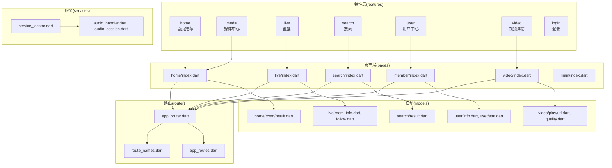
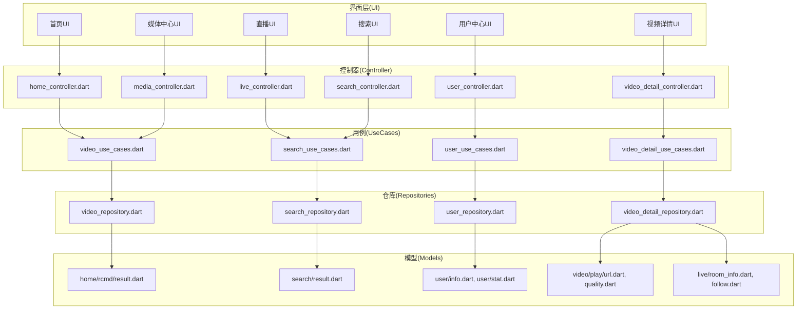
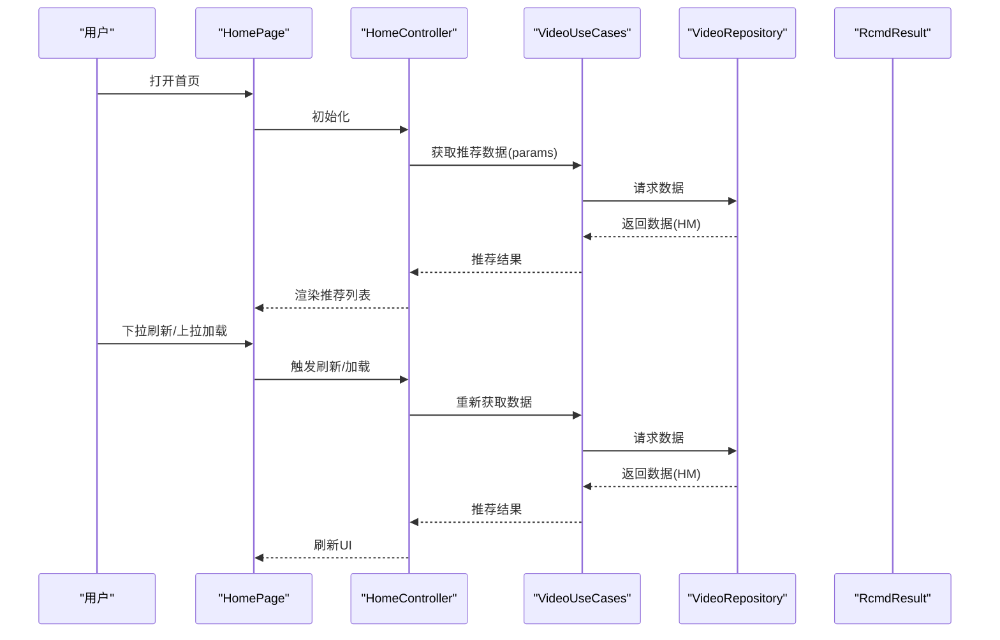
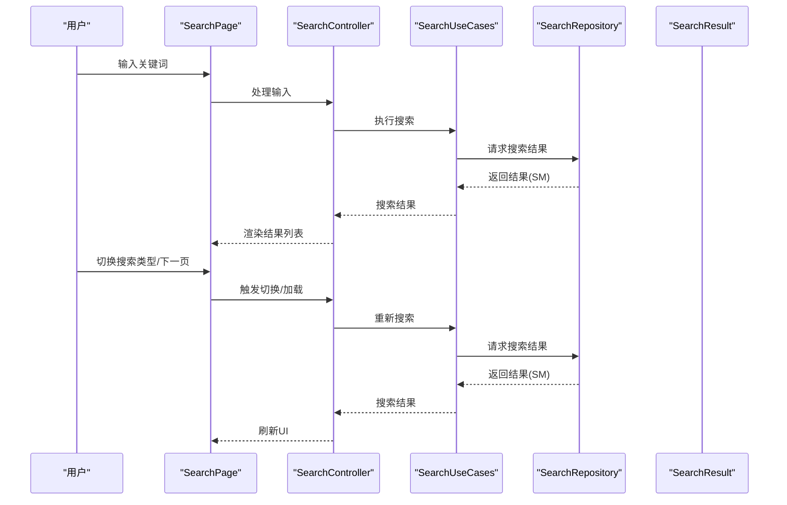
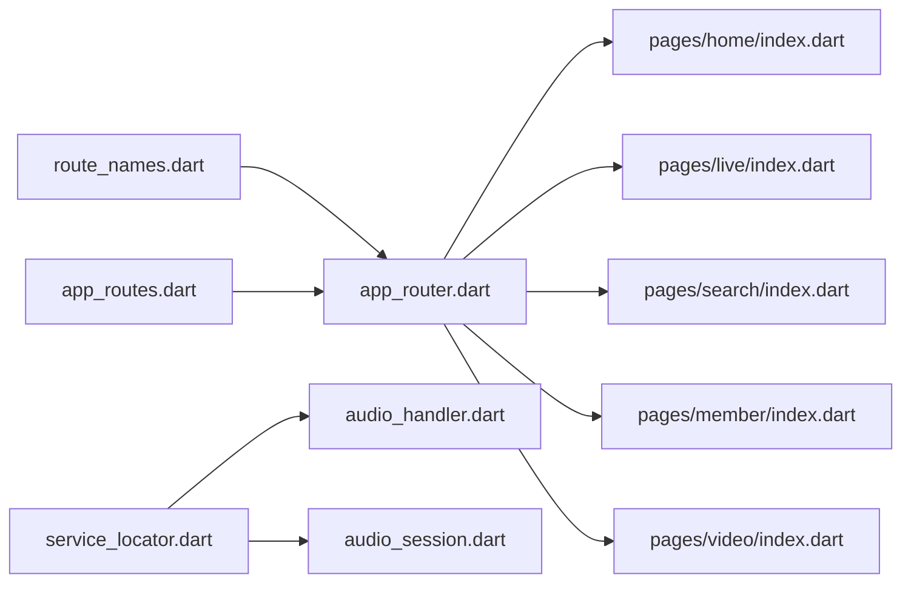

# 功能模块

<cite>
**本文引用的文件**
- [lib/features/home/home.dart](file://lib/features/home/home.dart)
- [lib/features/home/presentation/home_page.dart](file://lib/features/home/presentation/home_page.dart)
- [lib/features/home/presentation/home_controller.dart](file://lib/features/home/presentation/home_controller.dart)
- [lib/features/home/presentation/rcmd_page.dart](file://lib/features/home/presentation/rcmd_page.dart)
- [lib/features/home/presentation/hot_page.dart](file://lib/features/home/presentation/hot_page.dart)
- [lib/features/home/data/video_repository.dart](file://lib/features/home/data/video_repository.dart)
- [lib/features/home/domain/video_use_cases.dart](file://lib/features/home/domain/video_use_cases.dart)
- [lib/features/media/media.dart](file://lib/features/media/media.dart)
- [lib/features/media/presentation/media_page.dart](file://lib/features/media/presentation/media_page.dart)
- [lib/features/media/presentation/media_controller.dart](file://lib/features/media/presentation/media_controller.dart)
- [lib/features/media/data/media_repository.dart](file://lib/features/media/data/media_repository.dart)
- [lib/features/media/domain/media_use_cases.dart](file://lib/features/media/domain/media_use_cases.dart)
- [lib/features/live/live.dart](file://lib/features/live/live.dart)
- [lib/features/live/presentation/live_page.dart](file://lib/features/live/presentation/live_page.dart)
- [lib/features/live/presentation/live_controller.dart](file://lib/features/live/presentation/live_controller.dart)
- [lib/features/search/search.dart](file://lib/features/search/search.dart)
- [lib/features/search/presentation/search_page.dart](file://lib/features/search/presentation/search_page.dart)
- [lib/features/search/presentation/search_controller.dart](file://lib/features/search/presentation/search_controller.dart)
- [lib/features/search/data/search_repository.dart](file://lib/features/search/data/search_repository.dart)
- [lib/features/search/domain/search_use_cases.dart](file://lib/features/search/domain/search_use_cases.dart)
- [lib/features/user/user.dart](file://lib/features/user/user.dart)
- [lib/features/user/presentation/user_controller.dart](file://lib/features/user/presentation/user_controller.dart)
- [lib/features/user/presentation/member_page.dart](file://lib/features/user/presentation/member_page.dart)
- [lib/features/user/data/user_repository.dart](file://lib/features/user/data/user_repository.dart)
- [lib/features/user/domain/user_use_cases.dart](file://lib/features/user/domain/user_use_cases.dart)
- [lib/features/video/video.dart](file://lib/features/video/video.dart)
- [lib/features/video/presentation/video_detail_page.dart](file://lib/features/video/presentation/video_detail_page.dart)
- [lib/features/video/presentation/video_detail_controller.dart](file://lib/features/video/presentation/video_detail_controller.dart)
- [lib/features/video/data/video_detail_repository.dart](file://lib/features/video/data/video_detail_repository.dart)
- [lib/features/video/domain/video_detail_use_cases.dart](file://lib/features/video/domain/video_detail_use_cases.dart)
- [lib/features/login/login.dart](file://lib/features/login/login.dart)
- [lib/features/login/presentation/login_page.dart](file://lib/features/login/presentation/login_page.dart)
- [lib/features/login/presentation/login_controller.dart](file://lib/features/login/presentation/login_controller.dart)
- [lib/features/login/data/login_repository.dart](file://lib/features/login/data/login_repository.dart)
- [lib/features/login/domain/login_use_cases.dart](file://lib/features/login/domain/login_use_cases.dart)
- [lib/pages/home/index.dart](file://lib/pages/home/index.dart)
- [lib/pages/home/controller.dart](file://lib/pages/home/controller.dart)
- [lib/pages/home/view.dart](file://lib/pages/home/view.dart)
- [lib/pages/live/index.dart](file://lib/pages/live/index.dart)
- [lib/pages/live/controller.dart](file://lib/pages/live/controller.dart)
- [lib/pages/live/view.dart](file://lib/pages/live/view.dart)
- [lib/pages/search/index.dart](file://lib/pages/search/index.dart)
- [lib/pages/search/controller.dart](file://lib/pages/search/controller.dart)
- [lib/pages/search/view.dart](file://lib/pages/search/view.dart)
- [lib/pages/member/index.dart](file://lib/pages/member/index.dart)
- [lib/pages/member/controller.dart](file://lib/pages/member/controller.dart)
- [lib/pages/member/view.dart](file://lib/pages/member/view.dart)
- [lib/pages/video/index.dart](file://lib/pages/video/index.dart)
- [lib/pages/video/controller.dart](file://lib/pages/video/controller.dart)
- [lib/pages/video/view.dart](file://lib/pages/video/view.dart)
- [lib/pages/main/index.dart](file://lib/pages/main/index.dart)
- [lib/pages/main/controller.dart](file://lib/pages/main/controller.dart)
- [lib/pages/main/view.dart](file://lib/pages/main/view.dart)
- [lib/models/home/rcmd/result.dart](file://lib/models/home/rcmd/result.dart)
- [lib/models/search/result.dart](file://lib/models/search/result.dart)
- [lib/models/user/info.dart](file://lib/models/user/info.dart)
- [lib/models/user/stat.dart](file://lib/models/user/stat.dart)
- [lib/models/video/play/url.dart](file://lib/models/video/play/url.dart)
- [lib/models/video/play/quality.dart](file://lib/models/video/play/quality.dart)
- [lib/models/live/room_info.dart](file://lib/models/live/room_info.dart)
- [lib/models/live/follow.dart](file://lib/models/live/follow.dart)
- [lib/models/common/rcmd_type.dart](file://lib/models/common/rcmd_type.dart)
- [lib/models/common/search_type.dart](file://lib/models/common/search_type.dart)
- [lib/router/route_names.dart](file://lib/router/route_names.dart)
- [lib/router/app_routes.dart](file://lib/router/app_routes.dart)
- [lib/router/app_router.dart](file://lib/router/app_router.dart)
- [lib/services/service_locator.dart](file://lib/services/service_locator.dart)
- [lib/services/audio_handler.dart](file://lib/services/audio_handler.dart)
- [lib/services/audio_session.dart](file://lib/services/audio_session.dart)
- [lib/main.dart](file://lib/main.dart)
</cite>

## 目录
1. [引言](#引言)
2. [项目结构](#项目结构)
3. [核心组件](#核心组件)
4. [架构总览](#架构总览)
5. [详细组件分析](#详细组件分析)
6. [依赖分析](#依赖分析)
7. [性能考虑](#性能考虑)
8. [故障排除指南](#故障排除指南)
9. [结论](#结论)
10. [附录](#附录)

## 引言
本文件面向PiliPala的功能模块，系统化梳理首页推荐、视频播放、直播观看、用户管理、搜索等核心业务模块的职责边界、内部结构、组件关系与数据流转。文档提供模块架构图、组件树图与交互流程图，并说明模块间依赖关系、接口定义与通信机制，同时给出配置选项、扩展点与自定义指南，帮助开发者快速理解与扩展系统。

## 项目结构
PiliPala采用按功能域划分的特性层组织方式：features目录下为各业务域（home、media、live、search、user、video、login），pages目录为页面级路由与视图控制器，models存放领域模型，router负责路由定义，services提供基础设施服务，main.dart为应用入口。

图表来源
- [lib/features/home/home.dart:1-200](file://lib/features/home/home.dart#L1-L200)
- [lib/features/media/media.dart:1-200](file://lib/features/media/media.dart#L1-L200)
- [lib/features/live/live.dart:1-200](file://lib/features/live/live.dart#L1-L200)
- [lib/features/search/search.dart:1-200](file://lib/features/search/search.dart#L1-L200)
- [lib/features/user/user.dart:1-200](file://lib/features/user/user.dart#L1-L200)
- [lib/features/video/video.dart:1-200](file://lib/features/video/video.dart#L1-L200)
- [lib/features/login/login.dart:1-200](file://lib/features/login/login.dart#L1-L200)
- [lib/pages/home/index.dart:1-200](file://lib/pages/home/index.dart#L1-L200)
- [lib/pages/live/index.dart:1-200](file://lib/pages/live/index.dart#L1-L200)
- [lib/pages/search/index.dart:1-200](file://lib/pages/search/index.dart#L1-L200)
- [lib/pages/member/index.dart:1-200](file://lib/pages/member/index.dart#L1-L200)
- [lib/pages/video/index.dart:1-200](file://lib/pages/video/index.dart#L1-L200)
- [lib/router/app_router.dart:1-200](file://lib/router/app_router.dart#L1-L200)
- [lib/router/app_routes.dart:1-200](file://lib/router/app_routes.dart#L1-L200)
- [lib/router/route_names.dart:1-200](file://lib/router/route_names.dart#L1-L200)
- [lib/services/service_locator.dart:1-200](file://lib/services/service_locator.dart#L1-L200)
- [lib/services/audio_handler.dart:1-200](file://lib/services/audio_handler.dart#L1-L200)
- [lib/services/audio_session.dart:1-200](file://lib/services/audio_session.dart#L1-L200)

章节来源
- [lib/main.dart:1-200](file://lib/main.dart#L1-L200)
- [lib/router/app_router.dart:1-200](file://lib/router/app_router.dart#L1-L200)

## 核心组件
- 首页推荐模块：负责推荐流、热门内容聚合与切换展示，包含推荐页与热门页两个子页面，通过仓库与用例协调数据与业务逻辑。
- 媒体中心模块：聚合收藏、历史、稍后再看等媒体数据，提供统一入口与管理能力。
- 直播模块：提供直播列表、房间信息与关注状态管理，支持房间内互动与质量选择。
- 搜索模块：提供搜索输入、热门关键词、搜索结果列表与分页加载。
- 用户模块：提供个人资料、统计数据、关注/粉丝、硬币/点赞等用户维度信息。
- 视频模块：提供视频详情页、播放控制、弹幕、回复区、稍后再看等播放相关能力。
- 登录模块：提供账号登录流程与认证态维护。

章节来源
- [lib/features/home/home.dart:1-200](file://lib/features/home/home.dart#L1-L200)
- [lib/features/media/media.dart:1-200](file://lib/features/media/media.dart#L1-L200)
- [lib/features/live/live.dart:1-200](file://lib/features/live/live.dart#L1-L200)
- [lib/features/search/search.dart:1-200](file://lib/features/search/search.dart#L1-L200)
- [lib/features/user/user.dart:1-200](file://lib/features/user/user.dart#L1-L200)
- [lib/features/video/video.dart:1-200](file://lib/features/video/video.dart#L1-L200)
- [lib/features/login/login.dart:1-200](file://lib/features/login/login.dart#L1-L200)

## 架构总览
整体采用“特性域 + 页面 + 路由 + 服务”的分层架构。特性域封装业务能力，页面负责UI与交互，路由负责导航与参数传递，服务提供跨域基础设施。数据流以仓库Repository为中心，通过用例UseCase编排业务，控制器Controller协调视图与数据。

图表来源
- [lib/features/home/presentation/home_controller.dart:1-200](file://lib/features/home/presentation/home_controller.dart#L1-L200)
- [lib/features/home/domain/video_use_cases.dart:1-200](file://lib/features/home/domain/video_use_cases.dart#L1-L200)
- [lib/features/home/data/video_repository.dart:1-200](file://lib/features/home/data/video_repository.dart#L1-L200)
- [lib/features/search/presentation/search_controller.dart:1-200](file://lib/features/search/presentation/search_controller.dart#L1-L200)
- [lib/features/search/domain/search_use_cases.dart:1-200](file://lib/features/search/domain/search_use_cases.dart#L1-L200)
- [lib/features/search/data/search_repository.dart:1-200](file://lib/features/search/data/search_repository.dart#L1-L200)
- [lib/features/user/presentation/user_controller.dart:1-200](file://lib/features/user/presentation/user_controller.dart#L1-L200)
- [lib/features/user/domain/user_use_cases.dart:1-200](file://lib/features/user/domain/user_use_cases.dart#L1-L200)
- [lib/features/user/data/user_repository.dart:1-200](file://lib/features/user/data/user_repository.dart#L1-L200)
- [lib/features/video/presentation/video_detail_controller.dart:1-200](file://lib/features/video/presentation/video_detail_controller.dart#L1-L200)
- [lib/features/video/domain/video_detail_use_cases.dart:1-200](file://lib/features/video/domain/video_detail_use_cases.dart#L1-L200)
- [lib/features/video/data/video_detail_repository.dart:1-200](file://lib/features/video/data/video_detail_repository.dart#L1-L200)

## 详细组件分析

### 首页推荐模块
- 职责边界：聚合推荐内容与热门内容，提供滑动切换与卡片式列表展示；处理刷新、加载更多与错误重试。
- 内部结构：页面包含推荐页与热门页；控制器负责生命周期与数据请求；仓库负责网络/缓存访问；用例编排业务规则。
- 数据模型：推荐结果模型承载视频条目字段；推荐类型枚举用于区分不同推荐场景。
- 组件关系：页面依赖控制器，控制器依赖用例，用例依赖仓库，仓库返回模型对象。
- 交互流程：用户进入首页 -> 控制器初始化 -> 请求推荐数据 -> 用例校验参数 -> 仓库获取数据 -> 更新UI -> 支持下拉刷新与上拉加载。

图表来源
- [lib/features/home/presentation/home_page.dart:1-200](file://lib/features/home/presentation/home_page.dart#L1-L200)
- [lib/features/home/presentation/home_controller.dart:1-200](file://lib/features/home/presentation/home_controller.dart#L1-L200)
- [lib/features/home/domain/video_use_cases.dart:1-200](file://lib/features/home/domain/video_use_cases.dart#L1-L200)
- [lib/features/home/data/video_repository.dart:1-200](file://lib/features/home/data/video_repository.dart#L1-L200)
- [lib/models/home/rcmd/result.dart:1-200](file://lib/models/home/rcmd/result.dart#L1-L200)
- [lib/models/common/rcmd_type.dart:1-200](file://lib/models/common/rcmd_type.dart#L1-L200)

章节来源
- [lib/features/home/home.dart:1-200](file://lib/features/home/home.dart#L1-L200)
- [lib/features/home/presentation/rcmd_page.dart:1-200](file://lib/features/home/presentation/rcmd_page.dart#L1-L200)
- [lib/features/home/presentation/hot_page.dart:1-200](file://lib/features/home/presentation/hot_page.dart#L1-L200)
- [lib/features/home/presentation/home_controller.dart:1-200](file://lib/features/home/presentation/home_controller.dart#L1-L200)
- [lib/features/home/domain/video_use_cases.dart:1-200](file://lib/features/home/domain/video_use_cases.dart#L1-L200)
- [lib/features/home/data/video_repository.dart:1-200](file://lib/features/home/data/video_repository.dart#L1-L200)
- [lib/models/home/rcmd/result.dart:1-200](file://lib/models/home/rcmd/result.dart#L1-L200)
- [lib/models/common/rcmd_type.dart:1-200](file://lib/models/common/rcmd_type.dart#L1-L200)

### 媒体中心模块
- 职责边界：统一管理用户的收藏、历史、稍后再看等媒体数据，提供分类查看与批量操作。
- 内部结构：页面包含媒体中心主入口与子分类；控制器负责数据聚合与状态管理；仓库负责数据持久化与远端同步；用例编排查询与更新。
- 数据模型：媒体项模型承载标题、封面、时长、状态等字段。
- 组件关系：页面依赖控制器，控制器依赖用例，用例依赖仓库，仓库返回模型对象。
- 交互流程：用户进入媒体中心 -> 控制器加载分类数据 -> 用例执行查询 -> 仓库返回数据 -> 更新UI -> 支持删除、清空等操作。

章节来源
- [lib/features/media/media.dart:1-200](file://lib/features/media/media.dart#L1-L200)
- [lib/features/media/presentation/media_page.dart:1-200](file://lib/features/media/presentation/media_page.dart#L1-L200)
- [lib/features/media/presentation/media_controller.dart:1-200](file://lib/features/media/presentation/media_controller.dart#L1-L200)
- [lib/features/media/domain/media_use_cases.dart:1-200](file://lib/features/media/domain/media_use_cases.dart#L1-L200)
- [lib/features/media/data/media_repository.dart:1-200](file://lib/features/media/data/media_repository.dart#L1-L200)

### 直播模块
- 职责边界：提供直播列表、房间信息、关注状态与质量选择，支持进入直播间与互动。
- 内部结构：页面包含直播列表与房间页；控制器负责房间状态与播放参数；仓库负责房间信息与关注状态；用例编排关注/取消关注与质量切换。
- 数据模型：房间信息模型包含标题、主播、在线人数、清晰度等；关注模型用于记录关注状态。
- 组件关系：页面依赖控制器，控制器依赖用例，用例依赖仓库，仓库返回模型对象。
- 交互流程：用户进入直播 -> 加载房间列表 -> 点击进入房间 -> 控制器设置播放参数 -> 用例更新关注状态 -> 仓库持久化 -> 更新UI。

章节来源
- [lib/features/live/live.dart:1-200](file://lib/features/live/live.dart#L1-L200)
- [lib/features/live/presentation/live_page.dart:1-200](file://lib/features/live/presentation/live_page.dart#L1-L200)
- [lib/features/live/presentation/live_controller.dart:1-200](file://lib/features/live/presentation/live_controller.dart#L1-L200)
- [lib/models/live/room_info.dart:1-200](file://lib/models/live/room_info.dart#L1-L200)
- [lib/models/live/follow.dart:1-200](file://lib/models/live/follow.dart#L1-L200)

### 搜索模块
- 职责边界：提供搜索输入、热门关键词、搜索结果列表与分页加载，支持多种搜索类型。
- 内部结构：页面包含搜索页与结果页；控制器负责输入处理与分页；仓库负责关键词建议与搜索结果；用例编排搜索策略。
- 数据模型：搜索结果模型承载条目字段；搜索类型枚举用于区分不同搜索域。
- 组件关系：页面依赖控制器，控制器依赖用例，用例依赖仓库，仓库返回模型对象。
- 交互流程：用户输入关键词 -> 控制器触发搜索 -> 用例执行搜索策略 -> 仓库返回结果 -> 更新UI -> 支持切换搜索类型与分页加载。

图表来源
- [lib/features/search/search.dart:1-200](file://lib/features/search/search.dart#L1-L200)
- [lib/features/search/presentation/search_page.dart:1-200](file://lib/features/search/presentation/search_page.dart#L1-L200)
- [lib/features/search/presentation/search_controller.dart:1-200](file://lib/features/search/presentation/search_controller.dart#L1-L200)
- [lib/features/search/domain/search_use_cases.dart:1-200](file://lib/features/search/domain/search_use_cases.dart#L1-L200)
- [lib/features/search/data/search_repository.dart:1-200](file://lib/features/search/data/search_repository.dart#L1-L200)
- [lib/models/search/result.dart:1-200](file://lib/models/search/result.dart#L1-L200)
- [lib/models/common/search_type.dart:1-200](file://lib/models/common/search_type.dart#L1-L200)

章节来源
- [lib/features/search/search.dart:1-200](file://lib/features/search/search.dart#L1-L200)
- [lib/features/search/presentation/search_page.dart:1-200](file://lib/features/search/presentation/search_page.dart#L1-L200)
- [lib/features/search/presentation/search_controller.dart:1-200](file://lib/features/search/presentation/search_controller.dart#L1-L200)
- [lib/features/search/domain/search_use_cases.dart:1-200](file://lib/features/search/domain/search_use_cases.dart#L1-L200)
- [lib/features/search/data/search_repository.dart:1-200](file://lib/features/search/data/search_repository.dart#L1-L200)
- [lib/models/search/result.dart:1-200](file://lib/models/search/result.dart#L1-L200)
- [lib/models/common/search_type.dart:1-200](file://lib/models/common/search_type.dart#L1-L200)

### 用户模块
- 职责边界：提供用户资料、统计数据、关注/粉丝、硬币/点赞等用户维度信息，支持个人主页与设置入口。
- 内部结构：页面包含成员页与统计组件；控制器负责用户信息与状态；仓库负责用户数据与变更；用例编排查询与更新。
- 数据模型：用户信息模型包含基础资料与统计数据；关注/粉丝结果模型承载关系数据。
- 组件关系：页面依赖控制器，控制器依赖用例，用例依赖仓库，仓库返回模型对象。
- 交互流程：用户进入个人主页 -> 控制器加载用户信息 -> 用例查询数据 -> 仓库返回数据 -> 更新UI -> 支持关注/取消关注等操作。

章节来源
- [lib/features/user/user.dart:1-200](file://lib/features/user/user.dart#L1-L200)
- [lib/features/user/presentation/member_page.dart:1-200](file://lib/features/user/presentation/member_page.dart#L1-L200)
- [lib/features/user/presentation/user_controller.dart:1-200](file://lib/features/user/presentation/user_controller.dart#L1-L200)
- [lib/features/user/domain/user_use_cases.dart:1-200](file://lib/features/user/domain/user_use_cases.dart#L1-L200)
- [lib/features/user/data/user_repository.dart:1-200](file://lib/features/user/data/user_repository.dart#L1-L200)
- [lib/models/user/info.dart:1-200](file://lib/models/user/info.dart#L1-L200)
- [lib/models/user/stat.dart:1-200](file://lib/models/user/stat.dart#L1-L200)

### 视频模块
- 职责边界：提供视频详情页、播放控制、弹幕、回复区、稍后再看等播放相关能力。
- 内部结构：页面包含视频详情页与控制组件；控制器负责播放状态与交互；仓库负责播放URL与清晰度；用例编排播放策略。
- 数据模型：播放URL模型承载多清晰度地址；清晰度模型承载清晰度标识与描述。
- 组件关系：页面依赖控制器，控制器依赖用例，用例依赖仓库，仓库返回模型对象。
- 交互流程：用户进入视频详情 -> 控制器初始化播放器 -> 用例获取播放URL -> 仓库返回URL -> 设置播放源 -> 更新UI -> 支持清晰度切换与弹幕发送。

章节来源
- [lib/features/video/video.dart:1-200](file://lib/features/video/video.dart#L1-L200)
- [lib/features/video/presentation/video_detail_page.dart:1-200](file://lib/features/video/presentation/video_detail_page.dart#L1-L200)
- [lib/features/video/presentation/video_detail_controller.dart:1-200](file://lib/features/video/presentation/video_detail_controller.dart#L1-L200)
- [lib/features/video/domain/video_detail_use_cases.dart:1-200](file://lib/features/video/domain/video_detail_use_cases.dart#L1-L200)
- [lib/features/video/data/video_detail_repository.dart:1-200](file://lib/features/video/data/video_detail_repository.dart#L1-L200)
- [lib/models/video/play/url.dart:1-200](file://lib/models/video/play/url.dart#L1-L200)
- [lib/models/video/play/quality.dart:1-200](file://lib/models/video/play/quality.dart#L1-L200)

### 登录模块
- 职责边界：提供账号登录流程与认证态维护，支持第三方登录入口与安全退出。
- 内部结构：页面包含登录页与控制器；控制器负责表单验证与登录请求；仓库负责认证数据；用例编排登录策略。
- 数据模型：登录结果模型承载令牌与用户标识。
- 组件关系：页面依赖控制器，控制器依赖用例，用例依赖仓库。
- 交互流程：用户进入登录页 -> 输入账号密码 -> 控制器验证 -> 用例发起登录 -> 仓库返回结果 -> 更新认证态 -> 跳转首页。

章节来源
- [lib/features/login/login.dart:1-200](file://lib/features/login/login.dart#L1-L200)
- [lib/features/login/presentation/login_page.dart:1-200](file://lib/features/login/presentation/login_page.dart#L1-L200)
- [lib/features/login/presentation/login_controller.dart:1-200](file://lib/features/login/presentation/login_controller.dart#L1-L200)
- [lib/features/login/domain/login_use_cases.dart:1-200](file://lib/features/login/domain/login_use_cases.dart#L1-L200)
- [lib/features/login/data/login_repository.dart:1-200](file://lib/features/login/data/login_repository.dart#L1-L200)

## 依赖分析
- 模块耦合：各特性域相对独立，通过仓库与用例进行松耦合协作；页面仅依赖控制器，控制器仅依赖用例，降低UI对业务细节的耦合。
- 外部依赖：路由层依赖路由名称与路由表；服务层依赖注入容器与音频服务；模型层提供稳定的数据契约。
- 循环依赖：未发现循环依赖迹象；特性域之间通过共享模型与用例接口进行通信。
- 接口契约：仓库接口定义了数据访问方法；用例接口定义了业务编排方法；控制器接口定义了UI交互方法。

图表来源
- [lib/router/route_names.dart:1-200](file://lib/router/route_names.dart#L1-L200)
- [lib/router/app_routes.dart:1-200](file://lib/router/app_routes.dart#L1-L200)
- [lib/router/app_router.dart:1-200](file://lib/router/app_router.dart#L1-L200)
- [lib/services/service_locator.dart:1-200](file://lib/services/service_locator.dart#L1-L200)
- [lib/services/audio_handler.dart:1-200](file://lib/services/audio_handler.dart#L1-L200)
- [lib/services/audio_session.dart:1-200](file://lib/services/audio_session.dart#L1-L200)

章节来源
- [lib/router/app_router.dart:1-200](file://lib/router/app_router.dart#L1-L200)
- [lib/services/service_locator.dart:1-200](file://lib/services/service_locator.dart#L1-L200)

## 性能考虑
- 数据缓存：仓库应优先使用本地缓存减少网络请求，结合过期策略与一致性校验。
- 分页加载：搜索与推荐应采用分页加载，避免一次性加载大量数据导致内存压力。
- 播放优化：视频播放应根据网络状况动态切换清晰度，支持预加载与断点续播。
- UI渲染：列表渲染应使用虚拟列表或惰性加载，减少不必要的重建。
- 并发控制：并发请求应限制最大并发数，避免资源争用与抖动。

## 故障排除指南
- 网络异常：在仓库层捕获网络错误，提供重试与降级策略；在控制器层向用户反馈错误并提供重试按钮。
- 认证失效：在登录用例中检测认证状态，自动跳转登录页并清理本地存储。
- 播放失败：在视频控制器中捕获播放异常，回退到较低清晰度或提示用户检查网络。
- 数据不一致：在用例层增加幂等校验与冲突解决策略，确保数据一致性。

## 结论
PiliPala通过特性域分层与清晰的职责划分，实现了高内聚、低耦合的功能模块。推荐、媒体、直播、搜索、用户、视频与登录七大模块协同工作，配合路由与服务层，形成可扩展、可维护的体系结构。建议在新增模块时遵循现有分层与接口契约，确保一致性与可测试性。

## 附录
- 配置选项：可在路由层配置页面参数与导航行为；在服务层配置音频会话与后台播放策略。
- 扩展点：仓库接口可替换实现（如Mock/远程）；用例可组合新策略；控制器可扩展交互行为。
- 自定义指南：新增页面时，先在路由层注册，再在特性域中实现控制器与用例，最后在页面中绑定UI；模型变更需保持向后兼容或提供迁移脚本。