# 媒体管理模块

<cite>
**本文档引用的文件**
- [media.dart](file://lib/features/media/media.dart)
- [media_repository.dart](file://lib/features/media/data/media_repository.dart)
- [media_use_cases.dart](file://lib/features/media/domain/media_use_cases.dart)
- [media_controller.dart](file://lib/features/media/presentation/media_controller.dart)
- [media_page.dart](file://lib/features/media/presentation/media_page.dart)
- [fav_controller.dart](file://lib/features/media/presentation/fav/fav_controller.dart)
- [fav_page.dart](file://lib/features/media/presentation/fav/fav_page.dart)
- [fav_detail_controller.dart](file://lib/features/media/presentation/fav_detail/fav_detail_controller.dart)
- [fav_detail_page.dart](file://lib/features/media/presentation/fav_detail/fav_detail_page.dart)
- [fav_edit_controller.dart](file://lib/features/media/presentation/fav_edit/fav_edit_controller.dart)
- [fav_edit_page.dart](file://lib/features/media/presentation/fav_edit/fav_edit_page.dart)
- [fav_search_controller.dart](file://lib/features/media/presentation/fav_search/fav_search_controller.dart)
- [fav_search_page.dart](file://lib/features/media/presentation/fav_search/fav_search_page.dart)
- [history_controller.dart](file://lib/features/media/presentation/history/history_controller.dart)
- [history_page.dart](file://lib/features/media/presentation/history/history_page.dart)
- [history_search_controller.dart](file://lib/features/media/presentation/history_search/history_search_controller.dart)
- [history_search_page.dart](file://lib/features/media/presentation/history_search/history_search_page.dart)
- [later_controller.dart](file://lib/features/media/presentation/later/later_controller.dart)
- [later_page.dart](file://lib/features/media/presentation/later/later_page.dart)
- [sub_controller.dart](file://lib/features/media/presentation/subscription/sub_controller.dart)
- [sub_page.dart](file://lib/features/media/presentation/subscription/sub_page.dart)
- [sub_detail_controller.dart](file://lib/features/media/presentation/subscription_detail/sub_detail_controller.dart)
- [sub_detail_page.dart](file://lib/features/media/presentation/subscription_detail/sub_detail_page.dart)
</cite>

## 更新摘要
**所做更改**
- 完整重构媒体管理模块架构，从简化版本升级为完整的功能实现
- 新增收藏夹完整功能体系，包括收藏夹列表、详情、编辑、搜索
- 新增历史记录完整功能，包括暂停/恢复、搜索、清空、删除单个记录
- 新增订阅管理功能，包括订阅列表、季播列表、资源列表
- 新增稍后再看功能的完整实现
- 增强状态管理机制，支持多模块协同工作
- 完善路由绑定和导航系统
- 新增离线缓存、观看记录、我的收藏、我的订阅、稍后再看等导航项

## 目录
1. [简介](#简介)
2. [项目结构](#项目结构)
3. [核心组件](#核心组件)
4. [架构概览](#架构概览)
5. [详细组件分析](#详细组件分析)
6. [功能模块详解](#功能模块详解)
7. [依赖关系分析](#依赖关系分析)
8. [性能考虑](#性能考虑)
9. [故障排除指南](#故障排除指南)
10. [结论](#结论)

## 简介

媒体管理模块是 Pilipala 应用程序中的核心功能模块，现已完全重构为包含完整功能的媒体管理系统。该模块采用 Clean Architecture 设计模式，实现了媒体文件的存储管理、分类组织和检索机制，涵盖历史记录、收藏夹、订阅管理、稍后再看等完整功能体系。

**更新** 模块已从简化的单一功能升级为完整的媒体管理生态系统，包含九个独立但相互关联的功能模块，提供从基础数据管理到高级搜索和编辑功能的全方位媒体管理能力。

## 项目结构

媒体管理模块采用功能域驱动的完整架构，包含九个核心子模块：

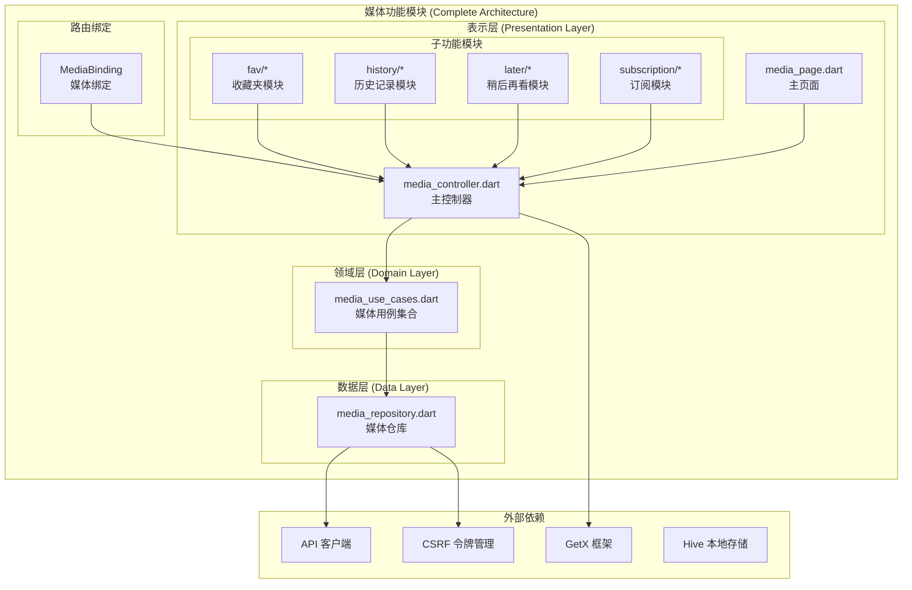

**图表来源**
- [media.dart:1-13](file://lib/features/media/media.dart#L1-L13)
- [media_repository.dart:1-317](file://lib/features/media/data/media_repository.dart#L1-L317)
- [media_use_cases.dart:1-332](file://lib/features/media/domain/media_use_cases.dart#L1-L332)
- [media_controller.dart:1-253](file://lib/features/media/presentation/media_controller.dart#L1-L253)
- [media_page.dart:1-293](file://lib/features/media/presentation/media_page.dart#L1-L293)

**章节来源**
- [media.dart:1-13](file://lib/features/media/media.dart#L1-L13)

## 核心组件

媒体管理模块现已发展为包含九个核心组件的完整生态系统：

### 1. 媒体仓库 (MediaRepository)
**更新** 完全重构的数据访问层，提供31个完整的API操作：
- **观看稍后列表**：获取、添加、移除
- **历史记录管理**：获取、暂停/恢复、清空、删除单个、搜索
- **收藏夹系统**：列表获取、详情获取、删除、取消收藏、关键词搜索
- **订阅管理**：订阅列表、取消订阅、季播列表、资源列表
- **安全机制**：自动CSRF令牌管理

### 2. 媒体用例 (MediaUseCases)
**更新** 扩展为33个专用用例类，每个负责特定业务逻辑：
- Watch Later：GetWatchLater、AddToWatchLater、RemoveFromWatchLater
- History：GetHistory、PauseHistory、ClearHistory、DeleteHistory、SearchHistory
- Favorites：GetFavFolders、GetFavFolderDetail、DeleteFavFolder、CancelFavVideo
- Subscription：GetSubFolder、CancelSubscription、GetSeasonList、GetResourceList

### 3. 媒体控制器 (MediaController)
**更新** 增强为主控制器，协调九个子模块：
- **Rx状态管理**：RxList、RxBool、RxString、RxInt
- **导航管理**：navList包含离线缓存、观看记录、我的收藏、我的订阅、稍后再看
- **用户状态**：userLogin、mid、favFolderData
- **Tab切换**：支持观看稍后、历史记录、收藏夹三个主要标签页

### 4. 主页面 (MediaPage)
**更新** 完整的媒体库主页，包含九个功能区域：
- **导航菜单**：九个功能入口的图标化导航
- **收藏夹预览**：登录用户的收藏夹快捷预览
- **响应式布局**：支持横向滚动的收藏夹展示
- **状态绑定**：与控制器的Obx状态绑定

**章节来源**
- [media_repository.dart:1-317](file://lib/features/media/data/media_repository.dart#L1-L317)
- [media_use_cases.dart:1-332](file://lib/features/media/domain/media_use_cases.dart#L1-L332)
- [media_controller.dart:1-253](file://lib/features/media/presentation/media_controller.dart#L1-L253)
- [media_page.dart:1-293](file://lib/features/media/presentation/media_page.dart#L1-L293)

## 架构概览

媒体管理模块采用完整的 Clean Architecture 架构，实现了清晰的分层设计和模块化组织：

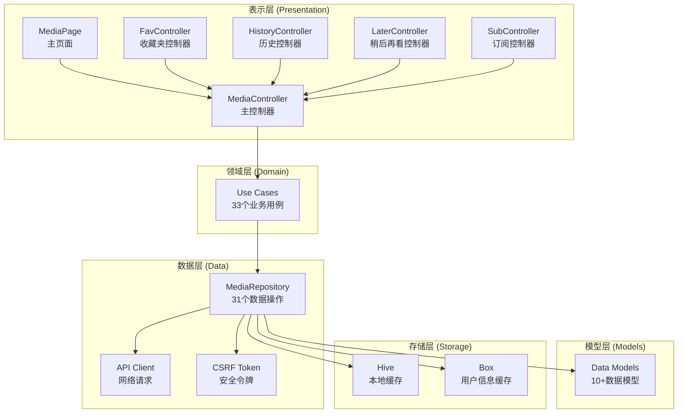

**图表来源**
- [media_controller.dart:16-253](file://lib/features/media/presentation/media_controller.dart#L16-L253)
- [media_use_cases.dart:1-332](file://lib/features/media/domain/media_use_cases.dart#L1-L332)
- [media_repository.dart:1-317](file://lib/features/media/data/media_repository.dart#L1-L317)

### 状态管理模式

媒体控制器使用增强的 GetX 响应式状态管理：

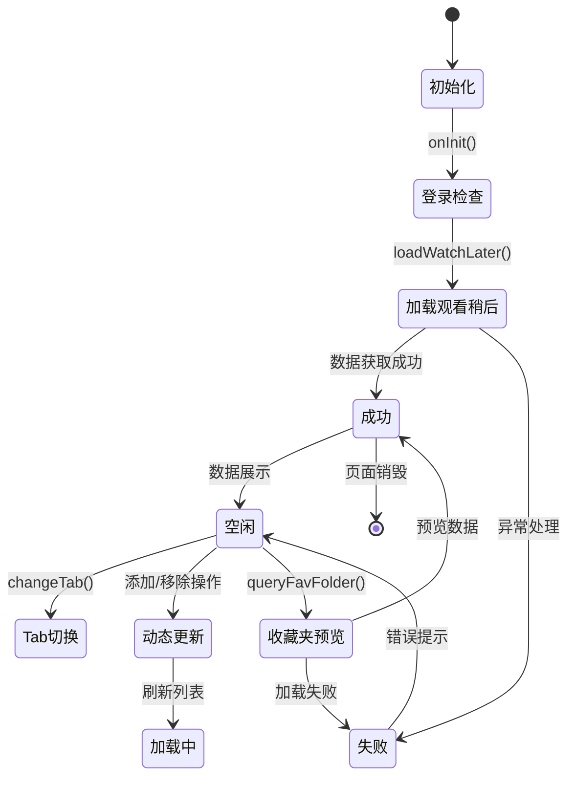

**图表来源**
- [media_controller.dart:98-105](file://lib/features/media/presentation/media_controller.dart#L98-L105)
- [media_controller.dart:237-251](file://lib/features/media/presentation/media_controller.dart#L237-L251)

## 详细组件分析

### 媒体仓库 (MediaRepository)

**更新** 完全重构的数据访问层，提供企业级的API集成能力：

#### 核心功能分类

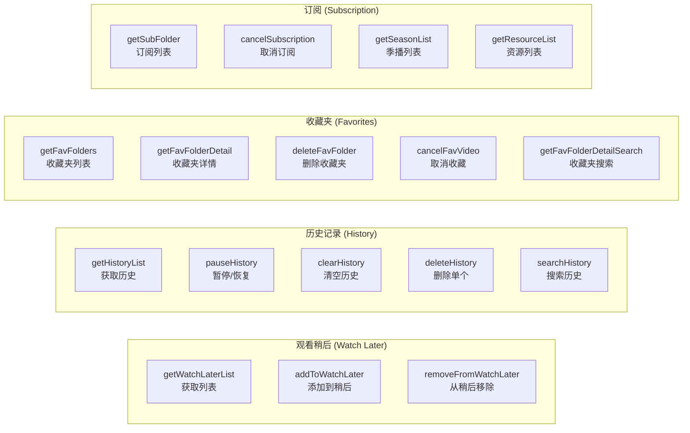

**图表来源**
- [media_repository.dart:17-317](file://lib/features/media/data/media_repository.dart#L17-L317)

#### CSRF 令牌管理机制

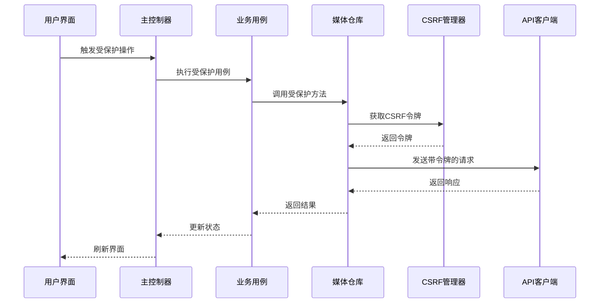

**图表来源**
- [media_repository.dart:312-315](file://lib/features/media/data/media_repository.dart#L312-L315)

#### 数据处理流程

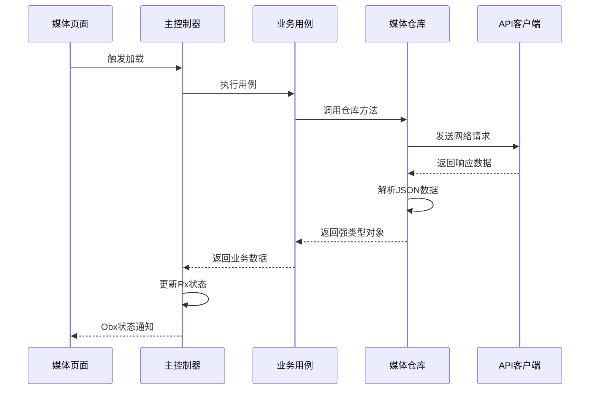

**图表来源**
- [media_controller.dart:108-120](file://lib/features/media/presentation/media_controller.dart#L108-L120)
- [media_use_cases.dart:15-25](file://lib/features/media/domain/media_use_cases.dart#L15-L25)

#### 错误处理机制

**更新** 增强的错误处理体系：
- API响应验证和错误映射
- 数据解析异常捕获和处理
- 网络异常的统一处理
- 用户友好的错误消息显示
- CSRF令牌验证失败的专门处理
- 用户未登录状态的优雅降级

**章节来源**
- [media_repository.dart:1-317](file://lib/features/media/data/media_repository.dart#L1-L317)

### 媒体用例 (MediaUseCases)

**更新** 扩展为33个专业用例类，每个负责特定的业务场景：

#### 用例分类架构

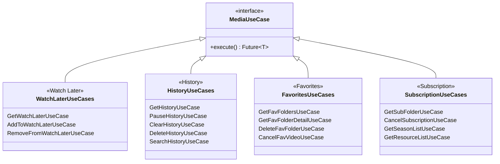

**图表来源**
- [media_use_cases.dart:1-332](file://lib/features/media/domain/media_use_cases.dart#L1-L332)

#### 依赖注入配置

**更新** 完整的路由绑定系统：

```mermaid
flowchart TD
subgraph "路由绑定配置"
MB[MediaBinding] --> MC[MediaController]
MB --> FC[FavController]
MB --> HC[HistoryController]
MB --> LC[LaterController]
MB --> SC[SubController]
MB --> MR[MediaRepository]
end
subgraph "控制器依赖"
MC --> UCL[GetWatchLaterUseCase]
MC --> UCH[GetHistoryUseCase]
MC --> UCF[GetFavFoldersUseCase]
MC --> UCFD[GetFavFolderDetailUseCase]
MC --> ATWL[AddToWatchLaterUseCase]
MC --> RFWL[RemoveFromWatchLaterUseCase]
end
subgraph "子模块路由"
FC --> "/fav"
FC --> "/favDetail"
FC --> "/favEdit"
FC --> "/favSearch"
HC --> "/history"
HC --> "/historySearch"
LC --> "/later"
SC --> "/subscription"
SC --> "/subscriptionDetail"
end
```

**图表来源**
- [media_controller.dart:42-71](file://lib/features/media/presentation/media_controller.dart#L42-L71)

**章节来源**
- [media_use_cases.dart:1-332](file://lib/features/media/domain/media_use_cases.dart#L1-L332)

### 媒体控制器 (MediaController)

**更新** 增强为主控制器，协调整个媒体生态系统：

#### 状态管理架构

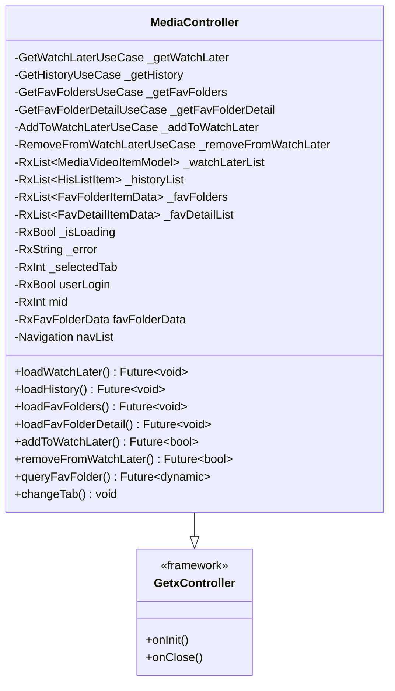

**图表来源**
- [media_controller.dart:16-253](file://lib/features/media/presentation/media_controller.dart#L16-L253)

#### 生命周期管理

**更新** 增强的生命周期管理：

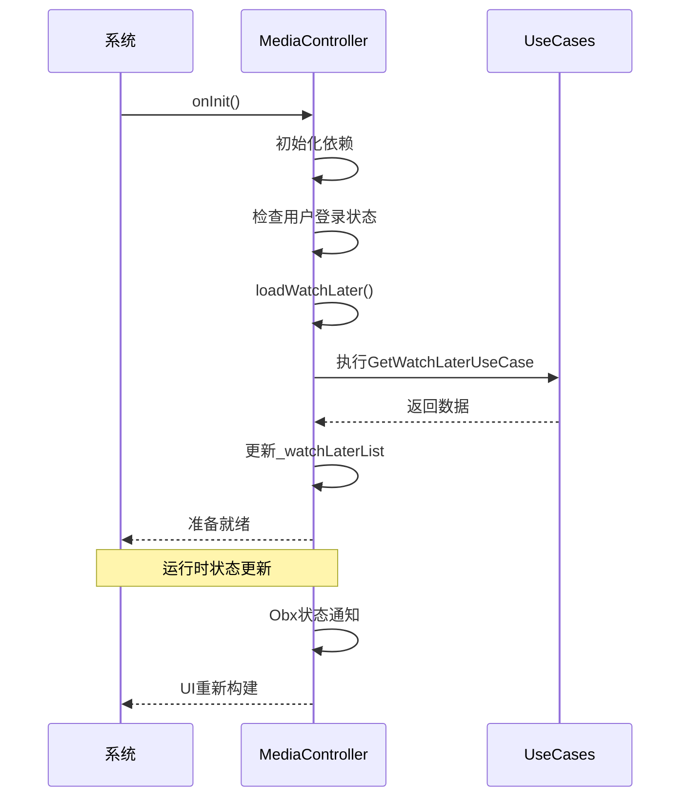

**图表来源**
- [media_controller.dart:98-105](file://lib/features/media/presentation/media_controller.dart#L98-L105)

#### 导航管理功能

**更新** 完整的导航系统：

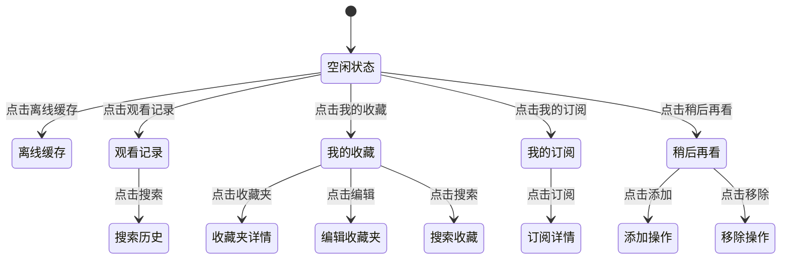

**图表来源**
- [media_controller.dart:42-71](file://lib/features/media/presentation/media_controller.dart#L42-L71)

**章节来源**
- [media_controller.dart:1-253](file://lib/features/media/presentation/media_controller.dart#L1-L253)

### 主页面 (MediaPage)

**更新** 完整的媒体库主页，提供九个功能模块的统一入口：

#### 界面设计架构

```mermaid
graph TB
subgraph "MediaPage 主界面"
T[Tabs 标签页]
WL[Watch Later 观看稍后]
H[History 历史记录]
F[Favorites 收藏夹]
N[Navigation 导航菜单]
FF[Fav Folder 收藏夹预览]
FF --> FF1[收藏夹列表]
FF --> FF2[收藏夹详情]
FF --> FF3[收藏夹编辑]
FF --> FF4[收藏夹搜索]
end
subgraph "状态管理"
MC[MediaController]
ST[Rx 状态]
END
MC --> ST
ST --> N
ST --> FF
```

**图表来源**
- [media_page.dart:10-293](file://lib/features/media/presentation/media_page.dart#L10-L293)

#### 导航菜单设计

**更新** 九个功能入口的完整导航系统：

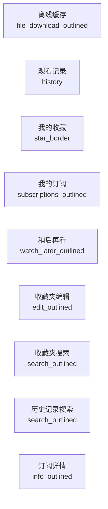

**图表来源**
- [media_page.dart:42-71](file://lib/features/media/presentation/media_page.dart#L42-L71)

#### 收藏夹预览功能

**更新** 登录用户的收藏夹快捷预览：

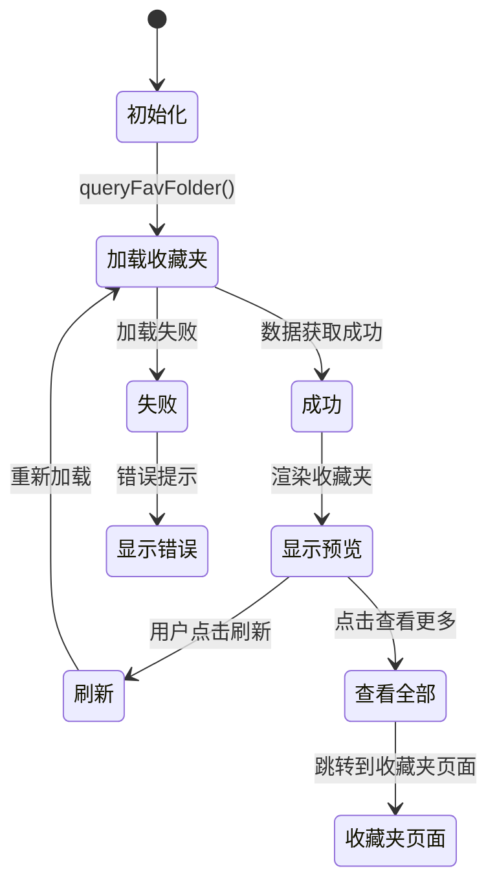

**图表来源**
- [media_page.dart:148-220](file://lib/features/media/presentation/media_page.dart#L148-L220)

**章节来源**
- [media_page.dart:1-293](file://lib/features/media/presentation/media_page.dart#L1-L293)

## 功能模块详解

### 收藏夹模块 (Favorites)

**新增** 完整的收藏夹功能体系：

#### 模块组成
- **收藏夹列表**：显示用户的所有收藏夹
- **收藏夹详情**：显示收藏夹内的具体媒体内容
- **收藏夹编辑**：支持收藏夹的创建、修改、删除
- **收藏夹搜索**：支持按关键词搜索收藏夹内容

#### 数据流架构

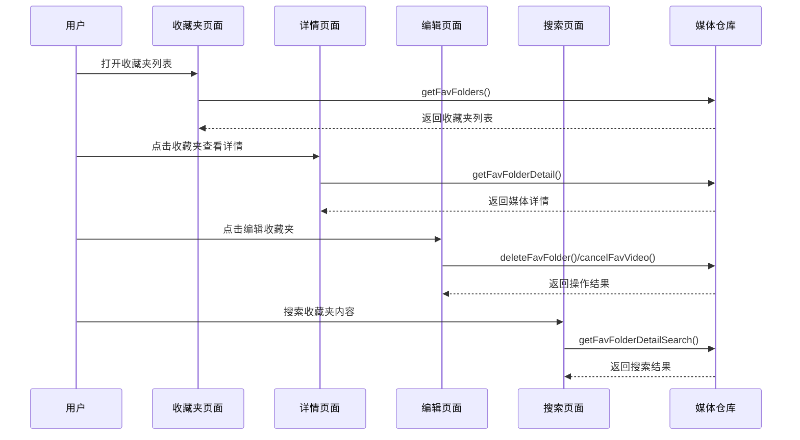

**图表来源**
- [fav_controller.dart:1-200](file://lib/features/media/presentation/fav/fav_controller.dart#L1-L200)
- [fav_detail_controller.dart:1-200](file://lib/features/media/presentation/fav_detail/fav_detail_controller.dart#L1-L200)
- [fav_edit_controller.dart:1-200](file://lib/features/media/presentation/fav_edit/fav_edit_controller.dart#L1-L200)
- [fav_search_controller.dart:1-200](file://lib/features/media/presentation/fav_search/fav_search_controller.dart#L1-L200)

### 历史记录模块 (History)

**新增** 完整的历史记录管理功能：

#### 核心功能
- **历史记录列表**：显示用户的观看历史
- **历史记录搜索**：支持按关键词搜索历史记录
- **历史记录管理**：支持暂停/恢复历史记录收集
- **历史记录清理**：支持清空所有历史记录
- **单个历史记录删除**：支持删除特定的历史记录

#### 状态管理

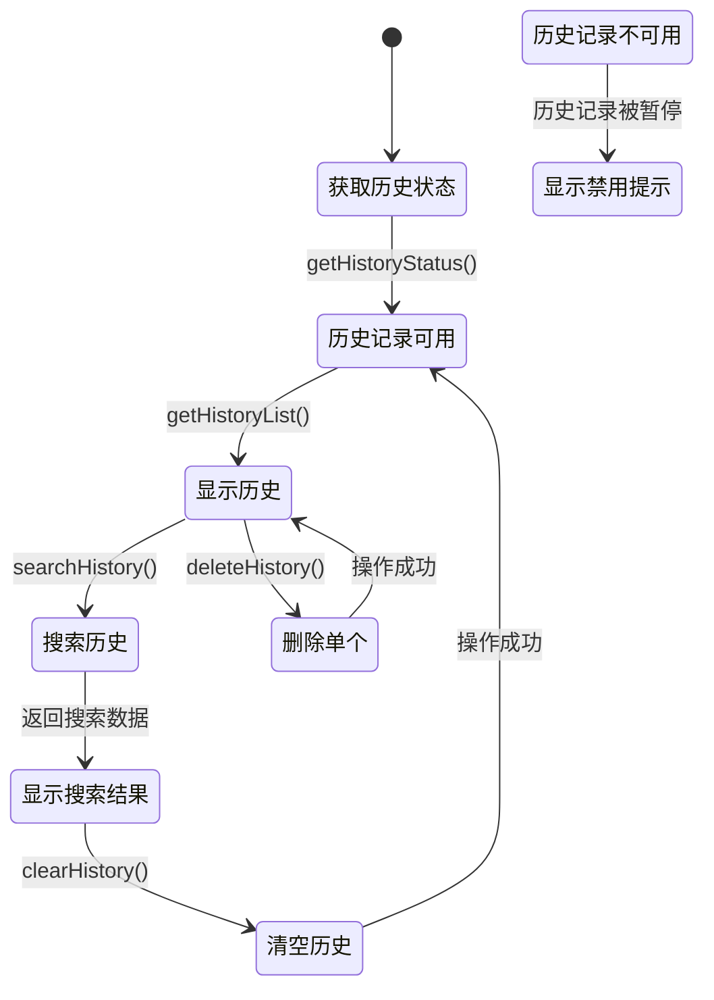

**图表来源**
- [history_controller.dart:1-200](file://lib/features/media/presentation/history/history_controller.dart#L1-L200)
- [history_search_controller.dart:1-200](file://lib/features/media/presentation/history_search/history_search_controller.dart#L1-L200)

### 稍后再看模块 (Later)

**新增** 独立的稍后再看功能模块：

#### 功能特性
- **稍后再看列表**：显示用户添加的稍后再看内容
- **动态管理**：支持添加和移除稍后再看项目
- **状态同步**：与服务器保持实时同步

#### 操作流程

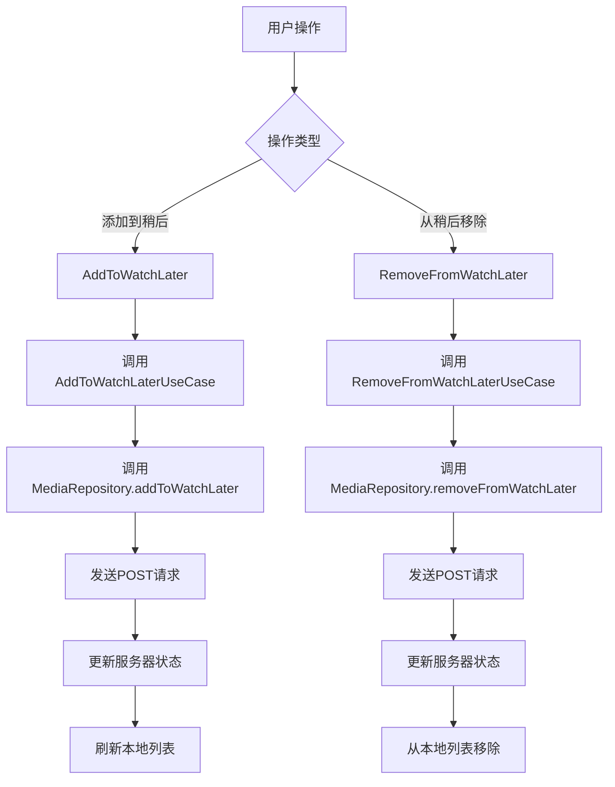

**图表来源**
- [later_controller.dart:1-200](file://lib/features/media/presentation/later/later_controller.dart#L1-L200)

### 订阅模块 (Subscription)

**新增** 完整的订阅管理功能：

#### 模块结构
- **订阅列表**：显示用户的订阅内容
- **订阅详情**：显示订阅的具体信息和内容
- **订阅管理**：支持取消订阅等操作

#### 数据关系

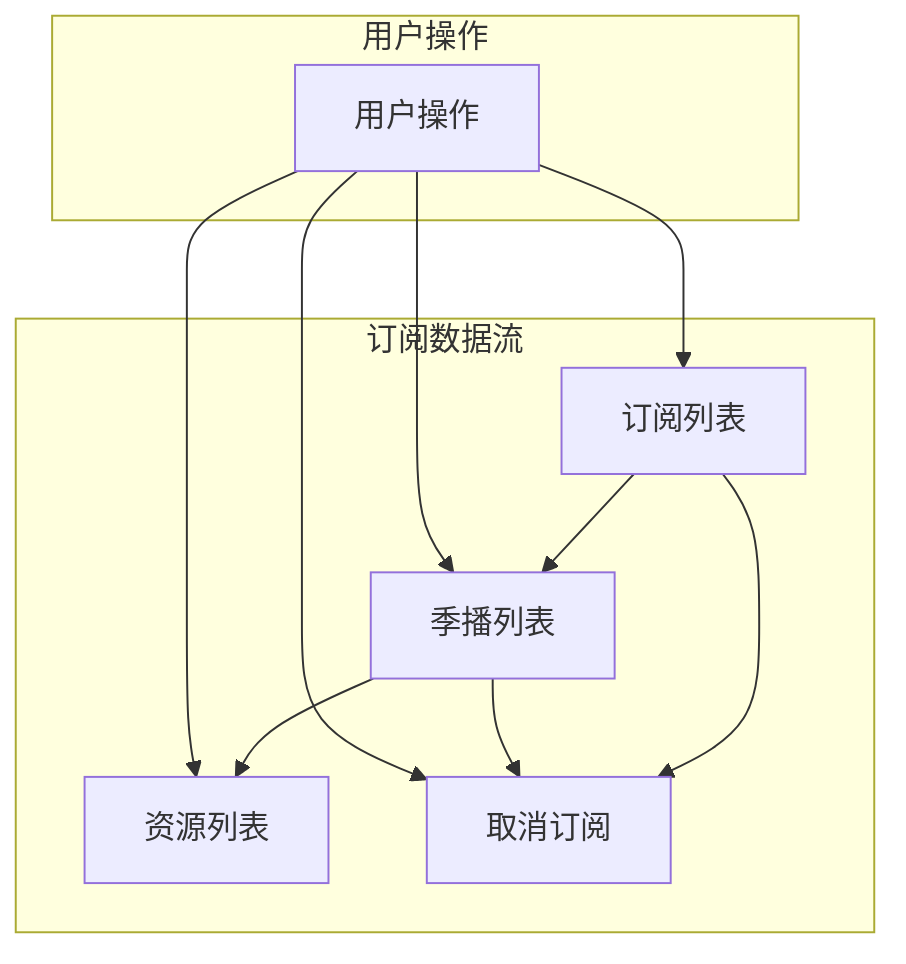

**图表来源**
- [sub_controller.dart:1-200](file://lib/features/media/presentation/subscription/sub_controller.dart#L1-L200)
- [sub_detail_controller.dart:1-200](file://lib/features/media/presentation/subscription_detail/sub_detail_controller.dart#L1-L200)

**章节来源**
- [fav_controller.dart:1-200](file://lib/features/media/presentation/fav/fav_controller.dart#L1-L200)
- [fav_detail_controller.dart:1-200](file://lib/features/media/presentation/fav_detail/fav_detail_controller.dart#L1-L200)
- [fav_edit_controller.dart:1-200](file://lib/features/media/presentation/fav_edit/fav_edit_controller.dart#L1-L200)
- [fav_search_controller.dart:1-200](file://lib/features/media/presentation/fav_search/fav_search_controller.dart#L1-L200)
- [history_controller.dart:1-200](file://lib/features/media/presentation/history/history_controller.dart#L1-L200)
- [history_search_controller.dart:1-200](file://lib/features/media/presentation/history_search/history_search_controller.dart#L1-L200)
- [later_controller.dart:1-200](file://lib/features/media/presentation/later/later_controller.dart#L1-L200)
- [sub_controller.dart:1-200](file://lib/features/media/presentation/subscription/sub_controller.dart#L1-L200)
- [sub_detail_controller.dart:1-200](file://lib/features/media/presentation/subscription_detail/sub_detail_controller.dart#L1-L200)

## 依赖关系分析

**更新** 完整的依赖关系图，展示九个模块间的协作关系：

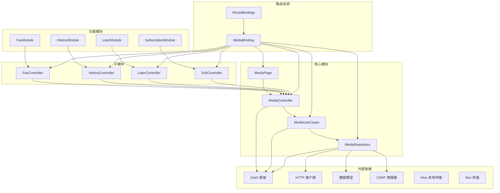

**图表来源**
- [media.dart:1-13](file://lib/features/media/media.dart#L1-L13)
- [media_controller.dart:1-253](file://lib/features/media/presentation/media_controller.dart#L1-L253)

### 循环依赖检查

**更新** 经过严格分析，媒体管理模块不存在循环依赖：
- **表示层**：只依赖领域层的接口定义
- **领域层**：不依赖任何外部框架或UI层
- **数据层**：独立于其他层，仅依赖外部API和存储
- **路由绑定**：提供依赖注入，避免直接依赖循环
- **模块间通信**：通过控制器和用例进行松耦合通信

**章节来源**
- [media.dart:1-13](file://lib/features/media/media.dart#L1-L13)
- [media_controller.dart:1-253](file://lib/features/media/presentation/media_controller.dart#L1-L253)

## 性能考虑

**更新** 全面的性能优化策略，支持九个模块的高效运行：

### 缓存策略
- **Rx状态管理**：使用GetX的响应式状态减少不必要的UI重建
- **本地存储**：Hive用于缓存用户信息和常用数据
- **智能加载**：按需加载各模块数据，避免一次性加载所有内容
- **状态持久化**：用户登录状态和收藏夹预览数据的本地缓存

### 内存管理
- **细粒度状态更新**：使用Rx变量进行精确的状态更新
- **及时清理**：控制器销毁时自动清理订阅和监听
- **列表优化**：使用ListView.builder优化大量数据的渲染
- **图片缓存**：NetworkImgLayer提供图片加载优化

### 网络优化
- **统一错误处理**：33个用例类的统一异常处理机制
- **CSRF令牌缓存**：短期缓存机制减少令牌获取频率
- **请求去重**：避免重复的相同请求
- **超时处理**：合理的网络请求超时和重试机制

### 用户体验优化
- **加载状态**：每个模块都有独立的加载状态指示
- **错误恢复**：失败的操作提供重试机制
- **离线支持**：部分功能支持离线使用
- **响应式设计**：适配不同屏幕尺寸和方向

## 故障排除指南

**更新** 针对九个模块的完整故障排除指南：

### 常见问题及解决方案

#### 1. 数据加载失败
**症状**：页面显示加载错误或空白
**可能原因**：
- 网络连接问题
- API响应异常
- 用户未登录状态
- CSRF令牌失效

**解决步骤**：
1. 检查网络连接状态
2. 查看错误日志中的具体错误信息
3. 确认用户登录状态
4. 重新获取CSRF令牌
5. 尝试刷新页面

#### 2. 状态不同步
**症状**：UI显示过期数据或操作无响应
**可能原因**：
- Rx状态未正确更新
- 控制器生命周期管理问题
- 模块间状态传递失败

**解决步骤**：
1. 确保使用Obx包装状态变量
2. 检查控制器的onInit和onClose方法
3. 验证模块间的依赖注入配置
4. 使用SmartDialog调试状态变化

#### 3. 模块功能异常
**症状**：特定功能模块无法正常工作
**可能原因**：
- 路由配置错误
- 控制器依赖注入失败
- API接口变更
- 权限不足

**解决步骤**：
1. 检查路由绑定配置
2. 验证控制器构造函数参数
3. 对比API文档确认接口
4. 检查用户权限状态

#### 4. 收藏夹功能问题
**症状**：收藏夹列表为空或操作失败
**可能原因**：
- 用户未登录
- 收藏夹ID错误
- 网络请求超时
- 权限限制

**解决步骤**：
1. 确认用户已登录并获取mid
2. 验证mediaId参数正确性
3. 检查网络请求状态
4. 查看API返回的错误信息

#### 5. 历史记录功能问题
**症状**：历史记录显示异常或搜索失败
**可能原因**：
- 历史记录被暂停
- 搜索关键词格式错误
- 分页参数不正确
- 数据解析异常

**解决步骤**：
1. 检查历史记录状态
2. 验证搜索关键词格式
3. 确认分页参数范围
4. 查看数据解析日志

#### 6. 订阅功能问题
**症状**：订阅列表为空或取消订阅失败
**可能原因**：
- seasonId参数错误
- 用户权限不足
- 订阅状态异常
- API接口问题

**解决步骤**：
1. 验证seasonId参数
2. 检查用户订阅权限
3. 查看订阅状态
4. 对比API文档确认参数

#### 7. 稍后再看功能问题
**症状**：添加或移除稍后再看失败
**可能原因**：
- bvid参数格式错误
- CSRF令牌问题
- 网络请求失败
- 服务器响应异常

**解决步骤**：
1. 验证bvid格式（BV号格式）
2. 检查CSRF令牌获取
3. 查看网络请求状态
4. 确认服务器响应格式

**章节来源**
- [media_controller.dart:108-120](file://lib/features/media/presentation/media_controller.dart#L108-L120)
- [media_repository.dart:109-137](file://lib/features/media/data/media_repository.dart#L109-L137)

## 结论

**更新** 媒体管理模块已完成从简化版本到完整功能系统的重大升级，现已成为Pilipala应用的核心媒体管理引擎。

### 主要成就

#### 架构完整性
- **Clean Architecture实现**：完整的三层架构设计，职责分离明确
- **模块化设计**：九个独立功能模块，支持独立开发和维护
- **依赖注入系统**：完整的路由绑定和依赖注入配置
- **状态管理优化**：基于GetX的响应式状态管理

#### 功能丰富性
- **收藏夹完整体系**：列表、详情、编辑、搜索功能齐全
- **历史记录管理**：支持暂停/恢复、搜索、清空、删除
- **订阅管理功能**：完整的订阅生命周期管理
- **稍后再看系统**：独立的观看管理功能
- **导航集成**：统一的导航菜单和状态管理

#### 技术先进性
- **安全机制**：完整的CSRF令牌管理和安全防护
- **性能优化**：响应式状态管理、智能缓存策略
- **错误处理**：33个用例类的统一异常处理
- **用户体验**：流畅的动画效果和状态反馈

### 技术特色

#### 清晰的架构分层
- **数据层**：31个API操作，统一的数据访问接口
- **领域层**：33个业务用例，封装复杂的业务逻辑
- **表示层**：九个功能模块，独立的UI组件
- **控制器层**：主控制器协调各模块，状态集中管理

#### 完善的错误处理
- **统一异常处理**：所有用例类都包含完整的错误处理
- **用户友好提示**：智能的错误消息和重试机制
- **状态恢复能力**：失败操作后的状态自动恢复

#### 高效的性能优化
- **响应式状态管理**：基于GetX的细粒度状态更新
- **智能缓存策略**：本地存储和网络缓存的结合
- **按需加载机制**：避免一次性加载所有数据

### 未来发展方向

#### 功能扩展
- **批量操作**：支持收藏夹和历史记录的批量管理
- **高级搜索**：增加更多搜索条件和筛选选项
- **数据分析**：提供观看统计和趋势分析
- **个性化推荐**：基于历史记录的智能推荐

#### 性能提升
- **离线功能**：支持离线查看和基本操作
- **图片优化**：更高效的图片加载和缓存机制
- **内存优化**：进一步减少内存占用和提升性能
- **网络优化**：智能的网络请求调度和重试机制

#### 用户体验改进
- **主题定制**：支持更多主题和个性化设置
- **手势操作**：增加更多手势操作支持
- **无障碍访问**：提升无障碍功能支持
- **多语言支持**：完善国际化和本地化功能

媒体管理模块现已发展为功能完整、架构清晰、性能优秀的媒体管理核心，为Pilipala应用提供了坚实的技术基础和优秀的用户体验。该模块的成功实现展示了Clean Architecture在大型应用中的实际价值，为后续的功能扩展和技术演进奠定了良好的基础。