# 媒体管理模块

<cite>
**本文档引用的文件**
- [media.dart](file://lib/features/media/media.dart)
- [media_repository.dart](file://lib/features/media/data/media_repository.dart)
- [media_use_cases.dart](file://lib/features/media/domain/media_use_cases.dart)
- [media_controller.dart](file://lib/features/media/presentation/media_controller.dart)
- [media_page.dart](file://lib/features/media/presentation/media_page.dart)
- [bindings.dart](file://lib/router/bindings.dart)
- [search.dart](file://lib/http/search.dart)
- [search_use_cases.dart](file://lib/features/search/domain/search_use_cases.dart)
</cite>

## 目录
1. [简介](#简介)
2. [项目结构](#项目结构)
3. [核心组件](#核心组件)
4. [架构概览](#架构概览)
5. [详细组件分析](#详细组件分析)
6. [依赖关系分析](#依赖关系分析)
7. [性能考虑](#性能考虑)
8. [故障排除指南](#故障排除指南)
9. [结论](#结论)

## 简介

媒体管理模块是 Pilipala 应用程序中的一个核心功能模块，负责管理用户的媒体内容，包括观看稍后列表、观看历史、收藏夹等功能。该模块采用 Clean Architecture 设计模式，分为数据层、领域层和表示层三个层次，实现了良好的关注点分离和可测试性。

该模块主要处理以下核心功能：
- 媒体文件的存储管理和分类组织
- 媒体内容的检索和搜索机制
- 用户媒体库的状态管理
- 数据同步和缓存策略
- 媒体文件的上传流程和格式处理
- 媒体库的界面设计和交互体验

## 项目结构

媒体管理模块遵循标准的 Flutter 项目结构，采用功能域驱动的组织方式：

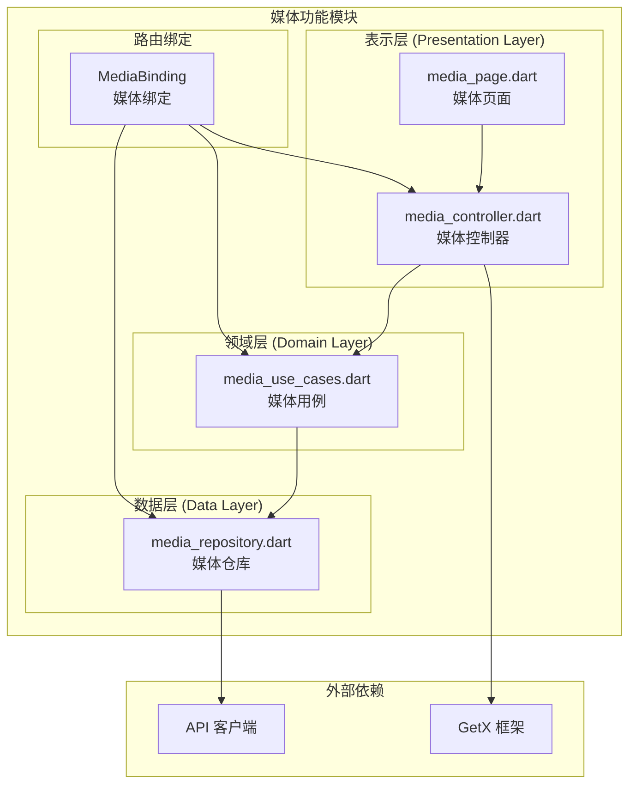

**图表来源**
- [media.dart:1-11](file://lib/features/media/media.dart#L1-L11)
- [media_repository.dart:1-120](file://lib/features/media/data/media_repository.dart#L1-L120)
- [media_use_cases.dart:1-120](file://lib/features/media/domain/media_use_cases.dart#L1-L120)
- [media_controller.dart:1-150](file://lib/features/media/presentation/media_controller.dart#L1-L150)
- [media_page.dart:1-100](file://lib/features/media/presentation/media_page.dart#L1-L100)

**章节来源**
- [media.dart:1-11](file://lib/features/media/media.dart#L1-L11)

## 核心组件

媒体管理模块由四个核心组件构成，每个组件都有明确的职责分工：

### 1. 媒体仓库 (MediaRepository)
负责与后端 API 进行通信，处理媒体数据的获取和存储逻辑。实现包括：
- 获取观看稍后列表
- 获取观看历史
- 获取收藏夹列表
- 获取收藏夹详情

### 2. 媒体用例 (MediaUseCases)
实现具体的业务逻辑，封装数据访问的复杂性：
- GetWatchLaterUseCase：获取观看稍后列表
- GetHistoryUseCase：获取观看历史
- GetFavFoldersUseCase：获取收藏夹列表
- GetFavFolderDetailUseCase：获取收藏夹详情

### 3. 媒体控制器 (MediaController)
使用 GetX 状态管理框架，管理媒体相关的状态：
- RxList：管理各种媒体列表的状态
- RxBool：管理加载状态
- RxString：管理错误信息
- Tab 切换状态管理

### 4. 媒体页面 (MediaPage)
提供用户界面，展示媒体库的内容：
- 标签页切换（观看稍后、历史记录、收藏夹）
- 加载状态显示
- 错误处理和重试机制

**章节来源**
- [media_repository.dart:1-120](file://lib/features/media/data/media_repository.dart#L1-L120)
- [media_use_cases.dart:1-120](file://lib/features/media/domain/media_use_cases.dart#L1-L120)
- [media_controller.dart:1-150](file://lib/features/media/presentation/media_controller.dart#L1-L150)
- [media_page.dart:1-100](file://lib/features/media/presentation/media_page.dart#L1-L100)

## 架构概览

媒体管理模块采用 Clean Architecture 设计模式，实现了清晰的分层架构：

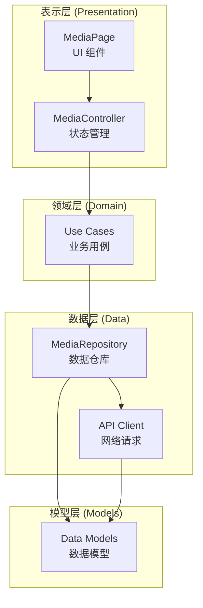

**图表来源**
- [media_controller.dart:12-47](file://lib/features/media/presentation/media_controller.dart#L12-L47)
- [media_use_cases.dart:46-98](file://lib/features/media/domain/media_use_cases.dart#L46-L98)
- [media_repository.dart:47-96](file://lib/features/media/data/media_repository.dart#L47-L96)

### 状态管理模式

媒体控制器使用 GetX 的响应式状态管理：

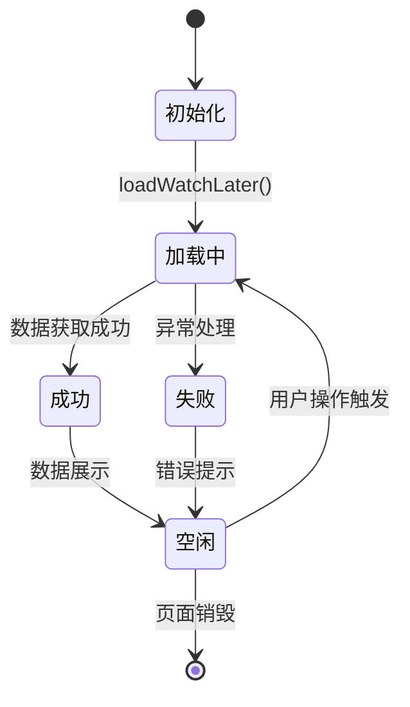

**图表来源**
- [media_controller.dart:55-73](file://lib/features/media/presentation/media_controller.dart#L55-L73)

## 详细组件分析

### 媒体仓库 (MediaRepository)

媒体仓库是数据层的核心组件，负责与后端 API 进行通信：

#### 主要功能
- **观看稍后列表获取**：通过 API 获取用户的观看稍后内容
- **观看历史获取**：获取用户的观看历史记录
- **收藏夹列表获取**：获取用户的收藏夹列表
- **收藏夹详情获取**：获取指定收藏夹的详细内容

#### 数据处理流程

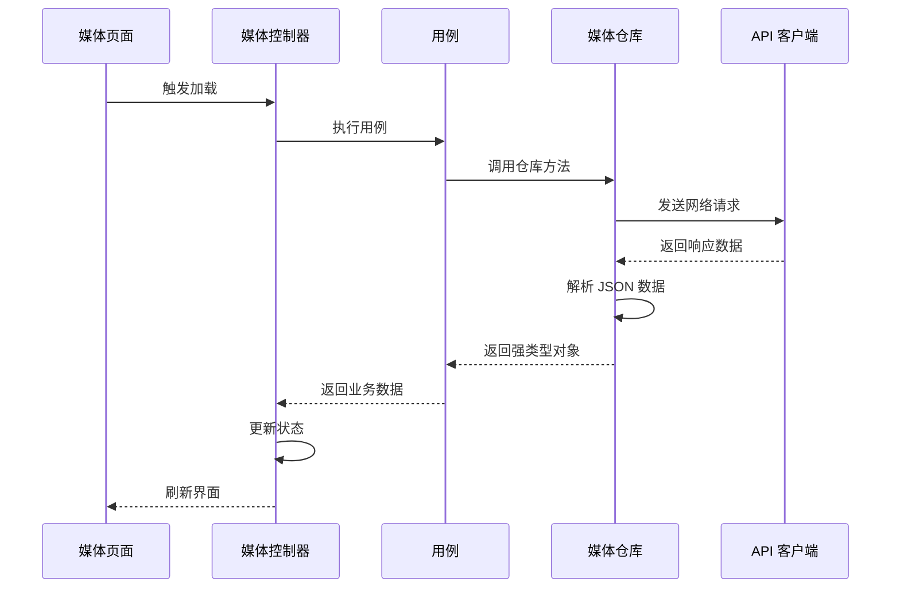

**图表来源**
- [media_controller.dart:55-73](file://lib/features/media/presentation/media_controller.dart#L55-L73)
- [media_use_cases.dart:54-70](file://lib/features/media/domain/media_use_cases.dart#L54-L70)
- [media_repository.dart:47-96](file://lib/features/media/data/media_repository.dart#L47-L96)

#### 错误处理机制

媒体仓库实现了完善的错误处理：
- API 响应验证
- 数据解析错误处理
- 网络异常捕获
- 用户友好的错误消息

**章节来源**
- [media_repository.dart:47-96](file://lib/features/media/data/media_repository.dart#L47-L96)

### 媒体用例 (MediaUseCases)

媒体用例封装了具体的业务逻辑，提供了简洁的接口供控制器调用。

#### 用例设计模式

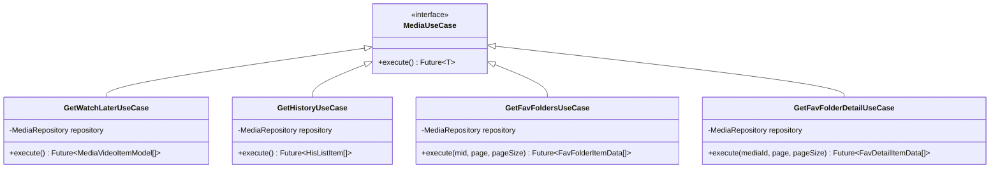

**图表来源**
- [media_use_cases.dart:46-98](file://lib/features/media/domain/media_use_cases.dart#L46-L98)

#### 依赖注入配置

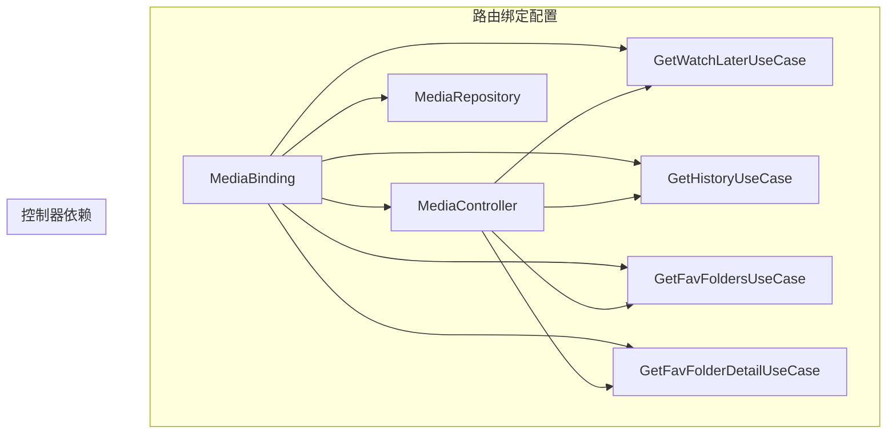

**图表来源**
- [bindings.dart:87-98](file://lib/router/bindings.dart#L87-L98)

**章节来源**
- [media_use_cases.dart:46-98](file://lib/features/media/domain/media_use_cases.dart#L46-L98)
- [bindings.dart:87-98](file://lib/router/bindings.dart#L87-L98)

### 媒体控制器 (MediaController)

媒体控制器使用 GetX 框架实现响应式状态管理，是连接 UI 和业务逻辑的桥梁。

#### 状态管理架构

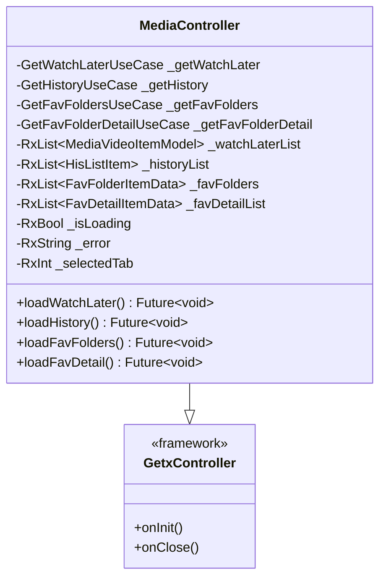

**图表来源**
- [media_controller.dart:12-47](file://lib/features/media/presentation/media_controller.dart#L12-L47)

#### 生命周期管理

媒体控制器实现了完整的生命周期管理：

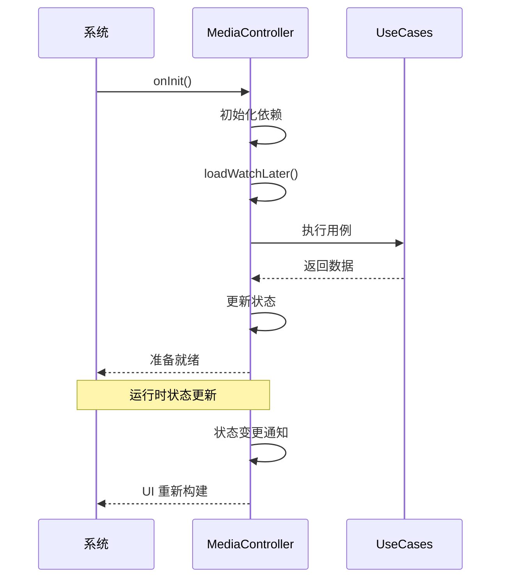

**图表来源**
- [media_controller.dart:49-53](file://lib/features/media/presentation/media_controller.dart#L49-L53)

**章节来源**
- [media_controller.dart:12-150](file://lib/features/media/presentation/media_controller.dart#L12-L150)

### 媒体页面 (MediaPage)

媒体页面提供用户界面，展示媒体库的各种内容，并处理用户交互。

#### 界面设计架构

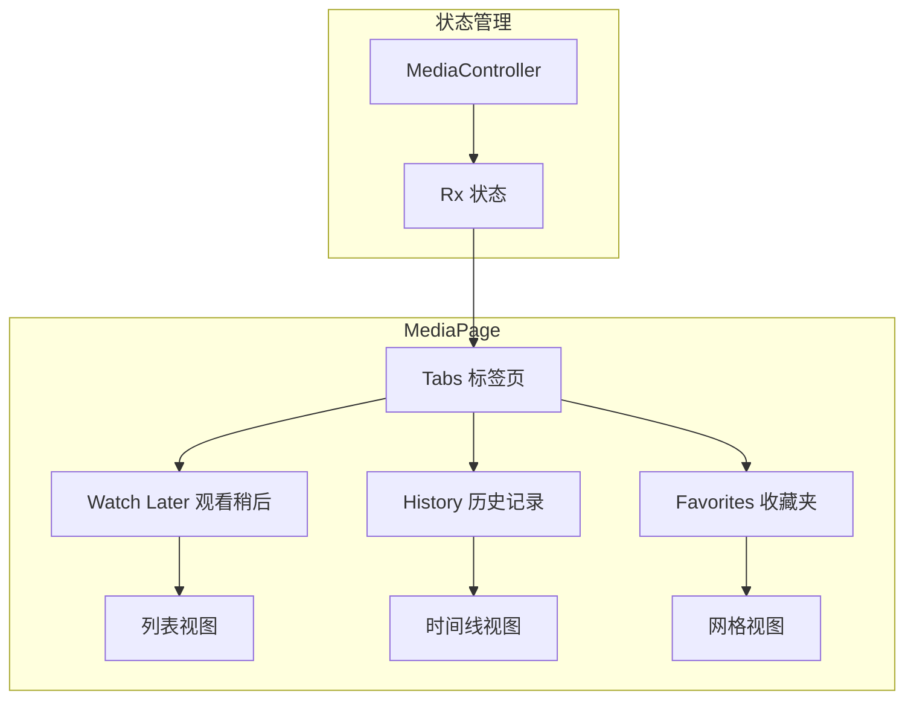

**图表来源**
- [media_page.dart:8-25](file://lib/features/media/presentation/media_page.dart#L8-L25)

#### 加载状态处理

媒体页面实现了智能的加载状态管理：

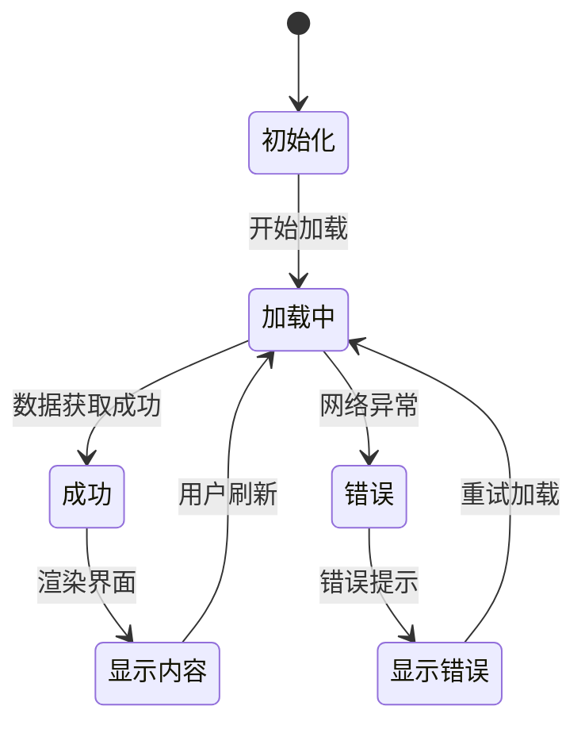

**图表来源**
- [media_page.dart:16-25](file://lib/features/media/presentation/media_page.dart#L16-L25)

**章节来源**
- [media_page.dart:1-100](file://lib/features/media/presentation/media_page.dart#L1-L100)

## 依赖关系分析

媒体管理模块的依赖关系清晰明确，遵循依赖倒置原则：

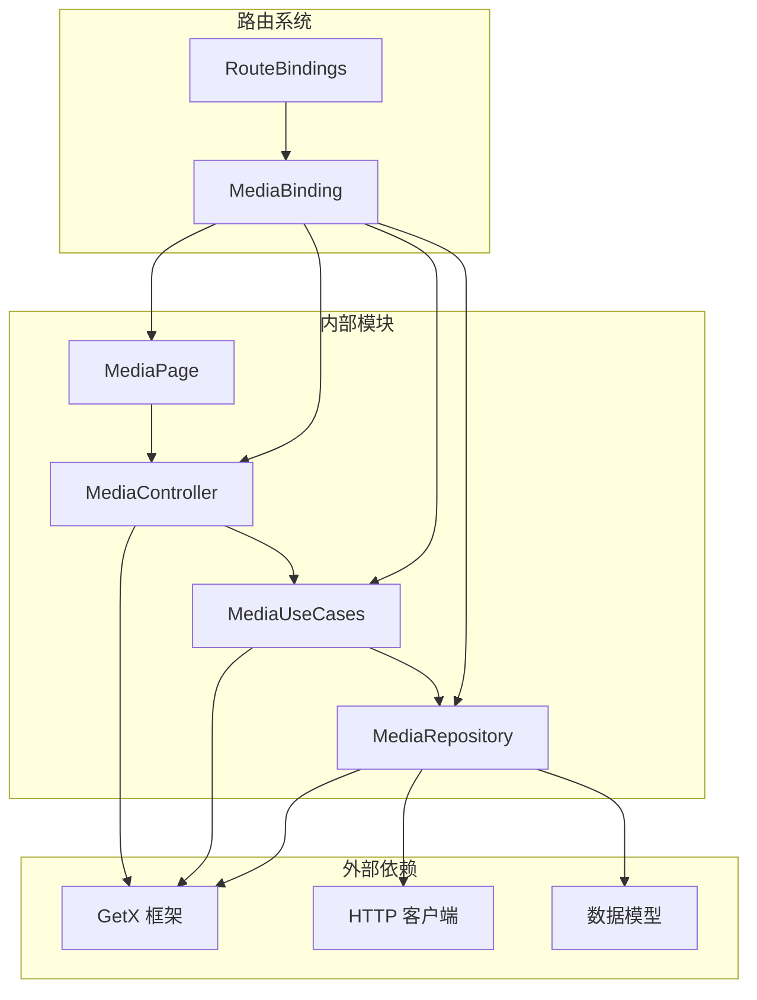

**图表来源**
- [media.dart:1-11](file://lib/features/media/media.dart#L1-L11)
- [bindings.dart:87-98](file://lib/router/bindings.dart#L87-L98)

### 循环依赖检查

经过分析，媒体管理模块没有发现循环依赖：
- 表示层只依赖领域层的接口
- 领域层不依赖表示层
- 数据层独立于其他层
- 路由绑定提供依赖注入，避免直接依赖

**章节来源**
- [media.dart:1-11](file://lib/features/media/media.dart#L1-L11)
- [bindings.dart:87-98](file://lib/router/bindings.dart#L87-L98)

## 性能考虑

媒体管理模块在设计时充分考虑了性能优化：

### 缓存策略
- 使用 GetX 的响应式状态管理减少不必要的重建
- 合理的数据加载时机控制
- 错误状态的快速反馈机制

### 内存管理
- 使用 Rx 状态变量进行细粒度的状态更新
- 及时清理不再使用的数据
- 控制列表数据的加载量

### 网络优化
- API 请求的错误处理和重试机制
- 数据解析的健壮性保证
- 网络状态的实时监控

## 故障排除指南

### 常见问题及解决方案

#### 1. 数据加载失败
**症状**：页面显示加载错误
**原因**：网络请求失败或 API 响应异常
**解决**：检查网络连接，查看错误日志，重试加载

#### 2. 状态不同步
**症状**：UI 显示过期数据
**原因**：状态管理未正确更新
**解决**：确保使用 Rx 状态变量，检查状态更新逻辑

#### 3. 内存泄漏
**症状**：应用内存持续增长
**原因**：控制器未正确释放
**解决**：实现适当的生命周期管理，及时清理订阅

**章节来源**
- [media_controller.dart:55-73](file://lib/features/media/presentation/media_controller.dart#L55-L73)

## 结论

媒体管理模块是一个设计良好、结构清晰的功能模块，具有以下特点：

### 优势
- **清晰的架构分层**：遵循 Clean Architecture 原则，职责分离明确
- **良好的可扩展性**：模块化设计便于功能扩展和维护
- **完善的错误处理**：全面的异常处理和状态管理机制
- **响应式状态管理**：使用 GetX 实现高效的 UI 更新

### 改进建议
- 可以添加更多的单元测试覆盖
- 考虑实现更精细的缓存策略
- 增加更多的性能监控指标
- 扩展对更多媒体类型的处理能力

该模块为 Pilipala 应用提供了坚实的媒体管理基础，为后续的功能扩展和优化奠定了良好的基础。