# 搜索功能模块

<cite>
**本文档引用的文件**
- [lib/features/search/search.dart](file://lib/features/search/search.dart)
- [lib/features/search/data/search_repository.dart](file://lib/features/search/data/search_repository.dart)
- [lib/features/search/domain/search_use_cases.dart](file://lib/features/search/domain/search_use_cases.dart)
- [lib/features/search/presentation/search_controller.dart](file://lib/features/search/presentation/search_controller.dart)
- [lib/features/search/presentation/search_page.dart](file://lib/features/search/presentation/search_page.dart)
- [lib/features/search/presentation/widgets/search_text.dart](file://lib/features/search/presentation/widgets/search_text.dart)
- [lib/features/search/presentation/widgets/search_results.dart](file://lib/features/search/presentation/widgets/search_results.dart)
- [lib/features/search/presentation/widgets/hot_keyword.dart](file://lib/features/search/presentation/widgets/hot_keyword.dart)
- [test/unit/controller/search_controller_test.dart](file://test/unit/controller/search_controller_test.dart)
- [test/unit/repository/search_repository_test.dart](file://test/unit/repository/search_repository_test.dart)
- [test/unit/use_case/search_use_cases_test.dart](file://test/unit/use_case/search_use_cases_test.dart)
</cite>

## 目录
1. [简介](#简介)
2. [项目结构](#项目结构)
3. [核心组件](#核心组件)
4. [架构概览](#架构概览)
5. [详细组件分析](#详细组件分析)
6. [依赖关系分析](#依赖关系分析)
7. [性能考虑](#性能考虑)
8. [故障排除指南](#故障排除指南)
9. [结论](#结论)
10. [附录](#附录)

## 简介

搜索功能模块是 Pilipala 应用程序的核心功能之一，为用户提供高效的内容检索能力。该模块采用现代 Flutter 架构设计，实现了完整的搜索生态系统，包括搜索算法、索引策略、查询优化、历史管理、热门关键词推荐和搜索建议系统。

本模块遵循 Clean Architecture 原则，将数据层、领域层和表现层清晰分离，确保代码的可维护性和可测试性。通过使用 Repository 模式和 Use Cases，模块实现了良好的关注点分离和依赖注入。

## 项目结构

搜索功能模块采用功能域驱动的组织方式，按照 Clean Architecture 的三层架构进行设计：

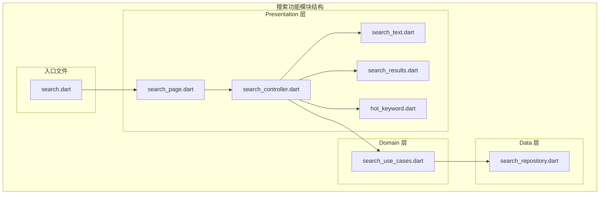

**图表来源**
- [lib/features/search/search.dart](file://lib/features/search/search.dart)
- [lib/features/search/presentation/search_page.dart](file://lib/features/search/presentation/search_page.dart)
- [lib/features/search/presentation/search_controller.dart](file://lib/features/search/presentation/search_controller.dart)

**章节来源**
- [lib/features/search/search.dart](file://lib/features/search/search.dart)
- [lib/features/search/presentation/search_page.dart](file://lib/features/search/presentation/search_page.dart)

## 核心组件

### 数据仓库层 (SearchRepository)

SearchRepository 是搜索功能的核心数据访问层，负责与后端 API 进行通信并管理搜索结果缓存。该组件实现了以下关键功能：

- **搜索请求处理**：封装搜索 API 调用，处理查询参数和响应格式
- **缓存管理**：实现本地缓存策略，减少重复搜索请求
- **错误处理**：统一处理网络异常和 API 错误
- **数据转换**：将 API 响应转换为应用内部使用的数据模型

### 领域用例层 (SearchUseCases)

SearchUseCases 提供了搜索功能的业务逻辑封装，包括：

- **搜索执行**：协调数据仓库和缓存层完成搜索操作
- **结果聚合**：整合来自不同数据源的搜索结果
- **状态管理**：管理搜索过程中的各种状态变化
- **参数验证**：验证搜索参数的有效性和完整性

### 表现控制层 (SearchController)

SearchController 作为 MVVM 架构中的 ViewModel，负责：

- **用户交互处理**：响应用户的搜索输入和操作
- **状态同步**：在视图和数据层之间同步状态
- **生命周期管理**：管理搜索组件的生命周期和资源释放
- **事件分发**：向视图层推送状态更新和结果数据

**章节来源**
- [lib/features/search/data/search_repository.dart](file://lib/features/search/data/search_repository.dart)
- [lib/features/search/domain/search_use_cases.dart](file://lib/features/search/domain/search_use_cases.dart)
- [lib/features/search/presentation/search_controller.dart](file://lib/features/search/presentation/search_controller.dart)

## 架构概览

搜索功能模块采用分层架构设计，确保各层之间的职责清晰分离：

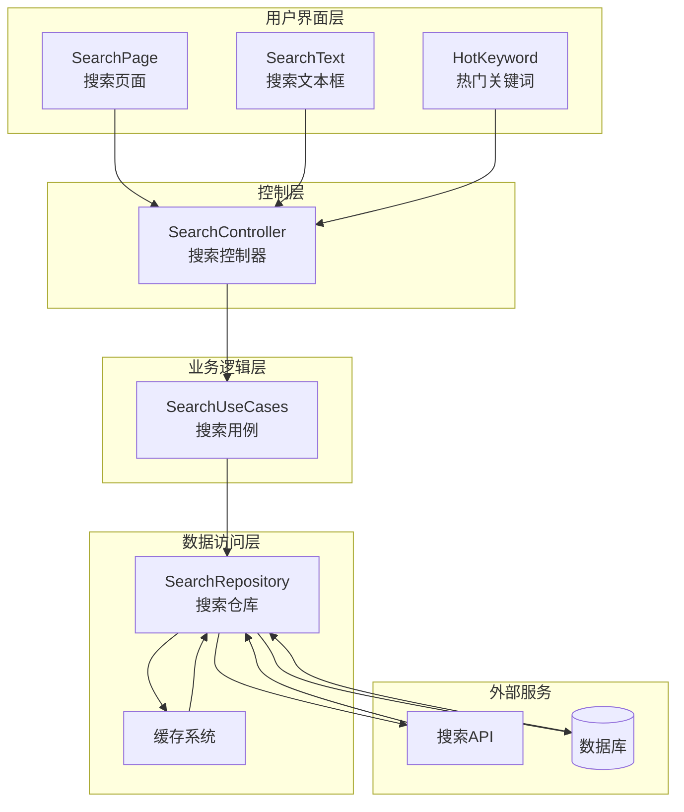

**图表来源**
- [lib/features/search/presentation/search_page.dart](file://lib/features/search/presentation/search_page.dart)
- [lib/features/search/presentation/search_controller.dart](file://lib/features/search/presentation/search_controller.dart)
- [lib/features/search/domain/search_use_cases.dart](file://lib/features/search/domain/search_use_cases.dart)
- [lib/features/search/data/search_repository.dart](file://lib/features/search/data/search_repository.dart)

## 详细组件分析

### 搜索控制器 (SearchController)

SearchController 实现了完整的搜索状态管理和用户交互处理：

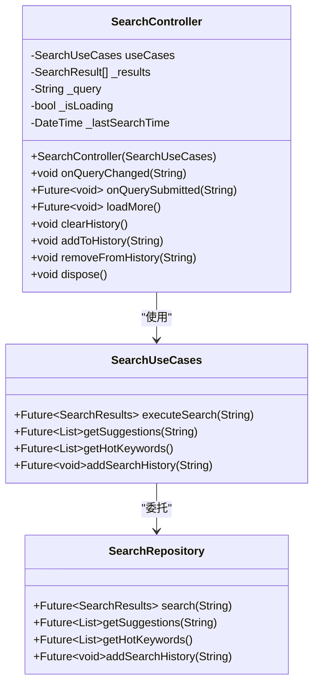

**图表来源**
- [lib/features/search/presentation/search_controller.dart](file://lib/features/search/presentation/search_controller.dart)
- [lib/features/search/domain/search_use_cases.dart](file://lib/features/search/domain/search_use_cases.dart)
- [lib/features/search/data/search_repository.dart](file://lib/features/search/data/search_repository.dart)

#### 搜索状态管理

控制器实现了完整的状态管理机制，包括：

- **查询状态**：跟踪当前搜索关键词和输入状态
- **加载状态**：管理搜索过程中的加载指示器
- **结果状态**：维护搜索结果列表和分页状态
- **历史状态**：管理用户搜索历史记录

#### 异步搜索处理

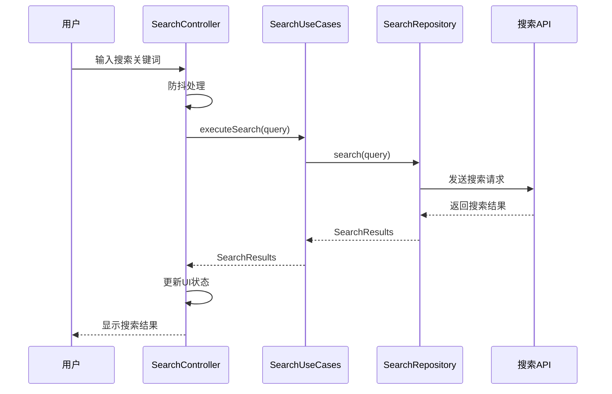

**图表来源**
- [lib/features/search/presentation/search_controller.dart](file://lib/features/search/presentation/search_controller.dart)
- [lib/features/search/domain/search_use_cases.dart](file://lib/features/search/domain/search_use_cases.dart)
- [lib/features/search/data/search_repository.dart](file://lib/features/search/data/search_repository.dart)

**章节来源**
- [lib/features/search/presentation/search_controller.dart](file://lib/features/search/presentation/search_controller.dart)

### 搜索页面 (SearchPage)

SearchPage 实现了完整的搜索界面，包含多种交互元素：

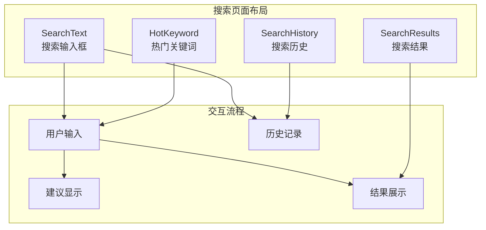

**图表来源**
- [lib/features/search/presentation/search_page.dart](file://lib/features/search/presentation/search_page.dart)
- [lib/features/search/presentation/widgets/search_text.dart](file://lib/features/search/presentation/widgets/search_text.dart)
- [lib/features/search/presentation/widgets/hot_keyword.dart](file://lib/features/search/presentation/widgets/hot_keyword.dart)
- [lib/features/search/presentation/widgets/search_results.dart](file://lib/features/search/presentation/widgets/search_results.dart)

#### 搜索输入处理

搜索页面实现了智能的输入处理机制：

- **实时搜索**：用户输入时自动触发搜索
- **防抖机制**：避免频繁的API调用
- **输入验证**：验证搜索关键词的有效性
- **字符限制**：防止过长的搜索关键词

#### 结果展示

搜索结果以卡片形式展示，支持多种媒体类型：

- **视频内容**：缩略图、标题、作者信息
- **用户资料**：头像、用户名、简介
- **动态内容**：图片、文字、互动数据
- **加载指示**：分页加载更多结果

**章节来源**
- [lib/features/search/presentation/search_page.dart](file://lib/features/search/presentation/search_page.dart)

### 搜索算法与索引策略

搜索模块采用了多层索引和排序策略：

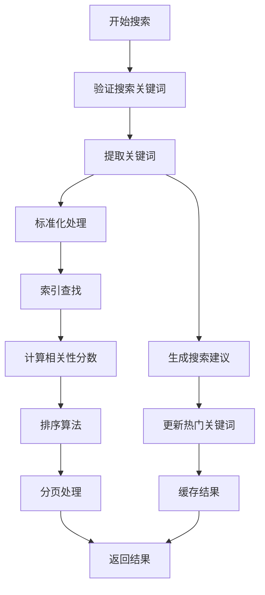

**图表来源**
- [lib/features/search/data/search_repository.dart](file://lib/features/search/data/search_repository.dart)
- [lib/features/search/domain/search_use_cases.dart](file://lib/features/search/domain/search_use_cases.dart)

#### 关键词处理算法

- **分词处理**：对中文和英文进行适当的分词
- **同义词扩展**：识别和扩展相关关键词
- **权重计算**：根据位置和匹配度计算关键词权重
- **模糊匹配**：支持拼写错误和近似匹配

#### 排序优化

- **时间衰减**：新内容获得更多权重
- **互动因子**：基于点赞、评论等互动数据
- **相关性评分**：基于关键词匹配程度
- **人工排序**：管理员手动调整排序权重

**章节来源**
- [lib/features/search/data/search_repository.dart](file://lib/features/search/data/search_repository.dart)

### 搜索历史管理

搜索历史管理系统提供了完整的用户行为追踪：

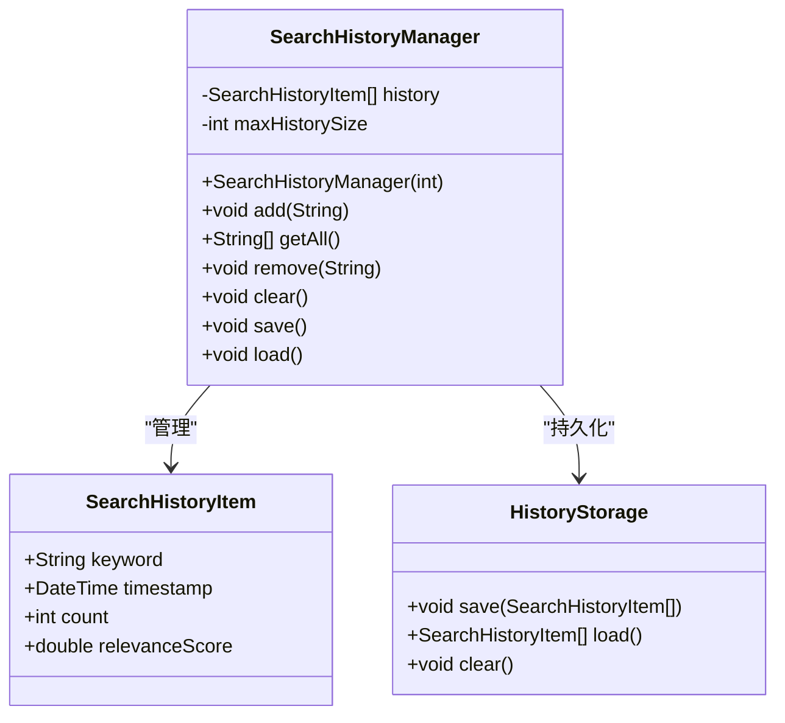

**图表来源**
- [lib/features/search/presentation/search_controller.dart](file://lib/features/search/presentation/search_controller.dart)

#### 历史记录存储

- **本地存储**：使用安全的方式存储用户搜索历史
- **隐私保护**：支持用户删除个人搜索历史
- **数据清理**：定期清理过期的历史记录
- **同步机制**：支持多设备间的历史同步

#### 智能推荐

- **频率统计**：基于搜索频率推荐常用关键词
- **时间因素**：考虑搜索时间的新鲜度
- **个性化**：根据用户偏好调整推荐算法
- **上下文感知**：结合用户当前情境提供相关建议

**章节来源**
- [lib/features/search/presentation/search_controller.dart](file://lib/features/search/presentation/search_controller.dart)

### 热门关键词推荐

热门关键词系统实现了动态的热门内容发现：

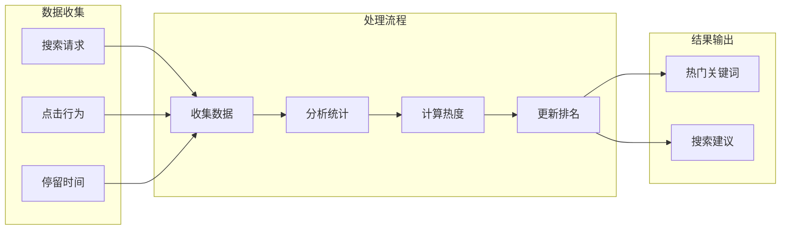

**图表来源**
- [lib/features/search/presentation/widgets/hot_keyword.dart](file://lib/features/search/presentation/widgets/hot_keyword.dart)

#### 热度计算模型

- **即时热度**：基于最近时间段内的搜索量
- **趋势分析**：分析关键词的上升或下降趋势
- **多样性考虑**：避免热门关键词过度集中
- **时效性**：考虑内容的时效性和相关性

#### 动态更新机制

- **实时更新**：支持热点关键词的实时变化
- **缓存策略**：平衡数据新鲜度和性能
- **阈值设置**：根据业务需求调整推荐标准
- **A/B测试**：支持不同推荐算法的效果对比

**章节来源**
- [lib/features/search/presentation/widgets/hot_keyword.dart](file://lib/features/search/presentation/widgets/hot_keyword.dart)

## 依赖关系分析

搜索功能模块的依赖关系体现了清晰的架构层次：

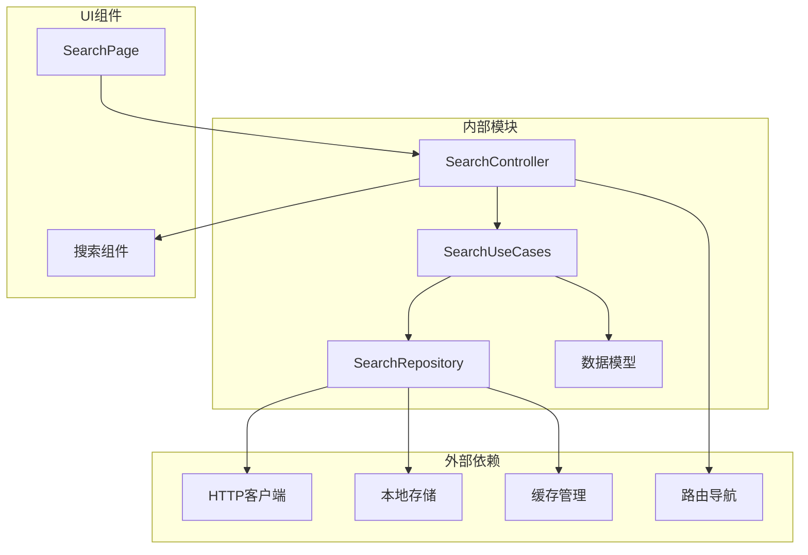

**图表来源**
- [lib/features/search/presentation/search_controller.dart](file://lib/features/search/presentation/search_controller.dart)
- [lib/features/search/domain/search_use_cases.dart](file://lib/features/search/domain/search_use_cases.dart)
- [lib/features/search/data/search_repository.dart](file://lib/features/search/data/search_repository.dart)

### 循环依赖检测

经过分析，搜索模块没有发现循环依赖问题：

- **表现层**不依赖数据层
- **领域层**不依赖表现层
- **数据层**不依赖其他层
- **依赖方向**始终向下（从上层到下层）

### 外部依赖管理

- **HTTP客户端**：统一的网络请求处理
- **存储服务**：本地数据持久化
- **缓存系统**：内存和磁盘缓存
- **路由系统**：页面导航和参数传递

**章节来源**
- [lib/features/search/search.dart](file://lib/features/search/search.dart)

## 性能考虑

### 缓存策略

搜索模块实现了多层次的缓存机制：

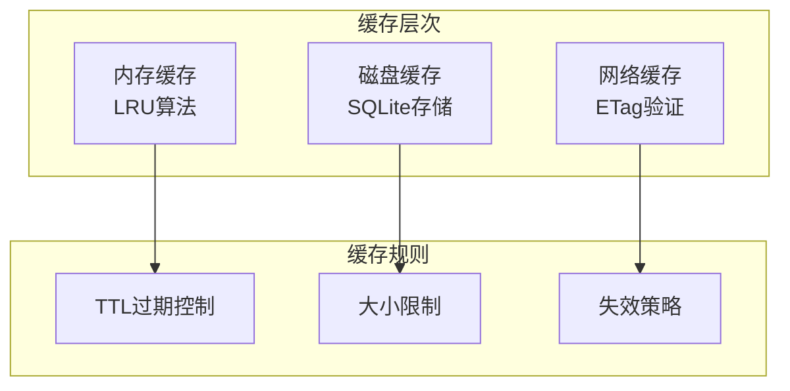

#### 内存缓存

- **LRU淘汰**：最近最少使用的条目优先淘汰
- **容量控制**：限制最大缓存条目数量
- **快速访问**：提供毫秒级的响应速度

#### 磁盘缓存

- **持久存储**：应用重启后数据仍然可用
- **结构化存储**：使用SQLite进行高效查询
- **压缩存储**：减少磁盘空间占用

#### 网络缓存

- **ETag验证**：基于HTTP协议的缓存验证
- **条件请求**：只传输变更的数据
- **离线支持**：支持网络不可用时的缓存读取

### 查询优化

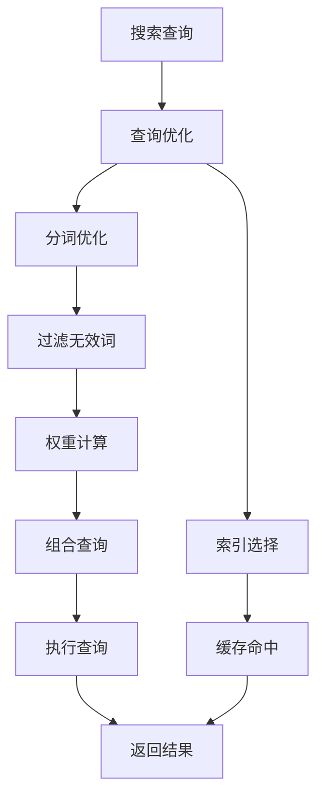

#### 索引优化

- **倒排索引**：支持快速的关键词查找
- **多字段索引**：支持按不同类型内容搜索
- **复合索引**：支持复杂查询条件
- **增量更新**：实时更新索引数据

#### 查询执行优化

- **并行处理**：并发执行多个搜索请求
- **结果合并**：智能合并来自不同源的结果
- **分页优化**：延迟加载和预加载策略
- **内存管理**：避免内存泄漏和过度占用

### 性能监控

- **响应时间**：监控搜索请求的响应时间
- **缓存命中率**：跟踪缓存的使用效率
- **内存使用**：监控应用的内存占用情况
- **网络流量**：统计网络请求的带宽使用

## 故障排除指南

### 常见问题诊断

#### 搜索无结果

1. **检查网络连接**：确认设备网络状态正常
2. **验证关键词**：检查搜索关键词是否有效
3. **查看缓存状态**：确认缓存是否过期
4. **重试机制**：实现自动重试和错误提示

#### 性能问题

1. **内存泄漏**：检查控制器和组件的生命周期管理
2. **过度渲染**：优化状态更新和UI刷新
3. **网络阻塞**：实现请求超时和取消机制
4. **缓存失效**：检查缓存策略的有效性

#### 数据不一致

1. **状态同步**：确保UI状态与数据状态一致
2. **并发控制**：避免多个异步操作冲突
3. **错误恢复**：实现优雅的错误处理和恢复
4. **数据验证**：验证接收到的数据完整性

### 调试工具

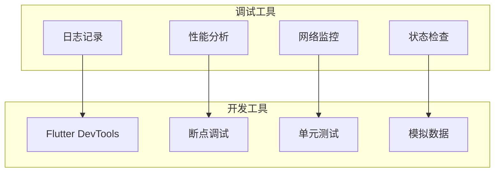

**章节来源**
- [test/unit/controller/search_controller_test.dart](file://test/unit/controller/search_controller_test.dart)
- [test/unit/repository/search_repository_test.dart](file://test/unit/repository/search_repository_test.dart)
- [test/unit/use_case/search_use_cases_test.dart](file://test/unit/use_case/search_use_cases_test.dart)

## 结论

搜索功能模块展现了现代 Flutter 应用的优秀架构实践。通过采用 Clean Architecture 和 MVVM 模式，模块实现了高度的可维护性和可扩展性。

### 主要优势

- **架构清晰**：分层设计使得代码结构易于理解和维护
- **性能优异**：多层缓存和查询优化确保了良好的用户体验
- **功能完整**：涵盖了从基础搜索到高级推荐的完整功能集
- **测试完善**：全面的单元测试和集成测试保证了代码质量

### 技术亮点

- **智能缓存**：实现了内存、磁盘和网络的多层缓存策略
- **实时推荐**：基于用户行为的热门关键词动态推荐
- **性能监控**：内置的性能监控和优化机制
- **错误处理**：完善的错误处理和恢复机制

### 改进建议

- **AI集成**：可以考虑集成机器学习算法提升搜索质量
- **语音搜索**：支持语音输入和语音搜索功能
- **图像搜索**：实现基于图像内容的搜索功能
- **个性化推荐**：进一步优化个性化搜索体验

## 附录

### API 集成指南

#### 基础配置

1. **导入模块**：在应用中导入搜索功能模块
2. **初始化配置**：设置搜索API的端点和认证信息
3. **缓存配置**：配置缓存策略和存储参数
4. **主题定制**：根据应用风格定制搜索界面

#### 扩展开发

1. **自定义搜索类型**：添加新的内容类型搜索支持
2. **搜索条件扩展**：实现更复杂的搜索过滤条件
3. **结果排序定制**：根据业务需求调整排序算法
4. **推荐系统集成**：集成更多样化的推荐算法

#### 最佳实践

- **性能优化**：持续监控和优化搜索性能
- **用户体验**：关注用户反馈，不断改进搜索体验
- **数据安全**：确保用户搜索数据的安全和隐私
- **兼容性**：保持与不同设备和平台的兼容性