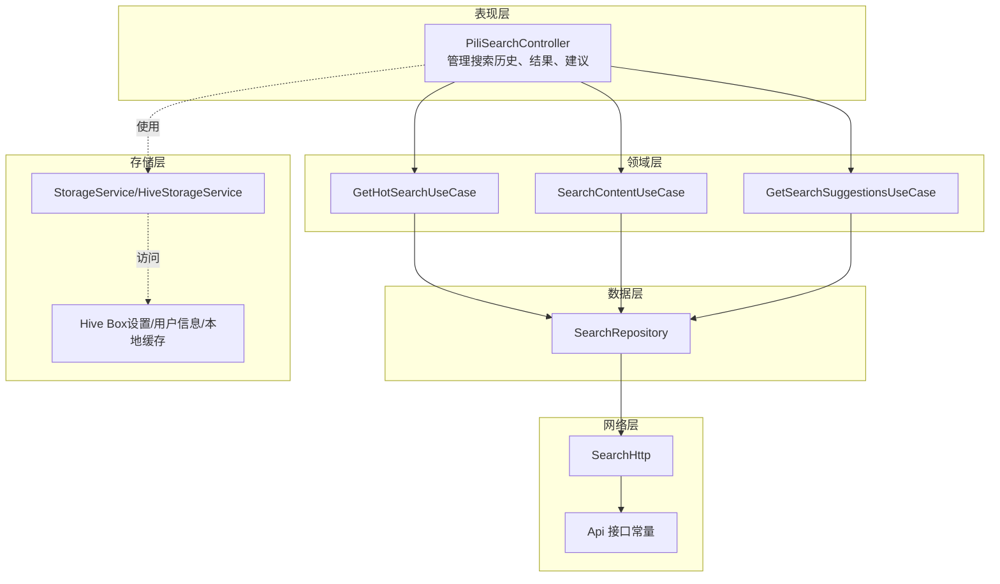
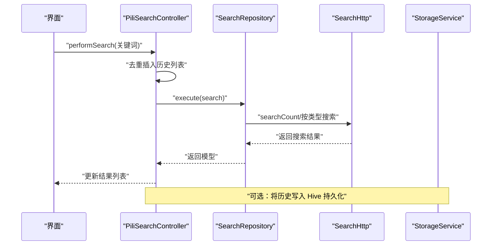
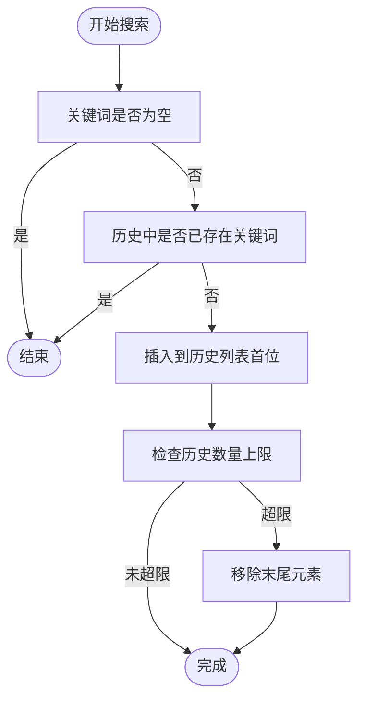
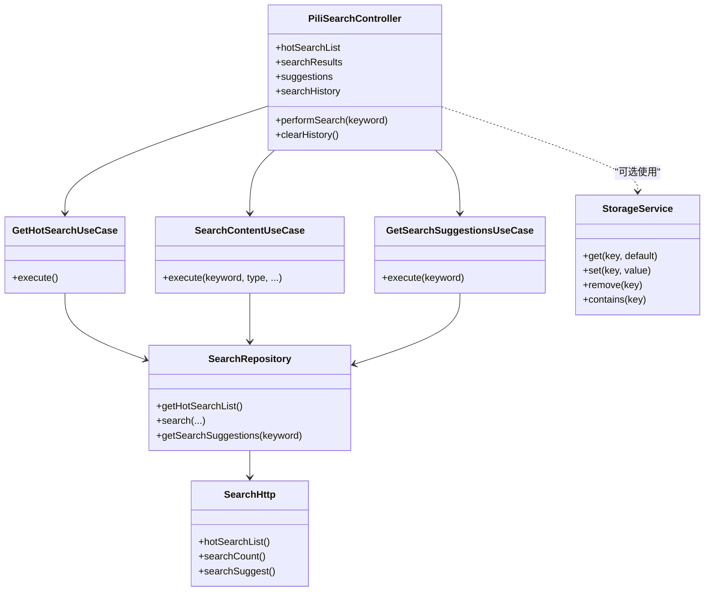

# 搜索历史管理

<cite>
**本文引用的文件**
- [lib/features/search/presentation/search_controller.dart](file://lib/features/search/presentation/search_controller.dart)
- [lib/features/search/data/search_repository.dart](file://lib/features/search/data/search_repository.dart)
- [lib/features/search/domain/search_use_cases.dart](file://lib/features/search/domain/search_use_cases.dart)
- [lib/http/search.dart](file://lib/http/search.dart)
- [lib/core/storage/storage_service.dart](file://lib/core/storage/storage_service.dart)
- [lib/models/search/hot.dart](file://lib/models/search/hot.dart)
- [lib/models/search/result.dart](file://lib/models/search/result.dart)
- [lib/models/search/suggest.dart](file://lib/models/search/suggest.dart)
</cite>

## 目录
1. [简介](#简介)
2. [项目结构](#项目结构)
3. [核心组件](#核心组件)
4. [架构总览](#架构总览)
5. [详细组件分析](#详细组件分析)
6. [依赖关系分析](#依赖关系分析)
7. [性能考量](#性能考量)
8. [故障排查指南](#故障排查指南)
9. [结论](#结论)
10. [附录](#附录)

## 简介
本文件聚焦于“搜索历史管理”的设计与实现，围绕以下目标展开：  
- 搜索历史的存储机制、本地缓存策略与数据持久化  
- 历史记录的增删改查、去重逻辑与存储限制  
- 热门关键词提取、频率统计与推荐排序（当前实现现状与扩展建议）  
- 历史清理、过期处理与用户隐私保护  
- 历史同步、跨设备共享与云端备份（当前实现现状与扩展建议）  
- 功能扩展：标签分类与智能推荐  
- 历史数据的导入导出、批量操作与数据迁移（当前实现现状与扩展建议）

在当前代码库中，搜索历史以内存列表形式存在，未见专门的历史表或持久化键值对；热门关键词与历史记录的统计、排序、去重与限制等能力尚未实现，需通过扩展完成。

## 项目结构
搜索历史相关代码位于“搜索”特性模块，采用典型的分层架构：
- 表现层：控制器负责状态管理与交互逻辑（含搜索历史列表）
- 领域层：用例封装业务规则（热榜、搜索、建议）
- 数据层：仓库对接网络接口与模型转换
- 网络层：HTTP 封装与签名、参数拼装
- 存储层：Hive 抽象服务（用于通用设置与本地缓存）

图表来源
- [lib/features/search/presentation/search_controller.dart:10-124](file://lib/features/search/presentation/search_controller.dart#L10-L124)
- [lib/features/search/domain/search_use_cases.dart:7-73](file://lib/features/search/domain/search_use_cases.dart#L7-L73)
- [lib/features/search/data/search_repository.dart:9-74](file://lib/features/search/data/search_repository.dart#L9-L74)
- [lib/http/search.dart:13-214](file://lib/http/search.dart#L13-L214)
- [lib/core/storage/storage_service.dart:10-64](file://lib/core/storage/storage_service.dart#L10-L64)

章节来源
- [lib/features/search/presentation/search_controller.dart:10-124](file://lib/features/search/presentation/search_controller.dart#L10-L124)
- [lib/features/search/data/search_repository.dart:9-74](file://lib/features/search/data/search_repository.dart#L9-L74)
- [lib/features/search/domain/search_use_cases.dart:7-73](file://lib/features/search/domain/search_use_cases.dart#L7-L73)
- [lib/http/search.dart:13-214](file://lib/http/search.dart#L13-L214)
- [lib/core/storage/storage_service.dart:10-64](file://lib/core/storage/storage_service.dart#L10-L64)

## 核心组件
- 搜索控制器：维护搜索历史列表、关键词、类型、加载与错误状态，并在执行搜索时进行去重插入
- 用例层：封装获取热榜、搜索内容、搜索建议的业务流程
- 仓库层：统一调用网络接口，解析响应并映射到模型
- 网络层：封装请求、签名、参数组装与返回数据结构
- 存储层：提供 Hive 抽象服务，支持设置、用户信息、本地缓存等 Box 的读写

章节来源
- [lib/features/search/presentation/search_controller.dart:10-124](file://lib/features/search/presentation/search_controller.dart#L10-L124)
- [lib/features/search/domain/search_use_cases.dart:7-73](file://lib/features/search/domain/search_use_cases.dart#L7-L73)
- [lib/features/search/data/search_repository.dart:9-74](file://lib/features/search/data/search_repository.dart#L9-L74)
- [lib/http/search.dart:13-214](file://lib/http/search.dart#L13-L214)
- [lib/core/storage/storage_service.dart:10-64](file://lib/core/storage/storage_service.dart#L10-L64)

## 架构总览
搜索历史在当前实现中由控制器内存维护，未与 Hive 持久化直接绑定。建议通过以下方式增强：

图表来源
- [lib/features/search/presentation/search_controller.dart:70-93](file://lib/features/search/presentation/search_controller.dart#L70-L93)
- [lib/features/search/data/search_repository.dart:31-56](file://lib/features/search/data/search_repository.dart#L31-L56)
- [lib/http/search.dart:193-213](file://lib/http/search.dart#L193-L213)
- [lib/core/storage/storage_service.dart:10-64](file://lib/core/storage/storage_service.dart#L10-L64)

## 详细组件分析

### 搜索历史的存储机制与本地缓存策略
- 当前实现：搜索历史保存在控制器的内存列表中，未与 Hive 持久化直接关联
- 建议策略：
  - 引入独立的 Hive Box 用于历史记录存储，键名如“search_history”
  - 在 performSearch 时进行去重插入，并限制最大条数（例如 100 条）
  - 提供定时任务或应用启动时的迁移逻辑，将旧格式历史迁移到新格式
  - 对历史项增加时间戳字段，便于后续过期与排序

章节来源
- [lib/features/search/presentation/search_controller.dart:70-93](file://lib/features/search/presentation/search_controller.dart#L70-L93)
- [lib/core/storage/storage_service.dart:10-64](file://lib/core/storage/storage_service.dart#L10-L64)

### 历史记录的增删改查、去重逻辑与存储限制
- 增：performSearch 中对空关键词进行过滤后，若历史不包含该关键词则插入到首位
- 删：提供清空历史的方法；可扩展按时间或关键词删除
- 改：可扩展为更新最近一次搜索的时间戳或权重
- 查：从内存列表读取；可扩展为按关键词模糊匹配
- 去重：基于包含判断，避免重复插入同一关键词
- 存储限制：当前未设置上限；建议在插入前检查长度并截断尾部

图表来源
- [lib/features/search/presentation/search_controller.dart:70-93](file://lib/features/search/presentation/search_controller.dart#L70-L93)

章节来源
- [lib/features/search/presentation/search_controller.dart:70-93](file://lib/features/search/presentation/search_controller.dart#L70-L93)

### 热门关键词提取、频率统计与推荐排序
- 现状：仓库与控制器未实现频率统计、热门提取与排序
- 建议实现：
  - 统计维度：搜索次数、最近搜索时间、搜索类型偏好
  - 排序策略：加权分数 = 次数权重 + 时间衰减权重 + 类型偏好权重
  - 推荐排序：按综合得分降序排列，输出前 N 个热门词
  - 可选：引入滑动窗口统计（如近 7 天），提升时效性

章节来源
- [lib/features/search/data/search_repository.dart:9-74](file://lib/features/search/data/search_repository.dart#L9-L74)
- [lib/features/search/presentation/search_controller.dart:10-124](file://lib/features/search/presentation/search_controller.dart#L10-L124)

### 历史清理机制、过期处理与用户隐私保护
- 清理机制：提供 clearHistory 方法；可扩展为按天/周/月清理或手动批量删除
- 过期处理：为历史项增加过期时间戳，定期扫描清理过期项
- 隐私保护：提供一键清除历史开关；在设置中默认关闭敏感数据收集；导出数据时去除可识别信息

章节来源
- [lib/features/search/presentation/search_controller.dart:110-118](file://lib/features/search/presentation/search_controller.dart#L110-L118)

### 历史同步、跨设备共享与云端备份
- 现状：未发现跨设备同步或云端备份逻辑
- 建议方案：
  - 同步：登录态下，将历史上传至服务端，应用启动时拉取并合并本地历史
  - 共享：提供开关控制是否参与同步；冲突时采用时间戳或服务端优先策略
  - 备份：支持导出为 JSON，包含关键词、时间戳、类型等字段；恢复时进行去重与上限控制

章节来源
- [lib/http/search.dart:13-214](file://lib/http/search.dart#L13-L214)

### 扩展历史功能：标签分类与智能推荐
- 标签分类：为历史项增加标签字段（如“娱乐”“学习”），支持按标签筛选与统计
- 智能推荐：结合热门词、搜索类型分布与用户行为，生成个性化推荐词

章节来源
- [lib/features/search/presentation/search_controller.dart:10-124](file://lib/features/search/presentation/search_controller.dart#L10-L124)

### 导入导出、批量操作与数据迁移
- 导入：读取外部 JSON 文件，逐条去重插入并校验格式
- 导出：遍历历史列表，输出为 JSON，包含关键词、时间戳、类型等
- 批量操作：支持全选删除、按标签批量删除、按时间范围清理
- 数据迁移：版本升级时，将旧格式历史转换为新格式并补齐缺失字段

章节来源
- [lib/core/storage/storage_service.dart:10-64](file://lib/core/storage/storage_service.dart#L10-L64)

## 依赖关系分析
- 控制器依赖三个用例，用例依赖仓库，仓库依赖网络层
- 存储服务抽象与 Hive Box 解耦，便于替换与测试
- 模型层提供热榜、结果、建议的数据结构

图表来源
- [lib/features/search/presentation/search_controller.dart:10-124](file://lib/features/search/presentation/search_controller.dart#L10-L124)
- [lib/features/search/domain/search_use_cases.dart:7-73](file://lib/features/search/domain/search_use_cases.dart#L7-L73)
- [lib/features/search/data/search_repository.dart:9-74](file://lib/features/search/data/search_repository.dart#L9-L74)
- [lib/http/search.dart:13-214](file://lib/http/search.dart#L13-L214)
- [lib/core/storage/storage_service.dart:10-64](file://lib/core/storage/storage_service.dart#L10-L64)

章节来源
- [lib/features/search/presentation/search_controller.dart:10-124](file://lib/features/search/presentation/search_controller.dart#L10-L124)
- [lib/features/search/domain/search_use_cases.dart:7-73](file://lib/features/search/domain/search_use_cases.dart#L7-L73)
- [lib/features/search/data/search_repository.dart:9-74](file://lib/features/search/data/search_repository.dart#L9-L74)
- [lib/http/search.dart:13-214](file://lib/http/search.dart#L13-L214)
- [lib/core/storage/storage_service.dart:10-64](file://lib/core/storage/storage_service.dart#L10-L64)

## 性能考量
- 内存占用：历史列表应限制长度，避免无限增长导致内存压力
- 去重成本：使用集合结构或二分查找优化去重判断
- I/O 开销：持久化写入建议异步批处理，避免阻塞主线程
- 网络开销：搜索建议与热门词应启用缓存与节流，减少重复请求

## 故障排查指南
- 搜索无结果：检查仓库返回的状态码与消息，确认网络层参数拼装正确
- 历史不显示：确认控制器初始化是否加载了历史，以及去重逻辑是否误判
- 建议加载失败：检查网络层返回结构与用例异常处理
- 存储异常：核对 Hive Box 是否初始化成功，键名是否一致

章节来源
- [lib/features/search/data/search_repository.dart:15-29](file://lib/features/search/data/search_repository.dart#L15-L29)
- [lib/features/search/domain/search_use_cases.dart:14-22](file://lib/features/search/domain/search_use_cases.dart#L14-L22)
- [lib/http/search.dart:15-37](file://lib/http/search.dart#L15-L37)

## 结论
当前搜索历史以内存列表形式存在，具备基础的去重插入与清空能力，但缺少持久化、统计、排序与同步机制。建议通过引入 Hive 持久化、完善频率统计与推荐排序、实现跨设备同步与隐私保护，逐步构建完整的搜索历史管理体系，并为后续标签分类与智能推荐奠定基础。

## 附录
- 模型参考：热榜、结果、建议模型定义位于对应目录，用于数据结构映射与验证
- 存储工厂：可通过 StorageServiceFactory 创建不同用途的存储实例，便于扩展

章节来源
- [lib/models/search/hot.dart](file://lib/models/search/hot.dart)
- [lib/models/search/result.dart](file://lib/models/search/result.dart)
- [lib/models/search/suggest.dart](file://lib/models/search/suggest.dart)
- [lib/core/storage/storage_service.dart:52-64](file://lib/core/storage/storage_service.dart#L52-L64)