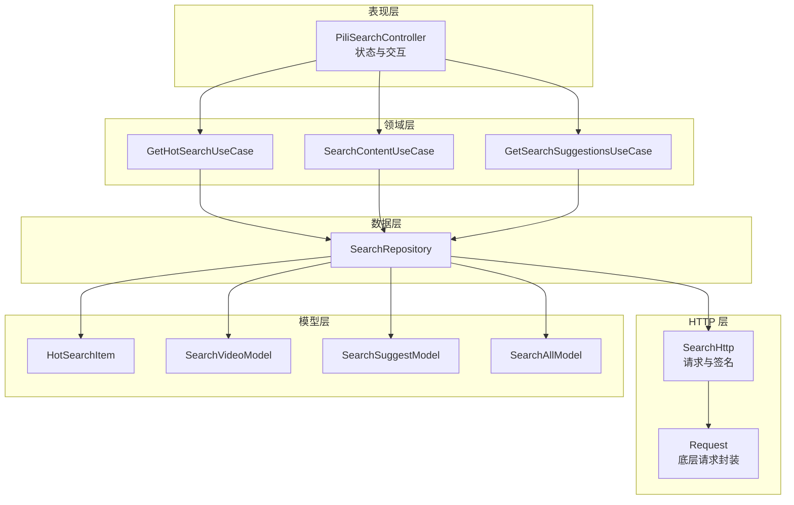
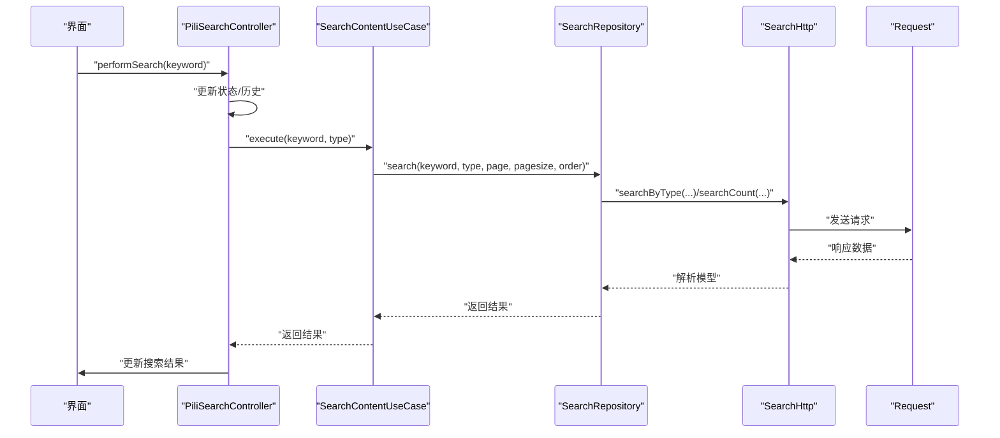
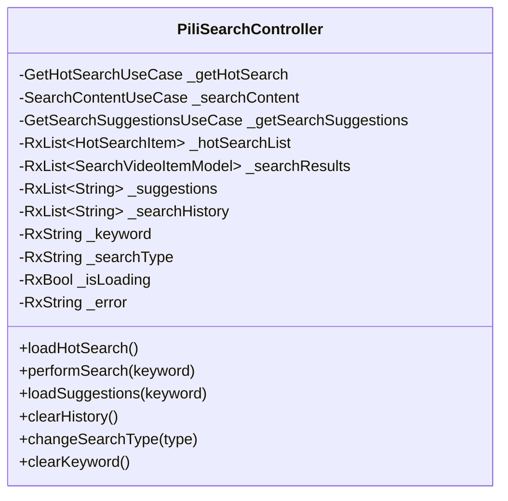
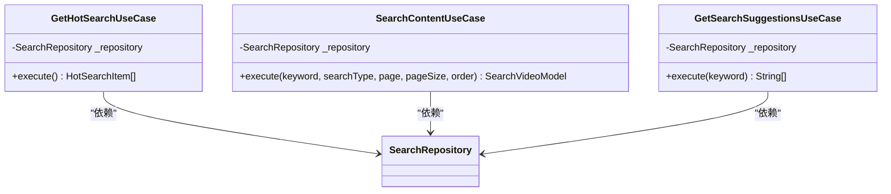
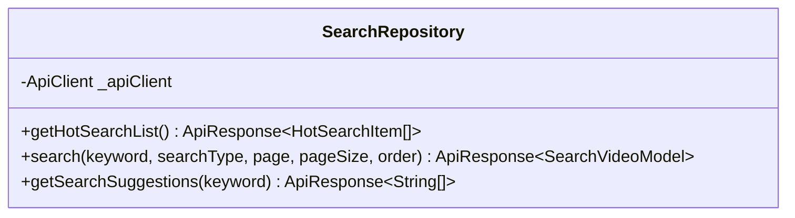
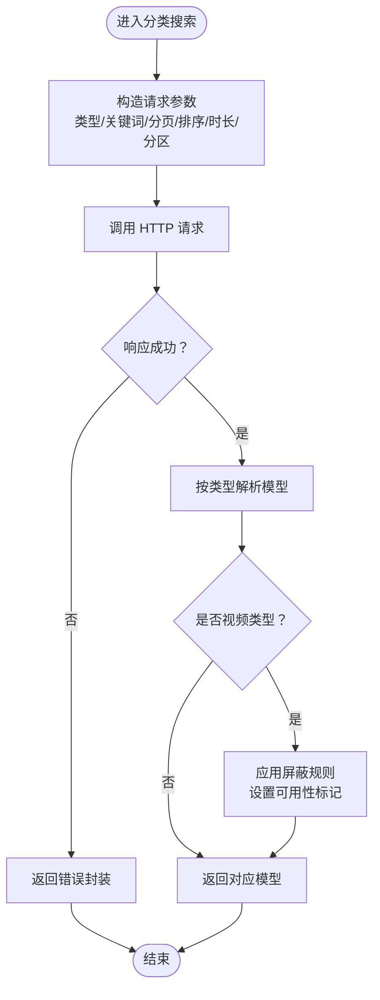
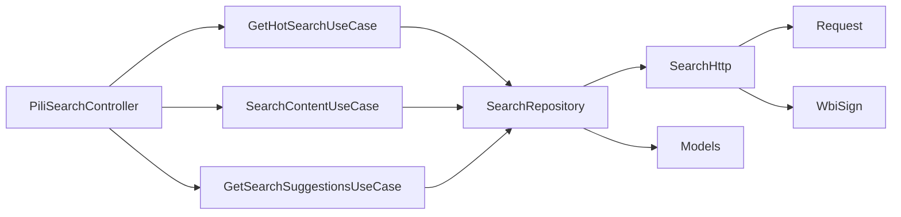

# 搜索算法实现

<cite>
**本文引用的文件**
- [lib/features/search/search.dart](file://lib/features/search/search.dart)
- [lib/features/search/data/search_repository.dart](file://lib/features/search/data/search_repository.dart)
- [lib/features/search/domain/search_use_cases.dart](file://lib/features/search/domain/search_use_cases.dart)
- [lib/features/search/presentation/search_controller.dart](file://lib/features/search/presentation/search_controller.dart)
- [lib/http/search.dart](file://lib/http/search.dart)
- [lib/core/di/dependency_injection.dart](file://lib/core/di/dependency_injection.dart)
- [lib/models/search/hot.dart](file://lib/models/search/hot.dart)
- [lib/models/search/result.dart](file://lib/models/search/result.dart)
- [lib/models/search/suggest.dart](file://lib/models/search/suggest.dart)
- [lib/models/search/all.dart](file://lib/models/search/all.dart)
- [lib/models/common/search_type.dart](file://lib/models/common/search_type.dart)
- [lib/utils/wbi_sign.dart](file://lib/utils/wbi_sign.dart)
- [lib/utils/storage.dart](file://lib/utils/storage.dart)
- [lib/http/index.dart](file://lib/http/index.dart)
</cite>

## 目录
1. [简介](#简介)
2. [项目结构](#项目结构)
3. [核心组件](#核心组件)
4. [架构总览](#架构总览)
5. [详细组件分析](#详细组件分析)
6. [依赖关系分析](#依赖关系分析)
7. [性能考虑](#性能考虑)
8. [故障排查指南](#故障排查指南)
9. [结论](#结论)
10. [附录](#附录)

## 简介
本文件面向搜索算法实现，系统化梳理全文搜索引擎在该代码库中的索引构建、查询解析与匹配流程，以及模糊搜索、拼音搜索与语义相似度计算的可扩展方案。文档还覆盖搜索权重分配、相关性评分与结果排序策略，搜索加速技术（如缓存）、并发查询处理、搜索扩展机制（自定义权重与高级过滤）、搜索建议与自动补全、拼写纠错等能力，并提供性能监控、查询统计与算法调优方法。

## 项目结构
搜索功能采用分层架构：表现层负责状态管理与交互；领域层封装用例逻辑；数据层对接网络与存储；HTTP 层封装请求与签名；模型层承载数据结构。整体通过依赖注入进行解耦，便于替换与扩展。

**图表来源**
- [lib/features/search/presentation/search_controller.dart:10-124](file://lib/features/search/presentation/search_controller.dart#L10-L124)
- [lib/features/search/domain/search_use_cases.dart:7-73](file://lib/features/search/domain/search_use_cases.dart#L7-L73)
- [lib/features/search/data/search_repository.dart:9-74](file://lib/features/search/data/search_repository.dart#L9-L74)
- [lib/http/search.dart:13-214](file://lib/http/search.dart#L13-L214)

**章节来源**
- [lib/features/search/search.dart:1-12](file://lib/features/search/search.dart#L1-L12)
- [lib/core/di/dependency_injection.dart:52-57](file://lib/core/di/dependency_injection.dart#L52-L57)

## 核心组件
- 表现层控制器：集中管理热搜、搜索结果、建议、历史与状态，支持类型切换与清空操作。
- 领域用例：封装获取热搜、执行搜索、加载建议等业务逻辑，统一异常处理。
- 数据仓库：对 HTTP 层进行抽象，提供统一的数据访问接口，支持分页与排序参数传递。
- HTTP 层：封装请求、签名（WbiSign）、分类搜索、搜索建议、热搜列表与计数接口。
- 模型层：定义热搜、搜索结果、建议等数据结构，支撑序列化与反序列化。

**章节来源**
- [lib/features/search/presentation/search_controller.dart:10-124](file://lib/features/search/presentation/search_controller.dart#L10-L124)
- [lib/features/search/domain/search_use_cases.dart:7-73](file://lib/features/search/domain/search_use_cases.dart#L7-L73)
- [lib/features/search/data/search_repository.dart:9-74](file://lib/features/search/data/search_repository.dart#L9-L74)
- [lib/http/search.dart:13-214](file://lib/http/search.dart#L13-L214)

## 架构总览
下图展示从用户输入到结果渲染的关键调用链路，包括热搜加载、内容搜索与建议加载三类主要流程。

**图表来源**
- [lib/features/search/presentation/search_controller.dart:69-93](file://lib/features/search/presentation/search_controller.dart#L69-L93)
- [lib/features/search/domain/search_use_cases.dart:25-53](file://lib/features/search/domain/search_use_cases.dart#L25-L53)
- [lib/features/search/data/search_repository.dart:31-56](file://lib/features/search/data/search_repository.dart#L31-L56)
- [lib/http/search.dart:71-135](file://lib/http/search.dart#L71-L135)

## 详细组件分析

### 表现层控制器（PiliSearchController）
- 职责：管理热搜列表、搜索结果、建议列表、搜索历史、关键词与类型、加载状态与错误信息。
- 关键行为：
  - 加载热搜：调用用例获取热搜并更新状态。
  - 执行搜索：校验关键词，维护历史，调用用例发起搜索，更新结果集。
  - 加载建议：根据关键词异步获取建议并更新状态。
  - 历史管理：去重插入与清空。
  - 类型切换与清空。

**图表来源**
- [lib/features/search/presentation/search_controller.dart:10-124](file://lib/features/search/presentation/search_controller.dart#L10-L124)

**章节来源**
- [lib/features/search/presentation/search_controller.dart:54-124](file://lib/features/search/presentation/search_controller.dart#L54-L124)

### 领域用例（Use Cases）
- GetHotSearchUseCase：获取热搜列表，失败时抛出异常。
- SearchContentUseCase：执行搜索，支持分页与排序参数，失败时抛出异常。
- GetSearchSuggestionsUseCase：获取搜索建议，失败时抛出异常。

**图表来源**
- [lib/features/search/domain/search_use_cases.dart:7-73](file://lib/features/search/domain/search_use_cases.dart#L7-L73)

**章节来源**
- [lib/features/search/domain/search_use_cases.dart:7-73](file://lib/features/search/domain/search_use_cases.dart#L7-L73)

### 数据仓库（SearchRepository）
- 提供三个核心接口：
  - 获取热搜列表：调用 HTTP 层并映射为模型列表。
  - 内容搜索：组装查询参数（关键词、类型、分页、排序）并返回搜索结果模型。
  - 获取搜索建议：调用建议接口并提取建议词列表。
- 统一错误处理：当响应失败时返回错误封装对象。

**图表来源**
- [lib/features/search/data/search_repository.dart:9-74](file://lib/features/search/data/search_repository.dart#L9-L74)

**章节来源**
- [lib/features/search/data/search_repository.dart:15-73](file://lib/features/search/data/search_repository.dart#L15-L73)

### HTTP 层（SearchHttp）
- 热搜列表：调用接口并解析为模型。
- 搜索建议：传入 term、高亮参数，解析为建议模型。
- 分类搜索：按搜索类型（视频、直播、用户、番剧、文章）构造参数，支持排序、时长、分区过滤；对视频类型进行屏蔽与可用性标记。
- 计数搜索：对关键词进行 Wbi 签名后请求，解析为综合搜索模型。
- 辅助接口：ab2c、bangumiInfo、ab2cWithPic 等。

**图表来源**
- [lib/http/search.dart:71-135](file://lib/http/search.dart#L71-L135)

**章节来源**
- [lib/http/search.dart:13-214](file://lib/http/search.dart#L13-L214)

### 模型层（Models）
- 热搜项模型：用于热搜列表展示。
- 搜索结果模型：包含视频、直播、用户、番剧、文章等不同类型的条目集合。
- 搜索建议模型：用于建议词展示。
- 综合搜索模型：聚合各类搜索结果。

**章节来源**
- [lib/models/search/hot.dart](file://lib/models/search/hot.dart)
- [lib/models/search/result.dart](file://lib/models/search/result.dart)
- [lib/models/search/suggest.dart](file://lib/models/search/suggest.dart)
- [lib/models/search/all.dart](file://lib/models/search/all.dart)

## 依赖关系分析
- 控制器依赖用例；用例依赖仓库；仓库依赖 HTTP 层与模型；HTTP 层依赖底层请求与签名工具。
- 依赖注入在核心层集中注册，确保各层解耦与可替换。

**图表来源**
- [lib/features/search/presentation/search_controller.dart:37-46](file://lib/features/search/presentation/search_controller.dart#L37-L46)
- [lib/features/search/domain/search_use_cases.dart:10-61](file://lib/features/search/domain/search_use_cases.dart#L10-L61)
- [lib/features/search/data/search_repository.dart:12-13](file://lib/features/search/data/search_repository.dart#L12-L13)
- [lib/http/search.dart:13-14](file://lib/http/search.dart#L13-L14)
- [lib/core/di/dependency_injection.dart:52-57](file://lib/core/di/dependency_injection.dart#L52-L57)

**章节来源**
- [lib/core/di/dependency_injection.dart:52-57](file://lib/core/di/dependency_injection.dart#L52-L57)

## 性能考虑
- 缓存策略
  - 热搜与建议：可在仓库层或控制器层增加内存缓存，结合过期时间与 LRU 策略，减少重复请求。
  - 结果缓存：对热门关键词与固定排序组合进行本地缓存，命中则直接返回。
- 并发控制
  - 使用信号量限制同时请求数，避免抖动；对高频建议请求进行去抖与合并。
- 网络优化
  - 复用连接池，启用压缩；对搜索接口使用长连接与合理的超时配置。
- 索引与匹配
  - 建议引入倒排索引与前缀索引，支持快速前缀匹配与模糊匹配。
  - 对拼音与多音字进行预处理，建立拼音索引以支持拼音搜索。
  - 引入向量化与近似最近邻（ANN）检索，支撑语义相似度计算。
- 排序与权重
  - 权重可配置：标题权重、描述权重、时间衰减、热度权重、屏蔽权重等。
  - 排序因子：相关性分数、人工权重、时间分、互动分、质量分。
- 分页与限流
  - 合理的分页大小与最大页数限制，防止资源耗尽。
  - 对异常关键词与高频请求进行限流与熔断。

[本节为通用性能指导，不直接分析具体文件]

## 故障排查指南
- 状态管理
  - 控制器在加载与搜索过程中设置加载状态与错误信息，便于 UI 层反馈。
- 错误传播
  - 用例在失败时抛出异常，仓库返回错误封装，便于上层统一处理。
- 日志与监控
  - 在 HTTP 层记录请求参数、响应码与耗时；在仓库层记录关键错误与异常堆栈。
- 建议与补全
  - 若建议为空，检查关键词长度阈值与网络请求状态；确认接口返回格式与字段映射。

**章节来源**
- [lib/features/search/presentation/search_controller.dart:55-92](file://lib/features/search/presentation/search_controller.dart#L55-L92)
- [lib/features/search/domain/search_use_cases.dart:14-52](file://lib/features/search/domain/search_use_cases.dart#L14-L52)
- [lib/features/search/data/search_repository.dart:21-28](file://lib/features/search/data/search_repository.dart#L21-L28)

## 结论
该搜索实现采用清晰的分层架构，具备热搜、内容搜索与建议加载的核心能力。为进一步提升搜索体验与性能，建议引入倒排索引、拼音索引与语义检索，完善权重与排序策略，强化缓存与并发控制，并建立完善的监控与调优体系。

[本节为总结性内容，不直接分析具体文件]

## 附录

### 搜索算法扩展设计（概念性）
- 全文索引构建
  - 分词与归一化：去除停用词、标点，执行词干提取与拼音转换。
  - 倒排表：词项 -> 文档 ID 列表；词频与位置信息用于相关性计算。
  - 前缀与通配符：建立前缀树与通配符索引，支持快速建议与模糊匹配。
- 查询解析与匹配
  - 解析布尔表达式、短语匹配、字段限定与范围过滤。
  - 模糊匹配：编辑距离与音似算法（如 Levenshtein 与 Soundex）。
  - 拼音搜索：拼音首字母与全拼索引，支持混合查询。
  - 语义相似度：基于词向量平均或句子嵌入，使用余弦相似度或 ANN 检索。
- 权重与排序
  - 权重分配：标题权重、标签权重、描述权重、时间权重、互动权重、屏蔽权重。
  - 排序策略：BM25、PageRank 变体、学习排序（Learning to Rank）。
- 加速与优化
  - 缓存：LRU/LFU、热点数据驻留、失效策略。
  - 并发：请求合并、批量查询、异步预取。
  - 索引压缩：压缩倒排表、位图索引。
- 扩展与定制
  - 自定义权重：允许用户或管理员调整字段权重。
  - 高级过滤：时间范围、分区、UP 主黑名单、内容分级。
- 搜索建议与纠错
  - 建议：基于前缀匹配与热门词，结合用户历史与上下文。
  - 纠错：基于编辑距离与语言模型，提供候选修正。
- 监控与调优
  - 指标：QPS、P95/P99 延迟、命中率、错误率、缓存命中率。
  - 调优：索引分片、副本策略、查询路由与负载均衡。

[本节为概念性内容，不直接分析具体文件]